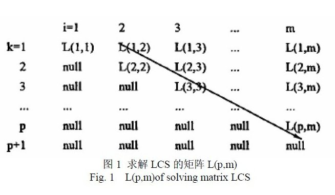
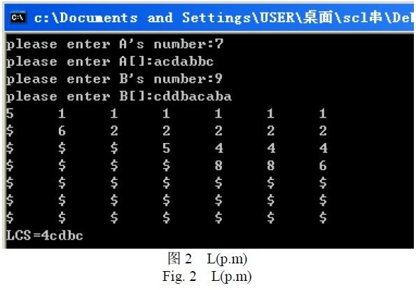

Chapter 11: Longest Common Subsequence 
===========

## 1. Introduction
What is this so-called longest common subsequence (LCS)? Given a sequence S, if it is a subsequence of two or more sequences, and it is also the longest one among these sequences, then S is the LCS of these sequences.

For example, given two random sequences: 1 3 4 5 5, and 2 4 5 5 7 6, their LCS is: 4 5 5.

There is another confusing concept called 'longest common substring', please pay attention to the difference between 'longest common substring' and 'longest common subsequence': a substring is a continual part of the original sequence, which means every element in the substring has to be adjacent in the original one; but a subsequence just needs to keep the order, the elements do not need to be adjacent. For example, for strings 'acdfg' and 'akdfc', their longest common substring is 'df', and longest common subsequence is 'adf'. The LCS problem can be solved using Dynamic Programming as described below.

## 2. Solution Ideas

* Brute Force    
  Brute force is the easiest algorithm that comes to our mind. For every subsequence of sequence X, check if it is the subsequence of sequence Y, therefore identify whether it is a common subsequence of X and Y, and record the longest one during this procedure. After all the subsequences of X is examined, we get the LCS of X and Y. For a sequence X with m elements, denoted by index as {1,2,...,m}, its subsequence can be denoted as a subsequence of {1,2,...,m}. We can infer from this that X has 2^m subsequences, so the complexity of brute force is exponential (2^n).

* Dynamic Programming    
  We notice that the LCS problem has the *optimal substructure* attribute.  
  For X with m elements and Y with n elements, denote:  
    `Xi = <x1,x2,...,xi>`, first i elements of sequence X (1 ≤ i ≤ m)  
    `Yj = <y1,y2,...,yj>`, first j elements of sequence Y (1 ≤ j ≤ n)  
  Assume `Z = <z1,z2,...,zk> ∈ LCS(X, Y)`.  
    If xm = yn (the last element of X and Y is the same), then it is not difficult to prove that this element must also be the last element of Z, i.e. zk = xm = yn. And obviously, Zk-1 ∈ LCS(Xm-1, Yn-1), so the original problem is reduced to find LCS(Xm-1,Yn-1), then plus xm; and the length of LCS(X, Y) is length(LCS(Xm-1, Yn-1)) + 1;    
    If xm ≠ yn, we can also prove either Z ∈ LCS(Xm-1, Y), or Z ∈ LCS(X, Yn-1). Now the problem reduce to find the LCS(Xm-1, Y) and LCS(X, Yn-1), and pick the longer one. The length of LCS(X,Y) is max{length(LCS(Xm-1,Y)), length(LCS(X,Yn-1))}.

In the situation when xm ≠ yn, we need to compute the length of LCS(Xm-1, Y) and LCS(X, Yn-1), which both depend on the length of LCS(Xm-1, Yn-1). Furthermore, LCS(X, Y) must contain LCS(Xi, Yj), so this problem has the optimal substructure attribute and therefore we can try Dynamic Programming.

In all, you need 3 things to solve this LCS problem:  

1. `LCS(Xm-1, Yn-1)+1;`
2. `LCS(Xm-1, Y), LCS(X, Yn-1);`
3. `max{length(LCS(Xm-1, Y), length(LCS(X, Yn-1)}.`

I will try to detail the algorithm next.

## 3. Dynamic Programming Solution For LCS

### 3.1 Stucture of LCS problem

The structure of LCS can be represented as below:  

    Denote a LCS of sequence X=<x1,x2,...,xm> and Y=<y1,y2,...,yn> as Z=<z1,z2,...,zk>, we have:  
        a. if xm=yn, then zk=xm=yn and Zk-1 is the LCS of Xm-1 and Yn-1;
        b. if xm≠yn and zk≠xm, then Z is the LCS of Xm-1 and Yn;
        c. if xm≠yn and zk≠yn, then Z is the LCS of X and Yn-1;
    Note: Xm-1=<x1,x2,...,xm-1>, Yn-1=<y1,y2,...,yn-1>, Zk-1=<z1,z2,...,zk-1>.

###3.2 Recursive Structure of the Subproblem

From the optimal substructure stated in the previous subsection, we know that, to find the LCS of X and Y, we just need to go through the following procedure:  
if xm=yn, find the LCS of Xm-1 and Yn-1 and then append xm (or yn);    
if xm≠yn, find the LCS of Xm-1 and Y, and the LCS of X and Yn-1, then pick the longer one.

We can see a *overlapping subproblems* attribute from this recursive structure. For example, when finding the LCS of X and Y, we may need to find the LCS of X and Yn-1 and the LCS of Xn-1 and Y first; and these two both depend on one subproblem, to find the LCS of Xm-1 and Yn-1.

So let us build the recursive relations among the optimal values of the subproblems.   
Denote c[i,j] as the length of Xi and Yj. When i=0 or j=0, the LCS of Xi and Yj is an empty sequence, so c[i,j]=0, otherwise the recursive relation can be defined as:  


### 3.3 Computing the Optimal Value (length of the LCS)

Using the recursive formula defined above, we can easily contrive an algorithm to compute c[i,j], but the execution time will grow exponentially with the length of input. Since there are only θ(m*n) subproblems in the subporblem space, we can use the bottom-up approach to improve efficiency.

The LCS_LENGTH(X,Y) algorithm takes X=< x1,x2,...,xm > and Y=< y1,y2,...,yn > as inputs and then outputs two matrices c[0..m, 0..n] and b[1..m, 1..n]; c[i,j] stores the length of LCS(Xi, Yj), and b[i,j] stores where c[i,j] gets its value from (this will be explained later). At the end of the algorithm, the length of LCS(X,Y) will be stored at c[m,n].
```
Procedure LCS_LENGTH(X,Y);  
begin  
  m:=length[X];  
  n:=length[Y];  
  for i:=1 to m do c[i,0]:=0;  
  for j:=1 to n do c[0,j]:=0;  
  for i:=1 to m do  
    for j:=1 to n do  
      if x[i]=y[j] then  
        begin  
          c[i,j]:=c[i-1,j-1]+1;  
          b[i,j]:="↖";  
        end  
      else if c[i-1,j]≥c[i,j-1] then  
        begin  
          c[i,j]:=c[i-1,j];  
          b[i,j]:="↑";  
        end  
      else  
        begin  
          c[i,j]:=c[i,j-1];  
          b[i,j]:="←"  
        end;  
  return(c,b);  
end;   
```

The complexity for computing each entry in the matrix is O(1), and as there are m * n entries altogether, the complexity of LCS_LENGTH is O(mn).

### 3.4 Construct the LCS  
With the help of matirx b from LCS_LENGTH, we can construct the LCS of X and Y. Starting from b[m,n], we can navigate the matrix according to the direction of each 'arrow':
  * when b[i,j]='↖', it means xi=yi is an element of LCS(Xi,Yj), i.e., LCS(Xi,Yj) is LCS(Xi-1,Yj-1) appends xi (or yj);
  * when b[i,j]='↑', it means LCS(Xi,Yj) is the same as LCS(Xi-1,Yj);
  * when b[i,j]='←', it means LCS(Xi,Yj) is the same as LCS(Xi,Yj-1).

This approach traces each element of the LCS of Xi and Yj reversely, The algorithm LCS(b,X,i,j) below will print out the LCS of Xi and Yj. Calling LCS(b,X, length(X), length(Y)) will print out the LCS of X and Y.
```
Procedure LCS(b,X,i,j);  
begin  
  if i=0 or j=0 then return;  
  if b[i,j]="↖" then  
    begin  
      LCS(b,X,i-1,j-1);  
      print(x[i]);
    end  
  else if b[i,j]="↑" then LCS(b,X,i-1,j)   
                      else LCS(b,X,i,j-1);  
end;   
```

In this procedure, each recursion will decrease i or j by 1, and finally stops when i or j becomes 0, so the complexity is O(m+n).

E.g., for two sequences X=< A,B,C,B,D,A,B > and Y=< B,D,C,A,B,A >, the results of LCS_LENGTH() and LCS() can be shown as:  


Let me explain this diagram. Firstly, LCS_LENGTH() computes matrix c and matrix b from X and Y, and the cell at the ith row and jth column stores the value of c[i,j] and the arrow pointing to next entry of b. At c[7,6], number 4 stands for the length of LCS< B,C,B,A >. To re-construct the LCS, we just need to follow the arrow from the lower right corner (the path is shadowed); each '↖' on the path denotes an element of the LCS (circled).  
So, according to the diagram, the procedure will finally print out: "B C B A". 

### 3.5 Improvement
To any specific problem, we can design an effective algorithm based on some common design strategies, but usually we can still get some time and space improvements by considering the nature of the problem.

In this problem, the space for matrix b will not be necessary. In fact, we already konw that c[i,j] depends on one of c[i-1,j-1], c[i-1,j], and c[i,j-1]; and b[i,j] is only needed to indicate which one is what we need. So we can use matrix c itself to decide this (with some comparisons) instead of looking at matrix b, and therefore we save O(mn) space. But the space needed by matrix c is still O(mn), the improvment will a constant factor. 

Moreover, if we only need the length of LCS, the space requirement can be reduced greatly. In fact, when computing c[i,j], only the ith row and i-1th row is needed, so we just need 2 rows of space to compute the length of the LCS. With further analysis, the space requirement can be reduced further to min(m,n).

##4. Solution Codes
An implementation of the dynamic programming solution is given below:  
Let a two-dimensional array f[i][j] denote the length of LCS(Xi, Yj), we have:  

    f[1][1] = same(1,1)  
    f[i][j] = max{f[i − 1][j − 1] +same(i,j), f[i − 1][j] ,f[i][j − 1]}  

same(i,j) returns true if the ith element of X is the same as the jth elements of Y, otherwise returns false.  
The time and space complexity for this algorithm are both O(n^2). After optimization, the space complexity can be reduced down to O(n), and the time complexity can be reduced down to O(nlogn).

The java code is shown below:
```java
import java.util.Random;  
   
public class LCS{  
    public static void main(String[] args){  
   
        // set the length of string
        int substringLength1 = 20;  
        int substringLength2 = 20;  // adjust the number  
   
        // generate strings randomly
        String x = GetRandomStrings(substringLength1);  
        String y = GetRandomStrings(substringLength2);  
   
        Long startTime = System.nanoTime();  
        // the lengths of LCS(xi, yj) 
        int[][] opt = new int[substringLength1 + 1][substringLength2 + 1];  
   
 
        for (int i = substringLength1 - 1; i >= 0; i--){  
            for (int j = substringLength2 - 1; j >= 0; j--){  
                if (x.charAt(i) == y.charAt(j))  
                    opt[i][j] = opt[i + 1][j + 1] + 1;       //refer to the fomulars above  
                else  
                    opt[i][j] = Math.max(opt[i + 1][j], opt[i][j + 1]);     //refer to the fomulars above      
            }  
        }  
   
        -------------------------------------------------------------------------------------  
   
                  /      0                               if i<0 or j<0  
        c[i,j]=          c[i-1,j-1]+1                    if i,j>=0 and xi=xj  
                 /       max(c[i,j-1],c[i-1,j]           if i,j>=0 and xi≠xj  
   
        -------------------------------------------------------------------------------------  
   
        System.out.println("substring1:" + x);  
        System.out.println("substring2:" + y);  
        System.out.print("LCS:");  
   
        int i = 0, j = 0;  
        while (i < substringLength1 && j < substringLength2){  
            if (x.charAt(i) == y.charAt(j)){  
                System.out.print(x.charAt(i));  
                i++;  
                j++;  
            } else if (opt[i + 1][j] >= opt[i][j + 1])  
                i++;  
            else  
                j++;  
        }  
        Long endTime = System.nanoTime();  
        System.out.println(" Totle time is " + (endTime - startTime) + " ns");  
    }  
   
    // get a length-specified random string  
    public static String GetRandomStrings(int length){  
        StringBuffer buffer = new StringBuffer("abcdefghijklmnopqrstuvwxyz");  
        StringBuffer sb = new StringBuffer();  
        Random r = new Random();  
        int range = buffer.length();  
        for (int i = 0; i < length; i++){  
            sb.append(buffer.charAt(r.nextInt(range)));  
        }  
        return sb.toString();  
    }  
}  
```

##5. Another Advanced Algorithm

Now let us learn another approach that solves the LCS problem. This new approach transforms the original problem into solving a matrix L(p,m), as described below.  

### 5.1 Definitions and Theorems

* Definition: Given string A=A[1]A[2]...A[m] and string B=B[1]B[2]...B[n], A(1:i) denotes a continual sequence A[1]A[2]...A[i], and so does B(1:j), then Li(k) denotes the minimum value of j for which B(1:j) and A(1:i) have a LCS of length k, i.e., Li(k) = Minj{ length( LCS(A(1:i), B(1:j)) ) = k}
* Theorem 1: ∀ i∈[1，m]，Li(l) < Li(2) < Li(3) < … < Li(m)  
* Theorem 2: ∀ i∈[1，m-1]，∀k∈[1，m]，Li(k+1) <= Li(k)
* Theorem 3: ∀ i∈[1，m-1]，∀k∈[1，m-l]，Li(k) < Li+1(k+l)  
* Theorem 4: if Li+1(k) exists, then its value must be: Li+1(k) = Min(j, Li(k)), here j is the minimun integer for which A[i+1]=B[j] and j>Li(k-1).

### 5.2 Algorithm Ideas


In the matrix shown above, L(k, i) = Li(k), where 1< i <= m and 1 < k <= m, and 'null' means L(k, i) doesn not exist. Obviously, there is no L(k,i) when i < k.
Let p=Maxk(L(k,m) ≠ null), we can prove that the sequence B[L(1,m-p+1)]B[L(2,m-p+2)]…B[L(p,m)] (the Diagonal of Matrix L(p,m): L(1,m-p+1),L(2,m-p+2)…L(p-1,m-1),L(p,m)) is the LCS of A and B. So the LCS problem changes to compute the matirx L(p,m).  
According to the theorems, we first compute the 1st row of the matrix, L(1,1), L(1,2),...L(1,m), and then compute the 2nd row, and keep repeating until all entries of the next row (p+1th) is null.  
During this procedure, the next two rules are used:

    （1）if(i<k), L(k,i)=null;
    （2）if (L(k,i)=k), L(k,i+1)=L(k,i+2)=…L(k,m)=k

Since the complexity for solving each row is O(n), the overall complexity is O(pn). During the whole process, only two rows of the matrix (the current one and last one) are needed, so the space complexity is O(m+n).

E.g. Given string A and B, A=acdabbc, B=cddbacaba (m=7, n=9). Following the rules given above, we can get the following L matrix ('$' stands for null):  
  

So the LCS of A and B is: B[1]B[2]B[4]B[6]=cdbc, and the length of LCS is 4.

### 5.3 Pseudocode
```
L(A,B,L){ //string A，B，the wanted matrix L  
  for(k=1;k<=m;k++){    // m is the length of A
    for(i=1;i<=m;i++){  
      if(i<k) L[k][i]=N;  // when i<k ,L(k,i)=null
      if(L[k][i]==k)      // when L(k,i)=k,L(k,i+1)=L(k,i+2)=…L(k,m)=k  
      for(l=i+1;l<=m;l++)  
       { L[k][l]=k;  
         Break;}  
      for(j=1;j<=n;j++){  // theorem 4
       if(A[i+1]==B[j]&&j>L[k-1][i]){  
        L[k][i+1]=(j<L[k][i]?j:L[k][i]);  
        break;  
      }  
      if(L[k][i+1]==0)  
        L[k][i]=N;  
     }  
     if(L[k][m]==N)  
      {p=k-1;break;}  
  }  
  p=k-1;  
}  
```

### 5.4 Section Summary  
This section discusses a different approach from dynamic programming to solve the LCS problem. To improve the computing speed without affecting accuracy, we make some constrained optimization about the conditions when computing L(p,m). We test this algorithm on Intel (R) Core (TM) 2 Quad dual-core processor, 1Gb RAM, windows XP, and it shows that this algorithm has correct result and improved speed compared to other algorithms.  
*This section is inspired by Mrs Liu Jiamei's thesis.*

## Reference
If you find any problem about this article, please let us know. Thank you!  
END
