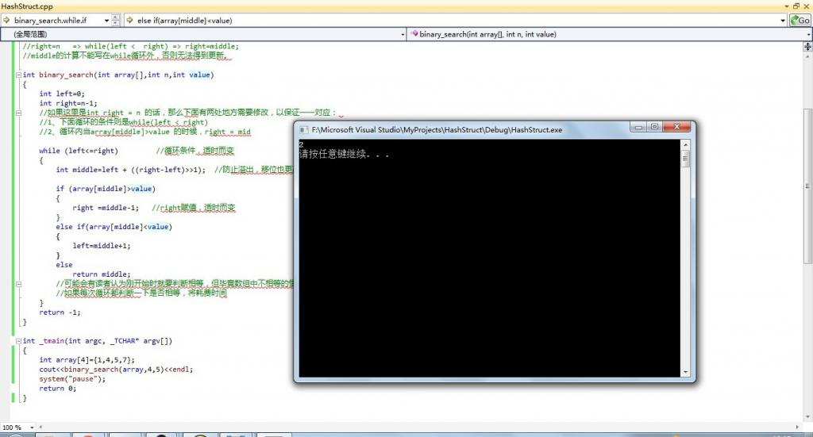

Chapter 25: Binary Search 
========

## 1.Introduction

Jon Bentley: More than 90% programmers are not able to correctly write the code of binary search. Perhaps most of the people have heard of this sentence, but I still would like to quote the following words written in the Programming Pearls.

Binary search solves the problem by keeping track of the range within the array that holds r (if r is anywhere in the array). Initially, the range is the entire array. The range is shrunk by comparing its middle element to r and discarding half the range. The process continues until t is discovered in the array or until the range in which it must lie is known to be empty. In a table of n elements. binary search uses roughly log2(n) comparisons. 

Most programmers think that with the above description in hand, writing the code is easy. They're wrong. The only way you'll believe this is by putting down this col-umn right now and writing the code yourself. Try it. 

I've assigned this problem in courses for professional programmers. The students had a couple of hours to convert the description above into a program in the language of their choice: a high-level pseudocode was fine. At the end of the specified time. almost all the programmers reported that they had correct code for the task. We would then take thirty minutes to examine their code, which the programmers did with test cases. In several classes and with over a hundred programmers, the results varied little: ninety percent of the programmers found bugs in their programs (and I wasn't always convinced of the correctness of the code in which no bugs were found). 

I was amazed: given ample time, only about ten percent of professional program-mers were able to get this small program right. But they aren't the only ones to find this task difficult: in the history in Section 6.2.1 of his Sorting and Searching, Knuth points out that while the first binary search was published in 1946. the first published binary search without bugs did not appear until 1962.  - Jon Bentley, "Programming Pearls (1st Edition)" on page 35-36.

**Are you able to write correct code of binary search? Give it a try.**

## Code of Binary Search

We may explain no more the principle of the binary search, however, one thing we need to point out to the reader is that binary search is applied on pre-sorted array. Alright, what's learned from books is superficial after all. It's crucial to have it personally tested somehow. Following is my implementation of binary search (I once was asked to implement binary search while being interviewed. The result could be same as yours. In factI could not implement it completely correct). If there is any bug in the code, please correct me.

```cpp

//Binary Search V0.1 Implementation 
//copyright@2011 July

//First of all, we need to understand following key points:
//right = n-1 => while(left <= right) => right = middle-1;
//right = n   => while(left <  right) => right = middle;

//The calculation of "middle" should not be out of the closure of while otherwise it cannot be updated.

int binary_search(int array[], int n, int value)
{
    int left = 0;
    int right = n - 1;
    //if here we have "int right = n",then in the following code, two places need to be modified to ensure the correspondence:
    //1. The condition of while loop should be changed to "while(left < right)".
    //2. Inside the loop, when array[middle] > value,we should assign "right = mid".

    while (left <= right)  //condition of looping changes over time.
    {
        int middle = left + ((right - left) >> 1);  //It can prevent overflow and simultaneouslyt the shifting operation is more efficient. Each time it needs to be updated. 
        if (array[middle] > value)
        {
            right = middle - 1;  //assignment of right changes over time.
        }
        else if(array[middle] < value)
        {
            left = middle + 1;
        }
        else
            return middle;
        //Some readers may think we need to decide whether they are equal or not at the beginning.
        //In fact, inequality is more common to be experienced in the comparison. 
        //If for every loop the algorithm checks whether they are equal or not, more time will be comsumed.

    }
    return -1;
}

```

A simple testing is presented as follows.(Of course, one time of testing does not mean the program has zero bugs and the test depth is far from enough.):


 
## Testing

Perhaps you have implemented binary search many times, but now you may wish to write it again. Close all pages, windows, open Notepad, or editor, or directly in the comment area under this article, without reference to what I wrote above, or any other person's program, you may just give yourself ten minutes to two hours and immediately write a binary search algorithm.
Of course, it does not mean anything if you can or cannot write it correctly. It is merely a simple test for Jon Bentley's remarks only.

## Summary 

After the article was published, a lot of friends immediately tried themselves. According to comments(codes) from friends in this article, the highest error rate happened in the following places:

There are still a lot of friends who committed errors mentioned in the note of the code:

	First of all, we need to understand following key points::
	right = n-1 => while(left <= right) => right = middle-1;
	The calculation of middle should not be out of the closure of while otherwise it cannot be updated.

Another most common mistake, you can refer to [Extra, Extra - Read All About It: Nearly All Binary Searches and Mergesorts are Broken](http://googleresearch.blogspot.com/2006/06/extra-extra-read-all-about-it-nearly.html)，which showed JDK5 has this BUG：

	middle = (left+right)>>1; If you right in this way, when left and right are relatively large, the sum of these two numbers may overflow. 

This is wrong as well:

	right = n   => while(left <  right) => right = middle;

As if the target number does not exist in the array, it will lead to an infinite loop.  Because of the last line "left = middle, right = middle + 1", so for each update, left and the middle are always the same.
