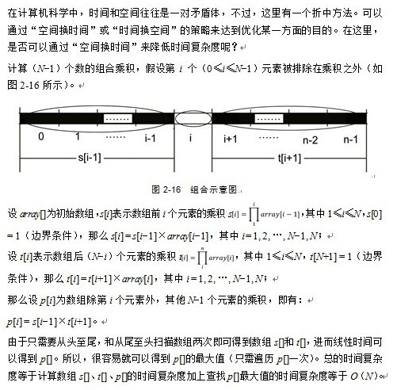

Chapter 28: Largest Product Continuous Substring
========

## Foreword

The questions introduced in this chapter and next chapter are the most popular questions that major companies would like to ask during their interviews, especially the latter one, which is more frequently asked. The Largest Product Continuous Substring(LPCS) problem appeared in last September 26 Baidu's interview twelveth question, in October 9th Tencent interview first small problem, 13 October 2013 Baidu School Recruit third small problems, and last in October 15 Google's School Recruit Interview.

## Porblem Description:

Given a floating-point number, the algorithm should return continuous substring which has the largest value of producte. For example, given a string of "-2.5, 4, 0, 3, 0.5, 8, -1", the algorithm should return "3, 0.5, 8". i.e. the continuous substring that gives the largest value of the product. That is to say ,in above array, the product given by continuous substring "3, 0.5, 8" is the largest.

Reminder: Here the LPCS is different from the the Largest Product Subsequence. The former requires continuity, on the contrary, the latter does not require the subsequence to be continuous. That is to say, it is also the same difference between the longest common substring and the Longest Common Subsequence(LCS). 

* Substring is a continuous part of original string.

* Subsequence is a new sequence obtained by removing out elements from the original sequence without changing the order.

More Briefly, the former's (substring's) character must be continuous, the latter's (sequences' LCS) characters are not. For example, the longest common substring of "acdfg" and "akdfc"  is "df", and their LCS is "adf", LCS can be solved using dynamic programming.

**Solution: **  

**Solution one: ** 

Enumerate all combinations:

The reader may naturally think that maximum product is similar to [the largest subarray problem](http://blog.csdn.net/v_JULY_v/article/details/6444021), people may use the most simple way: using two for loops.

```c

double max = 0;
double start = 0;
double end = 0;
for (int i = 0; i < num; i++)
{
    double x = arrs[i];
    for (int j = i + 1; j < num; j++)
    {
        x *= arrs[j];
        if (x > max)
        {
            max = x;
            start = arrs[i];
            end = arrs[j];
        }
    }
}

```

**Solution two:  **

Although this problem is similar to Largest Sum Subarray(LSS) problem, in fact there are many differences between two of them as the subsequence may contain positive value, negative value or zero. We can simplify the problem as follows: The algorithm needs to find a subsequence, which has largest product and simultaneously it also needs to find a subsequence which has minimum product (we need to also deal with negative number). As a consequence, we let:


* "maxCurrent" represents the current candidate that may be the largest product.
* "minCurrent" , on the contrary, represents the current candidate that may be the smallest product.
* "maxProduct" stores the the largest value of all candidates that may have the largest produce value.
We use candidate here because they may become the largest/smallest value for a new episode.)

As the empty set was defined by one, before the we search the array, "maxCurrent", "minCurrent" and "maxProduct" were all initialized as 1. Assume that we already have "maxCurrent" and "minCurrent", which are the two candidates of the largest/smallest product, after reading element x(i) of the array, the new largest candidate can only be bigger value of product of x(i) with maxCurrent or minCurrent. If "x(i) < 0" leads to "maxCurrent < minCurrent", we need to exchange the values of two candidates. Whenever "maxCurrent < 1", as 1(empty set) is a better candidate than "maxCurrent", we update the "maxCurrent" to be 1 and similarly, we also can update "minCurrent". Whenever "maxCurrent" is bigger than "maxProdtct", we update "maxProdect".

Code one:

```c

template <typename Comparable>
Comparable maxprod( const vector<Comparable>&v)
{
    int i;
    Comparable maxProduct = 1;
    Comparable minProduct = 1;
    Comparable maxCurrent = 1;
    Comparable minCurrent = 1;
    //Comparable t;

    for ( i = 0; i < v.size() ; i++)
    {
        maxCurrent *= v[i];
        minCurrent *= v[i];
        if (maxCurrent > maxProduct)
            maxProduct = maxCurrent;
        if (minCurrent > maxProduct)
            maxProduct = minCurrent;
        if (maxCurrent < minProduct)
            minProduct = maxCurrent;
        if (minCurrent < minProduct)
            minProduct = minCurrent;
        if (minCurrent > maxCurrent)
            swap(maxCurrent, minCurrent);
        if (maxCurrent < 1)
            maxCurrent = 1;
        //if(minCurrent>1)
        //    minCurrent =1;
    }
    return maxProduct;
}

```

Code two: 

Here we record the largest and the smallest product of i'th element as "M" and "m" individually. We also record starting point of these two intervals(the end points are i) and keep updating.[Source](http://www.51weixue.com/thread-246-1-1.html).

// here    
```cpp
pair<int, int> maxproduct(double *f, int n)
{
    //Return the starting point and end point of the largest product
    int R = 0, r = 0;   // Starting point of the largest and the smallest product.
    pair<int, int> ret = make_pair(0, 0);     // the subscript of the intervals of the largest and the smallest product
    double M = f[0], m = f[0], answer = f[0]; // Value of the largest and the smallest product.
    for (int i = 1; i < n; ++i)
    {
        double t0 = f[i] * M, t1 = f[i] * m;
        if (t0 > t1)
        {
            M = t0;
            m = t1;
        }
        else
        {
            int t = R;
            R = r;
            r = t;
            M = t1;
            m = t0;
        }
        if (M < f[i])
        {
            M = f[i];
            R = i;
        }
        if (m > f[i])
        {
            m = f[i];
            r = i;
        }
        if (answer < M)
        {
            answer = M;
            ret = make_pair(R, i);
        }
    }
    return ret;
}

```

**Solution three: **  

Besides the solution that we showed above, which is similar as LSCS, This problem can also be solved using dynamic programming. (in fact, the above solution is also an dynamic programming solution, but solving the specific form shown by the next solution with two different timetables. This difference lies in the following two will write dynamic programming solution of the problem in the classical equations of common DP, and one is a direct solution to solve). 

Assuming the array is a[], we can directly solve the problem using dynamic programming. Taking into account the possible negative value, we use Max to represent the largest value of product of subsequence which ends with a. Similarly we use Min to represent the smallest value of product of subsequence which ends with a:

```
  Max=max{a, Max[i-1]*a, Min[i-1]*a};  
  Min=min{a, Max[i-1]*a, Min[i-1]*a};  
```

The initial state is Max[1]=Min[1]=a[1].

C/C++ code one, a very simple piece of code: 

```c

double func(double *a, const int n)
{
    double *maxA = new double[n];
    double *minA = new double[n];
    maxA[0] = minA[0] = a[0];
    double value = maxA[0];
    for (int i = 1 ; i < n ; ++i)
    {
        maxA[i] = max(max(a[i], maxA[i - 1] * a[i]), minA[i - 1] * a[i]);
        minA[i] = min(min(a[i], maxA[i - 1] * a[i]), minA[i - 1] * a[i]);
        value = max(value, maxA[i]);
    }
    return value;
}

```

C/C++ code two:

```c

/*

 Given a floating-point array consisting of positive number, 0, and negative number. 
 The array index starts from one, return the Largest Product Continuous Subsequence(LPSC) and the corresponding value of product. 
 If the value of LPSC is negative then output -1.
 We use Max[i] to represent Largest Product Continuous Subsequence that ends with a[i]
 We use Min[i] to represent Smallest Product Continuous Subsequence that ends with a[i]. 
 As we have more than one value, then this saving is nessesary.

*/

void longest_multiple(double *a, int n)
{
    double *Min = new double[n + 1]();
    double *Max = new double[n + 1]();
    double *p = new double[n + 1]();
    //Initialization
    for (int i = 0; i <= n; i++)
    {
        p[i] = -1;
    }
    Min[1] = a[1];
    Max[1] = a[1];
    double max_val = Max[1];
    for (int i = 2; i <= n; i++)
    {
        Max[i] = max(Max[i - 1] * a[i], Min[i - 1] * a[i], a[i]);
        Min[i] = min(Max[i - 1] * a[i], Min[i - 1] * a[i], a[i]);
        if (max_val < Max[i])
            max_val = Max[i];
    }
    if (max_val < 0)
        printf("%d", -1);
    else
        printf("%d", max_val);
    //Free memory
    delete [] Max;
    delete [] Min;
}

```

C# complete code (the code is from one of participants of the Hero online programming challenges[1019.Largest Product Continuous Subsequence](http://hero.pongo.cn/Question/Details?ID=19&ExamID=19)) 

```csharp
//The Hero: danielqkj

using System;
public class Test
{
    void Max(double a, double b, double c)
    {
        double d = (a > b) ? a : b;
        return (d > c) ? d : c;
    }

    void Min(double a, double b, double c)
    {
        double d = (a > b) ? b : a;
        return (d > c) ? c : d;
    }


    public static void Main()
    {
        int n = Int32.parse(Console.readline());
        double[] a = new double[n];
        double maxvalue = a[0];
        double[] max = new double[n];
        double[] min = new double[n];
        double start, end;

        String[] s = Console.readline().split(' ');
        for (int i = 0; i < n; i++)
        {
            a[i] = Double.parse(s[i])
        }

               max[0] = a[0];
        min[0] = a[0];
        start = 0, end = 0;

        for (int i = 1; i < n; i++)
        {
            max[i] = Max(a[i], a[i] * max[i - 1], a[i] * min[i - 1]);
            min[i] = Min(a[i], a[i] * max[i - 1], a[i] * min[i - 1]);

            if (max[i] > maxvalue)
            {
                maxvalue = max[i];
                end = i;
            }
        }

        double mmm = maxvalue;
        while ( (mmm - 0.0) > 0.00001 )
        {
            start = end;
            mmm = mmm / a[start];
        }

        Console.Writeline(a[start] + " " + a[end] + " " + maxvalue);

    }
}

```

**Variants**  

This problem has another variance. That is, given an array that have size N, the algorithm can only use multiplication but not devision and algorithm must give the any conbination of subsequence that has the largest product .

One way to solve this quetion is we enumerate all the possible combinations of N-1 numbers and calculate the product of them then compare the size of them. As in total we have N times N-1 combinations. The time complexity is O(N^2) and obviously, this is not the best solution.

The following solution is from "The Beauty of Programming".

**Solution one :**  



**Solution two :**

In addition, you can also further reduce the amount of computing through analysis. Assuming the product of N integers is P, the following analysis considers the sign of P (where, AN-1 represents the number of combinations of N-1, PN-1 represents the product of combinations of N-1 number). 

1. When P = 0

Then the array contains at least one 0. Assume that if we except one zero then we get Q as the product of rest of other numbers. Now we discuss Q according to whether it is negative or positive:

Q is 0:

Return 0 (This means the array has at least two zeros so that the product of the rest of numbers is zero.)

Q is positive:

Reuturn Q (Because if we use zero to substitute any number in the array, the value we get must be smaller than Q.)

Q is negative:

Reuturn 0 (Because if we use zero to substitute any number in the array, the value we get is 0, which is bigger than Q.)

2. P is negative

According to pricipal of multiplication "Negatives make a positive", nauturelym we want to remove one negative number to make PN-1 to be a positive number. To ensure the product to be largest, the removed negative value must have the smallest absolute value. Now we just need to traverse the array and remove the negative that have smallest absolute value.  

3. P is negative
Similarly, if there is a positive value in the array, you should remove the smallest positive value, otherwise remove the negative value that has maximum absolute value. 

The above solution uses a direct product P of N integers, and thus determine the sign of P. But a direct multiplication may suffer the danger of being stackoverflow (this is why this problem require us not using divesion), In fact if we just make a smalll modification and calculate the number of negative numbers,positive numbers and 0 without calculating proudct directly, we can already decide whether P is negative or positive. The rest is the same as above solution.

Consider the time complexity, since the algorithm only need to traverse the array once to get the number of positive(+) value, negative(-) value, 0 , positive number that has smallest abolute value and negative number that has smallest abolute value, then the time complexity is O(N).  

## References and recommended reading

1. [http://www.bjwilly.com/archives/395.html](); 
