Chapter 35：Perfect shuffle algorithm
========

Topic Details：There is an array of length 2n {a1, a2, a3, ..., an, b1, b2, b3, ..., bn}, hope to be {a1, b1, a2, b2, ...., an, bn} after be sorted.Consider is there any solution with the time complexity of o(n) and space complexity of 0(1).

**Source of the subject**:This subject comes from the 2013 UC school recruit pen test,seemingly simple,the string  can be sorted to what it should be by brute force,however,to achieve the time and space complexity set by the subject, we need to spend no small effort.OK，please see below,a step by step optimization.

##Solution 1、Brute force transformation
We can transform the string all according to the requirement.Be analyzed by Chen Liren,in this,the subject is explained by quoting his ideas.In order to facilitate the analysis,we take n = 4, then the subject requires us to transform

   a1，a2，a3，a4，**b1，b2，b3，b4**

to

   a1，b1，a2，b2，a3，b3，a4，b4

### 1.1、Step by step forward
Carefully observe the characteristics of the two sequences before and after transformation,we can do the following series of operations:

first step、determine the location of b1,i.e.let b1 exchange with a2,a3,a4:

   a1，b1，a2，a3，a4，**b2，b3，b4**
   
second step、determine the location of b2,i.e.let b2 exchange with a3,a4:

   a1，b1，a2，b2，a3，a4，**b3，b4**
   
third step、let b3 exchange with a4:

   a1，b1，a2，b2，a3，b3，a4，b4
   
b4 is at the final position, without further switching.So, after these three steps, we finally get the desired sequence.However, the time complexity of this method is O (N ^ 2),We have to continue to look for other ways to see any other method to achieve the expected O (N) time complexity.

### 1.2、Intermediate exchange
Of course, in addition to the above method of letting b1，b2，b3，b4 step forward by switching itself with the preceding element, we can exchange the intermediate two elements in the sequence to achieve the purpose everytime.Still using the above example,aimming at a1，a2，a3，a4，b1，b2，b3，b4

first step、exchange the two elements of the middle,equence becomes(elements to be exchanged in bold):

   **a1，a2，a3**，b1，a4，**b2，b3，b4**

second step、exchange the middle of the two pairs of elements espectively:

	**a1，a2**，b1，a3，b2，a4，**b3，b4**

third step、	exchange the middle of the three pairs of elements espectively,sequence becomes:

   a1，b1，a2，b2，a3，b3，a4，b4

the same as solution 1.1,the time complexity is still O (N ^ 2),we have to knock ourself out on this subject.

###Solution 2 、Perfect shuffle algorithm
Who has played poker knows,an in-shuffle of a deck of cards is done by cutting the deck into two equal halves and interleaving them perfectly, with the first card of the second half being the first card of the shuffled deck.As shown below:


If the deck is represented by a1 a2 a3 a4 b1 b2 b3 b4(To simplify,assuming the deck only has 8 cards),cut into two halves,a1 a2 a3 a4 in your left hand,b1 b2 b3 b4 in your right hand,after shuffled as in the above chart,the card may be like b1 a1 b2 a2 b3 a3 b4 a4。

Technology comes from life，2004，Peiyush Jain from microsoft has proposed perfect shuffle algorithm in his paper “A Simple In-Place Algorithm for In-Shuffle”.

How this algorithm to solve a problem? What is the link with this subject?

Yeah，as the name suggests,perfect shuffling algorithm is to solve the problem of perfect shuffle.What is the problem of the perfect shuffle?That is, given an array of a1,a2,a3,...an,b1,b2,b3..bn,It eventually replaced by b1,a1,b2,a2,...bn,an.As you can see,this issue is entirely consistent with perfect shuffle essentially.Just swap any two adjacent elements of its final sequence on the basis of perfect shuffle problem.

Namely:

      a1,a2,a3,...an,b1,b2,b3..bn

By perfect shuffle problem,we get:

      b1,a1,b2,a2,b3,a3...  bn,an

then swap any two adjacent elements to achieve the requirements of this subject.

      a1,b1,a2,b2,a3,b3....,an,bn

That is,If we apply perfect shuffle algorithm(O(N) time complexity,O(1) space complexity) solve the problem of perfect shuffle,it also solves this subject indirectly.

While there are many articles on the Internet explainint or translating this paper,but for beginners,it is too difficult to understand,furthermore,If translating the original directly,it can hardly see how the algorithm come step by step.Therefore, we begin with the basic prototype of perfect shuffling algorithm to make it better understood.

#### 2.1、Position replacement pefect_shuffle1 algorithm
To facilitate the discussion,we set the array index starting at 1,ranging from [1 .. 2n],also the above example with n=4,let us to see what the hell happens.

  Start sequence：a1 a2 a3 a4 b1 b2 b3 b4
  Array subscript：1    2   3   4   5   6   7    8
  Final sequence：b1 a1 b2 a2 b3 a3 b4 a4
  
From the above examples we can see,the first n elements
>
The first element a1 to the original position of the second element a2,that is 1->2；
>
The second element a2 to the original position of the forth element a4,that is 2->4；
>
The third element a3 to the original position of the sixth element b2,that is 3->6；
>
The forth element a4 to the original position of the eighth element b4,that is 4->8；

which is extended to the general，for the elements of second half,the i-th element goes to the original position of the (2 * (i - n) ) - 1 =  2 * i - (2 * n + 1)  = (2 * i) % (2 * n + 1)-th element.

Then integrated into any situation,the arbitrary i-th element,we eventually change it to the (2 * i)% (2 * n + 1)-th position.Why is it? Because:
>
when 0 <i <n,original Formula = (2i) % (2 * n + 1)  = 2i；
>
when i >n,original Formula (2 * i) % (2 * n + 1) unchange.

Therefore,if we then allow another array to contain the element,we put can each element directly to the location where it should be,which brings about the easiest way pefect_shuffle1,reference code below:

```c
//Time complexity O (n), space complexity O (n) and array index starts at 1
void pefect_shuffle1(int *a, int n)
{
    int n2 = n * 2, i, b[N];
    for (i = 1; i <= n2; ++i)
    {
        b[(i * 2) % (n2 + 1)] = a[i];
    }
    for (i = 1; i <= n2; ++i)
    {
        a[i] = b[i];
    }
}
```
Obviously,its time complexity is O (n), but the space complexity is O (n), which is still not in line with the expected time complexity O (n) and space complexity O (1).We continue to look for better solutions.

At the same time,I also remind readers that according to the transform of the above, we can see that there are two cycles.
>
One is 1 -> 2 -> 4 -> 8 -> 7 -> 5 -> 1；
>
the other is 3 -> 6 -> 3.

2.3.1 below,"cycle_leader " algorithm will again mention these two circles.

#### 2.2、Divide and conquer algorithm perfect_shuffle2
For those who familiar with divide and conquer know that we can make it smaller by divide and conquer for a relatively large-scale problem.For this subject, assume that n is even, we try to split in half from the middle of the array (for the convenience of description, just looking at the array subscript is enough):

Original array subscript:1....2n，that is（1  ..  n/2，  n/2+1..n）（n+1 .. n+n/2，  n+n/2+1 ..  2n）

The length is both n for the first halve（1  ..  n/2，  n/2+1..n）and second halve（n+1 .. n+n/2，  n+n/2+1 ..  2n）

Next,we swap the later n / 2 elements (n / 2 +1 .. n) of the first half with the later n /2 elements（n+1..n+n/2,getting:
>
Newly the first n elements A:（1..n/2                   n+1.. n+n/2） 
>
Newly the second n elements B：（n/2+1 .. n        n+n/2+1 .. 2n）

In other words,when n is even, we split the original problem into A, B two sub-problems, and then converted it into solving the n' = n / 2 problem.

But when n is odd?We can put the extra element of the first half into the end, after all the elements moving forward, the last two elements of the new series have met the requirements.Then we converted it into n-1 problem by just considering the former 2 * (n-1) elements.

For the case of n is respectively even and odd, the following gives two examples of n = 4 n = 5.

  ①when n=4 ,the original array is
  
    a1 a2 a3 a4 b1 b2 b3 b4
  
Accordance with the idea when n is even, swap the later two elements a3 a4 of the first half with the former two elements b1 b2 of the second half, we get:

    a1 a2 b1 b2 a3 a4 b3 b4
    
Therefore, as long as we continue with pefect_shuffle1 algorithm for solving A (a1 a2 b1 b2) and B (a3 a4 b3 b4) two sub-questions on it.

  ②when n=5 ,the original array is
  
    a1 a2 a3 a4 a5 b1 b2 b3 b4 b5
    
In accordance with the idea above n is odd, put a5 into the end and then all the remaining elements moving forward, we get:

    a1 a2 a3 a4 b1 b2 b3 b4 b5 a5
    
At this point, the last two elements b5 a5 already is the result we want, as long as with the previous case n = 4, the same can be considered.

reference code below:
```c
//copyright@caopengcs 8/23/2013
//Time complexity O (n), space complexity O (1) and array index starts at 1
void perfect_shuffle2(int *a, int n)
{
    int t, i;
    if (n == 1)
    {
        t = a[1];
        a[1] = a[2];
        a[2] = t;
        return;
    }
    int n2 = n * 2, n3 = n / 2;
    if (n % 2 == 1)    //for the odd case
    {
        t = a[n];
        for (i = n + 1; i <= n2; ++i)
        {
            a[i - 1] = a[i];
        }
        a[n2] = t;
        --n;
    }
    //the even case below

    for (i = n3 + 1; i <= n; ++i)
    {
        t = a[i];
        a[i] = a[i + n3];
        a[i + n3] = t;
    }

    // [1.. n /2]
    perfect_shuffle2(a, n3);
    perfect_shuffle2(a + n, n3);
}
```
Analysis of the complexity of this algorithm: each time we exchanged the middle of n elements, requires O (n) time, n is odd, we also need to O (n) time after the first two elements are adjusted, but this does not affect the overall time complexity.

Therefore, the fact is that when we use divide and conquer algorithm its time complexity is calculated as: T (n) = 2 * T (n / 2) + O (n), this is the same with the complexity of merge sort formula, from "Introduction to Algorithms" and can ultimately be solved for T (n) = O (nlogn). As for space, the algorithm carries out in the internal array, it is O (1) (without taking into account the premise of recursion stack space).

#### 2.3、Perfect shuffle algorithm perfect_shuffle3
##### 2.3.1、cycle_leader algorithm

Either perfect_shuffle1, or perfect_shuffle2, these two algorithms do not reach the time complexity of O (N) and space complexity O (1) requirements, so we have to find a new approach to solve the perfect shuffle problem raised at beginning of this section.

Let us first recall the 2.1 location  replacement perfect_shuffle1 algorithm, do you still remember the two cycles before I remind readers about when n = 4,? I quote the relevant content under 2.1:

When n=4:

  Start sequence：a1 a2 a3 a4 b1 b2 b3 b4
  
  Array subscript：1    2   3   4   5   6   7    8
  
  Final sequence：b1 a1 b2 a2 b3 a3 b4 a4

By replacement, we obtain the following conclusions:

"According to the above transform, we can see that there are two cycles,
>
one is 1 -> 2 -> 4 -> 8 -> 7 -> 5 -> 1；
> 
the other is 3 -> 6 -> 3。”

This two cycles can be represented as （1,2,4,8,7,5）and（3,6），and perfect_shuffle1 algorithm has also told us, no matter weather n is odd or even, the elements of each location will become the (2 * i)% (2n +1)-th elements:

So long as we know the leader element's position and along the cycle go around that we can achieve our goals. And because the cycles is disjoint, we just walked O (N) steps .

Also give the example of n = 4, and assume that on the premise of we already know the first cycle and the second cycle, let 1 2 3 4 5 6 7 8 converted into 5 1  2 7 3 8 4：

  first cycle：1 -> 2 -> 4 -> 8 -> 7 -> 5 -> 1
  second cycle：3 -> 6 -> 3：

  Original array：1 2 3 4 5 6 7 8
  Array subscript：1 2 3 4 5 6 7 8

  take the first cycle：5 1 3 2 7 6 8 4
  take the second cycle：5 1 6 2 7 3 8 4
  
The algorithm above of walking along the cycle which we name it as cycle_leader, this part of the code is as follows:

```c
//Array index starts at 1, from is the leader of the cycle, mod is the number of modulo which should be 2 * n + 1, the time complexity is O (cycle length)
void cycle_leader(int *a, int from, int mod)
{
    int t, i;

    for (i = from * 2 % mod; i != from; i = i * 2 % mod)
    {
        t = a[i];
        a[i] = a[from];
        a[from] = t;
    }
}
```
##### 2.3.2、Magic Conclusion: If 2 * n = (3 ^ k - 1), the number of the cycle and the starting position of the leader each cycle can be determined

Now I want to refer to a conclusion from the paper "A Simple In-Place Algorithm for In-Shuffle",that is
In an array of order 2*n = （3^k-1), we have exactly k cycles with 1,3,9，...3^(k-1) each belonging to a different cycle as cycle leader. 

The original part of the paper:

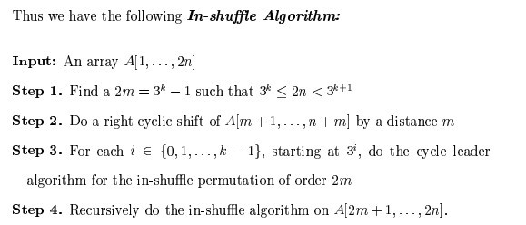


In other words, using the above conclusion, we can solve problem regarding array of this particular length 2 * n = (3 ^ k-1), so if a given length n is arbitrary what we supposed to do? At this point, we can learn from 2.2, divide and conquer algorithm, the entire array is divided into two, namely, split into two parts:

Let some length to meet the Migic Conclusion: If 2 * m = (3 ^ k-1), so there is just k cycle, and the starting position of the leader of each cycle are 1,3,9, ... 3 ^ (k-1),where m <n, m is a desired value being in line with Magic conclusion;

The remaining n-m section calculate separately;

When n is decomposed into two parts,that is m and n-m, the subscript corresponding to the original array  as follows (For convenience of description, we still look at the subscript）：

  Original array subscript：1..m m+1.. n，   n+1 .. n+m, n+m+1,..2*n
  
Refer to Section 2.2 before, divide and conquer algorithm, and more in order to make the first part of the sequence to meet the Migic Conclusion 2 * m = (3 ^ k-1), we can exchange the middle two segments of length m  and n-m respectively,which is equivalent to doing a right cycle of elements m +1 .. n, n +1 .. n + m by a sidtance m(why? because after this operation, the length of the first portion of the array is 2m, according to Magic conclusion: When 2m = 3 ^ k-1,it has exactly k cycles).

And if the reader read the first chapter of this series, left rotation of the string, then it should be realized that there is a cycle of displacement O (N) algorithm.We can achieve this by reversing the sub-array （m+1.. n）followed by a reversal of the sub-arrays （n+1 .. n+m） and （m+1.. n，   n+1 .. n+m.

This rotate code as follows:

```c
//time complexity of rotating the string is O(to - from)
void reverse(int *a, int from, int to)
{
    int t;
    for (; from < to; ++from, --to)
    {
        t = a[from];
        a[from] = a[to];
        a[to] = t;
    }
}

//right cyclic shigt with distance num,time complexity is O(n)
void right_rotate(int *a, int num, int n)
{
    reverse(a, 1, n - num);
    reverse(a, n - num + 1, n);
    reverse(a, 1, n);
}
```
After the rotate, the target array subscript obtained as follows:
    Target array subscript:1..m n+1..n+m    m+1 .. n       n+m+1,..2*n
    
OK, the theory is presented clearly, another example would make it more clear. When given n = 7, to meet the Magic conclusions 2 * n = 3 ^ k-1, k can only take 2, then get n '= m = 4.

    Original array：a1 a2 a3 a4       a5 a6 a7     b1 b2 b3 b4   b5 b6 b7
    
Since m = 4, so exchange the two parts underlined of the above array, we get:

    Target array:a1 a2 a3 a4    b1 b2 b3 b4      a5 a6 a7     b5 b6 b7
    
Then the first half of the target array a1 a2 a3 a4 b1 b2 b3 b4 can be applied tp Section 2.3.1 、cycle_leader algorithm. We end up solving the problem of n '= 3, that is,reducing the length by 4,the rest is to resolve the second half of the a5 a6 a7 b5 b6 b7.

#### 2.3.3、Perfect shuffle algorithm perfect_shuffle3
From the above analysis we will come to a perfect shuffle algorithm, the algorithm processes as follows:
>
Input array　A[1..2 * n]
>
step 1 Find a 2m = 3k − 1 such that 3k ≤ 2n < 3k+1
>
step 2 Do a right cyclic shift of A[m + 1, . . . , n + m] by a distance m
>
step 3 For each i ∈ {0, 1, . . . , k − 1}, starting at 3i , do the cycle_leader algorithm,the length of array is m,so on 2 * m + 1 modulo.
>
step 4 Recursively do the in-shuffle algorithm on A[2 * m + 1.. 2 * n].

Let us look at the time and space bounds for each of the steps.
>
Step 1 can be done in-place in O(log n) time.
>
Step 2 can be done in-place in O(n) time.
>
Step 3 can be done in-place in O(m) time.
>
Step 4 is a tail recursive call and hence can be implemented in constant space.The time taken by this call is T (2(n − m)).
Since m = Ω(n), it follows that the total time taken by this algorithm is O(n).

The perfect shuffle algorithm reference code are as follows:

```c
//copyright@caopengcs 8/24/2013
//time complexity O(n)，space complexity O(1)
void perfect_shuffle3(int *a, int n)
{
    int n2, m, i, k, t;
    for (; n > 1;)
    {
        // step 1
        n2 = n * 2;
        for (k = 0, m = 1; n2 / m >= 3; ++k, m *= 3)
          ;
        m /= 2;
        // 2m = 3^k - 1 , 3^k <= 2n < 3^(k + 1)

        // step 2
        right_rotate(a + m, m, n);

        // step 3
        for (i = 0, t = 1; i < k; ++i, t *= 3)
        {
          cycle_leader(a , t, m * 2 + 1);
        }

        //step 4
        a += m * 2;
        n -= m;

    }
    // n = 1
    t = a[1];
    a[1] = a[2];
    a[2] = t;
}
```
##### 2.3.4、perfect_shuffle3 algorithm to solve the problem of deformation
Ah! The above code solves the problem of perfect shuffle, so how is it to solve the deformation problem in this chapter? Yes, as the beginning of this chapter said, for the final sequence just swap each two adjacent elements based on the perfect shuffle problems.The code as follows:

```c
//copyright@caopengcs 8/24/2013
//time complexity O(n)，space complexity O(1) and array index starts at 1,call perfect_shuffle3
void shuffle(int *a, int n)
{
    int i, t, n2 = n * 2;
    perfect_shuffle3(a, n);
    for (i = 2; i <= n2; i += 2)
    {
        t = a[i - 1];
        a[i - 1] = a[i];
        a[i] = t;
   }
}
```

The operation (of course, you can also make the first and last element unchanged in the original array,apply standard perfect shuffle algorithm to the middle of 2 * (n - 1) elements) "for the final sequence just swap each two adjacent elements based on the perfect shuffle problems" above, just add extra  O (N) time complexity on the basis of perfect shuffle algorithm ,its overall time complexity is still O (N). At this point, our problem has been satisfactorily resolved!

##### 2.3.5、How comes the Magic Conclusion？

Our problem has been resolved, but this chapter has not been completed,how comes the Magic Conclusion that determines the perfect shuffle algorithm: if 2 * n = (3 ^ k - 1), we have exactly k cycles with 1, 3, 32 , . . . , 3k−1 each belonging to a different cycle, and each cycle leader's starting positions are 1,3,9, ... 3 ^ (k-1).

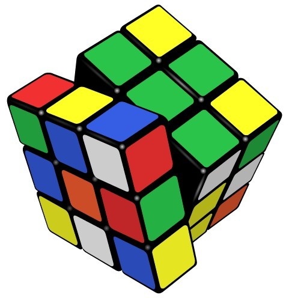

The key to prove this conclusion is this: the merged cycle must contain all integers from 1 to M,and not one less. This proved is a bit of trouble, because the proof will involve number theory, such as group theory, but then a long way to go step by step can be reached.

First, let us clear the following related concepts, theorems, and definitions (figuring out these things, we will prove that a half):
>
Concept 1 mod expresses the remainder resulting from dividing two specified, such as 3 mod 5 = 3,5 mod 3 = 2;
>
Definition 1 Euler function φ (m) represents the number of positive integers that no more than m (ie, less than or equal m) and relatively-prime with m.
>
Definition 2 If φ (m) = Ordm (a),then a is called primitive root of m, which Ordm (a) is defined as: a ^ d (mod m), where d = 0,1,2,3 ..., but take the minimum d that make the equation established.

A combination of the above definition 1, and definition 2 shows 2 is a primitive root of 3. For 2^0 mod 3 = 1, 2^1 mod 3 = 2, 2^2 mod 3 = 1, 2^3 mod 3 = 2，{a^0 mod m，a^1 mod m，a^2} which obtains the set S = {1,2},
contains all numbers relatively-prime with 3, i.e. d = φ (2) = 2, meets the definition of primitive roots.
Yet 2 is not a primitive root of 7,for 2^0 mod 7 = 1, 2^1 mod 7 = 2, 2^2 mod 7 = 4, 2^3 mod 7 = 1，2^4 mod 7 = 2，2^5 mod 7 = 4，2^6 mod 7 = 1，where the set S={1,2,4} always contains 1、2、4, which does not include all of the relatively-prime number with 7(it does not include 3,6,5), i.e., d = 3, but φ (7) = 6, so that d! = φ (7), does not meet the definition of primitive roots.

Furthermore, if a is a primitive root of another number m, which represents the set S = {a ^ 0 mod m, a ^ 1 mod m, a ^ 2 mod m ......} contains all numbers that is less than m and relatively-prime with m, otherwise it is not a primitive root of m. And the set S = {a ^ 0 mod m, a ^ 1 mod m, a ^ 2 mod m ......} may exist repeated remainder, but when a relatively-prime with m, I guarantee in the set {a ^ 0 mod m, a ^ 1 mod m, a ^ 2 mod m}, the first number is a ^ 0 mod m, When the first time that the number is repeated, this number must be 1, that is, it must start from the leader when it comes to remainder cycle.

For modular exponentiation, the primitive root of a modulo m is defined as the smallest positive integer d in 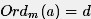,st: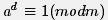.

As another example,2 is a primitive root of 9,for 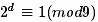,to make 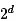 
divided by 9 equals a constant of 1,so the smallest positive integer d = 6, and φ (m) = 6, meet the definition of primitive root.
>
Theorem 1 congruence theorem: two integers a, b, if they are divided by a positive integer m getting the same remainder, that called a, b ​​congruence modulus m, denoted by 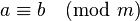.
>
Theorem 2 when p is an odd prime and a is a primitive root of 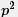,then a is a primitive root of 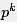 for any k>=1.
>
Theorem 3 Fermat's Little Theorem: If a and m are relatively-prime, then a ^ φ (m) mod m = 1
>
Theorem 4 If (a, m) = 1 and a is a primitive root of m, then a is the generator of (Z / mZ) * .

Take a = 2, m = 3.

We know that 2 is a primitive root of 3, 2 is a primitive root of 9, we define S (k) represents the above set S, and taking the x = 3 ^ k (x represents the number of the set S).

  So:
  
      S(1) = {1, 2}
      S(2) = {1, 2, 4, 8, 7, 5}
We do not change the order of the elements in the cycle, the cycle containing 1 consists of all numbers relatively prime to 3^k and less than it.

How about the number that not relatively prime to 3^k,If 0 <i <3 ^ k and 3 ^ k are not relatively prime to i,so the greatest common divisor of i and 3 ^ k must be the form of 3^t(contains only divisor 3),and t <k. I.e. gcd (i, 3 ^ k) = 3 ^ t, divided by 3 ^ t both sides of the equation , i.e. gcd (i / (3 ^ t), 3 ^ (k - t)) = 1, i / (3 ^ t) are  relatively prime to 3 ^ (k - t), and i / (3 ^ t) <3 ^ (k - t), according to the definition of S (k), we can see i / (3 ^ t) in the set S (k - t).

Similarly,any number x in S (k - t) satisfies gcd (x, 3 ^ k) = 1, so gcd (3 ^ k, x * 3 ^ t) = 3 ^ t, and x * 3 ^ t <3 ^ k. x*3^t which in the set S (k - t) and I form one-to-one correspondence relationship.

That is, the new set generated by each number of the form x* 3^t in S (k - t) contains all the numbers that the greatest common divisor with 3^k is 3^t, and it is also a cycle, the leader of the original cycle and this cycle are 1 and 3^t respectively.

So, for all number less than 3^k, according to the greatest common divisor with 3^k, we can assign it to a cycle, and the K cycles contain exactly  all the number less than 3^k.

For example, as caopengcs said, when we take "a = 2, m = 3, 

We know that 2 is a primitive root of 3, 2 ​​is a primitive root of 9,we define S (k) represents set S, and x = 3 ^ k.

So S(1) = {1, 2}

S(2) = {1, 2, 4, 8, 7, 5}

For instance k = 3. We have:

S(3) = {1, 2 ,4 , 8, 16, 5, 10, 20, 13, 26, 25, 23, 19, 11, 22, 17, 7, 14} contains all numbers less than 27 and relatively prime to 27 , the leader of the cycle is 1, which is decided by the difinition of primitive root.

Then the number which the greatest common divisor with 27 is 3, is obtained by letting S (2) multiply by 3. S (2) * 3 = {3, 6, 12, 24, 21, 15},the leader is 3 without changing the order.

The number which the greatest common divisor with 27 is 9, is obtained by letting S (2) multiply by 9.  S(1) * 9 = {9, 18},the leader is 9 without changing the order.

For each number less than 27,the greatest common divisor with 27 is just 1,3,or 9 and with one-to-one relationship.Therefore, S (2) * 3 contains all the number less than 27 and the greatest common divisor with 27 is 3, S (1) * 9 contains all the number less than 27 and the greatest common divisor with 27 is 9. "

In other words, if defined as an integer, assuming / N is defined as the set containing all the remainders generated by Z divided by N, including {0 ... N-1}, and (/ N) * which is defined as the set containing the number in {0 ... N-1} which relatively prime to N.

when n = 13, 2n +1 = 27, i.e.,/ N = {0,1,2,3, ....., 26}, (/ N) * is equivalent to the set containing the number which relatively prime to {0,1,2 , 3, ....., 26}.

2 ^ k (mod 27) is included in (/ 27) *, so these numbers are available in the following three cycles:

take 1 as the leader, （/27)*＝｛1,2,4,8,16,5,10,20,13,26,25,23,19,11,22,17,7,14｝，that is to say,the set of positive integers that less than and relatively prime to 27 is {1,2,4,8,16,5,10,20,13,26,25,23,19,11,22,17,7,14}，so ϕ(m) = ϕ(27)=18, the d meeting the requirement of  is 18, so 2 is the primitive root of 27.

Take 3 as the leader,you can get｛3,6,12,24,21,15｝，this is the cycle with the leader 3. The cycle is all the number which is a multipe of 3, and not a multiple of 9. Why? Because 2^k and 27 are relatively prime.

For more details :If the remainder of 3 × 2 ^ k divided by 27 can be divisible by 9, there is an n meeting 3 * 2 ^ k = 9n (mod 27), i.e., 3 * 2 ^ k-9n can be divisible by 27, so 3 * 2 ^ k-9n = 27m, where n, m is an integer, so that, divided by 3 on both side, we can obtain 2 ^ k = 9m +3 n, ie, 2 ^ k is a multiple of 3, which is contradictory wirh the case 2 ^ k relatively prime to 27, so the remainder of 3 × 2 ^ k divided by 27 can not be divisible by 9.

In addition,the remainder of 2 ^ k divided by 27 can be any number other than a multiple of 3, so, the remainder of 2 ^ k divided by 27 may be 1,2,4,5,7,8, when the remainder is 1,there exists a k such that 2 ^ k-1 = 27m, m is an integer.

Obtained by multiplying both sides of equation 3: 3 * 2 ^ k-3 = 81m is a multiple of 27, so the remainder of 3 * 2 ^ k divided by 27 is 3;

Similarly, when the remainder is 2, 2 ^ k - 2 = 27m, => 3 * 2 ^ k-6 = 81m, so the remainder of 3 * 2 ^ k divided by 27 is 6;

When the remainder is 4, 2 ^ k - 4 = 37m, => 3 * 2 ^ k - 12 = 81m, so the remainder of 3 * 2 ^ k divided by 27 is 12;

Similarly, you can get to 15,21,24. Thus also confirms the above conclusion: Take 3 as the leader, you can get {3,6,12,24,21,15}.Take 9 as the leader, which is very simple, this cycle is {9,18}.

You will find that,all the natural numbers less than 27, ethier inside in the first cycle relatively prime to 27 or inside in the second cycle that are multiples of 3, but not a multiple of 9; or inside the third cycle, which is a multiple of 9.What make it sense is 2 is a primitive root of 27. This completes the proof.

Finally, we also re-verify the above process:

For 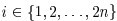，so：

i  = 1  2  3  4   5   6   7  8   9  10 11 12 13 14 15 16 17 18 19 20 21 22 23 24 25 26 27

Since n = 13,2 n +1 = 27,according to 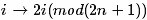,the number in position i will come to the following location:

i  = 2  4  6  8  10 12 14 16 18 20 22 24 26  1   3   5  7   9  11 13 15 17 19 21 23 25  0  

According to changes in i and i ' before and after transformation , we will get three cycles:

       1->2->4->8->16->5->10->20->13->26->25->23->19->11->22->17->7->14->1；
       3->6->12->24->21->15->3
       9->18->9
       
Yes, the figures in this three cycles are in line with those got before.Verification is complete.

#### 2.3.6、Several extensions to perfect shuffle problem
At this point, the question posed at the beginning of this chapter is resolved, and perfect shuffle algorith is also proved,can we stop? OH, NO! Have readers thought about the following questions:

Since the input(a1,a2,a3,……aN,b1,b2,b3,……bN) is given in perfect shuffle problem, asking for output：b1,a1,b2,a2,……bN,aN；have you considered the inverse problem: I.e. given b1, a1, b2, a2, ...... bN, aN, asking for output a1, a2, a3, ...... aN, b1, b2, b3, ...... bN?
The perfect shuffle problem has done by two hands, how about shuffling with three hand?The subject then becomes: The input is a1, a2, ...... aN, b1, b2, ...... bN, c1, c2, ...... cN, the required output is c1, b1, a1, c2, b2, a2, ...... cN , bN, aN, this time, how to deal with it?

Please think about the extensions of perfect shuffle problem above. Specific answer, please refer to the fifteenth link.

The thirty-fifth chapter finishes.

### reference links
[huangxy10](http://blog.csdn.net/huangxy10/article/details/8071242)

[@Green Jacket](http://www.51nod.com/answer/index.html#!answerId=598)

[ brute force to lattice fetching](http://wenku.baidu.com/view/681c853b580216fc700afd9a.html)

[@Chen Liren](http://mp.weixin.qq.com/mp/appmsg/show?__biz=MjM5ODIzNDQ3Mw==&appmsgid=10000141&itemidx=1&sign=4f1aa1a2269a1fac88be49c8cba21042)


[caopengcs](http://blog.csdn.net/caopengcs/article/details/10196035)

[paper to perfect shuffle algorithm“A Simple In-Place Algorithm for In-Shuffle”](http://att.newsmth.net/att.php?p.1032.47005.1743.pdf)

[primitive root modulo](http://en.wikipedia.org/wiki/Primitive_root_modulo_n)

[knowledge of shuffle](http://www.thecodeway.com/blog/?p=680)

[perfect shuffle algorithm](http://cs.stackexchange.com/questions/332/in-place-algorithm-for-interleaving-an-array/400#400)

[illustration to the cycle of perfect shuffle algorithm](http://www.emis.de/journals/DMTCS/pdfpapers/dm050111.pdf)

[discussions on the Magic Conclusion](http://math.stackexchange.com/questions/477125/how-to-prove-algebraic-structure-of-the-perfect-shuffle)（something wrong in the link and take the 2.3.5 as the standard）

[prove to Magic Conclusion by caopengcs](http://blog.csdn.net/caopengcs/article/details/10429013)

[concept of congruence](http://zh.wikipedia.org/wiki/%E5%90%8C%E9%A4%98)

[Fermat's little theorem](http://www.xieguofang.cn/Maths/Number_Theory/Fermat's_Little_Theorem_1.htm)

[extensions to perfect shuffle problem](http://blog.csdn.net/caopengcs/article/details/10521603)

[Introduction of the primitive root and index](http://wenku.baidu.com/view/bbb88ffc910ef12d2af9e738)

《Introduction to number theory》Joseph H. Silverman, recommended reason:it is recommended this book for better understanding number theory or something like;

### Postscript
Chapter 35 is probably the most satisfying one of the entire series by far, not only because of clear thinking in this chapter, the natural transition , good coding style, but also because of the join of @ Dr. Cao Peng, leading to a higher level of satisfaction for both programming skills and quality.

Art of programming by solving a series of practical programming interview questions, letting the beginners to learn the ability to analyze 、solve and optimize problems step by step,easy understood enough to explain each question, hope the follow-up doing better and better! July, August 24, 2013, at zero thirty-seven in the morning.