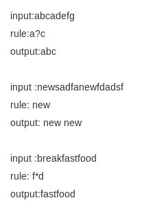

# 带通配符的字符串匹配问题

字符串匹配问题，给定一串字符串，按照指定规则对其进行匹配，并将匹配的结果保存至output数组中，多个匹配项用空格间隔，最后一个不需要空格。  

要求：  

1. 匹配规则中包含通配符?和\*，其中?表示匹配任意一个字符，\*表示匹配任意多个（>=0）字符。  
2. 匹配规则要求匹配最大的字符子串，例如a\*d,匹配abbdd而非abbd,即最大匹配子串。  
3. 匹配后的输入串不再进行匹配，从当前匹配后的字符串重新匹配其他字符串。  

请实现函数：  
```c
  char* my_find(char input[], char rule[])
```

举例说明：  



注意事项：  
1. 自行实现函数my_find，勿在my_find函数里夹杂输出，且不准用C、C++库，和Java的String对象；  
2. 请注意代码的时间，空间复杂度，及可读性，简洁性；  
3. input=aaa，rule=aa时，返回一个结果aa，即可。  

## 解法一、直接匹配
本题与上述第三十章的题不同，上题字符串转换成整数更多考察对思维的全面性和对细节的处理，本题则更多的是编程技巧。闲不多说，直接上代码：  

```c
//copyright@cao_peng 2013/4/23
int str_len(char *a)
{
    //字符串长度
    if (a == 0)
    {
        return 0;
    }
    char *t = a;
    for (; *t; ++t)
        ;
    return (int) (t - a);
}

void str_copy(char *a, const char *b, int len)
{
    //拷贝字符串 a = b
    for (; len > 0; --len, ++b, ++a)
    {
        *a = *b;
    }
    *a = 0;
}

char *str_join(char *a, const char *b, int lenb)
{
    //连接字符串 第一个字符串被回收
    char *t;
    if (a == 0)
    {
        t = (char *) malloc(sizeof(char) * (lenb + 1));
        str_copy(t, b, lenb);
        return t;
    }
    else
    {
        int lena = str_len(a);
        t = (char *) malloc(sizeof(char) * (lena + lenb + 2));
        str_copy(t, a, lena);
        *(t + lena) = ' ';
        str_copy(t + lena + 1, b, lenb);
        free(a);
        return t;
    }
}

int canMatch(char *input, char *rule)
{
    // 返回最长匹配长度 -1表示不匹配
    if (*rule == 0)
    {
        //已经到rule尾端
        return 0;
    }
    int r = -1 , may;
    if (*rule == '*')
    {
        r = canMatch(input, rule + 1);  // *匹配0个字符
        if (*input)
        {
            may = canMatch(input + 1, rule);  // *匹配非0个字符
            if ((may >= 0) && (++may > r))
            {
                r = may;
            }
        }
    }
    if (*input == 0)
    {
        //到尾端
        return r;
    }
    if ((*rule == '?') || (*rule == *input))
    {
        may = canMatch(input + 1, rule + 1);
        if ((may >= 0) && (++may > r))
        {
            r = may;
        }
    }
    return r;
}

char * my_find(char input[], char rule[])
{
    int len = str_len(input);
    int *match = (int *) malloc(sizeof(int) * len);  //input第i位最多能匹配多少位 匹配不上是-1
    int i, max_pos = - 1;
    char *output = 0;

    for (i = 0; i < len; ++i)
    {
        match[i] = canMatch(input + i, rule);
        if ((max_pos < 0) || (match[i] > match[max_pos]))
        {
            max_pos = i;
        }
    }
    if ((max_pos < 0) || (match[max_pos] <= 0))
    {
        //不匹配
        output = (char *) malloc(sizeof(char));
        *output = 0;   // \0
        return output;
    }
    for (i = 0; i < len;)
    {
        if (match[i] == match[max_pos])
        {
            //找到匹配
            output = str_join(output, input + i, match[i]);
            i += match[i];
        }
        else
        {
            ++i;
        }
    }
    free(match);
    return output;
}
```

## 解法二、动态规划
本题也可以直接写出DP(Dynamic Programming, 动态规划)方程，如下代码所示：  

```c
//copyright@chpeih 2013/4/23
char* my_find(char input[], char rule[])
{
    //write your code here
    int len1, len2;
    for (len1 = 0; input[len1]; len1++);
    for (len2 = 0; rule[len2]; len2++);
    int MAXN = len1 > len2 ? (len1 + 1) : (len2 + 1);
    int  **dp;

    //dp[i][j]表示字符串1和字符串2分别以i j结尾匹配的最大长度
    //记录dp[i][j]是由之前那个节点推算过来  i*MAXN+j
    dp = new int *[len1 + 1];
    for (int i = 0; i <= len1; i++)
    {
        dp[i] = new int[len2 + 1];

    }

    dp[0][0] = 0;
    for (int i = 1; i <= len2; i++)
        dp[0][i] = -1;
    for (int i = 1; i <= len1; i++)
        dp[i][0] = 0;

    for (int i = 1; i <= len1; i++)
    {
        for (int j = 1; j <= len2; j++)
        {
            if (rule[j - 1] == '*')
            {
                dp[i][j] = -1;
                if (dp[i - 1][j - 1] != -1)
                {
                    dp[i][j] = dp[i - 1][j - 1] + 1;

                }
                if (dp[i - 1][j] != -1 && dp[i][j] < dp[i - 1][j] + 1)
                {
                    dp[i][j] = dp[i - 1][j] + 1;
                }
            }
            else if (rule[j - 1] == '?')
            {
                if (dp[i - 1][j - 1] != -1)
                {
                    dp[i][j] = dp[i - 1][j - 1] + 1;

                }
                else dp[i][j] = -1;
            }
            else
            {
                if (dp[i - 1][j - 1] != -1 && input[i - 1] == rule[j - 1])
                {
                    dp[i][j] = dp[i - 1][j - 1] + 1;
                }
                else dp[i][j] = -1;
            }
        }
    }

    int m = -1;//记录最大字符串长度
    int *ans = new int[len1];
    int count_ans = 0;//记录答案个数
    char *returnans = new char[len1 + 1];
    int count = 0;
    for (int i = 1; i <= len1; i++)
        if (dp[i][len2] > m)
        {
            m = dp[i][len2];
            count_ans = 0;
            ans[count_ans++] = i - m;
        }
        else if (dp[i][len2] != -1 && dp[i][len2] == m)
        {
            ans[count_ans++] = i - m;
        }

    if (count_ans != 0)
    {
        int len = ans[0];
        for (int i = 0; i < m; i++)
        {
            printf("%c", input[i + ans[0]]);
            returnans[count++] = input[i + ans[0]];
        }
        for (int j = 1; j < count_ans; j++)
        {
            printf(" ");
            returnans[count++] = ' ';
            len = ans[j];
            for (int i = 0; i < m; i++)
            {
                printf("%c", input[i + ans[j]]);
                returnans[count++] = input[i + ans[j]];
            }
        }
        printf("\n");
        returnans[count++] = '\0';
    }

    return returnans;
}
```


```java

    /**
     * 平均O(n+m)  最坏O(n*m)
     * 约定 * : ANY>=0    ,   ? : ANY=1
     *
     * @author Spance.Wong
     */
    static class WildCardMatcher {

        /**
         * 仅为了方便实验
         *
         * @param input
         * @param pattern
         * @return
         */
        static List<String> matches(String input, String pattern) {
            String[] pa = pattern.split("\\*+");    // 分割不是重点，故未做重点实现
            return matches(input, pa);
        }

        /**
         * 从input中查找通配符序列
         *
         * @param input
         * @param patterns
         * @return
         */
        static List<String> matches(CharSequence input, String[] patterns) {
            int n = input.length(), m = patterns.length;
            List<String> result = new ArrayList<String>();
            for (int i = 0; i < n; ) {
                int left = -1, right = -1;
                for (int j = 0; j < m; j++) {   // 以i为起点，执行m趟匹配，每趟i至少前进p[j].length长度
                    long region = lookBehind(input, i, patterns[j]);
                    if (j != 0 && region >= 0) {   // 模式序列的第二个开始使用贪婪匹配
                        long greedyRegion;
                        for (int k = (int) region + 1; ; k = (int) greedyRegion + 1) {
                            greedyRegion = lookBehind(input, k, patterns[j]);
                            if (greedyRegion > 0)    // 贪婪找到，继续贪婪尝试
                                region = greedyRegion;
                            else
                                break;
                        }
                    }
                    if (region < 0) {   // pattern[j]失败，则本趟失败
                        i = ((int) -region) + 1;
                        break;
                    } else {
                        i = (int) region + 1;
                        if (j == 0)     // 模式序列的第一个找到，记左边界，在高32位
                            left = (int) (region >> 32);
                        if (j == m - 1)     // 模式序列的最后一个找到，记右边界，在低32位
                            right = (int) region;
                    }
                }
                if (left >= 0 && right >= 0)
                    result.add(input.subSequence(left, right + 1).toString());
            }
            return result;
        }

        /**
         * 在input的i位置开始向后扫描非贪婪查找pattern，在pattern尾匹配时回溯确认
         *
         * @param in
         * @param i
         * @param pattern
         * @return
         */
        static long lookBehind(CharSequence in, int i, CharSequence pattern) {
            int len = in.length(), pLen = pattern.length(), _pMax = pLen - 1;
            char pEnd = pattern.charAt(_pMax);
            if (len - i >= pLen) {
                for (i = i + _pMax; i < len; i++) {  // 以 i + pLen - 1 起步
                    if (in.charAt(i) == pEnd || pEnd == '?') {     // 与pa末尾相同，i即右边界
                        if (pLen == 1)
                            return ((long) i) << 32 | i;
                        for (int j = i - 1; j >= i - _pMax; j--) {   // 则至多回溯pLen长找左边界
                            char p = pattern.charAt(_pMax - i + j);
                            if (in.charAt(j) == p || p == '?') {
                                if (j == i - _pMax)     // 找到左边界即j
                                    return ((long) j) << 32 | i;
                            } else
                                break;
                        }
                    }
                }
            }
            return -i;
        }
    }
    

```
