# 寻找最小的k个数


## 题目描述

题目：输入n个整数，输出其中最小的k个。  

例如输入1，2，3，4，5，6，7和8这8个数字，则最小的4个数字为1，2，3和4。  

## 分析与解法
### 解法一

咱们先简单的理解，要求一个序列中最小的k个数，按照惯有的思维方式，很简单，先对这个序列从小到大排序，然后输出前面的最小的k个数即可。

至于选取什么的排序方法，我想你可能会第一时间想到快速排序，我们知道，快速排序平均所费时间为`n*logn`，然后再遍历序列中前k个元素输出，即可，总的时间复杂度为`O（n*logn+k）=O（n*logn）`。

### 解法二

咱们再进一步想想，题目并没有要求要查找的k个数，甚至后n-k个数是有序的，既然如此，咱们又何必对所有的n个数都进行排序列?

这时，咱们想到了用选择或交换排序，即遍历n个数，先把最先遍历到得k个数存入大小为k的数组之中，对这k个数，利用选择或交换排序，找到k个数中的最大数kmax（kmax设为k个元素的数组中最大元素），用时O（k）（你应该知道，插入或选择排序查找操作需要O（k）的时间），后再继续遍历后n-k个数，x与kmax比较：如果x<kmax，则x代替kmax，并再次重新找出k个元素的数组中最大元素kmax‘（*多谢kk791159796 提醒修正*）；如果x>kmax，则不更新数组。这样，每次更新或不更新数组的所用的时间为O（k）或O（0），整趟下来，总的时间复杂度平均下来为：`n*O（k）=O（n*k）`。
	
### 解法三
当然，更好的办法是维护k个元素的最大堆，原理与上述第2个方案一致，即用容量为k的最大堆存储最先遍历到的k个数，并假设它们即是最小的k个数，建堆费时O（k）后，有k1<k2<...<kmax（kmax设为大顶堆中最大元素）。继续遍历数列，每次遍历一个元素x，与堆顶元素比较，x<kmax，更新堆（用时logk），否则不更新堆。这样下来，总费时`O（k+（n-k）*logk）=O（n*logk）`。此方法得益于在堆中，查找等各项操作时间复杂度均为logk（不然，就如上述思路2所述：直接用数组也可以找出前k个小的元素，用时`O（n*k））`。


这个解法三为何比解法二更好呢？道理很简单，如果要处理的序列n比较小时，思路2（选择排序）的n*k的复杂度还能说得过去，但当n很大的时候列?同时，别忘了，如果选择思路1（快速排序），还得在数组中存储n个数。当面对海量数据处理的时候列?n还能全部存放于电脑内存中么?（或许可以，或许很难）。

ok，相信你已经明白了我的意思，下面，给出借助堆（思路3）这个数据结构，来寻找最小的k个数的完整代码，如下：

```cpp  
//借助堆，查找最小的k个数  
//copyright@ yansha &&July  
//July、updated，2011.04.28。  
#include <iostream>  
#include <assert.h>  
using namespace std;  
void MaxHeap(int heap[], int i, int len);  
/*-------------------
BUILD-MIN-HEAP(A)
1  heap-size[A] ← length[A]
2  for i ← |_length[A]/2_| downto 1
3       do MAX-HEAPIFY(A, i)
*/  
// 建立大根堆  
void BuildHeap(int heap[], int len)  
{  
    if (heap == NULL)  
        return;  

    int index = len / 2;  
    for (int i = index; i >= 1; i--)  
        MaxHeap(heap, i, len);  
}  
/*----------------------------
PARENT(i)
   return |_i/2_|
LEFT(i)
   return 2i
RIGHT(i)
   return 2i + 1
MIN-HEAPIFY(A, i)
1 l ← LEFT(i)
2 r ← RIGHT(i)
3 if l ≤ heap-size[A] and A[l] < A[i]
4    then smallest ← l
5    else smallest ← i
6 if r ≤ heap-size[A] and A[r] < A[smallest]
7    then smallest ← r
8 if smallest ≠ i
9    then exchange A[i] <-> A[smallest]
10         MIN-HEAPIFY(A, smallest)
*/  
//调整大根堆  
void MaxHeap(int heap[], int i, int len)  
{  
    int largeIndex = -1;  
    int left = i * 2;  
    int right = i * 2 + 1;  

    if (left <= len && heap[left] > heap[i])  
        largeIndex = left;  
    else  
        largeIndex = i;  

    if (right <= len && heap[right] > heap[largeIndex])  
        largeIndex = right;  

    if (largeIndex != i)  
    {  
        swap(heap[i], heap[largeIndex]);  
        MaxHeap(heap, largeIndex, len);  
    }  
}  
int main()  
{  
    // 定义数组存储堆元素  
    int k;  
    cin >> k;  
    int *heap = new int [k+1];   //注，只需申请存储k个数的数组  
    FILE *fp = fopen("data.txt", "r");   //从文件导入海量数据（便于测试，只截取了9M的数据大小）  
    assert(fp);  

    for (int i = 1; i <= k; i++)  
        fscanf(fp, "%d ", &heap[i]);  

    BuildHeap(heap, k);      //建堆  

    int newData;  
    while (fscanf(fp, "%d", &newData) != EOF)  
    {  
        if (newData < heap[1])   //如果遇到比堆顶元素kmax更小的，则更新堆  
        {  
            heap[1] = newData;  
            MaxHeap(heap, 1, k);   //调整堆  
        }  

    }  

    for (int j = 1; j <= k; j++)  
        cout << heap[j] << " ";  
    cout << endl;  

    fclose(fp);  
    return 0;  
}
```

咱们用比较大量的数据文件测试一下，如这个数据文件：

  

输入k=4，即要从这大量的数据中寻找最小的k个数，可得到运行结果，如下图所示：

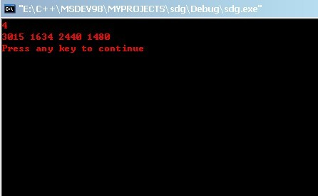  

至于，这4个数，到底是不是上面大量数据中最小的4个数，这个，咱们就无从验证了，非人力之所能及也。毕。

### 解法四
4. 按编程之美第141页上解法二的所述，类似快速排序的划分方法，N个数存储在数组S中，再从数组中随机选取一个数X（*随机选取枢纽元，可做到线性期望时间O（N）的复杂度，在第二节论述*），把数组划分为Sa和Sb俩部分，Sa<=X<=Sb，如果要查找的k个元素小于Sa的元素个数，则返回Sa中较小的k个元素，否则返回Sa中所有元素+Sb中小的k-|Sa|个元素。像上述过程一样，*这个运用类似快速排序的partition的快速选择SELECT算法寻找最小的k个元素，在最坏情况下亦能做到O（N）的复杂度*。不过值得一提的是，这个快速选择SELECT算法是选取数组中“中位数的中位数”作为枢纽元，而非随机选取枢纽元。

<u>**ok，接下来，咱们再着重分析下上述思路4**</u>。或许，你不会相信上述思路4的观点，但我马上将用事实来论证我的观点。这几天，我一直在想，也一直在找资料查找类似快速排序的partition过程的分治算法（即上述在编程之美上提到的第4点思路），是否能做到O（N）的论述或证明，

然找了三天，不但在算法导论上找到了RANDOMIZED-SELECT，在平均情况下为线性期望时间O（N）的论证（请参考本文第二节），还在mark allen weiss所著的数据结构与算法分析--c语言描述一书（还得多谢朋友sheguang提醒）中，第7章第7.7.6节（本文下面的第4节末，也有关此问题的阐述）也找到了在最坏情况下，为线性时间O（N）（是的，**不含期望，是最坏情况下为O（N）**）的快速选择算法（*此算法，本文文末，也有阐述*），请看下述文字（*括号里的中文解释为本人添加*）：

> Quicksort can be modified to solve the selection problem, which we have seen in chapters 1 and 6. Recall that by using a priority queue, we can find the kth largest (or smallest) element in O(n + k log n)（即上述思路7）. For the special case of finding the median, this gives an O(n log n) algorithm.

> Since we can sort the file in O(nlog n) time, one might expect to obtain a better time bound for selection. The algorithm we present to find the kth smallest element in a set S is almost identical to quicksort. In fact, the first three steps are the same. We will call     this algorithm quickselect（叫做快速选择）. Let |Si| denote the number of elements in Si（令|Si|为Si中元素的个数）. The steps of quickselect are（**快速选择，即上述编程之美一书上的，思路4，步骤如下**）:

> 1. If |S| = 1, then k = 1 and return the elements in S as the answer. If a cutoff for small files is being used and |S| <=CUTOFF, then sort S and return the kth smallest element.
> 2. Pick a pivot element, v (- S.（选取一个枢纽元v属于S）
> 3. Partition S - {v} into S1 and S2, as was done with quicksort.
（将集合S-{v}分割成S1和S2，就像我们在快速排序中所作的那样）
> 4. If k <= |S1|, then the kth smallest element must be in S1. In this case, return quickselect (S1, k). If k = 1 + |S1|, then the pivot is the kth smallest element and we can return it as the answer. Otherwise, the kth smallest element lies in S2, and it is the (k - |S1| - 1)st smallest element in S2. We make a recursive call and return quickselect (S2, k - |S1| - 1).
（如果k<=|S1|，那么第k个最小元素必然在S1中。在这种情况下，返回quickselect（S1,k）。如果k=1+|S1|，那么枢纽元素就是第k个最小元素，即找到，直接返回它。否则，这第k个最小元素就在S2中，即S2中的第（k-|S1|-1）（多谢王洋提醒修正）个最小元素，我们递归调用并返回quickselect（S2，k-|S1|-1））。

> In contrast to quicksort, quickselect makes only one recursive call instead of two. The worst case of quickselect is identical to that of quicksort and is O(n2). Intuitively, this is because quicksort's worst case is when one of S1 and S2 is empty; thus, quickselect（快速选择） is not really saving a recursive call. The average running time, however, is O(n)（**不过，其平均运行时间为O（N）**。看到了没，就是平均复杂度为O（N）这句话）. The analysis is similar to quicksort's and is left as an exercise.  

> The implementation of quickselect is even simpler than the abstract description might imply. The code to do this shown in Figure 7.16. When the algorithm terminates, the kth smallest element is in position k. This destroys the original ordering; if this is not desirable, then a copy must be made.

并给出了代码示例：

```cpp  
//copyright@ mark allen weiss  
//July、updated，2011.05.05凌晨.  

//q_select places the kth smallest element in a[k]  
void q_select( input_type a[], int k, int left, int right )  
{  
    int i, j;
    input_type pivot;
    if( left + CUTOFF <= right )  
    {
        pivot = median3( a, left, right );
        //取三数中值作为枢纽元，可以消除最坏情况而保证此算法是O（N）的。不过，这还只局限在理论意义上。  
        //稍后，除了下文的第二节的随机选取枢纽元，在第四节末，您将看到另一种选取枢纽元的方法。  

        i=left; j=right-1;
        for(;;)
        {
            while( a[++i] < pivot );
            while( a[--j] > pivot );
            if (i < j )
                swap( &a[i], &a[j] );
            else
                break;
        }
        swap( &a[i], &a[right-1] ); /* restore pivot */
        if( k < i)
            q_select( a, k, left, i-1 );
        else
            if( k > i )
                q-select( a, k, i+1, right );
    }  
    else
        insert_sort(a, left, right );
}
```

结论：

1. 与快速排序相比，快速选择只做了一次递归调用而不是两次。快速选择的最坏情况和快速排序的相同，也是O（N^2），最坏情况发生在枢纽元的选取不当，以致S1，或S2中有一个序列为空。
2. 这就好比快速排序的运行时间与划分是否对称有关，划分的好或对称，那么快速排序可达最佳的运行时间O（n*logn），划分的不好或不对称，则会有最坏的运行时间为O（N^2）。而枢纽元的选取则完全决定快速排序的partition过程是否划分对称。
3. 快速选择也是一样，如果枢纽元的选取不当，则依然会有最坏的运行时间为O（N^2）的情况发生。那么，怎么避免这个最坏情况的发生，或者说就算是最坏情况下，亦能保证快速选择的运行时间为O（N）列?对了，关键，还是看你的枢纽元怎么选取。
4. 像上述程序使用三数中值作为枢纽元的方法可以使得最坏情况发生的概率几乎可以忽略不计。然而，稍后，在本文第四节末，及本文文末，您将看到：通过一种更好的方法，如“五分化中项的中项”，或“中位数的中位数”等方法选取枢纽元，我们将能彻底保证在最坏情况下依然是线性O（N）的复杂度。

至于编程之美上所述：从数组中随机选取一个数X，把数组划分为Sa和Sb俩部分，那么这个问题就转到了下文第二节**RANDOMIZED-SELECT**，以线性期望时间做选择，无论如何，编程之美上的解法二的复杂度为`O（n*logk）`都是有待商榷的。至于最坏情况下一种全新的，为O（N）的快速选择算法，*直接跳转到本文第四节末，或文末部分吧*）。

不过，为了公正起见，把编程之美第141页上的源码贴出来，由大家来评判：

```cpp  
Kbig(S, k):  
     if(k <= 0):  
          return []     // 返回空数组  
     if(length S <= k):  
          return S  
     (Sa, Sb) = Partition(S)  
     return Kbig(Sa, k).Append(Kbig(Sb, k – length Sa)  

Partition(S):  
     Sa = []            // 初始化为空数组  
     Sb = []        // 初始化为空数组  
     Swap(s[1], S[Random()%length S])   // 随机选择一个数作为分组标准，以  
                        // 避免特殊数据下的算法退化，也可  
                        // 以通过对整个数据进行洗牌预处理  
                        // 实现这个目的  
     p = S[1]  
     for i in [2: length S]:  
         S[i] > p ? Sa.Append(S[i]) : Sb.Append(S[i])  
                            // 将p加入较小的组，可以避免分组失败，也使分组  
                            // 更均匀，提高效率
length Sa < length Sb ? Sa.Append(p) : Sb.Append(p)  
return (Sa, Sb)
```

你已经看到，它是随机选取数组中的任一元素为枢纽的，这就是本文下面的第二节RANDOMIZED-SELECT的问题了，只是要修正的是，此算法的平均时间复杂度为线性期望O（N）的时间。而，稍后在本文的第四节或本文文末，您还将会看到此问题的进一步阐述（SELECT算法，即快速选择算法），此SELECT算法能保证即使在最坏情况下，依然是线性O（N）的复杂度。

updated：

1. 为了照顾手中没编程之美这本书的friends，我拍了张照片，现贴于下供参考（提醒：1、书上为寻找最大的k个数，而我们面对的问题是寻找最小的k个数，两种形式，一个本质（该修改的地方，上文已经全部修改）。2、书中描述与上文思路4并无原理性出入，不过，勿被图中记的笔记所误导，因为之前也曾被书中的这个n*logk复杂度所误导过。ok，相信，看完本文后，你不会再有此疑惑）：  
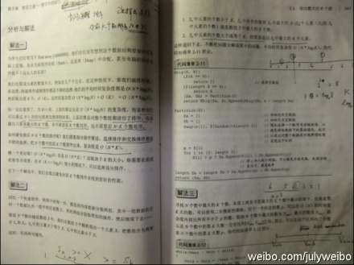  
2. 同时，在编程之美原书上此节的解法五的开头提到，“上面类似快速排序的方法平均时间复杂度是线性的”，我想上面的类似快速排序的方法，应该是指解法（即如上所述的类似快速排序partition过程的方法），但解法二得出的平均时间复杂度却为O（N*logk），明摆着前后矛盾（参见下图）。  
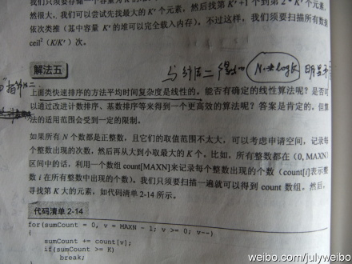  
3. 此文创作后的几天，已把本人的意见反馈给邹欣等人，下面是编程之美bop1的改版修订地址的页面截图（本人也在参加其改版修订的工作），下面的文字是我的记录（同时，**本人声明，此狂想曲系列文章系我个人独立创作**，与其它的事不相干）：  
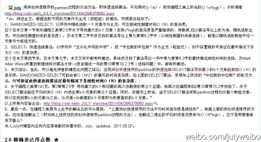  

### 解法五
5. RANDOMIZED-SELECT，每次都是随机选取数列中的一个元素作为主元，在0（n）的时间内找到第k小的元素，然后遍历输出前面的k个小的元素。 如果能的话，那么总的时间复杂度为线性期望时间：`O（n+k）=O（n）`（当k比较小时）。

Ok，稍后第二节中，我会具体给出RANDOMIZED-SELECT(A, p, r, i)的整体完整伪码。在此之前，要明确一个问题：我们通常所熟知的快速排序是以固定的第一个或最后一个元素作为主元，每次递归划分都是不均等的，最后的平均时间复杂度为：`O（n*logn）`,但RANDOMIZED-SELECT与普通的快速排序不同的是，每次递归都是随机选择序列从第一个到最后一个元素中任一一个作为主元。

下面是RANDOMIZED-SELECT(A, p, r)完整伪码（来自算法导论），我给了注释，或许能给你点启示。在下结论之前，我还需要很多的时间去思量，以确保结论之完整与正确。

```cpp  
PARTITION(A, p, r)         //partition过程 p为第一个数，r为最后一个数
1  x ← A[r]               //以最后一个元素作为主元
2  i ← p - 1
3  for j ← p to r - 1
4       do if A[j] ≤ x
5             then i ← i + 1
6                  exchange A[i] <-> A[j]
7  exchange A[i + 1] <-> A[r]
8  return i + 1

RANDOMIZED-PARTITION(A, p, r)      //随机快排的partition过程
1  i ← RANDOM(p, r)                                 //i  随机取p到r中个一个值
2  exchange A[r] <-> A[i]                         //以随机的 i作为主元
3  return PARTITION(A, p, r)            //调用上述原来的partition过程

RANDOMIZED-SELECT(A, p, r, i)       //以线性时间做选择，目的是返回数组A[p..r]中的第i 小的元素
1  if p = r          //p=r，序列中只有一个元素
2      then return A[p]
3  q ← RANDOMIZED-PARTITION(A, p, r)   //随机选取的元素q作为主元
4  k ← q - p + 1                     //k表示子数组 A[p…q]内的元素个数，处于划分低区的元素个数加上一个主元元素
5  if i == k                        //检查要查找的i 等于子数组中A[p....q]中的元素个数k
6      then return A[q]        //则直接返回A[q]
7  else if i < k
8      then return RANDOMIZED-SELECT(A, p, q - 1, i)
          //得到的k 大于要查找的i 的大小，则递归到低区间A[p，q-1]中去查找
9  else return RANDOMIZED-SELECT(A, q + 1, r, i - k)
          //得到的k 小于要查找的i 的大小，则递归到高区间A[q+1，r]中去查找。  
```

写此文的目的，在于起一个抛砖引玉的作用。希望，能引起你的重视及好的思路，直到有个彻底明白的结果。

updated：算法导论原英文版有关于RANDOMIZED-SELECT(A, p, r)为O（n）的证明。为了一个彻底明白的阐述，我现将其原文的证明自个再翻译加工后，阐述如下：

> 此RANDOMIZED-SELECT最坏情况下时间复杂度为Θ(n2),即使是要选择最小元素也是如此，因为在划分时可能极不走运，总是按余下元素中的最大元素进行划分，而划分操作需要O（n）的时间。

> 然而此算法的平均情况性能极好，因为它是随机化的，故没有哪一种特别的输入会导致其最坏情况的发生。

> 算法导论上，针对此*RANDOMIZED-SELECT算法平均时间复杂度为O（n）的证明*，引用如下，或许，能给你我多点的启示（本来想直接引用第二版中文版的翻译文字，但在中英文对照阅读的情况下，发现第二版中文版的翻译实在不怎么样，所以，得自己一个一个字的敲，最终敲完修正如下），分4步证明：  

> 1. 当RANDOMIZED-SELECT作用于一个含有n个元素的输入数组A[p ..r]上时，所需时间是一个随机变量，记为T(n),我们可以这样得到线性期望值E [T(n)]的下界：程序RANDOMIZED-PARTITION会以等同的可能性返回数组中任何一个元素为主元，因此，对于每一个k，（1 ≤k ≤n）,子数组A[p ..q]有k个元素，它们全部小于或等于主元元素的概率为1/n.对k = 1, 2,...,n,我们定指示器X<sub>k</sub>，为：  
> X<sub>k</sub> = I{子数组A[p ..q]恰有k个元素} ,  
> 我们假定元素的值不同，因此有  
>  E[X<sub>k</sub>]=1/n  
> 当调用RANDOMIZED-SELECT并且选择A[q]作为主元元素的时候,我们事先不知道是否会立即找到我们所想要的第i小的元素，因为，我们很有可能需要在子数组A[p ..q - 1], 或A[q + 1 ..r]上递归继续进行寻找.具体在哪一个子数组上递归寻找，视第i小的元素与A[q]的相对位置而定.  

> 2. 假设T(n)是单调递增的，我们可以将递归所需时间的界限限定在输入数组时可能输入的所需递归调用的最大时间（此句话，原中文版的翻译也是有问题的）.换言之,我们断定,为得到一个上界，我们假定第i小的元素总是在划分的较大的一边，对一个给定的RANDOMIZED-SELECT,指示器Xk刚好在一个k值上取1，在其它的k值时，都是取0.当Xk =1时，可能要递归处理的俩个子数组的大小分别为k-1，和n-k，因此可得到递归式为

  

取期望值为：

  

> 为了能应用等式<u>*(C.23)*</u>,我们依赖于X<sub>k</sub>和T(max(k - 1,n - k))是独立的随机变量（这个可以证明，证明此处略）。  
> 3. 下面，我们来考虑下表达式max(k - 1,n -k)的结果.我们有：  
  
> 如果n是偶数，从T(⌉)到T(n - 1)每个项在总和中刚好出现俩次，T(⌋)出现一次。因此，有  
  

> 我们可以用替换法来解上面的递归式。假设对满足这个递归式初始条件的某个常数c，有T(n) ≤cn。我们假设对于小于某个常数c（稍后再来说明如何选取这个常数）的n，有T(n) =O(1)。 同时，还要选择一个常数a，使得对于所有的n>0，由上式中O(n)项(用来描述这个算法的运行时间中非递归的部分)所描述的函数，可由an从上方限界得到（这里，原中文版的翻译的确是有点含糊）。利用这个归纳假设，可以得到：

> （此段原中文版翻译有点问题，上述文字已经修正过来，对应的此段原英文为：We solve the recurrence by substitution. Assume thatT(n)≤cn for some constant c that satisfies the initial conditions of the recurrence. We assume thatT(n) =O(1) forn less than some constant; we shall pick this constant later. We also pick a constanta such that the function described by theO(n) term above (which describes the non-recursive component of the running time of the algorithm) is bounded from above byan for alln> 0. Using this inductive hypothesis, we have）  
  
> 4. 为了完成证明，还需要证明对足够大的n，上面最后一个表达式最大为cn，即要证明：cn/4 -c/2 -an ≥ 0.如果在俩边加上c/2，并且提取因子n，就可以得到n(c/4 -a) ≥c/2.只要我们选择的常数c能满足c/4 -a > 0, i.e.,即c > 4a,我们就可以将俩边同时除以c/4 -a, 最终得到：

  

> 综上，如果假设对n < 2c/(c -4a),有T(n) =O(1)，我们就能得到E[T(n)] =O(n)。所以，最终我们可以得出这样的结论，并确认无疑：**在平均情况下，任何顺序统计量（特别是中位数）都可以在线性时间内得到**。

结论： 如你所见，RANDOMIZED-SELECT有线性期望时间O（N）的复杂度，但此RANDOMIZED-SELECT算法在最坏情况下有O（N^2）的复杂度。所以，我们得找出一种在最坏情况下也为线性时间的算法。稍后，**在本文的第四节末，及本文文末部分**，你将看到一种在**最坏情况下是线性时间O（N）的复杂度的快速选择SELECT算法**。
	
### 解法六
6. 线性时间的排序，即计数排序，时间复杂度虽能达到O（n），但限制条件太多，不常用。

### 解法七
7. updated： huaye502在本文的评论下指出：“可以用最小堆初始化数组，然后取这个优先队列前k个值。复杂度`O(n)+k*O(log n)`”。huaye502的意思是针对整个数组序列建最小堆，建堆所用时间为O（n）（算法导论一书上第6章第6.3节已经论证，在线性时间内，能将一个无序的数组建成一个最小堆），然后取堆中的前k个数，总的时间复杂度即为：`O（n+k*logn）`。

	关于上述第7点思路的继续阐述：至于思路7的`O（n+k*logn）`是否小于上述思路3的`O（n*logk）`，即<u>`O（n+k*logn）?< O（n*logk）`</u>。粗略数学证明可参看如下第一幅图，我们可以这么解决：当k是常数，n趋向于无穷大时，求`（n*logk）/（n+k*logn）`的极限T，如果T>1，那么可得`O（n*logk）>O（n+k*logn）`，也就是`O（n+k*logn）< O（n*logk）`。虽然这有违我们惯常的思维，然事实最终证明的确如此，这个极值T=logk>1，即<u>采取建立n个元素的最小堆后取其前k个数的方法的复杂度</u>小于<u>*采取常规的建立k个元素最大堆后通过比较寻找最小的k个数的方法*</u>的复杂度。但，最重要的是，如果建立n个元素的最小堆的话，那么其空间复杂度势必为O（N），而建立k个元素的最大堆的空间复杂度为O（k）。所以，综合考虑，我们一般还是选择用建立k个元素的最大堆的方法解决此类寻找最小的k个数的问题。

	思路3准确的时间复杂度表述为：`O（k+（n-k）*logk）`，思路7准确的时间复杂度表述为：`O（n+k*logn）`，也就是如gbb21所述粗略证明：~~要证原式`k+n*logk-n-k*logn>0`，等价于证`（logk-1）n-k*logn+k>`~~，要证思路3的时间复杂度大于思路7的时间复杂度，等价于要证原式`k+n*logk-klogk-n-k*logn>0`，即证`（logk-1）n - k*logn + k - klogk > 0`。~~当`when n -> +/inf`（n趋向于正无穷大）时，`logk-1-0-0>0`，即只要满足`logk-1>0`即可。原式得证。即`O（k+n*logk）>O（n+k*logn） =>O（n+k*logn）< O（n*logk）`，与上面得到的结论一致~~。

	事实上，是建立最大堆还是建立最小堆，其实际的程序运行时间相差并不大，运行时间都在一个数量级上。因为后续，我们还专门写了个程序进行测试，即针对1000w的数据寻找其中最小的k个数的问题，采取两种实现，一是采取常规的建立k个元素最大堆后通过比较寻找最小的k个数的方案，一是采取建立n个元素的最小堆，然后取其前k个数的方法，发现两相比较，<u>运行时间实际上相差无几</u>。结果可看下面的第二幅图。  
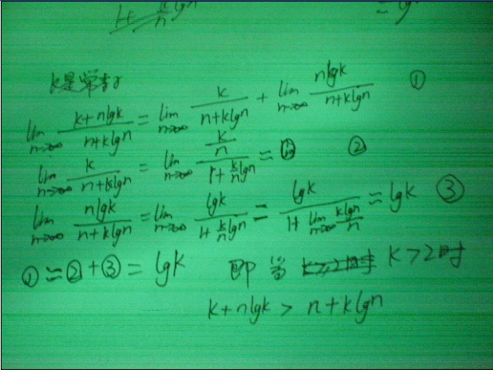  
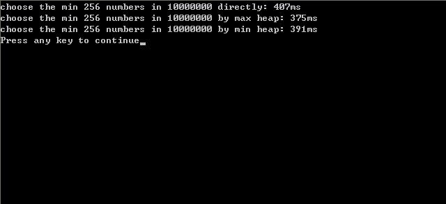  
8. @lingyun310：与上述思路7类似，不同的是在对元素数组原地建最小堆O(n)后，然后提取K次，<u>**但是每次提取时，换到顶部的元素只需要下移顶多k次就足够了**</u>，下移次数逐次减少（而上述思路7每次提取都需要logn，所以提取k次，思路7需要`k*logn`。而本思路8只需要K^2）。此种方法的复杂度为`O(n+k^2)`。@July：对于这个`O（n+k^2）`的复杂度，我相当怀疑。因为据我所知，n个元素的堆，堆中任何一项操作的复杂度皆为logn，所以按理说，lingyun310方法的复杂度应该跟下述思路8一样，也为`O（n+k*logn）`，而非`O（n+k*k）`。ok，先放到这，待时间考证。06.02。


经过和几个朋友的讨论，已经证实，上述思路7lingyun310所述的思路应该是完全可以的。下面，我来具体解释下他的这种方法。

我们知道，n个元素的最小堆中，可以先取出堆顶元素得到我们第1小的元素，然后把堆中最后一个元素（较大的元素）上移至堆顶，成为新的堆顶元素（取出堆顶元素之后，把堆中下面的最后一个元素送到堆顶的过程可以参考下面的第一幅图。至于为什么是怎么做，为什么是把最后一个元素送到堆顶成为堆顶元素，而不是把原来堆顶元素的儿子送到堆顶呢?具体原因可参考相关书籍）。

此时，堆的性质已经被破坏了，所以此后要调整堆。怎么调整呢?就是一般人所说的针对新的堆顶元素shiftdown，逐步下移（因为新的堆顶元素由最后一个元素而来，比较大嘛，既然是最小堆，当然大的元素就要下沉到堆的下部了）。下沉多少步呢?即如lingyun310所说的，下沉k次就足够了。

下移k次之后，此时的堆顶元素已经是我们要找的第2小的元素。然后，取出这个第2小的元素（堆顶元素），再次把堆中的最后一个元素送到堆顶，又经过k-1次下移之后（此后下移次数逐步减少，k-2，k-3,...k=0后算法中断）....，如此重复k-1趟操作，不断取出的堆顶元素即是我们要找的最小的k个数。虽然上述算法中断后整个堆已经不是最小堆了，但是求得的k个最小元素已经满足我们题目所要求的了，就是说已经找到了最小的k个数，那么其它的咱们不管了。

<u>我可以再举一个形象易懂的例子</u>。你可以想象在一个水桶中，有很多的气泡，这些气泡从上到下，总体的趋势是逐渐增大的，但却不是严格的逐次大（正好这也符合最小堆的性质）。ok，现在我们取出第一个气泡，那这个气泡一定是水桶中所有气泡中最小的，把它取出来，然后把最下面的那个大气泡（但不一定是最大的气泡）移到最上面去，此时违反了气泡从上到下总体上逐步变大的趋势，所以，要把这个大气泡往下沉，下沉到哪个位置呢?就是下沉k次。下沉k次后，最上面的气泡已经肯定是最小的气泡了，把他再次取出。然后又将最下面最后的那个气泡移至最上面，移到最上面后，再次让它逐次下沉，下沉k-1次...，如此循环往复，最终取到最小的k个气泡。

ok，所以，上面方法所述的过程，更进一步来说，其实是第一趟调整保持第0层到第k层是最小堆，第二趟调整保持第0层到第k-1层是最小堆...，依次类推。但这个思路只是下述思路8中正规的最小堆算法（因为它最终对全部元素都进行了调整，算法结束后，整个堆还是一个最小堆）的调优，时间复杂度O（n+k^2）没有量级的提高，空间复杂度为O（N）也不会减少。

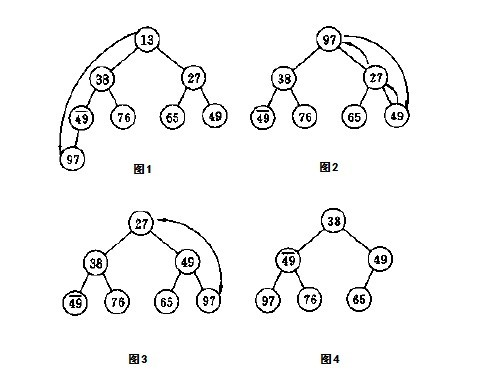  


在算法导论第6章有下面这样一张图，因为开始时曾一直纠结过这个问题，“取出堆顶元素之后，把堆中下面的最后一个元素送到堆顶”。因为算法导论上下面这张图给了我一个假象，从a）->b）中，让我误以为是取出堆顶元素之后，是把原来堆顶元素的儿子送到堆顶。而事实上不是这样的。<u>因为在下面的图中，16被删除后，堆中最后一个元素1代替16成为根结点，然后1下沉（注意下图所示的过程是最大堆的堆排序过程，不再是上面的最小堆了，所以小的元素当然要下移），14上移到堆顶。所以，图中小图图b）是已经在小图a）之和被调整过的最大堆了</u>，只是调整了logn次，非上面所述的k次。

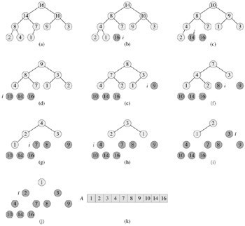  


### 解法总结

updated ：本文昨晚发布后，现在朋友们之间，主要有以下几种观点（在彻底弄清之前，最好不要下结论）：

1. luuillu：我不认为随机快排比直接快排的时间复杂度小。使用快排处理数据前，我们是不知道数据的排列规律的，因此一般情况下，被处理的数据本来就是一组随机数据，对于随机数据再多进行一次随机化处理，数据仍然保持随机性，对排序没有更好的效果。   对一组数据采用随选主元的方法，在极端的情况下，也可能出现每次选出的主元恰好是从大到小排列的，此时时间复杂度为O（n^2）.当然这个概率极低。随机选主元的好处在于，由于在现实中常常需要把一些数据保存为有序数据，因此，快速排序碰到有序数据的概率就会高一些，使用随机快排可以提高对这些数据的处理效率。这个概率虽然高一些，但仍属于特殊情况，不影响一般情况的时间复杂度。我觉得楼主上面提到的的思路4和思路5的时间复杂度是一样的。
2. 571楼 得分：0 Sorehead 回复于：2011-03-09 16:29:58

	关于第五题：
	
	**Sorehead**： 这两天我总结了一下，有以下方法可以实现：
	1. 第一次遍历取出最小的元素，第二次遍历取出第二小的元素，依次直到第k次遍历取出第k小的元素。这种方法最简单，时间复杂度是`O(k*n)`。看上去效率很差，但当k很小的时候可能是最快的。
	2. 对这n个元素进行排序，然后取出前k个数据即可，可以采用比较普遍的堆排序或者快速排序，时间复杂度是`O(n*logn)`。这种方法有着很大的弊端，题目并没有要求这最小的k个数是排好序的，更没有要求对其它数据进行排序，对这些数据进行排序某种程度上来讲完全是一种浪费。而且当k=1时，时间复杂度依然是`O(n*logn)`。
	3. 可以把快速排序改进一下，应该和楼主的kth_elem一样，这样的好处是不用对所有数据都进行排序。平均时间复杂度应该是`O(n*logk)`。（*在本文最后一节，你或将看到，复杂度可能应该为O（n）*）
	4. 使用我开始讲到的平衡二叉树或红黑树，树只用来保存k个数据即可，这样遍历所有数据只需要一次。时间复杂度为`O(n*logk)`。后来我发现这个思路其实可以再改进，使用堆排序中的堆，堆中元素数量为k，这样堆中最大元素就是头节点，**遍历所有数据时比较次数更少**，当然时间复杂度并没有变化。
	5. 使用计数排序的方法，创建一个数组，以元素值为该数组下标，数组的值为该元素在数组中出现的次数。这样遍历一次就可以得到这个数组，然后查询这个数组就可以得到答案了。时间复杂度为O(n)。如果元素值没有重复的，还可以使用位图方式。这种方式有一定局限性，元素必须是正整数，并且取值范围不能太大，否则就造成极大的空间浪费，同时时间复杂度也未必就是O(n)了。当然可以再次改进，使用一种比较合适的哈希算法来代替元素值直接作为数组下标。
3. **litaoye**：按照算法导论上所说的，最坏情况下线性时间找第k大的数。证明一下：把数组中的元素，5个分为1组排序，排序需要进行7次比较`(2^7 > 5!)`，这样需要`1.4 * n`次比较，可以完成所有组的排序。取所有组的中位数，形成一个新的数组，有n/5个元素，5个分为1组排序，重复上面的操作，直到只剩下小于5个元素，找出中位数。根据等比数列求和公式，求出整个过程的比较次数：`7/5 + 7/25 + 7/125 +...... = 7/4`，用`7/4 * n`次比较可以找出中位数的中位数M。能够证明，整个数组中>=M的数超过`3*n / 10 - 6`，<=M的数超过`3*n / 10 - 6`。以M为基准，执行上面的PARTITION，每次至少可以淘汰`3*n / 10 - 6`，约等于`3/10 * n`个数，也就是说是用`(7/4 + 1) * n`次比较之后，最坏情况下可以让数据量变为原来的7/10，同样根据等比数列求和公式，**可以算出最坏情况下找出第k大的数需要的比较次数，`1 + 7/10 + 49/100 + .... = 10/3`, `10/3 * 11/4 * n = 110/12 * n`，也就是说整个过程是O(n)的，尽管隐含的常数比较大** 。

总结：

关于RANDOMIZED-SELECT(A, q + 1, r, i - k)，期望运行时间为O（n）已经没有疑问了，更严格的论证在上面的第二节也已经给出来了。

ok，现在，咱们剩下的问题是，除了此RANDOMIZED-SELECT(A, q + 1, r, i - k)方法（实用价值并不大）和计数排序，都可以做到O（n）之外，还有**类似快速排序的partition过程**，是否也能做到O（n）?

### 扩展深入1：类似partition过程，最坏亦能做到O（n）?

我想，经过上面的各路好汉的思路轰炸，您的头脑和思维肯定有所混乱了。ok，下面，我尽量以通俗易懂的方式来继续阐述咱们的问题。上面第三节的总结提出了一个问题，即类似快速排序的partition过程，是否也能做到O（n）?

我们说对n个数进行排序，快速排序的平均时间复杂度为`O（n*logn）`，这个`n*logn`的时间复杂度是如何得来的列?

经过之前我的有关快速排序的三篇文章，相信您已经明了了以下过程：快速排序每次选取一个主元X，依据这个主元X，每次把整个序列划分为A，B俩个部分，且有Ax<X<Bx。

假如我们每次划分总是产生9:1 的划分，那么，快速排序运行时间的递归式为：`T（n）=T（9n/10）+T（n/10）+cn`。形成的递归树，（注：最后同样能推出`T（n）=n*logn`，即如下图中，每一层的代价为cn，共有logn层（深度），所以，最后的时间复杂度为`O（n）*logn）`如下：

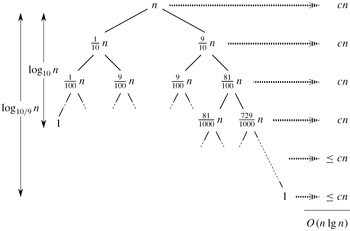  

而我们知道，如果我们每次划分都是平衡的，即每次都划分为均等的两部分元素（对应上图，第一层1/2,1/2，，第二层1/4，1/4.....），那么，此时快速排序的运行时间的递归式为：

T (n) ≤ 2T (n/2) + Θ(n) ,同样，可推导出：T (n) = O(n lg n).

这就是快速排序的平均时间复杂度的由来。

那么，咱们要面对的问题是什么，要寻找n个数的序列中前k个元素。如何找列?假设咱们首先第一次对n个数运用快速排序的partition过程划分，主元为Xm，此刻找到的主元元素Xm肯定为序列中第m小的元素，此后，分为三种情况：

1. 如果m=k，即返回的主元即为我们要找的第k小的元素，那么直接返回主元Xm即可，然后直接输出Xm前面的m-1个元素，这m个元素，即为所求的前k个最小的元素。
2. 如果m>k，那么接下来要到低区间A[0....m-1]中寻找，丢掉高区间；
3. 如果m<k，那么接下来要到高区间A[m+1...n-1]中寻找，丢掉低区间。

**当m一直>k的时候**，好说，区间总是被不断的均分为俩个区间（理想情况），那么最后的时间复杂度如luuillu所说，T(n)=n + T(n/2) = n + n/2 + n/4 + n/8 + ...+1 . 式中一共logn项。可得出：T（n）为O（n）。

**但当m<k的时候**，上述情况，就不好说了。正如luuillu所述：当m<k，那么接下来要到高区间A[m+1...n-1]中寻找,新区间的长度为n-m-1, 需要寻找 k-m个数。此时可令：k=k-m, m=n-m-1, 递归调用原算法处理，本次执行次数为 m,当m减到1算法停止（*当m<k 时 ,k=m-k.这个判断过程实际上相当于对m取模运算，即：k=k%m;*）。

最终在高区间找到的k-m个数，加上在低区间的k个数，即可找到最小的k个数，是否也能得出T（n）=O（n），则还有待验证（*本文已经全面更新，所有的论证，都已经给出，确认无误的是：类似快速排序的partition过程，明确的可以做到O（N）*）。

Ok，如果在评论里回复，有诸多不便，欢迎到此帖子上回复：[微软100题维护地址](http://topic.csdn.net/u/20101126/10/b4f12a00-6280-492f-b785-cb6835a63dc9_9.html)，我会随时追踪这个帖子。谢谢。

```cpp  
//求取无序数组中第K个数，本程序枢纽元的选取有问题，不作推荐。
//copyright@ 飞羽
//July、yansha，updated，2011.05.18。
#include <iostream>
#include <time.h>
using namespace std;

int kth_elem(int a[], int low, int high, int k)
{
    int pivot = a[low];
    //这个程序之所以做不到O（N）的最最重要的原因，就在于这个枢纽元的选取。
    //而这个程序直接选取数组中第一个元素作为枢纽元，是做不到平均时间复杂度为 O（N）的。  

    //要 做到，就必须 把上面选取枢纽元的 代码改掉，要么是随机选择数组中某一元素作为枢纽元，能达到线性期望的时间  
    //要么是选取数组中中位数的中位数作为枢纽元，保证最坏情况下，依然为线性O（N）的平均时间复杂度。  
    int low_temp = low;
    int high_temp = high;
    while(low < high)
    {
        while(low < high && a[high] >= pivot)
            --high;
        a[low] = a[high];
        while(low < high && a[low] < pivot)
            ++low;
        a[high] = a[low];
    }
    a[low] = pivot;

    //以下就是主要思想中所述的内容
    if(low == k - 1)
        return a[low];
    else if(low > k - 1)
        return kth_elem(a, low_temp, low - 1, k);
    else
        return kth_elem(a, low + 1, high_temp, k);
}

int main()   //以后尽量不再用随机产生的数组进行测试，没多大必要。  
{  
    for (int num = 5000; num < 50000001; num *= 10)  
    {  
        int *array = new int[num];  

        int j = num / 10;  
        int acc = 0;  
        for (int k = 1; k <= num; k += j)  
        {  
            // 随机生成数据  
            srand(unsigned(time(0)));  
            for(int i = 0; i < num; i++)
                array[i] = rand() * RAND_MAX + rand();
            //”如果数组本身就是利用随机化产生的话，那么选择其中任何一个元素作为枢轴都可以看作等价于随机选择枢轴，  
            //（虽然这不叫随机选择枢纽）”，这句话，是完全不成立的，是错误的。  

            //“因为你总是选择 随机数组中第一个元素 作为枢纽元，不是 随机选择枢纽元”  
            //相当于把上面这句话中前面的 “随机” 两字去掉，就是：  
            //因为 你总是选择数组中第一个元素作为枢纽元，不是 随机选择枢纽元。  
            //所以，这个程序，始终做不到平均时间复杂度为O（N）。  

            //随机数组和给定一个非有序而随机手动输入的数组，是一个道理。稍后，还将就程序的运行结果继续解释这个问题。  
            //July、updated，2011.05.18。  

            // 计算一次查找所需的时钟周期数  
            clock_t start = clock();  
            int data = kth_elem(array, 0, num - 1, k);  
            clock_t end = clock();  
            acc += (end - start);  
        }  
        cout << "The average time of searching a date in the array size of " << num << " is " << acc / 10 << endl;  
    }  
    return 0;
}
```

关于上述程序的更多阐述，请参考此文[第三章续、Top K算法问题的实现](http://blog.csdn.net/v_JULY_v/archive/2011/05/08/6403777.aspx)中，第一节有关实现三的说明。

updated：

近日，再次在Mark Allen Weiss的数据结构与算法分析一书上，第10章，第10.2.3节看到了关于此分治算法的应用，平均时间复杂度为O（N）的阐述与证明，可能本文之前的叙述将因此而改写（*July、updated，2011.05.05*）：

The selection problem requires us to find the kth smallest element in a list S of n elements（要求我们找出含N个元素的表S中的第k个最小的元素）. Of particular interest is the special case of finding the median. This occurs when k = |-n/2-|（向上取整）.（我们对找出中间元素的特殊情况有着特别的兴趣，这种情况发生在k=|-n/2-|的时候）

In Chapters 1, 6, 7 we have seen several solutions to the selection problem. The solution in Chapter 7 uses a variation of quicksort and runs in O(n) average time（第7章中的解法，即本文上面第1节所述的思路4，用到快速排序的变体并以平均时间O（N）运行）. Indeed, it is described in Hoare's original paper on quicksort.

Although this algorithm runs in linear average time, it has a worst case of O (n2)（但它有一个O（N^2）的最快情况）. Selection can easily be solved in O(n log n) worst-case time by sorting the elements, but for a long time it was unknown whether or not selection could be accomplished in O(n) worst-case time. The quickselect algorithm outlined in Section 7.7.6 is quite efficient in practice, so this was mostly a question of theoretical interest.

Recall that the basic algorithm is a simple recursive strategy. Assuming that n is larger than the cutoff point where elements are simply sorted, an element v, known as the pivot, is chosen. The remaining elements are placed into two sets, S1 and S2. S1 contains elements that are guaranteed to be no larger than v, and S2 contains elements that are no smaller than v. Finally, if k <= |S1|, then the kth smallest element in S can be found by recursively computing the kth smallest element in S1. If k = |S1| + 1, then the pivot is the kth smallest element. Otherwise, the kth smallest element in S is the (k - |S1| -1 )st smallest element in S2. The main difference between this algorithm and quicksort is that there is only one subproblem to solve instead of two（**这个快速选择算法与快速排序之间的主要区别在于，这里求解的只有一个子问题，而不是两个子问题**）。

定理10.9

The running time of quickselect using median-of-median-of-five partitioning is O(n)。

The basic idea is still useful. Indeed, we will see that we can use it to improve the expected number of comparisons that quickselect makes. To get a good worst case, however, the key idea is to use one more level of indirection. Instead of finding the median from a sample of random elements, we will find the median from a sample of medians.

The basic pivot selection algorithm is as follows:

1. Arrange the n elements into |_n/5_| groups of 5 elements, ignoring the (at most four) extra elements.
2. Find the median of each group. This gives a list M of |_n/5_| medians.
3. Find the median of M. Return this as the pivot, v.

We will use the term **median-of-median-of-five partitioning** to describe the quickselect algorithm that uses the pivot selection rule given above. （我们将用术语“五分化中项的中项”来描述使用上面给出的枢纽元选择法的快速选择算法）。We will now show that median-of-median-of-five partitioning guarantees that each recursive subproblem is at most roughly 70 percent as large as the original（现在我们要证明，“五分化中项的中项”，得保证每个递归子问题的大小最多为原问题的大约70%）. We will also show that the pivot can be computed quickly enough to guarantee an O (n) running time for the entire selection algorithm（我们还要证明，**对于整个选择算法，枢纽元可以足够快的算出，以确保O（N）的运行时间**。看到了没，这再次佐证了我们的类似快速排序的partition过程的分治方法为O（N）的观点）。

..........

证明从略，更多，请参考Mark Allen Weiss的数据结构与算法分析--c语言描述一书上，第10章，第10.2.3节。

updated again：

为了给读者一个彻彻底底、明明白白的论证，我还是决定把书上面的整个论证过程全程贴上来，下面，接着上面的内容，然后直接从其中文译本上截两张图来说明好了（更清晰明了）：

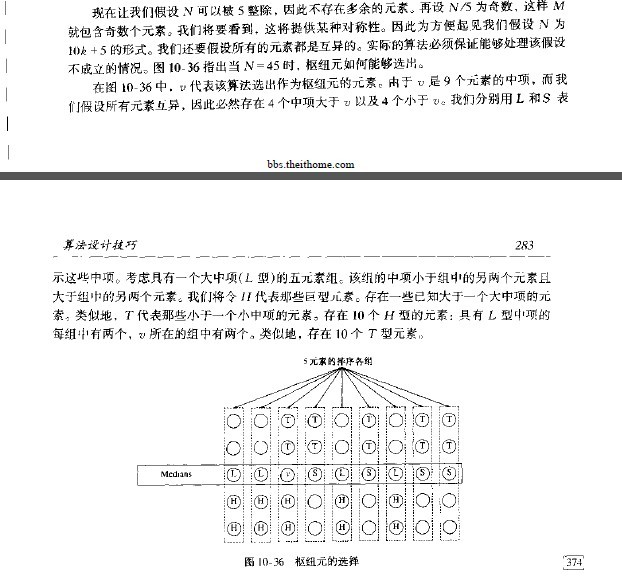  

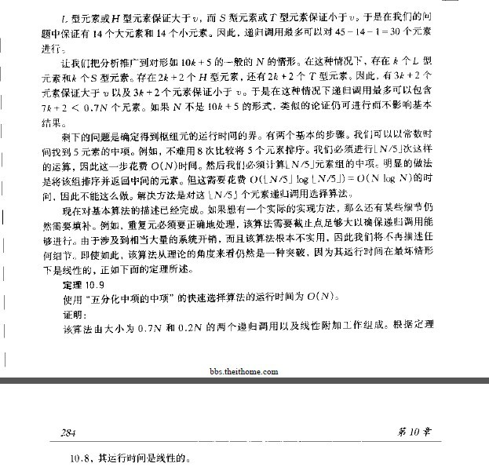  

关于上图提到的定理10.8，如下图所示，至于证明，留给读者练习（可参考本文第二节关于RANDOMIZED-SELECT为线性时间的证明）：

  

ok，第四节，有关此问题的更多论述，请参见下面的本文文末updated again部分。


## 扩展深入2：stl之_nth_element ，逐步实现

以下代码摘自stl中_nth_element的实现，且逐步追踪了各项操作，其完整代码如下：

```cpp  
//_nth_element(...)的实现  
template <class RandomAccessIterator, class T>  
void __nth_element(RandomAccessIterator first, RandomAccessIterator nth,  
                   RandomAccessIterator last, T*) {  
  while (last - first > 3) {  
    RandomAccessIterator cut = __unguarded_partition    //下面追踪__unguarded_partition  
      (first, last, T(__median(*first, *(first + (last - first)/2),  
                               *(last - 1))));  
    if (cut <= nth)  
      first = cut;  
    else
      last = cut;  
  }  
  __insertion_sort(first, last);    //下面追踪__insertion_sort(first, last)  
}  

//__unguarded_partition()的实现  
template <class RandomAccessIterator, class T>  
RandomAccessIterator __unguarded_partition(RandomAccessIterator first,
                                           RandomAccessIterator last,
                                           T pivot) {  
  while (true) {  
    while (*first < pivot) ++first;  
    --last;  
    while (pivot < *last) --last;  
    if (!(first < last)) return first;  
    iter_swap(first, last);  
    ++first;  
  }  
}

//__insertion_sort(first, last)的实现  
template <class RandomAccessIterator>  
void __insertion_sort(RandomAccessIterator first, RandomAccessIterator last) {  
  if (first == last) return;
  for (RandomAccessIterator i = first + 1; i != last; ++i)  
    __linear_insert(first, i, value_type(first));    //下面追踪__linear_insert  
}  

//_linear_insert()的实现  
template <class RandomAccessIterator, class T>  
inline void __linear_insert(RandomAccessIterator first,
                            RandomAccessIterator last, T*) {  
  T value = *last;  
  if (value < *first) {  
    copy_backward(first, last, last + 1);  //这个追踪，待续  
    *first = value;  
  }  
  else  
    __unguarded_linear_insert(last, value);        //最后，再追踪__unguarded_linear_insert  
}  

//_unguarded_linear_insert()的实现  
template <class RandomAccessIterator, class T>  
void __unguarded_linear_insert(RandomAccessIterator last, T value) {  
  RandomAccessIterator next = last;  
  --next;  
  while (value < *next) {  
    *last = *next;  
    last = next;  
    --next;  
  }  
  *last = value;  
}
```

### 扩展深入2：再探Selection_algorithm，类似partition方法O（n）再次求证

网友反馈：

stupidcat：用类似快排的partition的方法，只求2边中的一边，在O(N)时间得到第k大的元素v；
弄完之后，vector<int> &data的前k个元素，就是最小的k个元素了。
时间复杂度是O(N)，应该是最优的算法了。并给出了代码示例：

```cpp  
//copyright@ stupidcat  
//July、updated，2011.05.08  
int Partition(vector<int> &data, int headId, int tailId)
//这里，采用的是算法导论上的partition过程方法  
{
    int posSlow = headId - 1, posFast = headId;    //一前一后，俩个指针  
    for (; posFast < tailId; ++posFast)
    {
        if (data[posFast] < data[tailId])   //以最后一个元素作为主元  
        {
            ++posSlow;
            swap(data[posSlow], data[posFast]);
        }
    }
    ++posSlow;
    swap(data[posSlow], data[tailId]);
    return posSlow;    //写的不错，命名清晰  
}

void FindKLeast(vector<int> &data, int headId, int tailId, int k)
//寻找第k小的元素  
{
    if (headId < tailId)
    {
        int midId = Partition(data, headId, tailId);
        //可惜这里，没有随机或中位数的方法选取枢纽元（主元），使得本程序思路虽对，却不达O（N）的目标  

        if (midId > k)
        {
            FindKLeast(data, headId, midId - 1, k);    //k<midid，直接在低区间找  
        }

        else
        {
            if (midId < k)
            {
                FindKLeast(data, midId + 1, tailId, k);   //k>midid，递归到高区间找  
            }
        }
    }
}  

void FindKLeastNumbers(vector<int> &data, unsigned int k)
{
    int len = data.size();
    if (k > len)
    {
        throw new std::exception("Invalid argument!");
    }
    FindKLeast(data, 0, len - 1, k);
}
```

看来，这个问题，可能会因此纠缠不清了，近日，在维基百科的英文页面上，找到有关Selection_algorithm的资料，上面给出的示例代码为：

```cpp  
function partition(list, left, right, pivotIndex)  
     pivotValue := list[pivotIndex]  
     swap list[pivotIndex] and list[right]  // Move pivot to end  
     storeIndex := left  
     for i from left to right  
         if list[i] < pivotValue  
             swap list[storeIndex] and list[i]  
             increment storeIndex  
     swap list[right] and list[storeIndex]  // Move pivot to its final place  
     return storeIndex  

 function select(list, left, right, k)  
     if left = right  
         return list[left]  
     select pivotIndex between left and right  
     pivotNewIndex := partition(list, left, right, pivotIndex)  
     pivotDist := pivotNewIndex - left + 1  
     if pivotDist = k
         return list[pivotNewIndex]  
     else if k < pivotDist
         return select(list, left, pivotNewIndex - 1, k)  
     else  
         return select(list, pivotNewIndex + 1, right, k - pivotDist)  
```

这个算法，其实就是在本人这篇文章：[当今世界最受人们重视的十大经典算法](http://blog.csdn.net/v_JULY_v/archive/2011/03/07/6228235.aspx)里提到的：第三名：BFPRT 算法：

> A worst-case linear algorithm for the general case of selecting the kth largest element was published by Blum,  
> Floyd, Pratt, Rivest and Tarjan in their 1973 paper "Time bounds for selection",
> sometimes called BFPRT after the last names of the authors.  
> It is based on the quickselect algorithm and is also known as the median-of-medians algorithm.

同时据维基百科上指出，若能选取一个好的pivot，则此算法能达到O（n）的最佳时间复杂度。

> The median-calculating recursive call does not exceed worst-case linear behavior
because the list of medians is 20% of the size of the list,
while the other recursive call recurs on at most 70% of the list, making the running time

> `T(n) ≤ T(n/5) + T(7n/10) + O(n)`

> The O(n) is for the partitioning work (we visited each element a constant number of times，  
> in order to form them into O(n) groups and take each median in O(1) time).  
> From this, one can then show that `T(n) ≤ c*n*(1 + (9/10) + (9/10)2 + ...) = O(n)`.

当然，上面也提到了用堆这个数据结构，扫描一遍数组序列，建k个元素的堆O（k）的同时，调整堆（logk），然后再遍历剩下的n-k个元素，根据其与堆顶元素的大小比较，决定是否更新堆，更新一次logk，所以，最终的时间复杂度为`O（k*logk+(n-k)*logk）=O（n*logk）`。

> Another simple method is to add each element of the list into an ordered set data structure,  
> such as a heap or self-balancing binary search tree, with at most k elements.  
> Whenever the data structure has more than k elements, we remove the largest element,  
> which can be done in O(log k) time. Each insertion operation also takes O(log k) time,  
> resulting in O(nlog k) time overall.

而如果上述类似快速排序的partition过程的BFPRT 算法成立的话，则将最大限度的优化了此寻找第k个最小元素的算法复杂度（*经过第1节末+第二节+第4节末的updated，以及本节的论证，现最终确定，运用类似快速排序的partition算法寻找最小的k个元素能做到O（N）的复杂度，并确认无疑*。July、updated，2011.05.05.凌晨）。

updated again：

为了再次佐证上述论证之不可怀疑的准确性，我再原文引用下第九章第9.3节全部内容（最坏情况线性时间的选择），如下（我酌情对之参考原中文版做了翻译，下文中括号内的中文解释，为我个人添加）：

> 9.3 Selection in worst-case linear time（*最坏情况下线性时间的选择算法*）
> 
> We now examine a selection algorithm whose running time isO(n) in the worst case（现在来看，一个最坏情况运行时间为O（N）的选择算法SELECT）. Like RANDOMIZED-SELECT, the algorithm SELECT finds the desired element by recursively partitioning the input array. The idea behind the algorithm, however, is toguarantee a good split when the array is partitioned. SELECT uses the deterministic partitioning algorithm PARTITION from quicksort (seeSection 7.1), modified to take the element to partition around as an input parameter（像RANDOMIZED-SELECT一样，SELECTT通过输入数组的递归划分来找出所求元素，但是，该算法的基本思想是要保证对数组的划分是个好的划分。SECLECT采用了取自快速排序的确定性划分算法partition，并做了修改，把划分主元元素作为其参数）.
> 
> The SELECT algorithm determines theith smallest of an input array ofn > 1 elements by executing the following steps. (Ifn = 1, then SELECT merely returns its only input value as theith smallest.)（算法SELECT通过执行下列步骤来确定一个有n>1个元素的输入数组中的第i小的元素。（如果n=1，则SELECT返回它的唯一输入数值作为第i个最小值。））
> 
> 1. Divide then elements of the input array into⌋ groups of 5 elements each and at most one group made up of the remainingn mod 5 elements.
> 2. Find the median of each of the⌉ groups by first insertion sorting the elements of each group (of which there are at most 5) and then picking the median from the sorted list of group elements.
> 3. Use SELECT recursively to find the medianx of the⌉ medians found in step 2. (If there are an even number of medians, then by our convention,x is the lower median.)
> 4. Partition the input array around the median-of-mediansx using the modified version of PARTITION. Letk be one more than the number of elements on the low side of the partition, so thatx is thekth smallest element and there aren-k elements on the high side of the partition.（利用修改过的partition过程，按中位数的中位数x对输入数组进行划分，让k比划低去的元素数目多1，所以，x是第k小的元素，并且有n-k个元素在划分的高区）
> 5. Ifi =k, then returnx. Otherwise, use SELECT recursively to find theith smallest element on the low side ifi <k, or the (i -k)th smallest element on the high side ifi >k.（**如果要找的第i小的元素等于程序返回的k**，即i=k，则返回x。否则，如果i<k，则在低区递归调用SELECT以找出第i小的元素，如果i>k，则在高区间找第（i-k）个最小元素）

  

> （以上五个步骤，即本文上面的第四节末中所提到的所谓“五分化中项的中项”的方法。）
> 
> To analyze the running time of SELECT, we first determine a lower bound on the number of elements that are greater than the partitioning element x. （为了分析SELECT的运行时间，先来确定大于划分主元元素x的的元素数的一个下界）Figure 9.1 is helpful in visualizing this bookkeeping. At least half of the medians found in step 2 are greater than[1] the median-of-medians x. Thus, at least half of the ⌉ groupscontribute 3 elements that are greater than x, except for the one group that has fewer than 5 elements if 5 does not dividen exactly, and the one group containingx itself. Discounting these two groups, it follows that the number of elements greater thanx is at least：

  

  

> （Figure 9.1: 对上图的解释或称对SELECT算法的分析：n个元素由小圆圈来表示，并且每一个组占一纵列。组的中位数用白色表示，而各中位数的中位数x也被标出。（当寻找偶数数目元素的中位数时，使用下中位数）。箭头从比较大的元素指向较小的元素，从中可以看出，在x的右边，每一个包含5个元素的组中都有3个元素大于x，在x的左边，每一个包含5个元素的组中有3个元素小于x。大于x的元素以阴影背景表示。 ）

> Similarly, the number of elements that are less thanx is at least 3n/10 - 6. Thus, in the worst case, SELECT is called recursively on at most 7n/10 + 6 elements in step 5.

> We can now develop a recurrence for the worst-case running timeT(n) of the algorithm SELECT. Steps 1, 2, and 4 take O(n) time. (Step 2 consists ofO(n) calls of insertion sort on sets of sizeO(1).) Step 3 takes timeT(⌉), and step 5 takes time at mostT(7n/10+ 6), assuming thatT is monotonically increasing. We make the assumption, which seems unmotivated at first, that any input of 140 or fewer elements requiresO(1) time; the origin of the magic constant 140 will be clear shortly. We can therefore obtain the recurrence：  
  

> We show that the running time is linear by substitution. More specifically, we will show thatT(n) ≤cn for some suitably large constant c and alln > 0. We begin by assuming thatT(n) ≤cn for some suitably large constantc and alln ≤ 140; this assumption holds ifc is large enough. We also pick a constanta such that the function described by theO(n) term above (which describes the non-recursive component of the running time of the algorithm) is bounded above byan for alln > 0. Substituting this inductive hypothesis into the right-hand side of the recurrence yields  
```
T(n) ≤ c⌉ +c(7n/10 + 6) +an
     ≤ cn/5 +c + 7cn/10 + 6c +an
     = 9cn/10 + 7c +an
     = cn + (-cn/10 + 7c +an) ,
```  
> which is at mostcn if  
  

> Inequality (9.2) is equivalent to the inequalityc ≥ 10a(n/(n - 70)) when n > 70. Because we assume thatn ≥ 140, we have n/(n - 70) ≤ 2, and so choosing c ≥ 20a will satisfyinequality (9.2). (Note that there is nothing special about the constant 140; we could replace it by any integer strictly greater than 70 and then choosec accordingly.) The worst-case running time of SELECT is therefore linear（**因此，此SELECT的最坏情况的运行时间是线性的**）.

> As in a comparison sort (seeSection 8.1), SELECT and RANDOMIZED-SELECT determine information about the relative order of elements only by comparing elements. Recall fromChapter 8 that sorting requiresΩ(n lgn) time in the comparison model, even on average (see Problem 8-1). The linear-time sorting algorithms in Chapter 8 make assumptions about the input. In contrast, the linear-time selection algorithms in this chapter do not require any assumptions about the input. They are not subject to the Ω(n lgn) lower bound because they manage to solve the selection problem without sorting.

> （与比较排序（算法导论8.1节）中的一样，SELECT和RANDOMIZED-SELECT仅通过元素间的比较来确定它们之间的相对次序。在算法导论第8章中，我们知道在比较模型中，即使在平均情况下，排序仍然要`O（n*logn）`的时间。第8章得线性时间排序算法在输入上做了假设。**相反地，本节提到的此类似partition过程的SELECT算法不需要关于输入的任何假设，它们不受下界`O（n*logn）`的约束，因为它们没有使用排序就解决了选择问题**（看到了没，道出了此算法的本质阿））

> Thus, the running time is linear because these algorithms do not sort; the linear-time behavior is not a result of assumptions about the input, as was the case for the sorting algorithms inChapter 8. Sorting requiresΩ(n lgn) time in the comparison model, even on average (see Problem 8-1), and thus the method of sorting and indexing presented in the introduction to this chapter is asymptotically inefficient.（所以，本节中的选择算法之所以具有线性运行时间，是因为这些算法没有进行排序；线性时间的结论并不需要在输入上所任何假设，即可得到。.....）  

### 全文综述
ok，综述全文，根据选取不同的元素作为主元（或枢纽）的情况，可简单总结如下：

1. **RANDOMIZED-SELECT**，以序列中随机选取一个元素作为主元，可达到线性期望时间O（N）的复杂度。

	这个在本文第一节有关编程之美第2.5节关于寻找最大的k个元素（**但其`n*logk`的复杂度是严重错误的，待勘误,应以算法导论上的为准，随机选取主元，可达线性期望时间的复杂度**），及本文第二节中涉及到的算法导论上第九章第9.2节中（以线性期望时间做选择），都是以随机选取数组中任一元素作为枢纽元的。

2. **SELECT，快速选择算法**，以序列中“五分化中项的中项”，或“中位数的中位数”作为主元（枢纽元），则不容置疑的可保证在最坏情况下亦为O（N）的复杂度。

	这个在本文第四节末，及本文第七节，本文文末中都有所阐述，具体涉及到了算法导论一书中第九章第9.3节的最快情况线性时间的选择，及Mark Allen Weiss所著的数据结构与算法分析--c语言描述一书的第10章第10.2.3节（选择问题）中，都有所阐述。

本文结论：至此，可以毫无保留的确定此问题之结论：*运用类似快速排序的partition的快速选择SELECT算法寻找最小的k个元素能做到O（N）的复杂度*。RANDOMIZED-SELECT可能会有O（N^2）的最坏的时间复杂度，但上面的SELECT算法，采用如上所述的“中位数的中位数”的取元方法，则**可保证此快速选择算法在最坏情况下是线性时间O（N）的复杂度**。

最终验证：

1. 我想，我想，是的，仅仅是我猜想，你可能会有这样的疑问：经过上文大量严谨的论证之后，利用SELECT算法，以序列中“五分化中项的中项”，或“中位数的中位数”作为主元（枢纽元），的的确确在最坏情况下O（N）的时间复杂度内找到第k小的元素，但是，但是，咱们的要面对的问题是什么?咱们是要找最小的k个数阿！不是找第k小的元素，而是找最小的k个数（即不是要你找1个数，而是要你找k个数）?哈哈，问题提的非常之好阿。
2. 事实上，在最坏情况下，能在O（N）的时间复杂度内找到第k小的元素，那么，亦能保证最坏情况下在O（N）的时间复杂度内找到前最小的k个数，咱们得找到一个理论依据，即一个证明（我想，等你看到找到前k个数的时间复杂度与找第k小的元素，最坏情况下，同样是O（N）的时间复杂度后，你便会100%的相信本文的结论了，然后可以通告全世界，你找到了这个世界上最靠谱的中文算法blog，ok，这是后话）。

算法导论第9章第9.3节练习里，有2个题目，与我们将要做的证明是一个道理，请看：

> **Exercises 9.3-4:** ⋆  
> Suppose that an algorithm uses only comparisons to find the ith smallest element in a set of n elements. Show that it can also find the i - 1 smaller elements and the n - i larger elements without performing any additional comparisons.（假设对一个含有n个元素的集合，某算法只需比较来确定第i小的元素。证明：无需另外的比较操作，它也能找到比i 小的i-1个元素和比i大的n-i个元素）。

> **Exercises 9.3-7**  
> Describe an O(n)-time algorithm that, given a set S of n distinct numbers and a positive integer k ≤ n, determines the k numbers in S that are closest to the median of S.（**给出一个O（N）时间的算法，在给定一个有n个不同数字的集合S以及一个正整数K<=n后，它能确定出S中最接近其中位数的k个数**。）

怎么样，能证明么?既然通过本文，咱们已经证明了上述的SELECT算法在最坏情况下O（N）的时间内找到第k小的元素，那么距离咱们确切的问题：寻找最小的k个数的证明，只差一步之遥了。

给点提示：

1. 找到了第K小的数Xk 为O(n)，再遍历一次数组，找出所有比k小的元素O（N）（比较Xk与数组中各数的大小，凡是比Xk小的元素，都是我们要找的元素），最终时间复杂度即为： O（N）（找到第k小的元素） + 遍历整个数组O（N）=O（N）。这个结论非常之简单，也无需证明（但是，正如上面的算法导论练习题9.3-7所述，能否在找到第k小的元素后，能否不需要再比较元素列?）。
2. 我们的问题是，找到 第k小的元素后Xk，是否Xk之前的元素就是我们 要找的最小 的k个数，即，Xk前面的数，是否都<=Xk?因为 那样的话，复杂度则 变为：O（N）+O（K）（遍历找到的第k小元素 前面的k个元素）=O（N+K）=O（N），最坏情况下，亦是线性时间。

*终极结论*：证明只有一句话：因为本文我们所有的讨论都是基于快速排序的*partition*方法，而这个方法，每次划分之后，都保证了 枢纽元Xk的前边元素统统小于Xk，后边元素统统大于Xk（当然，如果你是属于那种打破沙锅问到底的人，你可能还想要我证明partition过程中枢纽元素为何能把整个序列分成左小右大两个部分。但这个不属于本文讨论范畴。读者可参考算法导论第7章第7.1节关于partition过程中循环不变式的证明）。所以，正如本文第一节思路5所述在0（n）的时间内找到第k小的元素，然后遍历输出前面的k个小的元素。如此，再次验证了咱们之前得到的结论：*运用类似快速排序的partition的快速选择SELECT算法寻找最小的k个元素，在最坏情况下亦能做到O（N）的复杂度*。

5、RANDOMIZED-SELECT，每次都是随机选取数列中的一个元素作为主元，在0（n）的时间内找到第k小的元素，然后遍历输出前面的k个小的元素。 如果能的话，那么总的时间复杂度为线性期望时间：O（n+k）=O（n）（当k比较小时）。

所以列，所以，恭喜你，你找到了这个世界上最靠谱的中文算法blog。

updated：

我假设，你并不认为并赞同上述那句话：你找到了这个世界上最靠谱的中文算法blog。ok，我再给你一个证据：我再次在编程珠玑II上找到了SELECT算法能在平均时间O（N）内找出第k小元素的第三个证据。同时，依据书上所说，由于SELECT算法采取partition过程划分整个数组元素，所以在找到第k小的元素Xk之后，Xk+Xk前面的k个元素即为所要查找的k个元素（下图为编程珠玑II第15章第15.2节的截图，同时各位还可看到，**快速排序是递归的对俩个子序列进行操作，而选择算法只对含有K的那一部分重复操作**）。

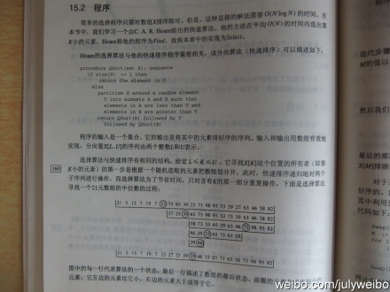  

再多余的话，我不想说了。我知道我的确是一个庸人自扰的P民，即没有问题的事情却硬要弄出一堆问题出来，然后再矢志不渝的论证自己的观点不容置疑之正确性。ok，毕。

备注：

* 快速选择SELECT算法，虽然复杂度平均是o(n)，但这个系数比较大，与用一个最大堆`0(n*logk)`不见得就有优势）
* 当K很小时，`O（N*logK）`与O（N）等价，当K很大时，当然也就不能忽略掉了。也就是说，在我们这个具体寻找k个最小的数的问题中，当我们无法确定K 的具体值时（是小是大），咱们便不能简单的从表面上忽略。也就是说：`O（N*logK）`就是`O（N*logK）`，非O（N）。
	1. 如果n=1024,k=n-1,最差情况下需比较2n次，而nlog(k-1)=10n，所以不相同。实际上，这个算法时间复杂度与k没有直接关系。且只在第一次划分的时候用到了K,后面几次划分，是根据实际情况确定的，与K无关了。
	2. 但k=n/2时也不是nlogk,因为只在第一次划分的时候用到了K,后面几次划分,是根据实际情况确定的,与K无关了。比如a[1001].k=500,第一次把把a划分成两部分,b和c ,不妨设b元素个数为400个,c中元素为600个,则下一步应该舍掉a,然后在c中寻找top100,此时k已经变成了100，因此与k无关。
* 所以，咱们在**表述快速选择算法的平均时间复杂度时，还是要写成O（N）的，断不可写成`O（N*logK）`的**。

## 参考文献

1. Mark Allen Weiss的数据结构与算法分析--c语言描述，第7章第7.7.6节，线性期望时间的选择算法，第10章第10.2.3节，选择问题
2. 算法导论，第九章第9.2节，以线性期望时间做选择，第九章第9.3节，最快情况线性时间的选择
3. 编程之美第一版，第141页，第2.5节 寻找最大的k个数（找最大或最小，一个道理）
4. 维基百科，<http://en.wikipedia.org/wiki/Selection_algorithm>。
5. M. Blum, R.W. Floyd, V. Pratt, R. Rivest and R. Tarjan, "Time bounds for selection,"J. Comput. System Sci. 7 (1973) 448-461.
6. [当今世界最受人们重视的十大经典算法](http://blog.csdn.net/v_JULY_v/archive/2011/03/07/6228235.aspx)里提到的，BFPRT 算法。
7. 编程珠玑II 第15章第15.2节程序。顺便大赞此书。July、updated，2011.05.07。

预告： 程序员面试题狂想曲、第四章（更多有关海量数据处理，及Top K 算法问题（此问题已作为第三章续），第四章，择日发布。），五月份发布（近期内事情较多，且昨夜因修正此文足足熬到了凌晨4点（但室内并无海棠花），写一篇文章太耗精力和时间，见谅。有关本人动态，可关注本人微博：http://weibo.com/julyweibo 。谢谢。July、updated，2011.05.05）。

ok，有任何问题，欢迎随时指出。谢谢。完。
