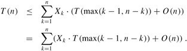
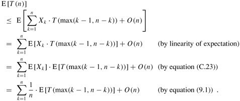
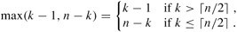
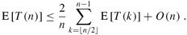
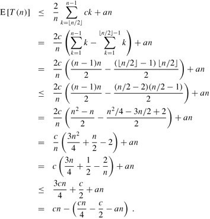
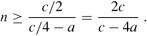
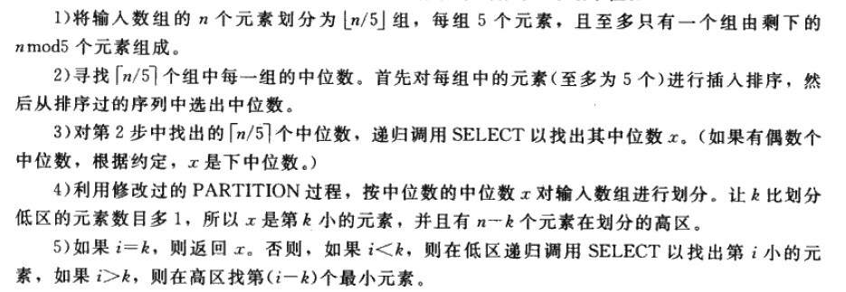
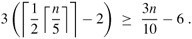
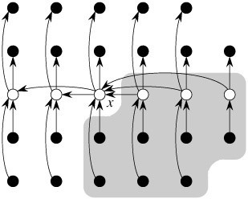
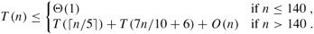

# 寻找最小的k个数


## 题目描述

题目：输入n个整数，输出其中最小的k个。  

例如输入1，2，3，4，5，6，7和8这8个数字，则最小的4个数字为1，2，3和4。  

## 分析与解法
### 解法一

咱们先简单的理解，要求一个序列中最小的k个数，按照惯有的思维方式，很简单，先对这个序列从小到大排序，然后输出前面的最小的k个数即可。

至于选取什么的排序方法，我想你可能会第一时间想到快速排序，我们知道，快速排序平均所费时间为`n*logn`，然后再遍历序列中前k个元素输出，即可，总的时间复杂度为`O（n*logn+k）=O（n*logn）`。

### 解法二

咱们再进一步想想，题目并没有要求要查找的k个数，甚至后n-k个数是有序的，既然如此，咱们又何必对所有的n个数都进行排序列?

这时，咱们想到了用选择或交换排序，即遍历n个数，先把最先遍历到的k个数存入大小为k的数组之中，对这k个数，利用选择或交换排序，找到k个数中的最大数kmax（kmax设为k个元素的数组中最大元素），用时O（k）（你应该知道，插入或选择排序查找操作需要O（k）的时间），后再继续遍历后n-k个数，x与kmax比较：如果x<kmax，则x代替kmax，并再次重新找出k个元素的数组中最大元素kmax‘；如果x>kmax，则不更新数组。这样，每次更新或不更新数组的所用的时间为O（k）或O（0），整趟下来，总的时间复杂度平均下来为：`n*O（k）=O（n*k）`。
	
### 解法三
当然，更好的办法是维护k个元素的最大堆，原理与上述第2个方案一致，即用容量为k的最大堆存储最先遍历到的k个数，并假设它们即是最小的k个数，建堆费时O（k）后，有k1<k2<...<kmax（kmax设为大顶堆中最大元素）。继续遍历数列，每次遍历一个元素x，与堆顶元素比较，x<kmax，更新堆（用时logk），否则不更新堆。这样下来，总费时`O（k+（n-k）*logk）=O（n*logk）`。此方法得益于在堆中，查找等各项操作时间复杂度均为logk（不然，就如上述思路2所述：直接用数组也可以找出前k个小的元素，用时`O（n*k））`。

### 解法四

在mark allen weiss所著的《数据结构与算法分析--c语言描述》一书，第7章第7.7.6节中，阐述了一种在最坏情况下，为线性时间O（N）（是的，**不含期望，是最坏情况下为O（N）**）的快速选择算法，如下述文字：

> Since we can sort the file in O(nlog n) time, one might expect to obtain a better time bound for selection. The algorithm we present to find the kth smallest element in a set S is almost identical to quicksort. In fact, the first three steps are the same. We will call     this algorithm quickselect（叫做快速选择）. Let |Si| denote the number of elements in Si（令|Si|为Si中元素的个数）. The steps of quickselect are（**快速选择，即上述编程之美一书上的，思路4，步骤如下**）:

> 1. If |S| = 1, then k = 1 and return the elements in S as the answer. If a cutoff for small files is being used and |S| <=CUTOFF, then sort S and return the kth smallest element.
> 2. Pick a pivot element, v (- S.（选取一个枢纽元v属于S）
> 3. Partition S - {v} into S1 and S2, as was done with quicksort.
（将集合S-{v}分割成S1和S2，就像我们在快速排序中所作的那样）
> 4. If k <= |S1|, then the kth smallest element must be in S1. In this case, return quickselect (S1, k). If k = 1 + |S1|, then the pivot is the kth smallest element and we can return it as the answer. Otherwise, the kth smallest element lies in S2, and it is the (k - |S1| - 1)st smallest element in S2. We make a recursive call and return quickselect (S2, k - |S1| - 1).
（如果k<=|S1|，那么第k个最小元素必然在S1中。在这种情况下，返回quickselect（S1,k）。如果k=1+|S1|，那么枢纽元素就是第k个最小元素，即找到，直接返回它。否则，这第k个最小元素就在S2中，即S2中的第（k-|S1|-1）个最小元素，我们递归调用并返回quickselect（S2，k-|S1|-1））。

> In contrast to quicksort, quickselect makes only one recursive call instead of two. The worst case of quickselect is identical to that of quicksort and is O(n2). Intuitively, this is because quicksort's worst case is when one of S1 and S2 is empty; thus, quickselect（快速选择） is not really saving a recursive call. The average running time, however, is O(n)（**不过，其平均运行时间为O（N）**。看到了没，就是平均复杂度为O（N）这句话）. The analysis is similar to quicksort's and is left as an exercise.  

并给出了代码示例：

```cpp  
//copyright@ mark allen weiss  
//July、updated，2011.05.05凌晨.  

//q_select places the kth smallest element in a[k]  
void q_select( input_type a[], int k, int left, int right )  
{  
    int i, j;
    input_type pivot;
    if( left + CUTOFF <= right )  
    {
        pivot = median3( a, left, right );
        //取三数中值作为枢纽元，可以消除最坏情况而保证此算法是O（N）的。不过，这还只局限在理论意义上。  
        //稍后，除了下文的第二节的随机选取枢纽元，在第四节末，您将看到另一种选取枢纽元的方法。  

        i=left; j=right-1;
        for(;;)
        {
            while( a[++i] < pivot );
            while( a[--j] > pivot );
            if (i < j )
                swap( &a[i], &a[j] );
            else
                break;
        }
        swap( &a[i], &a[right-1] ); /* restore pivot */
        if( k < i)
            q_select( a, k, left, i-1 );
        else
            if( k > i )
                q-select( a, k, i+1, right );
    }  
    else
        insert_sort(a, left, right );
}
```

这个快速选择SELECT算法，类似快速排序的划分方法，N个数存储在数组S中，再从数组中选取“中位数的中位数”作为枢纽元X，把数组划分为Sa和Sb俩部分，Sa<=X<=Sb，如果要查找的k个元素小于Sa的元素个数，则返回Sa中较小的k个元素，否则返回Sa中所有元素+Sb中小的k-|Sa|个元素，这种解法在最坏情况下亦能做到O（N）的复杂度。

取三数中值作为枢纽元，可以消除最坏情况而保证此算法是O（N）的。不过，这还只局限在理论意义上。

### 解法五
此外，算法导论上介绍了一个随机选取主元的选择算法RANDOMIZED-SELECT，它每次都是随机选取数列中的一个元素作为主元，在0（n）的时间内找到第k小的元素，然后遍历输出前面的k个小的元素。 如果能的话，那么总的时间复杂度为线性期望时间：`O（n+k）=O（n）`（当k比较小时）。

我们知道，快速排序是以固定的第一个或最后一个元素作为主元，每次递归划分都是不均等的，最后的平均时间复杂度为：`O（n*logn）`,而RANDOMIZED-SELECT与普通的快速排序不同的是，每次递归都是随机选择序列从第一个到最后一个元素中任一一个作为主元。

下面是RANDOMIZED-SELECT(A, p, r)完整伪码：

```cpp  
PARTITION(A, p, r)         //partition过程 p为第一个数，r为最后一个数
1  x ← A[r]               //以最后一个元素作为主元
2  i ← p - 1
3  for j ← p to r - 1
4       do if A[j] ≤ x
5             then i ← i + 1
6                  exchange A[i] <-> A[j]
7  exchange A[i + 1] <-> A[r]
8  return i + 1

RANDOMIZED-PARTITION(A, p, r)      //随机快排的partition过程
1  i ← RANDOM(p, r)                                 //i  随机取p到r中个一个值
2  exchange A[r] <-> A[i]                         //以随机的 i作为主元
3  return PARTITION(A, p, r)            //调用上述原来的partition过程

RANDOMIZED-SELECT(A, p, r, i)       //以线性时间做选择，目的是返回数组A[p..r]中的第i 小的元素
1  if p = r          //p=r，序列中只有一个元素
2      then return A[p]
3  q ← RANDOMIZED-PARTITION(A, p, r)   //随机选取的元素q作为主元
4  k ← q - p + 1                     //k表示子数组 A[p…q]内的元素个数，处于划分低区的元素个数加上一个主元元素
5  if i == k                        //检查要查找的i 等于子数组中A[p....q]中的元素个数k
6      then return A[q]        //则直接返回A[q]
7  else if i < k
8      then return RANDOMIZED-SELECT(A, p, q - 1, i)
          //得到的k 大于要查找的i 的大小，则递归到低区间A[p，q-1]中去查找
9  else return RANDOMIZED-SELECT(A, q + 1, r, i - k)
          //得到的k 小于要查找的i 的大小，则递归到高区间A[q+1，r]中去查找。  
```


下面则是算法导论原英文版有关于RANDOMIZED-SELECT(A, p, r)为O（n）的证明，阐述如下：

> 此RANDOMIZED-SELECT最坏情况下时间复杂度为Θ(n2),即使是要选择最小元素也是如此，因为在划分时可能极不走运，总是按余下元素中的最大元素进行划分，而划分操作需要O（n）的时间。

> 然而此算法的平均情况性能极好，因为它是随机化的，故没有哪一种特别的输入会导致其最坏情况的发生。

> 算法导论上，针对此*RANDOMIZED-SELECT算法平均时间复杂度为O（n）的证明*，引用如下，或许，能给你我多点的启示（本来想直接引用第二版中文版的翻译文字，但在中英文对照阅读的情况下，发现第二版中文版的翻译实在不怎么样，所以，得自己一个一个字的敲，最终敲完修正如下），分4步证明：  

> 1. 当RANDOMIZED-SELECT作用于一个含有n个元素的输入数组A[p ..r]上时，所需时间是一个随机变量，记为T(n),我们可以这样得到线性期望值E [T(n)]的下界：程序RANDOMIZED-PARTITION会以等同的可能性返回数组中任何一个元素为主元，因此，对于每一个k，（1 ≤k ≤n）,子数组A[p ..q]有k个元素，它们全部小于或等于主元元素的概率为1/n.对k = 1, 2,...,n,我们定指示器X<sub>k</sub>，为：  
> X<sub>k</sub> = I{子数组A[p ..q]恰有k个元素} ,  
> 我们假定元素的值不同，因此有  
>  E[X<sub>k</sub>]=1/n  
> 当调用RANDOMIZED-SELECT并且选择A[q]作为主元元素的时候,我们事先不知道是否会立即找到我们所想要的第i小的元素，因为，我们很有可能需要在子数组A[p ..q - 1], 或A[q + 1 ..r]上递归继续进行寻找.具体在哪一个子数组上递归寻找，视第i小的元素与A[q]的相对位置而定.  

> 2. 假设T(n)是单调递增的，我们可以将递归所需时间的界限限定在输入数组时可能输入的所需递归调用的最大时间（此句话，原中文版的翻译也是有问题的）.换言之,我们断定,为得到一个上界，我们假定第i小的元素总是在划分的较大的一边，对一个给定的RANDOMIZED-SELECT,指示器Xk刚好在一个k值上取1，在其它的k值时，都是取0.当Xk =1时，可能要递归处理的俩个子数组的大小分别为k-1，和n-k，因此可得到递归式为

  

取期望值为：

  

> 为了能应用等式<u>*(C.23)*</u>,我们依赖于X<sub>k</sub>和T(max(k - 1,n - k))是独立的随机变量（这个可以证明，证明此处略）。  
> 3. 下面，我们来考虑下表达式max(k - 1,n -k)的结果.我们有：  
  
> 如果n是偶数，从T(⌉)到T(n - 1)每个项在总和中刚好出现俩次，T(⌋)出现一次。因此，有  
  

> 我们可以用替换法来解上面的递归式。假设对满足这个递归式初始条件的某个常数c，有T(n) ≤cn。我们假设对于小于某个常数c（稍后再来说明如何选取这个常数）的n，有T(n) =O(1)。 同时，还要选择一个常数a，使得对于所有的n>0，由上式中O(n)项(用来描述这个算法的运行时间中非递归的部分)所描述的函数，可由an从上方限界得到（这里，原中文版的翻译的确是有点含糊）。利用这个归纳假设，可以得到：

  
> 4. 为了完成证明，还需要证明对足够大的n，上面最后一个表达式最大为cn，即要证明：cn/4 -c/2 -an ≥ 0.如果在俩边加上c/2，并且提取因子n，就可以得到n(c/4 -a) ≥c/2.只要我们选择的常数c能满足c/4 -a > 0, i.e.,即c > 4a,我们就可以将俩边同时除以c/4 -a, 最终得到：

  

> 综上，如果假设对n < 2c/(c -4a),有T(n) =O(1)，我们就能得到E[T(n)] =O(n)。所以，最终我们可以得出这样的结论，并确认无疑：**在平均情况下，任何顺序统计量（特别是中位数）都可以在线性时间内得到**。

结论： 如你所见，RANDOMIZED-SELECT有线性期望时间O（N）的复杂度，但此RANDOMIZED-SELECT算法在最坏情况下有O（N^2）的复杂度。所以，我们得找出一种在最坏情况下也为线性时间的算法。稍后，**在本文的第四节末，及本文文末部分**，你将看到一种在**最坏情况下是线性时间O（N）的复杂度的快速选择SELECT算法**。
	
### 解法五

算法导论第九章第9.3节介绍了一个最坏情况线性时间的选择算法，如下（我酌情对之参考原中文版做了翻译，下文中括号内的中文解释，为我个人添加）：

> 9.3 Selection in worst-case linear time（*最坏情况下线性时间的选择算法*）
> 
> We now examine a selection algorithm whose running time isO(n) in the worst case（现在来看，一个最坏情况运行时间为O（N）的选择算法SELECT）. Like RANDOMIZED-SELECT, the algorithm SELECT finds the desired element by recursively partitioning the input array. The idea behind the algorithm, however, is toguarantee a good split when the array is partitioned. SELECT uses the deterministic partitioning algorithm PARTITION from quicksort (seeSection 7.1), modified to take the element to partition around as an input parameter（像RANDOMIZED-SELECT一样，SELECTT通过输入数组的递归划分来找出所求元素，但是，该算法的基本思想是要保证对数组的划分是个好的划分。SECLECT采用了取自快速排序的确定性划分算法partition，并做了修改，把划分主元元素作为其参数）.
> 
> The SELECT algorithm determines theith smallest of an input array ofn > 1 elements by executing the following steps. (Ifn = 1, then SELECT merely returns its only input value as theith smallest.)（算法SELECT通过执行下列步骤来确定一个有n>1个元素的输入数组中的第i小的元素。（如果n=1，则SELECT返回它的唯一输入数值作为第i个最小值。））
> 
> 1. Divide then elements of the input array into⌋ groups of 5 elements each and at most one group made up of the remainingn mod 5 elements.
> 2. Find the median of each of the⌉ groups by first insertion sorting the elements of each group (of which there are at most 5) and then picking the median from the sorted list of group elements.
> 3. Use SELECT recursively to find the medianx of the⌉ medians found in step 2. (If there are an even number of medians, then by our convention,x is the lower median.)
> 4. Partition the input array around the median-of-mediansx using the modified version of PARTITION. Letk be one more than the number of elements on the low side of the partition, so thatx is thekth smallest element and there aren-k elements on the high side of the partition.（利用修改过的partition过程，按中位数的中位数x对输入数组进行划分，让k比划低去的元素数目多1，所以，x是第k小的元素，并且有n-k个元素在划分的高区）
> 5. Ifi =k, then returnx. Otherwise, use SELECT recursively to find theith smallest element on the low side ifi <k, or the (i -k)th smallest element on the high side ifi >k.（**如果要找的第i小的元素等于程序返回的k**，即i=k，则返回x。否则，如果i<k，则在低区递归调用SELECT以找出第i小的元素，如果i>k，则在高区间找第（i-k）个最小元素）

  

> （以上五个步骤，即本文上面的第四节末中所提到的所谓“五分化中项的中项”的方法。）
> 
> To analyze the running time of SELECT, we first determine a lower bound on the number of elements that are greater than the partitioning element x. （为了分析SELECT的运行时间，先来确定大于划分主元元素x的的元素数的一个下界）Figure 9.1 is helpful in visualizing this bookkeeping. At least half of the medians found in step 2 are greater than[1] the median-of-medians x. Thus, at least half of the ⌉ groupscontribute 3 elements that are greater than x, except for the one group that has fewer than 5 elements if 5 does not dividen exactly, and the one group containingx itself. Discounting these two groups, it follows that the number of elements greater thanx is at least：

  

  

> （Figure 9.1: 对上图的解释或称对SELECT算法的分析：n个元素由小圆圈来表示，并且每一个组占一纵列。组的中位数用白色表示，而各中位数的中位数x也被标出。（当寻找偶数数目元素的中位数时，使用下中位数）。箭头从比较大的元素指向较小的元素，从中可以看出，在x的右边，每一个包含5个元素的组中都有3个元素大于x，在x的左边，每一个包含5个元素的组中有3个元素小于x。大于x的元素以阴影背景表示。 ）

> Similarly, the number of elements that are less thanx is at least 3n/10 - 6. Thus, in the worst case, SELECT is called recursively on at most 7n/10 + 6 elements in step 5.

> We can now develop a recurrence for the worst-case running timeT(n) of the algorithm SELECT. Steps 1, 2, and 4 take O(n) time. (Step 2 consists ofO(n) calls of insertion sort on sets of sizeO(1).) Step 3 takes timeT(⌉), and step 5 takes time at mostT(7n/10+ 6), assuming thatT is monotonically increasing. We make the assumption, which seems unmotivated at first, that any input of 140 or fewer elements requiresO(1) time; the origin of the magic constant 140 will be clear shortly. We can therefore obtain the recurrence：  
  

> We show that the running time is linear by substitution. More specifically, we will show thatT(n) ≤cn for some suitably large constant c and alln > 0. We begin by assuming thatT(n) ≤cn for some suitably large constantc and alln ≤ 140; this assumption holds ifc is large enough. We also pick a constanta such that the function described by theO(n) term above (which describes the non-recursive component of the running time of the algorithm) is bounded above byan for alln > 0. Substituting this inductive hypothesis into the right-hand side of the recurrence yields  
```
T(n) ≤ c⌉ +c(7n/10 + 6) +an
     ≤ cn/5 +c + 7cn/10 + 6c +an
     = 9cn/10 + 7c +an
     = cn + (-cn/10 + 7c +an) ,
```  
> which is at mostcn if  
  

> Inequality (9.2) is equivalent to the inequalityc ≥ 10a(n/(n - 70)) when n > 70. Because we assume thatn ≥ 140, we have n/(n - 70) ≤ 2, and so choosing c ≥ 20a will satisfyinequality (9.2). (Note that there is nothing special about the constant 140; we could replace it by any integer strictly greater than 70 and then choosec accordingly.) The worst-case running time of SELECT is therefore linear（**因此，此SELECT的最坏情况的运行时间是线性的**）.

> As in a comparison sort (seeSection 8.1), SELECT and RANDOMIZED-SELECT determine information about the relative order of elements only by comparing elements. Recall fromChapter 8 that sorting requiresΩ(n lgn) time in the comparison model, even on average (see Problem 8-1). The linear-time sorting algorithms in Chapter 8 make assumptions about the input. In contrast, the linear-time selection algorithms in this chapter do not require any assumptions about the input. They are not subject to the Ω(n lgn) lower bound because they manage to solve the selection problem without sorting.

> （与比较排序（算法导论8.1节）中的一样，SELECT和RANDOMIZED-SELECT仅通过元素间的比较来确定它们之间的相对次序。在算法导论第8章中，我们知道在比较模型中，即使在平均情况下，排序仍然要`O（n*logn）`的时间。第8章得线性时间排序算法在输入上做了假设。**相反地，本节提到的此类似partition过程的SELECT算法不需要关于输入的任何假设，它们不受下界`O（n*logn）`的约束，因为它们没有使用排序就解决了选择问题**（看到了没，道出了此算法的本质阿））

> Thus, the running time is linear because these algorithms do not sort; the linear-time behavior is not a result of assumptions about the input, as was the case for the sorting algorithms inChapter 8. Sorting requiresΩ(n lgn) time in the comparison model, even on average (see Problem 8-1), and thus the method of sorting and indexing presented in the introduction to this chapter is asymptotically inefficient.（所以，本节中的选择算法之所以具有线性运行时间，是因为这些算法没有进行排序；线性时间的结论并不需要在输入上所任何假设，即可得到。）  


## 参考文献

1. Mark Allen Weiss的数据结构与算法分析--c语言描述，第7章第7.7.6节，线性期望时间的选择算法，第10章第10.2.3节，选择问题
2. 算法导论，第九章第9.2节，以线性期望时间做选择，第九章第9.3节，最快情况线性时间的选择
3. 编程之美第一版，第141页，第2.5节 寻找最大的k个数（找最大或最小，一个道理）
4. 维基百科，<http://en.wikipedia.org/wiki/Selection_algorithm>。
5. M. Blum, R.W. Floyd, V. Pratt, R. Rivest and R. Tarjan, "Time bounds for selection,"J. Comput. System Sci. 7 (1973) 448-461.
6. [当今世界最受人们重视的十大经典算法](http://blog.csdn.net/v_JULY_v/archive/2011/03/07/6228235.aspx)里提到的，BFPRT 算法。
7. 编程珠玑II 第15章第15.2节程序。
