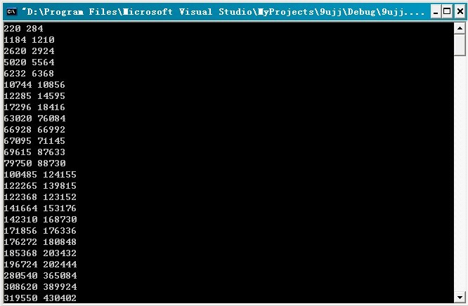

# 求解500万以内的亲和数


## 题目描述

求500万以内的所有亲和数

如果两个数a和b，a的所有真因数之和等于b,b的所有真因数之和等于a,则称a,b是一对亲和数。
例如220和284，1184和1210，2620和2924。

## 思路分析

  首先得明确到底是什么是亲和数?

亲和数问题最早是由毕达哥拉斯学派发现和研究的。他们在研究数字的规律的时候发现有以下性质特点的两个数:

220的真因子是：1、2、4、5、10、11、20、22、44、55、110；

284的真因子是：1、2、4、71、142。

而这两个数恰恰等于对方的真因子各自加起来的和（sum[i]表示数i 的各个真因子的和），即

220=1+2+4+71+142=sum[284],

284=1+2+4+5+10+11+20+22+44+55+110=sum[220]。

得284的真因子之和sum[284]=220，且220的真因子之和sum[220]=284，即有sum[220]=sum[sum[284]]=284。

如此，是否已看出丝毫端倪?

如上所示，考虑到1是每个整数的因子，把出去整数本身之外的所有因子叫做这个数的“真因子”。如果两个整数，其中每一个真因子的和都恰好等于另一个数，那么这两个数，就构成一对“亲和数”（有关亲和数的更多讨论，可参考[这里](http://t.cn/hesH09))。


**求解**:
    了解了什么是亲和数，接下来咱们一步一步来解决上面提出的问题：

1. 看到这个问题后，第一想法是什么？模拟搜索+剪枝？回溯？时间复杂度有多大？其中bn为an的伪亲和数，即bn是an的真因数之和大约是多少？至少是10^10的数量级。那么对于每秒千万次运算的计算机来说，大概在1000多天也就是3年内就可以搞定了（10^10 / 10^7 =1000000秒，大约 278 小时）。如果是基于这个基数在优化，你无法在一天内得到结果的。
2. 一个不错的算法应该在半小时之内搞定这个问题，当然这样的算法有很多。节约时间的做法是可以生成伴随数组，也就是空间换时间，但是那样，空间代价太大，因为数据规模庞大。
3. 在稍后的算法中，依然使用的伴随数组，只不过，因为题目的特殊性，只是它方便和巧妙地利用了下标作为伴随数组，来节约时间。同时，将回溯的思想换成递推的思想(预处理数组的时间复杂度为**O(N\*logN)**(logN为调和级数)，扫描数组的时间复杂度为线性**O(N)**。所以，总的时间复杂度仍然为**O(N\*logN)**(其中logN为调和级数))，扫描数组的时间与其相比是低阶的。

## 解法一、伴随数组线性遍历

依据上文的思路分析，可以编写如下代码：
```c
//求解亲和数问题

//第一个for和第二个for循环是logN*N（调和级数）次遍历,第三个for循环扫描O(N)。
//所以总的时间复杂度为 O(N*logN) + O(n) =O(N*logN+N)（其中logN为调和级数）。

//关于第一个for和第二个for寻找中，调和级数的说明：
//比如给2的倍数加2，那么应该是  n/2次，3的倍数加3 应该是 n/3次，...
//那么其实就是n*（1+1/2+1/3+1/4+...1/(n/2)）=n*（调和级数）=n*logn。

//copyright@ 上善若水
//July、updated，2011.05.24。
#include<stdio.h>

int sum[5000010];   //为防越界

int main()
{
    int i, j;
    for (i = 0; i <= 5000000; i++)
        sum[i] = 1;  //1是所有数的真因数所以全部置1

    for (i = 2; i + i <= 5000000; i++)  //预处理，预处理是logN（调和级数）*N。
        //@litaoye：调和级数1/2 + 1/3 + 1/4......的和近似为ln(n)，
        //因此O(n *(1/2 + 1/3 + 1/4......)) = O(n * ln(n)) = O(N*log(N))。
    {
        //5000000以下最大的真因数是不超过它的一半的
        j = i + i;  //因为真因数，所以不能算本身，所以从它的2倍开始
        while (j <= 5000000)
        {
            //将所有i的倍数的位置上加i
            sum[j] += i;
            j += i;
        }
    }

    for (i = 220; i <= 5000000; i++)   //扫描，O（N）。
    {
        // 一次遍历，因为知道最小是220和284因此从220开始
        if (sum[i] > i && sum[i] <= 5000000 && sum[sum[i]] == i)
        {
            //去重，不越界，满足亲和
            printf("%d %d/n",i,sum[i]);
        }
    }
    return 0;
}
```
**运行结果**:


>   @上善若水：
>
>   1、可能大家理解的还不是很清晰，我们建立一个5 000 000 的数组，从1到2 500 000开始，在每一个下标是i的倍数的位置上加上i，那么在循环结束之后，我们得到的是什么？是类似埃斯托拉晒求素数的数组（当然里面有真的亲和数），然后只需要一次遍历就可以轻松找到所有的亲和数了。时间复杂度，线性。

>   2、我们可以清晰的发现连续数据的映射可以通过数组结构本身的特点替代，用来节约空间，这是数据结构的艺术。在大规模连续数据的回溯处理上，可以通过转化为递推生成的方法，逆向思维操作，这是算法的艺术。

>   3、把最简单的东西运用的最巧妙的人，要比用复杂方法解决复杂问题的人要头脑清晰。


### 解法一的构造与解释

我再来具体解释下上述程序的原理，ok，举个例子，假设是求10以内的亲和数，求解步骤如下：

因为所有数的真因数都包含1，所以，先在各个数的下方全部置1

1\. 然后取i=2,3,4,5（i<=10/2），j依次对应的位置为j=（4、6、8、10），（6、9）,（8）,（10）各数所对应的位置。依据j所找到的位置，在j所指的各个数的下面加上各个真因子i（i=2、3、4、5）。

2\. 整个过程，即如下图所示（如sum[6]=1+2+3=6，sum[10]=1+2+5=8.）:


3\. 然后一次遍历i从220开始到5000000，i每遍历一个数后,
将i对应的数下面的各个真因子加起来得到一个和sum[i]，如果这个和sum[i]==某个i’，且sum[i‘]=i，
那么这两个数i和i’，即为一对亲和数。

4\. i=2；sum[4]+=2，sum[6]+=2，sum[8]+=2，sum[10]+=2，sum[12]+=2...
i=3，sum[6]+=3，sum[9]+=3...

5\. i=220时，sum[220]=284，i=284时，sum[284]=220；即sum[220]=sum[sum[284]]=284，
得出220与284是一对亲和数。所以，最终输出220、284，...

## 解法二

>litaoye专门为本亲和数问题开帖子继续阐述，有兴趣的朋友可继续参见[这里](http://topic.csdn.net/u/20110526/21/129c2235-1f44-42e9-a55f-878920c21e19.html)。同时，任何人对本亲和数问题有任何问题，也可以回复到上述帖子上。

### 深入理解真因子之和

假设一个整数分解因式形式为 

那么它的所有**因子之和**（也就是真因子之和加上其本身）等于


举例说明：90分解质因数为

所以90的因子之和为=(1%2B2)(1%2B3%2B3^2)(1%2B5)=234)

而这个函数f(n)有什么好性质呢？当n=p*q，并且p,q互质时，有：

=f(p)*f(q))

也就是说，我们只要知道n的任意一种pq分解，p、q互质，以及f(p)和f(q)的具体值，就可以快速知道f(n)的值了。

进一步，本例中我们只需要对真因子加和，设其为函数counter(n)。我们就会有counter(n)=f(n)-n的关系。如果我们能快速得到f(n)，counter(n)就不成问题，我们就能快速的验证counter(counter(n))=n来判断亲和数。

### 深入理解质数筛（Prime Sieves）

我们知道在解法一中，预处理时间为O(NlogN)，同时也能看到，为了给一个合数加够它的因子，计算次数相对于f(n)而言实在是太大了，而如果我们能够对每一个数最多操作一次就能知道它的f(n)值（进而知道counter(n)值），那这个算法就变成O(N)的了。

这种算法存在吗？答案是确定的。我们一边找素数一边去确定f(n)的值，那我们就不得不提到这个算法的基础算法：线性素数筛。

#### Eratosthenes近线性素数筛

首先介绍一种使用O(N)空间伴随数组的素数筛

```C
//使用了一个布尔型伴随数组的素数筛
bool* prime(int n) {
  bool *notp = new bool[n];
  memset(notp, false, sizeof(bool)*n );
  for (int i = 2; i < n; i++)
    if (!notp[i])
      for (int j = 2*i; j < n; j+=i)
        notp[j] = true;
  return notp;
}
```

初始化伴随数组为全0后，我们对于每一个在notp中被标记0的下标i，对下标为i的2倍，3倍...的notp元素标记为"true"，即合数。这个算法的好处在于，因为我们从2开始顺序扫描到i的，如果发现i仍然没被标记过"true"，则它没有2到i-1的约束，肯定是素数。而如果一个合数被标记过"true"了，它的倍数肯定也被这个合数的第一个质因数都标记完"true"了，这个算法在标记素数上确实是不漏的，而在标记合数上，标记的次数是这个合数的不同质因数的个数。

整个算法的复杂度为**O(Nloglog(N))**，参考http://en.wikipedia.org/wiki/Prime_harmonic_series 的公式：

)

而且是渐进于这个**loglogN**的。因为loglogN工程上很小，可以当常量来估计。

#### Eratosthenes质数筛

进一步的我们对这个算法进行剪枝，是前述近线性素数筛的加强版，首先我们知道如果质数m小于质数p的平方，则在第p轮循环之前m就被比p还小的质数标记过了；同时对于另外的质数，如果发现它被标记过就跳过标记他。虽然加速了许多，但是考虑到比较大小和幅值的操作代价相差不多，复杂度上界并没有改变。每个合数m都被它的最小质因数标记了1次，其他质因数进行了notp[m]的寻址和比较。

```C
//使用了一个布尔型伴随数组的素数筛
bool* prime_wiki(int n) {
  int i;
  int j;
  bool *notp = new bool[n];
  memset(notp, false, sizeof(bool)*n );
  double sqr = sqrt(double(n));
  for (i = 2; i < sqr; i++)
	  if (!notp[i])
		for (j = i*i; j < n; j+=i)
		  if(!notp[j]){notp[j] = true;}
  return notp;
}
```

#### 线性时间筛

```C
bool* prime_linear(int n) {
    bool *notp = new bool[n];
    int *plist = new int[2*n/log(double(n))+20];
    memset(notp, false, sizeof(bool)*n);
    memset(plist, 0, sizeof(int)*int(2*n/log(double(n))+20));
    int np = 0;
    int i,j;
    double half = double(n)/2;
    for (i = 2; i < n; i++) {
        if (!notp[i]) plist[np++] = i;
		    if (i<half){
			      for (j = 0; (j < np) && (plist[j]*i < n); j++) {
				        notp[plist[j]*i] = 1;
				        if(i%plist[j] == 0) break;
			      }
		    }
    }
    delete plist;
    return notp;
}
```
同时保存一个长度为N的伴随数组表示“p是否为合数”及长度为O(N/log(N))的数组来保存质数列表。这里，每一个质数p会保持notp[p]=0的标记并加入列表，每一个合数也只被它最大的真因数（也就是这个合数除以其最小质因数）标记一次。这样的好处我们可以看到，交换了标记次序并及时使用break，每个合数只需要1次标记和1次判断。

### 线性筛应用于亲和数问题

很多人都觉得近线性已经足够好了，根本不想花O(N/log(N))的空间存储素数。错！在本题中存储素数加上线性筛算法，恰恰保证了寻找合数最小质因数分解的快速性，以提高合数n对应的f(n)的计算，如下C#代码所示。

```csharp
//求解亲和数问题
//copyright@ litaoye
//July、胡滨，updated，2011.05.26。
using System;
using System.Collections.Generic;

namespace CSharpTest
{
    class Program
    {
        public static void Main()
        {
            int max = 5000000;
            DateTime start = DateTime.Now;
            int[] counter = CreateCounter(max);

            for (int i = 0; i < counter.Length; i++)
            {
                int num = counter[i] - i;
                if (num < counter.Length && num > i && counter[num] == counter[i])
                    Console.WriteLine("{0} {1}", i, num);
            }
            Console.WriteLine((DateTime.Now - start).TotalSeconds);

            Console.ReadKey();
        }

        static int[] CreateCounter(int n)
        {
            List<int> primes = new List<int>();
            int[] counter = new int[n + 1];
            counter[1] = 1;

            for (int i = 2; i <= n; i++)
            {
                if (counter[i] == 0)
                {
                    counter[i] = i + 1;
                    primes.Add(i);
                }

                for (int j = 0; j < primes.Count; j++)
                {
                    if (primes[j] * i > n)
                        break;

                    if (i % primes[j] == 0)
                    {
                        int k = i;
                        int l = primes[j] * primes[j];

                        while (k % primes[j] == 0)
                        {
                            l *= primes[j];
                            k /= primes[j];
                        }

                        counter[primes[j] * i] = counter[k] * (l - 1) / (primes[j] - 1);
                        break;
                    }
                    else
                        counter[primes[j] * i] = counter[i] * (primes[j] + 1);
                }
            }

            return counter;
        }
    }
}

/*
测试结果：
0.484375
0.484375
0.46875
单位second。
*/
```

至此，这个算法融合了线性质数筛的最佳性质，它的步骤如下：

 * 我们为1到N存储一个int型伴随数组，存储它们的因子和，而非伴随bool变量，同时也存储质数列表；
 * 刷新伴随数组时，"因子和等于本身加1"等价于"质数"；
 * 我们可以通过伴随数组精确的知道内层循环在哪一步break，进而知道：
    * break之前counter[j]和i本身就互质，直接得到了计算因子和的方案
    * break这一步通过获取得其最小质因数p，找到最大的k使得，从而实现，能够把m分解成两个互质整数的乘积。
 * 知道了m的因子和，减去m就是m的真因子之和，进而考察counter[counter[m]] == m 析出亲和数。
