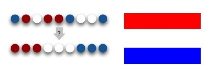
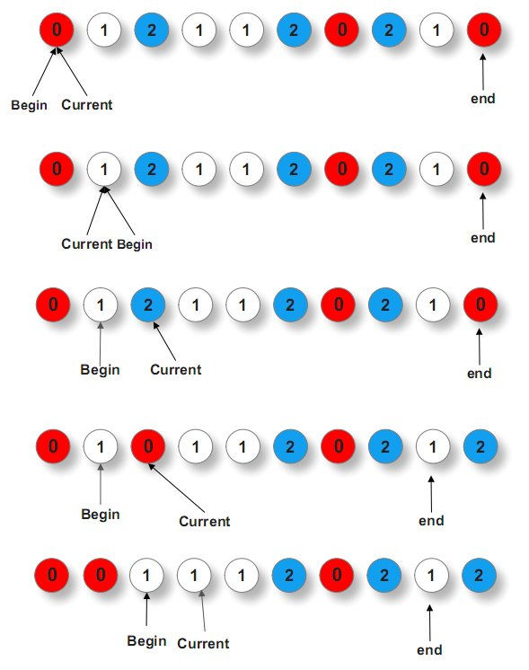

# 荷兰国旗


### 题目描述

拿破仑席卷欧洲大陆之后，代表自由，平等，博爱的竖色三色旗也风靡一时。荷兰国旗就是一面三色旗（只不过是横向的），自上而下为红白蓝三色。



该问题本身是关于三色球排序和分类的，由荷兰科学家Dijkstra提出。由于问题中的三色小球有序排列后正好分为三类，Dijkstra就想象成他母国的国旗，于是问题也就被命名为荷兰旗问题（Dutch National Flag Problem）。

下面是问题的正规描述：
现有n个红白蓝三种不同颜色的小球，乱序排列在一起，请通过两两交换任意两个球，使得从左至右，依次是一些红球、一些白球、一些蓝球。

### 分析与解法

初看此题，我们貌似除了暴力解决并无好的办法，但联想到我们所熟知的快速排序算法呢？

我们知道，快速排序依托于一个partition分治过程，在每一趟排序的过程中，选取的主元都会把整个数组排列成一大一小的部分，那我们是否可以借鉴partition过程设定三个指针完成重新排列，使得所有球排列成三个不同颜色的球呢？

#### 解法一

通过前面的分析得知，这个问题类似快排中partition过程，只是需要用到三个指针：一个前指针begin，一个中指针current，一个后指针end，current指针遍历整个数组序列，当

1. current指针所指元素为0时，与begin指针所指的元素交换，而后current++，begin++ ；
2. current指针所指元素为1时，不做任何交换（即球不动），而后current++ ；
3. current指针所指元素为2时，与end指针所指的元素交换，而后，current指针不动，end-- 。

为什么上述第3点中，current指针所指元素为2时，与end指针所指元素交换之后，current指针不能动呢？因为第三步中current指针所指元素与end指针所指元素交换之前，如果end指针之前指的元素是0，那么与current指针所指元素交换之后，current指针此刻所指的元素是0，此时，current指针能动么？不能动，因为如上述第1点所述，如果current指针所指的元素是0，还得与begin指针所指的元素交换。

ok，说这么多，你可能不甚明了，直接引用下gnuhpc的图，就一目了然了：




参考代码如下：
```cpp
//引用自gnuhpc  
while( current<=end )        
{             
  if( array[current] ==0 )             
   {                 
      swap(array[current],array[begin]);                  
      current++;                  
      begin++;            
   }             
   else if( array[current] == 1 )            
   {                 
      current++;            
   }   
            
   else //When array[current] =2   
   {               
      swap(array[current],array[end]);                
      end--;            
   }      
}  
```

### 举一反三

给定一个字符串里面只有"R" "G" "B" 三个字符，请排序，最终结果的顺序是R在前 G中 B在后。

要求：空间复杂度是O(1)，且只能遍历一次字符串。
