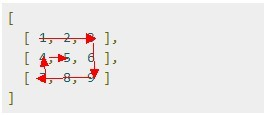

## 本章数组和队列的习题

**1、不用除法运算**


两个数组a[N]，b[N]，其中A[N]的各个元素值已知，现给b[i]赋值，b[i] = a[0]*a[1]*a[2]...*a[N-1]/a[i]；
要求：
 - 1.不准用除法运算
 - 2.除了循环计数值，a[N],b[N]外，不准再用其他任何变量（包括局部变量，全局变量等）
 - 3.满足时间复杂度O(n)，空间复杂度O(1)。

提示：题目要求b[i] = a[0]*a[1]*a[2]...*a[N-1]/a[i] ，相当于求：a[0]*a[1]*a[2]*a[3]...a[i-1]*a[i+1]..*a[N-1]，等价于除掉当前元素a[i]，其他所有元素(a[i]左边部分，和a[i]右边部分)的积。

记left[i]=∏a[k], (k=1...i-1); right=∏a[k], (k=i+1...n)，根据题目描述b[i]=left[i] * right[i]， 对于每一个b[i]初始化为1，left[i]和right[i]两部分可以分开两次相乘，即对于循环变量i=1...n, b[i]=left[i];b[n-i]=right[n-i]， 循环完成时即可完成计算。

参考代码如下所示：
```c
void Multiplication(int a[], int output[], int length)
{
	int left = 1;
	int right = 1;
	for (int i = 0; i < length; i++)
		output[i] = 1;
	for (int i = 0; i < length; i++)
	{
		output[i] *= left;
		output[length - i - 1] *= right;
		left *= a[i];
		right *= a[length - i - 1];
	}
}
```

**3、找出数组中唯一的重复元素**

1-1000放在含有1001个元素的数组中，只有唯一的一个元素值重复，其它均只出现一次。
每个数组元素只能访问一次，设计一个算法，将它找出来；不用辅助存储空间，能否设计一个算法实现？

**4、找出唯一出现的数**

一个数组里，数都是两两出现的，但是有三个数是唯一出现的，找出这三个数。


**5、找出反序的个数**

给定一整型数组，若数组中某个下标值大的元素值小于某个下标值比它小的元素值，称这是一个反序。
即：数组a[]; 对于i < j 且 a[i] > a[j],则称这是一个反序。
给定一个数组，要求写一个函数，计算出这个数组里所有反序的个数。


**6、**

有两个序列A和B,A=(a1,a2,...,ak),B=(b1,b2,...,bk),A和B都按升序排列，对于1<=i,j<=k，求k个最小的（ai+bj），要求算法尽量高效。

**8**

假设一个大小为100亿个数据的数组，该数组是从小到大排好序的，现在该数组分成若干段，每个段的数据长度小于20「也就是说：题目并没有说每段数据的size 相同，只是说每个段的 size < 20 而已」，然后将每段的数据进行乱序（即：段内数据乱序），形成一个新数组。请写一个算法，将所有数据从小到大进行排序，并说明时间复杂度。

**9**

20个排序好的数组，每个数组500个数，按照降序排序好的，让找出500个最大的数。


**10**

O(1)空间内实现矩阵转置。


**11**

有N个数，组成的字符串，如012345，求出字串和取MOD3==0的子串，如012 12 123 45。

**12**

从一列数中筛除尽可能少的数使得从左往右看，这些数是从小到大再从大到小的。

提示：双端 LIS 问题，用 DP 的思想可解。


**13**

有两个序列a,b，大小都为n,序列元素的值是任意整数，无序。要求：通过交换a,b中的元素，使[序列a元素的和]与[序列b元素的和]之间的差最小。

例如:

var a=[100,99,98,1,2, 3];

var b=[1, 2, 3, 4,5,40]。

**14、螺旋矩阵**

Given a matrix of m x n elements (m rows, n columns), return all elements of the matrix in spiral order。一句话，即为螺旋矩阵问题。

举个例子，给定如下的一个矩阵:


你应该返回：[1,2,3,6,9,8,7,4,5]。如下图所示，遍历顺序为螺旋状：




**15**

给你10分钟时间，根据上排给出十个数，在其下排填出对应的十个数 要求下排每个数都是先前上排那十个数在下排出现的次数。 

上排的十个数如下： 

0，1，2，3，4，5，6，7，8，9

举一个例子， 

数值: 0,1,2,3,4,5,6,7,8,9 

分配: 6,2,1,0,0,0,1,0,0,0 

0在下排出现了6次，1在下排出现了2次，

2在下排出现了1次，3在下排出现了0次.... 

以此类推..


**16**

对于一个整数矩阵，存在一种运算，对矩阵中任意元素加一时，需要其相邻（上下左右），某一个元素也加一，现给出一正数矩阵，判断其是否能够由一个全零矩阵经过上述运算得到。

**17**

一个整数数组，长度为n，将其分为m份，使各份的和相等，求m的最大值。

比如{3，2，4，3，6} 可以分成
- {3，2，4，3，6} m=1; 
- {3,6}{2,4,3} m=2
- {3,3}{2,4}{6} m=3 

所以m的最大值为3。

**18**

求一个数组的最长递减子序列 比如{9，4，3，2，5，4，3，2}的最长递减子序列为{9，5，4，3，2}。


**19**

如何对n个大小都小于100的整数进行排序，要求时间复杂度O(n)，空间复杂度O(1)。

**20**

输入一个正数n，输出所有和为n连续正数序列。例如输入15，由于1+2+3+4+5=4+5+6=7+8=15，所以输出3个连续序列1-5、4-6和7-8。

**21、找出数组中两个只出现一次的数字**

一个整型数组里除了两个数字之外，其他的数字都出现了两次。请写程序找出这两个只出现一次的数字。要求时间复杂度是O(n)，空间复杂度是O(1)。

**22、找出数组中两个只出现一次的数字**

题目：一个整型数组里除了两个数字之外，其他的数字都出现了两次。
请写程序找出这两个只出现一次的数字。要求时间复杂度是O(n)，空间复杂度是O(1)。


**23、把数组排成最小的数**

输入一个正整数数组，将它们连接起来排成一个数，输出能排出的所有数字中最小的一个。例如输入数组{32, 321}，则输出这两个能排成的最小数字32132。

**24、旋转数组中的最小元素**

把一个数组最开始的若干个元素搬到数组的末尾，我们称之为数组的旋转。输入一个排好序的数组的一个旋转，输出旋转数组的最小元素。例如数组{3, 4, 5, 1, 2}为{1, 2, 3, 4, 5}的一个旋转，该数组的最小值为1。

提示：从头到尾遍历数组一次，就能找出最小的元素，时间复杂度显然是O(N)。但这个思路没有利用输入数组的特性，请读者继续思考更好的解法。

**25**

N个鸡蛋放到M个篮子中，篮子不能为空，要满足：对任意不大于N的数量，能用若干个篮子中鸡蛋的和表示。

写出函数，对输入整数N和M，输出所有可能的鸡蛋的放法。

比如对于9个鸡蛋5个篮子
解至少有三组：
1 2 4 1 1
1 2 2 2 2
1 2 3 2 1

**26**

请把一个整形数组中重复的数字去掉。例如： 

1,   2,   0,   2,   -1,   999,   3,   999,   88 

答案应该是： 

1,   2，   0，   -1，   999，   3，   88


**27**

有一台机器，上面有m个储存空间。然后有n个请求，第i个请求计算时需要占 R[i]个空间，储存计算结果则需要占据O[i]个空间（据O[i]个空间（其中O[i]<R[i]）。问怎么安排这n个请求的顺序，使得所有请求都能完成。你的算法也应该能够判断出无论如何都不能处理完的情况。

比方说，m=14，n=2，R[1]=10，O[1]=5，R[2]=8，O[2]=6。在这个例子中，我们可以先运行第一个任务，剩余9个单位的空间足够执行第二个任务；但如果先走第二个任务，第一个任务执行时空间就不够了，因为10>14-6。

**28**

在一维坐标轴上有n个区间段，求重合区间最长的两个区间段。

**29**

如果用一个循环数组q[0..m-1]表示队列时,该队列只有一个队列头指针front,不设队列尾指针rear，求这个队列中从队列投到队列尾的元素个数（包含队列头、队列尾）。


**30**

给定一个实数数组，按序排列（从小到大）,从数组从找出若干个数，使得这若干个数的和与M最为接近，描述一个算法，并给出算法的复杂度。

有N个正实数(注意是实数，大小升序排列) x1 , x2 ... xN，另有一个实数M。 需要选出若干个x，使这几个x的和与 M 最接近。 请描述实现算法，并指出算法复杂度。


**31**

有无序的实数列V[N]，要求求里面大小相邻的实数的差的最大值，关键是要求线性空间和线性时间。


**32**

一个数组保存了N个结构，每个结构保存了一个坐标，结构间的坐标都不相同，请问如何找到指定坐标的结构（除了遍历整个数组，是否有更好的办法）？

提示：要么预先排序，二分查找。要么哈希。hash的话，坐标(x,y)你可以当做一个2位数，写一个哈希函数，把（x,y）直接转成“(x,y)”作为key，默认用string比较。或如Edward Lee所说，将坐标(x, y)作为 Hash 中的 key。例如(m, n)，通过 (m,n) 和 (n, m) 两次查找看是否在 HashMap 中。也可以在保存时就规定 (x, y) , x < y ，在插入之前做个判断。


**33**

现在有1千万个随机数，随机数的范围在1到1亿之间。现在要求写出一种算法，将1到1亿之间没有在随机数中的数求出来。

提示：编程珠玑上有此类似的一题，如果有足够的内存的话可以用位图法，即开一个1亿位的bitset，内存为100m/8== 12.5m, 然后如果一个数有出现，对应的bitset上标记为1，最后统计bitset上为0的即可。


**34**

有Ｎ＋２个数，N个数出现了偶数次，２个数出现了奇数次（这两个数不相等），问用O（1）的空间复杂度，找出这两个数，不需要知道具体位置，只需要知道这两个值。

提示：xor一次，得到2个奇数次的数之和x。第二步，以x（展开成二进制）中有1的某位（假设第i位为1）作为划分，第二次只xor第i位为1的那些数，得到y。然后x xor y以及y便是那两个数。 


**35**

一个整数数组，有n个整数，如何找其中m个数的和等于另外n-m个数的和？


**36**

一个数组，里面的数据两两相同，只有两个数据不同，要求找出这两个数据。要求时间复杂度0（N）空间复杂度O（1）。

**37**

一个环形公路，上面有Ｎ个站点，A1, ..., AN，其中Ai和Ai+1之间的距离为Di,AN和A1之间的距离为D0。
高效的求第i和第j个站点之间的距离，空间复杂度不超过O(N)。


**38**

将一个较大的钱，不超过1000000(10^6)的人民币，兑换成数量不限的100、50、10、5、2、1的组合，请问共有多少种组合呢？


**39**

对于一个数组{1,2,3}它的子数组有{1,2}，{1,3}{2,3}，{1,2,3}，元素之间可以不是连续的，对于数组{5,9,1,7,2,6,3,8,10,4}，升序子序列有多少个？

或者换一种表达为：数组int a[]={5,9,1,7,2,6,3,8,10,4}  。求其所有递增子数组(元素相对位置不变)的个数，   例如：{5，9}，{5，7，8，10}，{1，2，6，8}。


**40**

M*M的方格矩阵，其中有一部分为障碍，八个方向均可以走，现假设矩阵上有Q+1节点，从(X0，Y0)出发到其他Q个节点的最短路径。
其中，1<=M<=1000，1<=Q<=100。


**41**

设子数组A[0:k]和A[k+1:N-1]已排好序(0≤K≤N-1)。试设计一个合并这2个子数组为排好序的数组A[0:N-1]的算法。要求算法在最坏情况下所用的计算时间为O(N)，只用到O(1)的辅助空间。

提示：此题来源于在高德纳的计算机程序设计艺术第三卷第五章排序。


**42**

一个数组[1,2,3,4,6,8,9,4,8,11,18,19,100]
前半部分是是一个递增数组，后面一个还是递增数组，但整个数组不是递增数组，那么怎么最快的找出其中一个数？


**43**

数组中的数分为两组，让给出一个算法，使得两个组的和的差的绝对值最小，数组中的数的取值范围是0<x<100，元素个数也是大于0， 小于100 。

比如a[]={2,4,5,6,7},得出的两组数｛2，4，6｝和｛5，7｝，abs(sum(a1)-sum(a2))=0；

比如｛2，5，6，10｝，abs（sum(2,10)-sum(5,6))=1,所以得出的两组数分别为｛2，10｝和｛5，6｝。


**44**

从1....n中随机输出m个不重复的数


**45**

数组al[0,mid-1] 和 al[mid,num-1]，都分别有序。将其merge成有序数组al[0,num-1]，要求空间复杂度O(1)。


**46、求旋转数组的最小元素**

把一个数组最开始的若干个元素搬到数组的末尾，我们称之为数组的旋转。输入一个排好序的数组的一个旋转，输出旋转数组的最小元素。例如数组{3, 4, 5, 1, 2}为{1, 2, 3, 4, 5}的一个旋转，该数组的最小值为1。


**47**

在一个平面坐标系上，有两个矩形，它们的边分别平行于X和Y轴。
其中，矩形A已知， ax1(左边), ax2（右边）, ay1（top的纵坐标）, ay2（bottom纵坐标）. 矩形B，类似，就是 bx1, bx2, by1, by2。这些值都是整数就OK了。
要求是，如果矩形没有交集，返回-1， 有交集，返回交集的面积。
int area(rect const& a, rect const& b)
{
  ...
}


**48**

一个数组里，数都是两两出现的，但是有三个数是唯一出现的，找出这三个数。

提示：3个数唯一出现，各不相同。由于x与a、b、c都各不相同，因此x^a、x^b、x^c都不等于0。所以无法简单的用异或解决此问题。


**49、计算逆序数组对**

给定一整型数组，若数组中某个下标值大的元素值小于某个下标值比它小的元素值，称这是一个反序。
即：数组a[]; 对于i < j 且 a[i] > a[j],则称这是一个反序。
给定一个数组，要求写一个函数，计算出这个数组里所有反序的个数。


**50**

有两个序列A和B,A=(a1,a2,...,ak),B=(b1,b2,...,bk),A和B都按升序排列，对于1<=i,j<=k，求k个最小的（ai+bj），要求算法尽量高效。


**51**

有20个数组，每个数组里面有500个数组，降序排列，每个数字是32位的unit,求出这10000个数字中最大的500个。


**52**

100个任务，100个工人每人可做一项任务，每个任务每个人做的的费用为t[100][100],求一个分配任务的方案使得总费用最少。

提示：匈牙利算法。


**53**

寻找3个数的中位数

提示：可以采用两两比较的思路。


**54**

给定一数组，输出满足2a=b（a，b代表数组中的数）的数对，要求时间复杂度尽量低。


**55**

1万个元素的数组，90%的元素都是1到100的数，10%的元素是101--10000的数，如何高效排序。


**56**

一个有序数组（从小到大排列），数组中的数据有正有负，求这个数组中的最小绝对值。


**57**

等价于n*n的矩阵，填写0，1，要求每行每列的都有偶数个1 （没有1也是偶数个），问有多少种方法。


**58**

数组里找到和最接近于0的两个值。


**59**

N个数组，每个数组中的元素都是递增的顺序，现在要找出这N个数组中的公共元素部分，如何做? 注：不能用额外辅助空间。


**60**

二重歌德巴赫猜想

所有大于等于6的偶数都可以表示成两个（奇）素数之和。

给定1-10000，找到可以用两个素数之和表示每一个偶数的两个素数，然后输出这两个素数，如果有多对，则只需要输出其中之一对即可。

**61**

N个整数（数的大小为0-255）的序列，把它们加密为K个整数（数的大小为0-255）.再将K个整数顺序随机打乱，使得可以从这乱序的K个整数中解码出原序列。设计加密解密算法,且要求K<=15*N.

如果是：
- N<=16,要求K<=16*N.
- N<=16,要求K<=10*N.
- N<=64,要求K<=15*N.

**62**

两个无序数组分别叫A和B，长度分别是m和n，求中位数，要求时间复杂度O(m+n)，空间复杂度O(1) 。


**63**

假设一个大小为100亿个数据的数组，该数组是从小到大排好序的，现在该数组分成若干段，每个段的数据长度小于20「也就是说：题目并没有说每段数据的size 相同，只是说每个段的 size < 20 而已」，然后将每段的数据进行乱序（即：段内数据乱序），形成一个新数组。

请写一个算法，将所有数据从小到大进行排序，并说明时间复杂度。


**64**

20个排序好的数组，每个数组500个数，按照降序排序好的，让找出500个最大的数。


**65**

请自己用双向链表实现一个队列，队列里节点内存的值为int，要求实现入队，出队和查找指定节点的三个功能。


**66**

n个数字（0,1,…,n-1）形成一个圆圈，从数字0开始，每次从这个圆圈中删除第m个数字（第一个为当前数字本身，第二个为当前数字的下一个数字）。

当一个数字删除后，从被删除数字的下一个继续删除第m个数字。求出在这个圆圈中剩下的最后一个数字。


**67、在从1到n的正数中1出现的次数**

输入一个整数n，求从1到n这n个整数的十进制表示中1出现的次数。

例如输入12，从1到12这些整数中包含1 的数字有1，10，11和12，1一共出现了5次。


**68**

对于给定的整数集合S，求出最大的d，使得a+b+c=d。a,b,c,d互不相同，且都属于S。集合的元素个数小于等于2000个，元素的取值范围在[-2^28，2^28 - 1]，假定可用内存空间为100MB，硬盘使用空间无限大，试分析时间和空间复杂度，找出最快的解决方法。

提示：两两相加转为多项式乘法，比如(1 2 4 6) + (2 3 4 5) => (x + x^2 + x^4 + x^6)*(x^2 + x^3 + x^4 + x^5) 。

**69**

长度为N的数组乱序存放着0带N-1.现在只能进行0与其他数的swap操作，请设计并实现排序，必须通过交换实现排序。


**70**

输入是两个整数数组，他们任意两个数的和又可以组成一个数组，求这个和中前k个数怎么做？

分析：假设两个整数数组为A和B，各有N个元素，任意两个数的和组成的数组C有N^2个元素。那么可以把这些和看成N个有序数列：
       
              A[1]+B[1] <= A[1]+B[2] <= A[1]+B[3] <=…
              
              A[2]+B[1] <= A[2]+B[2] <= A[2]+B[3] <=…
              
              …
              
             A[N]+B[1] <= A[N]+B[2] <= A[N]+B[3] <=…
             
问题转变成，在这N个有序数列里，找到前k小的元素”。


**71、求500万以内的所有亲和数**

如果两个数a和b，a的所有真因数之和等于b,b的所有真因数之和等于a,则称a,b是一对亲和数。 例如220和284，1184和1210，2620和2924。

**72、杨辉三角的变形**

        1
        
     1   1  1
     
  1  2   3  2  1
  
1  3  6   7  6  3  1

以上三角形的数阵，第一行只有一个数1，以下每行的每个数，是恰好是它上面的数，左上的数和右上数等3个数之和（如果不存在某个数，认为该数就是0）。

求第n行第一个偶数出现的位置。如果没有偶数，则输出-1。例如输入3,则输出2，输入4则输出3。


**73、三元组的数量**

{5 3 1}和{7 5 3}是2组不同的等差三元组，除了等差的性质之外，还有个奇妙的地方在于：5^2 – 3^2 – 1^2 = 7^2 – 5^2 – 3^2 = N = 15。

{19 15 11}同{7 5 3}这对三元组也存在同样的性质：19^2 – 15^2 – 11^2 = 7^2 – 5^2 – 3^2 = N = 15。
这种成对的三元组还有很多。当N = 15时，有3对，分别是{5 3 1}和{7 5 3}，{5 3 1}和{19 15 11}，{7 5 3}和{19 15 11}。

现给出一个区间 [a,b]求a <= N <= b 范围内，共有多少对这样的三元组。（1 <= a <= b <= 5*10^6）

例如：a = 1，b = 30，输出：4。（注：共有4对，{5 3 1}和{7 5 3}，{5 3 1}和{19 15 11}，{7 5 3}和{19 15 11}，{34 27 20}和{12 9 6}。

**74、格子涂色**

有一行方格，共有n个，编号为1-n,现在要用两种颜色（例如蓝色和黄色）给每个方格涂色，每个方格只能涂两种颜色之一，不能不涂。要求最终至少有m个连续的格子被涂成蓝色，问一共有多少种着色方法。例如n = 4, m = 3，有3种涂色的方法，分别为
- 蓝蓝蓝黄
- 蓝蓝蓝蓝
- 黄蓝蓝蓝


**75、寻找直方图中面积最大的矩形**

给定直方图，每一小块的height由N个非负整数所确定，每一小块的width都为1，请找出直方图中面积最大的矩形。

如下图所示，直方图中每一块的宽度都是1，每一块给定的高度分别是[2,1,5,6,2,3]：


那么上述直方图中，面积最大的矩形便是下图所示的阴影部分的面积，面积= 10单位。


