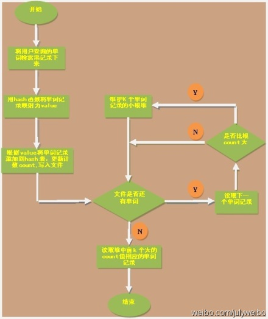
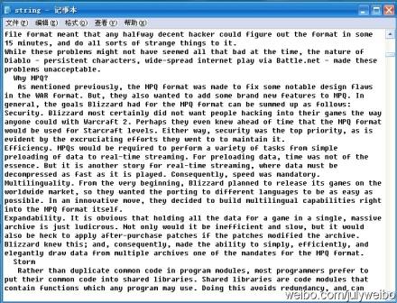
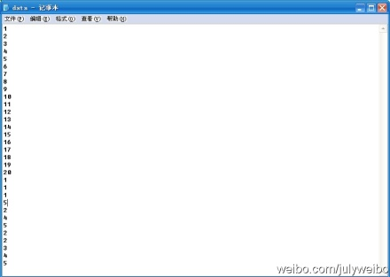
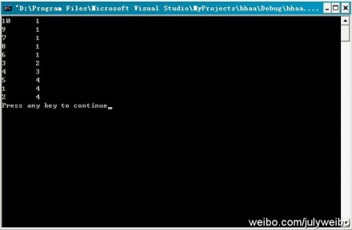
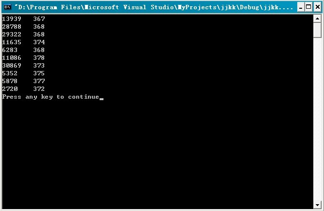

# 第三章续：Top K算法问题的实现

&emsp;&emsp;作者：July，zhouzhenren，yansha。  
&emsp;&emsp;致谢：微软100题实现组，狂想曲创作组。  
&emsp;&emsp;时间：2011年05月08日  
&emsp;&emsp;微博：<http://weibo.com/julyweibo> 。  
&emsp;&emsp;出处：<http://blog.csdn.net/v_JULY_v> 。  
&emsp;&emsp;wiki：<http://tctop.wikispaces.com>。  
 

##前奏
&emsp;&emsp;在上一篇文章，[程序员面试题狂想曲：第三章、寻找最小的k个数](http://blog.csdn.net/v_JULY_v/article/details/6370650)中，后来为了论证类似快速排序中partition的方法在最坏情况下，能在O（N）的时间复杂度内找到最小的k个数，而前前后后updated了10余次。所谓功夫不负苦心人，终于得到了一个想要的结果。

&emsp;&emsp;简单总结如下（详情，请参考原文第三章）：  
1. RANDOMIZED-SELECT，以序列中随机选取一个元素作为主元，可达到线性期望时间O（N）的复杂度。  
2. SELECT，快速选择算法，以序列中“五分化中项的中项”，或“中位数的中位数”作为主元（枢纽元），则不容置疑的可保证在最坏情况下亦为O（N）的复杂度。  

&emsp;&emsp;本章，咱们来阐述寻找最小的k个数的反面，即寻找最大的k个数，但此刻可能就有读者质疑了，寻找最大的k个数和寻找最小的k个数，原理不是一样的么?

&emsp;&emsp;是的，的确是一样，但这个寻找最大的k个数的问题的实用范围更广，因为它牵扯到了一个Top K算法问题，以及有关搜索引擎，海量数据处理等广泛的问题，所以本文特意对这个Top K算法问题，进行阐述以及实现（侧重实现，因为那样看起来，会更令人激动人心），算是第三章的续。ok，有任何问题，欢迎随时不吝指正。谢谢。

##说明

&emsp;&emsp;关于寻找最小K个数能做到最坏情况下为O（N）的算法及证明，请参考原第三章，[寻找最小的k个数](http://blog.csdn.net/v_JULY_v/article/details/6370650)，本文的代码不保证O（N）的平均时间复杂度，只是根据第三章有办法可以做到而已（如上面总结的，2、SELECT，快速选择算法，以序列中“五分化中项的中项”，或“中位数的中位数”作为主元或枢纽元的方法，原第三章已经严格论证并得到结果）。  

 

##第一节、寻找最小的第k个数

&emsp;&emsp;在进入寻找最大的k个数的主题之前，先补充下关于寻找最k小的数的三种简单实现。由于堆的完整实现，第三章：第五节，堆结构实现，处理海量数据中已经给出，下面主要给出类似快速排序中partition过程的代码实现：  

**寻找最小的k个数，实现一**（下段代码经本文评论下多位读者指出有问题：当a [ i ]=a [ j ]=pivot时，则会产生一个无限循环，在Mark Allen Weiss的数据结构与算法分析C++描述中文版的P209-P210有描述，读者可参看之。特此说明，因本文代码存在问题的地方还有几处，故请待后续统一修正.2012.08.21）：
```c
    //copyright@ mark allen weiss && July && yansha    
    //July，yansha、updated，2011.05.08.    
        
    //本程序，后经飞羽找出错误，已经修正。    
    //随机选取枢纽元，寻找最小的第k个数    
    #include <iostream>    
    #include <stdlib.h>    
    using namespace std;    
        
    int my_rand(int low, int high)    
    {    
        int size = high - low + 1;    
        return  low + rand() % size;     
    }    
        
    //q_select places the kth smallest element in a[k]    
    int q_select(int a[], int k, int left, int right)  
    {  
        if(k > right || k < left)  
        {  
    //         cout<<"---------"<<endl;   //为了处理当k大于数组中元素个数的异常情况  
            return false;  
        }  
      
        //真正的三数中值作为枢纽元方法，关键代码就是下述六行  
        int midIndex = (left + right) / 2;  
        if(a[left] < a[midIndex])  
            swap(a[left], a[midIndex]);  
        if(a[right] < a[midIndex])  
            swap(a[right], a[midIndex]);  
        if(a[right] < a[left])  
            swap(a[right], a[left]);  
        swap(a[left], a[right]);  
      
        int pivot = a[right];   //之前是int pivot = right，特此，修正。  
      
      
        // 申请两个移动指针并初始化  
        int i = left;  
        int j = right-1;  
      
        // 根据枢纽元素的值对数组进行一次划分  
        for (;;)  
        {  
            while(a[i] < pivot)  
                i++;  
            while(a[j] > pivot)  
                j--;  
            //a[i] >= pivot, a[j] <= pivot  
            if (i < j)  
                swap(a[i], a[j]);   //a[i] <= a[j]  
            else  
                break;  
        }  
        swap(a[i], a[right]);  
      
        /* 对三种情况进行处理 
        1、如果i=k，即返回的主元即为我们要找的第k小的元素，那么直接返回主元a[i]即可; 
        2、如果i>k，那么接下来要到低区间A[0....m-1]中寻找，丢掉高区间; 
        3、如果i<k，那么接下来要到高区间A[m+1...n-1]中寻找，丢掉低区间。 
        */  
        if (i == k)  
            return true;  
        else if (i > k)  
            return q_select(a, k, left, i-1);  
        else return q_select(a, k, i+1, right);  
    }  
        
    int main()    
    {    
        int i;    
        int a[] = {7, 8, 9, 54, 6, 4, 11, 1, 2, 33};    
        q_select(a, 4, 0, sizeof(a) / sizeof(int) - 1);    
        return 0;    
    }    
```

**寻找最小的第k个数，实现二：**

```c
    //copyright@ July  
    //yansha、updated，2011.05.08。  
    // 数组中寻找第k小元素，实现二  
    #include <iostream>  
    using namespace std;  
      
    const int numOfArray = 10;  
      
    // 这里并非真正随机  
    int my_rand(int low, int high)  
    {  
        int size = high - low + 1;  
        return low + rand() % size;   
    }  
      
    // 以最末元素作为主元对数组进行一次划分  
    int partition(int array[], int left, int right)      
    {                              
        int pos = right;  
        for(int index = right - 1; index >= left; index--)  
        {  
            if(array[index] > array[right])  
                swap(array[--pos], array[index]);  
        }  
        swap(array[pos], array[right]);  
        return pos;  
    }  
      
    // 随机快排的partition过程   
    int random_partition(int array[], int left, int right)          
    {  
        // 随机从范围left到right中取一个值作为主元  
        int index = my_rand(left, right);                          
        swap(array[right], array[index]);      
          
        // 对数组进行划分，并返回主元在数组中的位置  
        return partition(array, left, right);                   
    }  
      
    // 以线性时间返回数组array[left...right]中第k小的元素  
    int random_select(int array[], int left, int right, int k)      
    {  
        // 处理异常情况  
        if (k < 1 || k > (right - left + 1))  
            return -1;  
          
        // 主元在数组中的位置  
        int pos = random_partition(array, left, right);       
          
        /* 对三种情况进行处理：(m = i - left + 1) 
        1、如果m=k，即返回的主元即为我们要找的第k小的元素，那么直接返回主元array[i]即可; 
        2、如果m>k，那么接下来要到低区间array[left....pos-1]中寻找，丢掉高区间; 
        3、如果m<k，那么接下来要到高区间array[pos+1...right]中寻找，丢掉低区间。 
        */  
        int m = pos - left + 1;  
        if(m == k)  
            return array[pos];                               
        else if (m > k)         
            return random_select(array, left, pos - 1, k);  
        else   
            return random_select(array, pos + 1, right, k - m);  
    }  
      
    int main()  
    {      
        int array[numOfArray] = {7, 8, 9, 54, 6, 4, 2, 1, 12, 33};  
        cout << random_select(array, 0, numOfArray - 1, 4) << endl;  
        return 0;  
    }  
```

**寻找最小的第k个数，实现三：**

```c
    //求取无序数组中第K个数，本程序枢纽元的选取有问题，不作推荐。    
    //copyright@ 飞羽   
    //July、yansha，updated，2011.05.18。     
    #include <iostream>    
    #include <time.h>   
    using namespace std;     
      
    int kth_elem(int a[], int low, int high, int k)     
    {     
        int pivot = a[low];    
        //这个程序之所以做不到O（N）的最最重要的原因，就在于这个枢纽元的选取。           
        //而这个程序直接选取数组中第一个元素作为枢纽元，是做不到平均时间复杂度为 O（N）的。  
          
        //要 做到，就必须 把上面选取枢纽元的 代码改掉，要么是随机选择数组中某一元素作为枢纽元，能达到线性期望的时间  
        //要么是选取数组中中位数的中位数作为枢纽元，保证最坏情况下，依然为线性O（N）的平均时间复杂度。  
        int low_temp = low;     
        int high_temp = high;     
        while(low < high)     
        {     
            while(low < high && a[high] >= pivot)       
                --high;     
            a[low] = a[high];     
            while(low < high && a[low] < pivot)     
                ++low;     
            a[high] = a[low];     
        }     
        a[low] = pivot;     
          
        //以下就是主要思想中所述的内容     
        if(low == k - 1)      
            return a[low];     
        else if(low > k - 1)      
            return kth_elem(a, low_temp, low - 1, k);     
        else      
            return kth_elem(a, low + 1, high_temp, k);     
    }     
      
    int main()   //以后尽量不再用随机产生的数组进行测试，没多大必要。  
    {  
        for (int num = 5000; num < 50000001; num *= 10)  
        {  
            int *array = new int[num];  
              
            int j = num / 10;  
            int acc = 0;  
            for (int k = 1; k <= num; k += j)  
            {  
                // 随机生成数据  
                srand(unsigned(time(0)));  
                for(int i = 0; i < num; i++)     
                    array[i] = rand() * RAND_MAX + rand();      
                //”如果数组本身就是利用随机化产生的话，那么选择其中任何一个元素作为枢轴都可以看作等价于随机选择枢轴，  
                //（虽然这不叫随机选择枢纽）”，这句话，是完全不成立的，是错误的。  
                  
                //“因为你总是选择 随机数组中第一个元素 作为枢纽元，不是 随机选择枢纽元”  
                //相当于把上面这句话中前面的 “随机” 两字去掉，就是：  
                //因为 你总是选择数组中第一个元素作为枢纽元，不是 随机选择枢纽元。  
                //所以，这个程序，始终做不到平均时间复杂度为O（N）。  
                  
                //随机数组和给定一个非有序而随机手动输入的数组，是一个道理。稍后，还将就程序的运行结果继续解释这个问题。  
                //July、updated，2011.05.18。  
                  
                // 计算一次查找所需的时钟周期数  
                clock_t start = clock();  
                int data = kth_elem(array, 0, num - 1, k);  
                clock_t end = clock();  
                acc += (end - start);  
            }  
            cout << "The average time of searching a date in the array size of " << num << " is " << acc / 10 << endl;  
        }  
        return 0;     
    }    
```

&emsp;&emsp;测试：  
The average time of searching a date in the array size of 5000 is 0  
The average time of searching a date in the array size of 50000 is 1  
The average time of searching a date in the array size of 500000 is 12  
The average time of searching a date in the array size of 5000000 is 114  
The average time of searching a date in the array size of 50000000 is 1159  
Press any key to continue    


通过测试这个程序，我们竟发现这个程序的运行时间是线性的?  
或许，你还没有意识到这个问题，ok，听我慢慢道来。  
我们之前说，要保证这个算法是线性的，就一定要在枢纽元的选取上下足功夫：  

1. 要么是随机选取枢纽元作为划分元素  
2. 要么是取中位数的中位数作为枢纽元划分元素  
     
现在，这程序直接选取了数组中第一个元素作为枢纽元  
竟然，也能做到线性O（N）的复杂度，这不是自相矛盾么?  
你觉得这个程序的运行时间是线性O（N），是巧合还是确定会是如此?  

哈哈，且看  

1. @well：根据上面的运行结果不能判断线性，如果人家是O(n^1.1) 也有可能啊，而且部分数据始终是拟合，还是要数学证明才可靠。  
2. @July：同时，随机数组中选取一个元素作为枢纽元！=> 随机数组中随机选取一个元素作为枢纽元（如果是随机选取随机数组中的一个元素作为主元，那就不同了，跟随机选取数组中一个元素作为枢纽元一样了）。  
3. @飞羽：正是因为数组本身是随机的，所以选择第一个元素和随机选择其它的数是等价的（由等概率产生保证），这第3点，我与飞羽有分歧，至于谁对谁错，待时间让我考证。  


**关于上面第3点我和飞羽的分歧，在我们进一步讨论之后，一致认定（不过，相信，你看到了上面程序更新的注释之后，你应该有几分领会了）：**  

1. 我们说输入一个数组的元素，不按其顺序输入：如，1,2,3,4,5,6,7，而是这样输入：5,7,6,4,3，1,2，这就叫随机输入，而这种情况就相当于上述程序主函数中所产生的随机数组。然而选取随机输入的数组或随机数组中第一个元素作为主元，我们不能称之为说是随机选取枢纽元。  
2. 因为，随机数产生器产生的数据是随机的，没错，但你要知道，你总是选取随机数组的第一个元素作为枢纽元，这不叫随机选取枢纽元。  
3. 所以，上述程序的主函数中随机产生的数组对这个程序的算法而言，没有任何意义，就是帮忙产生了一个随机数组，帮助我们完成了测试，且方便我们测试大数据量而已，就这么简单。  
4. 且一般来说，我们看一个程序的 时间复杂度，是不考虑 其输入情况的，即不考虑主函数，正如这个 kth number 的程序所见，你每次都是随机选取数组中第一个元素作为枢纽元，而并不是随机选择枢纽元，所以，做不到平均时间复杂度为O（N）。   

所以：想要保证此快速选择算法为O（N）的复杂度，只有两种途径，那就是保证划分的枢纽元元素的选取是：  

1. 随机的（注，此枢纽元随机不等同于数组随机）  
2. 五分化中项的中项，或中位数的中位数。  

所以，虽然咱们对于一切心知肚明，但**上面程序的运行结果说明不了任何问题**，这也从侧面再次佐证了咱们第三章中观点的正确无误性。 

updated：

&emsp;&emsp;非常感谢飞羽等人的工作，将上述三个版本综合到了一起（待进一步测试）：  

```c
    ///下面的代码对July博客中的三个版本代码进行重新改写。欢迎指出错误。    
    ///先把它们贴在这里，还要进行随机化数据测试。待发...    
        
    //modified by 飞羽 at 2011.5.11    
    /////Top_K_test    
        
    //修改了下命名规范，July、updated，2011.05.12。    
    #include <iostream>    
    #include <stdlib.h>    
    using namespace std;    
        
    inline int my_rand(int low, int high)    
    {    
        int size = high - low + 1;    
        return  low + rand() % size;    
    }    
        
    int partition(int array[], int left, int right)    
    {    
        int pivot = array[right];    
        int pos = left-1;    
        for(int index = left; index < right; index++)    
        {    
            if(array[index] <= pivot)    
                swap(array[++pos], array[index]);    
        }    
        swap(array[++pos], array[right]);    
        return pos;//返回pivot所在位置    
    }    
        
    bool median_select(int array[], int left, int right, int k)    
    {    
        //第k小元素，实际上应该在数组中下标为k-1    
        if (k-1 > right || k-1 < left)       
            return false;    
        
        //真正的三数中值作为枢纽元方法，关键代码就是下述六行    
        int midIndex=(left+right)/2;    
        if(array[left]<array[midIndex])    
            swap(array[left],array[midIndex]);    
        if(array[right]<array[midIndex])    
            swap(array[right],array[midIndex]);    
        if(array[right]<array[left])    
            swap(array[right],array[left]);    
        swap(array[left], array[right]);    
            
        int pos = partition(array, left, right);    
            
        if (pos == k-1)    
            return true;    
        else if (pos > k-1)    
            return median_select(array, left, pos-1, k);    
        else return median_select(array, pos+1, right, k);    
    }    
        
    bool rand_select(int array[], int left, int right, int k)    
    {    
        //第k小元素，实际上应该在数组中下标为k-1    
        if (k-1 > right || k-1 < left)       
            return false;    
        
        //随机从数组中选取枢纽元元素    
        int Index = my_rand(left, right);    
        swap(array[Index], array[right]);    
            
        int pos = partition(array, left, right);    
            
        if (pos == k-1)    
            return true;    
        else if (pos > k-1)    
            return rand_select(array, left, pos-1, k);    
        else return rand_select(array, pos+1, right, k);    
    }    
        
    bool kth_select(int array[], int left, int right, int k)    
    {    
        //直接取最原始的划分操作    
        if (k-1 > right || k-1 < left)       
            return false;    
        
        int pos = partition(array, left, right);    
        if(pos == k-1)    
            return true;    
        else if(pos > k-1)    
            return kth_select(array, left, pos-1, k);    
        else return kth_select(array, pos+1, right, k);    
    }    
        
    int main()    
    {    
        int array1[] = {7, 8, 9, 54, 6, 4, 11, 1, 2, 33};     
        int array2[] = {7, 8, 9, 54, 6, 4, 11, 1, 2, 33};     
        int array3[] = {7, 8, 9, 54, 6, 4, 11, 1, 2, 33};     
            
        int numOfArray = sizeof(array1) / sizeof(int);    
        for(int i=0; i<numOfArray; i++)    
            printf("%d\t",array1[i]);    
            
        int K = 9;    
        bool flag1 = median_select(array1, 0, numOfArray-1, K);    
        bool flag2 = rand_select(array2, 0, numOfArray-1, K);    
        bool flag3 = kth_select(array3, 0, numOfArray-1, K);    
        if(!flag1)     
            return 1;    
        for(i=0; i<K; i++)    
            printf("%d\t",array1[i]);    
        printf("\n");    
            
        if(!flag2)     
            return 1;    
        for(i=0; i<K; i++)    
            printf("%d\t",array2[i]);    
        printf("\n");    
            
        if(!flag3)     
            return 1;    
        for(i=0; i<K; i++)    
            printf("%d\t",array3[i]);    
        printf("\n");    
            
        return 0;    
    }    
```

&emsp;&emsp;说明：@飞羽：因为预先设定了K，经过分割算法后，数组肯定被划分为array[0...k-1]和array[k...length-1]，注意到经过Select_K_Version操作后，数组是被不断地分割的，使得比array[k-1]的元素小的全在左边，题目要求的是最小的K个元素，当然也就是array[0...k-1]，所以输出的结果就是前k个最小的数：

<table>
<tr>
<td>7</td><td>8</td><td>9</td><td>54</td><td>6</td><td>4</td><td>11</td><td>1</td><td>2</td><td>33</td>  
</tr>
<tr>
<td>4</td><td>1</td><td>2</td><td>6</td><td>7</td><td>8</td><td>9</td><td>11</td><td>33</td>
</tr>
<tr>
<td>7</td><td>6</td><td>4</td><td>1</td><td>2</td><td>8</td><td>9</td><td>11</td><td>33</td>
</tr>
<tr>
<td>7</td><td>8</td><td>9</td><td>6</td><td>4</td><td>11</td><td>1</td><td>2</td><td>33</td>
</tr>
</table>
Press any key to continue

（更多，请参见：此狂想曲系列tctop修订wiki页面：<http://tctop.wikispaces.com/>）


##第二节、寻找最大的k个数
把之前第三章的问题，改几个字，即成为寻找最大的k个数的问题了，如下所述：  
**查找最大的k个元素**   
题目描述：输入n个整数，输出其中最大的k个。  
例如输入1，2，3，4，5，6，7和8这8个数字，则最大的4个数字为8，7，6和5。  

&emsp;&emsp;分析：由于寻找最大的k个数的问题与之前的寻找最小的k个数的问题，本质是一样的，所以，这里就简单阐述下思路，ok，考验你举一反三能力的时间到了：  

1. 排序，快速排序。我们知道，快速排序平均所费时间为n\*logn，从小到大排序这n个数，然后再遍历序列中后k个元素输出，即可，总的时间复杂度为O（n\*logn+k）=O（n\*logn）。  

2. 排序，选择排序。用选择或交换排序，即遍历n个数，先把最先遍历到得k个数存入大小为k的数组之中，对这k个数，利用选择或交换排序，找到k个数中的最小数kmin（kmin设为k个元素的数组中最小元素），用时O（k）（你应该知道，插入或选择排序查找操作需要O（k）的时间），后再继续遍历后n-k个数，x与kmin比较：如果x>kmin，则x代替kmin，并再次重新找出k个元素的数组中最大元素kmin‘（多谢jiyeyuran 提醒修正）；如果x<kmin，则不更新数组。这样，每次更新或不更新数组的所用的时间为O（k）或O（0），整趟下来，总的时间复杂度平均下来为：n\*O（k）=O（n\*k）。  

3. 维护k个元素的最小堆，原理与上述第2个方案一致，即用容量为k的最小堆存储最先遍历到的k个数，并假设它们即是最大的k个数，建堆费时O（k），并调整堆（费时O（logk））后，有k1>k2>...kmin（kmin设为小顶堆中最大元素）。继续遍历数列，每次遍历一个元素x，与堆顶元素比较，若x>kmin，则更新堆（用时logk），否则不更新堆。这样下来，总费时O（k\*logk+（n-k）\*logk）=O（n\*logk）。此方法得益于在堆中，查找等各项操作时间复杂度均为logk（不然，就如上述思路2所述：直接用数组也可以找出最大的k个元素，用时O（n\*k））。  

4. 按编程之美第141页上解法二的所述，类似快速排序的划分方法，N个数存储在数组S中，再从数组中随机选取一个数X，把数组划分为Sa和Sb俩部分，Sa>=X>=Sb，如果要查找的k个元素小于Sa的元素个数，则返回Sa中较大的k个元素，否则返回Sa中所有的元素+Sb中最大的k-|Sa|个元素。不断递归下去，把问题分解成更小的问题，平均时间复杂度为O（N）（编程之美所述的n\*logk的复杂度有误，应为O（N），特此订正。其严格证明，请参考第三章：[程序员面试题狂想曲：第三章、寻找最小的k个数、updated 10次](http://blog.csdn.net/v_JULY_v/article/details/6370650)）。  

.........


&emsp;&emsp;其它的方法，在此不再重复了，同时，寻找最小的k个数借助堆的实现，代码在上一篇文章第三章已有给出，更多，可参考第三章，只要把最大堆改成最小堆，即可。  


##第三节、Top K 算法问题
###3.1、搜索引擎热门查询统计

**题目描述**：
&emsp;&emsp;搜索引擎会通过日志文件把用户每次检索使用的所有检索串都记录下来，每个查询串的长度为1-255字节。  
&emsp;&emsp;假设目前有一千万个记录（这些查询串的重复度比较高，虽然总数是1千万，但如果除去重复后，不超过3百万个。一个查询串的重复度越高，说明查询它的用户越多，也就是越热门。），请你统计最热门的10个查询串，要求使用的内存不能超过1G。  

&emsp;&emsp;分析：这个问题在之前的这篇文章[十一、从头到尾彻底解析Hash表算法](http://blog.csdn.net/v_JULY_v/article/details/6256463)里，已经有所解答。方法是:    

&emsp;&emsp;**第一步**、先对这批海量数据预处理，在O（N）的时间内用Hash表完成统计（之前写成了排序，特此订正。July、2011.04.27）；  
&emsp;&emsp;**第二步**、借助堆这个数据结构，找出Top K，时间复杂度为N‘logK。  
&emsp;&emsp;即，借助堆结构，我们可以在log量级的时间内查找和调整/移动。因此，维护一个K(该题目中是10)大小的小根堆（K1>K2>....Kmin，Kmin设为堆顶元素），然后遍历300万的Query，分别和根元素Kmin进行对比比较（如上第2节思路3所述，若X>Kmin，则更新并调整堆，否则，不更新），我们最终的时间复杂度是：O（N） + N'\*O（logK），（N为1000万，N’为300万）。ok，更多，详情，请参考原文。  

&emsp;&emsp;或者：采用trie树，关键字域存该查询串出现的次数，没有出现为0。最后用10个元素的最小推来对出现频率进行排序。  

&emsp;&emsp;ok，本章里，咱们来实现这个问题，为了降低实现上的难度，假设这些记录全部是一些英文单词，即用户在搜索框里敲入一个英文单词，然后查询搜索结果，最后，要你统计输入单词中频率最大的前K个单词。ok，复杂问题简单化了之后，编写代码实现也相对轻松多了，画的简单示意图（绘制者，yansha），如下：  



**完整源码**：

```c
    //copyright@yansha &&July  
    //July、updated，2011.05.08  
      
    //题目描述：  
    //搜索引擎会通过日志文件把用户每次检索使用的所有检索串都记录下来，每个查询串的  
    //长度为1-255字节。假设目前有一千万个记录（这些查询串的重复度比较高，虽然总数是1千万，但如果  
    //除去重复后，不超过3百万个。一个查询串的重复度越高，说明查询它的用户越多，也就是越热门），  
    //请你统计最热门的10个查询串，要求使用的内存不能超过1G。  
      
    #include <iostream>  
    #include <string>  
    #include <assert.h>  
    using namespace std;  
      
    #define HASHLEN 2807303  
    #define WORDLEN 30  
      
    // 结点指针  
    typedef struct node_no_space *ptr_no_space;  
    typedef struct node_has_space *ptr_has_space;  
    ptr_no_space head[HASHLEN];  
      
    struct node_no_space   
    {  
        char *word;  
        int count;  
        ptr_no_space next;  
    };  
      
    struct node_has_space  
    {  
        char word[WORDLEN];  
        int count;  
        ptr_has_space next;  
    };  
      
    // 最简单hash函数  
    int hash_function(char const *p)  
    {  
        int value = 0;  
        while (*p != '/0')  
        {  
            value = value * 31 + *p++;  
            if (value > HASHLEN)  
                value = value % HASHLEN;  
        }  
        return value;  
    }  
      
    // 添加单词到hash表  
    void append_word(char const *str)  
    {  
        int index = hash_function(str);  
        ptr_no_space p = head[index];  
        while (p != NULL)  
        {  
            if (strcmp(str, p->word) == 0)  
            {  
                (p->count)++;  
                return;  
            }  
            p = p->next;  
        }  
          
        // 新建一个结点  
        ptr_no_space q = new node_no_space;  
        q->count = 1;  
        q->word = new char [strlen(str)+1];  
        strcpy(q->word, str);  
        q->next = head[index];  
        head[index] = q;  
    }  
      
      
    // 将单词处理结果写入文件  
    void write_to_file()  
    {  
        FILE *fp = fopen("result.txt", "w");  
        assert(fp);  
          
        int i = 0;  
        while (i < HASHLEN)  
        {  
            for (ptr_no_space p = head[i]; p != NULL; p = p->next)  
                fprintf(fp, "%s  %d\n", p->word, p->count);  
            i++;  
        }  
        fclose(fp);  
    }  
      
    // 从上往下筛选，保持小根堆  
    void sift_down(node_has_space heap[], int i, int len)  
    {  
        int min_index = -1;  
        int left = 2 * i;  
        int right = 2 * i + 1;  
          
        if (left <= len && heap[left].count < heap[i].count)  
            min_index = left;  
        else  
            min_index = i;  
          
        if (right <= len && heap[right].count < heap[min_index].count)  
            min_index = right;  
          
        if (min_index != i)  
        {  
            // 交换结点元素  
            swap(heap[i].count, heap[min_index].count);  
              
            char buffer[WORDLEN];  
            strcpy(buffer, heap[i].word);  
            strcpy(heap[i].word, heap[min_index].word);  
            strcpy(heap[min_index].word, buffer);  
              
            sift_down(heap, min_index, len);  
        }  
    }  
      
    // 建立小根堆  
    void build_min_heap(node_has_space heap[], int len)  
    {  
        if (heap == NULL)  
            return;  
          
        int index = len / 2;  
        for (int i = index; i >= 1; i--)  
            sift_down(heap, i, len);  
    }  
      
    // 去除字符串前后符号  
    void handle_symbol(char *str, int n)  
    {  
        while (str[n] < '0' || (str[n] > '9' && str[n] < 'A') || (str[n] > 'Z' && str[n] < 'a') || str[n] > 'z')  
        {  
            str[n] = '/0';  
            n--;  
        }  
          
        while (str[0] < '0' || (str[0] > '9' && str[0] < 'A') || (str[0] > 'Z' && str[0] < 'a') || str[0] > 'z')  
        {  
            int i = 0;  
            while (i < n)  
            {  
                str[i] = str[i+1];  
                i++;  
            }  
            str[i] = '/0';  
            n--;  
        }  
    }  
      
    int main()  
    {  
        char str[WORDLEN];  
        for (int i = 0; i < HASHLEN; i++)  
            head[i] = NULL;  
          
        // 将字符串用hash函数转换成一个整数并统计出现频率  
        FILE *fp_passage = fopen("string.txt", "r");  
        assert(fp_passage);  
        while (fscanf(fp_passage, "%s", str) != EOF)  
        {  
            int n = strlen(str) - 1;  
            if (n > 0)  
                handle_symbol(str, n);  
            append_word(str);  
        }  
        fclose(fp_passage);  
          
        // 将统计结果输入文件  
        write_to_file();  
          
        int n = 10;  
        ptr_has_space heap = new node_has_space [n+1];  
          
        int c;  
          
        FILE *fp_word = fopen("result.txt", "r");  
        assert(fp_word);  
        for (int j = 1; j <= n; j++)  
        {  
            fscanf(fp_word, "%s %d", &str, &c);  
            heap[j].count = c;  
            strcpy(heap[j].word, str);  
        }  
          
        // 建立小根堆  
        build_min_heap(heap, n);  
          
        // 查找出现频率最大的10个单词  
        while (fscanf(fp_word, "%s %d", &str, &c) != EOF)  
        {  
            if (c > heap[1].count)  
            {  
                heap[1].count = c;  
                strcpy(heap[1].word, str);  
                sift_down(heap, 1, n);  
            }  
        }  
        fclose(fp_word);  
          
        // 输出出现频率最大的单词  
        for (int k = 1; k <= n; k++)  
            cout << heap[k].count << " " << heap[k].word << endl;  
          
        return 0;  
    }  
```

**程序测试**：咱们接下来，来对下面的通过用户输入单词后，搜索引擎记录下来，“大量”单词记录进行统计（同时，令K=10，即要你找出10个最热门查询的单词）：  



**运行结果**：根据程序的运行结果，可以看到，搜索引擎记录下来的查询次数最多的10个单词为（注，并未要求这10个数要有序输出）：in（312次），it（384次），a（432），that（456），MPQ（408），of（504），and（624），is（456），the（1008），to（936）。  


**读者反馈from 杨忠胜**：3.1节的代码第38行 hash_function(char const \*p)有误吧，这样的话，不能修改p的值（但是函数需要修改指针的值），要想不修改\*p指向的内容，应该是const char \*p; 此外，您程序中的/t,  /n有误，C语言是\t,\n。  
&emsp;&emsp;感谢这位读者的来信，日后统一订正。谢谢。  

###3.2、统计出现次数最多的数据

**题目描述**：
给你上千万或上亿数据（有重复），统计其中出现次数最多的前N个数据。  

&emsp;&emsp;分析：上千万或上亿的数据，现在的机器的内存应该能存下（也许可以，也许不可以）。所以考虑采用hash_map/搜索二叉树/红黑树等来进行统计次数。然后就是取出前N个出现次数最多的数据了。当然，也可以堆实现。  

&emsp;&emsp;ok，此题与上题类似，最好的方法是用hash_map统计出现的次数，然后再借用堆找出出现次数最多的N个数据。不过，上一题统计搜索引擎最热门的查询已经采用过hash表统计单词出现的次数，特此，本题咱们改用红黑树取代之前的用hash表，来完成最初的统计，然后用堆更新，找出出现次数最多的前N个数据。  

&emsp;&emsp;同时，正好个人此前用c && c++ 语言实现过红黑树，那么，代码能借用就借用吧。  
**完整代码**：

```c
    //copyright@ zhouzhenren &&July  
    //July、updated，2011.05.08.  
      
    //题目描述：  
    //上千万或上亿数据（有重复），统计其中出现次数最多的前N个数据  
      
    //解决方案：  
    //1、采用红黑树（本程序中有关红黑树的实现代码来源于@July）来进行统计次数。  
    //2、然后遍历整棵树，同时采用最小堆更新前N个出现次数最多的数据。  
      
    //声明：版权所有，引用必须注明出处。  
    #define PARENT(i) (i)/2  
    #define LEFT(i)   2*(i)  
    #define RIGHT(i)  2*(i)+1  
      
    #include <stdio.h>  
    #include <stdlib.h>  
    #include <string.h>  
      
    typedef enum rb_color{ RED, BLACK }RB_COLOR;  
    typedef struct rb_node  
    {  
        int key;  
        int data;  
        RB_COLOR color;  
        struct rb_node* left;  
        struct rb_node* right;  
        struct rb_node* parent;  
    }RB_NODE;  
      
    RB_NODE* RB_CreatNode(int key, int data)  
    {  
        RB_NODE* node = (RB_NODE*)malloc(sizeof(RB_NODE));  
        if (NULL == node)  
        {  
            printf("malloc error!");  
            exit(-1);  
        }  
          
        node->key = key;  
        node->data = data;  
        node->color = RED;  
        node->left = NULL;  
        node->right = NULL;  
        node->parent = NULL;  
          
        return node;  
    }  
      
    /**  
    * 左旋   
    * 
    *  node           right  
    *  / /    ==>     / /  
    * a  right     node  y  
    *     / /       / /      
    *     b  y     a   b     
    */    
    RB_NODE* RB_RotateLeft(RB_NODE* node, RB_NODE* root)  
    {    
        RB_NODE* right = node->right;    // 指定指针指向 right<--node->right    
          
        if ((node->right = right->left))      
            right->left->parent = node;  // 好比上面的注释图，node成为b的父母  
          
        right->left = node;   // node成为right的左孩子   
          
        if ((right->parent = node->parent))    
        {    
            if (node == node->parent->right)    
                node->parent->right = right;  
            else    
                node->parent->left = right;  
        }    
        else    
            root = right;    
          
        node->parent = right;  //right成为node的父母    
          
        return root;    
    }    
      
    /** 
    * 右旋   
    * 
    *      node            left  
    *       / /             / /  
    *     left y   ==>     a  node  
    *     / /                  / /  
    *    a   b                b   y   
    */    
    RB_NODE* RB_RotateRight(RB_NODE* node, RB_NODE* root)    
    {    
        RB_NODE* left = node->left;    
          
        if ((node->left = left->right))    
            left->right->parent = node;    
          
        left->right = node;    
          
        if ((left->parent = node->parent))    
        {    
            if (node == node->parent->right)      
                node->parent->right = left;    
            else    
                node->parent->left = left;    
        }    
        else    
            root = left;    
          
        node->parent = left;    
          
        return root;    
    }    
      
    /**  
    * 红黑树的3种插入情况   
    * 用z表示当前结点, p[z]表示父母、p[p[z]]表示祖父, y表示叔叔. 
    */  
    RB_NODE* RB_Insert_Rebalance(RB_NODE* node, RB_NODE* root)    
    {    
        RB_NODE *parent, *gparent, *uncle, *tmp;  //父母p[z]、祖父p[p[z]]、叔叔y、临时结点*tmp    
          
        while ((parent = node->parent) && parent->color == RED)    
        { // parent 为node的父母，且当父母的颜色为红时    
            gparent = parent->parent;   // gparent为祖父    
              
            if (parent == gparent->left)  // 当祖父的左孩子即为父母时,其实上述几行语句，无非就是理顺孩子、父母、祖父的关系。  
            {  
                uncle = gparent->right; // 定义叔叔的概念，叔叔y就是父母的右孩子。    
                if (uncle && uncle->color == RED) // 情况1：z的叔叔y是红色的    
                {    
                    uncle->color = BLACK;   // 将叔叔结点y着为黑色    
                    parent->color = BLACK;  // z的父母p[z]也着为黑色。解决z，p[z]都是红色的问题。    
                    gparent->color = RED;      
                    node = gparent;     // 将祖父当做新增结点z，指针z上移俩层，且着为红色。    
                    // 上述情况1中，只考虑了z作为父母的右孩子的情况。    
                }    
                else                     // 情况2：z的叔叔y是黑色的，    
                {       
                    if (parent->right == node)  // 且z为右孩子    
                    {    
                        root = RB_RotateLeft(parent, root); // 左旋[结点z，与父母结点]    
                        tmp = parent;    
                        parent = node;    
                        node = tmp;     // parent与node 互换角色    
                    }    
                    // 情况3：z的叔叔y是黑色的，此时z成为了左孩子。    
                    // 注意，1：情况3是由上述情况2变化而来的。    
                    // ......2：z的叔叔总是黑色的，否则就是情况1了。    
                    parent->color = BLACK;   // z的父母p[z]着为黑色    
                    gparent->color = RED;    // 原祖父结点着为红色    
                    root = RB_RotateRight(gparent, root); // 右旋[结点z，与祖父结点]    
                }    
            }     
              
            else     
            {         
                // 这部分是特别为情况1中，z作为左孩子情况，而写的。    
                uncle = gparent->left;  // 祖父的左孩子作为叔叔结点。[原理还是与上部分一样的]    
                if (uncle && uncle->color == RED)  // 情况1：z的叔叔y是红色的    
                {    
                    uncle->color = BLACK;    
                    parent->color = BLACK;    
                    gparent->color = RED;    
                    node = gparent;           // 同上  
                }    
                else                               // 情况2：z的叔叔y是黑色的，    
                {    
                    if (parent->left == node)  // 且z为左孩子    
                    {    
                        root = RB_RotateRight(parent, root);  // 以结点parent、root右旋    
                        tmp = parent;    
                        parent = node;    
                        node = tmp;       // parent与node 互换角色    
                    }     
                    // 经过情况2的变化，成为了情况3.    
                    parent->color = BLACK;    
                    gparent->color = RED;    
                    root = RB_RotateLeft(gparent, root);   // 以结点gparent和root左旋    
                }    
            }    
        }    
          
        root->color = BLACK; // 根结点，不论怎样，都得置为黑色。    
        return root;      // 返回根结点。    
    }  
      
    /**  
    * 红黑树查找结点   
    * rb_search_auxiliary：查找   
    * rb_node_t* rb_search：返回找到的结点   
    */  
    RB_NODE* RB_SearchAuxiliary(int key, RB_NODE* root, RB_NODE** save)    
    {    
        RB_NODE* node = root;  
        RB_NODE* parent = NULL;    
        int ret;    
          
        while (node)    
        {    
            parent = node;    
            ret = node->key - key;    
            if (0 < ret)    
                node = node->left;    
            else if (0 > ret)    
                node = node->right;    
            else    
                return node;    
        }    
          
        if (save)    
            *save = parent;    
          
        return NULL;    
    }    
      
    /**  
    * 返回上述rb_search_auxiliary查找结果   
    */  
    RB_NODE* RB_Search(int key, RB_NODE* root)    
    {    
        return RB_SearchAuxiliary(key, root, NULL);    
    }    
      
    /**  
    * 红黑树的插入   
    */  
    RB_NODE* RB_Insert(int key, int data, RB_NODE* root)    
    {    
        RB_NODE* parent = NULL;  
        RB_NODE* node = NULL;    
          
        parent = NULL;    
        if ((node = RB_SearchAuxiliary(key, root, &parent)))  // 调用RB_SearchAuxiliary找到插入结点的地方    
        {    
            node->data++; // 节点已经存在data值加1  
            return root;    
        }    
          
        node = RB_CreatNode(key, data);  // 分配结点    
        node->parent = parent;        
          
        if (parent)    
        {    
            if (parent->key > key)    
                parent->left = node;    
            else    
                parent->right = node;    
        }    
        else    
        {    
            root = node;    
        }    
          
        return RB_Insert_Rebalance(node, root);   // 插入结点后，调用RB_Insert_Rebalance修复红黑树的性质    
    }  
      
    typedef struct rb_heap  
    {  
        int key;  
        int data;  
    }RB_HEAP;  
    const int heapSize = 10;  
    RB_HEAP heap[heapSize+1];  
      
    /**  
    * MAX_HEAPIFY函数对堆进行更新，使以i为根的子树成最大堆 
    */  
    void MIN_HEAPIFY(RB_HEAP* A, const int& size, int i)  
    {  
        int l = LEFT(i);  
        int r = RIGHT(i);  
        int smallest = i;  
          
        if (l <= size && A[l].data < A[i].data)  
            smallest = l;  
        if (r <= size && A[r].data < A[smallest].data)  
            smallest = r;  
          
        if (smallest != i)  
        {  
            RB_HEAP tmp = A[i];  
            A[i] = A[smallest];  
            A[smallest] = tmp;  
            MIN_HEAPIFY(A, size, smallest);  
        }  
    }  
      
    /**  
    * BUILD_MINHEAP函数对数组A中的数据建立最小堆 
    */  
    void BUILD_MINHEAP(RB_HEAP* A, const int& size)  
    {  
        for (int i = size/2; i >= 1; --i)  
            MIN_HEAPIFY(A, size, i);  
    }  
      
      
    /* 
    3、维护k个元素的最小堆，原理与上述第2个方案一致， 
    即用容量为k的最小堆存储最先在红黑树中遍历到的k个数，并假设它们即是最大的k个数，建堆费时O（k）， 
    然后调整堆（费时O（logk））后，有k1>k2>...kmin（kmin设为小顶堆中最小元素）。 
    继续中序遍历红黑树，每次遍历一个元素x，与堆顶元素比较，若x>kmin，则更新堆（用时logk），否则不更新堆。 
    这样下来，总费时O（k*logk+（n-k）*logk）=O（n*logk）。 
    此方法得益于在堆中，查找等各项操作时间复杂度均为logk）。 
    */  
      
    //中序遍历RBTree  
    void InOrderTraverse(RB_NODE* node)    
    {  
        if (node == NULL)    
        {    
            return;    
        }    
        else    
        {    
            InOrderTraverse(node->left);    
            if (node->data > heap[1].data) // 当前节点data大于最小堆的最小元素时，更新堆数据  
            {  
                heap[1].data = node->data;  
                heap[1].key = node->key;  
                MIN_HEAPIFY(heap, heapSize, 1);  
            }  
            InOrderTraverse(node->right);    
        }  
    }   
      
    void RB_Destroy(RB_NODE* node)  
    {  
        if (NULL == node)  
        {  
            return;  
        }  
        else  
        {  
            RB_Destroy(node->left);  
            RB_Destroy(node->right);  
            free(node);  
            node = NULL;  
        }  
    }  
      
    int main()  
    {  
        RB_NODE* root = NULL;  
        RB_NODE* node = NULL;    
          
        // 初始化最小堆  
        for (int i = 1; i <= 10; ++i)  
        {  
            heap[i].key = i;  
            heap[i].data = -i;  
        }  
        BUILD_MINHEAP(heap, heapSize);  
          
        FILE* fp = fopen("data.txt", "r");  
        int num;  
        while (!feof(fp))  
        {  
            fscanf(fp, "%d", &num);  
            root = RB_Insert(num, 1, root);  
        }  
        fclose(fp);  
          
        InOrderTraverse(root);   //递归遍历红黑树  
        RB_Destroy(root);  
          
        for (i = 1; i <= 10; ++i)  
        {  
            printf("%d\t%d\n", heap[i].key, heap[i].data);  
        }     
        return 0;  
    }   
```

**程序测试**：咱们来对下面这个小文件进行测试：  

 

**运行结果**：如下图所示，  

 

**问题补遗**：  

&emsp;&emsp;ok，由于在遍历红黑树采用的是递归方式比较耗内存，下面给出一个非递归遍历的程序（下述代码若要运行，需贴到上述程序之后，因为其它的代码未变，只是在遍历红黑树的时候，采取非递归遍历而已，同时，主函数的编写也要稍微修改下）：  

```c
    //copyright@ zhouzhenren  
    //July、updated，2011.05.08.  
    #define STACK_SIZE 1000  
    typedef struct  
    {                                              // 栈的结点定义  
        RB_NODE** top;  
        RB_NODE** base;  
    }*PStack, Stack;  
      
    bool InitStack(PStack& st)                       // 初始化栈  
    {  
        st->base = (RB_NODE**)malloc(sizeof(RB_NODE*) * STACK_SIZE);  
        if (!st->base)  
        {  
            printf("InitStack error!");  
            exit(1);  
        }  
        st->top = st->base;  
        return true;  
    }  
      
    bool Push(PStack& st, RB_NODE*& e)                    // 入栈  
    {  
        if (st->top - st->base >= STACK_SIZE)  
            return false;  
        *st->top = e;  
        st->top++;  
        return true;  
    }  
      
    bool Pop(PStack& st, RB_NODE*& e)                     // 出栈  
    {  
        if (st->top == st->base)  
        {  
            e = NULL;  
            return false;  
        }  
        e = *--st->top;  
        return true;  
    }  
      
    bool StackEmpty(PStack& st)                     // 栈是否为空  
    {  
        if (st->base == st->top)  
            return true;  
        else  
            return false;  
    }  
      
    bool InOrderTraverse_Stack(RB_NODE*& T)                 // 中序遍历  
    {  
        PStack S = (PStack)malloc(sizeof(Stack));  
        RB_NODE* P = T;  
        InitStack(S);  
        while (P != NULL || !StackEmpty(S))  
        {  
            if (P != NULL)  
            {  
                Push(S, P);  
                P = P->left;  
            }  
            else  
            {  
                Pop(S, P);  
                if (P->data > heap[1].data) // 当前节点data大于最小堆的最小元素时，更新堆数据  
                {  
                    heap[1].data = P->data;  
                    heap[1].key = P->key;  
                    MIN_HEAPIFY(heap, heapSize, 1);  
                }  
                P = P->right;  
            }  
        }  
        free(S->base);  
        S->base = NULL;  
        free(S);  
        S = NULL;  
          
        return true;  
    }  
      
    bool PostOrderTraverse_Stack(RB_NODE*& T)               //后序遍历  
    {  
        PStack S = (PStack)malloc(sizeof(Stack));  
        RB_NODE* P = T;  
        RB_NODE* Pre = NULL;  
        InitStack(S);  
        while (P != NULL || !StackEmpty(S))  
        {  
            if (P != NULL) // 非空直接入栈  
            {  
                Push(S, P);  
                P = P->left;  
            }  
            else  
            {  
                Pop(S, P); // 弹出栈顶元素赋值给P  
                if (P->right == NULL || P->right == Pre) // P的右子树空或是右子树是刚访问过的  
                { // 节点，则释放当前节点内存  
                    free(P);  
                    Pre = P;  
                    P = NULL;  
                }  
                else // 反之，当前节点重新入栈，接着判断右子树  
                {  
                    Push(S, P);  
                    P = P->right;  
                }  
            }  
        }  
        free(S->base);  
        S->base = NULL;  
        free(S);  
        S = NULL;  
          
        return true;  
    }  
      
    //主函数稍微修改如下：  
    int main()  
    {  
        RB_NODE* root = NULL;  
        RB_NODE* node = NULL;    
          
        // 初始化最小堆  
        for (int i = 1; i <= 10; ++i)  
        {  
            heap[i].key = i;  
            heap[i].data = -i;  
        }  
        BUILD_MINHEAP(heap, heapSize);  
          
        FILE* fp = fopen("data.txt", "r");  
        int num;  
        while (!feof(fp))  
        {  
            fscanf(fp, "%d", &num);  
            root = RB_Insert(num, 1, root);  
        }  
        fclose(fp);  
          
          //若上面的程序后面加上了上述的非递归遍历红黑树的代码，那么以下几行代码，就得修改如下：  
        //InOrderTraverse(root); //此句去掉（递归遍历树）  
        InOrderTraverse_Stack(root); // 非递归遍历树  
          
        //RB_Destroy(root); //此句去掉（通过递归释放内存）  
        PostOrderTraverse_Stack(root); // 非递归释放内存  
          
        for (i = 1; i <= 10; ++i)  
        {  
            printf("%d\t%d\n", heap[i].key, heap[i].data);  
        }     
        return 0;  
    }   
```

updated：

后来，我们狂想曲创作组中的3又用hash+堆实现了上题，很明显比采用上面的红黑树，整个实现简洁了不少，其完整源码如下：  

**完整源码**：

```c
    //Author: zhouzhenren  
    //Description: 上千万或上亿数据（有重复），统计其中出现次数最多的钱N个数据  
      
    //Algorithm： 采用hash_map来进行统计次数+堆（找出Top K）。  
    //July，2011.05.12。纪念汶川地震三周年，默哀三秒。  
      
    #define PARENT(i) (i)/2  
    #define LEFT(i)   2*(i)  
    #define RIGHT(i)  2*(i)+1  
      
    #define HASHTABLESIZE 2807303  
    #define HEAPSIZE 10  
    #define A 0.6180339887  
    #define M 16384     //m=2^14  
      
    #include <stdio.h>  
    #include <stdlib.h>  
      
    typedef struct hash_node  
    {  
        int data;  
        int count;  
        struct hash_node* next;  
    }HASH_NODE;  
    HASH_NODE* hash_table[HASHTABLESIZE];  
      
    HASH_NODE* creat_node(int& data)  
    {  
        HASH_NODE* node = (HASH_NODE*)malloc(sizeof(HASH_NODE));  
          
        if (NULL == node)  
        {  
            printf("malloc node failed!\n");  
            exit(EXIT_FAILURE);  
        }  
          
        node->data = data;  
        node->count = 1;  
        node->next = NULL;  
        return node;  
    }  
      
    /**  
    * hash函数采用乘法散列法 
    * h(k)=int(m*(A*k mod 1)) 
    */  
    int hash_function(int& key)    
    {    
        double result = A * key;  
        return (int)(M * (result - (int)result));    
    }  
      
    void insert(int& data)  
    {  
        int index = hash_function(data);  
        HASH_NODE* pnode = hash_table[index];  
        while (NULL != pnode)  
        {   // 以存在data，则count++  
            if (pnode->data == data)  
            {  
                pnode->count += 1;  
                return;  
            }  
            pnode = pnode->next;  
        }  
          
        // 建立一个新的节点，在表头插入  
        pnode = creat_node(data);  
        pnode->next = hash_table[index];  
        hash_table[index] = pnode;  
    }  
      
    /**  
    * destroy_node释放创建节点产生的所有内存 
    */  
    void destroy_node()  
    {  
        HASH_NODE* p = NULL;  
        HASH_NODE* tmp = NULL;  
        for (int i = 0; i < HASHTABLESIZE; ++i)  
        {  
            p = hash_table[i];  
            while (NULL != p)  
            {  
                tmp = p;  
                p = p->next;  
                free(tmp);  
                tmp = NULL;  
            }  
        }  
    }  
      
    typedef struct min_heap  
    {  
        int count;  
        int data;  
    }MIN_HEAP;  
    MIN_HEAP heap[HEAPSIZE + 1];  
      
    /**  
    * min_heapify函数对堆进行更新，使以i为跟的子树成最大堆 
    */  
    void min_heapify(MIN_HEAP* H, const int& size, int i)  
    {  
        int l = LEFT(i);  
        int r = RIGHT(i);  
        int smallest = i;  
          
        if (l <= size && H[l].count < H[i].count)  
            smallest = l;  
        if (r <= size && H[r].count < H[smallest].count)  
            smallest = r;  
          
        if (smallest != i)  
        {  
            MIN_HEAP tmp = H[i];  
            H[i] = H[smallest];  
            H[smallest] = tmp;  
            min_heapify(H, size, smallest);  
        }  
    }  
      
    /**  
    * build_min_heap函数对数组A中的数据建立最小堆 
    */  
    void build_min_heap(MIN_HEAP* H, const int& size)  
    {  
        for (int i = size/2; i >= 1; --i)  
            min_heapify(H, size, i);  
    }  
      
    /**  
    * traverse_hashtale函数遍历整个hashtable，更新最小堆 
    */  
    void traverse_hashtale()  
    {  
        HASH_NODE* p = NULL;  
        for (int i = 0; i < HASHTABLESIZE; ++i)  
        {  
            p = hash_table[i];  
            while (NULL != p)  
            {   // 如果当前节点的数量大于最小堆的最小值，则更新堆  
                if (p->count > heap[1].count)  
                {  
                    heap[1].count = p->count;  
                    heap[1].data = p->data;  
                    min_heapify(heap, HEAPSIZE, 1);  
                }  
                p = p->next;  
            }  
        }  
    }  
      
    int main()  
    {  
        // 初始化最小堆  
        for (int i = 1; i <= 10; ++i)  
        {  
            heap[i].count = -i;  
            heap[i].data = i;  
        }  
        build_min_heap(heap, HEAPSIZE);  
          
        FILE* fp = fopen("data.txt", "r");  
        int num;  
        while (!feof(fp))  
        {  
            fscanf(fp, "%d", &num);  
            insert(num);  
        }  
        fclose(fp);  
          
        traverse_hashtale();  
          
        for (i = 1; i <= 10; ++i)  
        {  
            printf("%d\t%d\n", heap[i].data, heap[i].count);  
        }  
          
        return 0;  
    }   
```

**程序测试**：对65047kb的数据量文件，进行测试统计（不过，因其数据量实在太大，半天没打开）：  

 

**运行结果**：如下，  

 

##第四节、海量数据处理问题一般总结

&emsp;&emsp;关于海量数据处理的问题，一般有Bloom filter，Hashing，bit-map，堆，trie树等方法来处理。更详细的介绍，请查看此文：[十道海量数据处理面试题与十个方法大总结](http://blog.csdn.net/v_JULY_v/article/details/6279498)。  

 
##余音

&emsp;&emsp;**反馈**：此文发布后，走进搜索引擎的作者&&深入搜索引擎-海量信息的压缩、索引和查询的译者，梁斌老师，对此文提了点意见，如下：  

1. 首先TopK问题，肯定需要有并发的，否则串行搞肯定慢，IO和计算重叠度不高。其次在IO上需要一些技巧，当然可能只是验证算法，在实践中IO的提升会非常明显。最后上文的代码可读性虽好，但机器的感觉可能就会差，这样会影响性能。  
2. 同时，TopK可以看成从地球上选拔k个跑的最快的，参加奥林匹克比赛，各个国家自行选拔，各个大洲选拔，层层选拔，最后找出最快的10个。发挥多机多核的优势。  

&emsp;&emsp;**预告**：程序员面试题狂想曲、第四章，本月月底之前发布（尽最大努力）。  

 

##修订

&emsp;&emsp;程序员面试题狂想曲-tctop（the crazy thingking of programers）的修订wiki（<http://tctop.wikispaces.com/>）已于今天建立，我们急切的想得到读者的反馈，意见，建议，以及更好的思路，算法，和代码优化的建议。所以，  

* 如果你发现了狂想曲系列中的任何一题，任何一章（<http://t.cn/hgVPmH>）中的错误，问题，与漏洞，欢迎告知给我们，我们将感激不尽，同时，免费赠送本blog内的全部博文集锦的CHM文件1期；  
* 如果你能对狂想曲系列的创作提供任何建设性意见，或指导，欢迎反馈给我们，并真诚邀请您加入到狂想曲的wiki修订工作中；  
* 如果你是编程高手，对狂想曲的任何一章有自己更好的思路，或算法，欢迎加入狂想曲的创作组，以为千千万万的读者创造更多的价值，更好的服务。  

&emsp;&emsp;Ps：狂想曲tctop的wiki修订地址为：<http://tctop.wikispaces.com/>。欢迎围观，更欢迎您加入到狂想曲的创作或wiki修订中。  

##联系July
* email	: zhoulei0907@yahoo.cn
* blog	: <http://blog.csdn.net/v_JULY_v> 。
* weibo	: <http://weibo.com/julyweibo> 。

作者按：有任何问题，或建议，欢迎以上述联系方式call me，真诚的谢谢各位。  
&emsp;&emsp;July、狂想曲创作组，二零一一年五月十日。   
