## B树

#### 1.前言：

动态查找树主要有：二叉查找树（Binary Search Tree），平衡二叉查找树（Balanced Binary Search Tree），[红黑树](http://blog.csdn.net/v_JULY_v/article/category/774945)(Red-Black Tree )，B-tree/B+-tree/ B\*-tree (B~Tree)。前三者是典型的二叉查找树结构，其查找的时间复杂度`O(log2N)`与树的深度相关，那么降低树的深度自然会提高查找效率。

但是咱们有面对这样一个实际问题：就是大规模数据存储中，实现索引查询这样一个实际背景下，树节点存储的元素数量是有限的（如果元素数量非常多的话，查找就退化成节点内部的线性查找了），这样导致二叉查找树结构由于**树的深度过大而造成磁盘I/O读写过于频繁，进而导致查询效率低下**，因此我们该想办法降低树的深度，从而减少磁盘查找存取的次数。一个基本的想法就是：采用**多叉树**结构（由于树节点元素数量是有限的，自然该节点的子树数量也就是有限的）。

这样我们就提出了一个新的查找树结构——平衡多路查找树，即**B-tree（B-tree树即B树\***，B即Balanced，平衡的意思**）**，这棵神奇的树是在[Rudolf Bayer, Edward M. McCreight](http://academic.research.microsoft.com/Author/1008233/rudolf-bayer)(1970)写的一篇论文《Organization and Maintenance of Large Ordered Indices》中首次提出的。

后面我们会看到，B树的各种操作能使B树保持较低的高度，从而有效避免磁盘过于频繁的查找存取操作，达到有效提高查找效率的目的。然在开始介绍B~tree之前，先了解下相关的硬件知识，才能很好的了解为什么需要B~tree这种外存数据结构。 

#### 2.外存储器—磁盘

计算机存储设备一般分为两种：内存储器(main memory)和外存储器(external memory)。 内存存取速度快，但容量小，价格昂贵，而且不能长期保存数据(在不通电情况下数据会消失)。

外存储器—磁盘是一种直接存取的存储设备(DASD)。它是以存取时间变化不大为特征的。可以直接存取任何字符组，且容量大、速度较其它外存设备更快。

##### 2.1 磁盘的构造

磁盘是一个扁平的圆盘(与电唱机的唱片类似)。盘面上有许多称为磁道的圆圈，数据就记录在这些磁道上。磁盘可以是单片的，也可以是由若干盘片组成的盘组，每一盘片上有两个面。如下图11.3中所示的6片盘组为例，除去最顶端和最底端的外侧面不存储数据之外，一共有10个面可以用来保存信息。

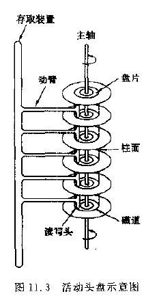

当磁盘驱动器执行读/写功能时。盘片装在一个主轴上，并绕主轴高速旋转，当磁道在读/写头(又叫磁头) 下通过时，就可以进行数据的读 / 写了。

一般磁盘分为固定头盘(磁头固定)和活动头盘。固定头盘的每一个磁道上都有独立的磁头，它是固定不动的，专门负责这一磁道上数据的读/写。

活动头盘 (如上图)的磁头是可移动的。每一个盘面上只有一个磁头(磁头是双向的，因此正反盘面都能读写)。它可以从该面的一个磁道移动到另一个磁道。所有磁头都装在同一个动臂上，因此不同盘面上的所有磁头都是同时移动的(行动整齐划一)。当盘片绕主轴旋转的时候，磁头与旋转的盘片形成一个圆柱体。各个盘面上半径相同的磁道组成了一个圆柱面，我们称为柱面 。因此，柱面的个数也就是盘面上的磁道数。 

##### 2.2 磁盘的读/写原理和效率

磁盘上数据必须用一个三维地址唯一标示：柱面号、盘面号、块号(磁道上的盘块)。

读/写磁盘上某一指定数据需要下面3个步骤：

1. 首先移动臂根据柱面号使磁头移动到所需要的柱面上，这一过程被称为定位或查找 。
2. 如上图11.3中所示的6盘组示意图中，所有磁头都定位到了10个盘面的10条磁道上(磁头都是双向的)。这时根据盘面号来确定指定盘面上的磁道。
3. 盘面确定以后，盘片开始旋转，将指定块号的磁道段移动至磁头下。

经过上面三个步骤，指定数据的存储位置就被找到。这时就可以开始读/写操作了。

访问某一具体信息，由3部分时间组成：

* 查找时间(seek time) Ts: 完成上述步骤(1)所需要的时间。这部分时间代价最高，最大可达到0.1s左右。
* 等待时间(latency time) Tl: 完成上述步骤(3)所需要的时间。由于盘片绕主轴旋转速度很快，一般为7200转/分(电脑硬盘的性能指标之一, 家用的普通硬盘的转速一般有5400rpm(笔记本)、7200rpm几种)。因此一般旋转一圈大约0.0083s。
* 传输时间(transmission time) Tt: 数据通过系统总线传送到内存的时间，一般传输一个字节(byte)大概0.02us=2\*10^(-8)s

**磁盘读取数据是以盘块**(block)**为基本单位的。**位于同一盘块中的所有数据都能被一次性全部读取出来。而磁盘IO代价主要花费在查找时间Ts上。因此我们应该尽量将相关信息存放在同一盘块，同一磁道中。或者至少放在同一柱面或相邻柱面上，以求在**读/写信息时尽量减少磁头来回移动的次数，避免过多的查找时间Ts。**

所以，在大规模数据存储方面，大量数据存储在外存磁盘中，而在外存磁盘中读取/写入块(block)中某数据时，首先需要定位到磁盘中的某块，如何有效地查找磁盘中的数据，需要一种合理高效的外存数据结构，就是下面所要重点阐述的B-tree结构，以及相关的变种结构：B+-tree结构和B\*-tree结构。

#### 3.B- 树 

##### 3.1 什么是B-树

B-树，即为B树。顺便说句，因为B树的原英文名称为B-tree，而国内很多人喜欢把B-tree译作B-树，其实，这是个非常不好的直译，很容易让人产生误解。如人们可能会以为B-树是一种树，而B树又是另外一种树。而事实上是，**B-tree就是指的B树**。

我们知道，B 树是为了磁盘或其它存储设备而设计的一种多叉（下面你会看到，相对于二叉，B树每个内结点有多个分支，即多叉）平衡查找树。与之前介绍的红黑树很相似，但在降低磁盘I/0操作方面要更好一些。许多数据库系统都一般使用B树或者B树的各种变形结构，如下文即将要介绍的B+树，B\*树来存储信息。

B树与红黑树最大的不同在于，B树的结点可以有许多子女，从几个到几千个。不过B树与红黑树一样，一棵含n个结点的B树的高度也为`O(lgn)`，但可能比一棵红黑树的高度小许多，因为它的分支因子比较大。所以，B树可以在`O（logn）`时间内，实现各种如插入（insert），删除（delete）等动态集合操作。

如下图所示，即是一棵B树，一棵关键字为英语中辅音字母的B树，现在要从树中查找字母R（包含n[x]个关键字的内结点x，x有n[x]+1个子女（也就是说，一个内结点x若含有n[x]个关键字，那么x将含有n[x]+1个子女）。所有的叶结点都处于相同的深度，带阴影的结点为查找字母R时要检查的结点）：

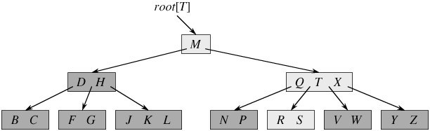

**相信，从上图你能轻易的看到，一个内结点x若含有n[x]个关键字，那么x将含有n[x]+1个子女。如含有2个关键字D H的内结点有3个子女，而含有3个关键字Q T X的内结点有4个子女。**

**B树**的定义

B 树又叫平衡多路查找树。**一棵m阶的B 树** (注：切勿简单的认为一棵m阶的B树是m叉树，虽然存在[四叉树](http://zh.wikipedia.org/wiki/%E5%9B%9B%E5%8F%89%E6%A0%91)，[八叉树](http://zh.wikipedia.org/wiki/%E5%85%AB%E5%8F%89%E6%A0%91)，[KD树](http://blog.csdn.net/v_july_v/article/details/8203674)，及vp/R树/R\*树/R+树/X树/M树/线段树/希尔伯特R树/优先R树等空间划分树，但与B树完全不等同)**的特性如下：**

1. 树中每个结点最多含有m个孩子（m>=2）；
2. 除根结点和叶子结点外，其它每个结点至少有[ceil(m / 2)]个孩子（其中ceil(x)是一个取上限的函数）；
3. 根结点至少有2个孩子（除非B树只包含一个结点：根结点）；
4. 所有叶子结点都出现在同一层，叶子结点不包含任何关键字信息(可以看做是外部结点或查询失败的结点，指向这些结点的指针都为null)；（注：叶子节点只是没有孩子和指向孩子的指针，这些节点也存在，也有元素。类似红黑树中，每一个NULL指针即当做叶子结点，只是没画出来而已）。
5. 每个非终端结点中包含有n个关键字信息： (n，P0，K1，P1，K2，P2，......，Kn，Pn)。其中：  
a) Ki (i=1...n)为关键字，且关键字按顺序升序排序K(i-1)< Ki。  
b) Pi为指向子树根的结点，且指针P(i-1)指向子树种所有结点的关键字均小于Ki，但都大于K(i-1)。   
c) 关键字的个数n必须满足： [ceil(m / 2)-1]<= n <= m-1。比如有j个孩子的非叶结点恰好有j-1个关键码。

B树中的每个结点根据实际情况可以包含大量的关键字信息和分支(当然是不能超过磁盘块的大小，根据磁盘驱动(disk drives)的不同，一般块的大小在1k~4k左右)；这样树的深度降低了，这就意味着查找一个元素只要很少结点从外存磁盘中读入内存，很快访问到要查找的数据。

##### 3.2 B树的类型和节点定义

B树的类型和节点定义如下图所示：

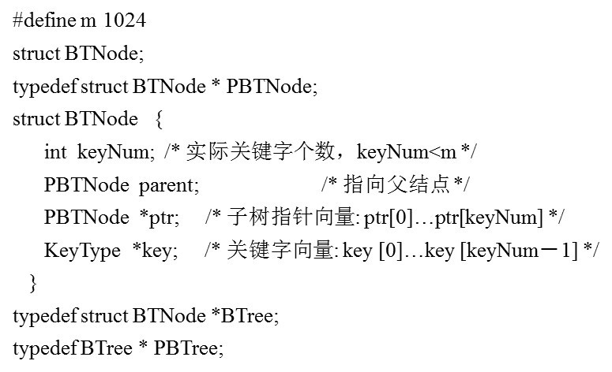  

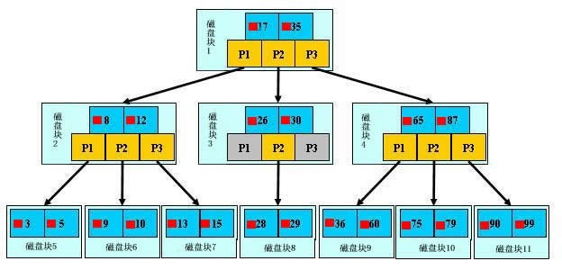  

##### 3.3 文件查找的具体过程(涉及磁盘IO操作)

为了简单，这里用少量数据构造一棵3叉树的形式，实际应用中的B树结点中关键字很多的。上面的图中比如根结点，其中17表示一个磁盘文件的文件名；小红方块表示这个17文件内容在硬盘中的存储位置；p1表示指向17左子树的指针。

其结构可以简单定义为：

```c
typedef struct {
    /*文件数*/
    int  file_num;
    /*文件名(key)*/
    char * file_name[max_file_num];
    /*指向子节点的指针*/
     BTNode * BTptr[max_file_num+1];
     /*文件在硬盘中的存储位置*/
     FILE_HARD_ADDR offset[max_file_num];
}BTNode;
```

假如每个盘块可以正好存放一个B树的结点（正好存放2个文件名）。那么一个BTNODE结点就代表一个盘块，而子树指针就是存放另外一个盘块的地址。

下面，咱们来模拟下查找文件29的过程：

1. 根据根结点指针找到文件目录的根磁盘块1，将其中的信息导入内存。【磁盘IO操作 1次】    
2. 此时内存中有两个文件名17、35和三个存储其他磁盘页面地址的数据。根据算法我们发现：17<29<35，因此我们找到指针p2。
3. 根据p2指针，我们定位到磁盘块3，并将其中的信息导入内存。【磁盘IO操作 2次】    
4. 此时内存中有两个文件名26，30和三个存储其他磁盘页面地址的数据。根据算法我们发现：26<29<30，因此我们找到指针p2。
5. 根据p2指针，我们定位到磁盘块8，并将其中的信息导入内存。【磁盘IO操作 3次】    
6. 此时内存中有两个文件名28，29。根据算法我们查找到文件名29，并定位了该文件内存的磁盘地址。

分析上面的过程，发现需要**3次磁盘IO操作和3次内存查找**操作。关于内存中的文件名查找，由于是一个有序表结构，可以利用折半查找提高效率。至于IO操作是影响整个B树查找效率的决定因素。

当然，如果我们使用平衡二叉树的磁盘存储结构来进行查找，磁盘4次，最多5次，而且文件越多，B树比平衡二叉树所用的磁盘IO操作次数将越少，效率也越高。

##### 3.4 B树的高度

根据上面的例子我们可以看出，对于辅存做IO读的次数取决于B树的高度。而B树的高度又怎么求呢？

对于一棵含有N个关键字，m阶的B树来说（据B树的定义可知：m满足：ceil(m/2)<=**m**<=m，m阶即代表树中任一结点最多含有m个孩子，如5阶代表每个结点最多5个孩子，或俗称5叉树），且从1开始计数的话，其高度h为：

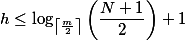

这个B树的高度公式从侧面显示了B树的查找效率是相当高的。为什么呢？因为底数m/2可以取很大，如m可以达到几千，从而在关键字数一定的情况下，使得最终的h值尽量比较小，树的高度比较低。

树的高度降低了，磁盘存取的次数也随着树高度的降低而减少，从而使得存取性能也相应提升。

#### 4、B树的插入、删除操作

根据B树的性质可知，如果是一棵m阶的B 树，那么有：

- 树中每个结点含有最多含有m个孩子，即m满足：ceil(m/2)<=**m**<=m。
- 除根结点和叶子结点外，其它每个结点至少有[ceil(m / 2)]个孩子（其中ceil(x)是一个取上限的函数）；
- 除根结点之外的结点的关键字的个数n必须满足： [ceil(m / 2)-1]<= n <= m-1（叶子结点也必须满足此条关于关键字数的性质）。

下面咱们通过另外一个实例来对这棵B树的插入（insert）,删除（delete）基本操作进行详细的介绍。以一棵**5阶**（即树中任一结点至多含有4个关键字，5棵子树）B树实例进行讲解(如下图所示)：


在上图所示的一棵5阶B树中，读者可以看到关键字数2-4个，内结点孩子数3-5个。**关键字数（2-4个）针对包括叶子结点在内的非根结点，孩子数（3-5个）则针对根结点和叶子结点之外的内结点。同时，根结点是必须至少有2个孩子的，不然就成直线型搜索树了。**且关键字为大写字母，顺序为字母升序。

结点定义如下：

```c
typedef struct{
   int Count;         // 当前节点中关键元素数目
   ItemType Key[4];   // 存储关键字元素的数组
   long Branch[5];    // 伪指针数组，(记录数目)方便判断合并和分裂的情况
} NodeType;
```

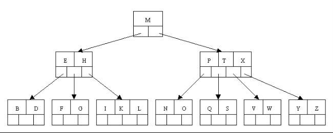

##### 4.1 插入（insert）操作

针对一棵高度为h的m阶B树，插入一个元素时，首先在B树中是否存在，如果不存在，一般在叶子结点中插入该新的元素，此时分3种情况：

 - 如果叶子结点空间足够，即该结点的关键字数小于m-1，则直接插入在叶子结点的左边或右边；
 - 如果空间满了以致没有足够的空间去添加新的元素，即该结点的关键字数已经有了m个，则需要将该**结点**进行“分裂”，将一半数量的关键字元素分裂到新的其相邻右结点中，中间关键字元素上移到父结点中，而且当结点中关键元素向右移动了，相关的指针也需要向右移。
- 此外，如果在上述中间关键字上移到父结点的过程中，导致根结点空间满了，那么根结点也要进行分裂操作，这样原来的根结点中的中间关键字元素向上移动到新的根结点中，因此导致树的高度增加一层。

下面咱们通过一个实例来逐步讲解下。插入以下字符字母到一棵空的5阶B 树中：C N G A H E K Q M F W L T Z D P R X Y S，而且，因为是5阶B树，所以必有非根结点**关键字数**小了（小于2个）就合并，大了（超过4个）就分裂。

1. 首先，结点空间足够，刚开始的4个字母可以直接到插入相同的结点中，如下图：  
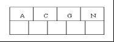
2. 插入H结点时，发现结点空间不够，所以将其分裂成2个结点，移动中间元素G上移到新的根结点中，且把A和C留在当前结点中，而H和N放置在新的右邻居结点中。如下图：  
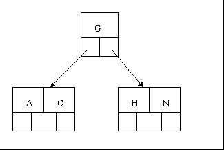
3. 当插入E,K,Q时，不需要任何分裂操作  
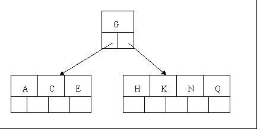
4. 插入M需要一次分裂，注意到M恰好是中间关键字元素，所以M向上移到父节点中  
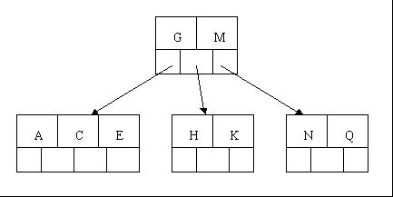
5. 插入F,W,L,T不需要任何分裂操作  
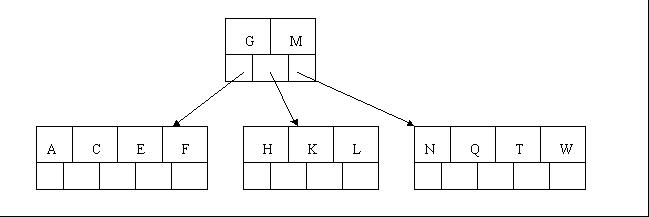
6. 插入Z时，最右的叶子结点空间满了，需要进行分裂操作，中间元素T上移到父节点中

7. 插入D时，导致最左边的叶子结点被分裂，D恰好也是中间元素，上移到父节点中，然后字母P,R,X,Y直接陆续插入，不需要任何分裂操作  
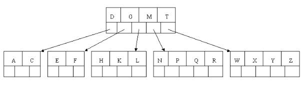
8. 最后，当插入S时，含有N,P,Q,R的结点需要分裂，把中间元素Q上移到父节点中，但是问题来了，因为Q上移导致父结点 “D G M T” 也满了，所以也要进行分裂，将父结点中的中间元素M上移到新形成的根结点中，从而致使树的高度增加一层。
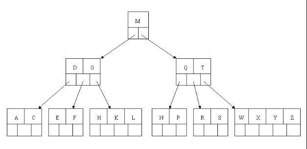

##### 4.2、删除(delete)操作

下面介绍删除操作，删除操作相对于插入操作要考虑的情况多点。  

 - 首先查找B树中需删除的元素,如果该元素在B树中存在，则将该元素在其结点中进行删除，如果删除该元素后，首先判断该元素是否有左右孩子结点
- 如果有，则上移孩子结点中的某相近元素(“左孩子最右边的节点”或“右孩子最左边的节点”)到父节点中，然后是移动之后的情况；
- 如果没有，直接删除后，移动之后的情况。

删除元素，移动相应元素之后，如果某结点中元素数目（即关键字数）小于**ceil(m/2)-1**，则需要看其某相邻兄弟结点是否丰满（结点中元素个数大于ceil(m/2)-1）
 - 如果丰满，则向父节点借一个元素来满足条件；
 - 如果其相邻兄弟都刚脱贫，即借了之后其结点数目小于ceil(m/2)-1，则该结点与其相邻的某一兄弟结点进行“合并”成一个结点，以此来满足条件。

下面咱们还是以上述插入操作构造的一棵5阶B树（**树中除根结点和叶子结点外的任意结点的孩子数m满足3<=m<=5，除根结点外的任意结点的关键字数n满足：2<=n<=4，所以关键字数小于2个就合并，超过4个就分裂**）为例，依次删除H,T,R,E。


1. 首先删除元素H，当然首先查找H，H在一个叶子结点中，且该叶子结点元素数目3大于最小元素数目ceil(m/2)-1=2，则操作很简单，咱们只需要移动K至原来H的位置，移动L至K的位置（也就是结点中删除元素后面的元素向前移动）  

2. 下一步，删除T,因为T没有在叶子结点中，而是在中间结点中找到，咱们发现他的继承者W(字母升序的下个元素)，将W上移到T的位置，然后将原包含W的孩子结点中的W进行删除，这里恰好删除W后，该孩子结点中元素个数大于2，无需进行合并操作。  
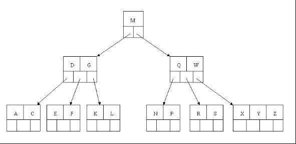
3. 下一步删除R，R在叶子结点中,但是该结点中元素数目为2，删除导致只有1个元素，已经小于最小元素数目ceil(5/2)-1=2,而由前面我们已经知道：**如果其某个相邻兄弟结点中比较丰满（元素个数大于ceil(5/2)-1=2），则可以向父结点借一个元素，然后将最丰满的相邻兄弟结点中上移最后或最前一个元素到父节点中**（有没有看到红黑树中左旋操作的影子?）。
故在这个实例中，由于右相邻兄弟结点“X Y Z”比较丰满，而删除元素R后，导致“S”结点稀缺
 - 所以原来的的“R S”结点先向父节点借一个元素W下移到该叶子结点中，代替原来S的位置，S前移；
 - 然后相邻右兄弟结点中的X上移到父结点中；
 - 最后相邻右兄弟结点中元素Y和Z前移。  
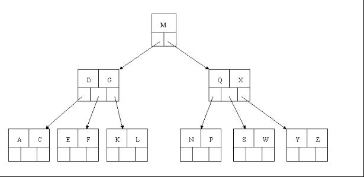
4. 最后一步删除E， 删除后会导致很多问题，因为E所在的结点数目刚好达标，刚好满足最小元素个数（ceil(5/2)-1=2）,而相邻的兄弟结点也是同样的情况，删除一个元素都不能满足条件，所以需要**该节点与某相邻兄弟结点进行合并操作**；
 - 首先移动父结点中的元素（该元素在两个需要合并的两个结点元素之间）下移到其子结点中，
 - 然后将这两个结点进行合并成一个结点。所以在该实例中，咱们首先将父节点中的元素D下移到已经删除E而只有F的结点中，然后将含有D和F的结点和含有A,C的相邻兄弟结点进行合并成一个结点。  
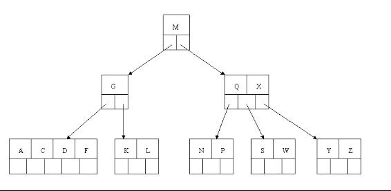

也许你认为这样删除操作已经结束了，其实不然，在看看上图，对于这种特殊情况，你立即会发现父节点只包含一个元素G，没达标（因为非根节点包括叶子结点的关键字数n必须满足于2=<n<=4，而此处的n=1），这是不能够接受的。如果这个问题结点的相邻兄弟比较丰满，则可以向父结点借一个元素。假设这时右兄弟结点（含有Q,X）有一个以上的元素（Q右边还有元素），然后咱们将M下移到元素很少的子结点中，将Q上移到M的位置，这时，Q的左子树将变成M的右子树，也就是含有N，P结点被依附在M的右指针上。

所以在这个实例中，咱们没有办法去借一个元素，只能与兄弟结点进行合并成一个结点，而根结点中的唯一元素M下移到子结点，这样，树的高度减少一层。  
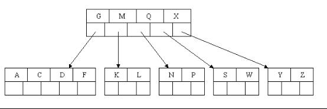  

为了进一步详细讨论删除的情况，**再举另外一个实例**：  
这里是一棵不同的5序B树，那咱们试着删除C  
  
于是将删除元素C的右子结点中的D元素上移到C的位置，但是出现上移元素后，只有一个元素的结点的情况。  
又因为含有E的结点，其相邻兄弟结点才刚脱贫（最少元素个数为2），不可能向父节点借元素，所以只能进行合并操作，于是这里将含有A,B的左兄弟结点和含有E的结点进行合并成一个结点。   
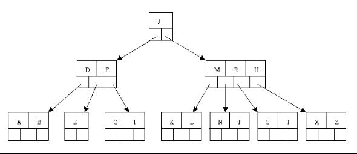  
这样又出现只含有一个元素F结点的情况，这时，其相邻的兄弟结点是丰满的（元素个数为3>最小元素个数2），这样就可以想父结点借元素了，把父结点中的J下移到该结点中，相应的如果结点中J后有元素则前移，然后相邻兄弟结点中的第一个元素（或者最后一个元素）上移到父节点中，后面的元素（或者前面的元素）前移（或者后移）；注意含有K，L的结点以前依附在M的左边，现在变为依附在J的右边。这样每个结点都满足B树结构性质。  
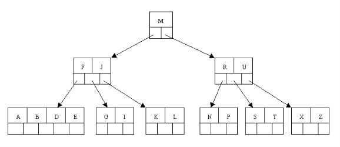  
从以上操作可看出：除根结点之外的结点（包括叶子结点）的关键字的个数n满足：（ceil(m / 2)-1）<= n <= m-1，即2<=n<=4。这也佐证了咱们之前的观点。删除操作完。

#### 5.B+-tree

*B+-tree*：是应文件系统所需而产生的一种B-tree的变形树。

一棵m阶的B+树和m阶的B树的异同点在于：

1. 有n棵子树的结点中含有n-1 个关键字； (与B 树n棵子树有n-1个关键字 保持一致，参照：[http://en.wikipedia.org/wiki/B%2B_tree#Overview](http://en.wikipedia.org/wiki/B%2B_tree#Overview)，而下面**B+树的图可能有问题**，请读者注意)
2. 所有的叶子结点中包含了全部关键字的信息，及指向含有这些关键字记录的指针，且叶子结点本身依关键字的大小自小而大的顺序链接。 (而B 树的叶子节点并没有包括全部需要查找的信息)
3. **所有的非终端结点可以看成是索引部分**，结点中仅含有其子树根结点中最大（或最小）关键字。 (而B 树的非终节点也包含需要查找的有效信息)

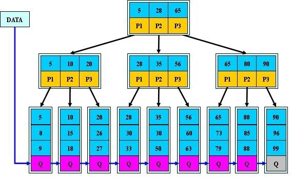  

a) 为什么说B+-tree比B 树更适合实际应用中操作系统的文件索引和数据库索引？ 

1. B+-tree的磁盘读写代价更低
B+-tree的内部结点并没有指向关键字具体信息的指针。因此其内部结点相对B 树更小。如果把所有同一内部结点的关键字存放在同一盘块中，那么盘块所能容纳的关键字数量也越多。一次性读入内存中的需要查找的关键字也就越多。相对来说IO读写次数也就降低了。

举个例子，假设磁盘中的一个盘块容纳16bytes，而一个关键字2bytes，一个关键字具体信息指针2bytes。一棵9阶B-tree(一个结点最多8个关键字)的内部结点需要2个盘块。而B+ 树内部结点只需要1个盘快。当需要把内部结点读入内存中的时候，B 树就比B+ 树多一次盘块查找时间(在磁盘中就是盘片旋转的时间)。

2. B+-tree的查询效率更加稳定  

由于非终结点并不是最终指向文件内容的结点，而只是叶子结点中关键字的索引。所以任何关键字的查找必须走一条从根结点到叶子结点的路。所有关键字查询的路径长度相同，导致每一个数据的查询效率相当。

总而言之，B树在提高了磁盘IO性能的同时并没有解决元素遍历的效率低下的问题。正是为了解决这个问题，B+树应运而生。B+树只要遍历叶子节点就可以实现整棵树的遍历，支持基于范围的查询，而B树不支持range-query这样的操作（或者说效率太低）。

b)  B+-tree的应用: VSAM(虚拟存储存取法)文件(来源论文 *the ubiquitous Btree* 作者：D COMER - 1979 )

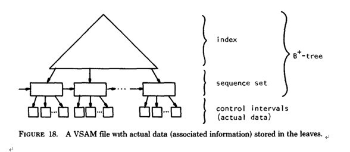

#### 6.B\*-tree

B\*-tree是B+-tree的变体，在B+树的基础上(所有的叶子结点中包含了全部关键字的信息，及指向含有这些关键字记录的指针)，B\*树中非根和非叶子结点再增加指向兄弟的指针；B\*树定义了非叶子结点关键字个数至少为(2/3)\*M，即块的最低使用率为2/3（代替B+树的1/2）。给出了一个简单实例，如下图所示：

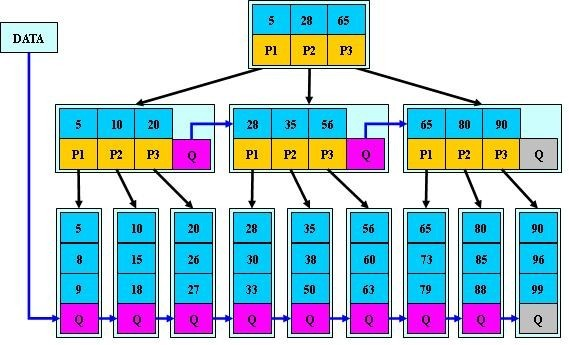

B+树的分裂：当一个结点满时，分配一个新的结点，并将原结点中1/2的数据复制到新结点，最后在父结点中增加新结点的指针；B+树的分裂只影响原结点和父结点，而不会影响兄弟结点，所以它不需要指向兄弟的指针。

B\*树的分裂：当一个结点满时，如果它的下一个兄弟结点未满，那么将一部分数据移到兄弟结点中，再在原结点插入关键字，最后修改父结点中兄弟结点的关键字（因为兄弟结点的关键字范围改变了）；如果兄弟也满了，则在原结点与兄弟结点之间增加新结点，并各复制1/3的数据到新结点，最后在父结点增加新结点的指针。

所以，B\*树分配新结点的概率比B+树要低，空间使用率更高；

#### 7.总结

通过以上介绍，大致将B树，B+树，B*树总结如下：

* B树：有序数组+平衡多叉树；
* B+树：有序数组链表+平衡多叉树；
* B\*树：一棵丰满的B+树。


顺便说一句，无论是B树，还是B+树、b*树，由于根或者树的上面几层被反复查询，所以这几块可以存在内存中，换言之，B树、B+树、B*树的根结点和部分顶层数据在内存中，大部分下层数据在磁盘上。
