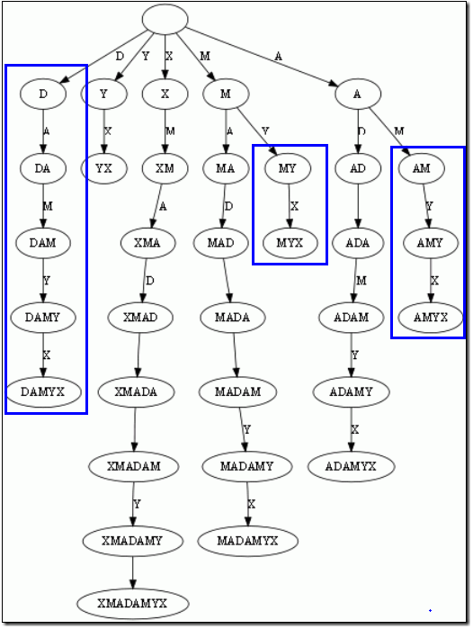
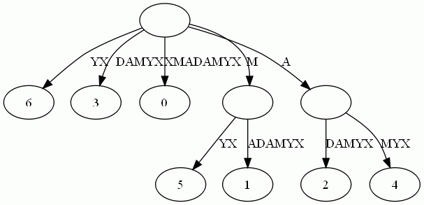
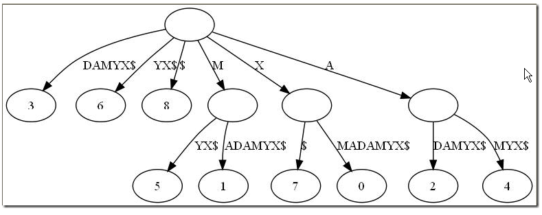
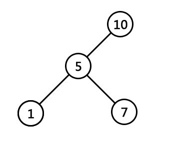
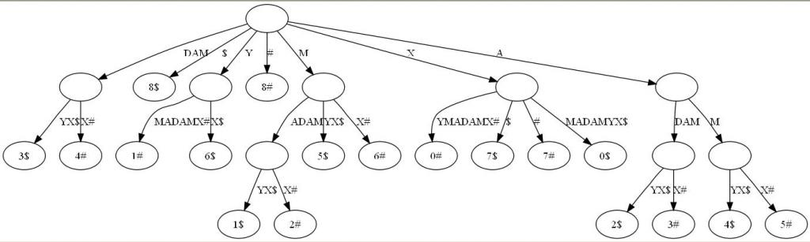

## 后缀树

### 1.1、后缀树的定义

后缀树（Suffix tree）是一种数据结构，能快速解决很多关于字符串的问题。后缀树的概念最早由Weiner 于1973年提出，既而由McCreight 在1976年和Ukkonen在1992年和1995年加以改进完善。

后缀，顾名思义，就是后面尾巴的意思。比如说给定一长度为n的字符串S=S1S2..Si..Sn，和整数i，1 <= i <= n，子串SiSi+1...Sn便都是字符串S的后缀。

以字符串S=XMADAMYX为例，它的长度为8，所以S[1..8], S[2..8], ... , S[8..8]都算S的后缀，我们一般还把空字串也算成后缀。这样，我们一共有如下后缀。对于后缀S[i..n]，我们说这项后缀起始于i。

S[1..8], XMADAMYX， 也就是字符串本身，起始位置为1  
 S[2..8], MADAMYX，起始位置为2  
  S[3..8], ADAMYX，起始位置为3  
   S[4..8], DAMYX，起始位置为4  
    S[5..8], AMYX，起始位置为5  
     S[6..8], MYX，起始位置为6  
      S[7..8], YX，起始位置为7  
       S[8..8], X，起始位置为8  
空字串，记为$。 

而后缀树，就是包含一则字符串所有后缀的压缩Trie。把上面的后缀加入Trie后，我们得到下面的结构：

仔细观察上图，我们可以看到不少值得压缩的地方。比如蓝框标注的分支都是独苗，没有必要用单独的节点同边表示。如果我们允许任意一条边里包含多个字 母，就可以把这种没有分叉的路径压缩到一条边。而另外每条边已经包含了足够的后缀信息，我们就不用再给节点标注字符串信息，只需要**在叶节点上标注上每项后缀的起始位置**。

于是我们得到下图：

这样的结构丢失了某些后缀。比如后**缀X在上图中消失了**，因为它正好是字符串XMADAMYX的前缀。为了避免这种情况，我们也规定**每项后缀不能是其它后缀的前缀**。要解决这个问题其实挺简单，在**待处理的子串后加一个空字串**就行了。例如我们处理XMADAMYX前，先把XMADAMYX变为 XMADAMYX$，于是就得到suffix tree--后缀树了，如下图所示：

### 1.2、后缀树的应用

后缀树可以解决最长回文问题，那它和最长回文有什么关系呢？在此之前，我们得先知道两个简单概念：

- 最低共有祖先，**LCA**（Lowest Common Ancestor)，也就是任意两节点（多个也行）最长的共有前缀。比如下图中，节点7同节点1的共同祖先是节点5与节点10，但最低共同祖先是5。 查找LCA的算法是O(1)的复杂度，当然，代价是需要对后缀树做复杂度为O(n)的预处理。 

- 广义后缀树(Generalized Suffix Tree)。传统的后缀树处理一坨单词的所有后缀。广义后缀树存储任意多个单词的所有后缀。例如下图是单词**XMADAMYX与XYMADAMX的广义后缀 树**。注意我们需要区分不同单词的后缀，所以叶节点用不同的特殊符号与后缀位置配对。 

有了上面的概念，本文引言中提出的查找最长回文问题就相对简单了。咱们来回顾下引言中提出的回文问题的具体描述：找出给定字符串里的最长回文。例如输入XMADAMYX，则输出MADAM。

思维的突破点在于考察回文的半径，而不是回文本身。所谓半径，就是回文对折后的字串。比如回文MADAM 的半径为MAD，半径长度为3，半径的中心是字母D。显然，最长回文必有最长半径，且两条半径相等。

还是以MADAM为例，以D为中心往左，我们得到半径 DAM；以D为中心向右，我们得到半径DAM。二者肯定相等。因为MADAM已经是单词XMADAMYX里的最长回文，我们可以肯定从**D往左数的字串 DAMX与从D往右数的子串DAMYX共享最长前缀DAM**。而这，正是解决回文问题的关键。现在我们有后缀树，怎么把从D向左数的字串DAMX变成后缀呢？

到这个地步，答案应该明显：**把单词XMADAMYX翻转（XMADAMYX=>XYMADAMX**，**DAMX**就变成后缀了**）**就行了。于是我们把寻找回文的问题转换成了寻找两坨后缀的**LCA**的问题。当然，我们还需要知道 到底查询那些后缀间的LCA。很简单，给定字符串S，如果最长回文的中心在i，那从位置i向右数的后缀刚好是S(i)，而向左数的字符串刚好是翻转S后得到的字符串S‘的后缀S'(n-i+1)。这里的n是字符串S的长度。

拿单词XMADAMYX来说，回文中心为D，那么D向右的后缀**DAMYX**假设是S(i)（当N=8，i从1开始计数，i=4时，便是S(4..8)）;而对于翻转后的单词XYMADAMX而言，回文中心D向右对应的后缀为**DAMX**，也就是S'(N-i+1)(（N=8，i=4，便是S‘（5..8）） 。此刻已经可以得出，它们共享最长前缀，即**LCA（DAMYX，DAMX）=DAM**。有了这套直观解释，算法自然呼之欲出:

1. 预处理后缀树，使得查询LCA的复杂度为O(1)。这步的开销是O(N)，N是单词S的长度 ；
  
2. 对单词的每一位置i(也就是从0到N-1)，获取LCA(S(i), S‘(N-i+1)) 以及LCA(S(i+1), S’(n-i+1))。查找两次的原因是我们需要考虑奇数回文和偶数回文的情况。这步要考察每坨i，所以复杂度是O(N) ；  

3. 找到最大的LCA，我们也就得到了回文的中心i以及回文的半径长度，自然也就得到了最长回文。总的复杂度O(n)。 

i为4时，LCA(4$, 5#)为DAM，正好是最长半径。此外，创建后缀树为O(n)的时间复杂度。
