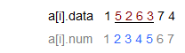
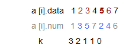
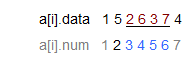
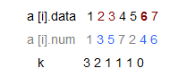

# 第三章：寻找最小的 k 个数

##第三节：求数组中给定下标区间内的第K小（大）元素

作者：July、上善若水、编程艺术室。  
出处：[结构之法 算法之道](http://blog.csdn.net/v_JULY_v) 。

###前奏

原狂想曲系列已更名为：[程序员编程艺术系列](http://blog.csdn.net/v_JULY_v/article/category/784066)。原狂想曲创作组更名为**编程艺术室**。编程艺术室致力于以下三点工作：1、针对一个问题，不断寻找更高效的算法，并予以编程实现。2、解决实际中会碰到的应用问题，如第十章、如何给磁盘文件排序。3、经典算法的研究与实现。总体突出一点：编程，如何高效的编程解决实际问题。欢迎有志者加入。

ok，扯远了。在上一章，我们介绍了[第十章、如何给10^7个数据量的磁盘文件排序](http://blog.csdn.net/v_JULY_v/article/details/6451990)，下面介绍下本章的主题。我们知道，通常来讲，寻找给定区间内的第k小（大）的元素的问题是ACM中一类常用的数据结构的一个典型例题，即划分树/逆向归并树，通常用线段树的结构存储。

当然这里暂且不表，尚不说划分树思想的神奇，就是线段树的结构，一般没有ACM基础的人也都觉得难以理解。所以，这里提供一个时间效率尚可，空间代价还要略小的巧妙解法—伴随数组。

如果看过此前程序员编程艺术：[第六章、求解500万以内的亲和数](http://blog.csdn.net/v_JULY_v/article/details/6441279)中，有关亲和数的那个题目的伴随数组的解法，也就是利用数组下标作为伴随数组，相信就会对这个方法有一定程度的理解。

###第一节、寻找给定区间内的第k小（大）的元素

给定数组，给定区间，求第K小的数如何处理？求最小的k个元素用最大堆，求最大的k的元素用最小堆。OK，常规方法请查阅：程序员编程艺术：第三章、寻找最小的k个数。

> 1、排序，快速排序。我们知道，快速排序平均所费时间为`n*logn`，从小到大排序这n个数，然后再遍历序列中后k个元素输出，即可，总的时间复杂度为`O(n*logn+k)=O(n*logn)`。
> 
> 2、排序，选择排序。用选择或交换排序，即遍历n个数，先把最先遍历到得k个数存入大小为k的数组之中，对这k个数，利用选择或交换排序，找到k个数中的最大数kmax（kmax设为k个元素的数组中最大元素），用时`O(k)`（你应该知道，插入或选择排序查找操作需要`O(k)`的时间），后再继续遍历后`n-k`个数，x与kmax比较：如果`x<kmax`，则x代替kmax，并再次重新找出k个元素的数组中最大元素kmax‘（多谢jiyeyuran 提醒修正）；如果`x>kmax`，则不更新数组。这样，每次更新或不更新数组的所用的时间为`O(k)`或`O(0)`，整趟下来，总的时间复杂度平均下来为：`n*O(k)=O(n*k)`。
> 
> 3、维护k个元素的最大堆，原理与上述第2个方案一致，即用容量为k的最大堆存储最先遍历到的k个数，并假设它们即是最小的k个数，建堆费时`O(k)`，有`k1<k2<...kmax`（kmax设为最大堆中的最小元素）。继续遍历数列，每次遍历一个元素x，与堆顶元素比较，若`x<kmax`，则更新堆（用时`logk`），否则不更新堆。这样下来，总费时`O(k+(n-k)*logk)=O(N*logK)`。此方法得益于在堆中，查找等各项操作时间复杂度均为`logk`（不然，就如上述思路2所述：直接用数组也可以找出最大的k个元素，用时`O(n*k)`）。
> 
> 4、按编程之美上解法二的所述，类似快速排序的划分方法，N个数存储在数组S中，再从数组中随机选取一个数X，把数组划分为Sa和Sb俩部分，`Sa<=X<=Sb`，如果要查找的k个元素小于Sa的元素个数，则返回Sa中较小的k个元素，否则返回Sa中所有的元素+Sb中较小的`k-|Sa|`个元素。不断递归下去，把问题分解成更小的问题，平均时间复杂度为`O(N)`（编程之美所述的`O(N*logk)`的复杂度有误，应为`O(N)`，特此订正。其严格证明，请参考第三章：程序员面试题狂想曲：[第三章、寻找最小的k个数](http://blog.csdn.net/v_JULY_v/article/details/6370650)，updated 10次......）。

下面我们给出伴随数组解法，首先，定义一个结构体，一个是数组元素，另一个是数组原来的标号，记录每个数在数组的原顺序。

我们以下面的测试数据举例（红体部分表示下标为2~5之间的数5,2,6,3，浅色部分表示数组中的数各自对应的数组下标，淡蓝色部分为给定的下标区间，注，这里，我们让数组下标从1开始）：



现在，题目给定了下标区间，如在原序列中下标2~5（即下标为`2,3,4,5`）区间找到第3小的数。问题亦相当于要你找原序列里给定下标区间即第2个数到第5个数之中（`5,2,6,3`）第3小的数（当然，答案很明显，第3小的数就是5）。

那么对原数组进行排序，然后得到的序列应该是（**注：原下标始终保持不变**）：


如上，既然数据现在已经从小到大排好了，那么，我们只需要进行一次检索，从最小的数到最大的数，我们找第k(k=3)小的数，当我们发现下标`a[i].num`等于原给定下标区间在2~5中，即`a[i].num==2 || 3 || 4 || 5`的时候，k--，那么当k==0的时候，我们也就找到了第k(3)小的数了。如下（红色部分表示原给定下标区间中的数，浅色部分依然是原各数对应的下标，淡蓝色部分为原来给定的下标区间所对应的索引）：



故下标索引为2~5之间第k（3）小的数是5。

程序的构造与解释：由于排序后，我们能保证原序列已经从小到大的排好序了，所以，当遍历或扫描到原序列给定下标区间中的数时，则k--，最终能在k==0时，找到第k小的数，且这个数是在原来给定下标区间中的某一个数。
    
而这个伴随数组，或者说原序列各数的索引则帮我们或者说是帮电脑记下了原来的数，已让我们后来遍历时能识别排序后序列中的数是否是给定下标区间中的某一个数。如果是原给定下标区间中的数，则k--，否则k不变。

###第二节、采用伴随数组方案的实现

上述采用伴随数组的方法巧妙且简单，也很好理解和实现，关键 就是在于题目要求是在给定下标区间中找寻第k小（大）的元素，所以，基本上在排序`n*logn`完了之后，总能 在`O(n)`的时间内找到想找的数。源代码如下：


```cpp
//copyright@ 水 && July  
//总的时间复杂度为O（N*logN+N）= O（N*logN）。  
//July、updated，2011.05.28.凌晨。  
#include<iostream>  
#include<algorithm>  
using namespace std;  
  
struct node{  
    int num,data;  
    bool operator < (const node &p) const   
    {  
        return data < p.data;  
    }  
};  
node p[100001];  
  
int main()  
{  
    int n=7;  
    int i,j,a,b,c;//c：flag;  
      
    for(i=1;i<=n;i++)   
    {  
        scanf("%d",&p[i].data);  
        p[i].num = i;  
    }  
    sort(p+1,p+1+n);    //调用库函数sort完成排序，复杂度n*logn  
      
    scanf("%d %d %d",&a,&b,&c);  
    for(i=1;i<=n;i++)   //扫描一遍，复杂度n  
    {  
        if(p[i].num>=a && p[i].num<=b)   
            c--;   
        if(c == 0)   
            break;  
    }  
    printf("%d/n",p[i].data);  
    return 0;  
}  
```
**程序测试**：输入的第1行数字`1 5 2 6 3 7 4`代表给定的数组，第二行的数字中，`2 5`代表给定的下标区间2~5，`3`表示要在给定的下标区间2~5中寻找第3小的数，第三行的`5`表示找到的第3小的数。程序运行结果如下：


水原来写的代码（上面我的改造，是为了达到后来扫描时`O(N)`的视觉效果）：

```cpp
//copyright@ 水  
#include<iostream>  
#include<algorithm>  
using namespace std;  
  
struct node{  
    int num,data;  
    bool operator < (const node &p) const   
    {  
        return data < p.data;  
    }  
};  
node p[100001];  
  
int main()  
{  
    int n,m,i,j,a,b,c;//c：flag;  
    while(scanf("%d %d",&n,&m)!=EOF)   
    {  
        for(i=1;i<=n;i++)   
        {  
            scanf("%d",&p[i].data);  
            p[i].num = i;  
        }  
        sort(p+1,p+1+n);  
          
        for(j=1;j<=m;j++)   
        {  
            scanf("%d %d %d",&a,&b,&c);  
            for(i=1;i<=n;i++)   
            {  
                if(p[i].num>=a && p[i].num<=b)   
                    c--;   
                if(c == 0)   
                    break;  
            }  
            printf("%d/n",p[i].data);  
        }  
    }  
    return 0;  
}  
```

###第三节、直接排序给定下标区间的数

你可能会忽略一个重要的事实，不知读者是否意识到。题目是要求我们在数组中求给定下标区间内某一第k小的数，即我们只要找到这个第k小的数，就够了。但上述程序显示的一个弊端，就是它先对整个数组进行了排序，然后采用伴随数组的解法寻找到第k小的数。而事实是，我们不需要对整个数组进行排序，我们只需要对我们要寻找的那个数的数组中给定下标区间的数进行部分排序，即可。

对，事情就是这么简单。我们摒弃掉伴随数组的方法，只需要直接对数组中给定的那部分下标区间中的数进行排序，而不是对整个数组进行排序。如此的话，算法的时间复杂度降到了`L*logK`。其中，`L=|b-a+1|`，L为给定下标区间的长度，相对整个数组的程度n，`L<=n`。程序代码如下。

```cpp
//copyright@ 苍狼  
//直接对给定区间的数进行排序，没必要用伴随数组。  
#include<iostream>     
#include<algorithm>     
using namespace std;     
  
struct node{     
    int data;     
    bool operator < (const node &p) const      
    {     
        return data < p.data;     
    }     
};     
node p[100001];     
  
int main()     
{     
    int n=7;     
    int i,a,b,c;//c：flag;     
      
    for(i=1;i<=n;i++)      
    {     
        scanf("%d",&p[i].data);        
    }  
      
    scanf("%d%d%d", &a, &b, &c);   //b，a为原数组的下标索引  
    sort(p+a, p+b+1);     //直接对给定区间进行排序，|b-a+1|*log（b-a+1）  
      
    printf("The number is %d/n", p[a-1+c].data);      
    return 0;     
}  
```

**程序测试**：我们同样采取第二节的测试用例。输入的第1行数字`1 5 2 6 3 7 4`代表给定的数组，第二行的数字中，`2 5`代表给定的下标区间2~5，`3`表示要在给定的下标区间2~5中的数，即从a[2]~a[5]中寻找第3小的数，第三行的`5`表示找到的第3小的数。程序运行结果如下。


貌似上述直接对给定区间内的数进行排序，效率上较第二节的伴随数组方案更甚一筹。既然如此，那么伴随数组是不是多此一举呢?其实不然，@水：假如，我对2-5之间进行了排序，那么数据就被摧毁了，怎么进行2次的操作？就是现在的2位置已经不是初始的2位置的数据了。也就是说，快排之后下标直接定位的方法明显只能用一次。

ok，更多请看下文第四节中的“百家争鸣”与“经典对白”。

###第四节、伴随数组的优势所在 

####百家争鸣

- @雨翔：伴随数组这种方式确实比较新颖 ，伴随数组的前提是在排序后的 ，但总的复杂度**还是 `O(N*logN+N)=O(N*logN)`**，找第K大的数的此类面试题都是有这几点限制：**1、**数很多，让你在内存中放不下，**2、**复杂度严格要求，即不能用排序。当然，即便第三节中，直接对给定下标区间进行排序，复杂度同样为`L*logL`，L为给定区间的长度。事实上，我们在解决 “从给定下标区间中的数找寻第k小（大）的元素” 这个问题，还是选择堆为好，在之前的基础上：入堆的时候 只需检测这个元素的下标是否是给定下标区间内的，不是则不入这样的复杂度会低，不需要排序。然后便是平均时间复杂度虽为O(N)，但并不常用的快速选择SELECT算法，参考：[第三章再续：快速选择SELECT算法的深入分析与实现](http://blog.csdn.net/v_JULY_v/article/details/6431001)。

- @水：伴随数组的解法是为了达到预处理开销换查找开销目的。直接对给定不同的下标区间的数进行排序，在小数据量处理时复杂度还可以接受，但当面临大数据量，即海量数据处理时，比如10G的数据量，每次取1G的段的问题，则使用伴随数组的方法会凸显优势，只不过预处理的开销的确是大了点。伴随数组的精髓就是稳定的时间之内解决对相同数据的多次访问查找。说白了，就是同一个数组，要不断查找数组中给定的不同下标区间中的第k小的数时优势明显。具体，还可以看看这道题：<http://poj.org/problem?id=2104>。

- @July：不用看我了，基本上同意上述水的观点。雨翔之所以认为伴随数组不可取，是因为没有考虑到水提出的问题，即如果要多次或不断的从数组中不同的下标区间中寻找第k小的数的情况。这时，伴随数组的优势就体现出来了。ok，读者还可以继续看下面的经典对白。相信，你能找到你想要的答案。

####经典对白

- 查找a[0]~a[n-1]内第K小，然后再找a[1]~a[n]内第K小，依次往复，找个几次就优势明显了。其实是比较采取伴随数组解法n log n +m*n的代价（m为给定不同区间的个数）和直接排序m*(L*log L )（L为给定下标区间的长度）的代价，哪个更低。其中，采用伴随数组查找最差情况是`nlogn + m(n-1)`，而直接排序代价，最差情况为`m * ((n-1)*log(n-1))`。当m>>0且n>>0时，排序时间 - 伴随时间 = `m*n*logn - n*logn - mn` = `(m-1)n*logn -mn`恒正，结论：即在需要不断的从不同给定下标区间中寻找第k小数的情况下，当数据规模大的时候伴随数组效果恒优于每次都直接对给定的下标区间的部分数进行排序。

- 是的，好比我现在给定不同的另外一个下标区间，要你从中查找第k小的数，你总不能每次都排序吧。而采取伴随数组的方案的话，由于伴随数组记下了各自给定的下标区间对应的数。所以，第二次在不同的下标区间中查找第k小的数时，还是只要扫描一遍即可找到，复杂度还是 `O(N)`。从而，给定不同的下标区间查找第k小的数，复杂度为`m*N`加上之前排序预处理的复杂度，`N*logN`，总的时间复杂度为`O(N*logN + m*N)`（m为给定不同区间的个数）。而直接对给定下标区间中的数进行排序的代价则为`l1*logl1 + l2*logl2 + ... + li*logli`。当m>>0且n>>0时，哪个复杂度谁大谁小，一眼就看出来了伴随数组所体现的巨大优势。

- 恩，实际样例是这样的，我们有每天超过100万次点击的网页，我们常见的来源有n种，然后，我们要确定每天的每个时段和一周乃至整个月的点击来源地分析。数据库的库存数据量庞大，copy花销很大，内排序花销更大，如果要做出这样的统计图，我擦泪，如果每次都排序，玩死了。

####原例重现

ok，说了这么多，你可能还根本就不明白到底是怎么一回事。让我们从第一节举的那个例子说起。我们要找给定下标区间2~5的数中第3小的数。诚然，此时，我们有两种选择：**1、**如上第一节、第二节所述的伴随数组，**2、**直接对下标区间2-5的数进行排序。下面，只回顾下伴随数组的方案。 

**伴随数组**


第一次排序后：


伴随数组方案查找：


好的，那么现在，如果题目要求你在之前数组的下标区间3~6的数中找第3小的数呢（答案很明显，为6）?



1. 直接排序么?ok，退万一步讲，假设有的读者可能还是会依然选择直接排序下标3~6之间的数。但你是否可曾想到，每次对不同的下标区间所对应的数进行排序，你不但破坏了原有的数据，而且如果**区间有覆盖**的话，那么将使得我们无法再能依靠原有的直接的下标定位找到原来的数据，且每进行一次排序，都要花费平均时间复杂度为`O(N*logN)`的时间开销。如上面的经典对白所述，这样下去的开销将非常大，将为`l1*logl1 + l2*logl2 + ... + li*logli`。

2. 那么，如果是采取伴随数组的方法，我们要怎么做呢?如下所示，我们在k=0的时候，同样找到了第3小的数6，如此是不是只要在之前的一次排序，以后不论是换各种不同的下标区间时都能扫描一遍`O(N)`搞定？复杂度为`O(N*logN + m*N)`（m为给定不同的下标区间的区间数）。

3. 由上面的经典对白里面的内容，我们已经知道，当m>>0且n>>0时（m为给定不同的下标区间的区间数，n为数组大小），排序时间 - 伴随时间 = `m*n*logn - n*logn - mn` = `(m-1)n*logn -mn`恒正。yeah，相信，你已经明白了。


**伴随数组**

第一次排序后：


再次扫描，直接`O(N)`搞定：



（而之前有的读者意识不到伴随数组的意义，是因为一般的人只考虑找一次，不会想到第二次或多次查找）

####编程独白

给你40分钟的时间，你可以思考十分钟，然后用三十分钟的时间来写代码，最后浪费在无谓的调试上；你也可以思考半个小时，彻底弄清问题的本质与程序的脉络，然后用十分钟的时间来编写代码，体会代码如行云流水而出的感觉。

本章完。
