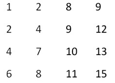
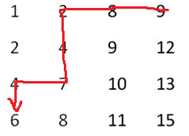

# 行列递增矩阵的查找

## 题目描述
在一个m行n列二维数组中，每一行都按照从左到右递增的顺序排序，每一列都按照从上到下递增的顺序排序。请完成一个函数，输入这样的一个二维数组和一个整数，判断数组中是否含有该整数。

例如下面的二维数组就是每行、每列都递增排序。如果在这个数组中查找数字6，则返回true；如果查找数字5，由于数组不含有该数字，则返回false。




## 分析与解法
### 解法一、分治法

这种行和列分别递增的矩阵，有一个专有名词叫做杨氏矩阵，由剑桥大学数学家杨表在1900年推提出，在这个矩阵中的查找，俗称杨氏矩阵查找。

以查找数字6为例，因为矩阵的行和列都是递增的，所以整个矩阵的对角线上的数字也是递增的，故我们可以在对角线上进行二分查找，如果要找的数是6介于对角线上相邻的两个数4、10，可以排除掉左上和右下的两个矩形，而在左下和右上的两个矩形继续递归查找，如下图所示：  


### 解法二、定位法
首先直接定位到最右上角的元素，再配以二分查找，比要找的数（6）大就往左走，比要找数（6）的小就往下走，直到找到要找的数字（6）为止，这个方法的时间复杂度O（m+n）。如下图所示：  


关键代码如下所示：  
```c
#define ROW 4
#define COL 4

bool YoungMatrix(int array[][COL], int searchKey){
	int i = 0, j = COL - 1;
	int var = array[i][j];
	while (true){
		if (var == searchKey)
			return true;
		else if (var < searchKey && i < ROW - 1)
			var = array[++i][j];
		else if (var > searchKey && j > 0)
			var = array[i][--j];
		else
			return false;
	}
}
```

## 举一反三

1、给定 n×n 的实数矩阵，每行和每列都是递增的，求这 n^2 个数的中位数。

2、我们已经知道杨氏矩阵的每行的元素从左到右单调递增，每列的元素从上到下也单调递增的矩阵。那么，如果给定从1-n这n个数，我们可以构成多少个杨氏矩阵呢？

例如n = 4的时候，我们可以构成1行4列的矩阵：

1 2 3 4

2个2行2列的矩阵:

1 2

3 4

和

1 3

2 4

还有一个4行1列的矩阵

1

2

3

4

因此输出4。
