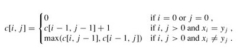
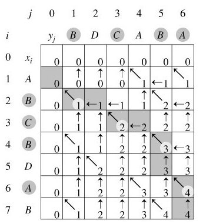

# 最长公共子序列

## 问题描述  

什么是最长公共子序列呢?好比一个数列 S，如果分别是两个或多个已知数列的子序列，且是所有符合此条件序列中最长的，则S 称为已知序列的最长公共子序列。  

举个例子，如：有两条随机序列，如 1 3 4 5 5 ，and 2 4 5 5 7 6，则它们的最长公共子序列便是：4 5 5。  

## 分析与解法

### 解法一 

最容易想到的算法是穷举搜索法，即对X的每一个子序列，检查它是否也是Y的子序列，从而确定它是否为X和Y的公共子序列，并且在检查过程中选出最长的公共子序列。X和Y的所有子序列都检查过后即可求出X和Y的最长公共子序列。X的一个子序列相应于下标序列{1, 2, …, m}的一个子序列，因此，X共有2m个不同子序列（Y亦如此，如为2^n），从而穷举搜索法需要指数时间（2^m * 2^n）。  

### 解法二 

事实上，最长公共子序列问题也有最优子结构性质。  

记：  
  Xi=﹤x1，⋯，xi﹥即X序列的前i个字符 (1≤i≤m)（前缀）  
 
  Yj=﹤y1，⋯，yj﹥即Y序列的前j个字符 (1≤j≤n)（前缀）  

假定Z=﹤z1，⋯，zk﹥∈LCS(X , Y) 。 

* 若**xm=yn**（最后一个字符相同），则不难用反证法证明：该字符必是X与Y的任一最长公共子序列Z（设长度为k）的最后一个字符，即有zk = xm = yn 且显然有Zk-1∈LCS(Xm-1 , Yn-1)即Z的前缀**Zk-1是Xm-1与Yn-1的最长公共子序列。**此时，问题化归成求Xm-1与Yn-1的LCS（LCS(X , Y)的长度等于LCS(Xm-1 , Yn-1)的长度加1）。  

* 若**xm≠yn**，则亦不难用反证法证明：要么Z∈LCS(Xm-1, Y)，要么Z∈LCS(X , Yn-1)。由于zk≠xm与zk≠yn其中至少有一个必成立，若zk≠xm则有Z∈LCS(Xm-1 , Y)，类似的，若zk≠yn 则有Z∈LCS(X , Yn-1)。此时，问题化归成求Xm-1与Y的LCS及X与Yn-1的LCS。LCS(X , Y)的长度为：max{LCS(Xm-1 , Y)的长度, LCS(X , Yn-1)的长度}。  

由于上述当**xm≠yn**的情况中，求LCS(Xm-1 , Y)的长度与LCS(X , Yn-1)的长度，这两个问题不是相互独立的：两者都需要求LCS(Xm-1，Yn-1)的长度。另外两个序列的LCS中包含了两个序列的前缀的LCS，故问题具有最优子结构性质考虑用动态规划法。  

也就是说，解决这个LCS问题，你要求三个方面的东西：1、LCS(Xm-1，Yn-1)+1；2、LCS(Xm-1，Y)，LCS(X，Yn-1)；3、max{LCS(Xm-1, Y)，LCS(X, Yn-1)}。  

#### 最长公共子序列的结构

最长公共子序列的结构有如下表示：  

设序列X=< x1, x2, …, xm >和Y=< y1, y2, …, yn >的一个最长公共子序列Z=< z1, z2, …, zk >，则：

1. 若xm=yn，则zk=xm=yn且Zk-1是Xm-1和Yn-1的最长公共子序列；  
2. 若xm≠yn且zk≠xm ，则Z是Xm-1和Y的最长公共子序列；  
3. 若xm≠yn且zk≠yn ，则Z是X和Yn-1的最长公共子序列。  
其中Xm-1 = < x1, x2, …, xm-1 >，Yn-1 = < y1, y2, …, yn-1 >，Zk-1 = < z1, z2, …, zk-1 >。

#### 子问题的递归结构

由最长公共子序列问题的最优子结构性质可知，要找出X=< x1, x2, …, xm >和Y=< y1, y2, …, yn >的最长公共子序列，可按以下方式递归地进行：当xm=yn时，找出Xm-1和Yn-1的最长公共子序列，然后在其尾部加上xm(=yn)即可得X和Y的一个最长公共子序列。当xm≠yn时，必须解两个子问题，即找出Xm-1和Y的一个最长公共子序列及X和Yn-1的一个最长公共子序列。这两个公共子序列中较长者即为X和Y的一个最长公共子序列。  
  
由此递归结构容易看到最长公共子序列问题具有子问题重叠性质。例如，在计算X和Y的最长公共子序列时，可能要计算出X和Yn-1及Xm-1和Y的最长公共子序列。而这两个子问题都包含一个公共子问题，即计算Xm-1和Yn-1的最长公共子序列。

与矩阵连乘积最优计算次序问题类似，我们来建立子问题的最优值的递归关系。用c[i,j]记录序列Xi和Yj的最长公共子序列的长度。其中Xi=< x1, x2, …, xi >，Yj=< y1, y2, …, yj >。当i=0或j=0时，空序列是Xi和Yj的最长公共子序列，故c[i,j]=0。其他情况下，由定理可建立递归关系如下：



#### 计算最优值

直接利用上节节末的递归式，我们将很容易就能写出一个计算c[i,j]的递归算法，但其计算时间是随输入长度指数增长的。由于在所考虑的子问题空间中，总共只有θ(m*n)个不同的子问题，因此，用动态规划算法自底向上地计算最优值能提高算法的效率。  

计算最长公共子序列长度的动态规划算法LCS_LENGTH(X,Y)以序列X=< x1, x2, …, xm >和Y=< y1, y2, …, yn >作为输入。输出两个数组c[0..m ,0..n]和b[1..m ,1..n]。其中c[i,j]存储Xi与Yj的最长公共子序列的长度，b[i,j]记录指示c[i,j]的值是由哪一个子问题的解达到的，这在构造最长公共子序列时要用到。最后，X和Y的最长公共子序列的长度记录于c[m,n]中。  

```
Procedure LCS_LENGTH(X,Y);  
begin  
  m:=length[X];  
  n:=length[Y];  
  for i:=1 to m do c[i,0]:=0;  
  for j:=1 to n do c[0,j]:=0;  
  for i:=1 to m do  
    for j:=1 to n do  
      if x[i]=y[j] then  
        begin  
          c[i,j]:=c[i-1,j-1]+1;  
          b[i,j]:="↖";  
        end  
      else if c[i-1,j]≥c[i,j-1] then  
        begin  
          c[i,j]:=c[i-1,j];  
          b[i,j]:="↑";  
        end  
      else  
        begin  
          c[i,j]:=c[i,j-1];  
          b[i,j]:="←"  
        end;  
  return(c,b);  
end;   
```

由算法LCS_LENGTH计算得到的数组b可用于快速构造序列X=< x1, x2, …, xm >和Y=< y1, y2, …, yn >的最长公共子序列。首先从b[m,n]开始，沿着其中的箭头所指的方向在数组b中搜索。  

* 当b[i,j]中遇到"↖"时（*意味着xi=yi是LCS的一个元素*），表示Xi与Yj的最长公共子序列是由Xi-1与Yj-1的最长公共子序列在尾部加上xi得到的子序列；  

* 当b[i,j]中遇到"↑"时，表示Xi与Yj的最长公共子序列和Xi-1与Yj的最长公共子序列相同；  

* 当b[i,j]中遇到"←"时，表示Xi与Yj的最长公共子序列和Xi与Yj-1的最长公共子序列相同。  

这种方法是按照反序来找LCS的每一个元素的。由于每个数组单元的计算耗费Ο(1)时间，算法LCS_LENGTH耗时Ο(mn)。  

#### 构造最长公共子序列

下面的算法LCS(b,X,i,j)实现根据b的内容打印出Xi与Yj的最长公共子序列。通过算法的调用LCS(b,X,length[X],length[Y])，便可打印出序列X和Y的最长公共子序列。  

```
Procedure LCS(b,X,i,j);  
begin  
  if i=0 or j=0 then return;  
  if b[i,j]="↖" then  
    begin  
      LCS(b,X,i-1,j-1);  
      print(x[i]); {打印x[i]}  
    end  
  else if b[i,j]="↑" then LCS(b,X,i-1,j)   
                      else LCS(b,X,i,j-1);  
end;   
```

在算法LCS中，每一次的递归调用使i或j减1，因此算法的计算时间为O(m+n)。  

例如，设所给的两个序列为X=< A，B，C，B，D，A，B >和Y=< B，D，C，A，B，A >。由算法LCS_LENGTH和LCS计算出的结果如下图所示：  



* 我来说明下此图（参考算法导论）*。在序列X={A，B，C，B，D，A，B}和 Y={B，D，C，A，B，A}上，由LCS_LENGTH计算出的表c和b。第i行和第j列中的方块包含了c[i，j]的值以及指向b[i，j]的箭头。在c[7,6]的项4，表的右下角为X和Y的一个LCS < B，C，B，A >的长度。对于i，j>0，项c[i，j]仅依赖于是否有xi=yi，及项c[i-1，j]和c[i，j-1]的值，这几个项都在c[i，j]之前计算。为了重构一个LCS的元素，从右下角开始跟踪b[i，j]的箭头即可，这条路径标示为阴影，这条路径上的每一个“↖”对应于一个使xi=yi为一个LCS的成员的项（高亮标示）。  
  所以根据上述图所示的结果，程序将最终输出：“B C B A”。  

#### 算法的改进
  对于一个具体问题，按照一般的算法设计策略设计出的算法，往往在算法的时间和空间需求上还可以改进。这种改进，通常是利用具体问题的一些特殊性。  

例如，在算法LCS_LENGTH和LCS中，可进一步将数组b省去。事实上，数组元素c[i,j]的值仅由c[i-1,j-1]，c[i-1,j]和c[i,j-1]三个值之一确定，而数组元素b[i,j]也只是用来指示c[i,j]究竟由哪个值确定。因此，在算法LCS中，我们可以不借助于数组b而借助于数组c本身临时判断c[i,j]的值是由c[i-1,j-1]，c[i-1,j]和c[i,j-1]中哪一个数值元素所确定，代价是Ο(1)时间。既然b对于算法LCS不是必要的，那么算法LCS_LENGTH便不必保存它。这一来，可节省θ(mn)的空间，而LCS_LENGTH和LCS所需要的时间分别仍然是Ο(mn)和Ο(m+n)。不过，由于数组c仍需要Ο(mn)的空间，因此这里所作的改进，只是在空间复杂性的常数因子上的改进。  

另外，如果只需要计算最长公共子序列的长度，则算法的空间需求还可大大减少。事实上，在计算c[i,j]时，只用到数组c的第i行和第i-1行。因此，只要用2行的数组空间就可以计算出最长公共子序列的长度。更进一步的分析还可将空间需求减至min(m, n)。  

#### 编码实现LCS问题

动态规划的一个计算最长公共子序列的方法如下，以两个序列 X、Y 为例子：

设有二维数组 f[i][j] 表示 X 的 i 位和 Y 的 j 位之前的最长公共子序列的长度，则有：

  f[1][1] = same(1,1)  
  f[i][j] = max{f[i − 1][j − 1] +same(i,j), f[i − 1][j] ,f[i][j − 1]}  

其中，same(a,b)当 X 的第 a 位与 Y 的第 b 位完全相同时为“1”，否则为“0”。  

此时，f[i][j]中最大的数便是 X 和 Y 的最长公共子序列的长度，依据该数组回溯，便可找出最长公共子序列。  

该算法的空间、时间复杂度均为O(n2)，经过优化后，空间复杂度可为O(n)，时间复杂度为O(nlogn)。  

## 举一反三

1、最长递增子序列LIS（Longest Increasing Subsequence）

给定一个长度为N的数组，找出一个最长的单调自增子序列（不一定连续，但是顺序不能乱）。例如：给定一个长度为6的数组A{5， 6， 7， 1， 2， 8}，则其最长的单调递增子序列为{5，6，7，8}，长度为4。

分析：其实此LIS问题可以转换成最长公子序列问题，为什么呢？

 - 原数组为A {5， 6， 7， 1， 2， 8}
 - 排序后：A‘{1， 2， 5， 6， 7， 8}

因为，原数组A的子序列顺序保持不变，而且排序后A‘本身就是递增的，这样，就保证了两序列的最长公共子序列的递增特性。如此，若想求数组A的最长递增子序列，其实就是求数组A与它的排序数组A‘的最长公共子序列。

此外，本题也可以使用动态规划来求解，读者可以继续思考。
