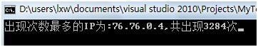

##第三部分、提取出某日访问百度次数最多的那个IP

问题描述：海量日志数据，提取出某日访问百度次数最多的那个IP。

方法: 计数法

假设一天之内某个IP访问百度的次数不超过40亿次,则访问次数可以用unsigned int表示。用数组统计出每个IP地址出现的 次数, 即可得到访问次数最大的IP地址。

IP地址是32位的二进制数,所以共有N=2^32个不同的IP地址，创建一个大小为N的的数组count，即可统计出每个IP的访问次数,而sizeof(count) == 4G*4 = 16G,远远超过了32位计算机所支持的内存大小,因此不能直接创建这个数组.下面采用划分法解决这个问题。

假设允许使用的内存是512M,  512M/4=128M 即512M内存可以统计128M个不同的IP地址的访问次数。而N/128M = 4G/128M = 32 ,所以只要把IP地址划分成32个不同的区间,分别统计出每个区间中访问次数最大的IP,然后就可以计算出所有IP地址中访问次数最大的IP了.

因为2^5=32, 所以可以把IP地址的最高5位作为区间编号,剩下的27为作为区间内的值,建立32个临时文件,代表32个区间,把相同区间的IP地址保存到同一临时文件中.

例如:

IP1=0x1f4e2342

IP1的高5位是id1  =  IP1 >> 27 = 0x11 = 3

IP1的其余27位是value1  =  IP1 & 0x07ffffff = 0x074e2342

所以把 value1 保存在tmp3文件中.

由id1和value1可以还原成IP1, 即 IP1 =(id1 << 27) | value1

按照上面的方法可以得到32个临时文件,每个临时文件中的IP地址的取值范围属于[0-128M),因此可以统计出每个IP地址的访问次数.从而找到访问次数最大的IP地址

程序源码:

```cpp
#include <fstream>  
#include <iostream>  
#include <ctime>  
  
using namespace std;  
#define N 32           //临时文件数  
  
#define ID(x)  (x>>27)                 //x对应的文件编号  
#define VALUE(x) (x&0x07ffffff)        //x在文件中保存的值  
#define MAKE_IP(x,y)  ((x<<27)|y)      //由文件编号和值得到IP地址.  
  
#define MEM_SIZE  128*1024*1024       //需分配内存的大小为 MEM_SIZE*sizeof(unsigned)     
  
char* data_path="D:/test/ip.dat";        //ip数据  

//产生n个随机IP地址  
void make_data(const int& n)         
{
    ofstream out(data_path,ios::out|ios::binary);  
    srand((unsigned)(time(NULL)));  
    if (out)  
    {  
        for (int i=0; i<n; ++i)
        {  
            unsigned val=unsigned(rand());           
            val = (val<<24)|val;              //产生unsigned类型的随机数  
 
            out.write((char *)&val,sizeof (unsigned));  
        }  
    }  
}  
 
//找到访问次数最大的ip地址  
int main()  
{  
    //make_data(100);     //   
    make_data(100000000);       //产生测试用的IP数据  
    fstream arr[N];  
     
    for (int i=0; i<N; ++i)                 //创建N个临时文件  
    {  
        char tmp_path[128];     //临时文件路径  
        sprintf(tmp_path,"D:/test/tmp%d.dat",i);  
        arr[i].open(tmp_path, ios::trunc|ios::in|ios::out|ios::binary);  //打开第i个文件  

        if( !arr[i])  
        {  
            cout<<"open file"<<i<<"error"<<endl;  
        }  
    }  
 
    ifstream infile(data_path,ios::in|ios::binary);   //读入测试用的IP数据  
    unsigned data;  
 
    while(infile.read((char*)(&data), sizeof(data)))  
    {  
        unsigned val=VALUE(data);  
        int key=ID(data);  
        arr[ID(data)].write((char*)(&val), sizeof(val));           //保存到临时文件件中  
    }  
 
    for(unsigned i=0; i<N; ++i)  
    {  
        arr[i].seekg(0);  
    }  
    unsigned max_ip = 0;    //出现次数最多的ip地址  
    unsigned max_times = 0;     //最大只出现的次数  
 
    //分配512M内存,用于统计每个数出现的次数  
    unsigned *count = new unsigned[MEM_SIZE];    
 
    for (unsigned i=0; i<N; ++i)  
    {  
        memset(count, 0, sizeof(unsigned)*MEM_SIZE);  
 
        //统计每个临时文件件中不同数字出现的次数  
        unsigned data;  
        while(arr[i].read((char*)(&data), sizeof(unsigned)))       
        {  
            ++count[data];  
        }  
         
        //找出出现次数最多的IP地址  
        for(unsigned j=0; j<MEM_SIZE; ++j)                             
        {  
            if(max_times<count[j])             
            {  
                max_times = count[j];  
                max_ip = MAKE_IP(i,j);        // 恢复成原ip地址.  
            }  
        }  
    }  
    delete[] count; 
    unsigned char *result=(unsigned char *)(&max_ip);  
    printf("出现次数最多的IP为:%d.%d.%d.%d,共出现%d次",   
           result[0], result[1], result[2], result[3], max_times);  
}
```

执行结果：



--__luuillu__。
