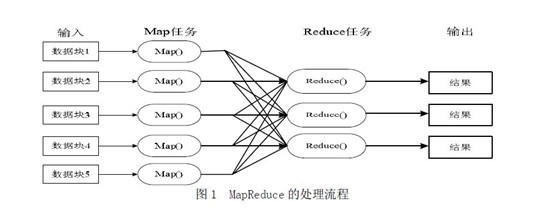
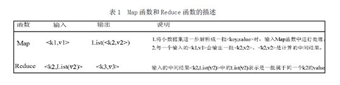
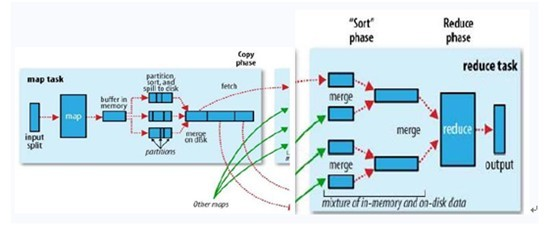

# 分布式处理之MapReduce

## 方法介绍

MapReduce是一种计算模型，简单的说就是将大批量的工作（数据）分解（MAP）执行，然后再将结果合并成最终结果（REDUCE）。这样做的好处是可以在任务被分解后，可以通过大量机器进行并行计算，减少整个操作的时间。但如果你要我再通俗点介绍，那么，说白了，Mapreduce的原理就是一个归并排序。

适用范围：数据量大，但是数据种类小可以放入内存

基本原理及要点：将数据交给不同的机器去处理，数据划分，结果归约。

### 基础架构
想读懂此文，读者必须先要明确以下几点，以作为阅读后续内容的基础知识储备：

1. MapReduce是一种模式。
2. Hadoop是一种框架。
3. Hadoop是一个实现了MapReduce模式的开源的分布式并行编程框架。

所以，你现在，知道了什么是MapReduce，什么是hadoop，以及这两者之间最简单的联系，而本文的主旨即是，一句话概括：**在hadoop的框架上采取MapReduce的模式处理海量数据**。下面，咱们可以依次深入学习和了解MapReduce和hadoop这两个东西了。

### MapReduce模式

前面说了，MapReduce是一种模式，一种什么模式呢?一种云计算的核心计算模式，一种分布式运算技术，也是简化的分布式编程模式，它主要用于解决问题的程序开发模型，也是开发人员拆解问题的方法。

Ok，光说不上图，没用。如下图所示，MapReduce模式的主要思想是将自动分割要执行的问题（例如程序）拆解成Map（映射）和Reduce（化简）的方式，流程图如下图1所示：  

在数据被分割后通过Map函数的程序将数据映射成不同的区块，分配给计算机机群处理达到分布式运算的效果，在通过Reduce 函数的程序将结果汇整，从而输出开发者需要的结果。

MapReduce借鉴了函数式程序设计语言的设计思想，其软件实现是指定一个Map函数，把键值对(key/value)映射成新的键值对(key/value)，形成一系列中间结果形式的key/value 对，然后把它们传给Reduce(规约)函数，把具有相同中间形式key的value合并在一起。Map和Reduce函数具有一定的关联性。函数描述如表1 所示：  

MapReduce致力于解决大规模数据处理的问题，因此在设计之初就考虑了数据的局部性原理，利用局部性原理将整个问题分而治之。MapReduce集群由普通PC机构成，为无共享式架构。在处理之前，将数据集分布至各个节点。处理时，每个节点就近读取本地存储的数据处理（map），将处理后的数据进行合并（combine）、排序（shuffle and sort）后再分发（至reduce节点），避免了大量数据的传输，提高了处理效率。无共享式架构的另一个好处是配合复制（replication）策略，集群可以具有良好的容错性，一部分节点的down机对集群的正常工作不会造成影响。

ok，你可以再简单看看下副图，整幅图是有关hadoop的作业调优参数及原理，图的左边是MapTask运行示意图，右边是ReduceTask运行示意图：  

如上图所示，其中map阶段，当map task开始运算，并产生中间数据后并非直接而简单的写入磁盘，它首先利用内存buffer来对已经产生的buffer进行缓存，并在内存buffer中进行一些预排序来优化整个map的性能。而上图右边的reduce阶段则经历了三个阶段，分别Copy->Sort->reduce。我们能明显的看出，其中的Sort是采用的归并排序，即merge sort。

## 问题实例

1. The canonical example application of MapReduce is a process to count the appearances of each different word in a set of documents:
2. 海量数据分布在100台电脑中，想个办法高效统计出这批数据的TOP10。
3. 一共有N个机器，每个机器上有N个数。每个机器最多存O(N)个数并对它们操作。如何找到N^2个数的中数(median)？
