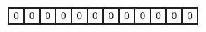
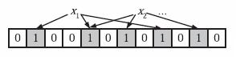
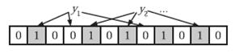

# Bloom Filter

## 方法介绍

### 一、什么是Bloom Filter

Bloom Filter，被译作称布隆过滤器，是一种空间效率很高的随机数据结构，Bloom filter可以看做是对bit-map的扩展,它的原理是：
 - 当一个元素被加入集合时，通过K个Hash函数将这个元素映射成一个位阵列（Bit array）中的K个点，把它们置为1**。检索时，我们只要看看这些点是不是都是1就（大约）知道集合中有没有它了：
- 如果这些点有任何一个0，则被检索元素一定不在；
- 如果都是1，则被检索元素很可能在。

其可以用来实现数据字典，进行数据的判重，或者集合求交集。

但Bloom Filter的这种高效是有一定代价的：在判断一个元素是否属于某个集合时，有可能会把不属于这个集合的元素误认为属于这个集合（false positive）。因此，Bloom Filter不适合那些“零错误”的应用场合。而在能容忍低错误率的应用场合下，Bloom Filter通过极少的错误换取了存储空间的极大节省。

#### 1.1、集合表示和元素查询

下面我们具体来看Bloom Filter是如何用位数组表示集合的。初始状态时，Bloom Filter是一个包含m位的位数组，每一位都置为0。

为了表达S={x1, x2,…,xn}这样一个n个元素的集合，Bloom Filter使用k个相互独立的哈希函数（Hash Function），它们分别将集合中的每个元素映射到{1,…,m}的范围中。对任意一个元素x，第i个哈希函数映射的位置hi(x)就会被置为1（1≤i≤k）。注意，如果一个位置多次被置为1，那么只有第一次会起作用，后面几次将没有任何效果。在下图中，k=3，且有两个哈希函数选中同一个位置（从左边数第五位，即第二个“1“处）。

在判断y是否属于这个集合时，我们对y应用k次哈希函数，如果所有hi(y)的位置都是1（1≤i≤k），那么我们就认为y是集合中的元素，否则就认为y不是集合中的元素。下图中y1就不是集合中的元素（因为y1有一处指向了“0”位）。y2或者属于这个集合，或者刚好是一个false positive。

#### 1.2、错误率估计

前面我们已经提到了，Bloom Filter在判断一个元素是否属于它表示的集合时会有一定的错误率（false positive rate），下面我们就来估计错误率的大小。在估计之前为了简化模型，我们假设kn<m且各个哈希函数是完全随机的。当集合S={x1, x2,…,xn}的所有元素都被k个哈希函数映射到m位的位数组中时，这个位数组中某一位还是0的概率是：

^{kn}\\approx e^{-kn/m})

其中1/m表示任意一个哈希函数选中这一位的概率（前提是哈希函数是完全随机的），(1-1/m)表示哈希一次没有选中这一位的概率。要把S完全映射到位数组中，需要做kn次哈希。某一位还是0意味着kn次哈希都没有选中它，因此这个概率就是（1-1/m）的kn次方。令p = e-kn/m是为了简化运算，这里用到了计算e时常用的近似：

^{-x}=e)

令ρ为位数组中0的比例，则ρ的数学期望E(ρ)= p’。在ρ已知的情况下，要求的错误率（false positive rate）为：

^k\\approx(1-p')^k\\approx(1-p)^k)

(1-ρ)为位数组中1的比例，(1-ρ)k就表示k次哈希都刚好选中1的区域，即false positive rate。上式中第二步近似在前面已经提到了，现在来看第一步近似。p’只是ρ的数学期望，在实际中ρ的值有可能偏离它的数学期望值。M. Mitzenmacher已经证明[2] ，位数组中0的比例非常集中地分布在它的数学期望值的附近。因此，第一步的近似得以成立。分别将p和p’代入上式中，得：

^{kn}\\right)^k=(1-p')^k)

^k=(1-p)^k)

相比p’和f’，使用p和f通常在分析中更为方便。

#### 1.3、最优的哈希函数个数

既然Bloom Filter要靠多个哈希函数将集合映射到位数组中，那么应该选择几个哈希函数才能使元素查询时的错误率降到最低呢？这里有两个互斥的理由：如果哈希函数的个数多，那么在对一个不属于集合的元素进行查询时得到0的概率就大；但另一方面，如果哈希函数的个数少，那么位数组中的0就多。为了得到最优的哈希函数个数，我们需要根据上一小节中的错误率公式进行计算。

先用p和f进行计算。注意到f = exp(k ln(1 − e−kn/m))，我们令g = k ln(1 − e−kn/m)，只要让g取到最小，f自然也取到最小。由于p = e-kn/m，我们可以将g写成

\\ln(1-p))

根据对称性法则可以很容易看出当p = 1/2，也就是k = ln2· (m/n)时，g取得最小值。在这种情况下，最小错误率f等于(1/2)k≈ (0.6185)m/n。另外，注意到p是位数组中某一位仍是0的概率，所以p = 1/2对应着位数组中0和1各一半。换句话说，要想保持错误率低，最好让位数组有一半还空着。

需要强调的一点是，p = 1/2时错误率最小这个结果并不依赖于近似值p和f。同样对于f’ = exp(k ln(1 − (1 − 1/m)kn))，g’ = k ln(1 − (1 − 1/m)kn)，p’ = (1 − 1/m)kn，我们可以将g’写成

}\\ln(p')\\ln(1-p'))

同样根据对称性法则可以得到当p’ = 1/2时，g’取得最小值。

#### 1.4、位数组的大小

下面我们来看看，在不超过一定错误率的情况下，Bloom Filter至少需要多少位才能表示全集中任意n个元素的集合。假设全集中共有u个元素，允许的最大错误率为є，下面我们来求位数组的位数m。

假设X为全集中任取n个元素的集合，F(X)是表示X的位数组。那么对于集合X中任意一个元素x，在s = F(X)中查询x都能得到肯定的结果，即s能够接受x。显然，由于Bloom Filter引入了错误，s能够接受的不仅仅是X中的元素，它还能够є (u - n)个false positive。因此，对于一个确定的位数组来说，它能够接受总共n + є (u - n)个元素。在n + є (u - n)个元素中，s真正表示的只有其中n个，所以一个确定的位数组可以表示

}^n)

个集合。m位的位数组共有2m个不同的组合，进而可以推出，m位的位数组可以表示

}^n)

个集合。全集中n个元素的集合总共有

个，因此要让m位的位数组能够表示所有n个元素的集合，必须有

}^n\\geq C_{u}^n)

即：

}^n}\\approx\\log_2\\frac{C_{u}^n}{C_{\\epsilon u}^n}\\geq\\log_2\\epsilon^{-n}=n\\log_2(1/\\epsilon))

上式中的近似前提是n和єu相比很小，这也是实际情况中常常发生的。根据上式，我们得出结论：在错误率不大于є的情况下，m至少要等于n log2(1/є)才能表示任意n个元素的集合。

上一小节中我们曾算出当k = ln2· (m/n)时错误率f最小，这时f = (1/2)k= (1/2)mln2 / n。现在令f≤є，可以推出

}{\\ln 2}=n\\log_2\\log_2(1/\\epsilon))

这个结果比前面我们算得的下界n log2(1/є)大了log2e≈ 1.44倍。这说明在哈希函数的个数取到最优时，要让错误率不超过є，m至少需要取到最小值的1.44倍。

## 问题实例

**1、给你A,B两个文件，各存放50亿条URL，每条URL占用64字节，内存限制是4G，让你找出A,B文件共同的URL。如果是三个乃至n个文件呢？**

**分析**：如果允许有一定的错误率，可以使用Bloom filter，4G内存大概可以表示340亿bit。将其中一个文件中的url使用Bloom filter映射为这340亿bit，然后挨个读取另外一个文件的url，检查是否与Bloom filter，如果是，那么该url应该是共同的url（注意会有一定的错误率）。”
