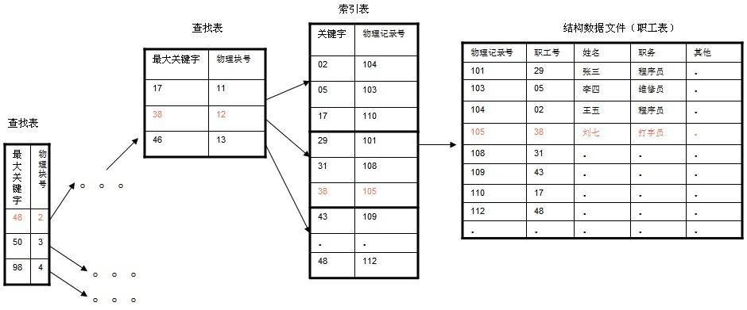

#### 4.B+-tree

*B+-tree*：是应文件系统所需而产生的一种B-tree的变形树。

一棵m阶的B+树和m阶的B树的异同点在于：

1. 有n棵子树的结点中含有n-1 个关键字； (与B 树n棵子树有n-1个关键字 保持一致，参照：[http://en.wikipedia.org/wiki/B%2B_tree#Overview](http://en.wikipedia.org/wiki/B%2B_tree#Overview)，而下面**B+树的图可能有问题**，请读者注意)
2. 所有的叶子结点中包含了全部关键字的信息，及指向含有这些关键字记录的指针，且叶子结点本身依关键字的大小自小而大的顺序链接。 (而B 树的叶子节点并没有包括全部需要查找的信息)
3. **所有的非终端结点可以看成是索引部分**，结点中仅含有其子树根结点中最大（或最小）关键字。 (而B 树的非终节点也包含需要查找的有效信息)

  

a) 为什么说B+-tree比B 树更适合实际应用中操作系统的文件索引和数据库索引？ 

1. B+-tree的磁盘读写代价更低
B+-tree的内部结点并没有指向关键字具体信息的指针。因此其内部结点相对B 树更小。如果把所有同一内部结点的关键字存放在同一盘块中，那么盘块所能容纳的关键字数量也越多。一次性读入内存中的需要查找的关键字也就越多。相对来说IO读写次数也就降低了。

	举个例子，假设磁盘中的一个盘块容纳16bytes，而一个关键字2bytes，一个关键字具体信息指针2bytes。一棵9阶B-tree(一个结点最多8个关键字)的内部结点需要2个盘快。而B+ 树内部结点只需要1个盘快。当需要把内部结点读入内存中的时候，B 树就比B+ 树多一次盘块查找时间(在磁盘中就是盘片旋转的时间)。

2. B+-tree的查询效率更加稳定  
由于非终结点并不是最终指向文件内容的结点，而只是叶子结点中关键字的索引。所以任何关键字的查找必须走一条从根结点到叶子结点的路。所有关键字查询的路径长度相同，导致每一个数据的查询效率相当。

	读者点评  
	本文评论下第149楼，fanyy1991针对上文所说的两点，道：个人觉得这两个原因都不是主要原因。数据库索引采用B+树的主要原因是 B树在提高了磁盘IO性能的同时并没有解决元素遍历的效率低下的问题。正是为了解决这个问题，B+树应运而生。B+树只要遍历叶子节点就可以实现整棵树的遍历。而且在数据库中基于范围的查询是非常频繁的，而B树不支持这样的操作（或者说效率太低）。

b)  B+-tree的应用: VSAM(虚拟存储存取法)文件(来源论文 *the ubiquitous Btree* 作者：D COMER - 1979 )

#### 5.B\*-tree

B\*-tree是B+-tree的变体，在B+树的基础上(所有的叶子结点中包含了全部关键字的信息，及指向含有这些关键字记录的指针)，B\*树中非根和非叶子结点再增加指向兄弟的指针；B\*树定义了非叶子结点关键字个数至少为(2/3)\*M，即块的最低使用率为2/3（代替B+树的1/2）。给出了一个简单实例，如下图所示：

B+树的分裂：当一个结点满时，分配一个新的结点，并将原结点中1/2的数据复制到新结点，最后在父结点中增加新结点的指针；B+树的分裂只影响原结点和父结点，而不会影响兄弟结点，所以它不需要指向兄弟的指针。

B\*树的分裂：当一个结点满时，如果它的下一个兄弟结点未满，那么将一部分数据移到兄弟结点中，再在原结点插入关键字，最后修改父结点中兄弟结点的关键字（因为兄弟结点的关键字范围改变了）；如果兄弟也满了，则在原结点与兄弟结点之间增加新结点，并各复制1/3的数据到新结点，最后在父结点增加新结点的指针。

所以，B\*树分配新结点的概率比B+树要低，空间使用率更高；

#### 7.总结

通过以上介绍，大致将B树，B+树，B*树总结如下：

* B树：有序数组+平衡多叉树；
* B+树：有序数组链表+平衡多叉树；
* B\*树：一棵丰满的B+树。

在大规模数据存储的文件系统中，B~tree系列数据结构，起着很重要的作用，对于存储不同的数据，节点相关的信息也是有所不同，这里根据自己的理解，画的一个查找以职工号为关键字，职工号为38的记录的简单示意图。(这里假设每个物理块容纳3个索引，磁盘的I/O操作的基本单位是块（block),磁盘访问很费时，采用B+树有效的减少了访问磁盘的次数。）

对于像MySQL，DB2，Oracle等数据库中的索引结构得有较深入的了解才行，建议去找一些B 树相关的开源代码研究。

  

走进搜索引擎的作者梁斌老师针对B树、B+树给出了他的意见（为了真实性，特引用其原话，未作任何改动）： “B+树还有一个最大的好处，方便扫库，B树必须用中序遍历的方法按序扫库，而B+树直接从叶子结点挨个扫一遍就完了，B+树支持range-query非常方便，而B树不支持。这是数据库选用B+树的最主要原因。

比如要查 5-10之间的，B+树一把到5这个标记，再一把到10，然后串起来就行了，B树就非常麻烦。B树的好处，就是成功查询特别有利，因为树的高度总体要比B+树矮。不成功的情况下，B树也比B+树稍稍占一点点便宜。

B树比如你的例子中查，17的话，一把就得到结果了，有很多基于频率的搜索是选用B树，越频繁query的结点越往根上走，前提是需要对query做统计，而且要对key做一些变化。

另外B树也好B+树也好，根或者上面几层因为被反复query，所以这几块基本都在内存中，不会出现读磁盘IO，一般已启动的时候，就会主动换入内存。”非常感谢。

> "mysql 底层存储是用B+树实现的，知道为什么么。内存中B+树是没有优势的，但是一到磁盘，B+树的威力就出来了"。——Bucket Li
