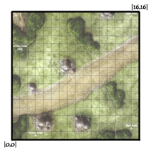
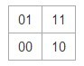
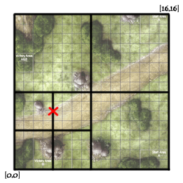
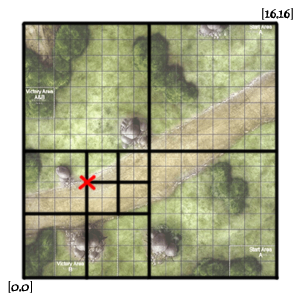
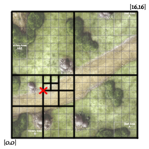

## 附近地点搜索

### 题目详情

找一个点集中与给定点距离最近的点，同时，给定的二维点集都是固定的，查询可能有很多次，时间复杂度O(n)无法接受，请设计数据结构和相应的算法。

### 分析与解法

此题是去年微软的三面题，类似于一朋友@陈利人出的这题：附近地点搜索，就是搜索用户附近有哪些地点。随着GPS和带有GPS功能的移动设备的普及，附近地点搜索也变得炙手可热。在庞大的地理数据库中搜索地点，索引是很重要的。但是，我们的需求是搜索附近地点，例如，坐标(39.91, 116.37)附近500米内有什么餐馆，那么让你来设计，该怎么做？

#### 解法一：R树二维搜索

假定只允许你初中数学知识，那么你可能建一个X-Y坐标系，即以坐标(39.91, 116.37)为圆心，以500的长度为半径，画一个园，然后一个一个坐标点的去查找。此法看似可行，但复杂度可想而知，即便你自以为聪明的说把整个平面划分为四个象限，一个一个象限的查找，此举虽然优化程度不够，但也说明你一步步想到点子上去了。

即不一个一个坐标点的查找，而是一个一个区域的查找，相对来说，其平均查找速度和效率会显著提升。如此，便自然而然的想到了有没有一种一次查找定位于一个区域的数据结构呢？

若看过博客内之前介绍R树的[这篇文章](http://blog.csdn.net/v_JULY_v/article/details/6530142#t2)的读者立马便能意识到，R树就是解决这个区域查找继而不断缩小规模的问题。特直接引用原文：

>**R树的数据结构**
>
R树是B树在高维空间的扩展，是一棵平衡树。每个R树的叶子结点包含了多个指向不同数据的指针，这些数据可以是存放在硬盘中的，也可以是存在内存中。根据R树的这种数据结构，当我们需要进行一个高维空间查询时，我们只需要遍历少数几个叶子结点所包含的指针，查看这些指针指向的数据是否满足要求即可。这种方式使我们不必遍历所有数据即可获得答案，效率显著提高。下图1是R树的一个简单实例：

>我们在上面说过，R树运用了空间分割的理念，这种理念是如何实现的呢？R树采用了一种称为MBR(Minimal Bounding Rectangle)的方法，在此我把它译作“最小边界矩形”。从叶子结点开始用矩形（rectangle）将空间框起来，结点越往上，框住的空间就越大，以此对空间进行分割。有点不懂？没关系，继续往下看。在这里我还想提一下，R树中的R应该代表的是Rectangle（此处参考wikipedia上关于[R树](http://en.wikipedia.org/wiki/R-tree)的介绍），而不是大多数国内教材中所说的Region（很多书把R树称为区域树，这是有误的）。我们就拿二维空间来举例。下图是Guttman论文中的一幅图：

我来详细解释一下这张图。

1. 先来看图（b），首先我们假设所有数据都是二维空间下的点，图中仅仅标志了R8区域中的数据，也就是那个shape of data object。别把那一块不规则图形看成一个数据，我们把它看作是多个数据围成的一个区域。为了实现R树结构，我们用一个最小边界矩形恰好框住这个不规则区域，这样，我们就构造出了一个区域：R8。R8的特点很明显，就是正正好好框住所有在此区域中的数据。
2. 其他实线包围住的区域，如R9，R10，R12等都是同样的道理。这样一来，我们一共得到了12个最最基本的最小矩形。这些矩形都将被存储在子结点中。
3. 下一步操作就是进行高一层次的处理。我们发现R8，R9，R10三个矩形距离最为靠近，因此就可以用一个更大的矩形R3恰好框住这3个矩形。
4. 同样道理，R15，R16被R6恰好框住，R11，R12被R4恰好框住，等等。所有最基本的最小边界矩形被框入更大的矩形中之后，再次迭代，用更大的框去框住这些矩形。

我想大家都应该理解这个数据结构的特征了。用地图的例子来解释，就是所有的数据都是餐厅所对应的地点，先把相邻的餐厅划分到同一块区域，划分好所有餐厅之后，再把邻近的区域划分到更大的区域，划分完毕后再次进行更高层次的划分，直到划分到只剩下两个最大的区域为止。要查找的时候就方便了。

下面就可以把这些大大小小的矩形存入我们的R树中去了。根结点存放的是两个最大的矩形，这两个最大的矩形框住了所有的剩余的矩形，当然也就框住了所有的数据。下一层的结点存放了次大的矩形，这些矩形缩小了范围。每个叶子结点都是存放的最小的矩形，这些矩形中可能包含有n个数据。

**地图查找的实例**

讲完了基本的数据结构，我们来讲个实例，如何查询特定的数据。又以餐厅为例，假设我要查询广州市天河区天河城附近一公里的所有餐厅地址怎么办？

1. 打开地图（也就是整个R树），先选择国内还是国外（也就是根结点）；
2. 然后选择华南地区（对应第一层结点），选择广州市（对应第二层结点），
3. 再选择天河区（对应第三层结点）；
4. 最后选择天河城所在的那个区域（对应叶子结点，存放有最小矩形）；

遍历所有在此区域内的结点，看是否满足我们的要求即可。怎么样，其实R树的查找规则跟查地图很像吧？对应下图：

**一棵R树满足如下的性质：**

1. 除非它是根结点之外，所有叶子结点包含有m至M个记录索引（条目）。作为根结点的叶子结点所具有的记录个数可以少于m。通常，m=M/2。
2. 对于所有在叶子中存储的记录（条目），I是最小的可以在空间中完全覆盖这些记录所代表的点的矩形（注意：此处所说的“矩形”是可以扩展到高维空间的）。
3. 每一个非叶子结点拥有m至M个孩子结点，除非它是根结点。
4. 对于在非叶子结点上的每一个条目，i是最小的可以在空间上完全覆盖这些条目所代表的店的矩形（同性质2）。
5. 所有叶子结点都位于同一层，因此R树为平衡树。

**叶子结点的结构**

先来探究一下叶子结点的结构。叶子结点所保存的数据形式为：(I, tuple-identifier)。

其中，tuple-identifier表示的是一个存放于数据库中的tuple，也就是一条记录，它是n维的。I是一个n维空间的矩形，并可以恰好框住这个叶子结点中所有记录代表的n维空间中的点。I=(I0,I1,…,In-1)。其结构如下图所示：

下图描述的就是在二维空间中的叶子结点所要存储的信息。

在这张图中，I所代表的就是图中的矩形，其范围是a<=I0<=b，c<=I1<=d。有两个tuple-identifier，在图中即表示为那两个点。这种形式完全可以推广到高维空间。大家简单想想三维空间中的样子就可以了。这样，叶子结点的结构就介绍完了。

**非叶子结点**

非叶子结点的结构其实与叶子结点非常类似。想象一下B树就知道了，B树的叶子结点存放的是真实存在的数据，而非叶子结点存放的是这些数据的“边界”，或者说也算是一种索引（有疑问的读者可以回顾一下上述第一节中讲解B树的部分）。

同样道理，R树的非叶子结点存放的数据结构为：(I, child-pointer)。

其中，child-pointer是指向孩子结点的指针，I是覆盖所有孩子结点对应矩形的矩形。这边有点拗口，但我想不是很难懂？给张图：

D,E,F,G为孩子结点所对应的矩形。A为能够覆盖这些矩形的更大的矩形。这个A就是这个非叶子结点所对应的矩形。这时候你应该悟到了吧？无论是叶子结点还是非叶子结点，它们都对应着一个矩形。树形结构上层的结点所对应的矩形能够完全覆盖它的孩子结点所对应的矩形。根结点也唯一对应一个矩形，而这个矩形是可以覆盖所有我们拥有的数据信息在空间中代表的点的。

我个人感觉这张图画的不那么精确，应该是矩形A要恰好覆盖D,E,F,G，而不应该再留出这么多没用的空间了。但为尊重原图的绘制者，特不作修改。

但R树有些什么问题呢？如@宋枭_CD所说：“单纯用R树来作索引，搜索附近的地点，可能会遍历树的很多个分支。而且当全国的地图或者全省的地图时候，树的叶节点数目很多，树的深度也会是一个问题。一般会把地理位置上附近的节点（二维地图中点线面）预处理成page(大小为4K的倍数)，在这些page上建立R树的索引。”

#### 解法二：GeoHash算法索引地理位置信息

我在微博上跟一些朋友讨论这个附近点搜索的问题时，除了谈到R树，有几个朋友都指出GeoHash算法可以解决，故才了解了下GeoHash算法，[此文](http://blog.nosqlfan.com/html/1811.html) 清晰阐述了MongoDB借助GeoHash算法实现地理位置索引的原理，特引用其内容加以说明，如下：

支持地理位置索引是MongoDB的一大亮点，这也是全球最流行的LBS服务foursquare 选择MongoDB的原因之一。我们知道，通常的数据库索引结构是B+ Tree，如何将地理位置转化为可建立B+Tree的形式。首先假设我们将需要索引的整个地图分成16×16的方格，如下图（左下角为坐标0,0 右上角为坐标16,16）：

单纯的［x，y］的数据是无法建立索引的，所以MongoDB在建立索引的时候，会根据相应字段的坐标计算一个可以用来做索引的hash值，这个值叫做geohash，下面我们以地图上坐标为［4，6］的点（图中红叉位置）为例。我们第一步将整个地图分成等大小的四块，如下图：

划分成四块后我们可以定义这四块的值，如下（左下为00，左上为01，右下为10，右上为11）：

这样［4，6］点的geohash值目前为 00然后再将四个小块每一块进行切割，如下：

这时［4，6］点位于右上区域，右上的值为11，这样［4，6］点的geohash值变为：0011继续往下做两次切分：

最终得到［4，6］点的geohash值为：00110100
    
这样我们用这个值来做索引，则地图上同一个分块内相近的点就可以转化成有相同前缀的geohash值了。
    
我们可以看到，这个geohash值的精确度是与划分地图的次数成正比的，上例对地图划分了四次。而MongoDB默认是进行26次划分，这个值在建立索引时是可控的。具体建立二维地理位置索引的命令如下：

  db.map.ensureIndex({point : "2d"}, {min : 0, max : 16, bits : 4})

其中的bits参数就是划分几次，默认为26次。

读者点评@yuotulck：首先多谢博主的文章，不过如果是新手（例如我）看到geohash那里可能会有误解：是否相邻可以靠前缀来比较？其实这是错的，例如边界那一块的相邻区域编码的前缀从第一个就不一样了，也就是说在geohash里相近的点hash值不一定相近。

上面的知识点了解自[这篇文章](http://www.cnblogs.com/step1/archive/2009/04/22/1441689.html)，而geohash的进一步用法在[这里](http://tech.idv2.com/2011/07/05/geohash-intro/)可以了解到。

本章完。
