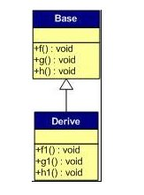
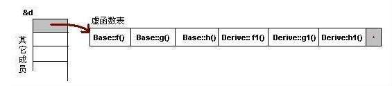
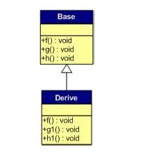
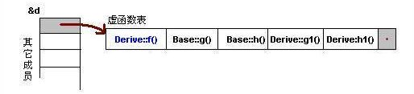
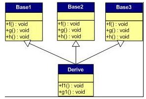
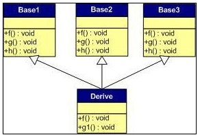
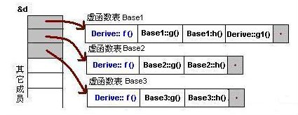
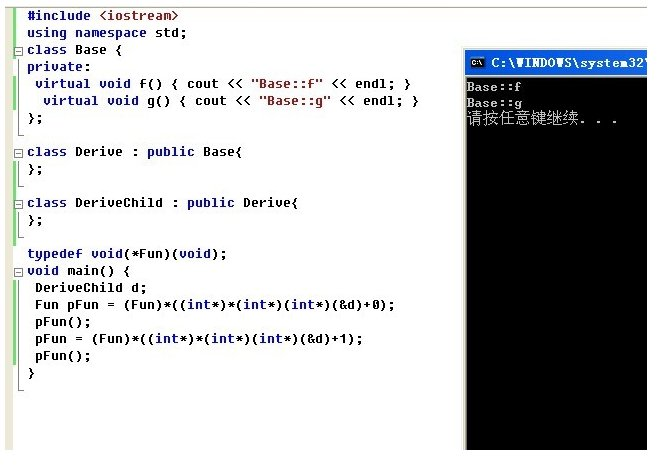

# 第八章：从头至尾漫谈虚函数

##前奏
  有关虚函数的问题层出不穷，有关虚函数的文章千篇一律，那为何还要写这一篇有关虚函数的文章呢？看完本文章后，相信能懂其意义之所在。同时，原狂想曲系列已经更名为程序员编程艺术系列，因为不再只专注于“面试”，而在“编程”之上了。ok，如果有不正之处，望不吝赐教。谢谢。

##第一节、一道简单的虚函数的面试题
题目要求：写出下面程序的运行结果？
```c
//谢谢董天喆提供的这道百度的面试题
#include <iostream>
using namespace std;
class A
{
	public:virtual void p()
	{
		cout << "A" << endl;
	}
};

class B : public A
{
	public:virtual void p()
	{
		cout << "B" << endl;
	}
};

int main()
{
	A* a = new A;
	A* b = new B;
	a->p();
	b->p();
	delete a;
	delete b;
	return 0;
}
```

  我想，这道面试题应该是考察虚函数相关知识的相对简单的一道题目了。然后，希望你碰到此类有关虚函数的面试题，不论其难度是难是易，都能够举一反三，那么本章的目的也就达到了。ok，请跟着我的思路，咱们步步深入（上面程序的输出结果为A B）。

##第二节、有无虚函数的区别
  1、当上述程序中的函数p()不是虚函数，那么程序的运行结果是如何？即如下代码所示：

```c
class A
{
public:
	void p()
	{
		cout << "A" << endl;
	}
};

class B : public A
{
public:
	void p()
	{
		cout << "B" << endl;
	}
};
```

对的，程序此时将输出两个A，A。为什么？

我们知道，在构造一个类的对象时，如果它有基类，那么首先将构造基类的对象，然后才构造派生类自己的对象。如上，A* a = new A; 调用默认构造函数构造基类A对象，然后调用函数p(),a->p();输出A，这点没有问题。

然后，A* b = new B; 构造了派生类对象B，B由于是基类A的派生类对象，所以会先构造基类A对象，然后再构造派生类对象，但由于当程序中函数是非虚函数调用时，B类对象对函数p()的调用时在编译时就已静态确定了，所以，不论基类指针b最终指向的是基类对象还是派生类对象，只要后面的对象调用的函数不是虚函数，那么就直接无视，而调用基类A的p()函数。

  2、那如果加上虚函数呢？即如最开始的那段程序那样，程序的输出结果，将是什么？
在此之前，我们还得明确以下两点：
  a、通过基类引用或指针调用基类中定义的函数时，我们并不知道执行函数的对象的确切类型，执行函数的对象可能是基类类型的，也可能是派生类型的。
  b、如果调用非虚函数，则无论实际对象是什么类型，都执行基类类型所定义的函数（如上述第1点所述）。如果调用虚函数，则直到运行时才能确定调用哪个函数，运行的虚函数是引用所绑定的或指针所指向的对象所属类型定义的版本。

根据上述b的观点，我们知道，如果加上虚函数，如上面这道面试题，

```c
class A
{
public:
	virtual void p()
	{
		cout << "A" << endl;
	}
};

class B : public A
{
public:
	virtual void p()
	{
		cout << "B" << endl;
	}
};

int main()
{
	A* a = new A;
	A* b = new B;
	a->p();
	b->p();
	delete a;
	delete b;
	return 0;
}
```

那么程序的输出结果将是A B。

所以，至此，咱们的这道面试题已经解决。但虚函数的问题，还没有解决。

##第三节、虚函数的原理与本质
  我们已经知道，虚（virtual）函数的一般实现模型是：每一个类（class）有一个虚表（virtual table），内含该class之中有作用的虚（virtual）函数地址，然后每个对象有一个vptr，指向虚表（virtual table）的所在。

请允许我援引自《深度探索c++对象模型》一书上的一个例子：

```c
class Point
{
public:
	virtual ~Point();
	virtual Point& mult(float) = 0;

	float x() const {return 0;}		//非虚函数，不作存储
	virtual float y() const {return 0;}
	virtual float z() const {return 0;}
	//...

protected:
	Point(float x = 0.0);
	float _x;
};
```

  1、在Point的对象pt中，有两个东西，一个是数据成员_x，一个是_vptr_Point。其中_vptr_Point指向着virtual table point，而virtual table（虚表）point中存储着以下东西：

* virtual ~Point()被赋值slot 1
* mult() 将被赋值slot 2
* y() is 将被赋值slot 3
* z() 将被赋值slot 4

```c
class Point2d : public Point
{
public:
	Point2d(float x = 0.0,float y = 0.0)
		:Point(x),_y(y){}
	~Point2d();		//1

	//改写base class virtual funtions
	Point2d& mult(float);	//2
	float y() const {return _y;}	//3

protected:
	float _y;
};
```

  2、在Point2d的对象pt2d中，有三个东西，首先是继承自基类pt对象的数据成员_x，然后是pt2d对象本身的数据成员_y，最后是_vptr_Point。其中_vptr_Point指向着virtual table point2d。由于Point2d继承自Point，所以在virtual table point2d中存储着：改写了的其中的~Point2d()、Point2d& mult(float)、float y() const，以及未被改写的Point:z()函数。

```c
class Point3d : public Point2d
{
public:
	Point3d(float x = 0.0,
			float y = 0.0,
			float z = 0.0)
		:Point2d(x,y),_z(z){}
	~Point3d();

	//overridden base class virtual functions
	Point3d& mult(float);
	float z() const {return _z;}

	//...other operations
protected:
	float _z;
};
```

  3、在Point3d的对象pt3d中，则有四个东西，一个是_x，一个是_vptr_Point，一个是_y，一个是_z。其中_vptr_Point指向着virtual table point3d。由于point3d继承自point2d，所以virtual table point3d中存储着：已经改写了的point3d的~Point3d()，point3d::mult()的函数地址，和z()函数的地址，以及未被改写的point2d的y()函数地址。

ok，上述1、2、3所有情况的详情，请参考下图。


(图：virtual table（虚表）的布局：单一继承情况)

本文，日后可能会酌情考虑增补有关内容。ok，更多，可参考《深度探索c++对象模型》一书第四章那个。
最近几章难度都比较小，是考虑到狂想曲有深有浅的原则，后续张杰会逐步恢复到相应难度。


##第四节、虚函数的布局与汇编层面的考虑
  ivan、老梦的两篇文章继续对虚函数进行了一番深入，我看他们已经写的很好了，我就不饶舌了。ok，请看1、[VC虚函数布局引发的问题](http://blog.csdn.net/zhanglei8893/article/details/6333751) , 2、[从汇编层面深度剖析c++虚函数](http://blog.csdn.net/linyt/archive/2011/04/20/6336762.aspx)。

##第五节、虚函数表的详解

  本节全部内容来自淄博的共享，非常感谢。注@molixiaogemao：只有发生继承的时候且父类子类都有virtual的时候才会出现虚函数指针，请不要忘了虚函数出现的目的是为了实现多态。

  一般继承（无虚函数覆盖）
  下面，再让我们来看看继承时的虚函数表是什么样的。假设有如下所示的一个继承关系：



  请注意，在这个继承关系中，子类没有重载任何父类的函数。那么，在派生类的实例中，

  对于实例：Derive d; 的虚函数表如下：



   我们可以看到下面几点：
   1）虚函数按照其声明顺序放于表中。
   2）父类的虚函数在子类的虚函数前面。

   我相信聪明的你一定可以参考前面的那个程序，来编写一段程序来验证。


   一般继承（有虚函数覆盖）
   覆盖父类的虚函数是很显然的事情，不然，虚函数就变得毫无意义。
   下面，我们来看一下，如果子类中有虚函数重载了父类的虚函数，会是一个什么样子？假设，我们有下面这样的一个继承关系。



  为了让大家看到被继承过后的效果，在这个类的设计中，我只覆盖了父类的一个函数：f()  。
  那么，对于派生类的实例，其虚函数表会是下面的一个样子：



  我们从表中可以看到下面几点，
  1）覆盖的f()函数被放到了虚表中原来父类虚函数的位置。
  2）没有被覆盖的函数依旧。

  这样，我们就可以看到对于下面这样的程序，
  Base *b = new Derive();

  b->f();

  由b所指的内存中的虚函数表的f()的位置已经被Derive::f()函数地址所取代，
  于是在实际调用发生时，是Derive::f()被调用了。这就实现了多态。


  多重继承（无虚函数覆盖）

  下面，再让我们来看看多重继承中的情况，假设有下面这样一个类的继承关系（注意：子类并没有覆盖父类的函数）：



  对于子类实例中的虚函数表，是下面这个样子：


  我们可以看到：
  1） 每个父类都有自己的虚表。
  2） 子类的成员函数被放到了第一个父类的表中。（所谓的第一个父类是按照声明顺序来判断的）

  这样做就是为了解决不同的父类类型的指针指向同一个子类实例，而能够调用到实际的函数。


  多重继承（有虚函数覆盖）
  下面我们再来看看，如果发生虚函数覆盖的情况。
  下图中，我们在子类中覆盖了父类的f()函数。



  下面是对于子类实例中的虚函数表的图：



我们可以看见，三个父类虚函数表中的f()的位置被替换成了子类的函数指针。
这样，我们就可以任一静态类型的父类来指向子类，并调用子类的f()了。如：
```c
Derive d;
Base1 *b1 = &d;
Base2 *b2 = &d;
Base3 *b3 = &d;
b1->f(); //Derive::f()
b2->f(); //Derive::f()
b3->f(); //Derive::f()
b1->g(); //Base1::g()
b2->g(); //Base2::g()
b3->g(); //Base3::g()
```


安全性
每次写C++的文章，总免不了要批判一下C++。
这篇文章也不例外。通过上面的讲述，相信我们对虚函数表有一个比较细致的了解了。
水可载舟，亦可覆舟。下面，让我们来看看我们可以用虚函数表来干点什么坏事吧。

一、通过父类型的指针访问子类自己的虚函数
我们知道，子类没有重载父类的虚函数是一件毫无意义的事情。因为多态也是要基于函数重载的。
虽然在上面的图中我们可以看到Base1的虚表中有Derive的虚函数，但我们根本不可能使用下面的语句来调用子类的自有虚函数：

```c
Base1 *b1 = new Derive();
b1->g1(); //编译出错
```

任何妄图使用父类指针想调用子类中的未覆盖父类的成员函数的行为都会被编译器视为非法，_即基类指针不能调用子类自己定义的成员函数_。所以，这样的程序根本无法编译通过。
但在运行时，我们可以通过指针的方式访问虚函数表来达到违反C++语义的行为。
（关于这方面的尝试，通过阅读后面附录的代码，相信你可以做到这一点）

二、访问non-public的虚函数
另外，如果父类的虚函数是private或是protected的，但这些非public的虚函数同样会存在于虚函数表中，
所以，我们同样可以使用访问虚函数表的方式来访问这些non-public的虚函数，这是很容易做到的。
如：

```c
class Base {
private:
 virtual void f() { cout << "Base::f" << endl; }
};

class Derive : public Base{
};
typedef void(*Fun)(void);
void main() {
 Derive d;
 Fun pFun = (Fun)*((int*)*(int*)(&d)+0);
 pFun();
}
```

对上面粗体部分的解释（@a && x）：

1. (int*)(&d)取vptr地址，该地址存储的是指向vtbl的指针
2. (int*)*(int*)(&d)取vtbl地址，该地址存储的是虚函数表数组
3. (Fun)*((int*)*(int*)(&d) +0)，取vtbl数组的第一个元素，即Base中第一个虚函数f的地址
4. (Fun)*((int*)*(int*)(&d) +1)，取vtbl数组的第二个元素（这第4点，如下图所示）。

下图也能很清晰的说明一些东西（@5）：




ok，再来看一个问题，如果一个子类重载的虚拟函数为privete，那么通过父类的指针可以访问到它吗？

```c
#include <IOSTREAM>
class B
{
public:
    virtual void fun()
    {
        std::cout << "base fun called";
    };
};

class D : public B
{
private:
    virtual void fun()
    {
        std::cout << "driver fun called";
    };
};

int main(int argc, char* argv[])
{
    B* p = new D();
    p->fun();
    return 0;
}
```

运行时会输出 driver fun called

从这个实验，可以更深入的了解虚拟函数编译时的一些特征:
在编译虚拟函数调用的时候，例如p->fun(); 只是按其静态类型来处理的, 在这里p的类型就是B，不会考虑其实际指向的类型（动态类型）。
    也就是说，碰到p->fun();编译器就当作调用B的fun来进行相应的检查和处理。
因为在B里fun是public的，所以这里在“访问控制检查”这一关就完全可以通过了。
然后就会转换成(*p->vptr[1])(p)这样的方式处理, p实际指向的动态类型是D，
    所以p作为参数传给fun后(类的非静态成员函数都会编译加一个指针参数，指向调用该函数的对象，我们平常用的this就是该指针的值）, 实际运行时p->vptr[1]则获取到的是D::fun()的地址，也就调用了该函数, 这也就是动态运行的机理。


为了进一步的实验，可以将B里的fun改为private的，D里的改为public的，则编译就会出错。
C++的注意条款中有一条" 绝不重新定义继承而来的缺省参数值"
（Effective C++ Item37， never redefine a function's inherited default parameter value) 也是同样的道理。

可以再做个实验
```c
class B
{
public:
    virtual void fun(int i = 1)
    {
        std::cout << "base fun called, " << i;
    };
};

class D : public B
{
private:
    virtual void fun(int i = 2)
    {
        std::cout << "driver fun called, " << i;
    };
};
```


则运行会输出driver fun called, 1


关于这一点，Effective上讲的很清楚“virtual 函数系动态绑定， 而缺省参数却是静态绑定”，
也就是说在编译的时候已经按照p的静态类型处理其默认参数了,转换成了(*p->vptr[1])(p, 1)这样的方式。

补遗

   一个类如果有虚函数，不管是几个虚函数，都会为这个类声明一个虚函数表，这个虚表是一个含有虚函数的类的，不是说是类对象的。一个含有虚函数的类，不管有多少个数据成员，每个对象实例都有一个虚指针，在内存中，存放每个类对象的内存区，在内存区的头部都是先存放这个指针变量的（准确的说，应该是：视编译器具体情况而定），从第n（n视实际情况而定）个字节才是这个对象自己的东西。


下面再说下通过基类指针，调用虚函数所发生的一切：
One *p;
p->disp();

1、上来要取得类的虚表的指针，就是要得到，虚表的地址。存放类对象的内存区的前四个字节其实就是用来存放虚表的地址的。

2、得到虚表的地址后，从虚表那知道你调用的那个函数的入口地址。根据虚表提供的你要找的函数的地址。并调用函数；你要知道，那个虚表是一个存放指针变量的数组，并不是说，那个虚表中就是存放的虚函数的实体。

本章完。


