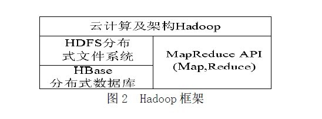
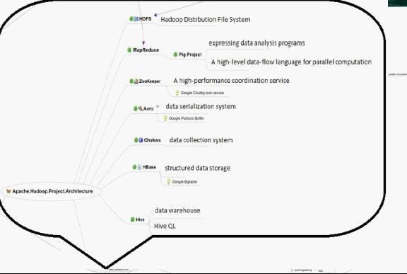
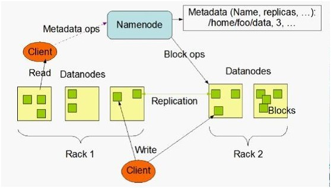
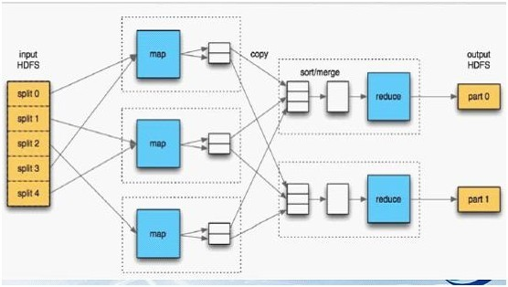
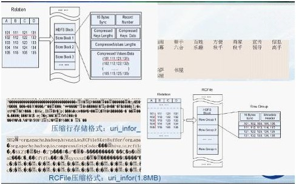
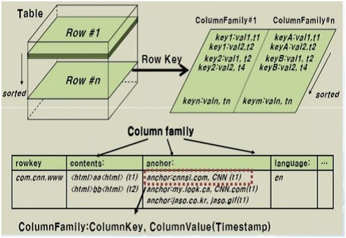
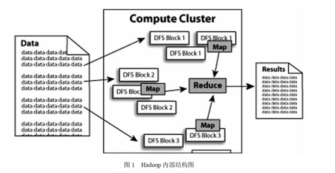

#### 密匙六、分布式处理之Mapreduce

MapReduce是一种计算模型，简单的说就是将大批量的工作（数据）分解（MAP）执行，然后再将结果合并成最终结果（REDUCE）。这样做的好处是可以在任务被分解后，可以通过大量机器进行并行计算，减少整个操作的时间。但如果你要我再通俗点介绍，那么，说白了，Mapreduce的原理就是一个归并排序。

适用范围：数据量大，但是数据种类小可以放入内存

基本原理及要点：将数据交给不同的机器去处理，数据划分，结果归约。

扩展：

问题实例：

1. The canonical example application of MapReduce is a process to count the appearances of each different word in a set of documents:
2. 海量数据分布在100台电脑中，想个办法高效统计出这批数据的TOP10。
3. 一共有N个机器，每个机器上有N个数。每个机器最多存O(N)个数并对它们操作。如何找到N^2个数的中数(median)？

想读懂此文，读者必须先要明确以下几点，以作为阅读后续内容的基础知识储备：

1. Mapreduce是一种模式。
2. Hadoop是一种框架。
3. Hadoop是一个实现了mapreduce模式的开源的分布式并行编程框架。

所以，你现在，知道了什么是mapreduce，什么是hadoop，以及这两者之间最简单的联系，而本文的主旨即是，一句话概括：**在hadoop的框架上采取mapreduce的模式处理海量数据**。下面，咱们可以依次深入学习和了解mapreduce和hadoop这两个东西了。

### Mapreduce模式

前面说了，mapreduce是一种模式，一种什么模式呢?一种云计算的核心计算模式，一种分布式运算技术，也是简化的分布式编程模式，它主要用于解决问题的程序开发模型，也是开发人员拆解问题的方法。

Ok，光说不上图，没用。如下图所示，mapreduce模式的主要思想是将自动分割要执行的问题（例如程序）拆解成map（映射）和reduce（化简）的方式，流程图如下图1所示：  

在数据被分割后通过Map 函数的程序将数据映射成不同的区块，分配给计算机机群处理达到分布式运算的效果，在通过Reduce 函数的程序将结果汇整，从而输出开发者需要的结果。

MapReduce 借鉴了函数式程序设计语言的设计思想，其软件实现是指定一个Map 函数，把键值对(key/value)映射成新的键值对(key/value)，形成一系列中间结果形式的key/value 对，然后把它们传给Reduce(规约)函数，把具有相同中间形式key 的value 合并在一起。Map 和Reduce 函数具有一定的关联性。函数描述如表1 所示：  

MapReduce致力于解决大规模数据处理的问题，因此在设计之初就考虑了数据的局部性原理，利用局部性原理将整个问题分而治之。MapReduce集群由普通PC机构成，为无共享式架构。在处理之前，将数据集分布至各个节点。处理时，每个节点就近读取本地存储的数据处理（map），将处理后的数据进行合并（combine）、排序（shuffle and sort）后再分发（至reduce节点），避免了大量数据的传输，提高了处理效率。无共享式架构的另一个好处是配合复制（replication）策略，集群可以具有良好的容错性，一部分节点的down机对集群的正常工作不会造成影响。

ok，你可以再简单看看下副图，整幅图是有关hadoop的作业调优参数及原理，图的左边是MapTask运行示意图，右边是ReduceTask运行示意图：  

如上图所示，其中map阶段，当map task开始运算，并产生中间数据后并非直接而简单的写入磁盘，它首先利用内存buffer来对已经产生的buffer进行缓存，并在内存buffer中进行一些预排序来优化整个map的性能。而上图右边的reduce阶段则经历了三个阶段，分别Copy->Sort->reduce。我们能明显的看出，其中的Sort是采用的归并排序，即merge sort。

了解了什么是mapreduce，接下来，咱们可以来了解实现了mapreduce模式的开源框架—hadoop。

### Hadoop框架

前面说了，hadoop是一个框架，一个什么样的框架呢?Hadoop 是一个实现了MapReduce 计算模型的开源分布式并行编程框架，程序员可以借助Hadoop 编写程序，将所编写的程序运行于计算机机群上，从而实现对海量数据的处理。

此外，Hadoop 还提供一个分布式文件系统(HDFS）及分布式数据库（HBase）用来将数据存储或部署到各个计算节点上。所以，你可以大致认为：*Hadoop=HDFS（文件系统，数据存储技术相关）+HBase（数据库）+MapReduce（数据处理）*。Hadoop 框架如图2 所示：  

借助Hadoop 框架及云计算核心技术MapReduce 来实现数据的计算和存储，并且将HDFS 分布式文件系统和HBase 分布式数据库很好的融入到云计算框架中，从而实现云计算的分布式、并行计算和存储，并且得以实现很好的处理大规模数据的能力。

### Hadoop的组成部分

我们已经知道，Hadoop是Google的MapReduce一个Java实现。MapReduce是一种简化的分布式编程模式，让程序自动分布到一个由普通机器组成的超大集群上并发执行。*Hadoop主要由HDFS、MapReduce和HBase*等组成。具体的hadoop的组成如下图：  

由上图，我们可以看到：

1. **Hadoop HDFS**是Google GFS存储系统的开源实现，主要应用场景是作为并行计算环境（MapReduce）的基础组件，同时也是BigTable（如HBase、HyperTable）的底层分布式文件系统。HDFS采用master/slave架构。一个HDFS集群是有由一个Namenode和一定数目的Datanode组成。Namenode是一个中心服务器，负责管理文件系统的namespace和客户端对文件的访问。Datanode在集群中一般是一个节点一个，负责管理节点上它们附带的存储。在内部，一个文件其实分成一个或多个block，这些block存储在Datanode集合里。如下图所示（*HDFS体系结构图*）：  

2. **Hadoop MapReduce**是一个使用简易的软件框架，基于它写出来的应用程序能够运行在由上千个商用机器组成的大型集群上，并以一种可靠容错的方式并行处理上TB级别的数据集。

	一个MapReduce作业（job）通常会把输入的数据集切分为若干独立的数据块，由 Map任务（task）以完全并行的方式处理它们。框架会对Map的输出先进行排序，然后把结果输入给Reduce任务。通常作业的输入和输出都会被存储在文件系统中。整个框架负责任务的调度和监控，以及重新执行已经失败的任务。如下图所示（*Hadoop MapReduce处理流程图*）：  

3. **Hive是基于Hadoop的一个数据仓库工具，处理能力强而且成本低廉**。

	主要特点：

	存储方式是将结构化的数据文件映射为一张数据库表。提供类SQL语言，实现完整的SQL查询功能。可以将SQL语句转换为MapReduce任务运行，十分适合数据仓库的统计分析。

	不足之处：

	采用行存储的方式（SequenceFile）来存储和读取数据。效率低：当要读取数据表某一列数据时需要先取出所有数据然后再提取出某一列的数据，效率很低。同时，它还占用较多的磁盘空间。

	由于以上的不足，有人（查礼博士）介绍了一种将分布式数据处理系统中以记录为单位的存储结构变为以列为单位的存储结构，进而减少磁盘访问数量，提高查询处理性能。这样，由于相同属性值具有相同数据类型和相近的数据特性，以属性值为单位进行压缩存储的压缩比更高，能节省更多的存储空间。如下图所示（*行列存储的比较图*）：  

4. **HBase**  
HBase是一个分布式的、面向列的开源数据库，它不同于一般的关系数据库,是一个适合于非结构化数据存储的数据库。另一个不同的是HBase基于列的而不是基于行的模式。HBase使用和 BigTable非常相同的数据模型。用户存储数据行在一个表里。一个数据行拥有一个可选择的键和任意数量的列，一个或多个列组成一个ColumnFamily，一个Fmaily下的列位于一个HFile中，易于缓存数据。表是疏松的存储的，因此用户可以给行定义各种不同的列。在HBase中数据按主键排序，同时表按主键划分为多个HRegion，如下图所示（*HBase数据表结构图*）：

Ok，行文至此，看似洋洋洒洒近千里，但若给读者造成阅读上的负担，则不是我本意。接下来的内容，我不会再引用诸多繁杂的专业术语，以给读者心里上造成不良影响。

我再给出一副图，算是对上文所说的hadoop框架及其组成部分做个总结，如下图所示，便是hadoop的内部结构，我们可以看到，海量的数据交给hadoop处理后，在hadoop的内部中，正如上文所述：hadoop提供一个分布式文件系统（HDFS）及分布式数据库（Hbase）用来存储或部署到各个计算点上，最终在内部采取mapreduce的模式对其数据进行处理，然后输出处理结果：  

**其它模式/方法论，结合操作系统知识**

至此，六种处理海量数据问题的模式/方法已经阐述完毕。据观察，这方面的面试题无外乎以上一种或其变形，然题目为何取为是：秒杀99%的海量数据处理面试题，而不是100%呢。OK，给读者看最后一道题，如下：

**非常大的文件，装不进内存。每行一个int类型数据，现在要你随机取100个数。**

我们发现上述这道题，无论是以上任何一种模式/方法都不好做，那有什么好的别的方法呢？我们可以借鉴操作系统内存分页系统设计(说白了，就是映射+建索引)。

即针对此题，我们可以做出如下解决方案：

先生成4G的地址表，在把这个表划分为小的4M的小文件做个索引，二级索引。30位前十位表示第几个4M文件，后20位表示在这个4M文件的第几个，等等，基于key value来设计存储，用key来建索引。

但如果现在只有10000个数，然后怎么去随机从这10000个数里面随机取100个数？请读者思考。更多海里数据处理面试题，请参见此文第一部分：<http://blog.csdn.net/v_july_v/article/details/6685962>。

###后记

经过上面这么多海量数据处理面试题的轰炸，我们依然可以看出这类问题是有一定的解决方案/模式的，所以，不必将其神化。然有点，必须负责任的敬告大家：无论是这些海量数据处理面试题也好，还是算法也好，**面试时**，70~80%的人不是倒在这两方面，而是倒在基础之上(诸如语言，数据库，操作系统，网络协议等等)，所以，**无论任何时候，基础最重要**，没了基础，便什么都不是。
