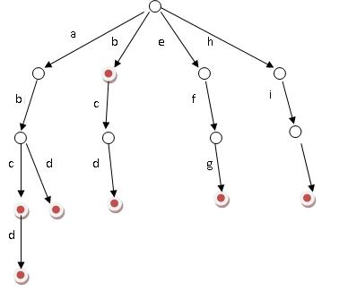
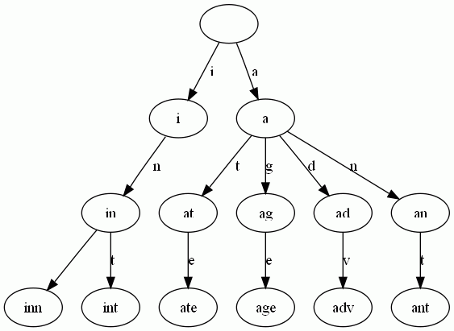

# 从Trie树（字典树）谈到后缀树

## 引言

常关注本blog的读者朋友想必看过此篇文章：从[B树、B+树、B*树谈到R 树](08.2.md)，这次，咱们来讲另外两种树：Tire树与后缀树。不过，在此之前，先来看两个问题。

**第一个问题：** 一个文本文件，大约有一万行，每行一个词，要求统计出其中最频繁出现的前10个词，请给出思想，给出时间复杂度分析。

之前在此文：[海量数据处理面试题集锦与Bit-map](http://blog.csdn.net/v_july_v/article/details/6685962)详解中给出的参考答案：用trie树统计每个词出现的次数，时间复杂度是O(n\*le)（le表示单词的平均长度），然后是找出出现最频繁的前10个词。也可以用堆来实现（具体的操作可参考第三章、寻找最小的k个数），时间复杂度是O(n\*lg10)。所以总的时间复杂度，是O(n\*le)与O(n\*lg10)中较大的哪一个。

**第二个问题：**找出给定字符串里的最长回文。例子：输入XMADAMYX。则输出MADAM。这道题的流行解法是用后缀树（Suffix Tree)，但其用途远不止如此，它能高效解决一大票复杂的字符串编程问题（当然，它有它的弱点，如算法实现复杂以及空间开销大），概括如下： 

- 查询字符串S是否包含子串S1。主要思想是：如果S包含S1，那么S1必定是S的某个后缀的前缀；又因为S的后缀树包含了所有的后缀，所以只需对S的后缀树使用和Trie相同的查找方法查找S1即可（使用后缀树实现的复杂度同流行的KMP算法的复杂度相当）。 
- 找出字符串S的最长重复子串S1。比如abcdabcefda里abc同da都重复出现，而最长重复子串是abc。 
- 找出字符串S1同S2的最长公共子串。注意最长公共子串（Longest CommonSubstring）和最长公共子序列（LongestCommon Subsequence, LCS）的区别：子串（Substring）是串的一个连续的部分，子序列（Subsequence）则是从不改变序列的顺序，而从序列中去掉任意的元素而获得的新序列；更简略地说，前者（子串）的字符的位置必须连续，后者（子序列LCS）则不必。比如字符串acdfg同akdfc的最长公共子串为df，而他们的最长公共子序列是adf。LCS可以使用动态规划法解决。
- Ziv-Lampel无损压缩算法。 LZW算法的基本原理是利用编码数据本身存在字符串重复特性来实现数据压缩，所以一个很好的选择是使用后缀树的形式来组织存储字符串及其对应压缩码值的字典。
- 找出字符串S的最长回文子串S1。例如：XMADAMYX的最长回文子串是MADAM（此即为上面所说的第二个问题：最长回文问题，本文第二部分将详细阐述此问题）。
- 多模式串的模式匹配问题（suffix_array + 二分）。

本文**第一部分**，咱们就来了解这个**Trie树**，然后自然而然过渡到**第二部分、后缀树**权作此番阐述，以备不时之需，在需要的时候便可手到擒来。ok，有任何问题，欢迎不吝指正或赐教。谢谢。

## 第一部分、Trie树

### 1.1、什么是Trie树

Trie树，即字典树，又称单词查找树或键树，是一种树形结构，是一种哈希树的变种。典型应用是用于统计和排序大量的字符串（但不仅限于字符串），所以经常被搜索引擎系统用于文本词频统计。它的优点是：最大限度地减少无谓的字符串比较，查询效率比哈希表高。

Trie的核心思想是空间换时间。利用字符串的公共前缀来降低查询时间的开销以达到提高效率的目的。

它有3个基本性质：

1. 根节点不包含字符，除根节点外每一个节点都只包含一个字符。
2. 从根节点到某一节点，路径上经过的字符连接起来，为该节点对应的字符串。
3. 每个节点的所有子节点包含的字符都不相同。

### 1.2、树的构建

举个在网上流传颇广的例子，如下：

题目：给你100000个长度不超过10的单词。对于每一个单词，我们要判断他出没出现过，如果出现了，求第一次出现在第几个位置。

分析：这题当然可以用hash来解决，但是本文重点介绍的是trie树，因为在某些方面它的用途更大。比如说对于某一个单词，我们要询问它的前缀是否出现过。这样hash就不好搞了，而用trie还是很简单。
    
现在回到例子中，如果我们用最傻的方法，对于每一个单词，我们都要去查找它前面的单词中是否有它。那么这个算法的复杂度就是O(n^2)。显然对于100000的范围难以接受。现在我们换个思路想。假设我要查询的单词是abcd，那么在他前面的单词中，以b，c，d，f之类开头的我显然不必考虑。而只要找以a开头的中是否存在abcd就可以了。同样的，在以a开头中的单词中，我们只要考虑以b作为第二个字母的，一次次缩小范围和提高针对性，这样一个树的模型就渐渐清晰了。
    
好比假设有b，abc，abd，bcd，abcd，efg，hii 这6个单词，我们构建的树就是如下图这样的：

 当时第一次看到这幅图的时候，便立马感到此树之不凡构造了。单单从上幅图便可窥知一二，好比大海搜人，立马就能确定东南西北中的到底哪个方位，如此迅速缩小查找的范围和提高查找的针对性，不失为一创举。
    
ok，如上图所示，对于每一个节点，从根遍历到他的过程就是一个单词，如果这个节点被标记为红色，就表示这个单词存在，否则不存在。
    
那么，对于一个单词，我只要顺着他从根走到对应的节点，再看这个节点是否被标记为红色就可以知道它是否出现过了。把这个节点标记为红色，就相当于插入了这个单词。
    
这样一来我们查询和插入可以一起完成（重点体会这个查询和插入是如何一起完成的，稍后，下文具体解释），所用时间仅仅为单词长度，在这一个样例，便是10。
    
我们可以看到，trie树每一层的节点数是26^i级别的。所以为了节省空间。我们用动态链表，或者用数组来模拟动态。空间的花费，不会超过单词数×单词长度。

### 1.3、前缀查询

上文中提到”比如说对于某一个单词，我们要询问它的前缀是否出现过。这样hash就不好搞了，而用trie还是很简单“。下面，咱们来看看这个前缀查询问题：
    
已知n个由小写字母构成的平均长度为10的单词,判断其中**是否存在某个串为另一个串的前缀子串**。下面对比3种方法：

1. 最容易想到的：即从字符串集中从头往后搜，看每个字符串是否为字符串集中某个字符串的前缀，复杂度为O(n^2)。
2. 使用hash：我们用hash存下所有字符串的所有的前缀子串，建立存有子串hash的复杂度为O(n\*len)，而查询的复杂度为O(n)\* O(1)= O(n)。
3. 使用trie：因为当查询如字符串abc是否为某个字符串的前缀时，显然以b,c,d....等不是以a开头的字符串就不用查找了。所以建立trie的复杂度为O(n\*len)，而**建立\+查询在trie中是可以同时执行的**，建立的过程也就可以成为查询的过程，hash就不能实现这个功能。所以总的复杂度为O(n\*len)，实际查询的复杂度也只是O(len)。（说白了，就是**Trie树的平均高度h为len，所以Trie树的查询复杂度为O（h）=O（len）**。好比一棵二叉平衡树的高度为logN，则其查询，插入的平均时间复杂度亦为O（logN））。

下面解释下上述方法3中所说的为什么hash不能将建立与查询同时执行，而Trie树却可以：

- 在hash中，例如现在要输入两个串911，911456，如果要同时查询这两个串，且查询串的同时若hash中没有则存入。那么，这个查询与建立的过程就是先查询其中一个串911，没有，然后存入9、91、911；而后查询第二个串911456，没有然后存入9、91、911、9114、91145、911456。因为程序没有记忆功能，所以并不知道911在输入数据中出现过，只是照常以例行事，存入9、91、911、9114、911...。也就是说用hash必须先存入所有子串，然后for循环查询。
- 而trie树中，存入911后，已经记录911为出现的字符串，在存入911456的过程中就能发现而输出答案；倒过来亦可以，先存入911456，在存入911时，当指针指向最后一个1时，程序会发现这个1已经存在，说明911必定是某个字符串的前缀。

**读者反馈**@悠悠长风：关于这点，我有不同的看法。hash也是可以实现边建立边查询的啊。当插入911时，需要一个额外的标志位，表示它是一个完整的单词。在处理911456时，也是按照前面的查询9,91,911，当查询911时，是可以找到前面插入的911，且通过标志位知道911为一个完整单词。那么就可以判断出911为911456的前缀啊。虽然trie树更适合这个问题，但是我认为hash也是可以实现边建立，边查找。
    
至于，有关Trie树的查找，插入等操作的实现代码，网上遍地开花且千篇一律，诸君尽可参考，想必不用我再做多余费神。

### 1.4、查询

Trie树是简单但实用的数据结构，通常用于实现字典查询。我们做即时响应用户输入的AJAX搜索框时，就是Trie开始。本质上，Trie是一颗存储多个字符串的树。相邻节点间的边代表一个字符，这样树的每条分支代表一则子串，而树的叶节点则代表完整的字符串。和普通树不同的地方是，相同的字符串前缀共享同一条分支。下面，再举一个例子。给出一组单词，inn, int, at, age, adv, ant, 我们可以得到下面的Trie：

可以看出：

- 每条边对应一个字母。
- 每个节点对应一项前缀。叶节点对应最长前缀，即单词本身。
- 单词inn与单词int有共同的前缀“in”, 因此他们共享左边的一条分支，root->i->in。同理，ate, age, adv, 和ant共享前缀"a"，所以他们共享从根节点到节点"a"的边。

查询操纵非常简单。比如要查找int，顺着路径i -> in -> int就找到了。

搭建Trie的基本算法也很简单，无非是逐一把每则单词的每个字母插入Trie。插入前先看前缀是否存在。如果存在，就共享，否则创建对应的节点和边。比如要插入单词add，就有下面几步：

1. 考察前缀"a"，发现边a已经存在。于是顺着边a走到节点a。
2. 考察剩下的字符串"dd"的前缀"d"，发现从节点a出发，已经有边d存在。于是顺着边d走到节点ad
3. 考察最后一个字符"d"，这下从节点ad出发没有边d了，于是创建节点ad的子节点add，并把边ad->add标记为d。

### 1.5、Trie树的应用

除了本文引言处所述的问题能应用Trie树解决之外，Trie树还能解决下述问题（节选自此文：[海量数据处理面试题集锦与Bit-map](http://blog.csdn.net/v_july_v/article/details/6685962)）：

- 3. 有一个1G大小的一个文件，里面每一行是一个词，词的大小不超过16字节，内存限制大小是1M。返回频数最高的100个词。
- 9. 1000万字符串，其中有些是重复的，需要把重复的全部去掉，保留没有重复的字符串。请怎么设计和实现？
- 10. 一个文本文件，大约有一万行，每行一个词，要求统计出其中最频繁出现的前10个词，请给出思想，给出时间复杂度分析。
- 13.寻找热门查询：  
搜索引擎会通过日志文件把用户每次检索使用的所有检索串都记录下来，每个查询串的长度为1-255字节。假设目前有一千万个记录，这些查询串的重复读比较高，虽然总数是1千万，但是如果去除重复和，不超过3百万个。一个查询串的重复度越高，说明查询它的用户越多，也就越热门。请你统计最热门的10个查询串，要求使用的内存不能超过1G。  
(1) 请描述你解决这个问题的思路；  
(2) 请给出主要的处理流程，算法，以及算法的复杂度。
    
有了Trie，后缀树就容易理解了。本文接下来的第二部分，介绍后缀树。

## 第二部分、后缀树

### 2.1、后缀树的定义

后缀树（Suffix tree）是一种数据结构，能快速解决很多关于字符串的问题。后缀树的概念最早由Weiner 于1973年提出，既而由McCreight 在1976年和Ukkonen在1992年和1995年加以改进完善。

后缀，顾名思义，甚至通俗点来说，就是所谓后缀就是后面尾巴的意思。比如说给定一长度为n的字符串S=S1S2..Si..Sn，和整数i，1 <= i <= n，子串SiSi+1...Sn便都是字符串S的后缀。

以字符串S=XMADAMYX为例，它的长度为8，所以S[1..8], S[2..8], ... , S[8..8]都算S的后缀，我们一般还把空字串也算成后缀。这样，我们一共有如下后缀。对于后缀S[i..n]，我们说这项后缀起始于i。

S[1..8], XMADAMYX， 也就是字符串本身，起始位置为1  
 S[2..8], MADAMYX，起始位置为2  
  S[3..8], ADAMYX，起始位置为3  
   S[4..8], DAMYX，起始位置为4  
    S[5..8], AMYX，起始位置为5  
     S[6..8], MYX，起始位置为6  
      S[7..8], YX，起始位置为7  
       S[8..8], X，起始位置为8  
空字串，记为$。 

而后缀树，就是包含一则字符串所有后缀的压缩Trie。把上面的后缀加入Trie后，我们得到下面的结构：

仔细观察上图，我们可以看到不少值得压缩的地方。比如蓝框标注的分支都是独苗，没有必要用单独的节点同边表示。如果我们允许任意一条边里包含多个字 母，就可以把这种没有分叉的路径压缩到一条边。另外每条边已经包含了足够的后缀信息，我们就不用再给节点标注字符串信息了。我们只需要**在叶节点上标注上每项后缀的起始位置**。于是我们得到下图：

这样的结构丢失了某些后缀。比如后**缀X在上图中消失了**，因为它正好是字符串XMADAMYX的前缀。为了避免这种情况，我们也规定**每项后缀不能是其它后缀的前缀**。要解决这个问题其实挺简单，在**待处理的子串后加一个空字串**就行了。例如我们处理XMADAMYX前，先把XMADAMYX变为 XMADAMYX$，于是就得到suffix tree--后缀树了，如下图所示：

### 2.2、后缀树与回文问题的关联

那后缀树同最长回文有什么关系呢？我们得先知道两个简单概念：

- 最低共有祖先，**LCA**（Lowest Common Ancestor)，也就是任意两节点（多个也行）最长的共有前缀。比如下图中，节点7同节点1的共同祖先是节点5与节点10，但最低共同祖先是5。 查找LCA的算法是O(1)的复杂度，当然，代价是需要对后缀树做复杂度为O(n)的预处理。 

- 广义后缀树(Generalized Suffix Tree)。传统的后缀树处理一坨单词的所有后缀。广义后缀树存储任意多个单词的所有后缀。例如下图是单词**XMADAMYX与XYMADAMX的广义后缀 树**。注意我们需要区分不同单词的后缀，所以叶节点用不同的特殊符号与后缀位置配对。 

### 2.3、最长回文问题的解决

有了上面的概念，本文引言中提出的查找最长回文问题就相对简单了。咱们来回顾下引言中提出的回文问题的具体描述：找出给定字符串里的最长回文。例如输入XMADAMYX，则输出MADAM。

思维的突破点在于考察回文的半径，而不是回文本身。所谓半径，就是回文对折后的字串。比如回文MADAM 的半径为MAD，半径长度为3，半径的中心是字母D。显然，最长回文必有最长半径，且两条半径相等。还是以MADAM为例，以D为中心往左，我们得到半径 DAM；以D为中心向右，我们得到半径DAM。二者肯定相等。因为MADAM已经是单词XMADAMYX里的最长回文，我们可以肯定从**D往左数的字串 DAMX与从D往右数的子串DAMYX共享最长前缀DAM**。而这，正是解决回文问题的关键。现在我们有后缀树，怎么把从D向左数的字串DAMX变成后缀 呢？

到这个地步，答案应该明显：**把单词XMADAMYX翻转（XMADAMYX=>XYMADAMX**，**DAMX**就变成后缀了**）**就行了。于是我们把寻找回文的问题转换成了寻找两坨后缀的**LCA**的问题。当然，我们还需要知道 到底查询那些后缀间的LCA。很简单，给定字符串S，如果最长回文的中心在i，那从位置i向右数的后缀刚好是S(i)，而向左数的字符串刚好是翻转S后得到的字符串S‘的后缀S'(n-i+1)。这里的n是字符串S的长度。

可能上面的阐述还不够直观，我再细细说明下：

**1.** 首先，还记得本第二部分开头关于后缀树的定义么： “先说说后缀的定义，顾名思义，甚至通俗点来说，就是所谓后缀就是后面尾巴的意思。比如说给定一长度为n的字符串S=S1S2..Si..Sn，和整数i，**1 <= i <= n，子串SiSi+1...Sn便都是字符串S的后缀**。”  

以字符串S=XMADAMYX为例，它的长度为8，所以S[1..8], S[2..8], ... , S[8..8]都算S的后缀，我们一般还把空字串也算成后缀。这样，我们一共有如下后缀。对于后缀S[i..n]，我们说这项后缀起始于i。

S[1..8], XMADAMYX， 也就是字符串本身，起始位置为1  
 S[2..8], MADAMYX，起始位置为2  
  S[3..8], ADAMYX，起始位置为3  
   S[4..8], DAMYX，起始位置为4  
    S[5..8], AMYX，起始位置为5  
     S[6..8], MYX，起始位置为6  
      S[7..8], YX，起始位置为7  
       S[8..8], X，起始位置为8  
空字串，记为$。

**2.** 对单词XMADAMYX而言，回文中心为D，那么D向右的后缀**DAMYX**假设是S(i)（当N=8，i从1开始计数，i=4时，便是S(4..8)）;而对于翻转后的单词XYMADAMX而言，回文中心D向右对应的后缀为**DAMX**，也就是S'(N-i+1)(（N=8，i=4，便是S‘（5..8）） 。此刻已经可以得出，它们共享最长前缀，即**LCA（DAMYX，DAMX）=DAM**。有了这套直观解释，算法自然呼之欲出:

1. 预处理后缀树，使得查询LCA的复杂度为O(1)。这步的开销是O(N)，N是单词S的长度 ；
  
2. 对单词的每一位置i(也就是从0到N-1)，获取LCA(S(i), S‘(N-i+1)) 以及LCA(S(i+1), S’(n-i+1))。查找两次的原因是我们需要考虑奇数回文和偶数回文的情况。这步要考察每坨i，所以复杂度是O(N) ；  

3. 找到最大的LCA，我们也就得到了回文的中心i以及回文的半径长度，自然也就得到了最长回文。总的复杂度O(n)。 

用上图做例子，i为4时，LCA(4$, 5#)为DAM，正好是最长半径。当然，这只是直观的叙述。
    
上面大致描述了后缀树的基本思路。要想写出实用代码，至少还得知道下面的知识：

- 创建后缀树的O(n)算法。此算法有很多种，无论Peter Weiner的73年年度最佳算法，还是Edward McCreight1976的改进算法，还是1995年E. Ukkonen大幅简化的算法（本文第4部分将重点阐述这种方法），还是Juha Kärkkäinen 和 Peter Sanders2003年进一步简化的线性算法，都是O（n）的时间复杂度。至于实际中具体选择哪一种算法，可依实际情况而定。 
- 实现后缀树用的数据结构。比如常用的子结点加兄弟节点列表，Directed 优化后缀树空间的办法。比如不存储子串，而存储读取子串必需的位置。以及Directed Acyclic Word Graph，常缩写为黑哥哥们挂在嘴边的DAWG。 

### 2.4、后缀树的应用

后缀树的用途，总结起来大概有如下几种:

1. 查找字符串o是否在字符串S中。  
方案：用S构造后缀树，按在trie中搜索字串的方法搜索o即可。  
原理：若o在S中，则o必然是S的某个后缀的前缀。  
例如S: leconte，查找o: con是否在S中,则o(con)必然是S(leconte)的后缀之一conte的前缀.有了这个前提，采用trie搜索的方法就不难理解了。
2. 指定字符串T在字符串S中的重复次数。  
方案：用S+’$'构造后缀树，搜索T节点下的叶节点数目即为重复次数  
原理：如果T在S中重复了两次，则S应有两个后缀以T为前缀，重复次数就自然统计出来了。
3. 字符串S中的最长重复子串  
方案：原理同2，具体做法就是找到最深的非叶节点。
这个深是指从root所经历过的字符个数，最深非叶节点所经历的字符串起来就是最长重复子串。  
为什么要非叶节点呢?因为既然是要重复，当然叶节点个数要>=2。
4. 两个字符串S1，S2的最长公共部分  
方案：将S1#S2$作为字符串压入后缀树，找到最深的非叶节点，且该节点的叶节点既有#也有$(无#)。
