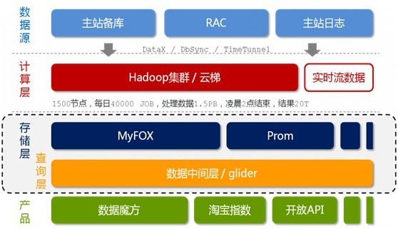
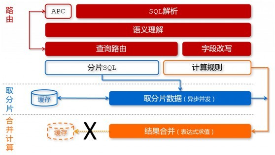
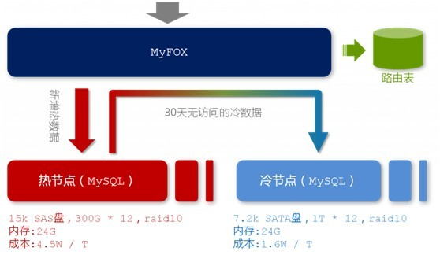
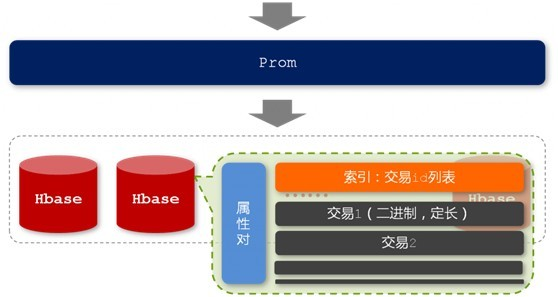
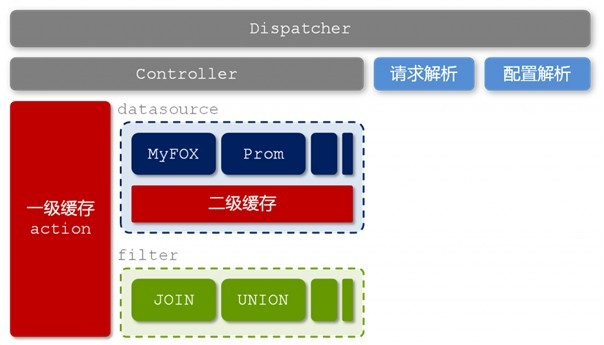

# 从hadoop框架与MapReduce模式中谈海量数据处理

## 前言

几周前，当我最初听到，以致后来初次接触Hadoop与MapReduce这两个东西，我便稍显兴奋，觉得它们很是神秘，而神秘的东西常能勾起我的兴趣，在看过介绍它们的文章或论文之后，觉得Hadoop是一项富有趣味和挑战性的技术，且它还牵扯到了一个我更加感兴趣的话题：海量数据处理。

由此，最近凡是空闲时，便在看“Hadoop”，“MapReduce”“海量数据处理”这方面的论文。但在看论文的过程中，总觉得那些论文都是浅尝辄止，常常看的很不过瘾，总是一个东西刚要讲到紧要处，它便结束了，让我好生“愤懑”。

尽管我对这个Hadoop与MapReduce知之甚浅，但我还是想记录自己的学习过程，说不定，关于这个东西的学习能督促我最终写成和“经典算法研究系列”一般的一系列文章。

Ok，闲话少说。本文从最基本的mapreduce模式，Hadoop框架开始谈起，然后由各自的架构引申开来，谈到海量数据处理，最后谈谈淘宝的海量数据产品技术架构，以为了兼备浅出与深入之效，最终，希望得到读者的喜欢与支持。谢谢。

由于本人是初次接触这两个东西，文章有任何问题，欢迎不吝指正。Ok，咱们开始吧。

## 第一部分、mapreduce模式与hadoop框架深入浅出
### 架构扼要

想读懂此文，读者必须先要明确以下几点，以作为阅读后续内容的基础知识储备：

1. Mapreduce是一种模式。
2. Hadoop是一种框架。
3. Hadoop是一个实现了mapreduce模式的开源的分布式并行编程框架。

所以，你现在，知道了什么是mapreduce，什么是hadoop，以及这两者之间最简单的联系，而本文的主旨即是，一句话概括：**在hadoop的框架上采取mapreduce的模式处理海量数据**。下面，咱们可以依次深入学习和了解mapreduce和hadoop这两个东西了。

### Mapreduce模式

前面说了，mapreduce是一种模式，一种什么模式呢?一种云计算的核心计算模式，一种分布式运算技术，也是简化的分布式编程模式，它主要用于解决问题的程序开发模型，也是开发人员拆解问题的方法。

Ok，光说不上图，没用。如下图所示，mapreduce模式的主要思想是将自动分割要执行的问题（例如程序）拆解成map（映射）和reduce（化简）的方式，流程图如下图1所示：  

在数据被分割后通过Map 函数的程序将数据映射成不同的区块，分配给计算机机群处理达到分布式运算的效果，在通过Reduce 函数的程序将结果汇整，从而输出开发者需要的结果。

MapReduce 借鉴了函数式程序设计语言的设计思想，其软件实现是指定一个Map 函数，把键值对(key/value)映射成新的键值对(key/value)，形成一系列中间结果形式的key/value 对，然后把它们传给Reduce(规约)函数，把具有相同中间形式key 的value 合并在一起。Map 和Reduce 函数具有一定的关联性。函数描述如表1 所示：  

MapReduce致力于解决大规模数据处理的问题，因此在设计之初就考虑了数据的局部性原理，利用局部性原理将整个问题分而治之。MapReduce集群由普通PC机构成，为无共享式架构。在处理之前，将数据集分布至各个节点。处理时，每个节点就近读取本地存储的数据处理（map），将处理后的数据进行合并（combine）、排序（shuffle and sort）后再分发（至reduce节点），避免了大量数据的传输，提高了处理效率。无共享式架构的另一个好处是配合复制（replication）策略，集群可以具有良好的容错性，一部分节点的down机对集群的正常工作不会造成影响。

ok，你可以再简单看看下副图，整幅图是有关hadoop的作业调优参数及原理，图的左边是MapTask运行示意图，右边是ReduceTask运行示意图：  

如上图所示，其中map阶段，当map task开始运算，并产生中间数据后并非直接而简单的写入磁盘，它首先利用内存buffer来对已经产生的buffer进行缓存，并在内存buffer中进行一些预排序来优化整个map的性能。而上图右边的reduce阶段则经历了三个阶段，分别Copy->Sort->reduce。我们能明显的看出，其中的Sort是采用的归并排序，即merge sort。

了解了什么是mapreduce，接下来，咱们可以来了解实现了mapreduce模式的开源框架—hadoop。

### Hadoop框架

前面说了，hadoop是一个框架，一个什么样的框架呢?Hadoop 是一个实现了MapReduce 计算模型的开源分布式并行编程框架，程序员可以借助Hadoop 编写程序，将所编写的程序运行于计算机机群上，从而实现对海量数据的处理。

此外，Hadoop 还提供一个分布式文件系统(HDFS）及分布式数据库（HBase）用来将数据存储或部署到各个计算节点上。所以，你可以大致认为：*Hadoop=HDFS（文件系统，数据存储技术相关）+HBase（数据库）+MapReduce（数据处理）*。Hadoop 框架如图2 所示：  

借助Hadoop 框架及云计算核心技术MapReduce 来实现数据的计算和存储，并且将HDFS 分布式文件系统和HBase 分布式数据库很好的融入到云计算框架中，从而实现云计算的分布式、并行计算和存储，并且得以实现很好的处理大规模数据的能力。

### Hadoop的组成部分

我们已经知道，Hadoop是Google的MapReduce一个Java实现。MapReduce是一种简化的分布式编程模式，让程序自动分布到一个由普通机器组成的超大集群上并发执行。*Hadoop主要由HDFS、MapReduce和HBase*等组成。具体的hadoop的组成如下图：  

由上图，我们可以看到：

1. **Hadoop HDFS**是Google GFS存储系统的开源实现，主要应用场景是作为并行计算环境（MapReduce）的基础组件，同时也是BigTable（如HBase、HyperTable）的底层分布式文件系统。HDFS采用master/slave架构。一个HDFS集群是有由一个Namenode和一定数目的Datanode组成。Namenode是一个中心服务器，负责管理文件系统的namespace和客户端对文件的访问。Datanode在集群中一般是一个节点一个，负责管理节点上它们附带的存储。在内部，一个文件其实分成一个或多个block，这些block存储在Datanode集合里。如下图所示（*HDFS体系结构图*）：  

2. **Hadoop MapReduce**是一个使用简易的软件框架，基于它写出来的应用程序能够运行在由上千个商用机器组成的大型集群上，并以一种可靠容错的方式并行处理上TB级别的数据集。

	一个MapReduce作业（job）通常会把输入的数据集切分为若干独立的数据块，由 Map任务（task）以完全并行的方式处理它们。框架会对Map的输出先进行排序，然后把结果输入给Reduce任务。通常作业的输入和输出都会被存储在文件系统中。整个框架负责任务的调度和监控，以及重新执行已经失败的任务。如下图所示（*Hadoop MapReduce处理流程图*）：  

3. **Hive是基于Hadoop的一个数据仓库工具，处理能力强而且成本低廉**。

	主要特点：

	存储方式是将结构化的数据文件映射为一张数据库表。提供类SQL语言，实现完整的SQL查询功能。可以将SQL语句转换为MapReduce任务运行，十分适合数据仓库的统计分析。

	不足之处：

	采用行存储的方式（SequenceFile）来存储和读取数据。效率低：当要读取数据表某一列数据时需要先取出所有数据然后再提取出某一列的数据，效率很低。同时，它还占用较多的磁盘空间。

	由于以上的不足，有人（查礼博士）介绍了一种将分布式数据处理系统中以记录为单位的存储结构变为以列为单位的存储结构，进而减少磁盘访问数量，提高查询处理性能。这样，由于相同属性值具有相同数据类型和相近的数据特性，以属性值为单位进行压缩存储的压缩比更高，能节省更多的存储空间。如下图所示（*行列存储的比较图*）：  

4. **HBase**  
HBase是一个分布式的、面向列的开源数据库，它不同于一般的关系数据库,是一个适合于非结构化数据存储的数据库。另一个不同的是HBase基于列的而不是基于行的模式。HBase使用和 BigTable非常相同的数据模型。用户存储数据行在一个表里。一个数据行拥有一个可选择的键和任意数量的列，一个或多个列组成一个ColumnFamily，一个Fmaily下的列位于一个HFile中，易于缓存数据。表是疏松的存储的，因此用户可以给行定义各种不同的列。在HBase中数据按主键排序，同时表按主键划分为多个HRegion，如下图所示（*HBase数据表结构图*）：

Ok，行文至此，看似洋洋洒洒近千里，但若给读者造成阅读上的负担，则不是我本意。接下来的内容，我不会再引用诸多繁杂的专业术语，以给读者心里上造成不良影响。

我再给出一副图，算是对上文所说的hadoop框架及其组成部分做个总结，如下图所示，便是hadoop的内部结构，我们可以看到，海量的数据交给hadoop处理后，在hadoop的内部中，正如上文所述：hadoop提供一个分布式文件系统（HDFS）及分布式数据库（Hbase）用来存储或部署到各个计算点上，最终在内部采取mapreduce的模式对其数据进行处理，然后输出处理结果：  

## 第二部分、淘宝海量数据产品技术架构解读—学习海量数据处理经验

在上面的本文的第一部分中，我们已经对mapreduce模式及hadoop框架有了一个深入而全面的了解。不过，如果一个东西，或者一个概念不放到实际应用中去，那么你对这个理念永远只是停留在理论之内，无法向实践迈进。

Ok，接下来，本文的第二部分，咱们以淘宝的数据魔方技术架构为依托，通过介绍淘宝的海量数据产品技术架构，来进一步学习和了解海量数据处理的经验。

### 淘宝海量数据产品技术架构

如下图2-1所示，即是淘宝的海量数据产品技术架构，咱们下面要针对这个架构来一一剖析与解读。

相信，看过本博客内其它文章的细心读者，定会发现，图2-1最初见于本博客内的此篇文章：从几幅架构图中偷得半点海量数据处理经验之上，同时，此图2-1最初发表于《程序员》8月刊，作者：朋春。

在此之前，有一点必须说明的是：本文下面的内容大都是参考自朋春先生的这篇文章：[淘宝数据魔方技术架构解析](http://www.alidata.org/archives/1789)所写，我个人所作的工作是对这篇文章的一种解读与关键技术和内容的抽取，以为读者更好的理解淘宝的海量数据产品技术架构。与此同时，还能展示我自己读此篇的思路与感悟，顺带学习，何乐而不为呢?。

Ok，不过，与本博客内之前的那篇文章（几幅架构图中偷得半点海量数据处理经验）不同，本文接下来，要详细阐述这个架构。我也做了不少准备工作（如把这图2-1打印了下来，经常琢磨）：  

图2-1 淘宝海量数据产品技术架构

好的，如上图所示，我们可以看到，淘宝的海量数据产品技术架构，分为以下五个层次，从上至下来看，它们分别是：数据源，计算层，存储层，查询层和产品层。我们来一一了解这五层：

1. 数据来源层。存放着淘宝各店的交易数据。在数据源层产生的数据，通过DataX，DbSync和Timetunel准实时的传输到下面第2点所述的“云梯”。
2. 计算层。在这个计算层内，淘宝采用的是hadoop集群，这个集群，我们暂且称之为云梯，是计算层的主要组成部分。在云梯上，系统每天会对数据产品进行不同的mapreduce计算。
3. 存储层。在这一层，淘宝采用了两个东西，一个使MyFox，一个是Prom。MyFox是基于MySQL的分布式关系型数据库的集群，Prom是基于hadoop Hbase技术 的（读者可别忘了，在上文第一部分中，咱们介绍到了这个hadoop的组成部分之一，Hbase—在hadoop之内的一个分布式的开源数据库）的一个NoSQL的存储集群。
4. 查询层。在这一层中，有一个叫做glider的东西，这个glider是以HTTP协议对外提供restful方式的接口。数据产品通过一个唯一的URL来获取到它想要的数据。同时，数据查询即是通过MyFox来查询的。下文将具体介绍MyFox的数据查询过程。
5. 产品层。简单理解，不作过多介绍。

接下来，咱们重点来了解第三层-存储层中的MyFox与Prom，然后会稍带分析下glide的技术架构，最后，再了解下缓存。文章即宣告结束。

我们知道，关系型数据库在我们现在的工业生产中有着广泛的引用，它包括Oracle，MySQL、DB2、Sybase和SQL Server等等。

### MyFOX

淘宝选择了MySQL的MyISAM引擎作为底层的数据存储引擎。且为了应对海量数据，他们设计了分布式MySQL集群的查询代理层-MyFOX。

如下图所示，是MySQL的数据查询过程：  

图2-2 MyFOX的数据查询过程

在MyFOX的每一个节点中，存放着热节点和冷节点两种节点数据。顾名思义，热节点存放着最新的，被访问频率较高的数据；冷节点，存放着相对而来比较旧的，访问频率比较低的数据。而为了存储这两种节点数据，出于硬件条件和存储成本的考虑，你当然会考虑选择两种不同的硬盘，来存储这两种访问频率不同的节点数据。如下图所示：  

图2-3 MyFOX节点结构

“热节点”，选择每分钟15000转的SAS硬盘，按照一个节点两台机器来计算，单位数据的存储成本约为4.5W/TB。相对应地，“冷数据”我们选择了每分钟7500转的SATA硬盘，单碟上能够存放更多的数据，存储成本约为1.6W/TB。

### Prom

出于文章篇幅的考虑，本文接下来不再过多阐述这个Prom了。如下面两幅图所示，他们分别表示的是Prom的存储结构以及Prom查询过程：  

图2-4 Prom的存储结构

图2-5 Prom查询过程

### glide的技术架构  

图2-6 glider的技术架构

在这一层-查询层中，淘宝主要是基于用中间层隔离前后端的理念而考虑。Glider这个中间层负责各个异构表之间的数据JOIN和UNION等计算，并且负责隔离前端产品和后端存储，提供统一的数据查询服务。

### 缓存

除了起到隔离前后端以及异构“表”之间的数据整合的作用之外，glider的另外一个不容忽视的作用便是缓存管理。我们有一点须了解，在特定的时间段内，我们认为数据产品中的数据是只读的，这是利用缓存来提高性能的理论基础。

在上文图2-6中我们看到，glider中存在两层缓存，分别是基于各个异构“表”（datasource）的二级缓存和整合之后基于独立请求的一级缓存。除此之外，各个异构“表”内部可能还存在自己的缓存机制。

图2-7 缓存控制体系

图2-7向我们展示了数据魔方在缓存控制方面的设计思路。用户的请求中一定是带了缓存控制的“命令”的，这包括URL中的query string，和HTTP头中的“If-None-Match”信息。并且，这个缓存控制“命令”一定会经过层层传递，最终传递到底层存储的异构“表”模块。

缓存系统往往有两个问题需要面对和考虑：缓存穿透与失效时的雪崩效应。

1. 缓存穿透是指查询一个一定不存在的数据，由于缓存是不命中时被动写的，并且出于容错考虑，如果从存储层查不到数据则不写入缓存，这将导致这个不存在的数据每次请求都要到存储层去查询，失去了缓存的意义。至于如何有效地解决缓存穿透问题，最常见的则是采用布隆过滤器（这个东西，在我的此篇文章中有介绍：），将所有可能存在的数据哈希到一个足够大的bitmap中，一个一定不存在的数据会被这个bitmap拦截掉，从而避免了对底层存储系统的查询压力。
 
	而在数据魔方里，淘宝采用了一个更为简单粗暴的方法，如果一个查询返回的数据为空（不管是数据不存在，还是系统故障），我们仍然把这个空结果进行缓存，但它的过期时间会很短，最长不超过五分钟。

2. 缓存失效时的雪崩效应尽管对底层系统的冲击非常可怕。但遗憾的是，这个问题目前并没有很完美的解决方案。大多数系统设计者考虑用加锁或者队列的方式保证缓存的单线程（进程）写，从而避免失效时大量的并发请求落到底层存储系统上。
	
	在数据魔方中，淘宝设计的缓存过期机制理论上能够将各个客户端的数据失效时间均匀地分布在时间轴上，一定程度上能够避免缓存同时失效带来的雪崩效应。

## 本文参考：

1. [基于云计算的海量数据存储模型](http://www.paper.edu.cn/download/downPaper/201008-300)，侯建等。
2. [基于hadoop的海量日志数据处理](http://www.paper.edu.cn/download/downPaper/201011-606)，王小森
3. [基于hadoop的大规模数据处理系统](http://wenku.baidu.com/view/b0f22a3243323968011c920d.html)，王丽兵。
4. [淘宝数据魔方技术架构解析](http://www.alidata.org/archives/1789)，朋春。
5. [Hadoop作业调优参数整理及原理](http://www.alidata.org/archives/1470)，guili。

读者点评@xdylxdyl：

1. We want to count all the books in the library. You count up shelf #1, I count up shelf #2. That's map. The more people we get, the faster it goes. Now we get together and add our individual counts. That's reduce。
2. 数据魔方里的缓存穿透,架构,空数据缓存这些和Hadoop一点关系都么有，如果是想讲一个Hadoop的具体应用的话,数据魔方这部分其实没讲清楚的。
3. 感觉你是把两个东西混在一起了。不过这两个都是挺有价值的东西,或者说数据魔方的架构比Hadoop可能更重要一些,基本上大的互联网公司都会选择这么做。Null对象的缓存保留五分钟未必会有好的结果吧,如果Null对象不是特别大,数据的更新和插入不多也可以考虑实时维护。
4. Hadoop本身很笨重，不知道在数据魔方里是否是在扮演着实时数据处理的角色?还是只是在做线下的数据分析的？

**结语**：写文章是一种学习的过程。**尊重他人劳动成果，转载请注明出处。谢谢。July、2011/8/20**。完。
