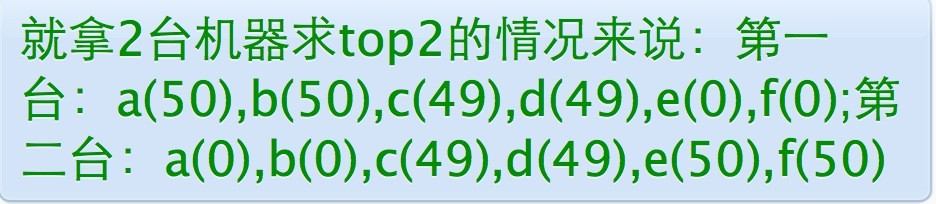

# 教你如何迅速秒杀掉：99%的海量数据处理面试题

作者：July  
出处：结构之法算法之道blog  

## 前言

一般而言，标题含有“秒杀”，“99%”，“史上最全/最强”等词汇的往往都脱不了哗众取宠之嫌，但进一步来讲，如果读者读罢此文，却无任何收获，那么，我也甘愿背负这样的罪名，:-)，同时，此文可以看做是对这篇文章：[十道海量数据处理面试题与十个方法大总结](http://blog.csdn.net/v_JULY_v/archive/2011/03/26/6279498.aspx)的一般抽象性总结。

毕竟受文章和理论之限，本文将摒弃绝大部分的细节，只谈方法/模式论，且注重用最通俗最直白的语言阐述相关问题。最后，有一点必须强调的是，全文行文是基于面试题的分析基础之上的，具体实践过程中，还是得具体情况具体分析，且各个场景下需要考虑的细节也远比本文所描述的任何一种解决方法复杂得多。

OK，若有任何问题，欢迎随时不吝赐教。谢谢。

## 何谓海量数据处理？

所谓海量数据处理，无非就是基于海量数据上的存储、处理、操作。何谓海量，就是数据量太大，所以导致要么是无法在较短时间内迅速解决，要么是数据太大，导致无法一次性装入内存。

那解决办法呢?针对时间，我们可以采用巧妙的算法搭配合适的数据结构，如Bloom filter/Hash/bit-map/堆/数据库或倒排索引/trie树，针对空间，无非就一个办法：大而化小，分而治之（hash映射），你不是说规模太大嘛，那简单啊，就把规模大化为规模小的，各个击破不就完了嘛。

至于所谓的单机及集群问题，通俗点来讲，单机就是处理装载数据的机器有限(只要考虑cpu，内存，硬盘的数据交互)，而集群，机器有多辆，适合分布式处理，并行计算(更多考虑节点和节点间的数据交互)。

再者，通过本blog内的有关海量数据处理的文章：[Big Data Processing](http://blog.csdn.net/v_july_v/article/category/1106578)，我们已经大致知道，处理海量数据问题，无非就是：

1. 分而治之/hash映射 + hash统计 + 堆/快速/归并排序；  
2. 双层桶划分  
3. Bloom filter/Bitmap；  
4. Trie树/数据库/倒排索引；  
5. 外排序；  
6. 分布式处理之Hadoop/Mapreduce。  

下面，本文第一部分、从set/map谈到hashtable/hash_map/hash_set，简要介绍下set/map/multiset/multimap，及hash_set/hash_map/hash_multiset/hash_multimap之区别**(万丈高楼平地起，基础最重要)**，而本文第二部分，则针对上述那6种方法模式结合对应的海量数据处理面试题分别具体阐述。

### 第一部分、从set/map谈到hashtable/hash_map/hash_set

稍后本文第二部分中将多次提到hash_map/hash_set，下面稍稍介绍下这些容器，以作为基础准备。一般来说，STL容器分两种，

* 序列式容器(vector/list/deque/stack/queue/heap)，  
* 关联式容器。关联式容器又分为set(集合)和map(映射表)两大类，以及这两大类的衍生体multiset(多键集合)和multimap(多键映射表)，这些容器均以RB-tree完成。此外，还有第3类关联式容器，如hashtable(散列表)，以及以hashtable为底层机制完成的hash_set(散列集合)/hash_map(散列映射表)/hash_multiset(散列多键集合)/hash_multimap(散列多键映射表)。也就是说，set/map/multiset/multimap都内含一个RB-tree，而hash_set/hash_map/hash_multiset/hash_multimap都内含一个hashtable。  

所谓关联式容器，类似关联式数据库，每笔数据或每个元素都有一个键值(key)和一个实值(value)，即所谓的Key-Value(键-值对)。当元素被插入到关联式容器中时，容器内部结构(RB-tree/hashtable)便依照其键值大小，以某种特定规则将这个元素放置于适当位置。

包括在非关联式数据库中，比如，在MongoDB内，文档(document)是最基本的数据组织形式，每个文档也是以Key-Value（键-值对）的方式组织起来。一个文档可以有多个Key-Value组合，每个Value可以是不同的类型，比如String、Integer、List等等。 

	{ "name" : "July",  
	"sex" : "male",  
	"age" : 23 }  

**set/map/multiset/multimap**

set，同map一样，所有元素都会根据元素的键值自动被排序，因为set/map两者的所有各种操作，都只是转而调用RB-tree的操作行为，不过，值得注意的是，两者都不允许两个元素有相同的键值。

不同的是：set的元素不像map那样可以同时拥有实值(value)和键值(key)，set元素的键值就是实值，实值就是键值，而map的所有元素都是pair，同时拥有实值(value)和键值(key)，pair的第一个元素被视为键值，第二个元素被视为实值。
    
至于multiset/multimap，他们的特性及用法和set/map完全相同，唯一的差别就在于它们允许键值重复，即所有的插入操作基于RB-tree的insert_equal()而非insert_unique()。

**hash_set/hash_map/hash_multiset/hash_multimap**

hash_set/hash_map，两者的一切操作都是基于hashtable之上。不同的是，hash_set同set一样，同时拥有实值和键值，且实质就是键值，键值就是实值，而hash_map同map一样，每一个元素同时拥有一个实值(value)和一个键值(key)，所以其使用方式，和上面的map基本相同。但由于hash_set/hash_map都是基于hashtable之上，所以不具备自动排序功能。为什么?因为hashtable没有自动排序功能。

至于hash_multiset/hash_multimap的特性与上面的multiset/multimap完全相同，唯一的差别就是它们hash_multiset/hash_multimap的底层实现机制是hashtable（而multiset/multimap，上面说了，底层实现机制是RB-tree），所以它们的元素都不会被自动排序，不过也都允许键值重复。

所以，综上，说白了，什么样的结构决定其什么样的性质，因为set/map/multiset/multimap都是基于RB-tree之上，所以有自动排序功能，而hash_set/hash_map/hash_multiset/hash_multimap都是基于hashtable之上，所以不含有自动排序功能，至于加个前缀multi_无非就是允许键值重复而已。

此外，

* 关于什么hash，请看blog内此篇[文章](07.3.md)；
* 关于红黑树，请参看blog内系列[文章](07.1.md)，
* 关于hash_map的具体应用：请看[这里](http://blog.csdn.net/sdhongjun/article/details/4517325)，关于hash_set：请看[此文](http://blog.csdn.net/morewindows/article/details/7330323)。

OK，接下来，请看本文第二部分、处理海量数据问题之六把密匙。

### 第二部分、处理海量数据问题之六把密匙

#### 密匙一、分而治之/Hash映射 + Hash_map统计 + 堆/快速/归并排序

##### 1、海量日志数据，提取出某日访问百度次数最多的那个IP。

###### 思路分析
既然是海量数据处理，那么可想而知，给我们的数据那就一定是海量的。针对这个数据的海量，我们如何着手呢?对的，无非就是分而治之/hash映射 + hash统计 + 堆/快速/归并排序，说白了，就是先映射，而后统计，最后排序：

1. 分而治之/hash映射：针对数据太大，内存受限的情况，可以把大文件化成(取模映射)小文件，从而大而化小，各个击破，缩小规模，逐个解决
2. hash_map统计：当大文件转化了小文件，那么我们便可以采用常规的hash_map(ip，value)来进行频率统计。
3. 堆/快速排序：统计完了之后，便进行排序(可采取堆排序)，得到次数最多的IP。

###### 解法一
具体而论，则是： “首先把这一天访问百度的日志中的IP提取出来，然后逐个写入到一个大文件中。因为IP是32位的，所以最多有个2^32个IP，故可以采用映射的方法，比如%1000，把整个大文件映射为1000个小文件，再找出每个小文中出现频率最大的IP（可以采用hash_map对那1000个文件中的所有IP进行频率统计，然后依次找出各个文件中频率最大的那个IP）及相应的频率。然后再在这1000个最大的IP中，找出那个频率最大的IP，即为所求。”

关于本题，注意两点：

1. Hash取模是一种等价映射，不会存在同一个元素分散到不同小文件中去的情况，即这里采用的是mod1000算法，那么相同的IP在hash后，只可能落在同一个文件中，不可能被分散的。
2. 那到底什么是hash映射呢？简单来说，就是为了便于计算机在有限的内存中处理big数据，从而通过一种映射散列的方式让数据均匀分布在对应的内存位置(如大数据通过取余的方式映射成小树存放在内存中，或大文件映射成多个小文件)，而这个映射散列方式便是我们通常所说的hash函数，设计的好的hash函数能让数据均匀分布而减少冲突。尽管数据映射到了另外一些不同的位置，但数据还是原来的数据，只是代替和表示这些原始数据的形式发生了变化而已。

##### 2、寻找热门查询，300万个查询字符串中统计最热门的10个查询

原题：搜索引擎会通过日志文件把用户每次检索使用的所有检索串都记录下来，每个查询串的长度为1-255字节。假设目前有一千万个记录（这些查询串的重复度比较高，虽然总数是1千万，但如果除去重复后，不超过3百万个。一个查询串的重复度越高，说明查询它的用户越多，也就是越热门），请你统计最热门的10个查询串，要求使用的内存不能超过1G。

解答：由上面第1题，我们知道，数据大则划为小的，如如一亿个Ip求Top 10，可先%1000将ip分到1000个小文件中去，并保证一种ip只出现在一个文件中，再对每个小文件中的ip进行hashmap计数统计并按数量排序，最后归并或者最小堆依次处理每个小文件的top10以得到最后的结。

但如果数据规模比较小，能一次性装入内存呢?比如这第2题，虽然有一千万个Query，但是由于重复度比较高，因此事实上只有300万的Query，每个Query255Byte，因此我们可以考虑把他们都放进内存中去（300万个字符串假设没有重复，都是最大长度，那么最多占用内存3M*1K/4=0.75G。所以可以将所有字符串都存放在内存中进行处理），而现在只是需要一个合适的数据结构，在这里，HashTable绝对是我们优先的选择。

所以我们放弃分而治之/hash映射的步骤，直接上hash统计，然后排序。So，针对此类典型的TOP K问题，采取的对策往往是：hashmap + 堆。如下所示：

1. hash_map统计：先对这批海量数据预处理。具体方法是：维护一个Key为Query字串，Value为该Query出现次数的HashTable，即hash_map(Query，Value)，每次读取一个Query，如果该字串不在Table中，那么加入该字串，并且将Value值设为1；如果该字串在Table中，那么将该字串的计数加一即可。最终我们在O(N)的时间复杂度内用Hash表完成了统计；
2. 堆排序：第二步、借助堆这个数据结构，找出Top K，时间复杂度为N‘logK。即借助堆结构，我们可以在log量级的时间内查找和调整/移动。因此，维护一个K(该题目中是10)大小的小根堆，然后遍历300万的Query，分别和根元素进行对比。所以，我们最终的时间复杂度是：O（N） + N' * O（logK），（N为1000万，N’为300万）。

别忘了这篇文章中所述的堆排序思路：“维护k个元素的最小堆，即用容量为k的最小堆存储最先遍历到的k个数，并假设它们即是最大的k个数，建堆费时O（k），并调整堆(费时O（logk）)后，有k1>k2>...kmin（kmin设为小顶堆中最小元素）。继续遍历数列，每次遍历一个元素x，与堆顶元素比较，若x>kmin，则更新堆（x入堆，用时logk），否则不更新堆。这样下来，总费时O（k*logk+（n-k）*logk）=O（n*logk）。此方法得益于在堆中，查找等各项操作时间复杂度均为logk。”--[第三章续、Top K算法问题的实现](http://blog.csdn.net/v_JULY_v/archive/2011/05/08/6403777.aspx)。

当然，你也可以采用trie树，关键字域存该查询串出现的次数，没有出现为0。最后用10个元素的最小推来对出现频率进行排序。

##### 3、有一个1G大小的一个文件，里面每一行是一个词，词的大小不超过16字节，内存限制大小是1M。返回频数最高的100个词。

由上面那两个例题，分而治之 + hash统计 + 堆/快速排序这个套路，我们已经开始有了屡试不爽的感觉。下面，再拿几道再多多验证下。请看此第3题：又是文件很大，又是内存受限，咋办?还能怎么办呢?无非还是：

1. 分而治之/hash映射：顺序读文件中，对于每个词x，取hash(x)%5000，然后按照该值存到5000个小文件（记为x0,x1,...x4999）中。这样每个文件大概是200k左右。如果其中的有的文件超过了1M大小，还可以按照类似的方法继续往下分，直到分解得到的小文件的大小都不超过1M。
2. hash_map统计：对每个小文件，采用trie树/hash_map等统计每个文件中出现的词以及相应的频率。
3. 堆/归并排序：取出出现频率最大的100个词（可以用含100个结点的最小堆）后，再把100个词及相应的频率存入文件，这样又得到了5000个文件。最后就是把这5000个文件进行归并（类似于归并排序）的过程了。

##### 4、海量数据分布在100台电脑中，想个办法高效统计出这批数据的TOP10。

如果每个数据元素只出现一次，而且只出现在某一台机器中，那么可以采取以下步骤统计出现次数TOP10的数据元素：

1. 堆排序：在每台电脑上求出TOP10，可以采用包含10个元素的堆完成（TOP10小，用最大堆，TOP10大，用最小堆，比如求TOP10大，我们首先取前10个元素调整成最小堆，如果发现，然后扫描后面的数据，并与堆顶元素比较，如果比堆顶元素大，那么用该元素替换堆顶，然后再调整为最小堆。最后堆中的元素就是TOP10大）。
2. 求出每台电脑上的TOP10后，然后把这100台电脑上的TOP10组合起来，共1000个数据，再利用上面类似的方法求出TOP10就可以了。

但如果同一个元素重复出现在不同的电脑中呢，如下例子所述：

这个时候，你可以有两种方法：

* 遍历一遍所有数据，重新hash取摸，如此使得同一个元素只出现在单独的一台电脑中，然后采用上面所说的方法，统计每台电脑中各个元素的出现次数找出TOP10，继而组合100台电脑上的TOP10，找出最终的TOP10。
* 或者，暴力求解：直接统计统计每台电脑中各个元素的出现次数，然后把同一个元素在不同机器中的出现次数相加，最终从所有数据中找出TOP10。

##### 5、有10个文件，每个文件1G，每个文件的每一行存放的都是用户的query，每个文件的query都可能重复。要求你按照query的频度排序。

方案1：直接上：

1. hash映射：顺序读取10个文件，按照hash(query)%10的结果将query写入到另外10个文件（记为a0,a1,..a9）中。这样新生成的文件每个的大小大约也1G（假设hash函数是随机的）。
2. hash_map统计：找一台内存在2G左右的机器，依次对用hash_map(query, query_count)来统计每个query出现的次数。注：hash_map(query,query_count)是用来统计每个query的出现次数，不是存储他们的值，出现一次，则count+1。
3. 堆/快速/归并排序：利用快速/堆/归并排序按照出现次数进行排序，将排序好的query和对应的query_cout输出到文件中，这样得到了10个排好序的文件（记为）。最后，对这10个文件进行归并
