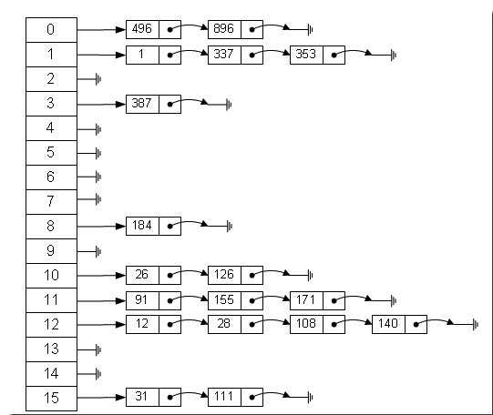
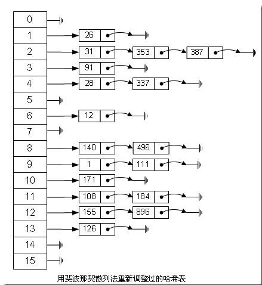

# hash表算法

##第一部分：Top K 算法详解

####问题描述
百度面试题：

搜索引擎会通过日志文件把用户每次检索使用的所有检索串都记录下来，每个查询串的长度为1-255字节。
假设目前有一千万个记录（这些查询串的重复度比较高，虽然总数是1千万，但如果除去重复后，不超过3百万个。一个查询串的重复度越高，说明查询它的用户越多，也就是越热门。），请你统计最热门的10个查询串，要求使用的内存不能超过1G。
####必备知识
什么是哈希表？

哈希表（Hash table，也叫散列表），是根据关键码值(Key value)而直接进行访问的数据结构。也就是说，它通过把关键码值映射到表中一个位置来访问记录，以加快查找的速度。这个映射函数叫做散列函数，存放记录的数组叫做散列表。

哈希表hashtable(key，value) 的做法其实很简单，就是把Key通过一个固定的算法函数既所谓的哈希函数转换成一个整型数字，然后就将该数字对数组长度进行取余，取余结果就当作数组的下标，将value存储在以该数字为下标的数组空间里。

而当使用哈希表进行查询的时候，就是再次使用哈希函数将key转换为对应的数组下标，并定位到该空间获取value，如此一来，就可以充分利用到数组的定位性能进行数据定位（文章第二、三部分，会针对Hash表详细阐述）。

问题解析：

要统计最热门查询，首先就是要统计每个Query出现的次数，然后根据统计结果，找出Top 10。所以我们可以基于这个思路分两步来设计该算法。

 即，此问题的解决分为以下**俩个步骤：**

###**第一步：Query统计**


Query统计有以下俩个方法，可供选择：

**1、直接排序法**

首先我们最先想到的的算法就是排序了，首先对这个日志里面的所有Query都进行排序，然后再遍历排好序的Query，统计每个Query出现的次数了。

但是题目中有明确要求，那就是内存不能超过1G，一千万条记录，每条记录是255Byte，很显然要占据2.375G内存，这个条件就不满足要求了。

让我们回忆一下数据结构课程上的内容，当数据量比较大而且内存无法装下的时候，我们可以采用外排序的方法来进行排序，这里我们可以采用归并排序，因为归并排序有一个比较好的时间复杂度O(NlgN)。

排完序之后我们再对已经有序的Query文件进行遍历，统计每个Query出现的次数，再次写入文件中。

综合分析一下，排序的时间复杂度是O(NlgN)，而遍历的时间复杂度是O(N)，因此该算法的总体时间复杂度就是O(N+NlgN)=O（NlgN）。

**2、Hash Table法**

在第1个方法中，我们采用了排序的办法来统计每个Query出现的次数，时间复杂度是NlgN，那么能不能有更好的方法来存储，而时间复杂度更低呢？

题目中说明了，虽然有一千万个Query，但是由于重复度比较高，因此事实上只有300万的Query，每个Query255Byte，因此我们可以考虑把他们都放进内存中去，而现在只是需要一个合适的数据结构，在这里，Hash Table绝对是我们优先的选择，因为Hash Table的查询速度非常的快，几乎是O(1)的时间复杂度。

那么，我们的算法就有了：维护一个Key为Query字串，Value为该Query出现次数的HashTable，每次读取一个Query，如果该字串不在Table中，那么加入该字串，并且将Value值设为1；如果该字串在Table中，那么将该字串的计数加一即可。最终我们在O(N)的时间复杂度内完成了对该海量数据的处理。

本方法相比算法1：在时间复杂度上提高了一个数量级，为O（N），但不仅仅是时间复杂度上的优化，该方法只需要IO数据文件一次，而算法1的IO次数较多的，因此该算法2比算法1在工程上有更好的可操作性。

###**第二步：找出Top 10**

**算法一：普通排序**

我想对于排序算法大家都已经不陌生了，这里不在赘述，我们要注意的是排序算法的时间复杂度是NlgN，在本题目中，三百万条记录，用1G内存是可以存下的。

**算法二：部分排序**

题目要求是求出Top 10，因此我们没有必要对所有的Query都进行排序，我们只需要维护一个10个大小的数组，初始化放入10个Query，按照每个Query的统计次数由大到小排序，然后遍历这300万条记录，每读一条记录就和数组最后一个Query对比，如果小于这个Query，那么继续遍历，否则，将数组中最后一条数据淘汰，加入当前的Query。最后当所有的数据都遍历完毕之后，那么这个数组中的10个Query便是我们要找的Top10了。

不难分析出，这样，算法的最坏时间复杂度是N\*K， 其中K是指top多少。

**算法三：堆**

在算法二中，我们已经将时间复杂度由NlogN优化到NK，不得不说这是一个比较大的改进了，可是有没有更好的办法呢？

分析一下，在算法二中，每次比较完成之后，需要的操作复杂度都是K，因为要把元素插入到一个线性表之中，而且采用的是顺序比较。这里我们注意一下，该数组是有序的，一次我们每次查找的时候可以采用二分的方法查找，这样操作的复杂度就降到了logK，可是，随之而来的问题就是数据移动，因为移动数据次数增多了。不过，这个算法还是比算法二有了改进。

基于以上的分析，我们想想，有没有一种既能快速查找，又能快速移动元素的数据结构呢？回答是肯定的，那就是堆。

借助堆结构，我们可以在log量级的时间内查找和调整/移动。因此到这里，我们的算法可以改进为这样，维护一个K(该题目中是10)大小的小根堆，然后遍历300万的Query，**分别和根元素进行对比。**

具体过程是，堆顶存放的是整个堆中最小的数，现在遍历N个数，把最先遍历到的k个数存放到最小堆中，并假设它们就是我们要找的最大的k个数，X1>X2...Xmin(堆顶)，而后遍历后续的N-K个数，一一与堆顶元素进行比较，如果遍历到的Xi大于堆顶元素Xmin，则把Xi放入堆中，而后更新整个堆，更新的时间复杂度为logK，如果Xi<Xmin，则不更新堆，整个过程的复杂度为O(K)+O(（N-K）*logK)=O（N*logK）。

（堆排序的3D动画演示可以参看此链接：[http://www.benfrederickson.com/2013/10/10/heap-visualization.html](http://www.benfrederickson.com/2013/10/10/heap-visualization.html)）

思想与上述算法二一致，只是算法在算法三，我们采用了最小堆这种数据结构代替数组，把查找目标元素的时间复杂度有O（K）降到了O（logK）。

那么这样，采用堆数据结构，算法三，最终的时间复杂度就降到了N‘logK，和算法二相比，又有了比较大的改进。

###**总结：**

至此，算法就完全结束了，经过上述第一步、先用Hash表统计每个Query出现的次数，O（N）；然后第二步、采用堆数据结构找出Top 10，N\*O（logK）。所以，我们最终的时间复杂度是：O（N） + N'\*O（logK）。（N为1000万，N’为300万）。如果各位有什么更好的算法，欢迎留言评论。

此外，还可以看下此文第二部分的第二题：[教你如何迅速秒杀掉：99%的海量数据处理面试题](08.01.md)


##第二部分、Hash表 算法的详细解析

###**什么是Hash**

Hash，一般翻译做“散列”，也有直接音译为“哈希”的，就是把任意长度的输入（又叫做预映射， pre-image），通过散列算法，变换成固定长度的输出，该输出就是散列值。这种转换是一种压缩映射，也就是，散列值的空间通常远小于输入的空间，不同的输入可能会散列成相同的输出，而不可能从散列值来唯一的确定输入值。简单的说就是一种将任意长度的消息压缩到某一固定长度的消息摘要的函数。

HASH主要用于信息安全领域中加密算法，它把一些不同长度的信息转化成杂乱的128位的编码,这些编码值叫做HASH值. 也可以说，hash就是找到一种数据内容和数据存放地址之间的映射关系。
 
数组的特点是：寻址容易，插入和删除困难；而链表的特点是：寻址困难，插入和删除容易。那么我们能不能综合两者的特性，做出一种寻址容易，插入删除也容易的数据结构？答案是肯定的，这就是我们要提起的哈希表，哈希表有多种不同的实现方法，我接下来解释的是最常用的一种方法——拉链法，我们可以理解为“链表的数组”，如图：



左边很明显是个数组，数组的每个成员包括一个指针，指向一个链表的头，当然这个链表可能为空，也可能元素很多。我们根据元素的一些特征把元素分配到不同的链表中去，也是根据这些特征，找到正确的链表，再从链表中找出这个元素。

元素特征转变为数组下标的方法就是散列法。散列法当然不止一种，下面列出三种比较常用的：
 
**1，除法散列法**

最直观的一种，上图使用的就是这种散列法，公式： 

index = value % 16  

学过汇编的都知道，求模数其实是通过一个除法运算得到的，所以叫“除法散列法”。

**2，平方散列法**

求index是非常频繁的操作，而乘法的运算要比除法来得省时（对现在的CPU来说，估计我们感觉不出来），所以我们考虑把除法换成乘法和一个位移操作。公式： 

index = (value * value) >> 28   （右移，除以2^28。记法：左移变大，是乘。右移变小，是除。）

如果数值分配比较均匀的话这种方法能得到不错的结果，但我上面画的那个图的各个元素的值算出来的index都是0——非常失败。也许你还有个问题，value如果很大，value * value不会溢出吗？答案是会的，但我们这个乘法不关心溢出，因为我们根本不是为了获取相乘结果，而是为了获取index。

**3，斐波那契（Fibonacci）散列法**

平方散列法的缺点是显而易见的，所以我们能不能找出一个理想的乘数，而不是拿value本身当作乘数呢？答案是肯定的。

1. 对于16位整数而言，这个乘数是40503 
2. 对于32位整数而言，这个乘数是2654435769 
3. 对于64位整数而言，这个乘数是11400714819323198485

这几个“理想乘数”是如何得出来的呢？这跟一个法则有关，叫黄金分割法则，而描述黄金分割法则的最经典表达式无疑就是著名的斐波那契数列，即如此形式的序列：0, 1, 1, 2, 3, 5, 8, 13, 21, 34, 55, 89, 144, 233, 377, 610， 987, 1597, 2584, 4181, 6765, 10946，…。另外，斐波那契数列的值和太阳系八大行星的轨道半径的比例出奇吻合。

对我们常见的32位整数而言，公式：

index = (value * 2654435769) >> 28

如果用这种斐波那契散列法的话，那上面的图就变成这样了：
 


注：用斐波那契散列法调整之后会比原来的取摸散列法好很多。

###**适用范围**

快速查找，删除的基本数据结构，通常需要总数据量可以放入内存。

###**基本原理及要点**

hash函数选择，针对字符串，整数，排列，具体相应的hash方法。

碰撞处理，一种是open hashing，也称为拉链法；另一种就是closed hashing，也称开地址法，opened addressing。

###**扩展**

d-left hashing中的d是多个的意思，我们先简化这个问题，看一看2-left hashing。2-left hashing指的是将一个哈希表分成长度相等的两半，分别叫做T1和T2，给T1和T2分别配备一个哈希函数，h1和h2。在存储一个新的key时，同 时用两个哈希函数进行计算，得出两个地址h1[key]和h2[key]。这时需要检查T1中的h1[key]位置和T2中的h2[key]位置，哪一个 位置已经存储的（有碰撞的）key比较多，然后将新key存储在负载少的位置。如果两边一样多，比如两个位置都为空或者都存储了一个key，就把新key 存储在左边的T1子表中，2-left也由此而来。在查找一个key时，必须进行两次hash，同时查找两个位置。

###**问题实例（海量数据处理）**

我们知道hash 表在海量数据处理中有着广泛的应用，下面，请看另一道百度面试题：

题目：海量日志数据，提取出某日访问百度次数最多的那个IP。

方案：IP的数目还是有限的，最多2^32个，所以可以考虑使用hash将ip直接存入内存，然后进行统计。

##第三部分、最快的Hash表算法

接下来，咱们来具体分析一下一个最快的Hasb表算法。

我们由一个简单的问题逐步入手：有一个庞大的字符串数组，然后给你一个单独的字符串，让你从这个数组中查找是否有这个字符串并找到它，你会怎么做？有一个方法最简单，老老实实从头查到尾，一个一个比较，直到找到为止，我想只要学过程序设计的人都能把这样一个程序作出来，但要是有程序员把这样的程序交给用户，我只能用无语来评价，或许它真的能工作，但...也只能如此了。

最合适的算法自然是使用HashTable（哈希表），先介绍介绍其中的基本知识，所谓Hash，一般是一个整数，通过某种算法，可以把一个字符串"压缩" 成一个整数。当然，无论如何，一个32位整数是无法对应回一个字符串的，但在程序中，两个字符串计算出的Hash值相等的可能非常小，下面看看在MPQ中的Hash算法（参看自此文：[http://sfsrealm.hopto.org/inside_mopaq/chapter2.htm](http://sfsrealm.hopto.org/inside_mopaq/chapter2.htm)）：

**函数一、**以下的函数生成一个长度为0x500（合10进制数：1280）的cryptTable[0x500]

```c
void prepareCryptTable()
{ 
    unsigned long seed = 0x00100001, index1 = 0, index2 = 0, i;
 
    for( index1 = 0; index1 < 0x100; index1++ )
    { 
        for( index2 = index1, i = 0; i < 5; i++, index2 += 0x100 )
        { 
            unsigned long temp1, temp2;
 
            seed = (seed * 125 + 3) % 0x2AAAAB;
            temp1 = (seed & 0xFFFF) << 0x10;
 
            seed = (seed * 125 + 3) % 0x2AAAAB;
            temp2 = (seed & 0xFFFF);
 
            cryptTable[index2] = ( temp1 | temp2 ); 
       } 
   } 
} 
```

**函数二、**以下函数计算lpszFileName 字符串的hash值，其中dwHashType 为hash的类型，在下面的函数三、GetHashTablePos函数中调用此函数二，其可以取的值为0、1、2；该函数返回lpszFileName 字符串的hash值：

```c
unsigned long HashString( char *lpszFileName, unsigned long dwHashType )
{ 
    unsigned char *key  = (unsigned char *)lpszFileName;
unsigned long seed1 = 0x7FED7FED;
unsigned long seed2 = 0xEEEEEEEE;
    int ch;
 
    while( *key != 0 )
    { 
        ch = toupper(*key++);
 
        seed1 = cryptTable[(dwHashType << 8) + ch] ^ (seed1 + seed2);
        seed2 = ch + seed1 + seed2 + (seed2 << 5) + 3; 
    }
    return seed1; 
}
```

Blizzard的这个算法是非常高效的，被称为"One-Way Hash"( A one-way hash is a an algorithm that is constructed in such a way that deriving the original string (set of strings, actually) is virtually impossible)。举个例子，字符串"unitneutralacritter.grp"通过这个算法得到的结果是0xA26067F3。

是不是把第一个算法改进一下，改成逐个比较字符串的Hash值就可以了呢，答案是，远远不够，要想得到最快的算法，就不能进行逐个的比较，通常是构造一个哈希表(Hash Table)来解决问题，哈希表是一个大数组，这个数组的容量根据程序的要求来定义，例如1024，每一个Hash值通过取模运算 (mod) 对应到数组中的一个位置，这样，只要比较这个字符串的哈希值对应的位置有没有被占用，就可以得到最后的结果了，想想这是什么速度？是的，是最快的O(1)，现在仔细看看这个算法吧：

```c
typedef struct
{
    int nHashA;
    int nHashB;
    char bExists;
   ......
} SOMESTRUCTRUE;
```

一种可能的结构体定义？

**函数三、**下述函数为在Hash表中查找是否存在目标字符串，有则返回要查找字符串的Hash值，无则，return -1.

```c
int GetHashTablePos( har *lpszString, SOMESTRUCTURE *lpTable ) 
//lpszString要在Hash表中查找的字符串，lpTable为存储字符串Hash值的Hash表。
{ 
    int nHash = HashString(lpszString);  //调用上述函数二，返回要查找字符串lpszString的Hash值。
    int nHashPos = nHash % nTableSize;
 
    if ( lpTable[nHashPos].bExists  &&  !strcmp( lpTable[nHashPos].pString, lpszString ) ) 
    {  //如果找到的Hash值在表中存在，且要查找的字符串与表中对应位置的字符串相同，
        return nHashPos;    //则返回上述调用函数二后，找到的Hash值
    } 
    else
    {
        return -1;  
    } 
}
```

看到此，我想大家都在想一个很严重的问题：“如果两个字符串在哈希表中对应的位置相同怎么办？”,毕竟一个数组容量是有限的，这种可能性很大。解决该问题的方法很多，我首先想到的就是用“链表”,感谢大学里学的数据结构教会了这个百试百灵的法宝，我遇到的很多算法都可以转化成链表来解决，只要在哈希表的每个入口挂一个链表，保存所有对应的字符串就OK了。事情到此似乎有了完美的结局，如果是把问题独自交给我解决，此时我可能就要开始定义数据结构然后写代码了。

然而Blizzard的程序员使用的方法则是更精妙的方法。基本原理就是：他们在哈希表中不是用一个哈希值而是用三个哈希值来校验字符串。

MPQ使用文件名哈希表来跟踪内部的所有文件。但是这个表的格式与正常的哈希表有一些不同。首先，它没有使用哈希作为下标，把实际的文件名存储在表中用于验证，实际上它根本就没有存储文件名。而是使用了3种不同的哈希：一个用于哈希表的下标，两个用于验证。这两个验证哈希替代了实际文件名。

当然了，这样仍然会出现2个不同的文件名哈希到3个同样的哈希。但是这种情况发生的概率平均是：1:18889465931478580854784，这个概率对于任何人来说应该都是足够小的。现在再回到数据结构上，Blizzard使用的哈希表没有使用链表，而采用"顺延"的方式来解决问题，看看这个算法：

**函数四、**lpszString 为要在hash表中查找的字符串；lpTable 为存储字符串hash值的hash表；nTableSize 为hash表的长度：

```c
int GetHashTablePos( char *lpszString, MPQHASHTABLE *lpTable, int nTableSize )
{
    const int  HASH_OFFSET = 0, HASH_A = 1, HASH_B = 2;
 
    int  nHash = HashString( lpszString, HASH_OFFSET );
    int  nHashA = HashString( lpszString, HASH_A );
    int  nHashB = HashString( lpszString, HASH_B );
    int  nHashStart = nHash % nTableSize;
    int  nHashPos = nHashStart;
 
    while ( lpTable[nHashPos].bExists )
   {
     /*如果仅仅是判断在该表中时候存在这个字符串，就比较这两个hash值就可以了，不用对
     *结构体中的字符串进行比较。这样会加快运行的速度？减少hash表占用的空间？这种
      *方法一般应用在什么场合？*/
        if ( 　 lpTable[nHashPos].nHashA == nHashA
        &&  lpTable[nHashPos].nHashB == nHashB )
       {
            return nHashPos;
       }
       else
       {
            nHashPos = (nHashPos + 1) % nTableSize;
       }
 
        if (nHashPos == nHashStart)
              break;
    }
     return -1;
}
```

上述程序解释：

1. 计算出字符串的三个哈希值（一个用来确定位置，另外两个用来校验)
2. 察看哈希表中的这个位置
3. 哈希表中这个位置为空吗？如果为空，则肯定该字符串不存在，返回-1。
4. 如果存在，则检查其他两个哈希值是否也匹配，如果匹配，则表示找到了该字符串，返回其Hash值。
5. 移到下一个位置，如果已经移到了表的末尾，则反绕到表的开始位置起继续查询　
6. 看看是不是又回到了原来的位置，如果是，则返回没找到
7. 回到3

ok，这就是本文中所说的最快的Hash表算法。什么?不够快?:D。欢迎，各位批评指正。

- - -
补充1、一个简单的hash函数：

```c
/*key为一个字符串，nTableLength为哈希表的长度
*该函数得到的hash值分布比较均匀*/
unsigned long getHashIndex( const char *key, int nTableLength )
{
    unsigned long nHash = 0;
   
    while (*key)
    {
        nHash = (nHash<<5) + nHash + *key++;
    }
        
    return ( nHash % nTableLength );
}
```

补充2、一个完整测试程序：

哈希表的数组是定长的，如果太大，则浪费，如果太小，体现不出效率。合适的数组大小是哈希表的性能的关键。哈希表的尺寸最好是一个质数。当然，根据不同的数据量，会有不同的哈希表的大小。对于数据量时多时少的应用，最好的设计是使用动态可变尺寸的哈希表，那么如果你发现哈希表尺寸太小了，比如其中的元素是哈希表尺寸的2倍时，我们就需要扩大哈希表尺寸，一般是扩大一倍。

下面是哈希表尺寸大小的可能取值：

||||||
|:-----------|------------:|:------------:|:------------:|:------------:|
|17,         |37,          |   79,        |163,          |331,          |
|673,        |   1361,     |   2729,      | 5471,        | 10949,       | 
|21911,      |    43853,   |   87719,     | 175447,      | 350899,      |  
|701819,     |    1403641, |   2807303,   |  5614657,    | 11229331,    |
|22458671,   |    44917381,|    89834777, |   179669557, |  359339171,  |
|718678369,  |1437356741,  |2147483647    |            

以下为该程序的完整源码，已在linux下测试通过：

```c
#include <stdio.h>  
#include <ctype.h>     //多谢citylove指正。  
//crytTable[]里面保存的是HashString函数里面将会用到的一些数据，在prepareCryptTable  
//函数里面初始化  
unsigned long cryptTable[0x500];  
  
//以下的函数生成一个长度为0x500（合10进制数：1280）的cryptTable[0x500]  
void prepareCryptTable()  
{   
    unsigned long seed = 0x00100001, index1 = 0, index2 = 0, i;  
  
    for( index1 = 0; index1 < 0x100; index1++ )  
    {   
        for( index2 = index1, i = 0; i < 5; i++, index2 += 0x100 )  
        {   
            unsigned long temp1, temp2;  
  
            seed = (seed * 125 + 3) % 0x2AAAAB;  
            temp1 = (seed & 0xFFFF) << 0x10;  
  
            seed = (seed * 125 + 3) % 0x2AAAAB;  
            temp2 = (seed & 0xFFFF);  
  
            cryptTable[index2] = ( temp1 | temp2 );   
       }   
   }   
}  
  
//以下函数计算lpszFileName 字符串的hash值，其中dwHashType 为hash的类型，  
//在下面GetHashTablePos函数里面调用本函数，其可以取的值为0、1、2；该函数  
//返回lpszFileName 字符串的hash值；  
unsigned long HashString( char *lpszFileName, unsigned long dwHashType )  
{   
    unsigned char *key  = (unsigned char *)lpszFileName;  
unsigned long seed1 = 0x7FED7FED;  
unsigned long seed2 = 0xEEEEEEEE;  
    int ch;  
  
    while( *key != 0 )  
    {   
        ch = toupper(*key++);  
  
        seed1 = cryptTable[(dwHashType << 8) + ch] ^ (seed1 + seed2);  
        seed2 = ch + seed1 + seed2 + (seed2 << 5) + 3;   
    }  
    return seed1;   
}  
  
//在main中测试argv[1]的三个hash值：  
//./hash  "arr/units.dat"  
//./hash  "unit/neutral/acritter.grp"  
int main( int argc, char **argv )  
{  
    unsigned long ulHashValue;  
    int i = 0;  
  
    if ( argc != 2 )  
    {  
        printf("please input two arguments/n");  
        return -1;  
    }  
  
     /*初始化数组：crytTable[0x500]*/  
     prepareCryptTable();  
  
     /*打印数组crytTable[0x500]里面的值*/  
     for ( ; i < 0x500; i++ )  
     {  
         if ( i % 10 == 0 )  
         {  
             printf("/n");  
         }  
  
         printf("%-12X", cryptTable[i] );  
     }  
  
     ulHashValue = HashString( argv[1], 0 );  
     printf("/n----%X ----/n", ulHashValue );  
  
     ulHashValue = HashString( argv[1], 1 );  
     printf("----%X ----/n", ulHashValue );  
  
     ulHashValue = HashString( argv[1], 2 );  
     printf("----%X ----/n", ulHashValue );  
  
     return 0;  
} 
```
