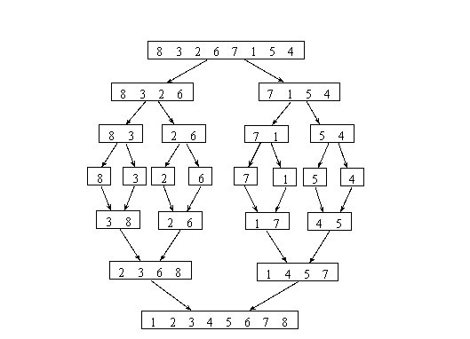
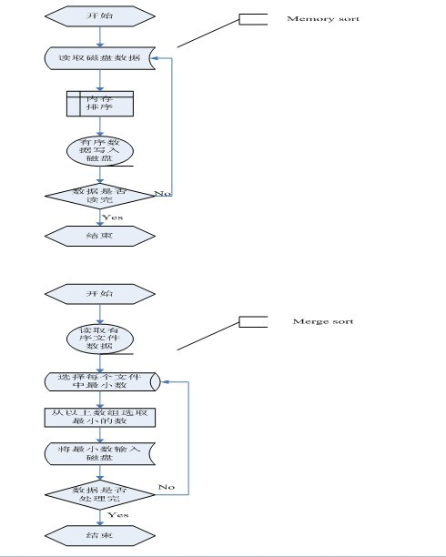
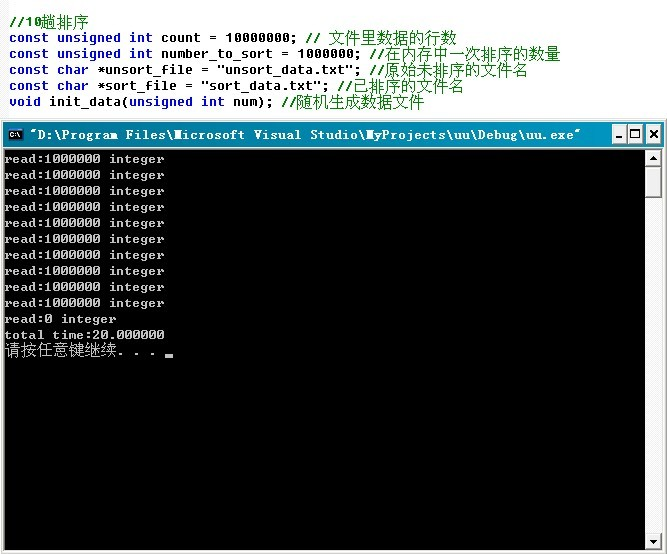
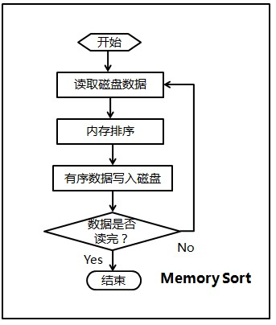
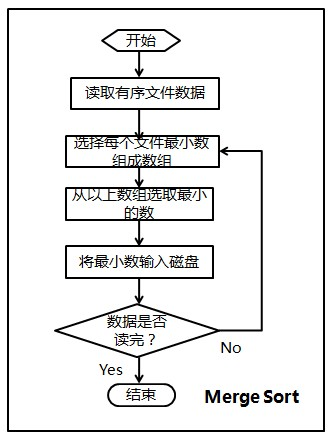
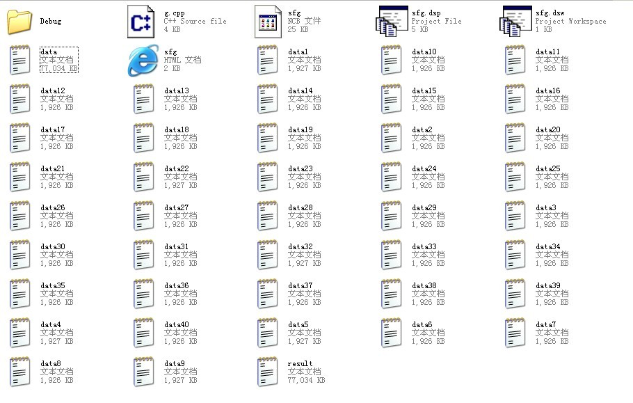
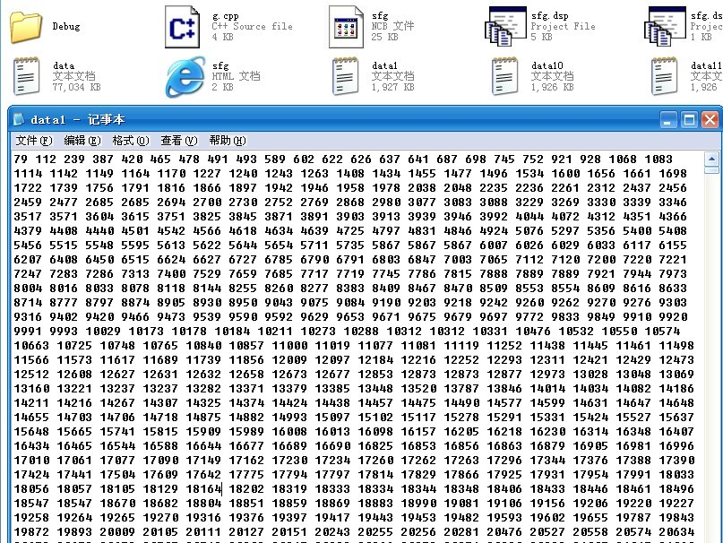
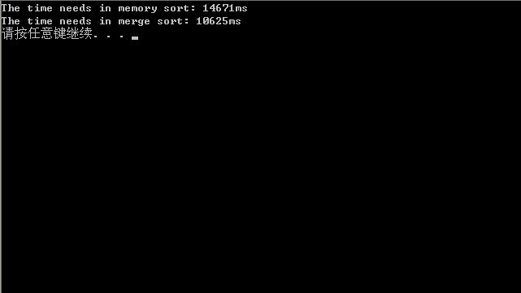
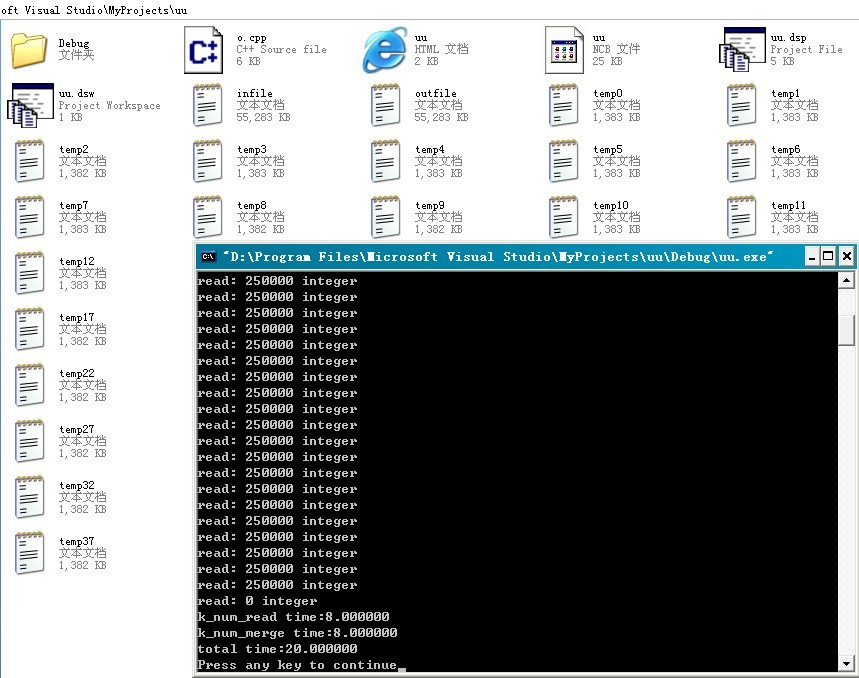
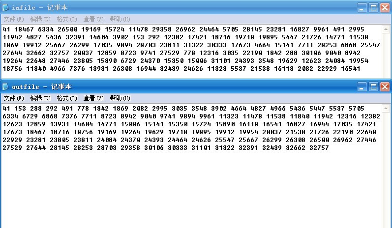

# 第十章：如何给10^7个数据量的磁盘文件排序

作者:July，yansha，5，编程艺术室。
出处：http://blog.csdn.net/v_JULY_v 。

####前奏

经过几天的痛苦沉思，最终决定，把原程序员面试题狂想曲系列正式更名为程序员编程艺术系列，同时，狂想曲创作组更名为编程艺术室。之所以要改名，我们考虑到三点：1、为面试服务不能成为我们最终或最主要的目的，2、我更愿把解答一道道面试题，ACM题等各类程序设计题目的过程，当做一种艺术来看待，3、艺术的提炼本身是一个非常非常艰难的过程，但我们乐意接受这个挑战。

ok，如果任何人对本编程艺术系列有任何意见，或发现了本编程艺术系列任何问题，漏洞，bug，欢迎随时提出，我们将虚心接受并感激不尽，以为他人创造更好的价值，更好的服务。

####第一节、如何给磁盘文件排序
问题描述：
输入：给定一个文件，里面最多含有n个不重复的正整数（也就是说可能含有少于n个不重复正整数），且其中每个数都小于等于n，n=10^7。
输出：得到按从小到大升序排列的包含所有输入的整数的列表。
条件：最多有大约1MB的内存空间可用，但磁盘空间足够。且要求运行时间在5分钟以下，10秒为最佳结果。

分析：下面咱们来一步一步的解决这个问题，

######1. 归并排序

你可能会想到把磁盘文件进行归并排序，但题目要求你只有1MB的内存空间可用，所以，归并排序这个方法不行。

######2. 位图方案

熟悉位图的朋友可能会想到用位图来表示这个文件集合。例如正如编程珠玑一书上所述，用一个20位长的字符串来表示一个所有元素都小于20的简单的非负整数集合，边框用如下字符串来表示集合{1,2,3,5,8,13}：

		0 1 1 1 0 1 0 0 1 0 0 0 0 1 0 0 0 0 0 0

上述集合中各数对应的位置则置1，没有对应的数的位置则置0。

参考编程珠玑一书上的位图方案，针对我们的10^7个数据量的磁盘文件排序问题，我们可以这么考虑，由于每个7位十进制整数表示一个小于1000万的整数。我们可以使用一个具有1000万个位的字符串来表示这个文件，其中，当且仅当整数i在文件中存在时，第i位为1。采取这个位图的方案是因为我们面对的这个问题的特殊性：

1. 输入数据限制在相对较小的范围内，
2. 数据没有重复，
3. 其中的每条记录都是单一的整数，没有任何其它与之关联的数据。

所以，此问题用位图的方案分为以下三步进行解决：

* 第一步，将所有的位都置为0，从而将集合初始化为空。
* 第二步，通过读入文件中的每个整数来建立集合，将每个对应的位都置为1。
* 第三步，检验每一位，如果该位为1，就输出对应的整数。

经过以上三步后，产生有序的输出文件。令n为位图向量中的位数（本例中为1000 0000），程序可以用伪代码表示如下：
    
    //磁盘文件排序位图方案的伪代码  
    //copyright@ Jon Bentley  
    //July、updated，2011.05.29。  
      
    //第一步，将所有的位都初始化为0  
    for i ={0,....n}      
       bit[i]=0;  
    //第二步，通过读入文件中的每个整数来建立集合，将每个对应的位都置为1。  
    for each i in the input file     
       bit[i]=1;  
      
    //第三步，检验每一位，如果该位为1，就输出对应的整数。  
    for i={0...n}      
      if bit[i]==1        
        write i on the output file  

上面只是为了简单介绍下位图算法的伪代码之抽象级描述。显然，咱们面对的问题，可不是这么简单。下面，我们试着针对这个要分两趟给磁盘文件排序的具体问题编写完整代码，如下。
    
```cpp
//copyright@ yansha  
//July、2010.05.30。  
//位图方案解决10^7个数据量的文件的排序问题  
//如果有重复的数据，那么只能显示其中一个 其他的将被忽略  
#include <iostream>  
#include <bitset>  
#include <assert.h>  
#include <time.h>  
using namespace std;  

const int max_each_scan = 5000000;  

int main()  
{  
clock_t begin = clock();  
bitset<max_each_scan> bit_map;  
bit_map.reset();  
  
// open the file with the unsorted data  
FILE *fp_unsort_file = fopen("data.txt", "r");  
assert(fp_unsort_file);  
int num;  

// the first time scan to sort the data between 0 - 4999999  
while (fscanf(fp_unsort_file, "%d ", &num) != EOF)  
{  
    if (num < max_each_scan)  
        bit_map.set(num, 1);  
}  
  
FILE *fp_sort_file = fopen("sort.txt", "w");  
assert(fp_sort_file);  
int i;  
  
// write the sorted data into file  
for (i = 0; i < max_each_scan; i++)  
{  
    if (bit_map[i] == 1)  
        fprintf(fp_sort_file, "%d ", i);  
}  
  
// the second time scan to sort the data between 5000000 - 9999999  
int result = fseek(fp_unsort_file, 0, SEEK_SET);  
if (result)  
    cout << "fseek failed!" << endl;  
else  
{  
    bit_map.reset();  
    while (fscanf(fp_unsort_file, "%d ", &num) != EOF)  
    {  
        if (num >= max_each_scan && num < 10000000)  
        {  
            num -= max_each_scan;  
            bit_map.set(num, 1);  
        }  
    }  
    for (i = 0; i < max_each_scan; i++)  
    {  
        if (bit_map[i] == 1)  
            fprintf(fp_sort_file, "%d ", i + max_each_scan);  
    }  
}  
  
clock_t end = clock();  
cout<<"用位图的方法，耗时："<<endl;  
cout << (end - begin) / CLK_TCK << "s" << endl;  
fclose(fp_sort_file);  
fclose(fp_unsort_file);  
return 0;  
}  
```


而后测试了一下上述程序的运行时间，采取位图方案耗时14s，即14000ms：


本章中，生成大数据量（1000w）的程序如下，下文第二节的多路归并算法的c++实现和第三节的磁盘文件排序的编程实现中，生成的1000w数据量也是用本程序产生的，且本章内生成的1000w数据量的数据文件统一命名为“data.txt”。
    
```cpp
//purpose:  生成随机的不重复的测试数据  
//copyright@ 2011.04.19 yansha  
//1000w数据量，要保证生成不重复的数据量，一般的程序没有做到。  
//但，本程序做到了。  
//July、2010.05.30。  
#include <iostream>  
#include <time.h>  
#include <assert.h>  
using namespace std;  

const int size = 10000000;  
int num[size];  

int main()  
{  
int n;  
FILE *fp = fopen("data.txt", "w");  
assert(fp);  

for (n = 1; n <= size; n++)    
    //之前此处写成了n=0;n<size。导致下面有一段小程序的测试数据出现了0，特此订正。  
    num[n] = n;  
srand((unsigned)time(NULL));  
int i, j;  

for (n = 0; n < size; n++)  
{  
    i = (rand() * RAND_MAX + rand()) % 10000000;  
    j = (rand() * RAND_MAX + rand()) % 10000000;  
    swap(num[i], num[j]);  
}  

for (n = 0; n < size; n++)  
    fprintf(fp, "%d ", num[n]);  
fclose(fp);  
return 0;  
}
```

不过很快，我们就将意识到，用此位图方法，严格说来还是不太行，空间消耗10^7/8还是大于1M（1M=1024*1024空间，小于10^7/8）。

既然如果用位图方案的话，我们需要约1.25MB（若每条记录是8位的正整数的话，则10000000/(1024*1024*8) ~= 1.2M）的空间，而现在只有1MB的可用存储空间，那么究竟该作何处理呢?

updated && correct：

   @yansha： 上述的位图方案，共需要扫描输入数据两次，具体执行步骤如下：

第一次，只处理1—4999999之间的数据，这些数都是小于5000000的，对这些数进行位图排序，只需要约5000000/8=625000Byte，也就是0.625M，排序后输出。
第二次，扫描输入文件时，只处理4999999-10000000的数据项，也只需要0.625M（可以使用第一次处理申请的内存）。
因此，总共也只需要0.625M
位图的的方法有必要强调一下，就是位图的适用范围为针对不重复的数据进行排序，若数据有重复，位图方案就不适用了。

######3、多路归并

诚然，在面对本题时，还可以通过计算分析出可以用如2的位图法解决，但实际上，很多的时候，我们都面临着这样一个问题，文件太大，无法一次性放入内存中计算处理，那这个时候咋办呢？分而治之，大而化小，也就是把整个大文件分为若干大小的几块，然后分别对每一块进行排序，最后完成整个过程的排序。k趟算法可以在kn的时间开销内和n/k的空间开销内完成对最多n个小于n的无重复正整数的排序。

比如可分为2块（k=2，1趟反正占用的内存只有1.25/2M），1~4999999，和5000000~9999999。先遍历一趟，首先排序处理1~4999999之间的整数（用5000000/8=625000个字的存储空间来排序0~4999999之间的整数），然后再第二趟，对5000001~1000000之间的整数进行排序处理。在稍后的第二节、第三节、第四节，我们将详细阐述并实现这种多路归并排序磁盘文件的方案。

######4、读者思考

经过上述思路3的方案之后，现在有两个局部有序的数组了，那么要得到一个完整的排序的数组，接下来改怎么做呢?或者说，如果是K路归并，得到k个排序的子数组，把他们合并成一个完整的排序数组，如何优化？或者，我再问你一个问题，K路归并用败者树 和 胜者树 效率有什么差别?这些问题，请读者思考。

####第二节、多路归并算法的c++实现

本节咱们暂抛开咱们的问题，阐述下有关多路归并算法的c++实现问题。在稍后的第三节，咱们再来具体针对咱们的磁盘文件排序问题阐述与实现。

在了解多路归并算法之前，你还得了解归并排序的过程，因为下面的多路归并算法就是基于这个流程的。其实归并排序就是2路归并，而多路归并算法就是把2换成了k，即多（k）路归并。下面，举个例子来说明下此归并排序算法，如下图所示，我们对数组8 3 2 6 7 1 5 4进行归并排序：



**归并排序算法简要介绍：**

一、思路描述：

设两个有序的子文件(相当于输入堆)放在同一向量中相邻的位置上：R[low..m]，R[m+1..high]，先将它们合并到一个局部的暂存向量R1(相当于输出堆)中，待合并完成后将R1复制回R[low..high]中。

二路归并排序的过程是：

    (1)把无序表中的每一个元素都看作是一个有序表，则有n个有序子表；
    (2)把n个有序子表按相邻位置分成若干对（若n为奇数，则最后一个子表单独作为一组），每对中的两个子表进行归并，归并后子表数减少一半；
    (3)反复进行这一过程，直到归并为一个有序表为止。

二路归并排序过程的核心操作是将一维数组中相邻的两个有序表归并为一个有序表。

二、分类：

归并排序可分为：多路归并排序、两路归并排序 。
若归并的有序表有两个，叫做二路归并。一般地，若归并的有序表有k个，则称为k路归并。二路归并最为简单和常用，既适用于内部排序，也适用于外部排序。本文着重讨论外部排序下的多（K）路归并算法。

三、算法分析：

    1、稳定性:归并排序是一种稳定的排序。
    2、存储结构要求:可用顺序存储结构。也易于在链表上实现。
    3、时间复杂度: 对长度为n的文件，需进行lgn趟二路归并，每趟归并的时间为O(n)，故其时间复杂度无论是在最好情况下还是在最坏情况下均是O(nlgn)。。
    4、空间复杂度:需要一个辅助向量来暂存两有序子文件归并的结果，故其辅助空间复杂度为O(n)，显然它不是就地排序。
       注意:若用单链表做存储结构，很容易给出就地的归并排序。

总结：与快速排序相比，归并排序的最大特点是，它是一种稳定的排序方法。归并排序一般多用于外排序。但它在内排方面也占有重要地位，因为它是基于比较的时间复杂度为O(N*Log(N))的排序算法中唯一稳定的排序，所以在需要稳定内排序时通常会选择归并排序。归并排序不要求对序列可以很快地进行随机访问，所以在链表排序的实现中很受欢迎。

好的，介绍完了归并排序后，回到咱们的问题。由第一节，我们已经知道，当数据量大到不适合在内存中排序时，可以利用多路归并算法对磁盘文件进行排序。

我们以一个包含很多个整数的大文件为例，来说明多路归并的外排序算法基本思想。假设文件中整数个数为N(N是亿级的)，整数之间用空格分开。首先分多次从该文件中读取M（十万级）个整数，每次将M个整数在内存中使用快速排序之后存入临时文件，然后使用多路归并将各个临时文件中的数据再次整体排好序后存入输出文件。显然，该排序算法需要对每个整数做2次磁盘读和2次磁盘写。以下是本程序的流程图：



本程序是基于以上思想对包含大量整数文件的从小到大排序的一个简单实现，这里没有使用内存缓冲区，在归并时简单使用一个数组来存储每个临时文件的第一个元素。下面是多路归并排序算法的c++实现代码（在第四节，将给出多路归并算法的c实现）： 
    
```cpp
//copyright@ 纯净的天空 && yansha    
//5、July，updated，2010.05.28。    
#include <iostream>    
#include <ctime>    
#include <fstream>    
//#include "ExternSort.h"using namespace std;    
//使用多路归并进行外排序的类    
//ExternSort.h    
/** 大数据量的排序* 多路归并排序* 以千万级整数从小到大排序为例* 一个比较简单的例子，没有建立内存缓冲区*/    
#ifndef EXTERN_SORT_H    
#define EXTERN_SORT_H    

#include <cassert>class ExternSort    
{    
public:    
void sort()    
{    
    time_t start = time(NULL);    
    //将文件内容分块在内存中排序，并分别写入临时文件      
    int file_count = memory_sort();    
    //归并临时文件内容到输出文件    
    merge_sort(file_count);    
    time_t end = time(NULL);printf("total time:%f/n", (end - start) * 1000.0/ CLOCKS_PER_SEC);    
}    
  
//input_file:输入文件名    
//out_file:输出文件名    
//count: 每次在内存中排序的整数个数    
ExternSort(const char *input_file, const char * out_file, int count)    
{    
    m_count = count;    
    m_in_file = new char[strlen(input_file) + 1];    
    strcpy(m_in_file, input_file);    
    m_out_file = new char[strlen(out_file) + 1];    
    strcpy(m_out_file, out_file);    
}    
virtual ~ExternSort()    
{    
    delete [] m_in_file;    
    delete [] m_out_file;    
}    
private:    
int m_count;     
//数组长度char *m_in_file;      
//输入文件的路径    
char *m_out_file;     
//输出文件的路径    
protected:    
int read_data(FILE* f, int a[], int n)    
{    
    int i = 0;    
    while(i < n && (fscanf(f, "%d", &a[i]) != EOF))     
        i++;    
    printf("read:%d integer/n", i);    
    return i;    
}    
void write_data(FILE* f, int a[], int n)    
{    
    for(int i = 0; i < n; ++i)    
        fprintf(f, "%d ", a[i]);    
}    
char* temp_filename(int index)    
{    
    char *tempfile = new char[100];    
    sprintf(tempfile, "temp%d.txt", index);    
    return tempfile;    
}    
static int cmp_int(const void *a, const void *b)    
{    
    return *(int*)a - *(int*)b;    
}    

int memory_sort()    
{    
    FILE* fin = fopen(m_in_file, "rt");    
    int n = 0, file_count = 0;int *array = new int[m_count];    
      
    //每读入m_count个整数就在内存中做一次排序，并写入临时文件    
    while(( n = read_data(fin, array, m_count)) > 0)    
    {    
        qsort(array, n, sizeof(int), cmp_int);   //这里，调用了库函数阿，在第四节的c实现里，不再调qsort。      
        char *fileName = temp_filename(file_count++);    
        FILE *tempFile = fopen(fileName, "w");    
        free(fileName);    
        write_data(tempFile, array, n);    
        fclose(tempFile);    
    }    
    delete [] array;    
    fclose(fin);    
    return file_count;    
}    
  
void merge_sort(int file_count)    
{    
    if(file_count <= 0)     
        return;    
    //归并临时文件FILE *fout = fopen(m_out_file, "wt");    
    FILE* *farray = new FILE*[file_count];    
    int i;    
    for(i = 0; i < file_count; ++i)    
    {    
        char* fileName = temp_filename(i);    
        farray[i] = fopen(fileName, "rt");    
        free(fileName);    
    }    
    int *data = new int[file_count];    
    //存储每个文件当前的一个数字    
    bool *hasNext = new bool[file_count];    
    //标记文件是否读完    
    memset(data, 0, sizeof(int) * file_count);    
    memset(hasNext, 1, sizeof(bool) * file_count);    
    for(i = 0; i < file_count; ++i)    
    {    
        if(fscanf(farray[i], "%d", &data[i]) == EOF)    
            //读每个文件的第一个数到data数组    
            hasNext[i] = false;    
    }    

    while(true)    
    {    
        //求data中可用的最小的数字，并记录对应文件的索引    
        int min = data[0];    
        int j = 0;    
        while (j < file_count && !hasNext[j])    
            j++;    
        if (j >= file_count)      
            //没有可取的数字，终止归并    
            break;    
        for(i = j + 1; i < file_count; ++i)    
        {    
            if(hasNext[i] && min > data[i])    
            {    
                min = data[i];    
                j = i;    
            }    
        }    
        if(fscanf(farray[j], "%d", &data[j]) == EOF)     
            //读取文件的下一个元素    
            hasNext[j] = false;    
        fprintf(fout, "%d ", min);    
    }    

    delete [] hasNext;    
    delete [] data;    
    for(i = 0; i < file_count; ++i)    
    {    
        fclose(farray[i]);    
    }  
    delete [] farray;    
    fclose(fout);    
}    
};    
#endif    

//测试主函数文件    
/** 大文件排序* 数据不能一次性全部装入内存* 排序文件里有多个整数，整数之间用空格隔开*/    

const unsigned int count = 10000000;     
// 文件里数据的行数const unsigned int number_to_sort = 1000000;     
//在内存中一次排序的数量    
const char *unsort_file = "unsort_data.txt";     
//原始未排序的文件名    
const char *sort_file = "sort_data.txt";     
//已排序的文件名    
void init_data(unsigned int num);     

//随机生成数据文件    

int main(int argc, char* *argv)    
{    
srand(time(NULL));    
init_data(count);    
ExternSort extSort(unsort_file, sort_file, number_to_sort);    
extSort.sort();    
system("pause");    
return 0;    
}    

void init_data(unsigned int num)    
{    
FILE* f = fopen(unsort_file, "wt");    
for(int i = 0; i < num; ++i)    
    fprintf(f, "%d ", rand());    
fclose(f);    
}
```

程序测试：读者可以继续用小文件小数据量进一步测试。



####第三节、磁盘文件排序的编程实现

ok，接下来，我们来编程实现上述磁盘文件排序的问题，本程序由两部分构成：

**1、内存排序**

由于要求的可用内存为1MB，那么每次可以在内存中对250K的数据进行排序，然后将有序的数写入硬盘。
那么10M的数据需要循环40次，最终产生40个有序的文件。

**2、归并排序**

将每个文件最开始的数读入(由于有序，所以为该文件最小数)，存放在一个大小为40的first_data数组中；
选择first_data数组中最小的数min_data，及其对应的文件索引index；
将first_data数组中最小的数写入文件result，然后更新数组first_data(根据index读取该文件下一个数代替min_data)；

判断是否所有数据都读取完毕，否则返回2。

所以，本程序按顺序分两步，第一步、Memory Sort，第二步、Merge Sort。程序的流程图，如下图所示（感谢F的绘制）。




然后，编写的完整代码如下：
    
```cpp
//copyright@ yansha  
//July、updated，2011.05.28。  
#include <iostream>  
#include <string>  
#include <algorithm>  
#include <time.h>  
using namespace std;  

int sort_num = 10000000;  
int memory_size = 250000;    

//每次只对250k个小数据量进行排序  
int read_data(FILE *fp, int *space)  
{  
int index = 0;  
while (index < memory_size && fscanf(fp, "%d ", &space[index]) != EOF)  
    index++;  
return index;  
}  

void write_data(FILE *fp, int *space, int num)  
{  
int index = 0;  
while (index < num)  
{  
    fprintf(fp, "%d ", space[index]);  
    index++;  
}  
}  

// check the file pointer whether valid or not.  
void check_fp(FILE *fp)  
{  
if (fp == NULL)  
{  
    cout << "The file pointer is invalid!" << endl;  
    exit(1);  
}  
}  

int compare(const void *first_num, const void *second_num)  
{  
return *(int *)first_num - *(int *)second_num;  
}  

string new_file_name(int n)  
{  
char file_name[20];  
sprintf(file_name, "data%d.txt", n);  
return file_name;  
}  

int memory_sort()  
{  
// open the target file.  
FILE *fp_in_file = fopen("data.txt", "r");  
check_fp(fp_in_file);  
int counter = 0;  
while (true)  
{  
    // allocate space to store data read from file.  
    int *space = new int[memory_size];  
    int num = read_data(fp_in_file, space);  
    // the memory sort have finished if not numbers any more.  
    if (num == 0)  
        break;  

    // quick sort.  
    qsort(space, num, sizeof(int), compare);  
    // create a new auxiliary file name.  
    string file_name = new_file_name(++counter);  
    FILE *fp_aux_file = fopen(file_name.c_str(), "w");  
    check_fp(fp_aux_file);  

    // write the orderly numbers into auxiliary file.  
    write_data(fp_aux_file, space, num);  
    fclose(fp_aux_file);  
    delete []space;  
}  
fclose(fp_in_file);  

// return the number of auxiliary files.  
return counter;  
}  

void merge_sort(int file_num)  
{  
if (file_num <= 0)  
    return;  
// create a new file to store result.  
FILE *fp_out_file = fopen("result.txt", "w");  
check_fp(fp_out_file);  

// allocate a array to store the file pointer.  
FILE **fp_array = new FILE *[file_num];  
int i;  
for (i = 0; i < file_num; i++)  
{  
    string file_name = new_file_name(i + 1);  
    fp_array[i] = fopen(file_name.c_str(), "r");  
    check_fp(fp_array[i]);  
}  

int *first_data = new int[file_num];     
//new出个大小为0.1亿/250k数组，由指针first_data指示数组首地址  
bool *finish = new bool[file_num];  
memset(finish, false, sizeof(bool) * file_num);  

// read the first number of every auxiliary file.  
for (i = 0; i < file_num; i++)  
    fscanf(fp_array[i], "%d ", &first_data[i]);  
while (true)  
{  
    int index = 0;  
    while (index < file_num && finish[index])  
        index++;  

    // the finish condition of the merge sort.  
    if (index >= file_num)  
        break;  
    //主要的修改在上面两行代码，就是merge sort结束条件。  
    //要保证所有文件都读完，必须使得finish[0]...finish[40]都为真  
    //July、yansha，555，2011.05.29。  

    int min_data = first_data[index];  
    // choose the relative minimum in the array of first_data.  
    for (i = index + 1; i < file_num; i++)  
    {  
        if (min_data > first_data[i] && !finish[i])     
            //一旦发现比min_data更小的数据first_data[i]  
        {  
            min_data = first_data[i];      
            //则置min_data<-first_data[i]index = i;                     
            //把下标i 赋给index。  
        }  
    }  

    // write the orderly result to file.  
    fprintf(fp_out_file, "%d ", min_data);  
    if (fscanf(fp_array[index], "%d ", &first_data[index]) == EOF)  
        finish[index] = true;  
}  

fclose(fp_out_file);  
delete []finish;  
delete []first_data;  
for (i = 0; i < file_num; i++)  
    fclose(fp_array[i]);  
delete [] fp_array;  
}  

int main()  
{  
clock_t start_memory_sort = clock();  
int aux_file_num = memory_sort();  
clock_t end_memory_sort = clock();  
cout << "The time needs in memory sort: " << end_memory_sort - start_memory_sort << endl;  
clock_t start_merge_sort = clock();  
merge_sort(aux_file_num);  
clock_t end_merge_sort = clock();  
cout << "The time needs in merge sort: " << end_merge_sort - start_merge_sort << endl;  
system("pause");  
return 0;  
}
```

其中，生成数据文件data.txt的代码在第一节已经给出。

程序测试：

1. 咱们对1000W数据进行测试，打开半天没看到数据，


2. 编译运行上述程序后，data文件先被分成40个小文件data[1....40]，然后程序再对这40个小文件进行归并排序，排序结果最终生成在result文件中，自此result文件中便是由data文件的数据经排序后得到的数据。



3. 且，我们能看到，data[i]，i=1...40的每个文件都是有序的，如下图：



4. 最终的运行结果，如下，单位统一为ms：



由上观之，我们发现，第一节的位图方案的程序效率是最快的，约为14s，而采用上述的多路归并算法的程序运行时间约为25s。时间主要浪费在读写磁盘IO上，且程序中用的库函数qsort也耗费了不少时间。所以，总的来说，采取位图方案是最佳方案。

小数据量测试：

我们下面针对小数据量的文件再测试一次，针对20个小数据，每趟对4个数据进行排序，即5路归并，程序的排序结果如下图所示。


运行时间：

0ms，可以忽略不计了，毕竟是对20个数的小数据量进行排序：


沙海拾贝：

我们不在乎是否能把一个软件产品或一本书最终完成，我们更在乎的是，在完成这个产品或创作这本书的过程中，读者学到了什么，能学到什么?所以，不要一味的马上就想得到一道题目的正确答案，请跟着我们一起逐步走向山巅。

####第四节、多路归并算法的c实现

本多路归并算法的c实现原理与上述c++实现一致，不同的地方体现在一些细节处理上，且对临时文件的排序，不再用系统提供的快排，即上面的qsort库函数，是采用的三数中值的快速排序（个数小于3用插入排序）的。而我们知道，纯正的归并排序其实就是比较排序，在归并过程中总是不断的比较，为了从两个数中挑小的归并到最终的序列中。ok，此程序的详情请看：
    
```cpp
//copyright@ 555  
//July、2011.05.29。  
#include <assert.h>  
#include <time.h>   
#include <stdio.h>     
#include <memory.h>  
#include <stdlib.h>  

void swap_int(int* a,int* b)  
{      
int c;      
c = *a;      
*a = *b;      
*b = c;  
}  

//插入排序  
void InsertionSort(int A[],int N)  
{      
int j,p;      
int tmp;     
for(p = 1; p < N; p++)      
{         
    tmp = A[p];  
    for(j = p;j > 0 && A[j - 1] >tmp;j--)          
    {              
        A[j] = A[j - 1];          
    }         
      
    A[j] = tmp;     
}  
}  

//三数取中分割法  
int Median3(int A[],int Left,int Right)  
{  
int Center = (Left + Right) / 2;  
if (A[Left] > A[Center])  
    swap_int(&A[Left],&A[Center]);  
if (A[Left] > A[Right])  
    swap_int(&A[Left],&A[Right]);  
if (A[Center] > A[Right])  
    swap_int(&A[Center],&A[Right]);  
swap_int(&A[Center],&A[Right - 1]);  
return A[Right - 1];  
}  

//快速排序  
void QuickSort(int A[],int Left,int Right)  
{  
int i,j;  
int Pivot;  
const int Cutoff = 3;  
if (Left + Cutoff <= Right)  
{  
    Pivot = Median3(A,Left,Right);  
    i = Left;  
    j = Right - 1;  
    while (1)  
    {  
        while(A[++i] < Pivot){;}  
        while(A[--j] > Pivot){;}  
        if (i < j)  
            swap_int(&A[i],&A[j]);  
        else  
            break;  
    }  
    swap_int(&A[i],&A[Right - 1]);   
      
    QuickSort(A,Left,i - 1);  
    QuickSort(A,i + 1,Right);  
}  
else  
{  
    InsertionSort(A+Left,Right - Left + 1);  
}  
}  

//const int  KNUM  = 40;          
//分块数  
const int  NUMBER = 10000000;   
//输入文件最大读取的整数的个数  
//为了便于测试，我决定改成小文件小数据量进行测试。  
const int  KNUM  = 4;          
//分块数const int  NUMBER = 100;   
//输入文件最大读取的整数的个数  
const char *in_file = "infile.txt";  
const char *out_file = "outfile.txt";  
//#define OUTPUT_OUT_FILE_DATA  
//数据量大的时候,没必要把所有的数全部打印出来，所以可以把上面这句注释掉。  
void  gen_infile(int n)  
{  
int i;  
FILE *f = fopen(in_file, "wt");   
for(i = 0;i < n; i++)  
    fprintf(f,"%d ",rand());  
fclose(f);  
}  

int  read_data(FILE *f,int a[],int n)  
{  
int i = 0;  
while ((i < n) && (fscanf(f,"%d",&a[i]) != EOF))    
    i++;  
printf("read: %d integer/n",i);  
return i;  
}  

void  write_data(FILE *f,int a[],int n)  
{  
int i;for(i = 0; i< n;i++)  
    fprintf(f,"%d ",a[i]);  
}  

char* temp_filename(int index)  
{  
char *tempfile = (char*) malloc(64*sizeof(char));  
assert(tempfile);  
sprintf(tempfile, "temp%d.txt", index);  
return tempfile;  
}  

//K路串行读取  
void k_num_read(void)  
{  
char* filename;  
int i,cnt,*array;  
FILE* fin;  
FILE* tmpfile;  
//计算knum,每路应读取的整数个数int n = NUMBER/KNUM;  
if (n * KNUM < NUMBER)n++;  

//建立存储分块读取的数据的数组  
array = (int*)malloc(n * sizeof(int));assert(array);  
//打开输入文件  
fin = fopen(in_file,"rt");  
i = 0;  
  
//分块循环读取数据,并写入硬盘上的临时文件  
while ( (cnt = read_data(fin,array,n))>0)  
{  
    //对每次读取的数据,先进行快速排序,然后写入硬盘上的临时文件  
    QuickSort(array,0,cnt - 1);  
    filename = temp_filename(i++);  
    tmpfile = fopen(filename,"w");  
    free(filename);  
    write_data(tmpfile,array,cnt);  
    fclose(tmpfile);  
}  
assert(i == KNUM);  
//没有生成K路文件时进行诊断  
//关闭输入文件句柄和临时存储数组  
fclose(fin);  
free(array);  
}  

//k路合并(败者树)  
void k_num_merge(void)  
{  
FILE *fout;  
FILE **farray;  
char *filename;  
int  *data;  
char *hasNext;  
int i,j,m,min;  
#ifdef OUTPUT_OUT_FILE_DATAint id;  
#endif  
//打开输出文件  
fout = fopen(out_file,"wt");  
//打开各路临时分块文件  
farray = (FILE**)malloc(KNUM*sizeof(FILE*));  
assert(farray);  
for(i = 0; i< KNUM;i++)  
{  
    filename = temp_filename(i);  
    farray[i] = fopen(filename,"rt");  
    free(filename);  
}  
  
//建立KNUM个元素的data,hasNext数组,存储K路文件的临时数组和读取结束状态  
data = (int*)malloc(KNUM*sizeof(int));  
assert(data);  
hasNext = (char*)malloc(sizeof(char)*KNUM);  
assert(hasNext);  
memset(data, 0, sizeof(int) * KNUM);  
memset(hasNext, 1, sizeof(char) * KNUM);  
  
//读K路文件先读取第一组数据,并对读取结束的各路文件设置不可再读状态  
for(i = 0; i < KNUM; i++)  
{  
    if(fscanf(farray[i], "%d", &data[i]) == EOF)  
    {  
        hasNext[i] = 0;  
    }  
}  
  
//读取各路文件,利用败者树从小到大输出到输出文件  
#ifdef OUTPUT_OUT_FILE_DATAid = 0;  
#endif  
  
j  = 0;F_LOOP:  
if (j < KNUM)      
    //以下这段代码嵌套过深，日后应尽量避免此类问题。  
{  
    while(1==1)  
    {  
        min = data[j];  
        m = j;  
        for(i = j+1; i < KNUM; i++)  
        {  
            if(hasNext[i] == 1  && min > data[i])  
            {  
                min = data[i];m = i;  
            }  
        }  

        if(fscanf(farray[m], "%d", &data[m]) == EOF)   
        {  
            hasNext[m] = 0;  
        }  
        fprintf(fout, "%d ", min);  
#ifdef OUTPUT_OUT_FILE_DATAprintf("fout :%d  %d/n",++id,min);  
#endif  
        if (m == j && hasNext[m] == 0)  
        {  
            for (i = j+1; i < KNUM; i++)  
            {  
                if (hasNext[m] != hasNext[i])  
                {  
                    m = i;  
                    //第i个文件未读完,从第i个继续往下读  
                    break;  
                }  
            }  
            if (m != j)  
            {  
                j = m;  
                goto F_LOOP;  
            }  
            break;  
        }  
    }  
}  
  
//关闭分配的数据和数组      
free(hasNext);     
free(data);         
for(i = 0; i < KNUM; ++i)     
{          
    fclose(farray[i]);     
}     
free(farray);      
fclose(fout);  
}  

int main()      
{     
time_t start = time(NULL),end,start_read,end_read,start_merge,end_merge;  
gen_infile(NUMBER);      
end = time(NULL);     
printf("gen_infile data time:%f/n", (end - start) * 1000.0/ CLOCKS_PER_SEC);  
start_read = time(NULL);k_num_read();      
end_read = time(NULL);     
printf("k_num_read time:%f/n", (end_read - start_read) * 1000.0/ CLOCKS_PER_SEC);  
start_merge = time(NULL);  
k_num_merge();      
end_merge = time(NULL);      
printf("k_num_merge time:%f/n", (end_merge - start_merge) * 1000.0/ CLOCKS_PER_SEC);     
end = time(NULL);     
printf("total time:%f/n", (end - start) * 1000.0/ CLOCKS_PER_SEC);      
return 0;    
}
```

程序测试：

在此，我们先测试下对10000000个数据的文件进行40趟排序，然后再对100个数据的文件进行4趟排序（读者可进一步测试）。如弄几组小点的数据,输出ID和数据到屏幕，再看程序运行效果。

1. 10个数, 4组
2. 40个数, 5组
3. 55个数, 6组
4. 100个数, 7组




（备注：1、以上所有各节的程序运行环境为windows xp + vc6.0 + e5200 cpu 2.5g主频，2、感谢5为本文程序所作的大量测试工作）

####全文总结：

1、关于本章中位图和多路归并两种方案的时间复杂度及空间复杂度的比较，如下：

              时间复杂度       空间复杂度
	位图         O(N)           0.625M
	多位归并   O(Nlogn)         1M

（多路归并，时间复杂度为O（k*n/k*logn/k ），严格来说，还要加上读写磁盘的时间，而此算法绝大部分时间也是浪费在这上面）

2、bit-map

适用范围：可进行数据的快速查找，判重，删除，一般来说数据范围是int的10倍以下
基本原理及要点：使用bit数组来表示某些元素是否存在，比如8位电话号码
扩展：bloom filter可以看做是对bit-map的扩展

问题实例：

1)已知某个文件内包含一些电话号码，每个号码为8位数字，统计不同号码的个数。
8位最多99 999 999，大概需要99m个bit，大概10几m字节的内存即可。

2)2.5亿个整数中找出不重复的整数的个数，内存空间不足以容纳这2.5亿个整数。

将bit-map扩展一下，用2bit表示一个数即可，0表示未出现，1表示出现一次，2表示出现2次及以上。或者我们不用2bit来进行表示，我们用两个bit-map即可模拟实现这个2bit-map。

3、[外排序适用范围]大数据的排序，去重基本原理及要点：外排序的归并方法，置换选择败者树原理，最优归并树扩展。问题实例：1).有一个1G大小的一个文件，里面每一行是一个词，词的大小不超过16个字节，内存限制大小是1M。返回频数最高的100个词。这个数据具有很明显的特点，词的大小为16个字节，但是内存只有1m做hash有些不够，所以可以用来排序。内存可以当输入缓冲区使用。 

4、海量数据处理

有关海量数据处理的方法或面试题可参考此文，十道海量数据处理面试题与十个方法大总结。日后，会逐步实现这十个处理海量数据的方法。同时，送给各位一句话，解决问题的关键在于熟悉一个算法，而不是某一个问题。熟悉了一个算法，便通了一片题目。

本章完。

updated：有一读者朋友针对本文写了一篇文章为，海量数据多路归并排序的c++实现（归并时利用了败者树），地址为：http://www.cnblogs.com/harryshayne/archive/2011/07/02/2096196.html。谢谢，欢迎参考。

原文链接：[http://blog.csdn.net/v_JULY_v/article/details/6451990](http://blog.csdn.net/v_JULY_v/article/details/6451990)
