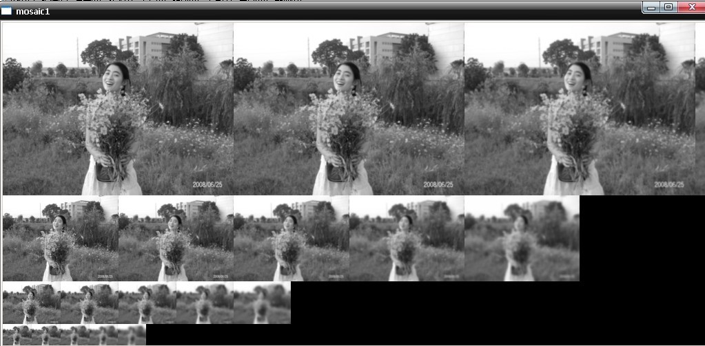
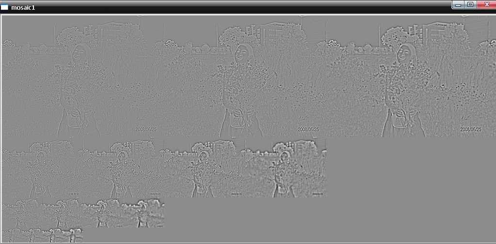
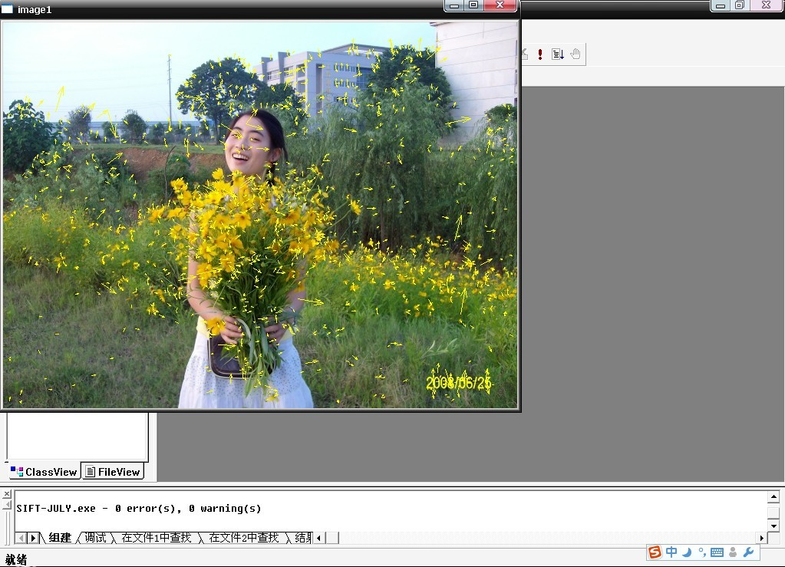
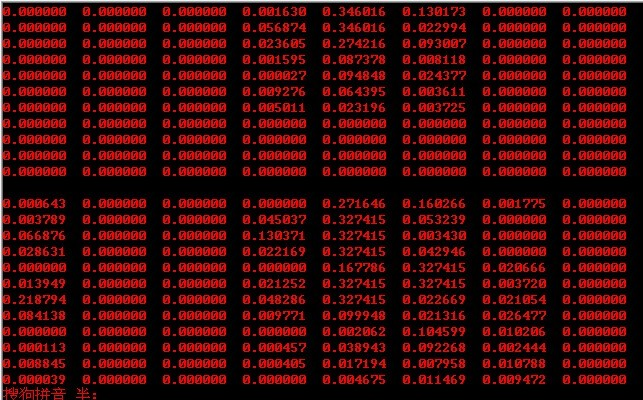

#教你一步一步用c语言实现sift算法、下

本文接上，[教你一步一步用c语言实现sift算法、上](10.01.02.md)而来：

###**函数编写**

ok，接上文，咱们一个一个的来编写main函数中所涉及到所有函数，这也是本文的关键部分：

```c
//下采样原来的图像，返回缩小2倍尺寸的图像  
CvMat * halfSizeImage(CvMat * im)   
{  
	unsigned int i,j;  
	int w = im->cols/2;  
	int h = im->rows/2;   
	CvMat *imnew = cvCreateMat(h, w, CV_32FC1);  

#define Im(ROW,COL) ((float *)(im->data.fl + im->step/sizeof(float) *(ROW)))[(COL)]  
#define Imnew(ROW,COL) ((float *)(imnew->data.fl + imnew->step/sizeof(float) *(ROW)))[(COL)]  
	for ( j = 0; j < h; j++)   
		for ( i = 0; i < w; i++)   
			Imnew(j,i)=Im(j*2, i*2);  
	return imnew;  
}  

//上采样原来的图像，返回放大2倍尺寸的图像  
CvMat * doubleSizeImage(CvMat * im)   
{  
	unsigned int i,j;  
	int w = im->cols*2;  
	int h = im->rows*2;   
	CvMat *imnew = cvCreateMat(h, w, CV_32FC1);  

#define Im(ROW,COL) ((float *)(im->data.fl + im->step/sizeof(float) *(ROW)))[(COL)]  
#define Imnew(ROW,COL) ((float *)(imnew->data.fl + imnew->step/sizeof(float) *(ROW)))[(COL)]  

	for ( j = 0; j < h; j++)   
		for ( i = 0; i < w; i++)   
			Imnew(j,i)=Im(j/2, i/2);  

	return imnew;  
}  

//上采样原来的图像，返回放大2倍尺寸的线性插值图像  
CvMat * doubleSizeImage2(CvMat * im)   
{  
	unsigned int i,j;  
	int w = im->cols*2;  
	int h = im->rows*2;   
	CvMat *imnew = cvCreateMat(h, w, CV_32FC1);  

#define Im(ROW,COL) ((float *)(im->data.fl + im->step/sizeof(float) *(ROW)))[(COL)]  
#define Imnew(ROW,COL) ((float *)(imnew->data.fl + imnew->step/sizeof(float) *(ROW)))[(COL)]  

	// fill every pixel so we don't have to worry about skipping pixels later  
	for ( j = 0; j < h; j++)   
	{  
		for ( i = 0; i < w; i++)   
		{  
			Imnew(j,i)=Im(j/2, i/2);  
		}  
	}  
	/* 
	A B C 
	E F G 
	H I J 
	pixels A C H J are pixels from original image 
	pixels B E G I F are interpolated pixels 
	*/  
	// interpolate pixels B and I  
	for ( j = 0; j < h; j += 2)  
		for ( i = 1; i < w - 1; i += 2)  
			Imnew(j,i)=0.5*(Im(j/2, i/2)+Im(j/2, i/2+1));  
	// interpolate pixels E and G  
	for ( j = 1; j < h - 1; j += 2)  
		for ( i = 0; i < w; i += 2)  
			Imnew(j,i)=0.5*(Im(j/2, i/2)+Im(j/2+1, i/2));  
	// interpolate pixel F  
	for ( j = 1; j < h - 1; j += 2)  
		for ( i = 1; i < w - 1; i += 2)  
			Imnew(j,i)=0.25*(Im(j/2, i/2)+Im(j/2+1, i/2)+Im(j/2, i/2+1)+Im(j/2+1, i/2+1));  
	return imnew;  
}  

//双线性插值，返回像素间的灰度值  
float getPixelBI(CvMat * im, float col, float row)   
{  
	int irow, icol;  
	float rfrac, cfrac;  
	float row1 = 0, row2 = 0;  
	int width=im->cols;  
	int height=im->rows;  
#define ImMat(ROW,COL) ((float *)(im->data.fl + im->step/sizeof(float) *(ROW)))[(COL)]  

	irow = (int) row;  
	icol = (int) col;  

	if (irow < 0 || irow >= height  
		|| icol < 0 || icol >= width)  
		return 0;  
	if (row > height - 1)  
		row = height - 1;  
	if (col > width - 1)  
		col = width - 1;  
	rfrac = 1.0 - (row - (float) irow);  
	cfrac = 1.0 - (col - (float) icol);  
	if (cfrac < 1)   
	{  
		row1 = cfrac * ImMat(irow,icol) + (1.0 - cfrac) * ImMat(irow,icol+1);  
	}   
	else   
	{  
		row1 = ImMat(irow,icol);  
	}  
	if (rfrac < 1)   
	{  
		if (cfrac < 1)   
		{  
			row2 = cfrac * ImMat(irow+1,icol) + (1.0 - cfrac) * ImMat(irow+1,icol+1);  
		} else   
		{  
			row2 = ImMat(irow+1,icol);  
		}  
	}  
	return rfrac * row1 + (1.0 - rfrac) * row2;  
}  

//矩阵归一化  
void normalizeMat(CvMat* mat)   
{  
#define Mat(ROW,COL) ((float *)(mat->data.fl + mat->step/sizeof(float) *(ROW)))[(COL)]  
	float sum = 0;  

	for (unsigned int j = 0; j < mat->rows; j++)   
		for (unsigned int i = 0; i < mat->cols; i++)   
			sum += Mat(j,i);  
	for ( j = 0; j < mat->rows; j++)   
		for (unsigned int i = 0; i < mat->rows; i++)   
			Mat(j,i) /= sum;  
}  

//向量归一化  
void normalizeVec(float* vec, int dim)   
{  
	unsigned int i;  
	float sum = 0;  
	for ( i = 0; i < dim; i++)  
		sum += vec[i];  
	for ( i = 0; i < dim; i++)  
		vec[i] /= sum;  
}  

//得到向量的欧式长度，2-范数  
float GetVecNorm( float* vec, int dim )  
{  
	float sum=0.0;  
	for (unsigned int i=0;i<dim;i++)  
		sum+=vec[i]*vec[i];  
	return sqrt(sum);  
}  

//产生1D高斯核  
float* GaussianKernel1D(float sigma, int dim)   
{  

	unsigned int i;  
	//printf("GaussianKernel1D(): Creating 1x%d vector for sigma=%.3f gaussian kernel/n", dim, sigma);  

	float *kern=(float*)malloc( dim*sizeof(float) );  
	float s2 = sigma * sigma;  
	int c = dim / 2;  
	float m= 1.0/(sqrt(2.0 * CV_PI) * sigma);  
	double v;   
	for ( i = 0; i < (dim + 1) / 2; i++)   
	{  
		v = m * exp(-(1.0*i*i)/(2.0 * s2)) ;  
		kern[c+i] = v;  
		kern[c-i] = v;  
	}  
	//   normalizeVec(kern, dim);  
	// for ( i = 0; i < dim; i++)  
	//  printf("%f  ", kern[i]);  
	//  printf("/n");  
	return kern;  
}  

//产生2D高斯核矩阵  
CvMat* GaussianKernel2D(float sigma)   
{  
	// int dim = (int) max(3.0f, GAUSSKERN * sigma);  
	int dim = (int) max(3.0f, 2.0 * GAUSSKERN *sigma + 1.0f);  
	// make dim odd  
	if (dim % 2 == 0)  
		dim++;  
	//printf("GaussianKernel(): Creating %dx%d matrix for sigma=%.3f gaussian/n", dim, dim, sigma);  
	CvMat* mat=cvCreateMat(dim, dim, CV_32FC1);  
#define Mat(ROW,COL) ((float *)(mat->data.fl + mat->step/sizeof(float) *(ROW)))[(COL)]  
	float s2 = sigma * sigma;  
	int c = dim / 2;  
	//printf("%d %d/n", mat.size(), mat[0].size());  
	float m= 1.0/(sqrt(2.0 * CV_PI) * sigma);  
	for (int i = 0; i < (dim + 1) / 2; i++)   
	{  
		for (int j = 0; j < (dim + 1) / 2; j++)   
		{  
			//printf("%d %d %d/n", c, i, j);  
			float v = m * exp(-(1.0*i*i + 1.0*j*j) / (2.0 * s2));  
			Mat(c+i,c+j) =v;  
			Mat(c-i,c+j) =v;  
			Mat(c+i,c-j) =v;  
			Mat(c-i,c-j) =v;  
		}  
	}  
	// normalizeMat(mat);  
	return mat;  
}  

//x方向像素处作卷积  
float ConvolveLocWidth(float* kernel, int dim, CvMat * src, int x, int y)   
{  
#define Src(ROW,COL) ((float *)(src->data.fl + src->step/sizeof(float) *(ROW)))[(COL)]  
	unsigned int i;  
	float pixel = 0;  
	int col;  
	int cen = dim / 2;  
	//printf("ConvolveLoc(): Applying convoluation at location (%d, %d)/n", x, y);  
	for ( i = 0; i < dim; i++)   
	{  
		col = x + (i - cen);  
		if (col < 0)  
			col = 0;  
		if (col >= src->cols)  
			col = src->cols - 1;  
		pixel += kernel[i] * Src(y,col);  
	}  
	if (pixel > 1)  
		pixel = 1;  
	return pixel;  
}  

//x方向作卷积  
void Convolve1DWidth(float* kern, int dim, CvMat * src, CvMat * dst)   
{  
#define DST(ROW,COL) ((float *)(dst->data.fl + dst->step/sizeof(float) *(ROW)))[(COL)]  
	unsigned int i,j;  

	for ( j = 0; j < src->rows; j++)   
	{  
		for ( i = 0; i < src->cols; i++)   
		{  
			//printf("%d, %d/n", i, j);  
			DST(j,i) = ConvolveLocWidth(kern, dim, src, i, j);  
		}  
	}  
}  

//y方向像素处作卷积  
float ConvolveLocHeight(float* kernel, int dim, CvMat * src, int x, int y)   
{  
#define Src(ROW,COL) ((float *)(src->data.fl + src->step/sizeof(float) *(ROW)))[(COL)]  
	unsigned int j;  
	float pixel = 0;  
	int cen = dim / 2;  
	//printf("ConvolveLoc(): Applying convoluation at location (%d, %d)/n", x, y);  
	for ( j = 0; j < dim; j++)   
	{  
		int row = y + (j - cen);  
		if (row < 0)  
			row = 0;  
		if (row >= src->rows)  
			row = src->rows - 1;  
		pixel += kernel[j] * Src(row,x);  
	}  
	if (pixel > 1)  
		pixel = 1;  
	return pixel;  
}  

//y方向作卷积  
void Convolve1DHeight(float* kern, int dim, CvMat * src, CvMat * dst)   
{  
#define Dst(ROW,COL) ((float *)(dst->data.fl + dst->step/sizeof(float) *(ROW)))[(COL)]  
	unsigned int i,j;  
	for ( j = 0; j < src->rows; j++)   
	{  
		for ( i = 0; i < src->cols; i++)   
		{  
			//printf("%d, %d/n", i, j);  
			Dst(j,i) = ConvolveLocHeight(kern, dim, src, i, j);  
		}  
	}  
}  

//卷积模糊图像  
int BlurImage(CvMat * src, CvMat * dst, float sigma)   
{  
	float* convkernel;  
	int dim = (int) max(3.0f, 2.0 * GAUSSKERN * sigma + 1.0f);  
	CvMat *tempMat;  
	// make dim odd  
	if (dim % 2 == 0)  
		dim++;  
	tempMat = cvCreateMat(src->rows, src->cols, CV_32FC1);  
	convkernel = GaussianKernel1D(sigma, dim);  

	Convolve1DWidth(convkernel, dim, src, tempMat);  
	Convolve1DHeight(convkernel, dim, tempMat, dst);  
	cvReleaseMat(&tempMat);  
	return dim;  
} 
```

###**五个步骤**

ok，接下来，进入重点部分，咱们依据上文介绍的sift算法的几个步骤，来一一实现这些函数。

为了版述清晰，再贴一下，主函数，顺便再加强下对sift 算法的五个步骤的认识：

1、 SIFT算法第一步：图像预处理

CvMat \*ScaleInitImage(CvMat \* im) ;                  //金字塔初始化

2、 SIFT算法第二步：建立高斯金字塔函数

ImageOctaves\* BuildGaussianOctaves(CvMat \* image) ;  //建立高斯金字塔

3、 SIFT算法第三步：特征点位置检测，最后确定特征点的位置

int DetectKeypoint\(int numoctaves, ImageOctaves \*GaussianPyr);

4、 SIFT算法第四步：计算高斯图像的梯度方向和幅值，计算各个特征点的主方向

void ComputeGrad_DirecandMag(int numoctaves, ImageOctaves \*GaussianPyr);

5、 SIFT算法第五步：抽取各个特征点处的特征描述字

void ExtractFeatureDescriptors(int numoctaves, ImageOctaves \*GaussianPyr);

ok，接下来一一具体实现这几个函数：

####**SIFT算法第一步**

SIFT算法第一步：扩大图像，预滤波剔除噪声，得到金字塔的最底层-第一阶的第一层：

```c
CvMat *ScaleInitImage(CvMat * im)   
{  
	double sigma,preblur_sigma;  
	CvMat *imMat;  
	CvMat * dst;  
	CvMat *tempMat;  
	//首先对图像进行平滑滤波，抑制噪声  
	imMat = cvCreateMat(im->rows, im->cols, CV_32FC1);  
	BlurImage(im, imMat, INITSIGMA);  
	//针对两种情况分别进行处理：初始化放大原始图像或者在原图像基础上进行后续操作  
	//建立金字塔的最底层  
	if (DOUBLE_BASE_IMAGE_SIZE)   
	{  
		tempMat = doubleSizeImage2(imMat);//对扩大两倍的图像进行二次采样，采样率为0.5，采用线性插值  
#define TEMPMAT(ROW,COL) ((float *)(tempMat->data.fl + tempMat->step/sizeof(float) * (ROW)))[(COL)]  

		dst = cvCreateMat(tempMat->rows, tempMat->cols, CV_32FC1);  
		preblur_sigma = 1.0;//sqrt(2 - 4*INITSIGMA*INITSIGMA);  
		BlurImage(tempMat, dst, preblur_sigma);   

		// The initial blurring for the first image of the first octave of the pyramid.  
		sigma = sqrt( (4*INITSIGMA*INITSIGMA) + preblur_sigma * preblur_sigma );  
		//  sigma = sqrt(SIGMA * SIGMA - INITSIGMA * INITSIGMA * 4);  
		//printf("Init Sigma: %f/n", sigma);  
		BlurImage(dst, tempMat, sigma);       //得到金字塔的最底层-放大2倍的图像  
		cvReleaseMat( &dst );   
		return tempMat;  
	}   
	else   
	{  
		dst = cvCreateMat(im->rows, im->cols, CV_32FC1);  
		//sigma = sqrt(SIGMA * SIGMA - INITSIGMA * INITSIGMA);  
		preblur_sigma = 1.0;//sqrt(2 - 4*INITSIGMA*INITSIGMA);  
		sigma = sqrt( (4*INITSIGMA*INITSIGMA) + preblur_sigma * preblur_sigma );  
		//printf("Init Sigma: %f/n", sigma);  
		BlurImage(imMat, dst, sigma);        //得到金字塔的最底层：原始图像大小  
		return dst;  
	}   
}
```
####**SIFT算法第二步**

SIFT第二步，建立Gaussian金字塔，给定金字塔第一阶第一层图像后，计算高斯金字塔其他尺度图像，
每一阶的数目由变量SCALESPEROCTAVE决定，给定一个基本图像，计算它的高斯金字塔图像，返回外部向量是阶梯指针，内部向量是每一个阶梯内部的不同尺度图像。

```c
//SIFT算法第二步  
ImageOctaves* BuildGaussianOctaves(CvMat * image)   
{  
	ImageOctaves *octaves;  
	CvMat *tempMat;  
	CvMat *dst;  
	CvMat *temp;  

	int i,j;  
	double k = pow(2, 1.0/((float)SCALESPEROCTAVE));  //方差倍数  
	float preblur_sigma, initial_sigma , sigma1,sigma2,sigma,absolute_sigma,sigma_f;  
	//计算金字塔的阶梯数目  
	int dim = min(image->rows, image->cols);  
	int numoctaves = (int) (log((double) dim) / log(2.0)) - 2;    //金字塔阶数  
	//限定金字塔的阶梯数  
	numoctaves = min(numoctaves, MAXOCTAVES);  
	//为高斯金塔和DOG金字塔分配内存  
	octaves=(ImageOctaves*) malloc( numoctaves * sizeof(ImageOctaves) );  
	DOGoctaves=(ImageOctaves*) malloc( numoctaves * sizeof(ImageOctaves) );  

	printf("BuildGaussianOctaves(): Base image dimension is %dx%d/n", (int)(0.5*(image->cols)), (int)(0.5*(image->rows)) );  
	printf("BuildGaussianOctaves(): Building %d octaves/n", numoctaves);  

	// start with initial source image  
	tempMat=cvCloneMat( image );  
	// preblur_sigma = 1.0;//sqrt(2 - 4*INITSIGMA*INITSIGMA);  
	initial_sigma = sqrt(2);//sqrt( (4*INITSIGMA*INITSIGMA) + preblur_sigma * preblur_sigma );  
	//   initial_sigma = sqrt(SIGMA * SIGMA - INITSIGMA * INITSIGMA * 4);  

	//在每一阶金字塔图像中建立不同的尺度图像  
	for ( i = 0; i < numoctaves; i++)   
	{     
		//首先建立金字塔每一阶梯的最底层，其中0阶梯的最底层已经建立好  
		printf("Building octave %d of dimesion (%d, %d)/n", i, tempMat->cols,tempMat->rows);  
		//为各个阶梯分配内存  
		octaves[i].Octave= (ImageLevels*) malloc( (SCALESPEROCTAVE + 3) * sizeof(ImageLevels) );  
		DOGoctaves[i].Octave= (ImageLevels*) malloc( (SCALESPEROCTAVE + 2) * sizeof(ImageLevels) );  
		//存储各个阶梯的最底层  
		(octaves[i].Octave)[0].Level=tempMat;  

		octaves[i].col=tempMat->cols;  
		octaves[i].row=tempMat->rows;  
		DOGoctaves[i].col=tempMat->cols;  
		DOGoctaves[i].row=tempMat->rows;  
		if (DOUBLE_BASE_IMAGE_SIZE)  
			octaves[i].subsample=pow(2,i)*0.5;  
		else  
			octaves[i].subsample=pow(2,i);  

		if(i==0)       
		{  
			(octaves[0].Octave)[0].levelsigma = initial_sigma;  
			(octaves[0].Octave)[0].absolute_sigma = initial_sigma;  
			printf("0 scale and blur sigma : %f /n", (octaves[0].subsample) * ((octaves[0].Octave)[0].absolute_sigma));  
		}  
		else  
		{  
			(octaves[i].Octave)[0].levelsigma = (octaves[i-1].Octave)[SCALESPEROCTAVE].levelsigma;  
			(octaves[i].Octave)[0].absolute_sigma = (octaves[i-1].Octave)[SCALESPEROCTAVE].absolute_sigma;  
			printf( "0 scale and blur sigma : %f /n", ((octaves[i].Octave)[0].absolute_sigma) );  
		}  
		sigma = initial_sigma;  
		//建立本阶梯其他层的图像  
		for ( j =  1; j < SCALESPEROCTAVE + 3; j++)   
		{  
			dst = cvCreateMat(tempMat->rows, tempMat->cols, CV_32FC1);//用于存储高斯层  
			temp = cvCreateMat(tempMat->rows, tempMat->cols, CV_32FC1);//用于存储DOG层  
			// 2 passes of 1D on original  
			//   if(i!=0)  
			//   {  
			//       sigma1 = pow(k, j - 1) * ((octaves[i-1].Octave)[j-1].levelsigma);  
			//          sigma2 = pow(k, j) * ((octaves[i].Octave)[j-1].levelsigma);  
			//       sigma = sqrt(sigma2*sigma2 - sigma1*sigma1);  
			sigma_f= sqrt(k*k-1)*sigma;  
			//   }  
			//   else  
			//   {  
			//       sigma = sqrt(SIGMA * SIGMA - INITSIGMA * INITSIGMA * 4)*pow(k,j);  
			//   }    
			sigma = k*sigma;  
			absolute_sigma = sigma * (octaves[i].subsample);  
			printf("%d scale and Blur sigma: %f  /n", j, absolute_sigma);  

			(octaves[i].Octave)[j].levelsigma = sigma;  
			(octaves[i].Octave)[j].absolute_sigma = absolute_sigma;  
			//产生高斯层  
			int length=BlurImage((octaves[i].Octave)[j-1].Level, dst, sigma_f);//相应尺度  
			(octaves[i].Octave)[j].levelsigmalength = length;  
			(octaves[i].Octave)[j].Level=dst;  
			//产生DOG层  
			cvSub( ((octaves[i].Octave)[j]).Level, ((octaves[i].Octave)[j-1]).Level, temp, 0 );  
			//         cvAbsDiff( ((octaves[i].Octave)[j]).Level, ((octaves[i].Octave)[j-1]).Level, temp );  
			((DOGoctaves[i].Octave)[j-1]).Level=temp;  
		}  
		// halve the image size for next iteration  
		tempMat  = halfSizeImage( ( (octaves[i].Octave)[SCALESPEROCTAVE].Level ) );  
	}  
	return octaves;  
}
```

####**SIFT算法第三步**

SIFT算法第三步，特征点位置检测，最后确定特征点的位置检测DOG金字塔中的局部最大值，找到之后，还要经过两个检验才能确认为特征点：一是它必须有明显的差异，二是他不应该是边缘点，（也就是说，在极值点处的主曲率比应该小于某一个阈值）。

```c
//SIFT算法第三步，特征点位置检测，  
int DetectKeypoint(int numoctaves, ImageOctaves *GaussianPyr)  
{  
	//计算用于DOG极值点检测的主曲率比的阈值  
	double curvature_threshold;  
	curvature_threshold= ((CURVATURE_THRESHOLD + 1)*(CURVATURE_THRESHOLD + 1))/CURVATURE_THRESHOLD;  
#define ImLevels(OCTAVE,LEVEL,ROW,COL) ((float *)(DOGoctaves[(OCTAVE)].Octave[(LEVEL)].Level->data.fl + DOGoctaves[(OCTAVE)].Octave[(LEVEL)].Level->step/sizeof(float) *(ROW)))[(COL)]  

	int   keypoint_count = 0;     
	for (int i=0; i<numoctaves; i++)    
	{          
		for(int j=1;j<SCALESPEROCTAVE+1;j++)//取中间的scaleperoctave个层  
		{    
			//在图像的有效区域内寻找具有显著性特征的局部最大值  
			//float sigma=(GaussianPyr[i].Octave)[j].levelsigma;  
			//int dim = (int) (max(3.0f, 2.0*GAUSSKERN *sigma + 1.0f)*0.5);  
			int dim = (int)(0.5*((GaussianPyr[i].Octave)[j].levelsigmalength)+0.5);  
			for (int m=dim;m<((DOGoctaves[i].row)-dim);m++)   
				for(int n=dim;n<((DOGoctaves[i].col)-dim);n++)  
				{       
					if ( fabs(ImLevels(i,j,m,n))>= CONTRAST_THRESHOLD )  
					{  

						if ( ImLevels(i,j,m,n)!=0.0 )  //1、首先是非零  
						{  
							float inf_val=ImLevels(i,j,m,n);  
							if(( (inf_val <= ImLevels(i,j-1,m-1,n-1))&&  
								(inf_val <= ImLevels(i,j-1,m  ,n-1))&&  
								(inf_val <= ImLevels(i,j-1,m+1,n-1))&&  
								(inf_val <= ImLevels(i,j-1,m-1,n  ))&&  
								(inf_val <= ImLevels(i,j-1,m  ,n  ))&&  
								(inf_val <= ImLevels(i,j-1,m+1,n  ))&&  
								(inf_val <= ImLevels(i,j-1,m-1,n+1))&&  
								(inf_val <= ImLevels(i,j-1,m  ,n+1))&&  
								(inf_val <= ImLevels(i,j-1,m+1,n+1))&&    //底层的小尺度9  

								(inf_val <= ImLevels(i,j,m-1,n-1))&&  
								(inf_val <= ImLevels(i,j,m  ,n-1))&&  
								(inf_val <= ImLevels(i,j,m+1,n-1))&&  
								(inf_val <= ImLevels(i,j,m-1,n  ))&&  
								(inf_val <= ImLevels(i,j,m+1,n  ))&&  
								(inf_val <= ImLevels(i,j,m-1,n+1))&&  
								(inf_val <= ImLevels(i,j,m  ,n+1))&&  
								(inf_val <= ImLevels(i,j,m+1,n+1))&&     //当前层8  

								(inf_val <= ImLevels(i,j+1,m-1,n-1))&&  
								(inf_val <= ImLevels(i,j+1,m  ,n-1))&&  
								(inf_val <= ImLevels(i,j+1,m+1,n-1))&&  
								(inf_val <= ImLevels(i,j+1,m-1,n  ))&&  
								(inf_val <= ImLevels(i,j+1,m  ,n  ))&&  
								(inf_val <= ImLevels(i,j+1,m+1,n  ))&&  
								(inf_val <= ImLevels(i,j+1,m-1,n+1))&&  
								(inf_val <= ImLevels(i,j+1,m  ,n+1))&&  
								(inf_val <= ImLevels(i,j+1,m+1,n+1))     //下一层大尺度9          
								) ||   
								( (inf_val >= ImLevels(i,j-1,m-1,n-1))&&  
								(inf_val >= ImLevels(i,j-1,m  ,n-1))&&  
								(inf_val >= ImLevels(i,j-1,m+1,n-1))&&  
								(inf_val >= ImLevels(i,j-1,m-1,n  ))&&  
								(inf_val >= ImLevels(i,j-1,m  ,n  ))&&  
								(inf_val >= ImLevels(i,j-1,m+1,n  ))&&  
								(inf_val >= ImLevels(i,j-1,m-1,n+1))&&  
								(inf_val >= ImLevels(i,j-1,m  ,n+1))&&  
								(inf_val >= ImLevels(i,j-1,m+1,n+1))&&  

								(inf_val >= ImLevels(i,j,m-1,n-1))&&  
								(inf_val >= ImLevels(i,j,m  ,n-1))&&  
								(inf_val >= ImLevels(i,j,m+1,n-1))&&  
								(inf_val >= ImLevels(i,j,m-1,n  ))&&  
								(inf_val >= ImLevels(i,j,m+1,n  ))&&  
								(inf_val >= ImLevels(i,j,m-1,n+1))&&  
								(inf_val >= ImLevels(i,j,m  ,n+1))&&  
								(inf_val >= ImLevels(i,j,m+1,n+1))&&   

								(inf_val >= ImLevels(i,j+1,m-1,n-1))&&  
								(inf_val >= ImLevels(i,j+1,m  ,n-1))&&  
								(inf_val >= ImLevels(i,j+1,m+1,n-1))&&  
								(inf_val >= ImLevels(i,j+1,m-1,n  ))&&  
								(inf_val >= ImLevels(i,j+1,m  ,n  ))&&  
								(inf_val >= ImLevels(i,j+1,m+1,n  ))&&  
								(inf_val >= ImLevels(i,j+1,m-1,n+1))&&  
								(inf_val >= ImLevels(i,j+1,m  ,n+1))&&  
								(inf_val >= ImLevels(i,j+1,m+1,n+1))   
								) )      //2、满足26个中极值点  
							{     
								//此处可存储  
								//然后必须具有明显的显著性，即必须大于CONTRAST_THRESHOLD=0.02  
								if ( fabs(ImLevels(i,j,m,n))>= CONTRAST_THRESHOLD )  
								{  
									//最后显著处的特征点必须具有足够的曲率比，CURVATURE_THRESHOLD=10.0，首先计算Hessian矩阵  
									// Compute the entries of the Hessian matrix at the extrema location.  
									/* 
									1   0   -1 
									0   0   0 
									-1   0   1         *0.25 
									*/  
									// Compute the trace and the determinant of the Hessian.  
									//Tr_H = Dxx + Dyy;  
									//Det_H = Dxx*Dyy - Dxy^2;  
									float Dxx,Dyy,Dxy,Tr_H,Det_H,curvature_ratio;  
									Dxx = ImLevels(i,j,m,n-1) + ImLevels(i,j,m,n+1)-2.0*ImLevels(i,j,m,n);  
									Dyy = ImLevels(i,j,m-1,n) + ImLevels(i,j,m+1,n)-2.0*ImLevels(i,j,m,n);  
									Dxy = ImLevels(i,j,m-1,n-1) + ImLevels(i,j,m+1,n+1) - ImLevels(i,j,m+1,n-1) - ImLevels(i,j,m-1,n+1);  
									Tr_H = Dxx + Dyy;  
									Det_H = Dxx*Dyy - Dxy*Dxy;  
									// Compute the ratio of the principal curvatures.  
									curvature_ratio = (1.0*Tr_H*Tr_H)/Det_H;  
									if ( (Det_H>=0.0) && (curvature_ratio <= curvature_threshold) )  //最后得到最具有显著性特征的特征点  
									{  
										//将其存储起来，以计算后面的特征描述字  
										keypoint_count++;  
										Keypoint k;  
										/* Allocate memory for the keypoint. */  
										k = (Keypoint) malloc(sizeof(struct KeypointSt));  
										k->next = keypoints;  
										keypoints = k;  
										k->row = m*(GaussianPyr[i].subsample);  
										k->col =n*(GaussianPyr[i].subsample);  
										k->sy = m;    //行  
										k->sx = n;    //列  
										k->octave=i;  
										k->level=j;  
										k->scale = (GaussianPyr[i].Octave)[j].absolute_sigma;        
									}//if >curvature_thresh  
								}//if >contrast  
							}//if inf value  
						}//if non zero  
					}//if >contrast  
				}  //for concrete image level col  
		}//for levels  
	}//for octaves  
	return keypoint_count;  
}  

//在图像中，显示SIFT特征点的位置  
void DisplayKeypointLocation(IplImage* image, ImageOctaves *GaussianPyr)  
{  

	Keypoint p = keypoints; // p指向第一个结点  
	while(p) // 没到表尾  
	{     
		cvLine( image, cvPoint((int)((p->col)-3),(int)(p->row)),   
			cvPoint((int)((p->col)+3),(int)(p->row)), CV_RGB(255,255,0),  
			1, 8, 0 );  
		cvLine( image, cvPoint((int)(p->col),(int)((p->row)-3)),   
			cvPoint((int)(p->col),(int)((p->row)+3)), CV_RGB(255,255,0),  
			1, 8, 0 );  
		//  cvCircle(image,cvPoint((uchar)(p->col),(uchar)(p->row)),  
		//   (int)((GaussianPyr[p->octave].Octave)[p->level].absolute_sigma),  
		//   CV_RGB(255,0,0),1,8,0);  
		p=p->next;  
	}   
}  

// Compute the gradient direction and magnitude of the gaussian pyramid images  
void ComputeGrad_DirecandMag(int numoctaves, ImageOctaves *GaussianPyr)  
{  
	// ImageOctaves *mag_thresh ;  
	mag_pyr=(ImageOctaves*) malloc( numoctaves * sizeof(ImageOctaves) );  
	grad_pyr=(ImageOctaves*) malloc( numoctaves * sizeof(ImageOctaves) );  
	// float sigma=( (GaussianPyr[0].Octave)[SCALESPEROCTAVE+2].absolute_sigma ) / GaussianPyr[0].subsample;  
	// int dim = (int) (max(3.0f, 2 * GAUSSKERN *sigma + 1.0f)*0.5+0.5);  
#define ImLevels(OCTAVE,LEVEL,ROW,COL) ((float *)(GaussianPyr[(OCTAVE)].Octave[(LEVEL)].Level->data.fl + GaussianPyr[(OCTAVE)].Octave[(LEVEL)].Level->step/sizeof(float) *(ROW)))[(COL)]  
	for (int i=0; i<numoctaves; i++)    
	{          
		mag_pyr[i].Octave= (ImageLevels*) malloc( (SCALESPEROCTAVE) * sizeof(ImageLevels) );  
		grad_pyr[i].Octave= (ImageLevels*) malloc( (SCALESPEROCTAVE) * sizeof(ImageLevels) );  
		for(int j=1;j<SCALESPEROCTAVE+1;j++)//取中间的scaleperoctave个层  
		{    
			CvMat *Mag = cvCreateMat(GaussianPyr[i].row, GaussianPyr[i].col, CV_32FC1);  
			CvMat *Ori = cvCreateMat(GaussianPyr[i].row, GaussianPyr[i].col, CV_32FC1);  
			CvMat *tempMat1 = cvCreateMat(GaussianPyr[i].row, GaussianPyr[i].col, CV_32FC1);  
			CvMat *tempMat2 = cvCreateMat(GaussianPyr[i].row, GaussianPyr[i].col, CV_32FC1);  
			cvZero(Mag);  
			cvZero(Ori);  
			cvZero(tempMat1);  
			cvZero(tempMat2);   
#define MAG(ROW,COL) ((float *)(Mag->data.fl + Mag->step/sizeof(float) *(ROW)))[(COL)]     
#define ORI(ROW,COL) ((float *)(Ori->data.fl + Ori->step/sizeof(float) *(ROW)))[(COL)]    
#define TEMPMAT1(ROW,COL) ((float *)(tempMat1->data.fl + tempMat1->step/sizeof(float) *(ROW)))[(COL)]  
#define TEMPMAT2(ROW,COL) ((float *)(tempMat2->data.fl + tempMat2->step/sizeof(float) *(ROW)))[(COL)]  
			for (int m=1;m<(GaussianPyr[i].row-1);m++)   
				for(int n=1;n<(GaussianPyr[i].col-1);n++)  
				{  
					//计算幅值  
					TEMPMAT1(m,n) = 0.5*( ImLevels(i,j,m,n+1)-ImLevels(i,j,m,n-1) );  //dx  
					TEMPMAT2(m,n) = 0.5*( ImLevels(i,j,m+1,n)-ImLevels(i,j,m-1,n) );  //dy  
					MAG(m,n) = sqrt(TEMPMAT1(m,n)*TEMPMAT1(m,n)+TEMPMAT2(m,n)*TEMPMAT2(m,n));  //mag  
					//计算方向  
					ORI(m,n) =atan( TEMPMAT2(m,n)/TEMPMAT1(m,n) );  
					if (ORI(m,n)==CV_PI)  
						ORI(m,n)=-CV_PI;  
				}  
				((mag_pyr[i].Octave)[j-1]).Level=Mag;  
				((grad_pyr[i].Octave)[j-1]).Level=Ori;  
				cvReleaseMat(&tempMat1);  
				cvReleaseMat(&tempMat2);  
		}//for levels  
	}//for octaves  
}
```

####**SIFT算法第四步**

```c
//SIFT算法第四步：计算各个特征点的主方向，确定主方向  
void AssignTheMainOrientation(int numoctaves, ImageOctaves *GaussianPyr,ImageOctaves *mag_pyr,ImageOctaves *grad_pyr)  
{  
	// Set up the histogram bin centers for a 36 bin histogram.  
	int num_bins = 36;  
	float hist_step = 2.0*PI/num_bins;  
	float hist_orient[36];  
	for (int i=0;i<36;i++)  
		hist_orient[i]=-PI+i*hist_step;  
	float sigma1=( ((GaussianPyr[0].Octave)[SCALESPEROCTAVE].absolute_sigma) ) / (GaussianPyr[0].subsample);//SCALESPEROCTAVE+2  
	int zero_pad = (int) (max(3.0f, 2 * GAUSSKERN *sigma1 + 1.0f)*0.5+0.5);  
	//Assign orientations to the keypoints.  
#define ImLevels(OCTAVES,LEVELS,ROW,COL) ((float *)((GaussianPyr[(OCTAVES)].Octave[(LEVELS)].Level)->data.fl + (GaussianPyr[(OCTAVES)].Octave[(LEVELS)].Level)->step/sizeof(float) *(ROW)))[(COL)]  

	int keypoint_count = 0;  
	Keypoint p = keypoints; // p指向第一个结点  

	while(p) // 没到表尾  
	{  
		int i=p->octave;  
		int j=p->level;  
		int m=p->sy;   //行  
		int n=p->sx;   //列  
		if ((m>=zero_pad)&&(m<GaussianPyr[i].row-zero_pad)&&  
			(n>=zero_pad)&&(n<GaussianPyr[i].col-zero_pad) )  
		{  
			float sigma=( ((GaussianPyr[i].Octave)[j].absolute_sigma) ) / (GaussianPyr[i].subsample);  
			//产生二维高斯模板  
			CvMat* mat = GaussianKernel2D( sigma );           
			int dim=(int)(0.5 * (mat->rows));  
			//分配用于存储Patch幅值和方向的空间  
#define MAT(ROW,COL) ((float *)(mat->data.fl + mat->step/sizeof(float) *(ROW)))[(COL)]  

			//声明方向直方图变量  
			double* orienthist = (double *) malloc(36 * sizeof(double));  
			for ( int sw = 0 ; sw < 36 ; ++sw)   
			{  
				orienthist[sw]=0.0;    
			}  
			//在特征点的周围统计梯度方向  
			for (int x=m-dim,mm=0;x<=(m+dim);x++,mm++)   
				for(int y=n-dim,nn=0;y<=(n+dim);y++,nn++)  
				{       
					//计算特征点处的幅值  
					double dx = 0.5*(ImLevels(i,j,x,y+1)-ImLevels(i,j,x,y-1));  //dx  
					double dy = 0.5*(ImLevels(i,j,x+1,y)-ImLevels(i,j,x-1,y));  //dy  
					double mag = sqrt(dx*dx+dy*dy);  //mag  
					//计算方向  
					double Ori =atan( 1.0*dy/dx );  
					int binIdx = FindClosestRotationBin(36, Ori);                   //得到离现有方向最近的直方块  
					orienthist[binIdx] = orienthist[binIdx] + 1.0* mag * MAT(mm,nn);//利用高斯加权累加进直方图相应的块  
				}  
				// Find peaks in the orientation histogram using nonmax suppression.  
				AverageWeakBins (orienthist, 36);  
				// find the maximum peak in gradient orientation  
				double maxGrad = 0.0;  
				int maxBin = 0;  
				for (int b = 0 ; b < 36 ; ++b)   
				{  
					if (orienthist[b] > maxGrad)   
					{  
						maxGrad = orienthist[b];  
						maxBin = b;  
					}  
				}  
				// First determine the real interpolated peak high at the maximum bin  
				// position, which is guaranteed to be an absolute peak.  
				double maxPeakValue=0.0;  
				double maxDegreeCorrection=0.0;  
				if ( (InterpolateOrientation ( orienthist[maxBin == 0 ? (36 - 1) : (maxBin - 1)],  
					orienthist[maxBin], orienthist[(maxBin + 1) % 36],  
					&maxDegreeCorrection, &maxPeakValue)) == false)  
					printf("BUG: Parabola fitting broken");  

				// Now that we know the maximum peak value, we can find other keypoint  
				// orientations, which have to fulfill two criterias:  
				//  
				//  1. They must be a local peak themselves. Else we might add a very  
				//     similar keypoint orientation twice (imagine for example the  
				//     values: 0.4 1.0 0.8, if 1.0 is maximum peak, 0.8 is still added  
				//     with the default threshhold, but the maximum peak orientation  
				//     was already added).  
				//  2. They must have at least peakRelThresh times the maximum peak  
				//     value.  
				bool binIsKeypoint[36];  
				for ( b = 0 ; b < 36 ; ++b)   
				{  
					binIsKeypoint[b] = false;  
					// The maximum peak of course is  
					if (b == maxBin)   
					{  
						binIsKeypoint[b] = true;  
						continue;  
					}  
					// Local peaks are, too, in case they fulfill the threshhold  
					if (orienthist[b] < (peakRelThresh * maxPeakValue))  
						continue;  
					int leftI = (b == 0) ? (36 - 1) : (b - 1);  
					int rightI = (b + 1) % 36;  
					if (orienthist[b] <= orienthist[leftI] || orienthist[b] <= orienthist[rightI])  
						continue; // no local peak  
					binIsKeypoint[b] = true;  
				}  
				// find other possible locations  
				double oneBinRad = (2.0 * PI) / 36;  
				for ( b = 0 ; b < 36 ; ++b)   
				{  
					if (binIsKeypoint[b] == false)  
						continue;  
					int bLeft = (b == 0) ? (36 - 1) : (b - 1);  
					int bRight = (b + 1) % 36;  
					// Get an interpolated peak direction and value guess.  
					double peakValue;  
					double degreeCorrection;  

					double maxPeakValue, maxDegreeCorrection;                
					if (InterpolateOrientation ( orienthist[maxBin == 0 ? (36 - 1) : (maxBin - 1)],  
						orienthist[maxBin], orienthist[(maxBin + 1) % 36],  
						°reeCorrection, &peakValue) == false)  
					{  
						printf("BUG: Parabola fitting broken");  
					}  

					double degree = (b + degreeCorrection) * oneBinRad - PI;  
					if (degree < -PI)  
						degree += 2.0 * PI;  
					else if (degree > PI)  
						degree -= 2.0 * PI;  
					//存储方向，可以直接利用检测到的链表进行该步主方向的指定;  
					//分配内存重新存储特征点  
					Keypoint k;  
					/* Allocate memory for the keypoint Descriptor. */  
					k = (Keypoint) malloc(sizeof(struct KeypointSt));  
					k->next = keyDescriptors;  
					keyDescriptors = k;  
					k->descrip = (float*)malloc(LEN * sizeof(float));  
					k->row = p->row;  
					k->col = p->col;  
					k->sy = p->sy;    //行  
					k->sx = p->sx;    //列  
					k->octave = p->octave;  
					k->level = p->level;  
					k->scale = p->scale;        
					k->ori = degree;  
					k->mag = peakValue;    
				}//for  
				free(orienthist);  
		}  
		p=p->next;  
	}   
}  

//寻找与方向直方图最近的柱，确定其index   
int FindClosestRotationBin (int binCount, float angle)  
{  
	angle += CV_PI;  
	angle /= 2.0 * CV_PI;  
	// calculate the aligned bin  
	angle *= binCount;  
	int idx = (int) angle;  
	if (idx == binCount)  
		idx = 0;  
	return (idx);  
}  

// Average the content of the direction bins.  
void AverageWeakBins (double* hist, int binCount)  
{  
	// TODO: make some tests what number of passes is the best. (its clear  
	// one is not enough, as we may have something like  
	// ( 0.4, 0.4, 0.3, 0.4, 0.4 ))  
	for (int sn = 0 ; sn < 2 ; ++sn)   
	{  
		double firstE = hist[0];  
		double last = hist[binCount-1];  
		for (int sw = 0 ; sw < binCount ; ++sw)   
		{  
			double cur = hist[sw];  
			double next = (sw == (binCount - 1)) ? firstE : hist[(sw + 1) % binCount];  
			hist[sw] = (last + cur + next) / 3.0;  
			last = cur;  
		}  
	}  
}  

// Fit a parabol to the three points (-1.0 ; left), (0.0 ; middle) and  
// (1.0 ; right).  
// Formulas:  
// f(x) = a (x - c)^2 + b  
// c is the peak offset (where f'(x) is zero), b is the peak value.  
// In case there is an error false is returned, otherwise a correction  
// value between [-1 ; 1] is returned in 'degreeCorrection', where -1  
// means the peak is located completely at the left vector, and -0.5 just  
// in the middle between left and middle and > 0 to the right side. In  
// 'peakValue' the maximum estimated peak value is stored.  
bool InterpolateOrientation (double left, double middle,double right, double *degreeCorrection, double *peakValue)  
{  
	double a = ((left + right) - 2.0 * middle) / 2.0;   //抛物线捏合系数a  
	// degreeCorrection = peakValue = Double.NaN;  

	// Not a parabol  
	if (a == 0.0)  
		return false;  
	double c = (((left - middle) / a) - 1.0) / 2.0;  
	double b = middle - c * c * a;  
	if (c < -0.5 || c > 0.5)  
		return false;  
	*degreeCorrection = c;  
	*peakValue = b;  
	return true;  
}  

//显示特征点处的主方向  
void DisplayOrientation (IplImage* image, ImageOctaves *GaussianPyr)  
{  
	Keypoint p = keyDescriptors; // p指向第一个结点  
	while(p) // 没到表尾  
	{  
		float scale=(GaussianPyr[p->octave].Octave)[p->level].absolute_sigma;  
		float autoscale = 3.0;   
		float uu=autoscale*scale*cos(p->ori);  
		float vv=autoscale*scale*sin(p->ori);  
		float x=(p->col)+uu;  
		float y=(p->row)+vv;  
		cvLine( image, cvPoint((int)(p->col),(int)(p->row)),   
			cvPoint((int)x,(int)y), CV_RGB(255,255,0),  
			1, 8, 0 );  
		// Arrow head parameters  
		float alpha = 0.33; // Size of arrow head relative to the length of the vector  
		float beta = 0.33;  // Width of the base of the arrow head relative to the length  

		float xx0= (p->col)+uu-alpha*(uu+beta*vv);  
		float yy0= (p->row)+vv-alpha*(vv-beta*uu);  
		float xx1= (p->col)+uu-alpha*(uu-beta*vv);  
		float yy1= (p->row)+vv-alpha*(vv+beta*uu);  
		cvLine( image, cvPoint((int)xx0,(int)yy0),   
			cvPoint((int)x,(int)y), CV_RGB(255,255,0),  
			1, 8, 0 );  
		cvLine( image, cvPoint((int)xx1,(int)yy1),   
			cvPoint((int)x,(int)y), CV_RGB(255,255,0),  
			1, 8, 0 );  
		p=p->next;  
	}   
}
```

####**SIFT算法第五步**

SIFT算法第五步：抽取各个特征点处的特征描述字，确定特征点的描述字。描述字是Patch网格内梯度方向的描述，旋转网格到主方向，插值得到网格处梯度值。

一个特征点可以用2*2*8=32维的向量，也可以用4*4*8=128维的向量更精确的进行描述。

```c
void ExtractFeatureDescriptors(int numoctaves, ImageOctaves *GaussianPyr)  
{  
	// The orientation histograms have 8 bins  
	float orient_bin_spacing = PI/4;  
	float orient_angles[8]={-PI,-PI+orient_bin_spacing,-PI*0.5, -orient_bin_spacing,  
		0.0, orient_bin_spacing, PI*0.5,  PI+orient_bin_spacing};  
	//产生描述字中心各点坐标  
	float *feat_grid=(float *) malloc( 2*16 * sizeof(float));  
	for (int i=0;i<GridSpacing;i++)  
	{  
		for (int j=0;j<2*GridSpacing;++j,++j)  
		{  
			feat_grid[i*2*GridSpacing+j]=-6.0+i*GridSpacing;  
			feat_grid[i*2*GridSpacing+j+1]=-6.0+0.5*j*GridSpacing;  
		}  
	}  
	//产生网格  
	float *feat_samples=(float *) malloc( 2*256 * sizeof(float));  
	for ( i=0;i<4*GridSpacing;i++)  
	{  
		for (int j=0;j<8*GridSpacing;j+=2)  
		{  
			feat_samples[i*8*GridSpacing+j]=-(2*GridSpacing-0.5)+i;  
			feat_samples[i*8*GridSpacing+j+1]=-(2*GridSpacing-0.5)+0.5*j;  
		}  
	}  
	float feat_window = 2*GridSpacing;  
	Keypoint p = keyDescriptors; // p指向第一个结点  
	while(p) // 没到表尾  
	{  
		float scale=(GaussianPyr[p->octave].Octave)[p->level].absolute_sigma;  

		float sine = sin(p->ori);  
		float cosine = cos(p->ori);    
		//计算中心点坐标旋转之后的位置  
		float *featcenter=(float *) malloc( 2*16 * sizeof(float));  
		for (int i=0;i<GridSpacing;i++)  
		{  
			for (int j=0;j<2*GridSpacing;j+=2)  
			{  
				float x=feat_grid[i*2*GridSpacing+j];  
				float y=feat_grid[i*2*GridSpacing+j+1];  
				featcenter[i*2*GridSpacing+j]=((cosine * x + sine * y) + p->sx);  
				featcenter[i*2*GridSpacing+j+1]=((-sine * x + cosine * y) + p->sy);  
			}  
		}  
		// calculate sample window coordinates (rotated along keypoint)  
		float *feat=(float *) malloc( 2*256 * sizeof(float));  
		for ( i=0;i<64*GridSpacing;i++,i++)  
		{  
			float x=feat_samples[i];  
			float y=feat_samples[i+1];  
			feat[i]=((cosine * x + sine * y) + p->sx);  
			feat[i+1]=((-sine * x + cosine * y) + p->sy);  
		}  
		//Initialize the feature descriptor.  
		float *feat_desc = (float *) malloc( 128 * sizeof(float));  
		for (i=0;i<128;i++)  
		{  
			feat_desc[i]=0.0;  
			// printf("%f  ",feat_desc[i]);    
		}  
		//printf("/n");  
		for ( i=0;i<512;++i,++i)  
		{  
			float x_sample = feat[i];  
			float y_sample = feat[i+1];  
			// Interpolate the gradient at the sample position  
			/* 
			0   1   0 
			1   *   1 
			0   1   0   具体插值策略如图示 
			*/  
			float sample12=getPixelBI(((GaussianPyr[p->octave].Octave)[p->level]).Level, x_sample, y_sample-1);  
			float sample21=getPixelBI(((GaussianPyr[p->octave].Octave)[p->level]).Level, x_sample-1, y_sample);   
			float sample22=getPixelBI(((GaussianPyr[p->octave].Octave)[p->level]).Level, x_sample, y_sample);   
			float sample23=getPixelBI(((GaussianPyr[p->octave].Octave)[p->level]).Level, x_sample+1, y_sample);   
			float sample32=getPixelBI(((GaussianPyr[p->octave].Octave)[p->level]).Level, x_sample, y_sample+1);   
			//float diff_x = 0.5*(sample23 - sample21);  
			//float diff_y = 0.5*(sample32 - sample12);  
			float diff_x = sample23 - sample21;  
			float diff_y = sample32 - sample12;  
			float mag_sample = sqrt( diff_x*diff_x + diff_y*diff_y );  
			float grad_sample = atan( diff_y / diff_x );  
			if(grad_sample == CV_PI)  
				grad_sample = -CV_PI;  
			// Compute the weighting for the x and y dimensions.  
			float *x_wght=(float *) malloc( GridSpacing * GridSpacing * sizeof(float));  
			float *y_wght=(float *) malloc( GridSpacing * GridSpacing * sizeof(float));  
			float *pos_wght=(float *) malloc( 8*GridSpacing * GridSpacing * sizeof(float));;  
			for (int m=0;m<32;++m,++m)  
			{  
				float x=featcenter[m];  
				float y=featcenter[m+1];  
				x_wght[m/2] = max(1 - (fabs(x - x_sample)*1.0/GridSpacing), 0);  
				y_wght[m/2] = max(1 - (fabs(y - y_sample)*1.0/GridSpacing), 0);   

			}  
			for ( m=0;m<16;++m)  
				for (int n=0;n<8;++n)  
					pos_wght[m*8+n]=x_wght[m]*y_wght[m];  
			free(x_wght);  
			free(y_wght);  
			//计算方向的加权，首先旋转梯度场到主方向，然后计算差异   
			float diff[8],orient_wght[128];  
			for ( m=0;m<8;++m)  
			{   
				float angle = grad_sample-(p->ori)-orient_angles[m]+CV_PI;  
				float temp = angle / (2.0 * CV_PI);  
				angle -= (int)(temp) * (2.0 * CV_PI);  
				diff[m]= angle - CV_PI;  
			}  
			// Compute the gaussian weighting.  
			float x=p->sx;  
			float y=p->sy;  
			float g = exp(-((x_sample-x)*(x_sample-x)+(y_sample-y)*(y_sample-y))/(2*feat_window*feat_window))/(2*CV_PI*feat_window*feat_window);  

			for ( m=0;m<128;++m)  
			{  
				orient_wght[m] = max((1.0 - 1.0*fabs(diff[m%8])/orient_bin_spacing),0);  
				feat_desc[m] = feat_desc[m] + orient_wght[m]*pos_wght[m]*g*mag_sample;  
			}  
			free(pos_wght);     
		}  
		free(feat);  
		free(featcenter);  
		float norm=GetVecNorm( feat_desc, 128);  
		for (int m=0;m<128;m++)  
		{  
			feat_desc[m]/=norm;  
			if (feat_desc[m]>0.2)  
				feat_desc[m]=0.2;  
		}  
		norm=GetVecNorm( feat_desc, 128);  
		for ( m=0;m<128;m++)  
		{  
			feat_desc[m]/=norm;  
			printf("%f  ",feat_desc[m]);    
		}  
		printf("/n");  
		p->descrip = feat_desc;  
		p=p->next;  
	}  
	free(feat_grid);  
	free(feat_samples);  
}  

//为了显示图象金字塔，而作的图像水平拼接  
CvMat* MosaicHorizen( CvMat* im1, CvMat* im2 )  
{  
	int row,col;  
	CvMat *mosaic = cvCreateMat( max(im1->rows,im2->rows),(im1->cols+im2->cols),CV_32FC1);  
#define Mosaic(ROW,COL) ((float*)(mosaic->data.fl + mosaic->step/sizeof(float)*(ROW)))[(COL)]  
#define Im11Mat(ROW,COL) ((float *)(im1->data.fl + im1->step/sizeof(float) *(ROW)))[(COL)]  
#define Im22Mat(ROW,COL) ((float *)(im2->data.fl + im2->step/sizeof(float) *(ROW)))[(COL)]  
	cvZero(mosaic);  
	/* Copy images into mosaic1. */  
	for ( row = 0; row < im1->rows; row++)  
		for ( col = 0; col < im1->cols; col++)  
			Mosaic(row,col)=Im11Mat(row,col) ;  
	for (  row = 0; row < im2->rows; row++)  
		for (  col = 0; col < im2->cols; col++)  
			Mosaic(row, (col+im1->cols) )= Im22Mat(row,col) ;  
	return mosaic;  
}  

//为了显示图象金字塔，而作的图像垂直拼接  
CvMat* MosaicVertical( CvMat* im1, CvMat* im2 )  
{  
	int row,col;  
	CvMat *mosaic = cvCreateMat(im1->rows+im2->rows,max(im1->cols,im2->cols), CV_32FC1);  
#define Mosaic(ROW,COL) ((float*)(mosaic->data.fl + mosaic->step/sizeof(float)*(ROW)))[(COL)]  
#define Im11Mat(ROW,COL) ((float *)(im1->data.fl + im1->step/sizeof(float) *(ROW)))[(COL)]  
#define Im22Mat(ROW,COL) ((float *)(im2->data.fl + im2->step/sizeof(float) *(ROW)))[(COL)]  
	cvZero(mosaic);  

	/* Copy images into mosaic1. */  
	for ( row = 0; row < im1->rows; row++)  
		for ( col = 0; col < im1->cols; col++)  
			Mosaic(row,col)= Im11Mat(row,col) ;  
	for ( row = 0; row < im2->rows; row++)  
		for ( col = 0; col < im2->cols; col++)  
			Mosaic((row+im1->rows),col)=Im22Mat(row,col) ;  

	return mosaic;  
}
```

ok，为了版述清晰，再贴一下上文所述的主函数（注，上文已贴出，此是为了版述清晰，重复造轮）：

```c
int main( void )  
{  
	//声明当前帧IplImage指针  
	IplImage* src = NULL;   
	IplImage* image1 = NULL;   
	IplImage* grey_im1 = NULL;   
	IplImage* DoubleSizeImage = NULL;  

	IplImage* mosaic1 = NULL;   
	IplImage* mosaic2 = NULL;   

	CvMat* mosaicHorizen1 = NULL;  
	CvMat* mosaicHorizen2 = NULL;  
	CvMat* mosaicVertical1 = NULL;  

	CvMat* image1Mat = NULL;  
	CvMat* tempMat=NULL;  

	ImageOctaves *Gaussianpyr;  
	int rows,cols;  

#define Im1Mat(ROW,COL) ((float *)(image1Mat->data.fl + image1Mat->step/sizeof(float) *(ROW)))[(COL)]  

	//灰度图象像素的数据结构  
#define Im1B(ROW,COL) ((uchar*)(image1->imageData + image1->widthStep*(ROW)))[(COL)*3]  
#define Im1G(ROW,COL) ((uchar*)(image1->imageData + image1->widthStep*(ROW)))[(COL)*3+1]  
#define Im1R(ROW,COL) ((uchar*)(image1->imageData + image1->widthStep*(ROW)))[(COL)*3+2]  

	storage = cvCreateMemStorage(0);   

	//读取图片  
	if( (src = cvLoadImage( "street1.jpg", 1)) == 0 )  // test1.jpg einstein.pgm back1.bmp  
		return -1;  

	//为图像分配内存   
	image1 = cvCreateImage(cvSize(src->width, src->height),  IPL_DEPTH_8U,3);  
	grey_im1 = cvCreateImage(cvSize(src->width, src->height),  IPL_DEPTH_8U,1);  
	DoubleSizeImage = cvCreateImage(cvSize(2*(src->width), 2*(src->height)),  IPL_DEPTH_8U,3);  

	//为图像阵列分配内存，假设两幅图像的大小相同，tempMat跟随image1的大小  
	image1Mat = cvCreateMat(src->height, src->width, CV_32FC1);  
	//转化成单通道图像再处理  
	cvCvtColor(src, grey_im1, CV_BGR2GRAY);  
	//转换进入Mat数据结构,图像操作使用的是浮点型操作  
	cvConvert(grey_im1, image1Mat);  

	double t = (double)cvGetTickCount();  
	//图像归一化  
	cvConvertScale( image1Mat, image1Mat, 1.0/255, 0 );  

	int dim = min(image1Mat->rows, image1Mat->cols);  
	numoctaves = (int) (log((double) dim) / log(2.0)) - 2;    //金字塔阶数  
	numoctaves = min(numoctaves, MAXOCTAVES);  

	//SIFT算法第一步，预滤波除噪声，建立金字塔底层  
	tempMat = ScaleInitImage(image1Mat) ;  
	//SIFT算法第二步，建立Guassian金字塔和DOG金字塔  
	Gaussianpyr = BuildGaussianOctaves(tempMat) ;  

	t = (double)cvGetTickCount() - t;  
	printf( "the time of build Gaussian pyramid and DOG pyramid is %.1f/n", t/(cvGetTickFrequency()*1000.) );  

#define ImLevels(OCTAVE,LEVEL,ROW,COL) ((float *)(Gaussianpyr[(OCTAVE)].Octave[(LEVEL)].Level->data.fl + Gaussianpyr[(OCTAVE)].Octave[(LEVEL)].Level->step/sizeof(float) *(ROW)))[(COL)]  
	//显示高斯金字塔  
	for (int i=0; i<numoctaves;i++)  
	{  
		if (i==0)  
		{  
			mosaicHorizen1=MosaicHorizen( (Gaussianpyr[0].Octave)[0].Level, (Gaussianpyr[0].Octave)[1].Level );  
			for (int j=2;j<SCALESPEROCTAVE+3;j++)  
				mosaicHorizen1=MosaicHorizen( mosaicHorizen1, (Gaussianpyr[0].Octave)[j].Level );  
			for ( j=0;j<NUMSIZE;j++)  
				mosaicHorizen1=halfSizeImage(mosaicHorizen1);  
		}  
		else if (i==1)  
		{  
			mosaicHorizen2=MosaicHorizen( (Gaussianpyr[1].Octave)[0].Level, (Gaussianpyr[1].Octave)[1].Level );  
			for (int j=2;j<SCALESPEROCTAVE+3;j++)  
				mosaicHorizen2=MosaicHorizen( mosaicHorizen2, (Gaussianpyr[1].Octave)[j].Level );  
			for ( j=0;j<NUMSIZE;j++)  
				mosaicHorizen2=halfSizeImage(mosaicHorizen2);  
			mosaicVertical1=MosaicVertical( mosaicHorizen1, mosaicHorizen2 );  
		}  
		else  
		{  
			mosaicHorizen1=MosaicHorizen( (Gaussianpyr[i].Octave)[0].Level, (Gaussianpyr[i].Octave)[1].Level );  
			for (int j=2;j<SCALESPEROCTAVE+3;j++)  
				mosaicHorizen1=MosaicHorizen( mosaicHorizen1, (Gaussianpyr[i].Octave)[j].Level );  
			for ( j=0;j<NUMSIZE;j++)  
				mosaicHorizen1=halfSizeImage(mosaicHorizen1);  
			mosaicVertical1=MosaicVertical( mosaicVertical1, mosaicHorizen1 );  
		}  
	}  
	mosaic1 = cvCreateImage(cvSize(mosaicVertical1->width, mosaicVertical1->height),  IPL_DEPTH_8U,1);  
	cvConvertScale( mosaicVertical1, mosaicVertical1, 255.0, 0 );  
	cvConvertScaleAbs( mosaicVertical1, mosaic1, 1, 0 );  

	//  cvSaveImage("GaussianPyramid of me.jpg",mosaic1);  
	cvNamedWindow("mosaic1",1);  
	cvShowImage("mosaic1", mosaic1);  
	cvWaitKey(0);  
	cvDestroyWindow("mosaic1");  
	//显示DOG金字塔  
	for ( i=0; i<numoctaves;i++)  
	{  
		if (i==0)  
		{  
			mosaicHorizen1=MosaicHorizen( (DOGoctaves[0].Octave)[0].Level, (DOGoctaves[0].Octave)[1].Level );  
			for (int j=2;j<SCALESPEROCTAVE+2;j++)  
				mosaicHorizen1=MosaicHorizen( mosaicHorizen1, (DOGoctaves[0].Octave)[j].Level );  
			for ( j=0;j<NUMSIZE;j++)  
				mosaicHorizen1=halfSizeImage(mosaicHorizen1);  
		}  
		else if (i==1)  
		{  
			mosaicHorizen2=MosaicHorizen( (DOGoctaves[1].Octave)[0].Level, (DOGoctaves[1].Octave)[1].Level );  
			for (int j=2;j<SCALESPEROCTAVE+2;j++)  
				mosaicHorizen2=MosaicHorizen( mosaicHorizen2, (DOGoctaves[1].Octave)[j].Level );  
			for ( j=0;j<NUMSIZE;j++)  
				mosaicHorizen2=halfSizeImage(mosaicHorizen2);  
			mosaicVertical1=MosaicVertical( mosaicHorizen1, mosaicHorizen2 );  
		}  
		else  
		{  
			mosaicHorizen1=MosaicHorizen( (DOGoctaves[i].Octave)[0].Level, (DOGoctaves[i].Octave)[1].Level );  
			for (int j=2;j<SCALESPEROCTAVE+2;j++)  
				mosaicHorizen1=MosaicHorizen( mosaicHorizen1, (DOGoctaves[i].Octave)[j].Level );  
			for ( j=0;j<NUMSIZE;j++)  
				mosaicHorizen1=halfSizeImage(mosaicHorizen1);  
			mosaicVertical1=MosaicVertical( mosaicVertical1, mosaicHorizen1 );  
		}  
	}  
	//考虑到DOG金字塔各层图像都会有正负，所以，必须寻找最负的，以将所有图像抬高一个台阶去显示  
	double min_val=0;  
	double max_val=0;  
	cvMinMaxLoc( mosaicVertical1, &min_val, &max_val,NULL, NULL, NULL );  
	if ( min_val<0.0 )  
		cvAddS( mosaicVertical1, cvScalarAll( (-1.0)*min_val ), mosaicVertical1, NULL );  
	mosaic2 = cvCreateImage(cvSize(mosaicVertical1->width, mosaicVertical1->height),  IPL_DEPTH_8U,1);  
	cvConvertScale( mosaicVertical1, mosaicVertical1, 255.0/(max_val-min_val), 0 );  
	cvConvertScaleAbs( mosaicVertical1, mosaic2, 1, 0 );  

	//  cvSaveImage("DOGPyramid of me.jpg",mosaic2);  
	cvNamedWindow("mosaic1",1);  
	cvShowImage("mosaic1", mosaic2);  
	cvWaitKey(0);  

	//SIFT算法第三步：特征点位置检测，最后确定特征点的位置  
	int keycount=DetectKeypoint(numoctaves, Gaussianpyr);  
	printf("the keypoints number are %d ;/n", keycount);  
	cvCopy(src,image1,NULL);  
	DisplayKeypointLocation( image1 ,Gaussianpyr);  

	cvPyrUp( image1, DoubleSizeImage, CV_GAUSSIAN_5x5 );  
	cvNamedWindow("image1",1);  
	cvShowImage("image1", DoubleSizeImage);  
	cvWaitKey(0);    
	cvDestroyWindow("image1");  

	//SIFT算法第四步：计算高斯图像的梯度方向和幅值，计算各个特征点的主方向  
	ComputeGrad_DirecandMag(numoctaves, Gaussianpyr);  
	AssignTheMainOrientation( numoctaves, Gaussianpyr,mag_pyr,grad_pyr);  
	cvCopy(src,image1,NULL);  
	DisplayOrientation ( image1, Gaussianpyr);  

	//  cvPyrUp( image1, DoubleSizeImage, CV_GAUSSIAN_5x5 );  
	cvNamedWindow("image1",1);  
	//  cvResizeWindow("image1", 2*(image1->width), 2*(image1->height) );  
	cvShowImage("image1", image1);  
	cvWaitKey(0);  

	//SIFT算法第五步：抽取各个特征点处的特征描述字  
	ExtractFeatureDescriptors( numoctaves, Gaussianpyr);  
	cvWaitKey(0);  

	//销毁窗口  
	cvDestroyWindow("image1");  
	cvDestroyWindow("mosaic1");  
	//释放图像  
	cvReleaseImage(&image1);  
	cvReleaseImage(&grey_im1);  
	cvReleaseImage(&mosaic1);  
	cvReleaseImage(&mosaic2);  
	return 0;  
}
```

最后，再看一下，运行效果（图中美女为老乡+朋友，何姐08年照）：










完。

**updated**

有很多朋友都在本文评论下要求要本程序的完整源码包（注：本文代码未贴全，复制粘贴编译肯定诸多错误），但由于时隔太久，这份代码我自己也找不到了，不过，我可以提供一份sift + KD + BBF，且可以编译正确的代码供大家参考学习，有pudn帐号的朋友可以前去下载：[http://www.pudn.com/downloads340/sourcecode/graph/texture_mapping/detail1486667.html ](tp://www.pudn.com/downloads340/sourcecode/graph/texture_mapping/detail1486667.html )（没有pudn账号的同学请加群：169056165，验证信息：sift，至群共享下载），然后用两幅不同的图片做了下匹配（当然，运行结果显示是不匹配的），效果还不错：[http://weibo.com/1580904460/yDmzAEwcV#1348475194313]( )! July、二零一二年十月十一日。
