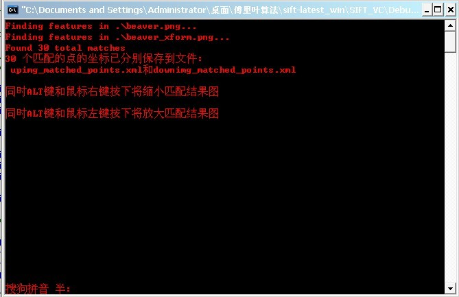
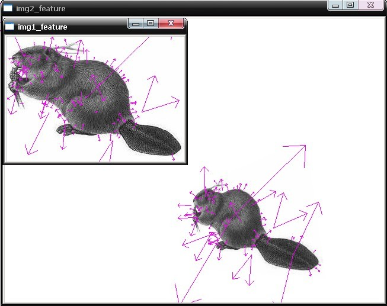
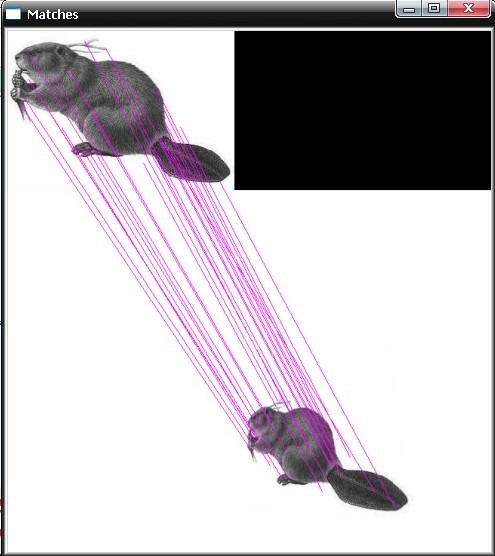
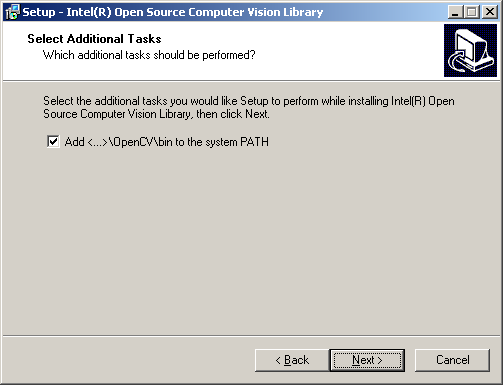
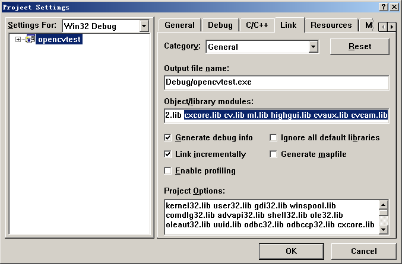
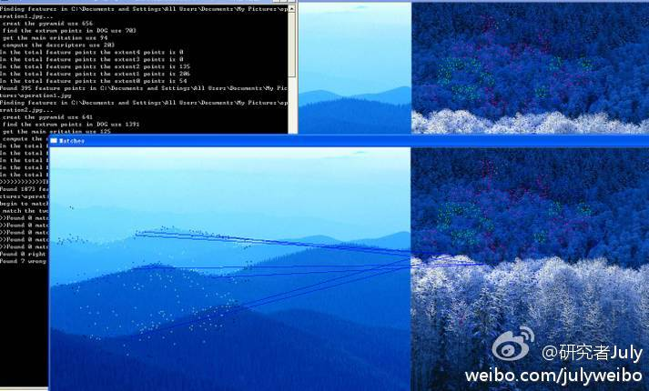

## sift算法的编译与实现

代码：Rob Hess维护的sift 库。  
环境：windows xp+vc6.0。  
条件：opencv1.0、gsl-1.8.exe

昨日，下载了Rob Hess的sift库，将其源码粗略的看了看，想要编译时，遇到了不少问题，先修改了下代码，然后下载opencv、gsl。最后，几经周折，才最终编译成功。

以下便是sift源码库编译后的效果图：

为了给有兴趣实现sift算法的朋友提供个参考，特整理此文如下。要了解什么是sift算法，请参考：[九、图像特征提取与匹配之SIFT算法](http://blog.csdn.net/v_JULY_v/article/details/6186942)。ok，咱们下面，就来利用Rob Hess维护的sift 库来实现sift算法：

首先，请下载Rob Hess维护的sift 库：  
<http://blogs.oregonstate.edu/hess/code/sift>  
下载Rob Hess的这个压缩包后，如果直接解压缩，直接编译，那么会出现下面的错误提示：  

	编译提示:error C1083: Cannot open include file: 'cxcore.h': No such file or directory，找不到这个头文件。

这个错误，是因为你还没有安装opencv，因为：cxcore.h和cv.h是开源的OPEN CV头文件,不是VC++的默认安装文件,所以你还得下载OpenCV并进行安装。然后，可以在OpenCV文件夹下找到你所需要的头文件了。

据网友称，截止2010年4月4日，还没有在VC6.0下成功使用opencv2.0的案例。所以，如果你是VC6.0的用户请下载opencv1.0版本。vs的话，opencv2.0,1.0任意下载。

以下，咱们就以**vc6.0为平台举例，下载并安装opencv1.0版本、gsl**等。当然，你也可以用vs编译，同样下载opencv（具体版本不受限制）、gsl等。

请按以下步骤操作：

### 一、下载opencv1.0

<http://sourceforge.net/projects/opencvlibrary/files/opencv-win/1.0/OpenCV_1.0.exe/download>

### 二、安装opencv1.0，配置Windows环境变量

1. **安装注意：**假如你是将OpenCV安装到**C**:/Program Files/OpenCV（**如果你安装的时候选择不是安装在C盘，则下面所有对应的C盘都改为你所安装在的那个“X盘”，即可**），在安装时选择"将/OpenCV/bin加入系统变量"，打上“勾”。（Add/OpenCV/bin to the systerm PATH。**这一步确认选上了之后，下面的检查环境变量的步骤，便可免去**）

	

2. **检查环境变量。**为了确保上述步骤中，加入了系统变量，在安装opencv1.0成功后，还得检查C:/Program Files/OpenCV/bin是否已经被加入到环境变量PATH，如果没有，请加入。

3. **最后是配置Visual C++ 6.0。**  

* 全局设置  
菜单Tools->Options->Directories：先设置lib路径，选择Library files，在下方填入路径：  
**C:/Program Files/OpenCV/lib**  
然后选择include files，在下方填入路径(参考下图)：  
**C:/Program Files/OpenCV/cxcore/include**  
**C:/Program Files/OpenCV/cv/include**  
**C:/Program Files/OpenCV/cvaux/include**  
**C:/Program Files/OpenCV/ml/include**  
**C:/Program Files/OpenCV/otherlibs/highgui**  
**C:/Program Files/OpenCV/otherlibs/cvcam/include**  
	  
最后选择source files，在下方填入路径：  
**C:/Program Files/OpenCV/cv/src**  
**C:/Program Files/OpenCV/cxcore/src**  
**C:/Program Files/OpenCV/cvaux/src**  
**C:/Program Files/OpenCV/otherlibs/highgui**  
**C:/Program Files/OpenCV/otherlibs/cvcam/src/windows**  

* 项目设置
每创建一个将要使用OpenCV的VC Project，都需要给它指定需要的lib。菜单：Project->Settings，然后将Setting for选为All Configurations，然后选择右边的link标签，在Object/library modules附加上：
cxcore.lib cv.lib ml.lib cvaux.lib highgui.lib cvcam.lib
当然，你不需要这么多lib，你可以只添加你需要的lib(见下图)

### 三、下载gsl，gsl也是一个库，也需要下载：
<http://sourceforge.net/projects/gnuwin32/files/gsl/1.8/gsl-1.8.exe/download>。在编译时候GSL也是和OpenCV一样要把头文件和lib的路径指定好。

### 四、配置gsl

将C:/WinGsl/bin中的WinGsl.dll和WinGslD.dll复制到C:/VC6.0/Bin；将整个Gsl目录复制到C:/VC6.0/Bin下；lib目录下的所有.lib文件全部复制到C:/VC6.0/Lib下。  
然后，在tools－options－directories中，将C:/WinGsl下的lib，gsl分别加入到库文件和头文件的搜索路径中。

**以下是可能会出现的错误情况处理：**

1. OpenCV安装后“没有找到cxcore100.dll”的错误处理
在安装时选择“将/OpenCV/bin加入系统变量”（Add/OpenCV/bin to the systerm PATH）。 但该选项并不一定能成功添加到系统变量，如果编写的程序在运行时出现“没有找到cxcore100.dll，因为这个应用程序未能启动。重新安装应用程序可能会修复此问题。”的错误。
手动在我的电脑->属性->高级->环境变量->系统变量->path添加c:/program files/opencv/bin;添加完成后需要重启计算机。

2. vc6.0下配置了一下，可是编译程序时遇到如下一个错误： 
Linking... LINK : fatal error LNK1104: cannot open file"odbccp32.libcxcore.lib" 
可能是：在工程设置的时候添加连接库时没加空格或.来把两个文件名（odbccp32.lib cxcore.lib）分开。注意每一次操作后，记得保存。

若经过以上所有的步骤之后，如果还不能正常编译，那就是还要稍微修改下你下载的Rob Hess代码。ok，日后，若有空，再好好详细剖析下此sift的源码。最后，祝你编译顺利。

updated

今天下午试了下sift + KD + BBF，然后用两幅不同的图片做了下匹配（当然，运行结果显示是不匹配的），效果还不错：<http://weibo.com/1580904460/yDmzAEwcV#1348475194313>! 

同时，编译的过程中，直接用的VS2010 + opencv（并没下gsl）。2012.09.24。完。 
