# 支持向量机通俗导论（理解SVM的三层境界）

##前言
动笔写这个支持向量机(support vector machine)是费了不少劲和困难的，原因很简单，一者这个东西本身就并不好懂，要深入学习和研究下去需花费不少时间和精力，二者这个东西也不好讲清楚，尽管网上已经有朋友写得不错了(见文末参考链接)，但在描述数学公式的时候还是显得不够。得益于同学白石的数学证明，我还是想尝试写一下，希望本文在兼顾通俗易懂的基础上，真真正正能足以成为一篇完整概括和介绍支持向量机的导论性的文章。

本文在写的过程中，参考了不少资料，包括《支持向量机导论》、《统计学习方法》及网友pluskid的支持向量机系列等等，于此，还是一篇学习笔记，只是加入了自己的理解和总结，有任何不妥之处，还望海涵。全文宏观上整体认识支持向量机的概念和用处，微观上深究部分定理的来龙去脉，证明及原理细节，力保逻辑清晰 & 通俗易懂。

同时，阅读本文时建议大家尽量使用chrome等浏览器，如此公式才能更好的显示，再者，阅读时可拿张纸和笔出来，把本文所有定理.公式都亲自推导一遍或者直接打印下来（可直接打印网页版或本文文末附的PDF，享受随时随地思考、演算的极致快感），在文稿上演算。

Ok，还是那句原话，有任何问题，欢迎任何人随时不吝指正 & 赐教，感谢。

##第一层、了解SVM
###*1.0、什么是支持向量机SVM*
要明白什么是SVM，便得从分类说起。

分类作为数据挖掘领域中一项非常重要的任务，它的目的是学会一个分类函数或分类模型(或者叫做分类器)，而支持向量机本身便是一种监督式学习的方法(至于具体什么是监督学习与非监督学习，请参见此系列[Machine L&Data Mining][id]第一篇)，它广泛的应用于统计分类以及回归分析中。

[id]:http://blog.csdn.net/v_july_v/article/category/1061301

支持向量机（SVM）是90年代中期发展起来的基于统计学习理论的一种机器学习方法，通过寻求结构化风险最小来提高学习机泛化能力，实现经验风险和置信范围的最小化，从而达到在统计样本量较少的情况下，亦能获得良好统计规律的目的。

通俗来讲，它是一种二类分类模型，其基本模型定义为特征空间上的间隔最大的线性分类器，即支持向量机的学习策略便是间隔最大化，最终可转化为一个凸二次规划问题的求解。

对于不想深究SVM原理的同学或比如就只想看看SVM是干嘛的，那么，了解到这里便足够了，不需上层。而对于那些喜欢深入研究一个东西的同学，甚至究其本质的，咱们则还有很长的一段路要走，万里长征，咱们开始迈第一步吧，相信你能走完。

###*1.1、线性分类*
OK，在讲SVM之前，咱们必须先弄清楚一个概念：线性分类器(也可以叫做感知机，这里的机表示的是一种算法，本文第三部分、证明SVM中会详细阐述)。

####1.1.1、分类标准
这里我们考虑的是一个两类的分类问题，数据点用 x 来表示，这是一个 n 维向量，w^T中的T代表转置，而类别用 y 来表示，可以取 1 或者 -1 ，分别代表两个不同的类。一个线性分类器的学习目标就是要在 n 维的数据空间中找到一个分类[超平面][a]，其方程可以表示为：

[a]:http://zh.wikipedia.org/wiki/%E8%B6%85%E5%B9%B3%E9%9D%A2

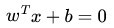

上面给出了线性分类的定义描述，但或许读者没有想过：为何用y取1 或者 -1来表示两个不同的类别呢？其实，这个1或-1的分类标准起源于logistic回归，为了完整和过渡的自然性，咱们就再来看看这个logistic回归。

####1.1.2、1或-1分类标准的起源：logistic回归
Logistic回归目的是从特征学习出一个0/1分类模型，而这个模型是将特性的线性组合作为自变量，由于自变量的取值范围是负无穷到正无穷。因此，使用logistic函数（或称作sigmoid函数）将自变量映射到(0,1)上，映射后的值被认为是属于y=1的概率。

形式化表示就是

假设函数

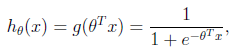

其中x是n维特征向量，函数g就是logistic函数。

而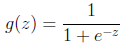的图像是

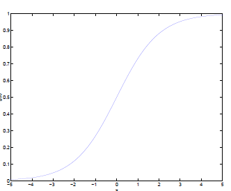

可以看到，将无穷映射到了(0,1)。而假设函数就是特征属于y=1的概率。

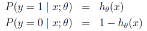

 当我们要判别一个新来的特征属于哪个类时，只需求，若大于0.5就是y=1的类，反之属于y=0类。

再审视一下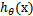，发现只和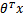有关，>0，那么>0.5，g(z)只不过是用来映射，真实的类别决定权还在。还有当>>0时，=1，反之=0。如果我们只从出发，希望模型达到的目标无非就是让训练数据中y=1的特征>>0，而是y=0的特征<<0。Logistic回归就是要学习得到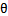，使得正例的特征远大于0，负例的特征远小于0，强调在全部训练实例上达到这个目标。

####1.1.3、形式化标示
 我们这次使用的结果标签是y=-1,y=1，替换在logistic回归中使用的y=0和y=1。同时将替换成w和b。以前的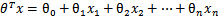，其中认为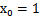。现在我们替换为b，后面替换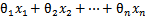为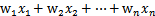（即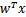）。这样，我们让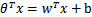，进一步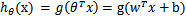。也就是说除了y由y=0变为y=-1，只是标记不同外，与logistic回归的形式化表示没区别。
 
再明确下假设函数

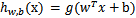

上面提到过我们只需考虑的正负问题，而不用关心g(z)，因此我们这里将g(z)做一个简化，将其简单映射到y=-1和y=1上。映射关系如下：

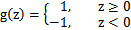

于此，想必已经解释明白了为何线性分类的标准一般用1 或者-1 来标示。
    
注：上小节来自jerrylead所作的斯坦福机器学习课程的笔记。

###*1.2、线性分类的一个例子*
下面举个简单的例子，一个二维平面(一个超平面，在二维空间中的例子就是一条直线)，如下图所示，平面上有两种不同的点，分别用两种不同的颜色表示，一种为红颜色的点，另一种则为蓝颜色的点，红颜色的线表示一个可行的超平面。

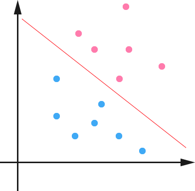

 从上图中我们可以看出，这条红颜色的线把红颜色的点和蓝颜色的点分开来了。而这条红颜色的线就是我们上面所说的超平面，也就是说，这个所谓的超平面的的确确便把这两种不同颜色的数据点分隔开来，在超平面一边的数据点所对应的 y 全是 -1 ，而在另一边全是 1 。

接着，我们可以令分类函数（提醒：下文很大篇幅都在讨论着这个分类函数）：

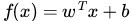

显然，如果 f(x)=0 ，那么 x 是位于超平面上的点。我们不妨要求对于所有满足 f(x)<0 的点，其对应的 y 等于 -1 ，而 f(x)>0 则对应 y=1 的数据点。

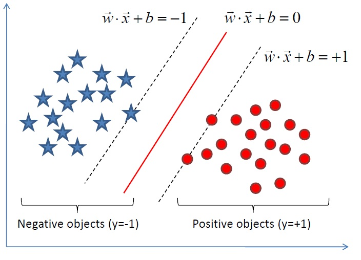

 注：上图中，定义特征到结果的输出函数，与我们之前定义的实质是一样的。为什么？因为无论是，还是，不影响最终优化结果。下文你将看到，当我们转化到优化的时候，为了求解方便，会把yf(x)令为1，即yf(x)是y(w^x + b)，还是y(w^x - b)，对我们要优化的式子max1/||w||已无影响。
    （有一朋友飞狗来自Mare_Desiderii，看了上面的定义之后，问道：请教一下SVM functional margin 为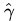=y(wTx+b)=yf(x)中的Y是只取1和-1 吗？y的唯一作用就是确保functional margin的非负性？真是这样的么？当然不是，详情请见本文评论下第43楼）

当然，有些时候，或者说大部分时候数据并不是线性可分的，这个时候满足这样条件的超平面就根本不存在(不过关于如何处理这样的问题我们后面会讲)，这里先从最简单的情形开始推导，就假设数据都是线性可分的，亦即这样的超平面是存在的。

更进一步，我们在进行分类的时候，将数据点 x代入 f(x) 中，如果得到的结果小于 0 ，则赋予其类别 -1 ，如果大于 0 则赋予类别 1 。如果 f(x)=0，则很难办了，分到哪一类都不是。

 请读者注意，下面的篇幅将按下述3点走：

1. 咱们就要确定上述分类函数f(x) = w.x + b（w.x表示w与x的内积）中的两个参数w和b，通俗理解的话w是法向量，b是截距（再次说明：定义特征到结果的输出函数，与我们最开始定义的实质是一样的）；

2. 那如何确定w和b呢？答案是寻找两条边界端或极端划分直线中间的最大间隔（之所以要寻最大间隔是为了能更好的划分不同类的点，下文你将看到：为寻最大间隔，导出1/2||w||^2，继而引入拉格朗日函数和对偶变量a，化为对单一因数对偶变量a的求解，当然，这是后话），从而确定最终的最大间隔分类超平面hyper plane和分类函数；

3. 进而把寻求分类函数f(x) = w.x + b的问题转化为对w，b的最优化问题，最终化为对偶因子的求解。

总结成一句话即是：从最大间隔出发（目的本就是为了确定法向量w），转化为求对变量w和b的凸二次规划问题。亦或如下图所示（有点需要注意，如读者@酱爆小八爪所说：从最大分类间隔开始，就一直是凸优化问题）：

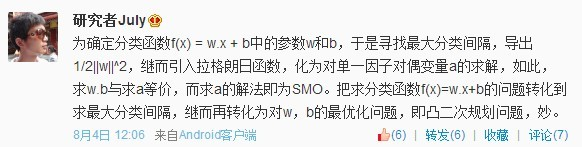

###*1.3、函数间隔Functional margin与几何间隔Geometrical margin*
 一般而言，一个点距离超平面的远近可以表示为分类预测的确信或准确程度。

* 在超平面w\*x+b=0确定的情况下，|w\*x+b|能够相对的表示点x到距离超平面的远近，而w\*x+b的符号与类标记y的符号是否一致表示分类是否正确，所以，可以用量y\*(w\*x+b)的正负性来判定或表示分类的正确性和确信度。

于此，我们便引出了定义样本到分类间隔距离的函数间隔functional margin的概念。

####1.3.1、函数间隔Functional margin
 我们定义函数间隔functional margin 为： 

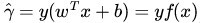

接着，我们定义超平面(w，b)关于训练数据集T的函数间隔为超平面(w，b)关于T中所有样本点(xi，yi)的函数间隔最小值，其中，x是特征，y是结果标签，i表示第i个样本，有：

  = mini  (i=1，...n)

然与此同时，问题就出来了。上述定义的函数间隔虽然可以表示分类预测的正确性和确信度，但在选择分类超平面时，只有函数间隔还远远不够，因为如果成比例的改变w和b，如将他们改变为2w和2b，虽然此时超平面没有改变，但函数间隔的值f(x)却变成了原来的2倍。

其实，我们可以对法向量w加些约束条件，使其表面上看起来规范化，如此，我们很快又将引出真正定义点到超平面的距离--几何间隔geometrical margin的概念（很快你将看到，几何间隔就是函数间隔除以个||w||，即yf(x) / ||w||）。

####1.3.2、点到超平面的距离定义：几何间隔Geometrical margin
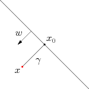

在给出几何间隔的定义之前，咱们首先来看下，如上图所示，对于一个点 x ，令其垂直投影到超平面上的对应的为 x0 ，由于 w 是垂直于超平面的一个向量，为样本x到分类间隔的距离，我们有

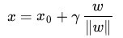
							
（||w||表示的是范数，关于范数的概念参见[这里][c]）

[c]:http://baike.baidu.com/view/637132.htm

又由于 x0 是超平面上的点，满足 f(x0)=0 ，代入超平面的方程即可算出： 

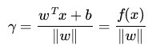

（有的书上会写成把||w|| 分开相除的形式，如本文参考文献及推荐阅读条目11，其中，||w||为w的二阶泛数）

不过这里的是带符号的，我们需要的只是它的绝对值，因此类似地，也乘上对应的类别 y即可，因此实际上我们定义 几何间隔geometrical margin 为(注：别忘了，上面的定义，=y(wTx+b)=yf(x) )：

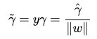

（代人相关式子可以得出：yi*(w/||w|| + b/||w||)）

正如本文评论下读者popol1991留言：函数间隔y*(wx+b)=y*f(x)实际上就是|f(x)|，只是人为定义的一个间隔度量；而几何间隔|f(x)|/||w||才是直观上的点到超平面距离。

想想二维空间里的点到直线公式：假设一条直线的方程为ax+by+c=0,点P的坐标是(x0,y0)，则点到直线距离为|ax0+by0+c|/sqrt(a^2+b^2)。如下图所示：

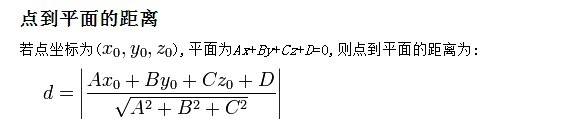
                                 
那么如果用向量表示，设w=(a,b),f(x)=wx+c,那么这个距离正是|f(p)|/||w||。

###*1.4、最大间隔分类器Maximum Margin Classifier的定义*
于此，我们已经很明显的看出，函数间隔functional margin 和 几何间隔geometrical margin 相差一个的缩放因子。按照我们前面的分析，对一个数据点进行分类，当它的 margin 越大的时候，分类的 confidence 越大。对于一个包含 n 个点的数据集，我们可以很自然地定义它的 margin 为所有这 n 个点的 margin 值中最小的那个。于是，为了使得分类的 confidence 高，我们希望所选择的超平面hyper plane 能够最大化这个 margin 值。

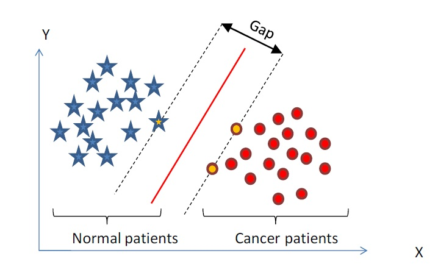

通过上节，我们已经知道：

1. functional margin 明显是不太适合用来最大化的一个量，因为在 hyper plane 固定以后，我们可以等比例地缩放 w 的长度和 b 的值，这样可以使得的值任意大，亦即 functional margin可以在 hyper plane 保持不变的情况下被取得任意大，

2. 而 geometrical margin 则没有这个问题，因为除上了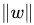这个分母，所以缩放 w 和 b 的时候的值是不会改变的，它只随着 hyper plane 的变动而变动，因此，这是更加合适的一个 margin 。

这样一来，我们的 maximum margin classifier 的目标函数可以定义为：

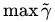

当然，还需要满足一些条件，根据 margin 的定义，我们有

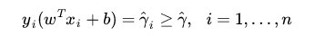

其中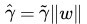 (等价于= /||w||，故有稍后的  =1 时，  = 1 / ||w||)，处于方便推导和优化的目的，我们可以令=1(对目标函数的优化没有影响，至于为什么，请见本文评论下第42楼回复) ，此时，上述的目标函数转化为(其中，s.t.，即subject to的意思，它导出的是约束条件)：

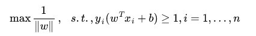

通过求解这个问题，我们就可以找到一个 margin 最大的 classifier ，如下图所示，中间的红色线条是 Optimal Hyper Plane ，另外两条线到红线的距离都是等于的(便是上文所定义的geometrical margin，当令=1时，便为1/||w||，而我们上面得到的目标函数便是在相应的约束条件下，要最大化这个1/||w||值)：

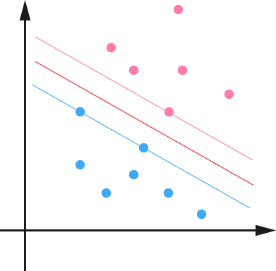

通过最大化 margin ，我们使得该分类器对数据进行分类时具有了最大的 confidence，从而设计决策最优分类超平面。

###*1.5、到底什么是Support Vector*
 上节，我们介绍了Maximum Margin Classifier，但并没有具体阐述到底什么是Support Vector，本节，咱们来重点阐述这个概念。咱们不妨先来回忆一下上节1.4节最后一张图：

可以看到两个支撑着中间的 gap 的超平面，它们到中间的纯红线separating hyper plane 的距离相等，即我们所能得到的最大的 geometrical margin，而“支撑”这两个超平面的必定会有一些点，而这些“支撑”的点便叫做支持向量Support Vector。

或亦可看下来自此[PPT][b]中的一张图，Support Vector便是那蓝色虚线和粉红色虚线上的点：

[b]:http://ijcai13.org/files/tutorial_slides/te2.pdf

很显然，由于这些 supporting vector 刚好在边界上，所以它们满足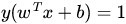（还记得我们把 functional margin 定为 1 了吗？上节中：“处于方便推导和优化的目的，我们可以令=1”），而对于所有不是支持向量的点，也就是在“阵地后方”的点，则显然有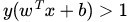。当然，除了从几何直观上之外，支持向量的概念也可以从下文优化过程的推导中得到。

OK，到此为止，算是了解到了SVM的第一层，对于那些只关心怎么用SVM的朋友便已足够，不必再更进一层深究其更深的原理。

##第二层、深入SVM
### 2.1、从线性可分到线性不可分
####*2.1.1、从原始问题到对偶问题的求解*
虽然上文1.4节给出了目标函数，却没有讲怎么来求解。现在就让我们来处理这个问题。回忆一下之前得到的目标函数（subject to导出的则是约束条件）：

由于求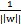的最大值相当于求的最小值，所以上述问题等价于（w由分母变成分子，从而也有原来的max问题变为min问题，很明显，两者问题等价）：

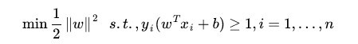

1. 转化到这个形式后，我们的问题成为了一个凸优化问题，或者更具体的说，因为现在的目标函数是二次的，约束条件是线性的，所以它是一个凸二次规划问题。这个问题可以用任何现成的 [QP (Quadratic Programming)](http://en.wikipedia.org/wiki/Quadratic_programming) 的优化包进行求解，归结为一句话即是：在一定的约束条件下，目标最优，损失最小；
2. 但虽然这个问题确实是一个标准的 QP 问题，但是它也有它的特殊结构，通过 [Lagrange Duality](http://en.wikipedia.org/wiki/Lagrange_duality#The_strong_Lagrangian_principle:_Lagrange_duality) 变换到对偶变量 (dual variable) 的优化问题之后，可以找到一种更加有效的方法来进行求解，而且通常情况下这种方法比直接使用通用的 QP 优化包进行优化要高效得多。

也就说，除了用解决QP问题的常规方法之外，还可以通过求解对偶问题得到最优解，这就是线性可分条件下支持向量机的对偶算法，这样做的优点在于：一者对偶问题往往更容易求解；二者可以自然的引入核函数，进而推广到非线性分类问题。

至于上述提到，关于什么是Lagrange duality？简单地来说，通过给每一个约束条件加上一个 Lagrange multiplier(拉格朗日乘值)，即引入拉格朗日乘子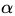，如此我们便可以通过拉格朗日函数将约束条件融和到目标函数里去(也就是说把条件融合到一个函数里头，现在只用一个函数表达式便能清楚的表达出我们的问题)：

然后我们令

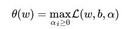

容易验证，当某个约束条件不满足时，例如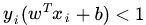，那么我们显然有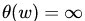（只要令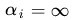即可）。而当所有约束条件都满足时，则有，亦即我们最初要最小化的量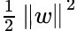。因此，在要求约束条件得到满足的情况下最小化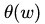，实际上等价于直接最小化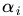（当然，这里也有约束条件，就是≥0,i=1,…,n）   ，因为如果约束条件没有得到满足，会等于无穷大，自然不会是我们所要求的最小值。具体写出来，我们现在的目标函数变成了：

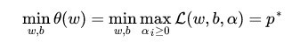

这里用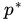表示这个问题的最优值，这个问题和我们最初的问题是等价的。不过，现在我们来把最小和最大的位置交换一下（稍后，你将看到，当下面式子满足了一定的条件之后，这个式子d 便是上式P 的对偶形式表示）：

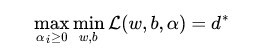

当然，交换以后的问题不再等价于原问题，这个新问题的最优值用来表示。并且，我们有≤ ，这在直观上也不难理解，最大值中最小的一个总也比最小值中最大的一个要大吧！  总之，第二个问题的最优值在这里提供了一个第一个问题的最优值的一个下界，在满足某些条件的情况下，这两者相等，这个时候我们就可以通过求解第二个问题来间接地求解第一个问题。

也就是说，下面我们将先求L 对w、b的极小，再求L 对的极大。而且，之所以从minmax的原始问题，转化为maxmin的对偶问题，一者因为是的近似解，二者，转化为对偶问题后，更容易求解。

####*2.1.2、KKT条件*
与此同时，上段说“在满足某些条件的情况下”，这所谓的“满足某些条件”就是要满足KKT条件。那KKT条件的表现形式是什么呢？据维基百科：[KKT 条件](http://en.wikipedia.org/wiki/Karush%E2%80%93Kuhn%E2%80%93Tucker_conditions)的介绍，一般地，一个最优化数学模型能够表示成下列标准形式：

其中，f(x)是需要最小化的函数，h(x)是等式约束，g(x)是不等式约束，p和q分别为等式约束和不等式约束的数量。同时，我们得明白以下两个定理：

* 凸优化的概念：为一凸集，  为一凸函数。凸优化就是要找出一点 ，使得每一  满足 。
* KKT条件的意义：它是一个非线性规划（Nonlinear Programming）问题能有最优化解法的必要和充分条件。

那到底什么是所谓Karush-Kuhn-Tucker条件呢？KKT条件就是指上面最优化数学模型的标准形式中的最小点 x* 必须满足下面的条件：

经过论证，我们这里的问题是满足 KKT 条件的（首先已经满足Slater condition，再者f和gi也都是可微的，即L对w和b都可导），因此现在我们便转化为求解第二个问题。也就是说，现在，咱们的原问题通过满足一定的条件，已经转化成了对偶问题。而求解这个对偶学习问题，分为3个步骤，首先要让L(w，b，a) 关于 w 和 b 最小化，然后求对α的极大，最后利用SMO算法求解对偶因子。

####*2.1.3、对偶问题求解的3个步骤*
（）1）、首先固定，要让 L 关于 w 和 b 最小化，我们分别对w，b求偏导数，即令 ∂L/∂w 和 ∂L/∂b 等于零（对w求导结果的解释请看本文评论下第45楼回复）：

					

以上结果代回上述的 L： 

得到：

提醒：有读者可能会问上述推导过程如何而来？说实话，其具体推导过程是比较复杂的，如下图所示：

最后，得到：

如 jerrylead所说：“倒数第4步”推导到“倒数第3步”使用了线性代数的转置运算，由于ai和yi都是实数，因此转置后与自身一样。“倒数第3步”推导到“倒数第2步”使用了(a+b+c+…)(a+b+c+…)=aa+ab+ac+ba+bb+bc+…的乘法运算法则。最后一步是上一步的顺序调整。

L(
从上面的最后一个式子，我们可以看出，此时的拉格朗日函数只包含了一个变量，那就是，然后下文的第2步，求出了便能求出w，和b，由此可见，上文第1.2节提出来的核心问题：分类函数也就可以轻而易举的求出来了。

（2）、求对的极大，即是关于对偶问题的最优化问题，从上面的式子得到：

(不得不提醒下读者：经过上面第一个步骤的求w和b，得到的拉格朗日函数式子已经没有了变量w，b，只有，而反过来，求得的将能导出w，b的解，最终得出分离超平面和分类决策函数。为何呢？因为如果求出了，根据，即可求出w。然后通过，即可求出b )

如前面所说，这个问题有更加高效的优化算法，即我们常说的SMO算法。

####*2.1.4、序列最小最优化SMO算法*
细心的读者读至上节末尾处，怎么拉格朗日乘子的值可能依然心存疑惑。实际上，关于的求解可以用一种快速学习算法即SMO算法，这里先简要介绍下。

OK，当：

要解决的是在参数上求最大值W的问题，至于和都是已知数（其中  是一个参数，用于控制目标函数中两项（“寻找 margin 最大的超平面”和“保证数据点偏差量最小”）之间的权重。和上文最后的式子对比一下，可以看到唯一的区别就是现在 dual variable  多了一个上限 C ，关于C的具体由来请查看下文第2.3节）。

要了解这个SMO算法是如何推导的，请跳到下文第3.5节、SMO算法。
####*2.1.5、线性不可分的情况*

OK，为过渡到下节2.2节所介绍的核函数，让我们再来看看上述推导过程中得到的一些有趣的形式。首先就是关于我们的 hyper plane ，对于一个数据点 x 进行分类，实际上是通过把 x 带入到算出结果然后根据其正负号来进行类别划分的。而前面的推导中我们得到 

因此分类函数为：

这里的形式的有趣之处在于，对于新点 x的预测，只需要计算它与训练数据点的内积即可（<.,.>表示向量内积），这一点至关重要，是之后使用 Kernel 进行非线性推广的基本前提。此外，所谓 Supporting Vector 也在这里显示出来——事实上，所有非Supporting Vector 所对应的系数都是等于零的，因此对于新点的内积计算实际上只要针对少量的“支持向量”而不是所有的训练数据即可。

为什么非支持向量对应的等于零呢？直观上来理解的话，就是这些“后方”的点——正如我们之前分析过的一样，对超平面是没有影响的，由于分类完全有超平面决定，所以这些无关的点并不会参与分类问题的计算，因而也就不会产生任何影响了。

回忆一下我们2.1.1节中通过 Lagrange multiplier得到的目标函数：

注意到如果 xi 是支持向量的话，上式中红颜色的部分是等于 0 的（因为支持向量的 functional margin 等于 1 ），而对于非支持向量来说，functional margin 会大于 1 ，因此红颜色部分是大于零的，而又是非负的，为了满足最大化，必须等于 0 。这也就是这些非Supporting Vector 的点的局限性。 

从1.5节到上述所有这些东西，便得到了一个maximum margin hyper plane classifier，这就是所谓的支持向量机（Support Vector Machine）。当然，到目前为止，我们的 SVM 还比较弱，只能处理线性的情况，不过，在得到了对偶dual 形式之后，通过 Kernel 推广到非线性的情况就变成了一件非常容易的事情了(相信，你还记得本节开头所说的：“通过求解对偶问题得到最优解，这就是线性可分条件下支持向量机的对偶算法，这样做的优点在于：一者对偶问题往往更容易求解；二者可以自然的引入核函数，进而推广到非线性分类问题”)。

###2.2、核函数Kernel

####*2.2.1、特征空间的隐式映射：核函数*
咱们首先给出核函数的来头：

* 在上文中，我们已经了解到了SVM处理线性可分的情况，而对于非线性的情况，SVM 的处理方法是选择一个核函数 κ(⋅,⋅) ，通过将数据映射到高维空间，来解决在原始空间中线性不可分的问题。由于核函数的优良品质，这样的非线性扩展在计算量上并没有比原来复杂多少，这一点是非常难得的。当然，这要归功于核方法——除了 SVM 之外，任何将计算表示为数据点的内积的方法，都可以使用核方法进行非线性扩展。

也就是说，Minsky和Papert早就在20世纪60年代就已经明确指出线性学习器计算能力有限。为什么呢？因为总体上来讲，现实世界复杂的应用需要有比线性函数更富有表达能力的假设空间，也就是说，目标概念通常不能由给定属性的简单线性函数组合产生，而是应该一般地寻找待研究数据的更为一般化的抽象特征。

而下文我们将具体介绍的核函数则提供了此种问题的解决途径，从下文你将看到，核函数通过把数据映射到高维空间来增加第一节所述的线性学习器的能力，使得线性学习器对偶空间的表达方式让分类操作更具灵活性和可操作性。因为训练样例一般是不会独立出现的，它们总是以成对样例的内积形式出现，而用对偶形式表示学习器的优势在为在该表示中可调参数的个数不依赖输入属性的个数，通过使用恰当的核函数来替代内积，可以隐式得将非线性的训练数据映射到高维空间，而不增加可调参数的个数(当然，前提是核函数能够计算对应着两个输入特征向量的内积)。

1、 简而言之：在线性不可分的情况下，支持向量机通过某种事先选择的非线性映射(核函数)将输入变量映射到一个高维特征空间，在这个空间中构造最优分类超平面。我们使用SVM进行数据集分类工作的过程首先是同预先选定的一些非线性映射将输入空间映射到高维特征空间(下图很清晰的表达了通过映射到高维特征空间，而把平面上本身不好分的非线性数据分了开来)：

使得在高维属性空间中有可能最训练数据实现超平面的分割，避免了在原输入空间中进行非线性曲面分割计算。SVM数据集形成的分类函数具有这样的性质：它是一组以支持向量为参数的非线性函数的线性组合，因此分类函数的表达式仅和支持向量的数量有关，而独立于空间的维度，在处理高维输入空间的分类时，这种方法尤其有效，其工作原理如下图所示：

2、 具体点说：在我们遇到核函数之前，如果用原始的方法，那么在用线性学习器学习一个非线性关系，需要选择一个非线性特征集，并且将数据写成新的表达形式，这等价于应用一个固定的非线性映射，将数据映射到特征空间，在特征空间中使用线性学习器，因此，考虑的假设集是这种类型的函数：

这里ϕ：X->F是从输入空间到某个特征空间的映射，这意味着建立非线性学习器分为两步：

1. 首先使用一个非线性映射将数据变换到一个特征空间F，
2. 然后在特征空间使用线性学习器分类。

在上文我提到过对偶形式，而这个对偶形式就是线性学习器的一个重要性质，这意味着假设可以表达为训练点的线性组合，因此决策规则可以用测试点和训练点的内积来表示：

如果有一种方式可以在特征空间中直接计算内积〈φ(xi · φ(x)〉，就像在原始输入点的函数中一样，就有可能将两个步骤融合到一起建立一个非线性的学习器，这样直接计算法的方法称为核函数方法，于是，核函数便横空出世了。

这里我直接给出一个定义：核是一个函数K，对所有x，z(-X，满足，这里φ是从X到内积特征空间F的映射。

3、 总而言之，举个简单直接点的例子，如@Wind所说：如果不是用核技术，就会先计算线性映射phy(x1)和phy(x2),然后计算这两个特征的内积，使用了核技术之后，先把phy(x1)和phy(x2)的通用表达式子：< phy(x1)，phy(x2) >=k( <x1,x2> )计算出来，注意到这里的< ， >表示内积，k( , )就是对应的核函数，这个表达往往非常简单，所以计算非常方便。

OK，接下来，咱们就进一步从外到里，来探探这个核函数的真面目。

####*2.2.2、核函数：如何处理非线性数据*

在2.1节中我们介绍了线性情况下的支持向量机，它通过寻找一个线性的超平面来达到对数据进行分类的目的。不过，由于是线性方法，所以对非线性的数据就没有办法处理。举个例子来说，则是如下图所示的两类数据，分别分布为两个圆圈的形状，这样的数据本身就是线性不可分的，此时咱们该如何把这两类数据分开呢(下文将会有一个相应的三维空间图)？

事实上，上图所述的这个数据集，是用两个半径不同的圆圈加上了少量的噪音生成得到的，所以，一个理想的分界应该是一个“圆圈”而不是一条线（超平面）。如果用 X1 和 X2 来表示这个二维平面的两个坐标的话，我们知道一条二次曲线（圆圈是二次曲线的一种特殊情况）的方程可以写作这样的形式：

注意上面的形式，如果我们构造另外一个五维的空间，其中五个坐标的值分别为 Z1=X1, Z2=X21, Z3=X2, Z4=X22, Z5=X1X2，那么显然，上面的方程在新的坐标系下可以写作：

关于新的坐标 Z ，这正是一个 hyper plane 的方程！也就是说，如果我们做一个映射 ϕ:R2→R5 ，将 X 按照上面的规则映射为 Z ，那么在新的空间中原来的数据将变成线性可分的，从而使用之前我们推导的线性分类算法就可以进行处理了。这正是 Kernel 方法处理非线性问题的基本思想。

再进一步描述 Kernel 的细节之前，不妨再来看看这个例子映射过后的直观例子。当然，你我可能无法把 5 维空间画出来，不过由于我这里生成数据的时候就是用了特殊的情形，具体来说，我这里的超平面实际的方程是这个样子（圆心在 X2 轴上的一个正圆）：

因此我只需要把它映射到 Z1=X21, Z2=X22, Z3=X2 这样一个三维空间中即可，下图即是映射之后的结果，将坐标轴经过适当的旋转，就可以很明显地看出，数据是可以通过一个平面来分开的(pluskid：下面的gif 动画，先用 Matlab 画出一张张图片，再用 Imagemagick 拼贴成)：

现在让我们再回到 SVM 的情形，假设原始的数据时非线性的，我们通过一个映射 ϕ(⋅) 将其映射到一个高维空间中，数据变得线性可分了，这个时候，我们就可以使用原来的推导来进行计算，只是所有的推导现在是在新的空间，而不是原始空间中进行。当然，推导过程也并不是可以简单地直接类比的，例如，原本我们要求超平面的法向量 w ，但是如果映射之后得到的新空间的维度是无穷维的（确实会出现这样的情况，比如后面会提到的 高斯核Gaussian Kernel ），要表示一个无穷维的向量描述起来就比较麻烦。于是我们不妨先忽略过这些细节，直接从最终的结论来分析，回忆一下，我们上一次2.1节中得到的最终的分类函数是这样的：

现在则是在映射过后的空间，即：

而其中的 α 也是通过求解如下 dual 问题而得到的：

这样一来问题就解决了吗？似乎是的：拿到非线性数据，就找一个映射 ϕ(⋅) ，然后一股脑把原来的数据映射到新空间中，再做线性 SVM 即可。不过事实上没有这么简单！其实刚才的方法稍想一下就会发现有问题：在最初的例子里，我们对一个二维空间做映射，选择的新空间是原始空间的所有一阶和二阶的组合，得到了五个维度；如果原始空间是三维，那么我们会得到 19 维的新空间，这个数目是呈爆炸性增长的，这给 ϕ(⋅) 的计算带来了非常大的困难，而且如果遇到无穷维的情况，就根本无从计算了。所以就需要 Kernel 出马了。

不妨还是从最开始的简单例子出发，设两个向量和，而ϕ(⋅)即是到前面2.2.1节说的五维空间的映射，因此映射过后的内积为：

（公式说明：上面的这两个推导过程中，所说的前面的五维空间的映射，这里说的前面便是文中2.2.1节的所述的映射方式，仔细看下2.2.1节的映射规则，再看那第一个推导，其实就是计算x1，x2各自的内积，然后相乘相加即可，第二个推导则是直接平方，去掉括号，也很容易推出来）

另外，我们又注意到：

二者有很多相似的地方，实际上，我们只要把某几个维度线性缩放一下，然后再加上一个常数维度，具体来说，上面这个式子的计算结果实际上和映射

之后的内积的结果是相等的，那么区别在于什么地方呢？

一个是映射到高维空间中，然后再根据内积的公式进行计算；
而另一个则直接在原来的低维空间中进行计算，而不需要显式地写出映射后的结果。
    （公式说明：上面之中，最后的两个式子，第一个算式，是带内积的完全平方式，可以拆开，然后，通过凑一个得到，第二个算式，也是根据第一个算式凑出来的）

回忆刚才提到的映射的维度爆炸，在前一种方法已经无法计算的情况下，后一种方法却依旧能从容处理，甚至是无穷维度的情况也没有问题。

我们把这里的计算两个向量在隐式映射过后的空间中的内积的函数叫做核函数 (Kernel Function) ，例如，在刚才的例子中，我们的核函数为：

核函数能简化映射空间中的内积运算——刚好“碰巧”的是，在我们的 SVM 里需要计算的地方数据向量总是以内积的形式出现的。对比刚才我们上面写出来的式子，现在我们的分类函数为：

其中  由如下 dual 问题计算而得：

这样一来计算的问题就算解决了，避开了直接在高维空间中进行计算，而结果却是等价的！当然，因为我们这里的例子非常简单，所以我可以手工构造出对应于ϕ(⋅)的核函数出来，如果对于任意一个映射，想要构造出对应的核函数就很困难了。

####*2.2.3、几个核函数*
通常人们会从一些常用的核函数中选择（根据问题和数据的不同，选择不同的参数，实际上就是得到了不同的核函数），例如：

* 多项式核，显然刚才我们举的例子是这里多项式核的一个特例（R = 1，d = 2）。虽然比较麻烦，而且没有必要，不过这个核所对应的映射实际上是可以写出来的，该空间的维度是，其中m是原始空间的维度。

* 高斯核，这个核就是最开始提到过的会将原始空间映射为无穷维空间的那个家伙。不过，如果选得很大的话，高次特征上的权重实际上衰减得非常快，所以实际上（数值上近似一下）相当于一个低维的子空间；反过来，如果选得很小，则可以将任意的数据映射为线性可分——当然，这并不一定是好事，因为随之而来的可能是非常严重的过拟合问题。不过，总的来说，通过调控参数，高斯核实际上具有相当高的灵活性，也是使用最广泛的核函数之一。下图所示的例子便是把低维线性不可分的数据通过高斯核函数映射到了高维空间：

* 线性核，这实际上就是原始空间中的内积。这个核存在的主要目的是使得“映射后空间中的问题”和“映射前空间中的问题”两者在形式上统一起来了(意思是说，咱们有的时候，写代码，或写公式的时候，只要写个模板或通用表达式，然后再代入不同的核，便可以了，于此，便在形式上统一了起来，不用再分别写一个线性的，和一个非线性的)。

####*2.2.4、核函数的本质*

上面说了这么一大堆，读者可能还是没明白核函数到底是个什么东西？我再简要概括下，即以下三点：

1. 实际中，我们会经常遇到线性不可分的样例，此时，我们的常用做法是把样例特征映射到高维空间中去(如上文2.2节最开始的那幅图所示，映射到高维空间后，相关特征便被分开了，也就达到了分类的目的)；

2. 但进一步，如果凡是遇到线性不可分的样例，一律映射到高维空间，那么这个维度大小是会高到可怕的(如上文中19维乃至无穷维的例子)。那咋办呢？

3. 此时，核函数就隆重登场了，核函数的价值在于它虽然也是讲特征进行从低维到高维的转换，但核函数绝就绝在它事先在低维上进行计算，而将实质上的分类效果表现在了高维上，也就如上文所说的避免了直接在高维空间中的复杂计算。

经过前面内容的讲解，我们已经知道，当把内积变成之后，求将有两种方法：

1、先找到这种映射，然后将输入空间中的样本映射到新的空间中，最后在新空间中去求内积。以多项式 为例，对其进行变换，，，，，得到：，也就是说通过把输入空间从二维向四维映射后，样本由线性不可分变成了线性可分，但是这种转化带来的直接问题是维度变高了，这意味着，首先可能导致后续计算变复杂，其次可能出现维度之咒，对于学习器而言就是：特征空间维数可能最终无法计算，而它的泛化能力(学习器对训练样本以外数据的适应性)会随着维度的增长而大大降低，这也违反了“奥坎姆的剃刀”，最终可能会使得内积无法求出，于是也就失去了这种转化的优势了；

1、或者是找到某种方法，它不需要显式的将输入空间中的样本映射到新的空间中而能够在输入空间中直接计算出内积。它其实是对输入空间向高维空间的一种隐式映射，它不需要显式的给出那个映射，在输入空间就可以计算，这就是传说中的核函数方法。

最后引用[这里](http://www.yaksis.com/posts/why-use-svm.html)的一个例子举例说明下核函数解决非线性问题的直观效果。

假设现在你是一个农场主，圈养了一批羊群，但为预防狼群袭击羊群，你需要搭建一个篱笆来把羊群围起来。但是篱笆应该建在哪里呢？你很可能需要依据牛群和狼群的位置建立一个“分类器”，比较下图这几种不同的分类器，我们可以看到SVM完成了一个很完美的解决方案。

这个例子从侧面简单说明了SVM使用非线性分类器的优势，而逻辑模式以及决策树模式都是使用了直线方法。

OK，不再做过多介绍了，对核函数有进一步兴趣的，还可以看看此文。

###2.3、使用松弛变量处理 outliers 方法

在本文第一节最开始讨论支持向量机的时候，我们就假定，数据是线性可分的，亦即我们可以找到一个可行的超平面将数据完全分开。后来为了处理非线性数据，在上文2.2节使用 Kernel 方法对原来的线性 SVM 进行了推广，使得非线性的的情况也能处理。虽然通过映射 ϕ(⋅) 将原始数据映射到高维空间之后，能够线性分隔的概率大大增加，但是对于某些情况还是很难处理。

例如可能并不是因为数据本身是非线性结构的，而只是因为数据有噪音。对于这种偏离正常位置很远的数据点，我们称之为 outlier ，在我们原来的 SVM 模型里，outlier 的存在有可能造成很大的影响，因为超平面本身就是只有少数几个 support vector 组成的，如果这些 support vector 里又存在 outlier 的话，其影响就很大了。例如下图：

用黑圈圈起来的那个蓝点是一个 outlier ，它偏离了自己原本所应该在的那个半空间，如果直接忽略掉它的话，原来的分隔超平面还是挺好的，但是由于这个 outlier 的出现，导致分隔超平面不得不被挤歪了，变成途中黑色虚线所示（这只是一个示意图，并没有严格计算精确坐标），同时 margin 也相应变小了。当然，更严重的情况是，如果这个 outlier 再往右上移动一些距离的话，我们将无法构造出能将数据分开的超平面来。

为了处理这种情况，SVM 允许数据点在一定程度上偏离一下超平面。例如上图中，黑色实线所对应的距离，就是该 outlier 偏离的距离，如果把它移动回来，就刚好落在原来的超平面上，而不会使得超平面发生变形了。

插播下一位读者@Copper_PKU的理解：“换言之，在有松弛的情况下outline点也属于支持向量SV，同时，对于不同的支持向量，拉格朗日参数的值也不同，如此篇论文《Large Scale Machine Learning》中的下图所示：

对于远离分类平面的点值为0；对于边缘上的点值在[0, 1/L]之间，其中，L为训练数据集个数，即数据集大小；对于outline数据和内部的数据值为1/L。更多请参看本文文末参考条目第51条。”

OK，继续回到咱们的问题。我们，原来的约束条件为：

现在考虑到outlier问题，约束条件变成了：

其中称为松弛变量 (slack variable) ，对应数据点允许偏离的 functional margin 的量。当然，如果我们运行任意大的话，那任意的超平面都是符合条件的了。所以，我们在原来的目标函数后面加上一项，使得这些的总和也要最小：

其中 C 是一个参数，用于控制目标函数中两项（“寻找 margin 最大的超平面”和“保证数据点偏差量最小”）之间的权重。注意，其中  是需要优化的变量（之一），而 C 是一个事先确定好的常量。完整地写出来是这个样子：

用之前的方法将限制或约束条件加入到目标函数中，得到新的拉格朗日函数，如下所示：

分析方法和前面一样，转换为另一个问题之后，我们先让针对w、b和最小化：

将 w 带回  并化简，得到和原来一样的目标函数：

不过，由于我们得到而又有ri >= 0（作为 Lagrange multiplier 的条件），因此有，所以整个 dual 问题现在写作：

把前后的结果对比一下（错误修正：图中的Dual formulation中的Minimize应为maxmize）：

可以看到唯一的区别就是现在 dual variable  多了一个上限 C 。而 Kernel 化的非线性形式也是一样的，只要把换成即可。这样一来，一个完整的，可以处理线性和非线性并能容忍噪音和 outliers 的支持向量机才终于介绍完毕了。

行文至此，可以做个小结，不准确的说，SVM它本质上即是一个分类方法，用w^T+b定义分类函数，于是求w、b，为寻最大间隔，引出1/2||w||^2，继而引入拉格朗日因子，化为对拉格朗日乘子a的求解（求解过程中会涉及到一系列最优化或凸二次规划等问题），如此，求w.b与求a等价，而a的求解可以用一种快速学习算法SMO，至于核函数，是为处理非线性情况，若直接映射到高维计算恐维度爆炸，故在低维计算，等效高维表现。

OK，理解到这第二层，已经能满足绝大部分人一窥SVM原理的好奇心，然对于那些想在证明层面理解SVM的则还很不够，但进入第三层理解境界之前，你必须要有比较好的数理基础和逻辑证明能力，不然你会跟我一样，吃不少苦头的。

##第三层、证明SVM

说实话，凡是涉及到要证明的东西.理论，便一般不是怎么好惹的东西。绝大部分时候，看懂一个东西不难，但证明一个东西则需要点数学功底，进一步，证明一个东西也不是特别难，难的是从零开始发明创造这个东西的时候，则显艰难(因为任何时代，大部分人的研究所得都不过是基于前人的研究成果，前人所做的是开创性工作，而这往往是最艰难最有价值的，他们被称为真正的先驱。牛顿也曾说过，他不过是站在巨人的肩上。你，我则更是如此)。

正如陈希孺院士在他的著作《数理统计学简史》的第4章、最小二乘法中所讲：在科研上诸多观念的革新和突破是有着很多的不易的，或许某个定理在某个时期由某个人点破了，现在的我们看来一切都是理所当然，但在一切没有发现之前，可能许许多多的顶级学者毕其功于一役，耗尽一生，努力了几十年最终也是无功而返。

话休絮烦，要证明一个东西先要弄清楚它的根基在哪，即构成它的基础是哪些理论。OK，以下内容基本是上文中未讲到的一些定理的证明，包括其背后的逻辑、来源背景等东西，还是读书笔记。

本部分导述

* 3.1节线性学习器中，主要阐述感知机算法；
* 3.2节非线性学习器中，主要阐述mercer定理；
* 3.3节、损失函数；
* 3.4节、最小二乘法；
* 3.5节、SMO算法；
* 3.6节、简略谈谈SVM的应用；
* 3.1、线性学习器

####*3.1.1、感知机算法*

这个感知机算法是1956年提出的，年代久远，依然影响着当今，当然，可以肯定的是，此算法亦非最优，后续会有更详尽阐述。不过，有一点，你必须清楚，这个算法是为了干嘛的：不断的训练试错以期寻找一个合适的超平面(是的，就这么简单)。

下面，举个例子。如下图所示，凭我们的直觉可以看出，图中的红线是最优超平面，蓝线则是根据感知机算法在不断的训练中，最终，若蓝线能通过不断的训练移动到红线位置上，则代表训练成功。

既然需要通过不断的训练以让蓝线最终成为最优分类超平面，那么，到底需要训练多少次呢？Novikoff定理告诉我们当间隔是正的时候感知机算法会在有限次数的迭代中收敛，也就是说Novikoff定理证明了感知机算法的收敛性，即能得到一个界，不至于无穷循环下去。

* Novikoff定理：如果分类超平面存在, 仅需在序列 S 上迭代几次，在界为的错误次数下就可以找到分类超平面，算法停止。

这里，为扩充间隔。根据误分次数公式可知, 迭代次数与对应于扩充(包括偏置)权重的训练集的间隔有关。

顺便再解释下这个所谓的扩充间隔，即为样本到分类间隔的距离，即从引出的最大分类间隔。OK，还记得上文第1.3.2节开头的内容么？如下：“

在给出几何间隔的定义之前，咱们首先来看下，如上图所示，对于一个点 x ，令其垂直投影到超平面上的对应的为 x0 ，由于 w 是垂直于超平面的一个向量，为样本x到分类间隔的距离，我们有

然后后续怎么推导出最大分类间隔请回到本文第一、二部分，此处不重复板书。

同时有一点得注意：感知机算法虽然可以通过简单迭代对线性可分数据生成正确分类的超平面，但不是最优效果，那怎样才能得到最优效果呢，就是上文中第一部分所讲的寻找最大分类间隔超平面。此外，Novikoff定理的证明请见[这里](http://www.cs.columbia.edu/~mcollins/courses/6998-2012/notes/perc.converge.pdf)。

###3.2、非线性学习器
####*3.2.1、Mercer定理*

Mercer定理 ：如果函数K是上的映射（也就是从两个n维向量映射到实数域）。那么如果K是一个有效核函数（也称为Mercer核函数），那么当且仅当对于训练样例，其相应的核函数矩阵是对称半正定的。 

要理解这个Mercer定理，先要了解什么是半正定矩阵，要了解什么是半正定矩阵，先得知道什么是[正定矩阵](http://zh.wikipedia.org/wiki/%E6%AD%A3%E5%AE%9A%E7%9F%A9%E9%98%B5)（矩阵理论“博大精深”，我自己也未能彻底理清，等我理清了再续写此节，顺便推荐我正在看的一本《矩阵分析与应用》）。然后[这里](http://ftp136343.host106.web522.com/a/biancheng/matlab/2013/0120/648.html)有一个此定理的证明，可以看下。

正如@Copper_PKU所说：核函数在SVM的分类效果中起了重要的作用，最后[这里](http://www.cs.berkeley.edu/~bartlett/courses/281b-sp08/7.pdf)有个tutorial可以看看。

###3.3、损失函数

在本文1.0节有这么一句话“支持向量机(SVM)是90年代中期发展起来的基于统计学习理论的一种机器学习方法，通过寻求结构化风险最小来提高学习机泛化能力，实现经验风险和置信范围的最小化，从而达到在统计样本量较少的情况下，亦能获得良好统计规律的目的。”但初次看到的读者可能并不了解什么是结构化风险，什么又是经验风险。要了解这两个所谓的“风险”，还得又从监督学习说起。

监督学习实际上就是一个经验风险或者结构风险函数的最优化问题。风险函数度量平均意义下模型预测的好坏，模型每一次预测的好坏用损失函数来度量。它从假设空间F中选择模型f作为决策函数，对于给定的输入X，由f(X)给出相应的输出Y，这个输出的预测值f(X)与真实值Y可能一致也可能不一致，用一个损失函数来度量预测错误的程度。损失函数记为L(Y, f(X))。

常用的损失函数有以下几种（基本引用自《统计学习方法》）：

      

如此，SVM有第二种理解，即最优化+损失最小，或如@夏粉_百度所说“可从损失函数和优化算法角度看SVM，boosting，LR等算法，可能会有不同收获”。

OK，关于更多统计学习方法的问题，请参看此文。

关于损失函数，如下文读者评论中所述：可以看看张潼的这篇《Statistical behavior and consistency of classification methods based on convex risk minimization》。各种算法中常用的损失函数基本都具有fisher一致性，优化这些损失函数得到的分类器可以看作是后验概率的“代理”。

此外，他还有另外一篇论文《Statistical analysis of some multi-category large margin classification methods》，在多分类情况下margin loss的分析，这两篇对Boosting和SVM使用的损失函数分析的很透彻。

###3.4、最小二乘法
####*3.4.1、什么是最小二乘法？*

既然本节开始之前提到了最小二乘法，那么下面引用《正态分布的前世今生》里的内容稍微简单阐述下。

我们口头中经常说：一般来说，平均来说。如平均来说，不吸烟的健康优于吸烟者，之所以要加“平均”二字，是因为凡事皆有例外，总存在某个特别的人他吸烟但由于经常锻炼所以他的健康状况可能会优于他身边不吸烟的朋友。而最小二乘法的一个最简单的例子便是算术平均。

最小二乘法（又称最小平方法）是一种数学优化技术。它通过最小化误差的平方和寻找数据的最佳函数匹配。利用最小二乘法可以简便地求得未知的数据，并使得这些求得的数据与实际数据之间误差的平方和为最小。用函数表示为：

使误差「所谓误差，当然是观察值与实际真实值的差量」平方和达到最小以寻求估计值的方法，就叫做最小二乘法，用最小二乘法得到的估计，叫做最小二乘估计。当然，取平方和作为目标函数只是众多可取的方法之一。

最小二乘法的一般形式可表示为：

有效的最小二乘法是勒让德在 1805 年发表的，基本思想就是认为测量中有误差，所以所有方程的累积误差为

我们求解出导致累积误差最小的参数即可：

勒让德在论文中对最小二乘法的优良性做了几点说明：

最小二乘使得误差平方和最小，并在各个方程的误差之间建立了一种平衡，从而防止某一个极端误差取得支配地位

计算中只要求偏导后求解线性方程组，计算过程明确便捷

最小二乘可以导出算术平均值作为估计值

对于最后一点，从统计学的角度来看是很重要的一个性质。推理如下：假设真值为 θ, x1,⋯,xn为n次测量值, 每次测量的误差为ei=xi−θ，按最小二乘法，误差累积为

求解 θ 使达到最小，正好是算术平均。

由于算术平均是一个历经考验的方法，而以上的推理说明，算术平均是最小二乘的一个特例，所以从另一个角度说明了最小二乘方法的优良性，使我们对最小二乘法更加有信心。

最小二乘法发表之后很快得到了大家的认可接受，并迅速的在数据分析实践中被广泛使用。不过历史上又有人把最小二乘法的发明归功于高斯，这又是怎么一回事呢。高斯在1809年也发表了最小二乘法，并且声称自己已经使用这个方法多年。高斯发明了小行星定位的数学方法，并在数据分析中使用最小二乘方法进行计算，准确的预测了谷神星的位置。

说了这么多，貌似跟本文的主题SVM没啥关系呀，别急，请让我继续阐述。本质上说，最小二乘法即是一种参数估计方法，说到参数估计，咱们得从一元线性模型说起。

####*3.4.2、最小二乘法的解法*

什么是一元线性模型呢？ 请允许我引用[这里](http://blog.csdn.net/qll125596718/article/details/8248249)的内容，先来梳理下几个基本概念：

* 监督学习中，如果预测的变量是离散的，我们称其为分类（如决策树，支持向量机等），如果预测的变量是连续的，我们称其为回归。

* 回归分析中，如果只包括一个自变量和一个因变量，且二者的关系可用一条直线近似表示，这种回归分析称为一元线性回归分析。

* 如果回归分析中包括两个或两个以上的自变量，且因变量和自变量之间是线性关系，则称为多元线性回归分析。
对于二维空间线性是一条直线；对于三维空间线性是一个平面，对于多维空间线性是一个超平面...   

* 对于一元线性回归模型, 假设从总体中获取了n组观察值（X1，Y1），（X2，Y2）， …，（Xn，Yn）。对于平面中的这n个点，可以使用无数条曲线来拟合。要求样本回归函数尽可能好地拟合这组值。综合起来看，这条直线处于样本数据的中心位置最合理。 

选择最佳拟合曲线的标准可以确定为：使总的拟合误差（即总残差）达到最小。有以下三个标准可以选择：        

1. 用“残差和最小”确定直线位置是一个途径。但很快发现计算“残差和”存在相互抵消的问题。
2. 用“残差绝对值和最小”确定直线位置也是一个途径。但绝对值的计算比较麻烦。
3. 最小二乘法的原则是以“残差平方和最小”确定直线位置。用最小二乘法除了计算比较方便外，得到的估计量还具有优良特性。这种方法对异常值非常敏感。　 

最常用的是普通最小二乘法（ Ordinary  Least Square，OLS）：所选择的回归模型应该使所有观察值的残差平方和达到最小，即采用平方损失函数。 　

我们定义样本回归模型为：

其中ei为样本（Xi, Yi）的误差。
接着，定义平方损失函数Q：

则通过Q最小确定这条直线，即确定，以为变量，把它们看作是Q的函数，就变成了一个求极值的问题，可以通过求导数得到。

求Q对两个待估参数的偏导数：

根据数学知识我们知道，函数的极值点为偏导为0的点。   

解得：

        
这就是最小二乘法的解法，就是求得平方损失函数的极值点。自此，你看到求解最小二乘法与求解SVM问题何等相似，尤其是定义损失函数，而后通过偏导求得极值。

OK，更多请参看陈希孺院士的《数理统计学简史》的第4章、最小二乘法，和本文参考条目第59条《凸函数》。

###3.5、SMO算法

在上文2.1.2节中，我们提到了求解对偶问题的序列最小最优化SMO算法，但并未提到其具体解法。

事实上，SMO算法是由Microsoft Research的John C. Platt在1998年发表的一篇[论文](http://research.microsoft.com/en-us/um/people/jplatt/smoTR.pdf)《Sequential Minimal Optimization A Fast Algorithm for Training Support Vector Machines》中提出，它很快成为最快的二次规划优化算法，特别针对线性SVM和数据稀疏时性能更优。

接下来，咱们便参考John C. Platt的[这篇](http://research.microsoft.com/en-us/um/people/jplatt/smoTR.pdf)文章来看看SMO的解法是怎样的。

####*3.5.1、SMO算法的解法*
咱们首先来定义特征到结果的输出函数为

再三强调，这个u与我们之前定义的实质是一样的。

接着，咱们重新定义咱们原始的优化问题，权当重新回顾，如下：

求导得到：

代入中，可得。

引入对偶因子后，得：

s.t：且

注：这里得到的min函数与我们之前的max函数实质也是一样，因为把符号变下，即有min转化为max的问题，且yi也与之前的等价，yj亦如此。

经过加入松弛变量后，模型修改为：

从而最终我们的问题变为：

继而，根据KKT条件可以得出其中取值的意义为：

这里的还是拉格朗日乘子(问题通过拉格朗日乘法数来求解)

1. 对于第1种情况，表明是正常分类，在边界内部（我们知道正确分类的点yi*f(xi)>=0）；

2. 对于第2种情况，表明了是支持向量，在边界上；

3. 对于第3种情况，表明了是在两条边界之间；

而最优解需要满足KKT条件，即上述3个条件都得满足，以下几种情况出现将会出现不满足：

<=1但是<C则是不满足的,而原本=C

>=1但是>0则是不满足的而原本=0

=1但是=0或者=C则表明不满足的，而原本应该是0<<C

所以要找出不满足KKT条件的这些ai，并更新这些ai，但这些ai又受到另外一个约束，即

注：别忘了2.1.1节中，L对a、b求偏导，得到：

因此，我们通过另一个方法，即同时更新ai和aj，要求满足以下等式：

就能保证和为0的约束。

利用yiai+yjaj=常数，消去ai，可得到一个关于单变量aj的一个凸二次规划问题，不考虑其约束0<=aj<=C,可以得其解为：

这里，，表示旧值。

然后考虑约束0<=aj<=C可得到a的解析解为：

    
把SMO中对于两个参数求解过程看成线性规划来理解来理解的话，那么下图所表达的便是约束条件：

    
    
根据yi和yj同号或异号，可得出两个拉格朗日乘子的上下界分别为：

对于。

那么如何求得ai和aj呢？

* 对于ai，即第一个乘子，可以通过刚刚说的那3种不满足KKT的条件来找；
* 而对于第二个乘子aj可以找满足条件 ：求得。

而b的更新则是：

    
在满足下述条件：

    
下更新b，且每次更新完两个乘子的优化后，都需要再重新计算b，及对应的Ei值。
最后更新所有ai，y和b，这样模型就出来了，从而即可求出咱们开头提出的分类函数

此外，这里也有一篇类似的文章，大家可以参考下。

####*3.5.2、SMO算法的步骤*

这样，SMO的主要步骤如下：

意思是，

第一步选取一对ai和aj，选取方法使用启发式方法；

第二步，固定除ai和aj之外的其他参数，确定W极值条件下的ai，由aj表示ai。

假定在某一次迭代中，需要更新，对应的拉格朗日乘子，，那么这个小规模的二次规划问题写为：

那么在每次迭代中，如何更新乘子呢？引用[这里](http://staff.ustc.edu.cn/~ketang/PPT/PRLec5.pdf)的两张PPT说明下：

知道了如何更新乘子，那么选取哪些乘子进行更新呢？具体选择方法有以下两个步骤：

1. 步骤1：先“扫描”所有乘子，把第一个违反KKT条件的作为更新对象，令为a2；

2. 步骤2：在所有不违反KKT条件的乘子中，选择使|E1 −E2|最大的a1（注：别忘了，其中，而，求出来的E代表函数ui对输入xi的预测值与真实输出类标记yi之差）。

值得一提的是，每次更新完两个乘子的优化后，都需要再重新计算b，及对应的Ei值。

与此同时，乘子的选择务必遵循两个原则：

* 使乘子能满足KKT条件
* 对一个满足KKT条件的乘子进行更新，应能最大限度增大目标函数的值（类似于[梯度](http://zh.wikipedia.org/zh-cn/%E6%A2%AF%E5%BA%A6)下降）

综上，SMO算法的基本思想是将Vapnik在1982年提出的Chunking方法推到极致，SMO算法每次迭代只选出两个分量ai和aj进行调整，其它分量则保持固定不变，在得到解ai和aj之后，再用ai和aj改进其它分量。与通常的分解算法比较，尽管它可能需要更多的迭代次数，但每次迭代的计算量比较小，所以该算法表现出整理的快速收敛性，且不需要存储核矩阵，也没有矩阵运算。

####*3.5.3、SMO算法的实现*

行文至此，我相信，SVM理解到了一定程度后，是的确能在脑海里从头至尾推导出相关公式的，最初分类函数，最大化分类间隔，max1/||w||，min1/2||w||^2，凸二次规划，拉格朗日函数，转化为对偶问题，SMO算法，都为寻找一个最优解，一个最优分类平面。一步步梳理下来，为什么这样那样，太多东西可以追究，最后实现。如下图所示：

至于下文中将阐述的核函数则为是为了更好的处理非线性可分的情况，而松弛变量则是为了纠正或约束少量“不安分”或脱离集体不好归类的因子。

台湾的林智仁教授写了一个封装SVM算法的[libsvm](http://www.csie.ntu.edu.tw/~cjlin/libsvm/)库，大家可以看看，此外[这里](http://www.pami.sjtu.edu.cn/people/gpliu/document/libsvm_src.pdf)还有一份libsvm的注释文档。

除了在这篇论文《fast training of support vector machines using sequential minimal optimization》中platt给出了SMO算法的逻辑代码之外，[这里](http://blog.csdn.net/techq/article/details/6171688)也有一份SMO的实现代码，大家可以看下。

其余更多请参看文末参考文献和推荐阅读中的条目6《支持向量机--算法、理论和扩展》和条目11《统计学习方法》的相关章节，或跳至下文3.4节。

###3.6、SVM的应用

或许我们已经听到过，SVM在很多诸如文本分类，图像分类，生物序列分析和生物数据挖掘，手写字符识别等领域有很多的应用，但或许你并没强烈的意识到，SVM可以成功应用的领域远远超出现在已经在开发应用了的领域。

####*3.6.1、文本分类*

一个文本分类系统不仅是一个自然语言处理系统，也是一个典型的模式识别系统，系统的输入是需要进行分类处理的文本，系统的输出则是与文本关联的类别。由于篇幅所限，其它更具体内容本文将不再详述。

OK，本节虽取标题为证明SVM，但聪明的读者们想必早已看出，其实本部分并无多少证明部分（特此致歉），怎么办呢？可以参阅《支持向量机导论》一书，此书精简而有趣。本节完。

##读者评论
   本文发表后，[微博](http://weibo.com/julyweibo)上的很多朋友给了不少意见，以下是节选的一些精彩评论：
   
1. “压力”陡增的评论→//@藏了个锋：我是看着July大神的博文长大的啊//@zlkysl：就是看了最后那一篇才决定自己的研究方向为SVM的。-- <http://weibo.com/1580904460/zraWk0u6u?mod=weibotime>。

2. @张金辉：“SVM的三重境界，不得不转的一篇。其实Coursera的课堂上Andrew Ng讲过支持向量机，但显然他没有把这作为重点，加上Ng讲支持向量机的方法我一时半会难以完全消化，所以听的也是一知半解。真正开始了解支持向量机就是看的这篇“三重境界”，之后才对这个算法有了大概的概念，以至如何去使用，再到其中的原理为何，再到支持向量机的证明等。总之，这篇文章开启了我长达数月的研究支持向量机阶段，直到今日。”-- <http://zhan.renren.com/profile/249335584?from=template#!//tag/三重境界>。

3. @孤独之守望者："最后，推出svm的cost function 是hinge loss，然后对比其他的方法的cost function，说明其实他们的目标函数很像，那么问题是svm为什么这么popular呢？您可以再加些VC dimension跟一些error bound的数学，点一下，提供一个思路和方向"。-- <http://weibo.com/1580904460/AiohoyDwq?mod=weibotime>。

4. @夏粉_百度：“在面试时，考察SVM可考察机器学习各方面能力：目标函数,优化过程,并行方法，算法收敛性,样本复杂度，适用场景,调参经验，不过个人认为考察boosting和LR也还不错啊。此外，随着统计机器学习不断进步，SVM只被当成使用了一个替代01损失hinge研究，更通用的方法被提出，损失函数研究替代损失与贝叶斯损失关系，算法稳定性研究替代损失与推广性能关系,凸优化研究如何求解凸目标函数，SVM,boosting等算法只是这些通用方法的一个具体组建而已。”

5. @居里猴姐：关于SVM损失函数的问题，可以看看张潼老师的这篇《Statistical behavior and consistency of classification methods based on convex risk minimization》。各种算法中常用的损失函数基本都具有fisher一致性，优化这些损失函数得到的分类器可以看作是后验概率的“代理”。此外，张潼老师还有另外一篇论文《Statistical analysis of some multi-category large margin classification methods》，在多分类情况下margin loss的分析，这两篇对Boosting和SVM使用的损失函数分析的很透彻。

6. @夏粉_百度：SVM用了hinge损失，hinge损失不可导，不如其它替代损失方便优化并且转换概率麻烦。核函数也不太用，现在是大数据时代，样本非常大，无法想象一个n^2的核矩阵如何存储和计算。 而且，现在现在非线性一般靠深度学习了。//@Copper_PKU:请教svm在工业界的应用典型的有哪些？工业界如何选取核函数，经验的方法？svm的训练过程如何优化？

7. @Copper_PKU：July的svm tutorial 我个人觉得还可以加入和修改如下部分：(1) 对于支持向量解释，可以结合图和拉格朗日参数来表达，松弛中sv没有写出来. (2) SMO算法部分，加入Joachims论文中提到的算法，以及SMO算法选取workset的方法，包括SMO算法的收敛判断，还有之前共轭梯度求解方法，虽然是较早的算法，但是对于理解SMO算法有很好的效果。模型的优化和求解都是迭代的过程，加入历史算法增强立体感。--  http://weibo.com/1580904460/Akw6dl3Yk#_rnd1385474436177。

8. //@廖临川: 之所以sgd对大训练集的效果更好，1.因为SGD优化每次迭代使用样本子集，比使用训练全集（尤其是百万数量级）要快得多；2.如果目标函数是凸的或者伪凸的，SGD几乎必然可以收敛到全局最优；否则，则收敛到局部最优；3.SGD一般不需要收敛到全局最优，只要得到足够好的解，就可以立即停止。//@Copper_PKU：sgd的核心思想：是迭代训练，每拿到一个样本就算出基于当前w(t) 的loss function，t代表训练第t次，然后进行下一w（t+1）的更新，w(t+1)=w(t)-(learning rate) * loss function的梯度，这个类比神经网络中bp中的参数训练方法。 sample by sample就是每次仅处理一个样本 而不是一个batch。

9. //@Copper_PKU：从损失函数角度说：primal问题可以理解为正则化项+lossfunction，求解目标是在两个中间取平衡 如果强调loss function最小则会overfitting，所以有C参数。 //@研究者July：SVM还真就是在一定限定条件下，即约束条件下求目标函数的最优值问题，同时，为减少误判率，尽量让损失最小。
11. 
10. ...
    非常享受这种全民大讨论的年代，没有谁一定就对或一定就错，而是各自发表各自的理解见解，真棒！

###参考文献及推荐阅读
1. 《支持向量机导论》，[美] Nello Cristianini / John Shawe-Taylor 著；
2. 支持向量机导论一书的支持网站：<http://www.support-vector.net/>；
3. 《数据挖掘导论》，[美] Pang-Ning Tan / Michael Steinbach / Vipin Kumar 著；
4. 《数据挖掘：概念与技术》，(加)Jiawei Han;Micheline Kamber 著；
5. 《数据挖掘中的新方法：支持向量机》，邓乃扬 田英杰 著；
6. 《支持向量机--理论、算法和扩展》，邓乃扬 田英杰 著；
7. 支持向量机系列，pluskid：<http://blog.pluskid.org/?page_id=683>；
8. <http://www.360doc.com/content/07/0716/23/11966_615252.shtml>；
9. 数据挖掘十大经典算法初探；
10. 《模式识别支持向量机指南》，C.J.C Burges 著；
11. 《统计学习方法》，李航著(第7章有不少内容参考自支持向量机导论一书，不过，可以翻翻看看)；
12. 《统计自然语言处理》，宗成庆编著，第十二章、文本分类；
13. SVM入门系列，Jasper：<http://www.blogjava.net/zhenandaci/category/31868.html>；
14. 最近邻决策和SVM数字识别的实现和比较，作者不详；
15. 斯坦福大学机器学习课程原始讲义：<http://www.cnblogs.com/jerrylead/archive/2012/05/08/2489725.html>；
16. 斯坦福机器学习课程笔记：<http://www.cnblogs.com/jerrylead/tag/Machine%20Learning/>；
17. <http://www.cnblogs.com/jerrylead/archive/2011/03/13/1982639.html>；
18. SMO算法的数学推导：<http://www.cnblogs.com/jerrylead/archive/2011/03/18/1988419.html>；
19. 数据挖掘掘中所需的概率论与数理统计知识、上；
20. 关于机器学习方面的文章，可以读读：<http://www.cnblogs.com/vivounicorn/category/289453.html>；
21. 数学系教材推荐：<http://blog.sina.com.cn/s/blog_5e638d950100dswh.html>；
22. 《神经网络与机器学习(原书第三版)》，[加] Simon Haykin 著；
23. 正态分布的前世今生：<http://t.cn/zlH3Ygc>；
24. 《数理统计学简史》，陈希孺院士著；
25. 《最优化理论与算法(第2版)》，陈宝林编著；
26. A Gentle Introduction to Support Vector Machines in Biomedicine：<http://www.nyuinformatics.org/downloads/supplements/SVM_Tutorial_2010/Final_WB.pdf>，此PPT很赞，除了对引入拉格朗日对偶变量后的凸二次规划问题的深入度不够之外，其它都挺好，配图很精彩，本文有几张图便引自此PPT中；
27. 来自卡内基梅隆大学carnegie mellon university(CMU)的讲解SVM的PPT：<http://www.autonlab.org/tutorials/svm15.pdf>；
28. 发明libsvm的台湾林智仁教授06年的机器学习讲义SVM：<http://wenku.baidu.com/link?url=PWTGMYNb4HGUrUQUZwTH2B4r8pIMgLMiWIK1ymVORrds_11VOkHwp-JWab7IALDiors64JW_6mD93dtuWHwFWxsAk6p0rzchR8Qh5_4jWHC>；
29. <http://staff.ustc.edu.cn/~ketang/PPT/PRLec5.pdf>；
30. Introduction to Support Vector Machines (SVM)，By Debprakash Patnai M.E (SSA)，<https://www.google.com.hk/url?sa=t&rct=j&q=&esrc=s&source=web&cd=1&ved=0CCwQFjAA&url=http%3a%2f%2fwww%2epws%2estu%2eedu%2etw%2fccfang%2findex%2efiles%2fAI%2fAI%26ML-Support%2520Vector%2520Machine-1%2eppt&ei=JRR6UqT5C-iyiQfWyIDgCg&usg=AFQjCNGw1fTbpH4ltQjjmx1d25ZqbCN9nA>；
31. 多人推荐过的libsvm：<http://www.csie.ntu.edu.tw/~cjlin/libsvm/>；
32. 《machine learning in action》，中文版为《机器学习实战》；
33. SMO算法的提出：Sequential Minimal Optimization A Fast Algorithm for Training Support Vector Machines：<http://research.microsoft.com/en-us/um/people/jplatt/smoTR.pdf>；
34. 《统计学习理论的本质》，[美] Vladimir N. Vapnik著，非常晦涩，不做过多推荐；
35. 张兆翔，机器学习第五讲之支持向量机<http://irip.buaa.edu.cn/~zxzhang/courses/MachineLearning/5.pdf>；
36. VC维的理论解释：<http://www.svms.org/vc-dimension/>，中文VC维解释<http://xiaoxia001.iteye.com/blog/1163338>；
37. 来自NEC Labs America的Jason Weston关于SVM的讲义<http://www.cs.columbia.edu/~kathy/cs4701/documents/jason_svm_tutorial.pdf>；
38. 来自MIT的SVM讲义：<http://www.mit.edu/~9.520/spring11/slides/class06-svm.pdf>；
39. PAC问题：<http://www.cs.huji.ac.il/~shashua/papers/class11-PAC2.pdf>；
40. 百度张潼老师的两篇论文：《Statistical behavior and consistency of classification methods based on convex risk minimization》http://home.olemiss.edu/~xdang/676/Consistency_of_Classification_Convex_Risk_Minimization.pdf，《Statistical analysis of some multi-category large margin classification methods》；
41. <http://jacoxu.com/?p=39>；
42. 《矩阵分析与应用》，清华张贤达著；
43. SMO算法的实现：<http://blog.csdn.net/techq/article/details/6171688>；
44. 常见面试之机器学习算法思想简单梳理：<http://www.cnblogs.com/tornadomeet/p/3395593.html>；
45. 矩阵的wikipedia页面：<http://zh.wikipedia.org/wiki/%E7%9F%A9%E9%98%B5>；
46. 最小二乘法及其实现：<http://blog.csdn.net/qll125596718/article/details/8248249>；
47. 统计学习方法概论：<http://blog.csdn.net/qll125596718/article/details/8351337>；
48. <http://www.csdn.net/article/2012-12-28/2813275-Support-Vector-Machine>；
49. A Tutorial on Support Vector Regression：<http://alex.smola.org/papers/2003/SmoSch03b.pdf>；SVR简明版：<http://www.cmlab.csie.ntu.edu.tw/~cyy/learning/tutorials/SVR.pdf>。
50. SVM Org：<http://www.support-vector-machines.org/>；
51. R. Collobert. Large Scale Machine Learning. Université Paris VI phd thesis. 2004：<http://ronan.collobert.com/pub/matos/2004_phdthesis_lip6.pdf>；
52. Making Large-Scale SVM Learning Practical：<http://www.cs.cornell.edu/people/tj/publications/joachims_99a.pdf>；
53. 文本分类与SVM：<http://blog.csdn.net/zhzhl202/article/details/8197109>；
54. Working Set Selection Using Second Order Information
for Training Support Vector Machines：<http://www.csie.ntu.edu.tw/~cjlin/papers/quadworkset.pdf>；
55. SVM Optimization: Inverse Dependence on Training Set Size：<http://icml2008.cs.helsinki.fi/papers/266.pdf>；
56. Large-Scale Support Vector Machines: Algorithms and Theory：<http://cseweb.ucsd.edu/~akmenon/ResearchExam.pdf>；
57. 凸优化的概念：<http://cs229.stanford.edu/section/cs229-cvxopt.pdf>；
58. 《凸优化》，作者: Stephen Boyd / Lieven Vandenberghe，原作名: Convex Optimization；
59. Large-scale Non-linear Classification: Algorithms and Evaluations，Zhuang Wang，讲了很多SVM算法的新进展：<http://ijcai13.org/files/tutorial_slides/te2.pdf>；

##后记

OK，此文从最初2012年5月开始动笔，到后续不断的修改，创造了三个之最，即所写时间最长，所花心血最大，所改次数最多，因为我的目标是让没有任何机器学习基础的都能看懂此文，所以总是不停的改，不停的改，不想放过任何一个小的细节。再者，引用侯捷的一句话是：天下大作，必作于细。

最后，非常感谢pluskid及诸多朋友们的文章及著作，让我有机会在其基础上总结、深入。有任何问题，敬请广大读者随时不吝批评指正，感谢。

###updated、本文PDF版

* 13年11月25日，用chrome浏览器打开文章，右键打印，弹出打印框，把左上角的目标更改为“另存为PDF”，成第一个PDF：<http://vdisk.weibo.com/s/zrFL6OXKghu5V>。

* 13年12月7日，用“印象笔记”提取出博客正文，放到office内编辑成此PDF：<http://vdisk.weibo.com/s/zrFL6OXKgQHm8>，较上一版本添加了完整的书签。

* 14年 2月18日，用Latex全部重排了本文所有公式，而且给所有公式和图片全部做了标记，Latex版下载地址为：<http://vdisk.weibo.com/s/zrFL6OXKgnlcp>。

本文会一直不断翻新，再者，上述3个PDF的阅读体验也还不是最好的，如果有朋友制作了更好的PDF，欢迎分享给我：<http://weibo.com/julyweibo>，谢谢。

July、二零一四年二月十一日于天通苑。

