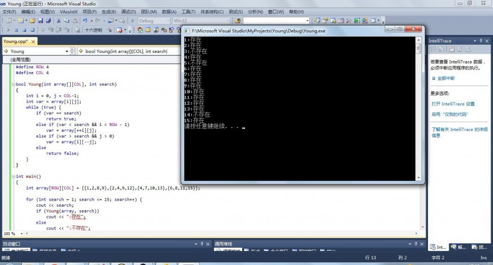

# 第二十三章：杨氏矩阵查找

作者：July、yansha。编程艺术室出品。

出处：结构之法算法之道

## 题目：
在一个m行n列二维数组中，每一行都按照从左到右递增的顺序排序，每一列都按照从上到下递增的顺序排序。请完成一个函数，输入这样的一个二维数组和一个整数，判断数组中是否含有该整数。

例如下面的二维数组就是每行、每列都递增排序。如果在这个数组中查找数字6，则返回true；如果查找数字5，由于数组不含有该数字，则返回false。

本Young问题解法有二（如查找数字6）：

1. 分治法，分为四个矩形，配以二分查找，如果要找的数是6介于对角线上相邻的两个数4、10，可以排除掉左上和右下的两个矩形，而递归在左下和右上的两个矩形继续找，如下图所示：  

2. 定位法，时间复杂度O（m+n）。首先直接定位到最右上角的元素，再配以二分查找，比要找的数（6）大就往左走，比要找数（6）的小就往下走，直到找到要找的数字（6）为止，如下图所示：  

上述方法二的关键代码+程序运行如下图所示：  

试问，上述算法复杂么？不复杂，只要稍微动点脑筋便能想到，还可以参看友人老梦的文章，Young氏矩阵：[http://blog.csdn.net/zhanglei8893/article/details/6234564](http://blog.csdn.net/zhanglei8893/article/details/6234564)，以及IT练兵场的：[http://www.jobcoding.com/array/matrix/young-tableau-problem/](http://www.jobcoding.com/array/matrix/young-tableau-problem/)，除此之外，何海涛先生一书剑指offer中也收集了此题，感兴趣的朋友也可以去看看。
