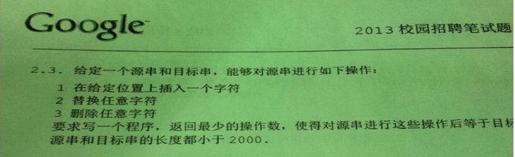
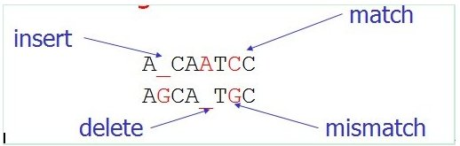
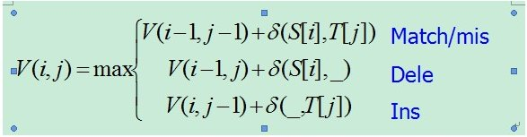
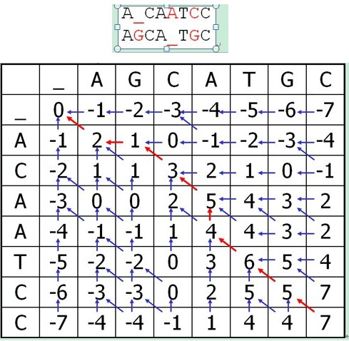
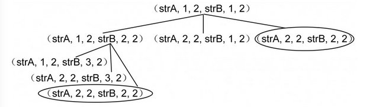
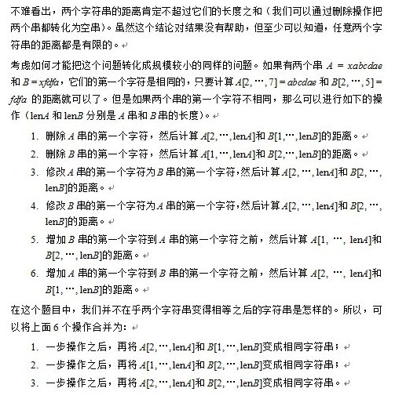

# 第二十九章：字符串编辑距离

##前言
上一章和这一章的问题皆是各大IT公司最喜欢出的笔试面试题之一，比如说前者是小米2013年校招笔试原题，而后者则更是反复出现，如去年9月26日百度一二面试题，10月9日腾讯面试题第1小题，10月13日百度2013校招北京站笔试题第二 大道题第3小题，及去年10月15日2013年Google校招笔试最后一道大题皆是考察的这个字符串编辑距离问题。  


**题目描述:**给定一个源串和目标串，能够对源串进行如下操作：  
1.在给定位置上插入一个字符  
2.替换任意字符  
3.删除任意字符  

写一个程序，返回最小操作数，使得对源串进行这些操作后等于目标串，源串和目标串的长度都小于2000。  

**提醒：**上文前言中已经说过了，此题反复出现，最近考的最多的是百度和Google的笔试面试经常考察。下图则是2013年Google的校招试题原景重现：  



**解法一、**此题跟上面的最大连续乘积子串类似，常见的思路是动态规划，下面是简单的DP状态方程：

```
//动态规划：    
    
//f[i,j]表示s[0...i]与t[0...j]的最小编辑距离。    
f[i,j] = min { f[i-1,j]+1,  f[i,j-1]+1,  f[i-1,j-1]+(s[i]==t[j]?0:1) }    
    
//分别表示：添加1个，删除1个，替换1个（相同就不用替换）。  
```

**解法二、**本解法来自为学论坛：<http://www.51weixue.com/thread-482-1-1.html>。

编辑距离的定义和计算方法如下：  
Given two strings A and B, edit A to B with the minimum number of edit operations:  

* a) .Replace a letter with another letter
* b) .Insert a letter
* c) .Delete a letter

E.g.  
A = interestingly    _i__nterestingly  
B = bioinformatics   bioinformatics__  
                     1011011011001111  
Edit distance = 11  
    Instead of minimizing the number of edge operations, we can associate a cost function to the operations and minimize the total cost. Such cost is called edit distance. Instead of using string edit, in computational biology, people like to use string alignment.We use similarity function, instead of cost function, to evaluate the goodness of the alignment.  
    E.g. of similarity function: match – 2, mismatch, insert, delete – -1.  
Consider two strings ACAATCC and AGCATGC.  
One of their alignment is  



In the above alignment, space (‘\_’) is introduced to both strings. There are 5 matches, 1 mismatch, 1 insert, and 1 delete.The alignment has similarity score 7.  
A\_CAATCC   
AGCA\_TGC  
Note that the above alignment has the maximum score.Such alignment is called optimal alignment.String alignment problem tries to find the alignment with the maximum similarity score!String alignment problem is also called global alignment problem.  
Needleman-Wunsch algorithm
Consider two strings S[1..n] and T[1..m].Define V(i, j) be the score of the optimal alignment between S[1..i] and T[1..j].  
Basis:  
V(0, 0) = 0  
V(0, j) = V(0, j-1) + d(\_, T[j])：Insert j times  
V(i, 0) = V(i-1, 0) + d(S,\_)：Delete i times  
that is:  



Example :  



下面是代码，测试数据比较少，若有问题请指正：  

```c
//copyright@ peng_weida  
//实现代码如下：  
//头文件StrEditDistance.h  
#pragma once  
#include <string>  
class CStrEditDistance  
{  
public:  
    CStrEditDistance(std::string& vStrRow, std::string& vStrColumn);  
    ~CStrEditDistance(void);  
    int  getScore()    { return m_Score;   }  
    int  getEditDis()  { return m_EditDis; }  
    void setEditDis(int vDis) { m_EditDis = vDis; }  
    void setScore(int vScore) { m_Score = vScore; }  
private:  
    void process(const std::string& vStrRow, const std::string& vStrColumn);  
    int getMaxValue(int a, int b, int c)  
    {  
        if (a < b){ if (b < c) return c; return b; }  
        else { if (b > c) return a; return a < c ? c : a; }  
    }  
private:  
    int   m_EditDis;  
    int   m_Score;  
};  
//源文件StrEditDistance.cpp  
#include "StrEditDistance.h"  
#include <iostream>  
#include <iomanip>  
#define MATCH        2  
#define MISS_MATCH   -1  
#define INSERT       -1  
#define DELETE       -1  
CStrEditDistance::CStrEditDistance(std::string& vStrRow, std::string& vStrColumn)  
{  
    process(vStrRow, vStrColumn);  
}  
CStrEditDistance::~CStrEditDistance(void)  
{  
}  
//FUNCTION:  
void CStrEditDistance::process(const std::string& vStrRow, const std::string& vStrColumn)  
{  
    int editDis = 0;     //编辑距离  
    int row = vStrColumn.length();    
    int column = vStrRow.length();  
    const int sizeR = row + 1;  
    const int sizeC = column + 1;  
   
    int **pScore = new int*[sizeR];  //二维指针  
    for (int i = 0; i <= row; i++)  
    pScore = new int[sizeC];  
   
    //初始化第一行和第一列  
    for (int c = 0; c <= column; c++)  
        pScore[0][c] = 0 - c;  
    for (int r = 0; r <= row; r++)  
        pScore[r][0] = 0 - r;  
   
    //从v(1,1)开始每列计算  
    for (int c = 1; c <= column; c++)  
    {  
        for (int r = 1; r <= row; r++)  
        {  
          //计算v(i,j)  
          int valueMatch;  
          if (vStrColumn[r-1] == vStrRow[c-1])  
              valueMatch = MATCH;  
          else  
              valueMatch = MISS_MATCH;    
          int A = pScore[r-1][c] + INSERT;  
          int B = pScore[r][c-1] + DELETE;  
          int C = pScore[r-1][c-1] + valueMatch;  
          pScore[r][c] = getMaxValue(A, B, C);  
        }  
    }  
   
    //计算编辑距离  
    int r = row, c = column;  
    while(r > 0 && c > 0)  
    {  
        if (pScore[r][c]+1 == pScore[r-1][c])      { editDis++; r--; continue; }  
        else if (pScore[r][c]+1 == pScore[r][c-1]) { editDis++; c--; continue; }  
        else if (pScore[r][c]+1 == pScore[r-1][c-1]){ editDis++; r--; c--; continue; }  
        else { r--; c--; }  
    }  
    if (r > 0 && c == 0)  editDis += r;  
    else if (c > 0 && r == 0) editDis += c;  
   
    std::cout << std::endl;  
    //----------------DEBUG-------------------//  
    //打印数据  
    for (int i = 0; i <= row; i++)  
    {  
         for (int j = 0; j <= column; j++)  
         std::cout << std::setw(2) << pScore[j] << "  ";  
         std::cout << std::endl;  
    }  
    std::cout << std::endl;  
   
    //设置编辑距离和得分  
    setEditDis(editDis);  
    setScore(pScore[row][column]);  
   
    for (int i = 0; i <= row; i++)   //释放内存  
    {  
        delete pScore;  
        pScore = NULL;  
    }  
    delete[] pScore;  
}  
```

**类似**   
上述问题类似于编程之美上的下述一题「以下内容摘自编程之美第3.3节」：  

许多程序会大量使用字符串。对于不同的字符串，我们希望能够有办法判断其相似程度。我们定义了一套操作方法来把两个不相同的字符串变得相同，具体的操作方法为：  

1.修改一个字符（如把“a”替换为“b”）；  
2.增加一个字符（如把“abdd ”变为“aebdd ”）；  
3.删除一个字符（如把“travelling”变为“traveling”）。  

比如，对于“abcdefg”和“abcdef ”两个字符串来说，我们认为可以通过增加/减少一个“g”的方式来达到目的。上面的两种方案，都仅需要一次操作。把这个操作所需要的次数定义为两个字符串的距离，而相似度等于“距离+1”的倒数。也就是说，“abcdefg”和“abcdef”的距离为1，相似度为1 / 2 = 0.5。  
给定任意两个字符串，你是否能写出一个算法来计算出它们的相似度呢？  



这样，很快就可以完成一个递归程序，如下所示：

```c
Int CalculateStringDistance(string strA, int pABegin, int pAEnd,    
   string strB, int pBBegin, int pBEnd)     
{    
     if(pABegin > pAEnd)    
     {    
          if(pBBegin > pBEnd)    
               return 0;     
          else    
     
               return pBEnd – pBBegin + 1;    
     }    
    
     if(pBBegin > pBEnd)    
     {    
          if(pABegin > pAEnd)    
               return 0;    
          else    
               return pAEnd – pABegin + 1;    
     }    
    
     if(strA[pABegin] == strB[pBBegin])    
     {    
          return CalculateStringDistance(strA, pABegin + 1, pAEnd,    
            strB, pBBegin + 1, pBEnd);    
     }    
     else    
     {    
          int t1 = CalculateStringDistance(strA, pABegin, pAEnd, strB,     
            pBBegin + 1, pBEnd);    
          int t2 = CalculateStringDistance(strA, pABegin + 1, pAEnd,     
            strB,pBBegin, pBEnd);    
          int t3 = CalculateStringDistance(strA, pABegin + 1, pAEnd,    
            strB,pBBegin + 1, pBEnd);    
          return minValue(t1,t2,t3) + 1;    
     }    
}    
```

上面的递归程序，有什么地方需要改进呢？在递归的过程中，有些数据被重复计算了。比如，如果开始我们调用CalculateStringDistance(strA,1, 2, strB, 1, 2)，下图是部分展开的递归调用。  



可以看到，圈中的两个子问题被重复计算了。为了避免这种不必要的重复计算，可以把子问题计算后的解存储起来。如何修改递归程序呢？还是DP！请看此链接：<http://www.cnblogs.com/yujunyong/articles/2004724.html>。   

##深入
1.详细读者朋友们也已经看到了，百度/Google经常喜欢出这个字符串编辑距离，实际上，关于这个“编辑距离”问题在搜索引擎中有着重要的作用，如搜索引擎关键字查询中拼写错误的提示，如下图所示，当你输入“[Jult](https://www.google.com.hk/search?hl=zh-CN&newwindow=1&safe=strict&site=&source=hp&q=Jult&btnK=Google+%E6%90%9C%E7%B4%A2)”后，因为没有这个单词“Jult”，所以搜索引擎猜测你可能是输入错误，进而会提示你是不是找“July”：


但这个拼写错误检查的原理是什么呢？Google是基于贝叶斯统计推断的方法，相关原理详情可以看下Google的研发总监Peter Norvig写的这篇文章：<http://norvig.com/spell-correct.html>，以及fuanyif写的这篇：<http://www.ruanyifeng.com/blog/2012/10/spelling_corrector.html>。  

2.关于什么是“编辑距离”：一个快速、高效的Levenshtein算法实现，这个是计算两个字符串的算法，Levenshtein距离又称为“编辑距离”，是指两个字符串之间，由一个转换成另一个所需的最少编辑操作次数。当然，次数越小越相似。这里有一个BT树的数据结构，挺有意思的：<http://blog.notdot.net/2007/4/Damn-Cool-Algorithms-Part-1-BK-Trees>；  

3.最后，Lucene中也有这个算法的实现(我想，一般的搜索引擎一般都应该会有此项拼写错误检查功能的实现)，下面是lucene的源码(并没有太多优化，与实际工程中java注重实用性的原则并不背离)：  

```
public final class LevensteinDistance {  
   
    public LevensteinDistance () {  
    }  
      
// Compute Levenshtein distance:   
// see org.apache.commons.lang.StringUtils#getLevenshteinDistance(String, String)  
      
    public float getDistance (String target, String other) {  
      char[] sa;  
      int n;  
      int p[];   
//'previous' cost array, horizontally  
      int d[];   
// cost array, horizontally  
      int _d[];   
//placeholder to assist in swapping p and d  
   
        sa = target.toCharArray();  
        n = sa.length;  
        p = new int[n+1];   
        d = new int[n+1];   
         
        final int m = other.length();  
        if (n == 0 || m == 0) {  
          if (n == m) {  
            return 1;  
          }  
          else {  
            return 0;  
          }  
        }   
          
// indexes into strings s and t  
        int i;   
// iterates through s  
        int j;   
// iterates through t  
   
        char t_j;   
// jth character of t  
   
        int cost;   
// cost  
   
        for (i = 0; i<=n; i++) {  
            p[i] = i;  
        }  
   
        for (j = 1; j<=m; j++) {  
            t_j = other.charAt(j-1);  
            d[0] = j;  
   
            for (i=1; i<=n; i++) {  
                cost = sa[i-1]==t_j ? 0 : 1;  
                  
// minimum of cell to the left+1, to the top+1, diagonally left and up +cost  
                d[i] = Math.min(Math.min(d[i-1]+1, p[i]+1),  p[i-1]+cost);  
            }  
   
              
// copy current distance counts to 'previous row' distance counts  
            _d = p;  
            p = d;  
            d = _d;  
        }  
   
          
// our last action in the above loop was to switch d and p, so p now  
          
// actually has the most recent cost counts  
        return 1.0f - ((float) p[n] / Math.max(other.length(), sa.length));  
    }  
   
}  
```

##扩展
当然，面试官还可以继续问下去，如请问，如何设计一个比较这篇文章和上一篇文章相似性的算法？这个问题的讨论可以看看这里：<http://t.cn/zl82CAH>。OK，字符串编辑距离这个问题实用性很强，限于篇幅，详情读者自己深入吧。  
