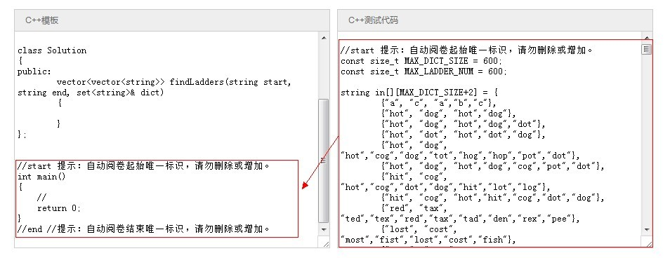
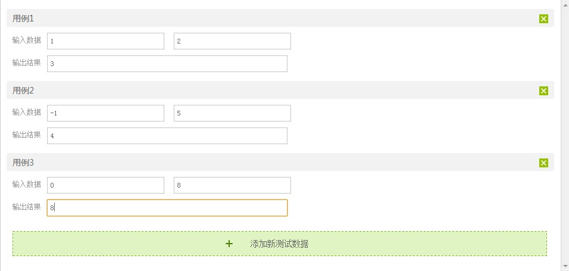
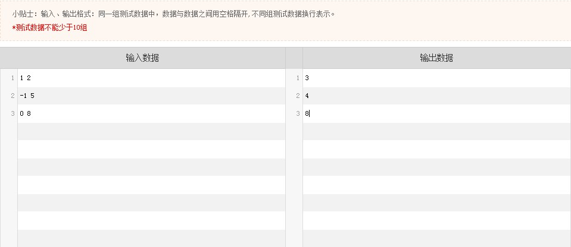

# 第三十八章：Hero在线编程判题、出题系统的演进与优化

####前言

以前出门在外玩的时候，经常跑去网吧，去网吧也不干啥事，看看博客，改改博客，但若想修改博客上的一段代码，却发觉网吧没有装编译器这个东西，可一想到安装它需要不少时间，所以每次想在网吧写代码都作罢。

当时，便想，如果某一天打开浏览器，便能在网页上直接敲代码，那该有多好，随时随地，不受编译器限制。好事多磨，今年3月终于来CSDN来做这样一个在线编程网站Hero了：[http://hero.csdn.net](http://hero.csdn.net)，以项目负责人的身份总体负责它的产品和运营、包括出题。

为何要写此文？本文不谈Hero如何实现，也不谈今年3月至今，它的PV涨了多少倍，不谈每一道题的具体解法、思路、代码是怎样的（日后可能会写），更不谈它的界面是如何一步步优化的，只谈谈它的判题系统、出题系统是如何一步步演进和优化的，即它背后是怎样的一种判题机制（用来判断每天几千个用户提交的程序正确与否），以及如何做到让每一个用户都可以来Hero上出题的。

顺便对很多朋友询问“Hero后台到底是怎样判题的，为何我的程序提交出错？”的一个集中回答，把判题机制开放出来，对每一个Hero的用户做到公平公正。最后年终将至，也算是对自己近一年工作的部分回顾与总结。

OK，本文有何问题，欢迎随时指正，对Hero有任何改进或建议，欢迎随时向我反馈，thanks。


**第三十八章、Hero在线编程判题、出题系统的演进与优化**

####一、最初的人工肉眼判题

Hero从头至尾的实现没有借用过任何开源工具，所以它的每一步探索都显得进展缓慢、推动艰难。在今年3月份之前，在Hero上玩的人不多，所以我刚来公司时，是完全人工肉眼去看每一个用户的程序思路是否正确，不确定的便得自己复制用户的代码粘贴到编译器里进行编译，看结果是否正常。也就是说如果我出一道题：求N个字符的全排列。系统后台只做一件事情，就是把用户的代码简单保存起来。

但打开许多用户的答案后，才发觉他并没有实现全排列，他只是写了一个“hello world”：

```cpp
public class HelloWorld   
{   
    public static void main(String args[])   
    {  
        System.out.println("Hello World");  
    }   
}   
```

即用户的程序是否正确，我得人工判断。这样的人工判题持续了整整一个月，后来发觉来Hero上玩的人越来越多，每天从之前只看几份代码到需要看几百份代码，我便立马觉得不对劲了。

是的，必须得让机器实现自动判题。


####二、写测试代码让机器自动判题

#####2.1、简单粗暴的一系列if else判断

怎么让机器实现自动判题呢？其实原理也挺简单，可以在出题时写一段测试代码，然后用这段包含了很多组测试数据的测试代码去验证用户的程序是否正确。

比如现在有一道题是这样子的：

 “最长有效括号的长度：给定只包含括号字符'('和 ')''的字符串，请找出最长的有效括号内子括号的长度。

举几个例子如下：

例如对于"( ()"，最长的有效的括号中的子字符串是"()" ，有效双括号数1个，故它的长度为 2。 
再比如对于字符串") () () )"，其中最长的有效的括号中的子字符串是"() ()"，有效双括号数2个，故它的长度为4。 
再比如对于"( () () )"，它的长度为6。     

换言之，便是有效双括号"()"数的两倍。

给定函数原型int longestValidParentheses(string s)，

```cpp
#include <string>
#include <iostream>
using namespace std;

class Solution
{
public:
    int longestValidParentheses(string s) {
        // Start typing your C/C++ solution below
        // DO NOT write int main() function
       //....
        return length;
    }
};
//start 提示：自动阅卷起始唯一标识，请勿删除或增加。
int main()
{    
    //write your code
    return 0;
}
//end //提示：自动阅卷结束唯一标识，请勿删除或增加。        
请完成此函数，实现题目所要求的功能。”
    如此，我可能会写这样一段测试代码来验证每一个用户的程序是否正确，如下：
//start 提示：自动阅卷起始唯一标识，请勿删除或增加。  
int main()  
{      
    char* la ="";  
    char* b =    "(";      
    char* c =    ")"    ;  
    char* d =    ")(";      
  
    char* e =    "()";      
    char* f =     "(()";      
    char* g =    "())";      
  
    char* h    = "()()";      
    char* i    = "()(())";      
    char* j =    "(()()";      
    char* k =    "()(()";      
    char* l =    "(()()";      
    char* m =    "(()())";      
    char* n =    "((()))())";      
    char* o =    ")()())()()(";      
    char* p =    ")(((((()())()()))()(()))(";  
  
    Solution a;  
    if (a.longestValidParentheses(la) == 0 && a.longestValidParentheses(b) == 0 && a.longestValidParentheses(c) == 0  
        && a.longestValidParentheses(d) == 0 && a.longestValidParentheses(e) == 2 && a.longestValidParentheses(f) == 2  
        && a.longestValidParentheses(g) == 2 && a.longestValidParentheses(h) == 4 && a.longestValidParentheses(i) == 6  
        && a.longestValidParentheses(j) == 4 && a.longestValidParentheses(k) == 2 && a.longestValidParentheses(l) == 4  
        && a.longestValidParentheses(m) == 6 && a.longestValidParentheses(n) == 8 && a.longestValidParentheses(o) == 4  
        && a.longestValidParentheses(p) == 22  
        )  
    {  
        cout<<"Y!"<<endl;  
    }  
    else  
    {  
        cout<<"N!"<<endl;  
    }  
  
    return 0;  
}  
//end //提示：自动阅卷结束唯一标识，请勿删除或增加。然后用上面那段包含测试数据的测试代码，代替用户的main函数进行判断：
//start 提示：自动阅卷起始唯一标识，请勿删除或增加。  
int main()  
{      
    //write your code  
    return 0;  
}  
//end //提示：自动阅卷结束唯一标识，请勿删除或增加。    
```

这样，只要在出题时写好测试代码，机器便能实现自动判题了。但很快，我们发现上述这样的测试代码有两个可以优化的地方：

一个for循环代替一系列if else；
不用让机器跑完所有测试数据，而是只要有一组测试数据没有通过，程序立即退出，即只要机器找到用户第一组没有通过的测试数据即可。
2.2、for循环代替if else

如上节所说，如果测试数据比较少量，还好说，但数据量一大，那么就得写很长很长一段的if else，那对coding的人来说显得非常业余。于是，针对下面这样一道题来看：
  “合法字符串：用n个不同的字符（编号1 - n），组成一个字符串，有如下2点要求：

	1、对于编号为i 的字符，如果2 * i > n，则该字符可以作为最后一个字符，但如果该字符不是作为最后一个字符的话，则该字符后面可以接任意字符；
	2、对于编号为i的字符，如果2 * i <= n，则该字符不可以作为最后一个字符，且该字符后面所紧接着的下一个字符的编号一定要 >= 2 * i。

问有多少长度为M且符合条件的字符串。

例如：N = 2，M = 3。则abb, bab, bbb是符合条件的字符串，剩下的均为不符合条件的字符串。
输入：n,m  (2<=n,m<=1000000000)；
输出：满足条件的字符串的个数，由于数据很大，输出该数Mod 10^9 + 7的结果。

函数头部

int validstring(int n,int m) {}”
    我们便可以写出如下的测试代码：

```cpp
//start 提示：自动阅卷起始唯一标识，请勿删除或增加。  
int main() {  
    const int n[] = {2,2,66,123,31542/*因为题目还在Hero线上，故只公开一部分测试数据*/};  
    const int m[] = {2,1000000000,634,10000,55555535 /*只公开一部分测试数据*/};  
    const int answer[] = {2,999999994,171104439,8789556,605498333 /*只公开一部分测试数据*/};  
    int i;  
    for (i = 0; i < 4/*实际上i不止4组*/; ++i) {  
        if (validstring(n[i],m[i]) != answer[i]) {  
            break;  
        }  
    }  
    if (i >= 4) {  
        puts("Y!");  
    }  
    else {  
        printf("N!");  
    }  
    return 0;  
}  
//end //提示：自动阅卷结束唯一标识，请勿删除或增加。
```
如此，上面这样的一段测试代码便能让机器自动判断用户提交的每一个程序是否正确。但就像你现在去做也会体会到，系统光告诉我的程序是对是错，估计还远远不够，即如果用户的程序错了，那系统得告诉他怎么错了呀？是因为超时，还是程序本身的逻辑错了。

于是，系统很快便反馈了用户出错的第一组数据，怎么实现的呢？很简单，只要把上面那段判断出用户的程序是错的那部分加上出错的那一组数据即可：

```cpp
//start 提示：自动阅卷起始唯一标识，请勿删除或增加。  
int main() {  
    const int n[] = {2,2,66,123,31542/*因为题目还在Hero线上，故只公开一部分测试数据*/};  
    const int m[] = {2,1000000000,634,10000,55555535 /*只公开一部分测试数据*/};  
    const int answer[] = {2,999999994,171104439,8789556,605498333 /*只公开一部分测试数据*/};  
    int i;  
    for (i = 0; i < 4/*实际上i不止4组*/; ++i) {  
        if (validstring(n[i],m[i]) != answer[i]) {  
            break;  
        }  
    }  
    if (i >= 4) {  
        puts("Y!");  
    }  
    else {  
        printf("N!\n%d %d\n",n[i],m[i]);  
    }  
    return 0;  
}  
//end //提示：自动阅卷结束唯一标识，请勿删除或增加。  
```

很快，我又发现，对于出题本身来说，构造它的完整而全面的测试数据已属不易，现在还要针对每一道题目去写一份测试代码，而且是每一种语言C、C++、Java、C#都写一遍，做一次就意识到这不对劲了。可这样一段要求为每一道题每一种编程语言的写痛苦的测试代码的过程持续了整整半年，直到今年10月份。

那是否可以简化写这个测试代码的工作，让系统本身变得更加智能呢？因为既然关键是测试数据的构造，那么在有了测试数据的前提下，是否只要填测试数据了，而不必再写测试代码呢？请看下面本文第3节部分。


####三、出题系统本身的持续改进与优化

#####3.1、漫长的写测试代码的过程

如上文所述，直到今年10月份，hero后台的判题机制一直都是，针对每一道题每一种语言单独写一份带main函数的测试代码，用这段测试代码替换掉用户程序里的main函数。如下图所示：右边的start end 代码 替换掉用户程序里的 start end 代码：




当然，这个写测试代码的过程中，得到了好友曹鹏的鼎力相助，若不是他的支持，我也坚持不了6个月，thanks。但即便有他的帮助，这个漫长的写测试代码的过程还是令人非常煎熬。

此外，推动自己一定把出题的过程简化，不想写测试代码的重要原因还有一个：即正因为自己要对每一道题每一种编程语言都写一份测试代码，导致这种出题效率异常底下，这对于整个Hero系统是十分不利的。

因此，团队决定，把出题的接口开放，让所有人都可以来Hero上出题，此功能为：社会化出题。在Hero首页的右侧边栏，如下：


 这个时候，问题就来了，让自己写测试代码也就算了，虽然不轻松，但至少在曹鹏的帮助下还能应对，但怎么可以让用户也去为每一道题每一种语言写测试代码呢？然这一切只是自己的主观判断，并没有太多的实际证据支撑我的判断，于是团队决定，暂时先让社会化出题上线后再说。

#####3.2、出题时只填测试数据，不写测试代码

######3.2.1、出题时一个框一个框的填测试数据

我最担心的糟糕结果还是出现了。10月初社会化出题上线，直到10月底，尽管有一些热心的朋友在没有任何奖励的情况下来Hero上出题了，但几乎没有任何人愿意写测试代码。

尽管我们走了不少弯路，导致整个进展的过程非常缓慢，但至少还是在一直前进。

得益于整个团队，在11月份的时候，出题终于不用再手写测试代码了，只需要一组一组一个框一个框的去填测试数据了。



######3.2.2、出题时批量填测试数据

 如果一道题目只有不到10组测试数据，那么出题时一个框一个框的去填测试数据是没什么问题的。但问题是，不存在某一道题的测试数据少于10组的情况，多的话几百组，甚至上千组，因此，我们很快发现必须支持批量填测试数据，于是到了今年12月底，出题系统改造成了如下图所示：



######.3.3、后续的改进、优化

当然，直到现在，出题系统还有很多需要改进、优化的地方，如需支持数组，支持多行输入对应多行输出，直到最终的完全OJ模式，这些请待本文后续更新。团队还有很多事情要做，但我们一直在努力，在整个团队的推动下，Hero也一直在前进，从未退步。


**相关链接**

* Hero在线编程网站：http://hero.csdn.net/
* 本文2.1节问题的在线挑战地址：http://hero.csdn.net/Question/Details?ID=54&ExamID=52
* 本文2.2节问题的在线编程地址：http://hero.csdn.net/Question/Details?ID=74&ExamID=72


####后记

感谢大家关注本编程艺术系列，欢迎大家继续关注或贡献编程艺术[github：https://github.com/julycoding/The-Art-Of-Programming-by-July](https://github.com/julycoding/The-Art-Of-Programming-by-July)，也希望各位继续支持Hero。有何问题，欢迎随时向我反馈，本文完。

    July、二零一三年十二月二十八日。****

**原文链接**

http://blog.csdn.net/v_july_v/article/details/17632221
