第四十一章~四十二章：荷兰国旗问题、矩阵相乘之Strassen算法
==================================================

### 前言

本文要讲的两个问题：荷兰国旗和矩阵相乘之Strassen算法都跟分治法相关，故把这两个问题放到了一起。所谓分治，便是分而治之的意思，好比打战时面对敌人庞大的武装部队，采取避其主力，各个击破的策略。

有何问题，欢迎随时不吝指正，thanks。

第四十一章、荷兰国旗问题
---------------------

**题目描述**

现有红白蓝三个不同颜色的小球，乱序排列在一起，请重新排列这些小球，使得红白蓝三色的同颜色的球在一起。这个问题之所以叫荷兰国旗，是因为我们可以将红白蓝三色小球想象成条状物，有序排列后正好组成荷兰国旗。如下图所示：


**思路分析**

初看此题，我们貌似除了暴力解决并无好的办法，但联想到我们所熟知的快速排序算法呢？我们知道，快速排序时基于分治模式处理的，对一个典型子数组A[p...r]排序的分治过程为三个步骤：

1. 分解：A[p..r]被划分为俩个（可能空）的子数组A[p ..q-1]和A[q+1...r]，使得A[p...q-1] <= A[q] <= A[q+1...r]

2. 解决：通过递归调用快速排序，对子数组A[p...q-1]和A[q+1...r]排序。

3. 合并。
  
 也就是说，快速排序的主要思想便是依托于一个partition分治过程，每一趟排序的过程中，选取的主元都会把整个数组排列成一大一小的序列，继而递归排序完整个数组。

    如下伪代码所示：

快速排序算法的关键是PARTITION过程，它对A[p...r]进行就地重排：

	PARTITION(A, p, r)
	1  x ← A[r]
	2  i ← p - 1
	3  for j ← p to r - 1
	4       do if A[j] ≤ x
	5             then i ← i + 1
	6                  exchange A[i] <-> A[j]
	7  exchange A[i + 1] <-> A[r]
	8  return i + 1

继而递归完成整个排序过程：

	QUICKSORT(A, p, r)
	1 if p < r
	2    then q ← PARTITION(A, p, r)   //关键
	3         QUICKSORT(A, p, q - 1)
	4         QUICKSORT(A, q + 1, r)

举个例子如下：`i`指向数组头部前一个位置，`j`指向数组头部元素，`j`在前，`i`在后，双双从左向右移动。

① j 指向元素2时，i 也指向元素2，2与2互换不变

	i  p/j

  	    2   8   7   1   3   5   6   4(主元)

② 于是j 继续后移，直到指向了1，1 <= 4，于是i++，i 指向8，故j 所指元素1 与 i 所指元素8 位置互换：

     	i       j

  	2   1   7   8   3   5   6   4

③ j 继续后移，指到了元素3,3 <= 4，于是同样i++，i 指向7，故j 所指元素3 与 i 所指元素7 位置互换：

    	    i       j

  	2   1   3   8   7   5   6   4

④ j 一路后移，没有再碰到比主元4小的元素：

	  	    i               j

  	2   1   3   8   7   5   6   4

⑤ 最后，A[i + 1] <-> A[r]，即8与4交换，所以，数组最终变成了如下形式：

        2   1   3   4   7   5   6   8

ok，至此快速排序第一趟完成。就这样，4把整个数组分成了俩部分，2 1 3,7 5 6 8，再递归对这俩部分分别进行排序。

全部过程可以参看此文：[快速排序算法](http://blog.csdn.net/v_july_v/article/details/6116297)，或看下我以前在学校里画的图：

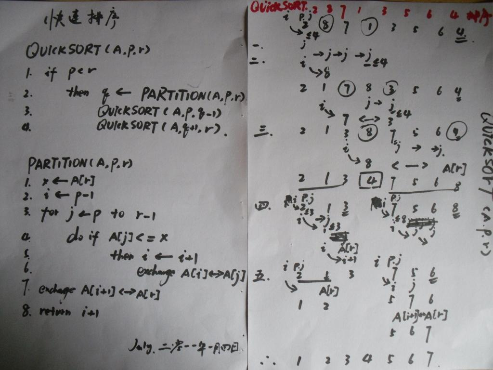

而我们面对的问题是，重新排列使得所有球排列成三个不同颜色的球，是否可以设定三个指针，借鉴partition过程呢？

**解法一、partition分治**

通过前面的分析得知，这个问题，类似快排中partition过程。只是需要用到三个指针，一前begin，一中current，一后end，俩俩交换。

1. current遍历，整个数组序列，current指1不动，
2. current指0，与begin交换，而后current++，begin++，
3. current指2，与end交换，而后，current不动，end--。

为什么，第三步，current指2，与end交换之后，current不动了列，对的，正如algorithm__所说：current之所以与begin交换后，current++、begin++，是因为此无后顾之忧。而current与end交换后，current不动，end--，是因有后顾之忧。

读者可以试想，你最终的目的无非就是为了让0、1、2有序排列，试想，如果第三步，current与end交换之前，万一end之前指的是0，而current交换之后，current此刻指的是0了，此时，current能动么？不能动啊，指的是0，还得与begin交换列。

ok，说这么多，你可能不甚明了，直接引用下gnuhpc的图，就一目了然了：


参考代码如下：
```cpp
//引用自gnuhpc  
while( current<=end )        
{             
  if( array[current] ==0 )             
   {                 
      swap(array[current],array[begin]);                  
      current++;                  
      begin++;            
   }             
   else if( array[current] == 1 )            
   {                 
      current++;            
   }   
            
   else //When array[current] =2   
   {               
      swap(array[current],array[end]);                
      end--;            
   }      
}  
```

本章完。

## 第四十二章：矩阵相乘之Strassen算法

**题目描述**

请编程实现矩阵乘法，并考虑当矩阵规模较大时的优化方法。

**思路分析**

根据wikipedia上的介绍：两个矩阵的乘法仅当第一个矩阵B的列数和另一个矩阵A的行数相等时才能定义。如A是m×n矩阵和B是n×p矩阵，它们的乘积AB是一个m×p矩阵，它的一个元素其中 1 ≤ i ≤ m, 1 ≤ j ≤ p。

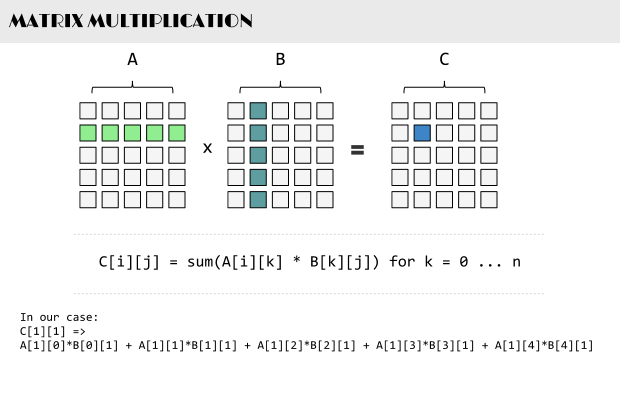

值得一提的是，矩阵乘法满足结合律和分配率，但并不满足交换律，如下图所示的这个例子，两个矩阵交换相乘后，结果变了：

  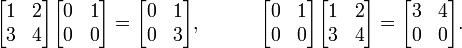

下面咱们来具体解决这个矩阵相乘的问题。

**解法一、暴力解法**

其实，通过前面的分析，我们已经很明显的看出，两个具有相同维数的矩阵相乘，其复杂度为O(n^3)，参考代码如下：
```cpp
//矩阵乘法，3个for循环搞定    
void Mul(int** matrixA, int** matrixB, int** matrixC)    
{    
    for(int i = 0; i < 2; ++i)     
    {    
        for(int j = 0; j < 2; ++j)     
        {    
            matrixC[i][j] = 0;    
            for(int k = 0; k < 2; ++k)     
            {    
                matrixC[i][j] += matrixA[i][k] * matrixB[k][j];    
            }    
        }    
    }    
}  
```

**解法二、Strassen算法**

在解法一中，我们用了3个for循环搞定矩阵乘法，但当两个矩阵的维度变得很大时，O（n^3）的时间复杂度将会变得很大，于是，我们需要找到一种更优的解法。

一般说来，当数据量一大时，我们往往会把大的数据分割成小的数据，各个分别处理。遵此思路，如果丢给我们一个很大的两个矩阵呢，是否可以考虑分治的方法循序渐进处理各个小矩阵的相乘，因为我们知道一个矩阵是可以分成更多小的矩阵的。

如下图，当给定一个两个二维矩阵A B时：

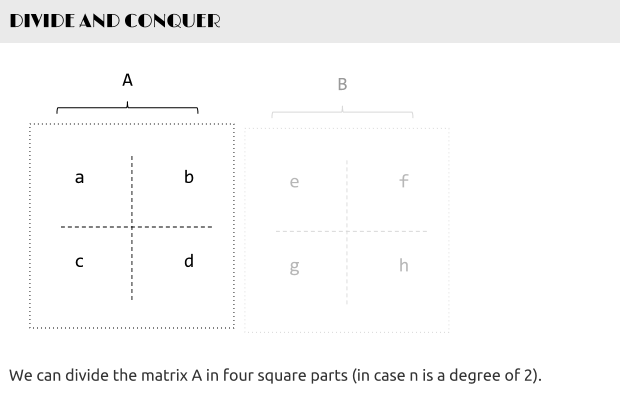

这两个矩阵A B相乘时，我们发现在相乘的过程中，有8次乘法运算，4次加法运算：

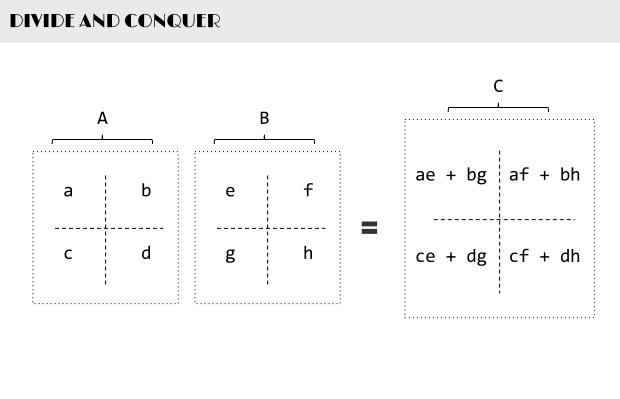

矩阵乘法的复杂度主要就是体现在相乘上，而多一两次的加法并不会让复杂度上升太多。故此，我们思考，是否可以让矩阵乘法的运算过程中乘法的运算次数减少，从而达到降低矩阵乘法的复杂度呢？答案是肯定的。

1969年，德国的一位数学家Strassen证明O（N^3）的解法并不是矩阵乘法的最优算法，他做了一系列工作使得最终的时间复杂度降低到了O(n^2.80)。

他是怎么做到的呢？还是用上文A B两个矩阵相乘的例子，他定义了7个变量：

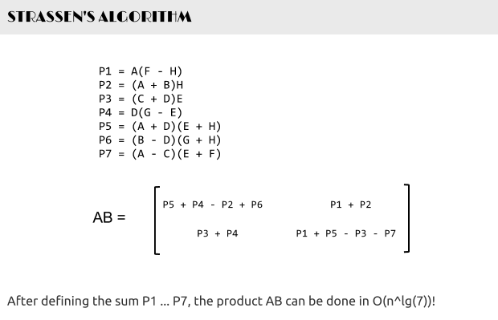

如此，Strassen算法的流程如下：

* 两个矩阵A B相乘时，将A, B, C分成相等大小的方块矩阵：

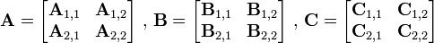

* 可以看出C是这么得来的：

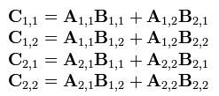

* 现在定义7个新矩阵（读者可以思考下，这7个新矩阵是如何想到的）：

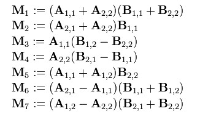

* 而最后的结果矩阵C 可以通过组合上述7个新矩阵得到：

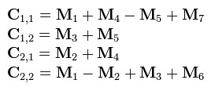

表面上看，Strassen算法仅仅比通用矩阵相乘算法好一点，因为通用矩阵相乘算法时间复杂度是，而Strassen算法复杂度只是
=O(n^{2.807})})。但随着n的变大，比如当n >> 100时，Strassen算法是比通用矩阵相乘算法变得更有效率。

如下图所示：

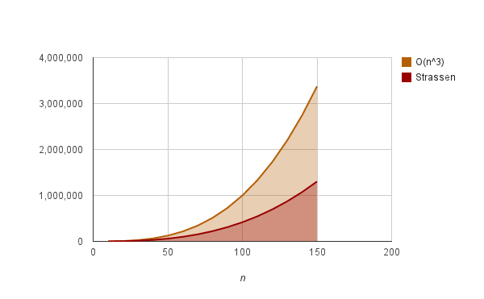

**解法三、持续优化**

根据wikipedia上的介绍，后来，Coppersmith–Winograd 算法把 N* N大小的矩阵乘法的时间复杂度降低到了：})，而2010年，Andrew Stothers再度把复杂度降低到了})，一年后的2011年，Virginia Williams把复杂度最终定格为：}).

### 参考文献

1. 快速排序算法：http://blog.csdn.net/v_july_v/article/details/6116297；
2. 快速排序算法的深入分析：http://blog.csdn.net/v_july_v/article/details/6211155；
3. gnuhpc：http://blog.csdn.net/gnuhpc/article/details/6207285；
4. wikipedia上关于Strassen算法的介绍：http://zh.wikipedia.org/wiki/%E6%96%BD%E7%89%B9%E6%8B%89%E6%A3%AE%E6%BC%94%E7%AE%97%E6%B3%95；
5. 第42章部分图来自此文“ Computer Algorithms: Strassen's Matrix Multiplication” ：http://www.stoimen.com/blog/2012/11/26/computer-algorithms-strassens-matrix-multiplication/；
6. 上文的翻译版，来自图灵社区：http://www.ituring.com.cn/article/17978；
7. Coppersmith–Winograd 算法： http://en.wikipedia.org/wiki/Coppersmith%E2%80%93Winograd_algorithm；

###后记

 编程艺术原计划写到第五十章，如今只剩下最后八章，感谢各位一直以来的关注。预祝本博客所有的读者新春快乐，在马年一切都能心想事成，thanks。

 July、二零一四年一月二十八日。
