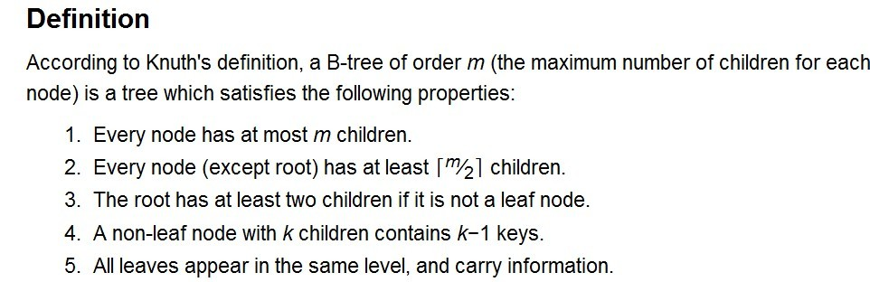
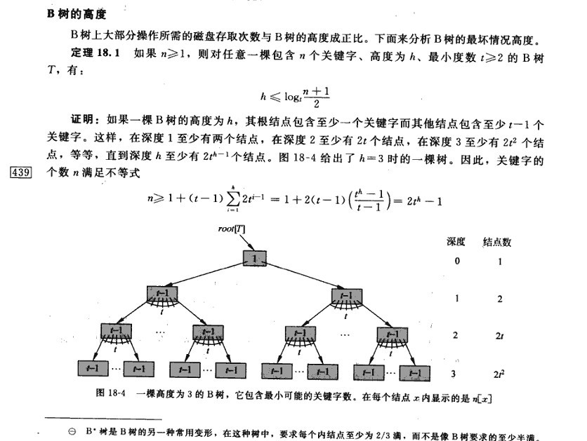
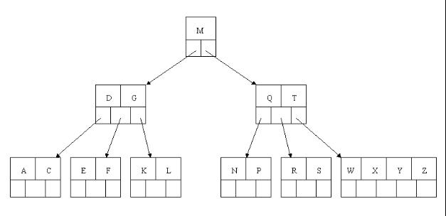
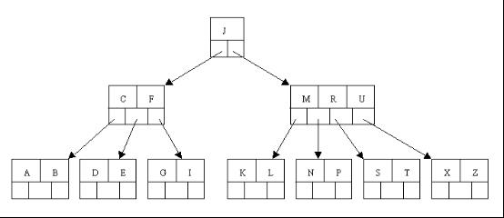

# 从B树、B+树、B\*树谈到R 树

作者：July、weedge、Frankie、编程艺术室出品。  
说明：本文从B树开始谈起，然后论述B+树、B\*树，最后谈到R 树。其中B树、B+树及B\*树部分由weedge完成，R 树部分由Frankie完成，全文最终由July统稿修订完成。  
出处：[http://blog.csdn.net/v_JULY_v](http://blog.csdn.net/v_JULY_v) 。

## 第一节、B树、B+树、B\*树

#### 1.前言：

动态查找树主要有：二叉查找树（Binary Search Tree），平衡二叉查找树（Balanced Binary Search Tree），[红黑树](http://blog.csdn.net/v_JULY_v/article/category/774945)(Red-Black Tree )，B-tree/B+-tree/ B\*-tree (B~Tree)。前三者是典型的二叉查找树结构，其查找的时间复杂度`O(log2N)`与树的深度相关，那么降低树的深度自然会提高查找效率。

但是咱们有面对这样一个实际问题：就是大规模数据存储中，实现索引查询这样一个实际背景下，树节点存储的元素数量是有限的（如果元素数量非常多的话，查找就退化成节点内部的线性查找了），这样导致二叉查找树结构由于**树的深度过大而造成磁盘I/O读写过于频繁，进而导致查询效率低下**（为什么会出现这种情况，待会在外部存储器-磁盘中有所解释），那么如何减少树的深度（当然是不能减少查询的数据量），一个基本的想法就是：采用**多叉树**结构（由于树节点元素数量是有限的，自然该节点的子树数量也就是有限的）。

也就是说，因为磁盘的操作费时费资源，如果过于频繁的多次查找势必效率低下。那么如何提高效率，即如何避免磁盘过于频繁的多次查找呢？根据磁盘查找存取的次数往往由树的高度所决定，所以，只要我们通过某种较好的树结构减少树的结构尽量减少树的高度，那么是不是便能有效减少磁盘查找存取的次数呢？那这种有效的树结构是一种怎样的树呢？

这样我们就提出了一个新的查找树结构——多路查找树。根据平衡二叉树的启发，自然就想到平衡多路查找树结构，也就是这篇文章所要阐述的第一个主题B~tree，即B树结构(后面，我们将看到，B树的各种操作能使B树保持较低的高度，从而达到有效避免磁盘过于频繁的查找存取操作，从而有效提高查找效率)。

**B-tree（B-tree树即B树\***，B即Balanced，平衡的意思**）**这棵神奇的树是在[Rudolf Bayer, Edward M. McCreight](http://academic.research.microsoft.com/Author/1008233/rudolf-bayer)(1970)写的一篇论文《Organization and Maintenance of Large Ordered Indices》中首次提出的（wikipedia中：[http://en.wikipedia.org/wiki/B-tree](http://en.wikipedia.org/wiki/B-tree)，阐述了B-tree名字来源以及相关的开源地址）。

在开始介绍B~tree之前，先了解下相关的硬件知识，才能很好的了解为什么需要B~tree这种外存数据结构。 

#### 2.外存储器—磁盘

计算机存储设备一般分为两种：内存储器(main memory)和外存储器(external memory)。 内存存取速度快，但容量小，价格昂贵，而且不能长期保存数据(在不通电情况下数据会消失)。

外存储器—磁盘是一种直接存取的存储设备(DASD)。它是以存取时间变化不大为特征的。可以直接存取任何字符组，且容量大、速度较其它外存设备更快。

##### 2.1 磁盘的构造

磁盘是一个扁平的圆盘(与电唱机的唱片类似)。盘面上有许多称为磁道的圆圈，数据就记录在这些磁道上。磁盘可以是单片的，也可以是由若干盘片组成的盘组，每一盘片上有两个面。如下图11.3中所示的6片盘组为例，除去最顶端和最底端的外侧面不存储数据之外，一共有10个面可以用来保存信息。


当磁盘驱动器执行读/写功能时。盘片装在一个主轴上，并绕主轴高速旋转，当磁道在读/写头(又叫磁头) 下通过时，就可以进行数据的读 / 写了。

一般磁盘分为固定头盘(磁头固定)和活动头盘。固定头盘的每一个磁道上都有独立的磁头，它是固定不动的，专门负责这一磁道上数据的读/写。

活动头盘 (如上图)的磁头是可移动的。每一个盘面上只有一个磁头(磁头是双向的，因此正反盘面都能读写)。它可以从该面的一个磁道移动到另一个磁道。所有磁头都装在同一个动臂上，因此不同盘面上的所有磁头都是同时移动的(行动整齐划一)。当盘片绕主轴旋转的时候，磁头与旋转的盘片形成一个圆柱体。各个盘面上半径相同的磁道组成了一个圆柱面，我们称为柱面 。因此，柱面的个数也就是盘面上的磁道数。 

##### 2.2 磁盘的读/写原理和效率

磁盘上数据必须用一个三维地址唯一标示：柱面号、盘面号、块号(磁道上的盘块)。

读/写磁盘上某一指定数据需要下面3个步骤：

1. 首先移动臂根据柱面号使磁头移动到所需要的柱面上，这一过程被称为定位或查找 。
2. 如上图11.3中所示的6盘组示意图中，所有磁头都定位到了10个盘面的10条磁道上(磁头都是双向的)。这时根据盘面号来确定指定盘面上的磁道。
3. 盘面确定以后，盘片开始旋转，将指定块号的磁道段移动至磁头下。

经过上面三个步骤，指定数据的存储位置就被找到。这时就可以开始读/写操作了。

访问某一具体信息，由3部分时间组成：

* 查找时间(seek time) Ts: 完成上述步骤(1)所需要的时间。这部分时间代价最高，最大可达到0.1s左右。
* 等待时间(latency time) Tl: 完成上述步骤(3)所需要的时间。由于盘片绕主轴旋转速度很快，一般为7200转/分(电脑硬盘的性能指标之一, 家用的普通硬盘的转速一般有5400rpm(笔记本)、7200rpm几种)。因此一般旋转一圈大约0.0083s。
* 传输时间(transmission time) Tt: 数据通过系统总线传送到内存的时间，一般传输一个字节(byte)大概0.02us=2\*10^(-8)s

**磁盘读取数据是以盘块**(block)**为基本单位的。**位于同一盘块中的所有数据都能被一次性全部读取出来。而磁盘IO代价主要花费在查找时间Ts上。因此我们应该尽量将相关信息存放在同一盘块，同一磁道中。或者至少放在同一柱面或相邻柱面上，以求在**读/写信息时尽量减少磁头来回移动的次数，避免过多的查找时间Ts。**

所以，在大规模数据存储方面，大量数据存储在外存磁盘中，而在外存磁盘中读取/写入块(block)中某数据时，首先需要定位到磁盘中的某块，如何有效地查找磁盘中的数据，需要一种合理高效的外存数据结构，就是下面所要重点阐述的B-tree结构，以及相关的变种结构：B+-tree结构和B\*-tree结构。

#### 3.B- 树 

##### 3.1 什么是B-树

具体讲解之前，有一点，**再次强调下：B-树，即为B树**。因为B树的原英文名称为B-tree，而国内很多人喜欢把B-tree译作B-树，其实，这是个非常不好的直译，很容易让人产生误解。如人们可能会以为B-树是一种树，而B树又是一种一种树。而事实上是，**B-tree就是指的B树**。特此说明。

我们知道，B 树是为了磁盘或其它存储设备而设计的一种多叉（下面你会看到，相对于二叉，B树每个内结点有多个分支，即多叉）平衡查找树。与本blog之前介绍的红黑树很相似，但在降低磁盘I/0操作方面要更好一些。许多数据库系统都一般使用B树或者B树的各种变形结构，如下文即将要介绍的B+树，B\*树来存储信息。

B树与红黑树最大的不同在于，B树的结点可以有许多子女，从几个到几千个。那为什么又说B树与红黑树很相似呢?因为与红黑树一样，一棵含n个结点的B树的高度也为`O(lgn)`，但可能比一棵红黑树的高度小许多，应为它的分支因子比较大。所以，B树可以在`O（logn）`时间内，实现各种如插入（insert），删除（delete）等动态集合操作。

如下图所示，即是一棵B树，一棵关键字为英语中辅音字母的B树，现在要从树种查找字母R（包含n[x]个关键字的内结点x，x有n[x]+1]个子女（也就是说，一个内结点x若含有n[x]个关键字，那么x将含有n[x]+1个子女）。所有的叶结点都处于相同的深度，带阴影的结点为查找字母R时要检查的结点）：


**相信，从上图你能轻易的看到，一个内结点x若含有n[x]个关键字，那么x将含有n[x]+1个子女。如含有2个关键字D H的内结点有3个子女，而含有3个关键字Q T X的内结点有4个子女。**

B树的定义，从下文中，你将看到，或者是用阶，或者是用度，如下段文字所述：

> Unfortunately, the literature on B-trees is not uniform in its use of terms relating to B-Trees. (Folk & Zoellick 1992, p. 362) Bayer & McCreight (1972), Comer (1979), and others define the order of B-tree as the minimum number of keys in a non-root node. Folk & Zoellick (1992) points out that terminology is ambiguous because the maximum number of keys is not clear. An order 3 B-tree might hold a maximum of 6 keys or a maximum of 7 keys. (Knuth 1998,TAOCP p. 483) avoids the problem by defining the order to be maximum number of children (which is one more than the maximum number of keys).

  
from [http://en.wikipedia.org/wiki/Btree#Technical_description](http://en.wikipedia.org/wiki/Btree#Technical_description).

用阶定义的**B树**

B 树又叫平衡多路查找树。**一棵m阶的B 树** (注：切勿简单的认为一棵m阶的B树是m叉树，虽然存在[四叉树](http://zh.wikipedia.org/wiki/%E5%9B%9B%E5%8F%89%E6%A0%91)，[八叉树](http://zh.wikipedia.org/wiki/%E5%85%AB%E5%8F%89%E6%A0%91)，[KD树](http://blog.csdn.net/v_july_v/article/details/8203674)，及vp/R树/R\*树/R+树/X树/M树/线段树/希尔伯特R树/优先R树等空间划分树，但与B树完全不等同)**的特性如下：**

1. 树中每个结点最多含有m个孩子（m>=2）；
2. 除根结点和叶子结点外，其它每个结点至少有[ceil(m / 2)]个孩子（其中ceil(x)是一个取上限的函数）；
3. 若根结点不是叶子结点，则至少有2个孩子（特殊情况：没有孩子的根结点，即根结点为叶子结点，整棵树只有一个根节点）；
4. 所有叶子结点都出现在同一层，叶子结点不包含任何关键字信息(可以看做是外部接点或查询失败的接点，实际上这些结点不存在，指向这些结点的指针都为null)；（读者反馈@冷岳：这里有错，叶子节点只是没有孩子和指向孩子的指针，这些节点也存在，也有元素。@研究者July：其实，关键是把什么当做叶子结点，因为如红黑树中，每一个NULL指针即当做叶子结点，只是没画出来而已）。
5. 每个非终端结点中包含有n个关键字信息： (n，P0，K1，P1，K2，P2，......，Kn，Pn)。其中：  
a) Ki (i=1...n)为关键字，且关键字按顺序升序排序K(i-1)< Ki。  
b) Pi为指向子树根的接点，且指针P(i-1)指向子树种所有结点的关键字均小于Ki，但都大于K(i-1)。   
c) 关键字的个数n必须满足： [ceil(m / 2)-1]<= n <= m-1。如下图所示：

  

用度定义的**B**树

针对上面的5点，再阐述下：B树中每一个结点能包含的关键字（如之前上面的*D H*和*Q T X*）数有一个上界和下界。这个下界可以用一个称作B树的最小度数（算法导论中文版上译作度数，最小度数即内节点中节点最小孩子数目）m（m>=2）表示。

* 每个非根的内结点至多有m个子女，每个非根的结点必须至少含有m-1个关键字，如果树是非空的，则根结点至少包含一个关键字；
* 每个结点可包含至多2m-1个关键字。所以一个内结点至多可有2m个子女。如果一个结点恰好有2m-1个关键字，我们就说这个结点是满的（而稍后介绍的B*树作为B树的一种常用变形，B*树中要求每个内结点至少为2/3满，而不是像这里的B树所要求的至少半满）；
* **当关键字数m=2（t=2的意思是，mmin=2，m可以>=2）时的B树是最简单的**（有很多人会因此误认为B树就是二叉查找树，但二叉查找树就是二叉查找树，B树就是B树，B树是一棵含有m（m>=2）个关键字的平衡多路查找树），此时，每个内结点可能因此而含有2个、3个或4个子女，亦即一棵2-3-4树，然而在实际中，通常采用大得多的t值。

B树中的每个结点根据实际情况可以包含大量的关键字信息和分支(当然是不能超过磁盘块的大小，根据磁盘驱动(disk drives)的不同，一般块的大小在1k~4k左右)；这样树的深度降低了，这就意味着查找一个元素只要很少结点从外存磁盘中读入内存，很快访问到要查找的数据。如果你看完上面关于B树定义的介绍，思维感觉不够清晰，请继续参阅下文第6小节、B树的插入、删除操作 部分。

##### 3.2 B树的类型和节点定义

B树的类型和节点定义如下图所示：

  

  

##### 3.3 文件查找的具体过程(涉及磁盘IO操作)

为了简单，这里用少量数据构造一棵3叉树的形式，实际应用中的B树结点中关键字很多的。上面的图中比如根结点，其中17表示一个磁盘文件的文件名；小红方块表示这个17文件内容在硬盘中的存储位置；p1表示指向17左子树的指针。

其结构可以简单定义为：

```c
typedef struct {
    /*文件数*/
    int  file_num;
    /*文件名(key)*/
    char * file_name[max_file_num];
    /*指向子节点的指针*/
     BTNode * BTptr[max_file_num+1];
     /*文件在硬盘中的存储位置*/
     FILE_HARD_ADDR offset[max_file_num];
}BTNode;
```

假如每个盘块可以正好存放一个B树的结点（正好存放2个文件名）。那么一个BTNODE结点就代表一个盘块，而子树指针就是存放另外一个盘块的地址。

下面，咱们来模拟下查找文件29的过程：

1. 根据根结点指针找到文件目录的根磁盘块1，将其中的信息导入内存。【磁盘IO操作 1次】    
2. 此时内存中有两个文件名17、35和三个存储其他磁盘页面地址的数据。根据算法我们发现：17<29<35，因此我们找到指针p2。
3. 根据p2指针，我们定位到磁盘块3，并将其中的信息导入内存。【磁盘IO操作 2次】    
4. 此时内存中有两个文件名26，30和三个存储其他磁盘页面地址的数据。根据算法我们发现：26<29<30，因此我们找到指针p2。
5. 根据p2指针，我们定位到磁盘块8，并将其中的信息导入内存。【磁盘IO操作 3次】    
6. 此时内存中有两个文件名28，29。根据算法我们查找到文件名29，并定位了该文件内存的磁盘地址。

分析上面的过程，发现需要**3次磁盘IO操作和3次内存查找**操作。关于内存中的文件名查找，由于是一个有序表结构，可以利用折半查找提高效率。至于IO操作是影响整个B树查找效率的决定因素。

当然，如果我们使用平衡二叉树的磁盘存储结构来进行查找，磁盘4次，最多5次，而且文件越多，B树比平衡二叉树所用的磁盘IO操作次数将越少，效率也越高。

##### 3.4 B树的高度

根据上面的例子我们可以看出，对于辅存做IO读的次数取决于B树的高度。而B树的高度由什么决定的呢？

若B树某一非叶子节点包含N个关键字，则此非叶子节点含有N+1个孩子结点，而所有的叶子结点都在第I层，我们可以得出：

1. 因为根至少有两个孩子，因此第2层至少有两个结点。
2. 除根和叶子外，其它结点至少有┌m/2┐个孩子，
3. 因此在第3层至少有2*┌m/2┐个结点，
4. 在第4层至少有2*(┌m/2┐^2)个结点，
5. 在第 I 层至少有2*(┌m/2┐^(l-2) )个结点，于是有： N+1 ≥ 2*┌m/2┐I-2；
6. 考虑第L层的结点个数为N+1，那么2*(┌m/2┐^(l-2)）≤N+1，也就是L层的最少结点数刚好达到N+1个，即： I≤ log┌m/2┐((N+1)/2 )+2；

所以

* 当B树包含N个关键字时，B树的最大高度为l-1（因为计算B树高度时，叶结点所在层不计算在内），即：l - 1 = **log┌m/2┐((N+1)/2 )+1**。

这个B树的高度公式从侧面显示了B树的查找效率是相当高的。

曾在一次面试中被问到，**一棵含有N个总关键字数的m阶的B树的最大高度是多少**?答曰：

log_ceil（m/2）(N+1)/2 + 1 （上面中关于m阶B树的第1点特性已经提到：树中每个结点含有最多含有m个孩子，即m满足：ceil(m/2)<=**m**<=m。而树中每个结点含孩子数越少，树的高度则越大，故如此）。在2012微软4月份的笔试中也问到了此问题。

此外，还有读者反馈，说上面的B树的高度计算公式与算法导论一书上的不同，而后我特意翻看了算法导论第18章关于B树的高度一节的内容，如下图所示：

  

在上图中书上所举的例子中，也许，根据我们大多数人的理解，它的高度应该是4，而书上却说的是“一棵高度为3的B树”。我想，此时，你也就明白了，算法导论一书上的高度的定义是从“0”开始计数的，而我们中国人的习惯是树的高度是从“1”开始计数的。特此说明。July、二零一二年九月二十七日。

#### 4.B+-tree

*B+-tree*：是应文件系统所需而产生的一种B-tree的变形树。

一棵m阶的B+树和m阶的B树的异同点在于：

1. 有n棵子树的结点中含有n-1 个关键字； (与B 树n棵子树有n-1个关键字 保持一致，参照：[http://en.wikipedia.org/wiki/B%2B_tree#Overview](http://en.wikipedia.org/wiki/B%2B_tree#Overview)，而下面**B+树的图可能有问题**，请读者注意)
2. 所有的叶子结点中包含了全部关键字的信息，及指向含有这些关键字记录的指针，且叶子结点本身依关键字的大小自小而大的顺序链接。 (而B 树的叶子节点并没有包括全部需要查找的信息)
3. **所有的非终端结点可以看成是索引部分**，结点中仅含有其子树根结点中最大（或最小）关键字。 (而B 树的非终节点也包含需要查找的有效信息)

  

a) 为什么说B+-tree比B 树更适合实际应用中操作系统的文件索引和数据库索引？ 

1. B+-tree的磁盘读写代价更低
B+-tree的内部结点并没有指向关键字具体信息的指针。因此其内部结点相对B 树更小。如果把所有同一内部结点的关键字存放在同一盘块中，那么盘块所能容纳的关键字数量也越多。一次性读入内存中的需要查找的关键字也就越多。相对来说IO读写次数也就降低了。

	举个例子，假设磁盘中的一个盘块容纳16bytes，而一个关键字2bytes，一个关键字具体信息指针2bytes。一棵9阶B-tree(一个结点最多8个关键字)的内部结点需要2个盘快。而B+ 树内部结点只需要1个盘快。当需要把内部结点读入内存中的时候，B 树就比B+ 树多一次盘块查找时间(在磁盘中就是盘片旋转的时间)。

2. B+-tree的查询效率更加稳定  
由于非终结点并不是最终指向文件内容的结点，而只是叶子结点中关键字的索引。所以任何关键字的查找必须走一条从根结点到叶子结点的路。所有关键字查询的路径长度相同，导致每一个数据的查询效率相当。

	读者点评  
	本文评论下第149楼，fanyy1991针对上文所说的两点，道：个人觉得这两个原因都不是主要原因。数据库索引采用B+树的主要原因是 B树在提高了磁盘IO性能的同时并没有解决元素遍历的效率低下的问题。正是为了解决这个问题，B+树应运而生。B+树只要遍历叶子节点就可以实现整棵树的遍历。而且在数据库中基于范围的查询是非常频繁的，而B树不支持这样的操作（或者说效率太低）。

b)  B+-tree的应用: VSAM(虚拟存储存取法)文件(来源论文 *the ubiquitous Btree* 作者：D COMER - 1979 )


#### 5.B\*-tree

B\*-tree是B+-tree的变体，在B+树的基础上(所有的叶子结点中包含了全部关键字的信息，及指向含有这些关键字记录的指针)，B\*树中非根和非叶子结点再增加指向兄弟的指针；B\*树定义了非叶子结点关键字个数至少为(2/3)\*M，即块的最低使用率为2/3（代替B+树的1/2）。给出了一个简单实例，如下图所示：


B+树的分裂：当一个结点满时，分配一个新的结点，并将原结点中1/2的数据复制到新结点，最后在父结点中增加新结点的指针；B+树的分裂只影响原结点和父结点，而不会影响兄弟结点，所以它不需要指向兄弟的指针。

B\*树的分裂：当一个结点满时，如果它的下一个兄弟结点未满，那么将一部分数据移到兄弟结点中，再在原结点插入关键字，最后修改父结点中兄弟结点的关键字（因为兄弟结点的关键字范围改变了）；如果兄弟也满了，则在原结点与兄弟结点之间增加新结点，并各复制1/3的数据到新结点，最后在父结点增加新结点的指针。

所以，B\*树分配新结点的概率比B+树要低，空间使用率更高；

#### 6、B树的插入、删除操作

上面第3小节简单介绍了利用B树这种结构如何访问外存磁盘中的数据的情况，下面咱们通过另外一个实例来对这棵B树的插入（insert）,删除（delete）基本操作进行详细的介绍。

但在此之前，咱们还得简单回顾下一棵m阶的B 树的特性，如下：

1. 树中每个结点含有最多含有m个孩子，即m满足：ceil(m/2)<=**m**<=m。
2. 除根结点和叶子结点外，其它每个结点至少有[ceil(m / 2)]个孩子（其中ceil(x)是一个取上限的函数）；
3. 若根结点不是叶子结点，则至少有2个孩子（特殊情况：没有孩子的根结点，即根结点为叶子结点，整棵树只有一个根节点）；
4. 所有叶子结点都出现在同一层，叶子结点不包含任何关键字信息(可以看做是外部接点或查询失败的接点，实际上这些结点不存在，指向这些结点的指针都为null)；
5. 每个非终端结点中包含有n个关键字信息： (n，P0，K1，P1，K2，P2，......，Kn，Pn)。其中：  
a) Ki (i=1...n)为关键字，且关键字按顺序升序排序K(i-1)< Ki。   
b) Pi为指向子树根的接点，且指针P(i-1)指向子树种所有结点的关键字均小于Ki，但都大于K(i-1)。  
c) 除根结点之外的结点的关键字的个数n必须满足： [ceil(m / 2)-1]<= n <= m-1（叶子结点也必须满足此条关于关键字数的性质，根结点除外）。

ok，下面咱们以一棵**5阶**（即树中任一结点至多含有4个关键字，5棵子树）B树实例进行讲解(如下图所示)：

备注：**关键字数（2-4个）针对--非根结点（包括叶子结点在内），孩子数（3-5个）--针对根结点和叶子结点之外的内结点。当然，根结点是必须至少有2个孩子的，不然就成直线型搜索树了。**下图中，读者可以看到关键字数2-4个，内结点孩子数3-5个：


关键字为大写字母，顺序为字母升序。

结点定义如下：

```c
typedef struct{
   int Count;         // 当前节点中关键元素数目
   ItemType Key[4];   // 存储关键字元素的数组
   long Branch[5];    // 伪指针数组，(记录数目)方便判断合并和分裂的情况
} NodeType;
```


##### 6.1 插入（insert）操作

插入一个元素时，首先在B树中是否存在，如果不存在，即在叶子结点处结束，然后在叶子结点中插入该新的元素，注意：如果叶子结点空间足够，这里需要向右移动该叶子结点中大于新插入关键字的元素，如果空间满了以致没有足够的空间去添加新的元素，则将该**结点**进行“分裂”，将一半数量的关键字元素分裂到新的其相邻右结点中，中间关键字元素上移到父结点中（当然，如果父结点空间满了，也同样需要“分裂”操作），而且当结点中关键元素向右移动了，相关的指针也需要向右移。如果在根结点插入新元素，空间满了，则进行分裂操作，这样原来的根结点中的中间关键字元素向上移动到新的根结点中，因此导致树的高度增加一层。如下图所示：


1. OK，下面咱们通过一个实例来逐步讲解下。插入以下字符字母到一棵空的B 树中（非根结点**关键字数**小了（小于2个）就合并，大了（超过4个）就分裂）：C N G A H E K Q M F W L T Z D P R X Y S，首先，结点空间足够，4个字母插入相同的结点中，如下图：  

2. 当咱们试着插入H时，结点发现空间不够，以致将其分裂成2个结点，移动中间元素G上移到新的根结点中，在实现过程中，咱们把A和C留在当前结点中，而H和N放置新的其右邻居结点中。如下图：  

3. 当咱们插入E,K,Q时，不需要任何分裂操作  

4. 插入M需要一次分裂，注意M恰好是中间关键字元素，以致向上移到父节点中  

5. 插入F,W,L,T不需要任何分裂操作  

6. 插入Z时，最右的叶子结点空间满了，需要进行分裂操作，中间元素T上移到父节点中，注意通过上移中间元素，树最终还是保持平衡，分裂结果的结点存在2个关键字元素。  

7. 插入D时，导致最左边的叶子结点被分裂，D恰好也是中间元素，上移到父节点中，然后字母P,R,X,Y陆续插入不需要任何分裂操作（别忘了，树中至多5个孩子）。  

8. 最后，当插入S时，含有N,P,Q,R的结点需要分裂，把中间元素Q上移到父节点中，但是情况来了，父节点中空间已经满了，所以也要进行分裂，将父节点中的中间元素M上移到新形成的根结点中，注意以前在父节点中的第三个指针在修改后包括D和G节点中。这样具体插入操作的完成，下面介绍删除操作，删除操作相对于插入操作要考虑的情况多点。  


##### 6.2、删除(delete)操作

首先查找B树中需删除的元素,如果该元素在B树中存在，则将该元素在其结点中进行删除，如果删除该元素后，首先判断该元素是否有左右孩子结点，如果有，则上移孩子结点中的某相近元素(“左孩子最右边的节点”或“右孩子最左边的节点”)到父节点中，然后是移动之后的情况；如果没有，直接删除后，移动之后的情况。

删除元素，移动相应元素之后，如果某结点中元素数目（即关键字数）小于**ceil(m/2)-1**，则需要看其某相邻兄弟结点是否丰满（结点中元素个数大于ceil(m/2)-1）（**还记得第一节中关于B树的第5个特性中的c点么?： c)除根结点之外的结点（包括叶子结点）的关键字的个数n必须满足： （ceil(m / 2)-1）<= n <= m-1。m表示最多含有m个孩子，n表示关键字数。在本小节中举的一颗B树的示例中，关键字数n满足：2<=n<=4**），如果丰满，则向父节点借一个元素来满足条件；如果其相邻兄弟都刚脱贫，即借了之后其结点数目小于ceil(m/2)-1，则该结点与其相邻的某一兄弟结点进行“合并”成一个结点，以此来满足条件。那咱们通过下面实例来详细了解吧。

以上述插入操作构造的一棵5阶B树（树中最多含有m（m=5）个孩子，因此关键字数最小为ceil(m / 2)-1=2。还是这句话，**关键字数小了（小于2个）就合并，大了（超过4个）就分裂）**为例，依次删除H,T,R,E。


1. 首先删除元素H，当然首先查找H，H在一个叶子结点中，且该叶子结点元素数目3大于最小元素数目ceil(m/2)-1=2，则操作很简单，咱们只需要移动K至原来H的位置，移动L至K的位置（也就是结点中删除元素后面的元素向前移动）  

2. 下一步，删除T,因为T没有在叶子结点中，而是在中间结点中找到，咱们发现他的继承者W(字母升序的下个元素)，将W上移到T的位置，然后将原包含W的孩子结点中的W进行删除，这里恰好删除W后，该孩子结点中元素个数大于2，无需进行合并操作。  

3. 下一步删除R，R在叶子结点中,但是该结点中元素数目为2，删除导致只有1个元素，已经小于最小元素数目ceil(5/2)-1=2,而由前面我们已经知道：**如果其某个相邻兄弟结点中比较丰满（元素个数大于ceil(5/2)-1=2），则可以向父结点借一个元素，然后将最丰满的相邻兄弟结点中上移最后或最前一个元素到父节点中**（有没有看到红黑树中左旋操作的影子?），在这个实例中，右相邻兄弟结点中比较丰满（3个元素大于2），所以先向父节点借一个元素W下移到该叶子结点中，代替原来S的位置，S前移；然后X在相邻右兄弟结点中上移到父结点中，最后在相邻右兄弟结点中删除X，后面元素前移。  

4. 最后一步删除E， 删除后会导致很多问题，因为E所在的结点数目刚好达标，刚好满足最小元素个数（ceil(5/2)-1=2）,而相邻的兄弟结点也是同样的情况，删除一个元素都不能满足条件，所以需要**该节点与某相邻兄弟结点进行合并操作**；首先移动父结点中的元素（该元素在两个需要合并的两个结点元素之间）下移到其子结点中，然后将这两个结点进行合并成一个结点。所以在该实例中，咱们首先将父节点中的元素D下移到已经删除E而只有F的结点中，然后将含有D和F的结点和含有A,C的相邻兄弟结点进行合并成一个结点。  

5. 也许你认为这样删除操作已经结束了，其实不然，在看看上图，对于这种特殊情况，你立即会发现父节点只包含一个元素G，没达标（因为非根节点包括叶子结点的关键字数n必须满足于2=<n<=4，而此处的n=1），这是不能够接受的。如果这个问题结点的相邻兄弟比较丰满，则可以向父结点借一个元素。假设这时右兄弟结点（含有Q,X）有一个以上的元素（Q右边还有元素），然后咱们将M下移到元素很少的子结点中，将Q上移到M的位置，这时，Q的左子树将变成M的右子树，也就是含有N，P结点被依附在M的右指针上。所以在这个实例中，咱们没有办法去借一个元素，只能与兄弟结点进行合并成一个结点，而根结点中的唯一元素M下移到子结点，这样，树的高度减少一层。  
  
为了进一步详细讨论删除的情况，**再举另外一个实例**：  
这里是一棵不同的5序B树，那咱们试着删除C  
  
于是将删除元素C的右子结点中的D元素上移到C的位置，但是出现上移元素后，只有一个元素的结点的情况。  
又因为含有E的结点，其相邻兄弟结点才刚脱贫（最少元素个数为2），不可能向父节点借元素，所以只能进行合并操作，于是这里将含有A,B的左兄弟结点和含有E的结点进行合并成一个结点。   
  
这样又出现只含有一个元素F结点的情况，这时，其相邻的兄弟结点是丰满的（元素个数为3>最小元素个数2），这样就可以想父结点借元素了，把父结点中的J下移到该结点中，相应的如果结点中J后有元素则前移，然后相邻兄弟结点中的第一个元素（或者最后一个元素）上移到父节点中，后面的元素（或者前面的元素）前移（或者后移）；注意含有K，L的结点以前依附在M的左边，现在变为依附在J的右边。这样每个结点都满足B树结构性质。  
  
从以上操作可看出：除根结点之外的结点（包括叶子结点）的关键字的个数n满足：（ceil(m / 2)-1）<= n <= m-1，即2<=n<=4。这也佐证了咱们之前的观点。删除操作完。

#### 7.总结

通过以上介绍，大致将B树，B+树，B*树总结如下：

* B树：有序数组+平衡多叉树；
* B+树：有序数组链表+平衡多叉树；
* B\*树：一棵丰满的B+树。

在大规模数据存储的文件系统中，B~tree系列数据结构，起着很重要的作用，对于存储不同的数据，节点相关的信息也是有所不同，这里根据自己的理解，画的一个查找以职工号为关键字，职工号为38的记录的简单示意图。(这里假设每个物理块容纳3个索引，磁盘的I/O操作的基本单位是块（block),磁盘访问很费时，采用B+树有效的减少了访问磁盘的次数。）

对于像MySQL，DB2，Oracle等数据库中的索引结构得有较深入的了解才行，建议去找一些B 树相关的开源代码研究。

  

走进搜索引擎的作者梁斌老师针对B树、B+树给出了他的意见（为了真实性，特引用其原话，未作任何改动）： “B+树还有一个最大的好处，方便扫库，B树必须用中序遍历的方法按序扫库，而B+树直接从叶子结点挨个扫一遍就完了，B+树支持range-query非常方便，而B树不支持。这是数据库选用B+树的最主要原因。

比如要查 5-10之间的，B+树一把到5这个标记，再一把到10，然后串起来就行了，B树就非常麻烦。B树的好处，就是成功查询特别有利，因为树的高度总体要比B+树矮。不成功的情况下，B树也比B+树稍稍占一点点便宜。

B树比如你的例子中查，17的话，一把就得到结果了，有很多基于频率的搜索是选用B树，越频繁query的结点越往根上走，前提是需要对query做统计，而且要对key做一些变化。

另外B树也好B+树也好，根或者上面几层因为被反复query，所以这几块基本都在内存中，不会出现读磁盘IO，一般已启动的时候，就会主动换入内存。”非常感谢。

> "mysql 底层存储是用B+树实现的，知道为什么么。内存中B+树是没有优势的，但是一到磁盘，B+树的威力就出来了"。——Bucket Li

## 第二节、R树：处理空间存储问题

相信经过上面第一节的介绍，你已经对B树或者B+树有所了解。这种树可以非常好的处理一维空间存储的问题。B树是一棵平衡树，它是把一维直线分为若干段线段，当我们查找满足某个要求的点的时候，只要去查找它所属的线段即可。依我看来，这种思想其实就是先找一个大的空间，再逐步缩小所要查找的空间，最终在一个自己设定的最小不可分空间内找出满足要求的解。一个典型的B树查找如下：


要查找某一满足条件的点，先去找到满足条件的线段，然后遍历所在线段上的点，即可找到答案。

B树是一种相对来说比较复杂的数据结构，尤其是在它的删除与插入操作过程中，因为它涉及到了叶子结点的分解与合并。由于本文第一节已经详细介绍了B树和B+树，下面直接开始介绍我们的第二个主角：R树。

#### 简介

984年，加州大学伯克利分校的Guttman发表了一篇题为“R-trees: a dynamic index structure for spatial searching”的论文，向世人介绍了R树这种处理高维空间存储问题的数据结构。本文便是基于这篇论文写作完成的，因此如果大家对R树非常有兴趣，我想最好还是参考一下原著：）。为表示对这位牛人的尊重，给个引用先：Guttman, A.; “R-trees: a dynamic index structure for spatial searching,” ACM, 1984, 14

R树在数据库等领域做出的功绩是非常显著的。它很好的解决了在高维空间搜索等问题。举个R树在现实领域中能够解决的例子：查找20英里以内所有的餐厅。如果没有R树你会怎么解决？一般情况下我们会把餐厅的坐标(x,y)分为两个字段存放在数据库中，一个字段记录经度，另一个字段记录纬度。这样的话我们就需要遍历所有的餐厅获取其位置信息，然后计算是否满足要求。如果一个地区有100家餐厅的话，我们就要进行100次位置计算操作了，如果应用到谷歌地图这种超大数据库中，这种方法便必定不可行了。

R树就很好的解决了这种高维空间搜索问题。它把B树的思想很好的扩展到了多维空间，采用了B树分割空间的思想，并在添加、删除操作时采用合并、分解结点的方法，保证树的平衡性。因此，R树就是一棵用来存储高维数据的平衡树。

OK，接下来，本文将详细介绍R树的数据结构以及R树的操作。至于R树的扩展与R树的性能问题，可以查阅相关论文。

#### R树的数据结构

如上所述，R树是B树在高维空间的扩展，是一棵平衡树。每个R树的叶子结点包含了多个指向不同数据的指针，这些数据可以是存放在硬盘中的，也可以是存在内存中。根据R树的这种数据结构，当我们需要进行一个高维空间查询时，我们只需要遍历少数几个叶子结点所包含的指针，查看这些指针指向的数据是否满足要求即可。这种方式使我们不必遍历所有数据即可获得答案，效率显著提高。下图1是R树的一个简单实例：


我们在上面说过，R树运用了空间分割的理念，这种理念是如何实现的呢？R树采用了一种称为MBR(Minimal Bounding Rectangle)的方法，在此我把它译作“最小边界矩形”。从叶子结点开始用矩形（rectangle）将空间框起来，结点越往上，框住的空间就越大，以此对空间进行分割。有点不懂？没关系，继续往下看。在这里我还想提一下，R树中的R应该代表的是Rectangle（此处参考wikipedia上关于[R树](http://en.wikipedia.org/wiki/R-tree)的介绍），而不是大多数国内教材中所说的Region（很多书把R树称为区域树，这是有误的）。我们就拿二维空间来举例。下图是Guttman论文中的一幅图：


我来详细解释一下这张图。先来看图（b）

1. 首先我们假设所有数据都是二维空间下的点，图中仅仅标志了R8区域中的数据，也就是那个shape of data object。别把那一块不规则图形看成一个数据，我们把它看作是多个数据围成的一个区域。为了实现R树结构，我们用一个最小边界矩形恰好框住这个不规则区域，这样，我们就构造出了一个区域：R8。R8的特点很明显，就是正正好好框住所有在此区域中的数据。其他实线包围住的区域，如R9，R10，R12等都是同样的道理。这样一来，我们一共得到了12个最最基本的最小矩形。这些矩形都将被存储在子结点中。
2. 下一步操作就是进行高一层次的处理。我们发现R8，R9，R10三个矩形距离最为靠近，因此就可以用一个更大的矩形R3恰好框住这3个矩形。
3. 同样道理，R15，R16被R6恰好框住，R11，R12被R4恰好框住，等等。所有最基本的最小边界矩形被框入更大的矩形中之后，再次迭代，用更大的框去框住这些矩形。

我想大家都应该理解这个数据结构的特征了。**用地图的例子来解释，就是所有的数据都是餐厅所对应的地点，先把相邻的餐厅划分到同一块区域，划分好所有餐厅之后，再把邻近的区域划分到更大的区域，划分完毕后再次进行更高层次的划分，直到划分到只剩下两个最大的区域为止。要查找的时候就方便了。**

下面就可以把这些大大小小的矩形存入我们的R树中去了。根结点存放的是两个最大的矩形，这两个最大的矩形框住了所有的剩余的矩形，当然也就框住了所有的数据。下一层的结点存放了次大的矩形，这些矩形缩小了范围。每个叶子结点都是存放的最小的矩形，这些矩形中可能包含有n个数据。

在这里，读者先不要去纠结于如何划分数据到最小区域矩形，也不要纠结怎样用更大的矩形框住小矩形，这些都是下一节我们要讨论的。

讲完了基本的数据结构，我们来讲个实例，如何查询特定的数据。又以餐厅为例，假设我要查询广州市天河区天河城附近一公里的所有餐厅地址怎么办？

1. 打开地图（也就是整个R树），先选择国内还是国外（也就是根结点）。
2. 然后选择华南地区（对应第一层结点），选择广州市（对应第二层结点），
3. 再选择天河区（对应第三层结点），
4. 最后选择天河城所在的那个区域（对应叶子结点，存放有最小矩形），遍历所有在此区域内的结点，看是否满足我们的要求即可。

怎么样，其实R树的查找规则跟查地图很像吧？对应下图：


##### 一棵R树满足如下的性质：

1. 除非它是根结点之外，所有叶子结点包含有m至M个记录索引（条目）。作为根结点的叶子结点所具有的记录个数可以少于m。通常，m=M/2。
2. 对于所有在叶子中存储的记录（条目），I是最小的可以在空间中完全覆盖这些记录所代表的点的矩形（注意：此处所说的“矩形”是可以扩展到高维空间的）。
3. 每一个非叶子结点拥有m至M个孩子结点，除非它是根结点。
4.  对于在非叶子结点上的每一个条目，i是最小的可以在空间上完全覆盖这些条目所代表的店的矩形（同性质2）。
5.  所有叶子结点都位于同一层，因此R树为平衡树。

##### 叶子结点的结构

先来探究一下叶子结点的结构。叶子结点所保存的数据形式为：(I, tuple-identifier)。
      
其中，tuple-identifier表示的是一个存放于数据库中的tuple，也就是一条记录，它是n维的。I是一个n维空间的矩形，并可以恰好框住这个叶子结点中所有记录代表的n维空间中的点。I=(I0,I1,…,In-1)。其结构如下图所示：


下图描述的就是在二维空间中的叶子结点所要存储的信息。


在这张图中，I所代表的就是图中的矩形，其范围是a<=I0<=b，c<=I1<=d。有两个tuple-identifier，在图中即表示为那两个点。这种形式完全可以推广到高维空间。大家简单想想三维空间中的样子就可以了。这样，叶子结点的结构就介绍完了。

##### 非叶子结点

非叶子结点的结构其实与叶子结点非常类似。想象一下B树就知道了，B树的叶子结点存放的是真实存在的数据，而非叶子结点存放的是这些数据的“边界”，或者说也算是一种索引（有疑问的读者可以回顾一下上述第一节中讲解B树的部分）。

同样道理，R树的非叶子结点存放的数据结构为：(I, child-pointer)。

其中，child-pointer是指向孩子结点的指针，I是覆盖所有孩子结点对应矩形的矩形。这边有点拗口，但我想不是很难懂？给张图：


D,E,F,G为孩子结点所对应的矩形。A为能够覆盖这些矩形的更大的矩形。这个A就是这个非叶子结点所对应的矩形。这时候你应该悟到了吧？无论是叶子结点还是非叶子结点，它们都对应着一个矩形。树形结构上层的结点所对应的矩形能够完全覆盖它的孩子结点所对应的矩形。根结点也唯一对应一个矩形，而这个矩形是可以覆盖所有我们拥有的数据信息在空间中代表的点的。

我个人感觉这张图画的不那么精确，应该是矩形A要恰好覆盖D,E,F,G，而不应该再留出这么多没用的空间了。但为尊重原图的绘制者，特不作修改。

##### R树的操作

这一部分也许是编程者最关注的问题了。这么高效的数据结构该如何去实现呢？这便是这一节需要阐述的问题。

###### 搜索

R树的搜索操作很简单，跟B树上的搜索十分相似。它返回的结果是所有符合查找信息的记录条目。而输入是什么？就我个人的理解，输入不仅仅是一个范围了，它更可以看成是一个空间中的矩形。也就是说，我们输入的是一个搜索矩形。

先给出伪代码：

```
Function：Search
描述：假设T为一棵R树的根结点，查找所有搜索矩形S覆盖的记录条目。
S1:[查找子树] 如果T是非叶子结点，如果T所对应的矩形与S有重合，那么检查所有T中存储的条目，对于所有这些条目，使用Search操作作用在每一个条目所指向的子树的根结点上（即T结点的孩子结点）。
S2:[查找叶子结点] 如果T是叶子结点，如果T所对应的矩形与S有重合，那么直接检查S所指向的所有记录条目。返回符合条件的记录。
```

我们通过下图来理解这个Search操作。


阴影部分所对应的矩形为搜索矩形。它与根结点对应的最大的矩形（未画出）有重叠。这样将Search操作作用在其两个子树上。两个子树对应的矩形分别为R1与R2。搜索R1，发现与R1中的R4矩形有重叠，继续搜索R4。最终在R4所包含的R11与R12两个矩形中查找是否有符合条件的记录。搜索R2的过程同样如此。很显然，该算法进行的是一个迭代操作。

###### 插入

R树的插入操作也同B树的插入操作类似。当新的数据记录需要被添加入叶子结点时，若叶子结点溢出，那么我们需要对叶子结点进行分裂操作。显然，叶子结点的插入操作会比搜索操作要复杂。插入操作需要一些辅助方法才能够完成。

来看一下伪代码：

```
Function：Insert
描述：将新的记录条目E插入给定的R树中。
I1：[为新记录找到合适插入的叶子结点] 开始ChooseLeaf方法选择叶子结点L以放置记录E。
I2：[添加新记录至叶子结点] 如果L有足够的空间来放置新的记录条目，则向L中添加E。如果没有足够的空间，则进行SplitNode方法以获得两个结点L与LL，这两个结点包含了所有原来叶子结点L中的条目与新条目E。
I3：[将变换向上传递] 开始对结点L进行AdjustTree操作，如果进行了分裂操作，那么同时需要对LL进行AdjustTree操作。
I4：[对树进行增高操作] 如果结点分裂，且该分裂向上传播导致了根结点的分裂，那么需要创建一个新的根结点，并且让它的两个孩子结点分别为原来那个根结点分裂后的两个结点。
```

```
Function：ChooseLeaf
描述：选择叶子结点以放置新条目E。
CL1：[Initialize] 设置N为根结点。
CL2：[叶子结点的检查] 如果N为叶子结点，则直接返回N。
CL3：[选择子树] 如果N不是叶子结点，则遍历N中的结点，找出添加E.I时扩张最小的结点，并把该结点定义为F。如果有多个这样的结点，那么选择面积最小的结点。
CL4：[下降至叶子结点] 将N设为F，从CL2开始重复操作。
```

```
Function：AdjustTree
描述：叶子结点的改变向上传递至根结点以改变各个矩阵。在传递变换的过程中可能会产生结点的分裂。
AT1：[初始化] 将N设为L。
AT2：[检验是否完成] 如果N为根结点，则停止操作。
AT3：[调整父结点条目的最小边界矩形] 设P为N的父节点，EN为指向在父节点P中指向N的条目。调整EN.I以保证所有在N中的矩形都被恰好包围。
AT4：[向上传递结点分裂] 如果N有一个刚刚被分裂产生的结点NN，则创建一个指向NN的条目ENN。如果P有空间来存放ENN，则将ENN添加到P中。如果没有，则对P进行SplitNode操作以得到P和PP。
AT5：[升高至下一级] 如果N等于L且发生了分裂，则把NN置为PP。从AT2开始重复操作。
```

同样，我们用图来更加直观的理解这个插入操作。


我们来通过图分析一下插入操作。现在我们需要插入R21这个矩形。开始时我们进行ChooseLeaf操作。在根结点中有两个条目，分别为R1，R2。其实R1已经完全覆盖了R21，而若向R2中添加R21，则会使R2.I增大很多。显然我们选择R1插入。然后进行下一级的操作。相比于R4，向R3中添加R21会更合适，因为R3覆盖R21所需增大的面积相对较小。这样就在B8，B9，B10所在的叶子结点中插入R21。由于叶子结点没有足够空间，则要进行分裂操作。

插入操作如下图所示：


这个插入操作其实类似于第一节中B树的插入操作，这里不再具体介绍，不过想必看过上面的伪代码大家应该也清楚了。

###### 删除

R树的删除操作与B树的删除操作会有所不同，不过同B树一样，会涉及到压缩等操作。相信读者看完以下的伪代码之后会有所体会。R树的删除同样是比较复杂的，需要用到一些辅助函数来完成整个操作。

伪代码如下：

```
Function：Delete
描述：将一条记录E从指定的R树中删除。
D1：[找到含有记录的叶子结点] 使用FindLeaf方法找到包含有记录E的叶子结点L。如果搜索失败，则直接终止。
D2：[删除记录] 将E从L中删除。
D3：[传递记录] 对L使用CondenseTree操作
D4：[缩减树] 当经过以上调整后，如果根结点只包含有一个孩子结点，则将这个唯一的孩子结点设为根结点。
```

```
Function：FindLeaf
描述：根结点为T，期望找到包含有记录E的叶子结点。
FL1：[搜索子树] 如果T不是叶子结点，则检查每一条T中的条目F，找出与E所对应的矩形相重合的F（不必完全覆盖）。对于所有满足条件的F，对其指向的孩子结点进行FindLeaf操作，直到寻找到E或者所有条目均以被检查过。
FL2：[搜索叶子结点以找到记录] 如果T是叶子结点，那么检查每一个条目是否有E存在，如果有则返回T。
```

```
Function：CondenseTree
描述：L为包含有被删除条目的叶子结点。如果L的条目数过少（小于要求的最小值m），则必须将该叶子结点L从树中删除。经过这一删除操作，L中的剩余条目必须重新插入树中。此操作将一直重复直至到达根结点。同样，调整在此修改树的过程所经过的路径上的所有结点对应的矩形大小。
CT1：[初始化] 令N为L。初始化一个用于存储被删除结点包含的条目的链表Q。
CT2：[找到父条目] 如果N为根结点，那么直接跳转至CT6。否则令P为N 的父结点，令EN为P结点中存储的指向N的条目。
CT3：[删除下溢结点] 如果N含有条目数少于m，则从P中删除EN，并把结点N中的条目添加入链表Q中。
CT4：[调整覆盖矩形] 如果N没有被删除，则调整EN.I使得其对应矩形能够恰好覆盖N中的所有条目所对应的矩形。
CT5：[向上一层结点进行操作] 令N等于P，从CT2开始重复操作。
CT6：[重新插入孤立的条目] 所有在Q中的结点中的条目需要被重新插入。原来属于叶子结点的条目可以使用Insert操作进行重新插入，而那些属于非叶子结点的条目必须插入删除之前所在层的结点，以确保它们所指向的子树还处于相同的层。
```

R树删除记录过程中的CondenseTree操作是不同于B树的。我们知道，B树删除过程中，如果出现结点的记录数少于半满（即下溢）的情况，则直接把这些记录与其他叶子的记录“融合”，也就是说两个相邻结点合并。然而R树却是直接重新插入。

同样，我们用图直观的说明这个操作。


假设结点最大条目数为4，最小条目数为2。在这张图中，我们的目标是删除记录c。首先使用FindLeaf操作找到c所处在的叶子结点的位置——R11。当c从R11删除时，R11就只有一条记录了，少于最小条目数2，出现下溢，此时要调用CondenseTree操作。这样，c被删除，R11剩余的条目——指向记录d的指针——被插入链表Q。然后向更高一层的结点进行此操作。这样R12会被插入链表中。原理是一样的，在这里就不再赘述。


有一点需要解释的是，我们发现这个删除操作向上传递之后，根结点的条目R1也被插入了Q中，这样根结点只剩下了R2。别着急，重新插入操作会有效的解决这个问题。我们插入R3，R12，d至它原来所处的层。这样，我们发现根结点只有一个条目了，此时根据Inert中的操作，我们把这个根结点删除，它的孩子结点，即R5，R6，R7，R3所在的结点被置为根结点。至此，删除操作结束。

#### 结语

R树是一种能够有效进行高维空间搜索的数据结构，它已经被广泛应用在各种数据库及其相关的应用中。但R树的处理也具有局限性，它的最佳应用范围是处理2至6维的数据，更高维的存储会变得非常复杂，这样就不适用了。近年来，R树也出现了很多变体，R*树就是其中的一种。这些变体提升了R树的性能，感兴趣的读者可以参考相关文献。文章有任何错误，还望各位读者不吝赐教。本文完。

参考文献以及推荐阅读：

1. Organization and Maintenance of Large Ordered Indices
2. the ubiquitous B tree
3. [http://en.wikipedia.org/wiki/Btree](http://en.wikipedia.org/wiki/Btree) （给出了国外一些开源地址）
4. [http://en.wikipedia.org/wiki/Btree#Technical_description](http://en.wikipedia.org/wiki/Btree#Technical_description)
5. [http://cis.stvincent.edu/html/tutorials/swd/btree/btree.html](http://cis.stvincent.edu/html/tutorials/swd/btree/btree.html)（include C++ source code）
6. [http://slady.net/java/bt/view.php](http://slady.net/java/bt/view.php)（如果了解了B-tree结构，该地址可以在线对该结构进行查找（search），插入(insert)，删除(delete)操作。）
7. Guttman, A.; “R-trees: a dynamic index structure for spatial searching,” ACM, 1984, 14
8. [http://www.cnblogs.com/CareySon/archive/2012/04/06/2435349.html](http://www.cnblogs.com/CareySon/archive/2012/04/06/2435349.html)
9. [http://baike.baidu.com/view/298408.htm](http://baike.baidu.com/view/298408.htm)
10. [http://www.cnblogs.com/leoo2sk/archive/2011/07/10/mysql-index.html](http://www.cnblogs.com/leoo2sk/archive/2011/07/10/mysql-index.html) （介绍了mysql中myisam和innodb这两种引擎的内部索引机制，以及对不同字段的索引时，检索效率上的对比，主要也是基于其内部机制的理解）
11. [http://www.oschina.net/news/31988/mysql-indexing-best-practices](http://www.oschina.net/news/31988/mysql-indexing-best-practices) （MySQL 索引最佳实践）
12. [http://idlebox.net/2007/stx-btree/](http://idlebox.net/2007/stx-btree/) （此页面包含B树生成构造的一些演示demo）

--------

**版权所有，侵权必究。本blog内任何内容严禁用于任何商业用途，违者永久追究法律责任。**


