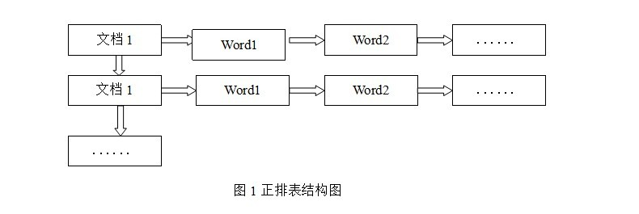
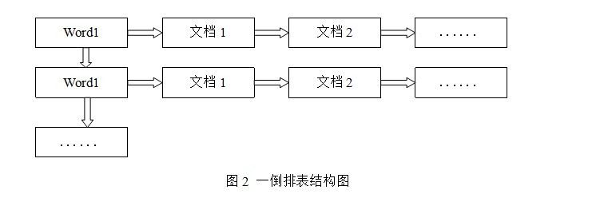
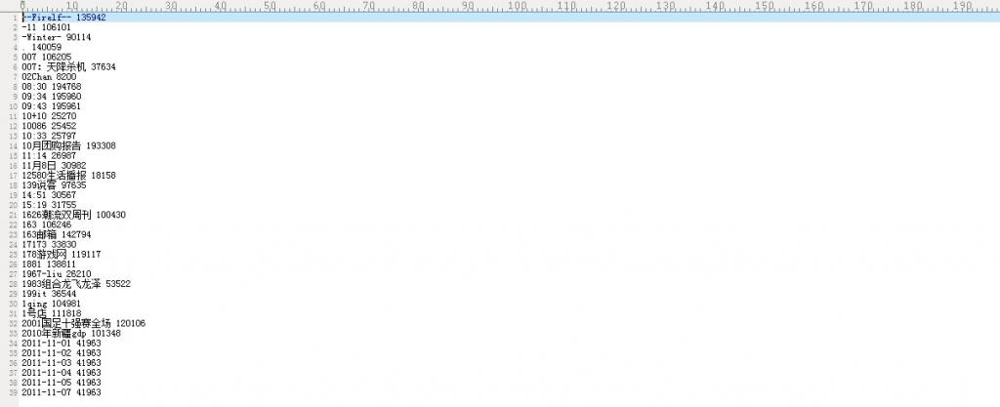
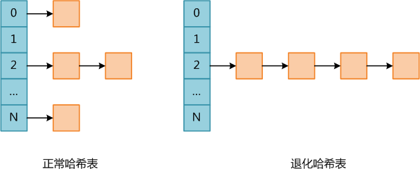
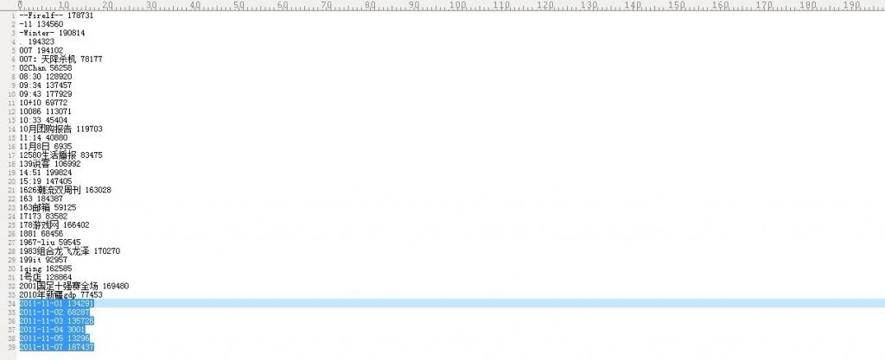
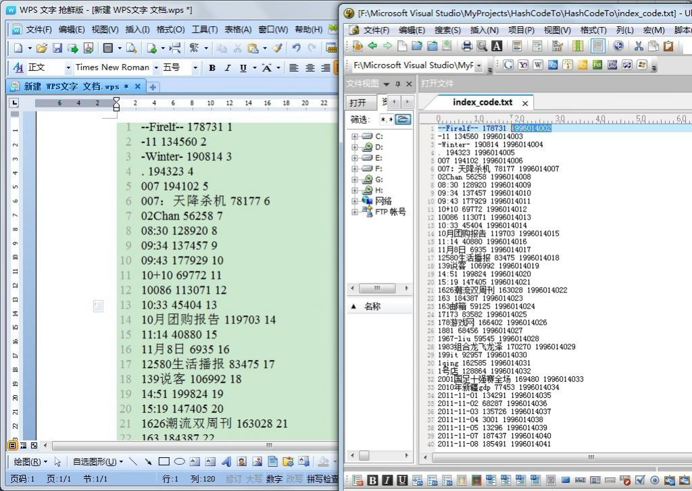

# 倒排索引关键词不重复Hash编码 

作者：July、yansha。编程艺术室出品。

出处：结构之法算法之道

本章要介绍这样一个问题，对倒排索引中的关键词进行编码。那么，这个问题将分为两个个步骤：

1. 首先，要提取倒排索引内词典文件中的关键词；
2. 对提取出来的关键词进行编码。本章采取hash编码的方式。既然要用hash编码，那么最重要的就是要解决hash冲突的问题，下文会详细介绍。

有一点必须提醒读者的是，倒排索引包含词典和倒排记录表两个部分，词典一般有词项（或称为关键词）和词项频率（即这个词项或关键词出现的次数），倒排记录表则记录着上述词项（或关键词）所出现的位置，或出现的文档及网页ID等相关信息。

##24.1、正排索引与倒排索引

咱们先来看什么是倒排索引，以及倒排索引与正排索引之间的区别：

我们知道，搜索引擎的关键步骤就是建立倒排索引，所谓倒排索引一般表示为一个关键词，然后是它的频度（出现的次数），位置（出现在哪一篇文章或网页中，及有关的日期，作者等信息），它相当于为互联网上几千亿页网页做了一个索引，好比一本书的目录、标签一般。读者想看哪一个主题相关的章节，直接根据目录即可找到相关的页面。不必再从书的第一页到最后一页，一页一页的查找。

接下来，阐述下正排索引与倒排索引的区别：

##一般索引（正排索引）

正排表是以文档的ID为关键字，表中记录文档中每个字的位置信息，查找时扫描表中每个文档中字的信息直到找出所有包含查询关键字的文档。正排表结构如图1所示，这种组织方法在建立索引的时候结构比较简单，建立比较方便且易于维护;因为索引是基于文档建立的，若是有新的文档假如，直接为该文档建立一个新的索引块，挂接在原来索引文件的后面。若是有文档删除，则直接找到该文档号文档对因的索引信息，将其直接删除。但是在查询的时候需对所有的文档进行扫描以确保没有遗漏，这样就使得检索时间大大延长，检索效率低下。

尽管正排表的工作原理非常的简单，但是由于其检索效率太低，除非在特定情况下，否则实用性价值不大。  


##倒排索引

倒排表以字或词为关键字进行索引，表中关键字所对应的记录表项记录了出现这个字或词的所有文档，一个表项就是一个字表段，它记录该文档的ID和字符在该文档中出现的位置情况。由于每个字或词对应的文档数量在动态变化，所以倒排表的建立和维护都较为复杂，但是在查询的时候由于可以一次得到查询关键字所对应的所有文档，所以效率高于正排表。在全文检索中，检索的快速响应是一个最为关键的性能，而索引建立由于在后台进行，尽管效率相对低一些，但不会影响整个搜索引擎的效率。

倒排表的结构图如图2：  


倒排表的索引信息保存的是字或词后继数组模型、互关联后继数组模型条在文档内的位置，在同一篇文档内相邻的字或词条的前后关系没有被保存到索引文件内。

##24.2、倒排索引中提取关键词
倒排索引是搜索引擎之基石。建成了倒排索引后，用户要查找某个query，如在搜索框输入某个关键词：“结构之法”后，搜索引擎不会再次使用爬虫又一个一个去抓取每一个网页，从上到下扫描网页，看这个网页有没有出现这个关键词，而是会在它预先生成的倒排索引文件中查找和匹配包含这个关键词“结构之法”的所有网页。找到了之后，再按相关性度排序，最终把排序后的结果显示给用户。  


如下，即是一个倒排索引文件（不全），我们把它取名为big_index，文件中每一较短的，不包含有“#####”符号的便是某个关键词，及这个关键词的出现次数。现在要从这个大索引文件中提取出这些关键词，--Firelf--，-11，-Winter-，.，007，007：天降杀机，02Chan..如何做到呢？一行一行的扫描整个索引文件么？

何意？之前已经说过：倒排索引包含词典和倒排记录表两个部分，词典一般有词项（或称为关键词）和词项频率（即这个词项或关键词出现的次数），倒排记录表则记录着上述词项（或关键词）所出现的位置，或出现的文档及网页ID等相关信息。

最简单的讲，就是要提取词典中的词项（关键词）：--Firelf--，-11，-Winter-，.，007，007：天降杀机，02Chan...。

--Firelf--（关键词）8（出现次数）  


我们可以试着这么解决：通过查找#####便可判断某一行出现的词是不是关键词，但如果这样做的话，便要扫描整个索引文件的每一行，代价实在巨大。如何提高速度呢？对了，关键词后面的那个出现次数为我们问题的解决起到了很好的作用，如下注释所示：

  //  本身没有##### 的行判定为关键词行，后跟这个关键词的行数N（即词项频率）
  //  接下来，截取关键词--Firelf--，然后读取后面关键词的行数N
  //  再跳过N行（滤过和避免扫描中间的倒排记录表信息）
  //  读取下一个关键词..

有朋友指出，上述方法虽然减少了扫描的行数，但并没有减少I0开销。读者是否有更好地办法？欢迎随时交流。

##24.3、为提取出来的关键词编码

爱思考的朋友可能会问，上述从倒排索引文件中提取出那些关键词（词项）的操作是为了什么呢？其实如我个人微博上12月12日所述的Hash词典编码：

词典文件的编码：1、词典怎么生成（存储和构造词典）；2、如何运用hash对输入的汉字进行编码；3、如何更好的解决冲突，即不重复以及追加功能。具体例子为：事先构造好词典文件后，输入一个词，要求找到这个词的编码，然后将其编码输出。且要有不断能添加词的功能，不得重复。

步骤应该是如下：1、读索引文件；2、提取索引中的词出来；3、词典怎么生成，存储和构造词典；4、词典文件的编码：不重复与追加功能。编码比如，输入中国，他的编码可以为10001，然后输入银行，他的编码可以为10002。只要实现不断添加词功能，以及不重复即可，词典类的大文件，hash最重要的是怎样避免冲突。

也就是说，现在我要对上述提取出来后的关键词进行编码，采取何种方式编码呢？暂时用hash函数编码。编码之后的效果将是每一个关键词都有一个特定的编码，如下图所示（与上文big_index文件比较一下便知）：

--Firelf--  对应编码为：135942

-11         对应编码为：106101

....  


但细心的朋友一看上图便知，其中第34~39行显示，有重复的编码，那么如何解决这个不重复编码的问题呢？
用hash表编码？但其极易产生冲突碰撞，为什么？请看：

哈希表是一种查找效率极高的数据结构，很多语言都在内部实现了哈希表。PHP中的哈希表是一种极为重要的数据结构，不但用于表示Array数据类型，还在Zend虚拟机内部用于存储上下文环境信息（执行上下文的变量及函数均使用哈希表结构存储）。

理想情况下哈希表插入和查找操作的时间复杂度均为O(1)，任何一个数据项可以在一个与哈希表长度无关的时间内计算出一个哈希值（key），然后在常量时间内定位到一个桶（术语bucket，表示哈希表中的一个位置）。当然这是理想情况下，因为任何哈希表的长度都是有限的，所以一定存在不同的数据项具有相同哈希值的情况，此时不同数据项被定为到同一个桶，称为碰撞（collision）。

哈希表的实现需要解决碰撞问题，碰撞解决大体有两种思路，

1. 第一种是根据某种原则将被碰撞数据定为到其它桶，例如线性探测——如果数据在插入时发生了碰撞，则顺序查找这个桶后面的桶，将其放入第一个没有被使用的桶；
2. 第二种策略是每个桶不是一个只能容纳单个数据项的位置，而是一个可容纳多个数据的数据结构（例如链表或红黑树），所有碰撞的数据以某种数据结构的形式组织起来。

不论使用了哪种碰撞解决策略，都导致插入和查找操作的时间复杂度不再是O(1)。以查找为例，不能通过key定位到桶就结束，必须还要比较原始key（即未做哈希之前的key）是否相等，如果不相等，则要使用与插入相同的算法继续查找，直到找到匹配的值或确认数据不在哈希表中。

PHP是使用单链表存储碰撞的数据，因此实际上PHP哈希表的平均查找复杂度为O(L)，其中L为桶链表的平均长度；而最坏复杂度为O(N)，此时所有数据全部碰撞，哈希表退化成单链表。下图PHP中正常哈希表和退化哈希表的示意图。  


哈希表碰撞攻击就是通过精心构造数据，使得所有数据全部碰撞，人为将哈希表变成一个退化的单链表，此时哈希表各种操作的时间均提升了一个数量级，因此会消耗大量CPU资源，导致系统无法快速响应请求，从而达到拒绝服务攻击（DoS）的目的。

可以看到，进行哈希碰撞攻击的前提是哈希算法特别容易找出碰撞，如果是MD5或者SHA1那基本就没戏了，幸运的是（也可以说不幸的是）大多数编程语言使用的哈希算法都十分简单（这是为了效率考虑），因此可以不费吹灰之力之力构造出攻击数据.（上述五段文字引自：[http://www.codinglabs.org/html/hash-collisions-attack-on-php.html](http://www.codinglabs.org/html/hash-collisions-attack-on-php.html)）。

##24.4、暴雪的Hash算法
值得一提的是，在解决Hash冲突的时候，搞的焦头烂额，结果今天上午在自己的博客内的一篇文章（[十一、从头到尾彻底解析Hash表算法](http://blog.csdn.net/v_JULY_v/archive/2011/03/17/6256463.aspx)）内找到了解决办法：网上流传甚广的暴雪的Hash算法。 OK，接下来，咱们回顾下暴雪的hash表算法：

> 接下来，咱们来具体分析一下一个最快的Hash表算法。

> 我们由一个简单的问题逐步入手：有一个庞大的字符串数组，然后给你一个单独的字符串，让你从这个数组中查找是否有这个字符串并找到它，你会怎么做？

> 有一个方法最简单，老老实实从头查到尾，一个一个比较，直到找到为止，我想只要学过程序设计的人都能把这样一个程序作出来，但要是有程序员把这样的程序交给用户，我只能用无语来评价，或许它真的能工作，但...也只能如此了。

> 最合适的算法自然是使用HashTable（哈希表），先介绍介绍其中的基本知识，所谓Hash，一般是一个整数，通过某种算法，可以把一个字符串"压缩" 成一个整数。当然，无论如何，一个32位整数是无法对应回一个字符串的，但在程序中，两个字符串计算出的Hash值相等的可能非常小，下面看看在MPQ中的Hash算法：

> 函数prepareCryptTable以下的函数生成一个长度为0x500（合10进制数：1280）的cryptTable[0x500]

```cpp
//函数prepareCryptTable以下的函数生成一个长度为0x500（合10进制数：1280）的cryptTable[0x500]  
void prepareCryptTable()  
{   
    unsigned long seed = 0x00100001, index1 = 0, index2 = 0, i;  
  
    for( index1 = 0; index1 < 0x100; index1++ )  
    {   
        for( index2 = index1, i = 0; i < 5; i++, index2 += 0x100 )  
        {   
            unsigned long temp1, temp2;  
  
            seed = (seed * 125 + 3) % 0x2AAAAB;  
            temp1 = (seed & 0xFFFF) << 0x10;  
  
            seed = (seed * 125 + 3) % 0x2AAAAB;  
            temp2 = (seed & 0xFFFF);  
  
            cryptTable[index2] = ( temp1 | temp2 );   
        }   
    }   
}   
```

> 函数HashString以下函数计算lpszFileName 字符串的hash值，其中dwHashType 为hash的类型，

```cpp
//函数HashString以下函数计算lpszFileName 字符串的hash值，其中dwHashType 为hash的类型，  
unsigned long HashString(const char *lpszkeyName, unsigned long dwHashType )  
{  
    unsigned char *key  = (unsigned char *)lpszkeyName;  
    unsigned long seed1 = 0x7FED7FED;  
    unsigned long seed2 = 0xEEEEEEEE;  
    int ch;  
  
    while( *key != 0 )  
    {  
        ch = *key++;  
        seed1 = cryptTable[(dwHashType<<8) + ch] ^ (seed1 + seed2);  
        seed2 = ch + seed1 + seed2 + (seed2<<5) + 3;  
    }  
    return seed1;  
} 
```

> Blizzard的这个算法是非常高效的，被称为"One-Way Hash"( A one-way hash is a an algorithm that is constructed in such a way that deriving the original string (set of strings, actually) is virtually impossible)。举个例子，字符串"unitneutralacritter.grp"通过这个算法得到的结果是0xA26067F3。

> 是不是把第一个算法改进一下，改成逐个比较字符串的Hash值就可以了呢，答案是，远远不够，要想得到最快的算法，就不能进行逐个的比较，通常是构造一个哈希表(Hash Table)来解决问题，哈希表是一个大数组，这个数组的容量根据程序的要求来定义，

> 例如1024，每一个Hash值通过取模运算 (mod) 对应到数组中的一个位置，这样，只要比较这个字符串的哈希值对应的位置有没有被占用，就可以得到最后的结果了，想想这是什么速度？是的，是最快的O(1)，现在仔细看看这个算法吧：

```cpp
typedef struct  
{  
    int nHashA;  
    int nHashB;  
    char bExists;  
   ......  
} SOMESTRUCTRUE;  
//一种可能的结构体定义？
```

> 函数GetHashTablePos下述函数为在Hash表中查找是否存在目标字符串，有则返回要查找字符串的Hash值，无则，return -1.

```cpp
//函数GetHashTablePos下述函数为在Hash表中查找是否存在目标字符串，有则返回要查找字符串的Hash值，无则，return -1.  
int GetHashTablePos( har *lpszString, SOMESTRUCTURE *lpTable )   
//lpszString要在Hash表中查找的字符串，lpTable为存储字符串Hash值的Hash表。  
{   
    int nHash = HashString(lpszString);  //调用上述函数HashString，返回要查找字符串lpszString的Hash值。  
    int nHashPos = nHash % nTableSize;  
   
    if ( lpTable[nHashPos].bExists  &&  !strcmp( lpTable[nHashPos].pString, lpszString ) )   
    {  //如果找到的Hash值在表中存在，且要查找的字符串与表中对应位置的字符串相同，  
        return nHashPos;    //返回找到的Hash值  
    }   
    else  
    {  
        return -1;    
    }   
}  
```

> 看到此，我想大家都在想一个很严重的问题：“如果两个字符串在哈希表中对应的位置相同怎么办？”,毕竟一个数组容量是有限的，这种可能性很大。解决该问题的方法很多，我首先想到的就是用“链表”,感谢大学里学的数据结构教会了这个百试百灵的法宝，我遇到的很多算法都可以转化成链表来解决，只要在哈希表的每个入口挂一个链表，保存所有对应的字符串就OK了。事情到此似乎有了完美的结局，如果是把问题独自交给我解决，此时我可能就要开始定义数据结构然后写代码了。
> 然而Blizzard的程序员使用的方法则是更精妙的方法。基本原理就是：他们在哈希表中不是用一个哈希值而是用三个哈希值来校验字符串。  

> MPQ使用文件名哈希表来跟踪内部的所有文件。但是这个表的格式与正常的哈希表有一些不同。首先，它没有使用哈希作为下标，把实际的文件名存储在表中用于验证，实际上它根本就没有存储文件名。而是使用了3种不同的哈希：一个用于哈希表的下标，两个用于验证。这两个验证哈希替代了实际文件名。  

> 当然了，这样仍然会出现2个不同的文件名哈希到3个同样的哈希。但是这种情况发生的概率平均是：1:18889465931478580854784，这个概率对于任何人来说应该都是足够小的。现在再回到数据结构上，Blizzard使用的哈希表没有使用链表，而采用"顺延"的方式来解决问题。”下面，咱们来看看这个网上流传甚广的暴雪hash算法：

函数GetHashTablePos中，lpszString 为要在hash表中查找的字符串；lpTable 为存储字符串hash值的hash表；nTableSize 为hash表的长度：

```cpp
//函数GetHashTablePos中，lpszString 为要在hash表中查找的字符串；lpTable 为存储字符串hash值的hash表；nTableSize 为hash表的长度：   
int GetHashTablePos( char *lpszString, MPQHASHTABLE *lpTable, int nTableSize )  
{  
    const int  HASH_OFFSET = 0, HASH_A = 1, HASH_B = 2;  
   
    int  nHash = HashString( lpszString, HASH_OFFSET );  
    int  nHashA = HashString( lpszString, HASH_A );  
    int  nHashB = HashString( lpszString, HASH_B );  
    int  nHashStart = nHash % nTableSize;  
    int  nHashPos = nHashStart;  
   
    while ( lpTable[nHashPos].bExists )  
   {  
//     如果仅仅是判断在该表中时候存在这个字符串，就比较这两个hash值就可以了，不用对结构体中的字符串进行比较。  
//         这样会加快运行的速度？减少hash表占用的空间？这种方法一般应用在什么场合？  
        if ( 　 lpTable[nHashPos].nHashA == nHashA  
        &&  lpTable[nHashPos].nHashB == nHashB )  
       {  
            return nHashPos;  
       }  
       else  
       {  
            nHashPos = (nHashPos + 1) % nTableSize;  
       }  
   
        if (nHashPos == nHashStart)  
              break;  
    }  
     return -1;  
}  
```

上述程序解释：

1. 计算出字符串的三个哈希值（一个用来确定位置，另外两个用来校验)  
2. 察看哈希表中的这个位置  
3. 哈希表中这个位置为空吗？如果为空，则肯定该字符串不存在，返回-1。  
4. 如果存在，则检查其他两个哈希值是否也匹配，如果匹配，则表示找到了该字符串，返回其Hash值。  
5. 移到下一个位置，如果已经移到了表的末尾，则反绕到表的开始位置起继续查询  
6. 看看是不是又回到了原来的位置，如果是，则返回没找到  
7. 回到3。  

##24.5、不重复Hash编码
有了上面的暴雪Hash算法。咱们的问题便可解决了。不过，有两点必须先提醒读者：  
1. Hash表起初要初始化；  
2. 暴雪的Hash算法对于查询那样处理可以，但对插入就不能那么解决。  

关键主体代码如下：
```cpp
//函数prepareCryptTable以下的函数生成一个长度为0x500（合10进制数：1280）的cryptTable[0x500]  
void prepareCryptTable()  
{  
    unsigned long seed = 0x00100001, index1 = 0, index2 = 0, i;  
  
    for( index1 = 0; index1 <0x100; index1++ )  
    {  
        for( index2 = index1, i = 0; i < 5; i++, index2 += 0x100)  
        {  
            unsigned long temp1, temp2;  
            seed = (seed * 125 + 3) % 0x2AAAAB;  
            temp1 = (seed & 0xFFFF)<<0x10;  
            seed = (seed * 125 + 3) % 0x2AAAAB;  
            temp2 = (seed & 0xFFFF);  
            cryptTable[index2] = ( temp1 | temp2 );  
        }  
    }  
}  
  
//函数HashString以下函数计算lpszFileName 字符串的hash值，其中dwHashType 为hash的类型，  
unsigned long HashString(const char *lpszkeyName, unsigned long dwHashType )  
{  
    unsigned char *key  = (unsigned char *)lpszkeyName;  
    unsigned long seed1 = 0x7FED7FED;  
    unsigned long seed2 = 0xEEEEEEEE;  
    int ch;  
  
    while( *key != 0 )  
    {  
        ch = *key++;  
        seed1 = cryptTable[(dwHashType<<8) + ch] ^ (seed1 + seed2);  
        seed2 = ch + seed1 + seed2 + (seed2<<5) + 3;  
    }  
    return seed1;  
}  
  
/////////////////////////////////////////////////////////////////////  
//function: 哈希词典 编码  
//parameter:  
//author: lei.zhou  
//time: 2011-12-14  
/////////////////////////////////////////////////////////////////////  
MPQHASHTABLE TestHashTable[nTableSize];  
int TestHashCTable[nTableSize];  
int TestHashDTable[nTableSize];  
key_list test_data[nTableSize];  
  
//直接调用上面的hashstring，nHashPos就是对应的HASH值。  
int insert_string(const char *string_in)  
{  
    const int HASH_OFFSET = 0, HASH_C = 1, HASH_D = 2;  
    unsigned int nHash = HashString(string_in, HASH_OFFSET);  
    unsigned int nHashC = HashString(string_in, HASH_C);  
    unsigned int nHashD = HashString(string_in, HASH_D);  
    unsigned int nHashStart = nHash % nTableSize;  
    unsigned int nHashPos = nHashStart;  
    int ln, ires = 0;  
  
    while (TestHashTable[nHashPos].bExists)  
    {  
//      if (TestHashCTable[nHashPos]  == (int) nHashC && TestHashDTable[nHashPos] == (int) nHashD)  
//          break;  
//      //...  
//      else  
        //如之前所提示读者的那般，暴雪的Hash算法对于查询那样处理可以，但对插入就不能那么解决  
            nHashPos = (nHashPos + 1) % nTableSize;  
  
        if (nHashPos == nHashStart)  
            break;  
    }  
  
    ln = strlen(string_in);  
    if (!TestHashTable[nHashPos].bExists && (ln < nMaxStrLen))  
    {   
        TestHashCTable[nHashPos] = nHashC;  
        TestHashDTable[nHashPos] = nHashD;  
  
        test_data[nHashPos] = (KEYNODE *) malloc (sizeof(KEYNODE) * 1);  
        if(test_data[nHashPos] == NULL)  
        {  
            printf("10000 EMS ERROR !!!!\n");  
            return 0;  
        }  
  
        test_data[nHashPos]->pkey = (char *)malloc(ln+1);  
        if(test_data[nHashPos]->pkey == NULL)  
        {  
            printf("10000 EMS ERROR !!!!\n");  
            return 0;  
        }  
  
        memset(test_data[nHashPos]->pkey, 0, ln+1);  
        strncpy(test_data[nHashPos]->pkey, string_in, ln);  
        *((test_data[nHashPos]->pkey)+ln) = 0;  
        test_data[nHashPos]->weight = nHashPos;  
  
        TestHashTable[nHashPos].bExists = 1;  
    }  
    else  
    {  
        if(TestHashTable[nHashPos].bExists)  
            printf("30000 in the hash table %s !!!\n", string_in);  
        else  
            printf("90000 strkey error !!!\n");  
    }  
    return nHashPos;  
}
```

接下来要读取索引文件big_index对其中的关键词进行编码（为了简单起见，直接一行一行扫描读写，没有跳过行数了）：
```cpp
void bigIndex_hash(const char *docpath, const char *hashpath)  
{  
    FILE *fr, *fw;  
    int len;  
    char *pbuf, *p;  
    char dockey[TERM_MAX_LENG];  
  
    if(docpath == NULL || *docpath == '\0')  
        return;  
  
    if(hashpath == NULL || *hashpath == '\0')  
        return;  
  
    fr = fopen(docpath, "rb");  //读取文件docpath  
    fw = fopen(hashpath, "wb");  
    if(fr == NULL || fw == NULL)  
    {  
        printf("open read or write file error!\n");  
        return;  
    }  
  
    pbuf = (char*)malloc(BUFF_MAX_LENG);  
    if(pbuf == NULL)  
    {  
        fclose(fr);  
        return ;  
    }  
  
    memset(pbuf, 0, BUFF_MAX_LENG);  
  
    while(fgets(pbuf, BUFF_MAX_LENG, fr))  
    {  
        len = GetRealString(pbuf);  
        if(len <= 1)  
            continue;  
        p = strstr(pbuf, "#####");    
        if(p != NULL)  
            continue;  
  
        p = strstr(pbuf, "  ");  
        if (p == NULL)  
        {  
            printf("file contents error!");  
        }  
  
        len = p - pbuf;  
        dockey[0] = 0;  
        strncpy(dockey, pbuf, len);  
  
        dockey[len] = 0;        
  
        int num = insert_string(dockey);   
  
        dockey[len] = ' ';  
        dockey[len+1] = '\0';  
        char str[20];  
        itoa(num, str, 10);  
  
        strcat(dockey, str);  
        dockey[len+strlen(str)+1] = '\0';  
        fprintf (fw, "%s\n", dockey);  
  
    }  
    free(pbuf);  
    fclose(fr);  
    fclose(fw);  
} 
```

主函数已经很简单了，如下：

```cpp
int main()  
{  
    prepareCryptTable();  //Hash表起初要初始化  
  
    //现在要把整个big_index文件插入hash表，以取得编码结果  
    bigIndex_hash("big_index.txt", "hashpath.txt");  
    system("pause");  
  
    return 0;  
}  
```

程序运行后生成的hashpath.txt文件如下：


如上所示，采取暴雪的Hash算法并在插入的时候做适当处理，当再次对上文中的索引文件big_index进行Hash编码后，冲突问题已经得到初步解决。当然，还有待更进一步更深入的测试。

后续添上数目索引1~10000...

后来又为上述文件中的关键词编了码一个计数的内码，不过，奇怪的是，同样的代码，在Dev C++ 与VS2010上运行结果却不同（左边dev上计数从"1"开始，VS上计数从“1994014002”开始），如下图所示：


在上面的bigIndex_hashcode函数的基础上，修改如下，即可得到上面的效果：
```cpp
void bigIndex_hashcode(const char *in_file_path, const char *out_file_path)  
{  
    FILE *fr, *fw;  
    int len, value;  
    char *pbuf, *pleft, *p;  
    char keyvalue[TERM_MAX_LENG], str[WORD_MAX_LENG];  
  
    if(in_file_path == NULL || *in_file_path == '\0') {  
        printf("input file path error!\n");  
        return;  
    }  
  
    if(out_file_path == NULL || *out_file_path == '\0') {  
        printf("output file path error!\n");  
        return;  
    }  
  
    fr = fopen(in_file_path, "r");  //读取in_file_path路径文件  
    fw = fopen(out_file_path, "w");  
  
    if(fr == NULL || fw == NULL)  
    {  
        printf("open read or write file error!\n");  
        return;  
    }  
  
    pbuf = (char*)malloc(BUFF_MAX_LENG);  
    pleft = (char*)malloc(BUFF_MAX_LENG);  
    if(pbuf == NULL || pleft == NULL)  
    {  
        printf("allocate memory error!");  
        fclose(fr);  
        return ;  
    }  
  
    memset(pbuf, 0, BUFF_MAX_LENG);  
  
    int offset = 1;  
    while(fgets(pbuf, BUFF_MAX_LENG, fr))  
    {  
        if (--offset > 0)  
            continue;  
  
        if(GetRealString(pbuf) <= 1)  
            continue;  
  
        p = strstr(pbuf, "#####");    
        if(p != NULL)  
            continue;  
  
        p = strstr(pbuf, "  ");  
        if (p == NULL)  
        {  
            printf("file contents error!");  
        }  
  
        len = p - pbuf;  
  
        // 确定跳过行数  
        strcpy(pleft, p+1);   
        offset = atoi(pleft) + 1;  
  
        strncpy(keyvalue, pbuf, len);    
        keyvalue[len] = '\0';  
        value = insert_string(keyvalue);  
  
        if (value != -1) {  
  
            // key value中插入空格  
            keyvalue[len] = ' ';  
            keyvalue[len+1] = '\0';  
  
            itoa(value, str, 10);  
            strcat(keyvalue, str);  
  
            keyvalue[len+strlen(str)+1] = ' ';  
            keyvalue[len+strlen(str)+2] = '\0';  
  
            keysize++;  
            itoa(keysize, str, 10);  
            strcat(keyvalue, str);  
  
            // 将key value写入文件  
            fprintf (fw, "%s\n", keyvalue);  
  
        }  
    }  
    free(pbuf);  
    fclose(fr);  
    fclose(fw);  
} 
```

##小结
本文有一点值得一提的是，在此前的这篇文章（[十一、从头到尾彻底解析Hash表算法](http://blog.csdn.net/v_JULY_v/archive/2011/03/17/6256463.aspx)）之中，只是对Hash表及暴雪的Hash算法有过学习和了解，但尚未真正运用过它，而今在本章中体现，证明还是之前写的文章，及之前对Hash表等算法的学习还是有一定作用的。同时，也顺便对暴雪的Hash函数算是做了个测试，其的确能解决一般的冲突性问题，创造这个算法的人不简单呐。

