## 从头到尾彻底理解傅里叶变换算法、上

I、本文中阐述离散傅里叶变换方法，是根据此书：The Scientist and Engineer's Guide to Digital Signal Processing，By Steven W. Smith, Ph.D.而翻译而成的，此书地址：<http://www.dspguide.com/pdfbook.htm>。  
II、同时，有相当一部分内容编辑整理自dznlong的博客，也贴出其博客地址，向原创的作者表示致敬：<http://blog.csdn.net/dznlong> 。这年头，真正静下心写来原创文章的人，很少了。

从头到尾彻底理解傅里叶变换算法、上  
前言  
第一章、傅立叶变换的由来  
第二章、实数形式离散傅立叶变换（Real DFT）  

从头到尾彻底理解傅里叶变换算法、下  
第三章、复数  
第四章、复数形式离散傅立叶变换  

### 前言：  

“关于傅立叶变换，无论是书本还是在网上可以很容易找到关于傅立叶变换的描述，但是大都是些故弄玄虚的文章，太过抽象，尽是一些让人看了就望而生畏的公式的罗列，让人很难能够从感性上得到理解”---dznlong

那么，到底什么是傅里叶变换算法列?傅里叶变换所涉及到的公式具体有多复杂列?  
**傅里叶变换**（Fourier transform）是一种线性的积分变换。因其基本思想首先由法国学者傅里叶系统地提出，所以以其名字来命名以示纪念。

哦，傅里叶变换原来就是一种变换而已，只是这种变换是从时间转换为频率的变化。这下，你就知道了，傅里叶就是一种变换，一种什么变换？就是一种从时间到频率的变化或其相互转化。

ok，咱们再来总体了解下傅里叶变换，让各位对其有个总体大概的印象，也顺便看看傅里叶变换所涉及到的公式，究竟有多复杂，
以下就是傅里叶变换的4种变体（摘自，维基百科）:

**连续傅里叶变换**  

一般情况下，若“傅里叶变换”一词不加任何限定语，则指的是“连续傅里叶变换”。连续傅里叶变换将平方可积的函数f(t)表示成复指数函数的积分或级数形式。

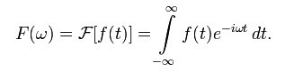

这是将频率域的函数F(ω)表示为时间域的函数f(t)的积分形式。

连续傅里叶变换的逆变换 (inverse Fourier transform)为：

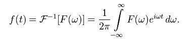

即将时间域的函数f(t)表示为频率域的函数F(ω)的积分。

一般可称函数**f(t)**为原函数，而称函数**F(ω)**为傅里叶变换的像函数，原函数和像函数构成一个傅里叶变换对（transform pair）。

除此之外，还有其它型式的变换对，以下两种型式亦常被使用。在通信或是信号处理方面，常以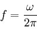来代换，而形成新的变换对:

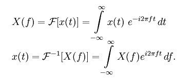

或者是因系数重分配而得到新的变换对：


一种对连续傅里叶变换的推广称为分数傅里叶变换（Fractional Fourier Transform）。分数傅里叶变换(fractional Fourier transform,FRFT)指的就是傅里叶变换(Fourier transform, FT)的广义化。  
分数傅里叶变换的物理意义即做傅里叶变换 a 次，其中 a 不一定要为整数；而做了分数傅里叶变换之后，信号或输入函数便会出现在介于时域(time domain)与频域(frequency domain)之间的分数域(fractional domain)。

当f(t)为偶函数（或奇函数）时，其正弦（或余弦）分量将消亡，而可以称这时的变换为余弦变换（cosine transform）或正弦变换（sine transform）.

另一个值得注意的性质是，当f(t)为纯实函数时，F(−ω) = F\*(ω)成立.

**傅里叶级数**

连续形式的傅里叶变换其实是傅里叶级数 (Fourier series)的推广，因为积分其实是一种极限形式的求和算子而已。对于周期函数，其傅里叶级数是存在的：

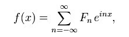

其中Fn为复幅度。对于实值函数，函数的傅里叶级数可以写成：

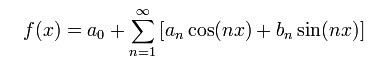

其中an和bn是实频率分量的幅度。

**离散时域傅里叶变换**

离散傅里叶变换是离散时间傅里叶变换（DTFT）的特例（有时作为后者的近似）。DTFT在时域上离散，在频域上则是周期的。DTFT可以被看作是傅里叶级数的逆变换。

**离散傅里叶变换**

离散傅里叶变换（DFT），是连续傅里叶变换在时域和频域上都离散的形式，将时域信号的采样变换为在离散时间傅里叶变换（DTFT）频域的采样。在形式上，变换两端（时域和频域上）的序列是有限长的，而实际上这两组序列都应当被认为是离散周期信号的主值序列。即使对有限长的离散信号作DFT，也应当将其看作经过周期延拓成为周期信号再作变换。在实际应用中通常采用快速傅里叶变换以高效计算DFT。

为了在科学计算和数字信号处理等领域使用计算机进行傅里叶变换，必须将函数xn定义在离散点而非连续域内，且须满足有限性或周期性条件。这种情况下，使用*离散傅里叶变换（DFT）*，将函数xn表示为下面的求和形式：

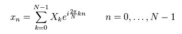

其中Xk是傅里叶幅度。直接使用这个公式计算的计算复杂度为O（n\*n），而*快速傅里叶变换（FFT）可以将复杂度改进为O（n\*lgn）*。（后面会具体阐述FFT是如何将复杂度降为O（n\*lgn）的。）计算复杂度的降低以及数字电路计算能力的发展使得DFT成为在信号处理领域十分实用且重要的方法。

下面，比较下上述傅立叶变换的4种变体，

<table>
  <tr>
    <td>变换</td>
    <td>时间</td>
    <td>频率</td>
  </tr>
  <tr>
    <td>连续傅里叶变换</td>
    <td>连续，非周期性</td>
    <td>连续，非周期性</td>
  </tr>
  <tr>
    <td>傅里叶级数</td>
    <td>连续，周期性</td>
    <td>离散，非周期性</td>
  </tr>
  <tr>
    <td>离散时间傅里叶变换</td>
    <td>离散，非周期性</td>
    <td>连续，周期性</td>
  </tr>
    <tr>
    <td>离散傅里叶变换</td>
    <td>离散，周期性</td>
    <td>离散，周期性</td>
  </tr>
</table>

如上，容易发现：函数在时（频）域的离散对应于其像函数在频（时）域的周期性。反之连续则意味着在对应域的信号的非周期性。也就是说，时间上的离散性对应着频率上的周期性。同时，注意，离散时间傅里叶变换，时间离散，频率不离散，它在频域依然是连续的。

如果，读到此，你不甚明白，大没关系，不必纠结于以上4种变体，继续往下看，你自会豁然开朗。（有什么问题，也恳请提出，或者批评指正）

**ok， 本文，接下来，由傅里叶变换入手，后重点阐述离散傅里叶变换、快速傅里叶算法，到最后彻底实现FFT算法，全篇力求通俗易懂、阅读顺畅，教你从头到尾彻底理解傅里叶变换算法。**由于傅里叶变换，也称傅立叶变换，下文所称为*傅立叶变换*，同一个变换，不同叫法，读者不必感到奇怪。

### 第一章、傅立叶变换的由来

要理解傅立叶变换，先得知道傅立叶变换是怎么变换的，当然，也需要一定的高等数学基础，最基本的是级数变换，其中傅立叶级数变换是傅立叶变换的基础公式。
 
#### 一、傅立叶变换的提出

傅立叶是一位法国数学家和物理学家，原名是Jean Baptiste Joseph Fourier(1768-1830)。Fourier于1807年在法国科学学会上发表了一篇论文，论文里描述运用正弦曲线来描述温度分布，论文里有个在当时具有争议性的决断：任何连续周期信号都可以由一组适当的正弦曲线组合而成。

当时审查这个论文拉格朗日坚决反对此论文的发表，而后在近50年的时间里，拉格朗日坚持认为傅立叶的方法无法表示带有棱角的信号，如在方波中出现非连续变化斜率。直到拉格朗日死后15年这个论文才被发表出来。

谁是对的呢？拉格朗日是对的：正弦曲线无法组合成一个带有棱角的信号。但是，我们可以用正弦曲线来非常逼近地表示它，逼近到两种表示方法不存在能量差别，基于此，傅立叶是对的。

为什么我们要用正弦曲线来代替原来的曲线呢？如我们也还可以用方波或三角波来代替呀，分解信号的方法是无穷多的，但分解信号的目的是为了更加简单地处理原来的信号。

用正余弦来表示原信号会更加简单，因为正余弦拥有原信号所不具有的性质：正弦曲线保真度。一个正余弦曲线信号输入后，输出的仍是正余弦曲线，只有幅度和相位可能发生变化，但是频率和波的形状仍是一样的。且只有正余弦曲线才拥有这样的性质，正因如此我们才不用方波或三角波来表示。

#### 二、傅立叶变换分类

根据原信号的不同类型，我们可以把傅立叶变换分为四种类别：

1. 非周期性连续信号		傅立叶变换（Fourier Transform）
2. 周期性连续信号			傅立叶级数（Fourier Series）
3. 非周期性离散信号        离散*时域*傅立叶变换（Discrete Time Fourier Transform）
4. 周期性离散信号			离散傅立叶变换（Discrete Fourier Transform）


下图是四种原信号图例（从上到下，依次是FT，FS，DTFT，DFT）：

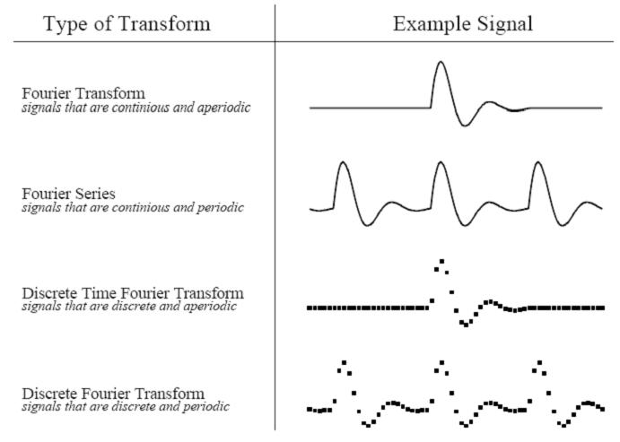

这四种傅立叶变换都是针对正无穷大和负无穷大的信号，即信号的的长度是无穷大的，我们知道这对于计算机处理来说是不可能的，**那么有没有针对长度有限的傅立叶变换呢？**没有。因为正余弦波被定义成从负无穷小到正无穷大，我们无法把一个长度无限的信号组合成长度有限的信号。

面对这种困难，方法是：把长度有限的信号表示成长度无限的信号。如，可以把信号无限地从左右进行延伸，延伸的部分用零来表示，这样，这个信号就可以被看成是*非周期性*离散信号，我们可以用到*离散时域傅立叶变换（DTFT）*的方法。也可以把信号用复制的方法进行延伸，这样信号就变成了*周期性*离散信号，这时我们就可以用*离散傅立叶变换方法（DFT）*进行变换。本章我们要讲的是离散信号，对于连续信号我们不作讨论，因为计算机只能处理离散的数值信号，我们的最终目的是运用计算机来处理信号的。
 
但是对于非周期性的信号，我们需要用无穷多不同频率的正弦曲线来表示，这对于计算机来说是不可能实现的。所以对于离散信号的变换只有**离散傅立叶变换（DFT）**才能被适用，对于计算机来说只有离散的和有限长度的数据才能被处理，对于其它的变换类型只有在数学演算中才能用到，在计算机面前我们只能用DFT方法，后面我们要理解的也正是DFT方法。

这里要理解的是我们使用周期性的信号目的是为了能够用数学方法来解决问题，至于考虑周期性信号是从哪里得到或怎样得到是无意义的。
 
每种傅立叶变换都分成实数和复数两种方法，对于实数方法是最好理解的，但是复数方法就相对复杂许多了，需要懂得有关复数的理论知识，不过，如果理解了实数离散傅立叶变换(real DFT)，再去理解复数傅立叶变换就更容易了，所以我们先把复数的傅立叶变换放到一边去，先来理解实数傅立叶变换，在后面我们会先讲讲关于复数的基本理论，然后在理解了实数傅立叶变换的基础上再来理解复数傅立叶变换。
 
还有，这里我们所要说的变换(transform)虽然是数学意义上的变换，但跟函数变换是不同的，函数变换是符合一一映射准则的，对于离散数字信号处理（DSP），有许多的变换：傅立叶变换、拉普拉斯变换、Z变换、希尔伯特变换、离散余弦变换等，这些都扩展了函数变换的定义，允许输入和输出有多种的值，简单地说变换就是把一堆的数据变成另一堆的数据的方法。
 
#### 三、一个关于实数离散傅立叶变换(Real DFT)的例子

先来看一个变换实例，下图是一个原始信号图像：


这个信号的长度是16，于是可以把这个信号分解9个余弦波和9个正弦波（一个长度为N的信号可以分解成N/2+1个正余弦信号，这是为什么呢？结合下面的18个正余弦图,我想从计算机处理精度上就不难理解，一个长度为N的信号，最多只能有N/2+1个不同频率，再多的频率就超过了计算机所能所处理的精度范围），如下图：

9个余弦信号：

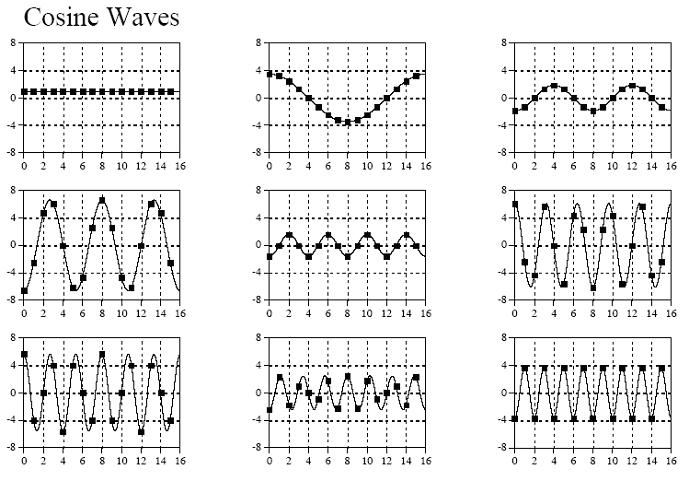

9个正弦信号：

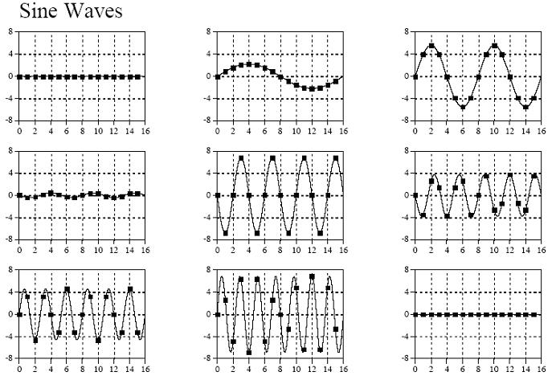

把以上所有信号相加即可得到原始信号，至于是怎么分别变换出9种不同频率信号的，我们先不急，先看看对于以上的变换结果，在程序中又是该怎么表示的，我们可以看看下面这个示例图：

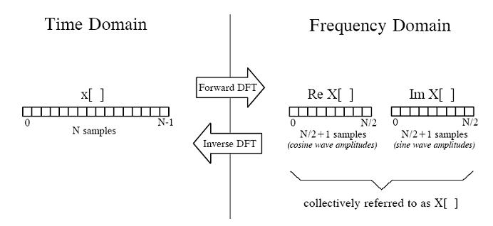

上图中左边表示时域中的信号，右边是频域信号表示方法，

从左向右，**-->**，表示**正向转换**(Forward DFT)，从右向左，<--，表示**逆向转换**(Inverse DFT)，
用小写x[]表示信号在每个时间点上的幅度值数组, 用大写X[]表示每种频率的副度值数组（即时间x-->频率**X**）, 

因为有N/2+1种频率，所以该数组长度为N/2+1，

X[]数组又分两种，一种是表示余弦波的不同频率幅度值：Re X[]，

另一种是表示正弦波的不同频率幅度值：Im X[]，

Re是实数(Real)的意思，Im是虚数(Imagine)的意思，采用复数的表示方法把正余弦波组合起来进行表示，但这里我们不考虑复数的其它作用，只记住是一种组合方法而已，目的是为了便于表达（在后面我们会知道，复数形式的傅立叶变换长度是N，而不是N/2+1）。如此，再回过头去，看上面的正余弦各9种频率的变化，相信，问题不大了。

 

### 第二章、实数形式离散傅立叶变换（Real DFT）

上一章，我们看到了一个实数形式离散傅立叶变换的例子，通过这个例子能够让我们先对傅立叶变换有一个较为形象的感性认识，现在就让我们来看看实数形式离散傅立叶变换的正向和逆向是怎么进行变换的。在此，我们先来看一下频率的多种表示方法。
 
#### 一、   频域中关于频率的四种表示方法
 
1. 序号表示方法，根据时域中信号的样本数取0 ~ N/2，用这种方法在程序中使用起来可以更直接地取得每种频率的幅度值，因为频率值跟数组的序号是一一对应的: X[k]，取值范围是0 ~ N/2；
2. 分数表示方法，根据时域中信号的样本数的比例值取0 ~ 0.5: X[ƒ]，ƒ = k/N，取值范围是0 ~ 1/2；
3. 用弧度值来表示，把ƒ乘以一个2π得到一个弧度值，这种表示方法叫做自然频率(natural frequency)：X[ω]，ω = 2πƒ = 2πk/N，取值范围是0 ~ π；
4. 以赫兹(Hz)为单位来表示，这个一般是应用于一些特殊应用，如取样率为10 kHz表示每秒有10,000个样本数：取值范围是0到取样率的一半。
 
#### 二、   DFT基本函数
 
ck[i] = cos(2πki/N)
sk[i] = sin(2πki/N)

其中k表示每个正余弦波的频率，如为2表示在0到N长度中存在两个完整的周期，10即有10个周期，如下图：

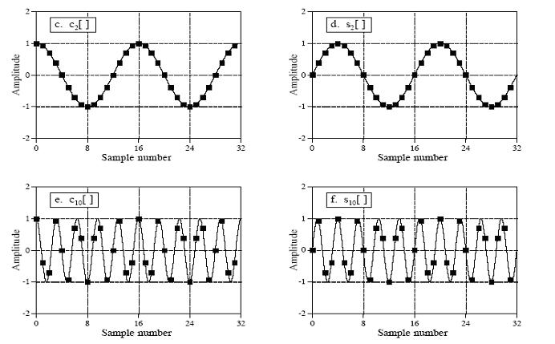

上图中至于每个波的振幅(amplitude)值(Re X[k],Im X[k])是怎么算出来的,这个是DFT的核心，也是最难理解的部分，我们先来看看如何把分解出来的正余弦波合成原始信号(Inverse DFT)。
 
#### 三、   合成运算方法(Real Inverse DFT)
 
DFT合成等式（合成原始**_时间_信号，频率-->时间，逆向变换**）：

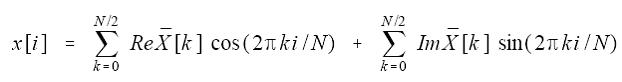

如果有学过傅立叶级数，对这个等式就会有似曾相识的感觉，不错！这个等式跟傅立叶级数是非常相似的：

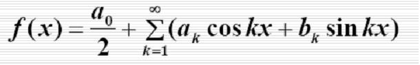

当然，差别是肯定是存在的，因为这两个等式是在两个不同条件下运用的，至于怎么证明DFT合成公式，这个我想需要非常强的高等数学理论知识了，这是研究数学的人的工作，对于普通应用者就不需要如此的追根究底了，但是傅立叶级数是好理解的，我们起码可以从傅立叶级数公式中看出DFT合成公式的合理性。

DFT合成等式中的 *跟之前提到的* Im X[k]和Re X[k]是不一样的，下面是转换方法（*关于此公式的解释，见下文*）:

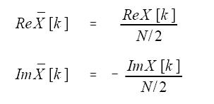

但k等于0和N/2时,实数部分的计算要用下面的等式:

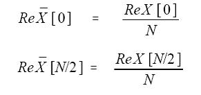

上面四个式中的N是时域中点的总数，k是从0到N/2的序号。

为什么要这样进行转换呢？这个可以从频谱密度(spectral density)得到理解，如下图就是个频谱图：

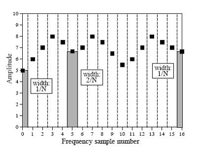

这是一个频谱图，横坐标表示频率大小，纵坐标表示振幅大小，原始信号长度为N（这里是32），经DFT转换后得到的**17**个频率的频谱，频谱密度表示每单位带宽中为多大的振幅，那么带宽是怎么计算出来的呢？看上图，除了头尾两个，其余点的所占的宽度是2/N，这个宽度便是每个点的带宽，头尾两个点的带宽是1/N,而Im X[k]和Re X[k]表示的是频谱密度，即每一个单位带宽的振幅大小，但 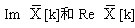 表示2/N（或1/N）带宽的振幅大小， **所以****分别应当是Im X[k]和Re X[k]的2/N（或1/N）**。

频谱密度就象物理中物质密度，原始信号中的每一个点就象是一个混合物，这个混合物是由不同密度的物质组成的，混合物中含有的每种物质的质量是一样的，除了最大和最小两个密度的物质外，这样我们只要把每种物质的密度加起来就可以得到该混合物的密度了，又该混合物的质量是单位质量，所以得到的密度值跟该混合物的质量值是一样的。
 
至于为什么虚数部分是负数，这是为了跟复数DFT保持一致，这个我们将在后面会知道这是数学计算上的需要（Im X[k]在计算时就已经加上了一个负号（*稍后，由下文，便可知*），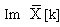再加上负号，结果便是正的，等于没有变化）。
 
如果已经得到了DFT结果，这时要进行**逆转换，即合成原始信号**，则可按如下步骤进行转换：

1. 先根据上面四个式子计算得出的值；
2. 再根据DFT合成等式得到原始信号数据。

	下面是用BASIC语言来实现的转换源代码：
	
  ```
  ‘DFT逆转换方法
  ‘/XX[]数组存储计算结果（时域中的原始信号）
  ‘/REX[]数组存储频域中的实数分量，IMX[]为虚分量
  ‘
  DIM XX[511]
  DIM REX[256]
  DIM IMX[256]
  ‘
  PI = 3.14159265
  N% = 512
  ‘
  GOSUB XXXX ‘转到子函数去获取REX[]和IMX[]数据
  ‘
  ‘
  ‘
  FOR K% = 0 TO 256
    REX[K%] = REX[K%] / (N%/2)
    IMX[K%] = -IMX[K%] / (N%/2)
  NEXT k%
  ‘
  REX[0] = REX[0] / N
  REX[256] = REX[256] / N
  ‘
  ‘ 初始化XX[]数组
  FOR I% = 0 TO 511
    XX[I%] = 0
  NEXT I%
  ‘
  ‘
  ‘
  ‘
  ‘
  FOR K% =0 TO 256
    FOR I%=0 TO 511
  ‘
       XX[I%] = XX[I%] + REX[K%] * COS(2 * PI * K% * I% / N%) 
       XX[I%] = XX[I%] + IMX[K%] * SIN(2 * PI * K% * I% / N%)
  ‘
    NEXT I%
  NEXT K%
  ‘
  END
	```
	
  上面代码中420至490换成如下形式也许更好理解，但结果都是一样的：
  
  ```
  FOR I% =0 TO 511
    FOR K%=0 TO 256
  ‘
       XX[I%] = XX[I%] + REX[K%] * COS(2 * PI * K% * I% / N%) 
       XX[I%] = XX[I%] + IMX[K%] * SIN(2 * PI * K% * I% / N%)
  ‘
    NEXT I%
  NEXT K%
  ```
 
#### 四、   分解运算方法（DFT）
 
有三种完全不同的方法进行DFT：*一种方法是通过联立方程进行求解*, 从代数的角度看，要从N个已知值求N个未知值，需要N个联立方程，且N个联立方程必须是线性独立的，但这是这种方法计算量非常的大且极其复杂，所以很少被采用；*第二种方法是利用信号的相关性（correlation）*进行计算，这个是我们后面将要介绍的方法；*第三种方法是快速傅立叶变换（FFT）*，这是一个非常具有创造性和革命性的的方法，因为它大大提高了运算速度，使得傅立叶变换能够在计算机中被广泛应用，但这种算法是根据复数形式的傅立叶变换来实现的，它把N个点的信号分解成长度为N的频域，这个跟我们现在所进行的实域DFT变换不一样，而且这种方法也较难理解，这里我们先不去理解，等先理解了复数DFT后，再来看一下FFT。有一点很重要，那就是这三种方法所得的变换结果是一样的，经过实践证明，当频域长度为32时，利用相关性方法进行计算效率最好，否则FFT算法效率较高。现在就让我们来看一下相关性算法。
 
利用**第一种方法、信号的相关性**(correlation)可以从噪声背景中检测出已知的信号，我们也可以利用这个方法检测信号波中是否含有某个频率的信号波：把一个待检测信号波乘以另一个信号波，得到一个新的信号波，再把这个新的信号波所有的点进行相加，从相加的结果就可以判断出这两个信号的相似程度。如下图：

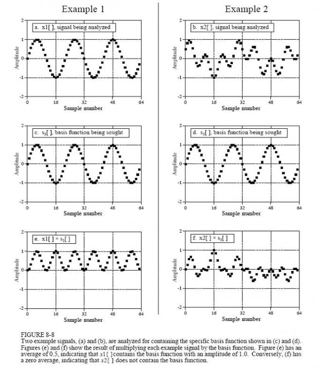

上面a和 b两个图是待检测信号波，图a很明显可以看出是个3个周期的正弦信号波，图b的信号波则看不出是否含有正弦或余弦信号，图c和d都是个3个周期的正弦信号波，图e和f分别是a、b两图跟c、d两图相乘后的结果，图e所有点的平均值是0.5，说明信号a含有振幅为1的正弦信号c，但图f所有点的平均值是0，则说明信号b不含有信号d。这个就是通过信号相关性来检测是否含有某个信号的方法。
 
**第二种方法：** 相应地，我也可以通过把输入信号和每一种频率的正余弦信号进行相乘（**关联操作**），从而得到原始信号与每种频率的关联程度（即总和大小），这个结果便是我们所要的傅立叶变换结果，下面两个等式便是我们所要的计算方法：

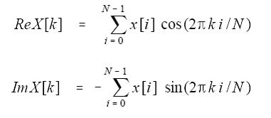

第二个式子中加了个负号，是为了保持复数形式的一致，*前面我们知道在计算**时又加了个负号*，所以这只是个形式的问题，并没有实际意义，你也可以把负号去掉，并在计算时也不加负号。

这里有一点必须明白一个正交的概念：两个函数相乘，如果结果中的每个点的总和为0，则可认为这两个函数为正交函数。要确保关联性算法是正确的，则必须使得跟原始信号相乘的信号的函数形式是正交的，我们知道所有的正弦或余弦函数是正交的，这一点我们可以通过简单的高数知识就可以证明它，所以我们可以通过关联的方法把原始信号分离出正余弦信号。当然，其它的正交函数也是存在的，如：方波、三角波等形式的脉冲信号，所以原始信号也可被分解成这些信号，但这只是说可以这样做，却是没有用的。

下面是实域傅立叶变换的BASIC语言代码：

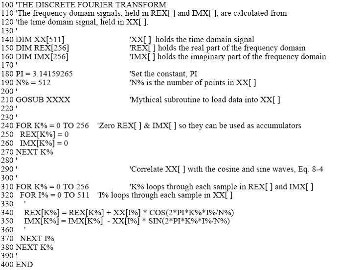

到此为止，我们对傅立叶变换便有了感性的认识了吧。但要记住，这只是在实域上的离散傅立叶变换，其中虽然也用到了复数的形式，但那只是个替代的形式，并无实际意义，现实中一般使用的是复数形式的离散傅立叶变换，且**快速傅立叶变换**是根据复数离散傅立叶变换来设计算法的，在后面我们先来复习一下有关复数的内容，然后再在理解实域离散傅立叶变换的基础上来理解复数形式的离散傅立叶变换。

  
