## 从头到尾彻底理解傅里叶变换算法、下

推荐阅读：*The Scientist and Engineer's Guide to Digital Signal Processing*，By Steven W. Smith, Ph.D。**此书地址**：<http://www.dspguide.com/pdfbook.htm>。

前期回顾，在上一篇里，我们讲了傅立叶变换的由来、和实数形式离散傅立叶变换（Real DFT）俩个问题，

本文接上文，着重讲下复数、和复数形式离散傅立叶变换等俩个问题。

 

### 第三章、复数

复数扩展了我们一般所能理解的数的概念，复数包含了实数和虚数两部分，利用复数的形式可以把由两个变量表示的表达式变成由一个变量（复变量）来表达，使得处理起来更加自然和方便。

我们知道傅立叶变换的结果是由两部分组成的，使用复数形式可以缩短变换表达式，使得我们可以单独处理一个变量（这个在后面的描述中我们就可以更加确切地知道），而且快速傅立叶变换正是基于复数形式的，所以几乎所有描述的傅立叶变换形式都是复数的形式。

但是复数的概念超过了我们日常生活中所能理解的概念，要理解复数是较难的，所以我们在理解复数傅立叶变换之前，先来专门复习一下有关复数的知识，这对后面的理解非常重要。
 
#### 一、 复数的提出
 
在此，先让我们看一个物理实验：把一个球从某点向上抛出，然后根据初速度和时间来计算球所在高度，这个方法可以根据下面的式子计算得出：

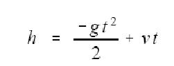

其中h表示高度，g表示重力加速度(9.8m/s2)，v表示初速度，t表示时间。现在反过来，假如知道了高度，要求计算到这个高度所需要的时间，这时我们又可以通过下式来计算：

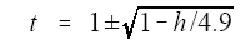

（*多谢JERRY_PRI提出*：

1. 根据公式h=-(gt2/2)+Vt（gt后面的2表示t的平方），我们可以讨论最终情况，也就是说小球运动到最高点时，v=gt，所以，可以得到t=sqt(2h/g)，
且在您给的公式中，根号下为1-(2h)/g，化成分数形式为(g-2h)/g，g和h不能直接做加减运算。
2. g是重力加速度，单位是m/s2，h的单位是m，他们两个相减的话在物理上没有意义，而且使用您给的那个公式反向回去的话推出的是h=-(gt2/2)+gt啊（gt后面的2表示t的平方）。
3. 直接推到可以得出t=v/g±sqt((v2-2hg)/g2)（v和g后面的2都表示平方），那么也就是说当v2<2hg时会产生复数，但是如果从实际的v2是不可能小于2hg的，所以我感觉复数不能从实际出发去推到，只能从抽象的角度说明一下。

）

经过计算我们可以知道，当高度是3米时，有两个时间点到达该高度：球向上运动时的时间是0.38秒，球向下运动时的时间是1.62秒。但是如果高度等于10时，结果又是什么呢？根据上面的式子可以发现存在对负数进行开平方运算，我们知道这肯定是不现实的。

第一次使用这个不一般的式子的人是意大利数学家Girolamo Cardano（1501-1576），两个世纪后，德国伟大数学家Carl Friedrich Gause（1777-1855）提出了复数的概念，为后来的应用铺平了道路，他对复数进行这样表示：复数由实数（real）和虚数(imaginary)两部分组成，虚数中的根号负1用i来表示（在这里我们用j来表示，因为i在电力学中表示电流的意思）。
 
我们可以把横坐标表示成实数，纵坐标表示成虚数，则坐标中的每个点的向量就可以用复数来表示，如下图：

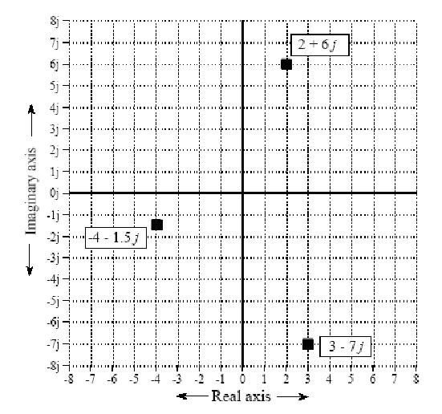

上图中的ABC三个向量可以表示成如下的式子：
 
	A = 2 + 6j
	B = -4 – 1.5j
	C = 3 – 7j

这样子来表达方便之处在于运用一个符号就能把两个原来难以联系起来的数组合起来了，不方便的是我们要分辨哪个是实数和哪个是虚数，我们一般是用Re( )和Im( )来表示实数和虚数两部分，如：

	Re A = 2      Im A = 6
	Re B = -4     Im B = -1.5
	Re C = 3      Im C = -7 
 
复数之间也可以进行加减乘除运算：

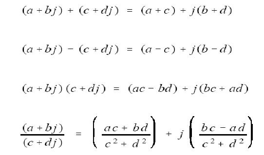

这里有个特殊的地方是j2等于-1，上面第四个式子的计算方法是把分子和分母同时乘以c – dj，这样就可消去分母中的j了。
 
复数也符合代数运算中的交换律、结合律、分配律：

	A B = B A
	(A + B) + C = A + (B + C)
	A(B + C) = AB + AC
 
 
#### 二、 复数的极坐标表示形式
 
前面提到的是运用直角坐标来表示复数，其实更为普遍应用的是极坐标的表示方法，如下图：

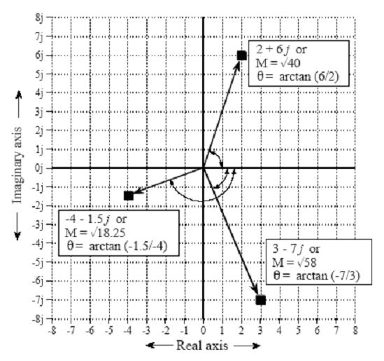

上图中的M即是数量积(magnitude)，表示从原点到坐标点的距离，θ是相位角(phase angle)，表示从X轴正方向到某个向量的夹角，下面四个式子是计算方法：

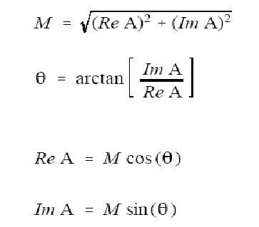

我们还可以通过下面的式子进行极坐标到直角坐标的转换：
 
	a + jb = M (cosθ + j sinθ)

上面这个等式中左边是直角坐标表达式，右边是极坐标表达式。
 
还有一个更为重要的等式——欧拉等式（欧拉，瑞士的著名数学家，Leonhard Euler，1707-1783）：
	
	ejx = cos x + j sin x 
 
这个等式可以从下面的级数变换中得到证明：

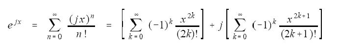

上面中右边的两个式子分别是cos(x)和sin(x)的泰勒(Taylor)级数。
 

这样子我们又可以把复数的表达式表示成指数的形式了：
 
	a + jb = M ejθ （这便是复数的两个表达式）
 
指数形式是数字信号处理中数学方法的支柱，也许是因为用指数形式进行复数的乘除运算极为简单的缘故吧：

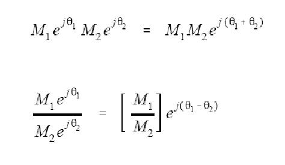

#### 三、复数是数学分析中的一个工具
 
为什么要使用复数呢？其实它只是个工具而已，就如钉子和锤子的关系，复数就象那锤子，作为一种使用的工具。我们把要解决的问题表达成复数的形式（因为有些问题用复数的形式进行运算更加方便），然后对复数进行运算，最后再转换回来得到我们所需要的结果。
 
有两种方法使用复数，一种是用复数进行简单的替换，如前面所说的向量表达式方法和前一节中我们所讨论的实域DFT，另一种是更高级的方法：数学等价(mathematical equivalence)，复数形式的傅立叶变换用的便是数学等价的方法，但在这里我们先不讨论这种方法，这里我们先来看一下用复数进行替换中的问题。

用复数进行替换的基本思想是：把所要分析的物理问题转换成复数的形式，其中只是简单地添加一个复数的符号j，当返回到原来的物理问题时，则只是把符号j去掉就可以了。

有一点要明白的是并不是所有问题都可以用复数来表示，必须看用复数进行分析是否适用，有个例子可以看出用复数来替换原来问题的表达方式明显是谬误的：假设一箱的苹果是5美元，一箱的桔子是10美元，于是我们把它表示成 5 + 10j，有一个星期你买了6箱苹果和2箱桔子，我们又把它表示成6 + 2j，最后计算总共花的钱是(5 + 10j)(6 + 2j) = 10 + 70j，结果是买苹果花了10美元的，买桔子花了70美元，这样的结果明显是错了，所以复数的形式不适合运用于对这种问题的解决。
 
#### 四、用复数来表示正余弦函数表达式
 
对于象M cos (ωt + φ)和A cos(ωt ) + B sin(ωt )表达式，用复数来表示，可以变得非常简洁，对于直角坐标形式可以按如下形式进行转换：

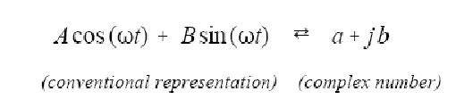

上式中余弦幅值A经变换生成a，正弦幅值B的相反数经变换生成b：A <=> a，B<=> -b，但要注意的是，这不是个等式，只是个替换形式而已。
 
对于极坐标形式可以按如下形式进行转换：

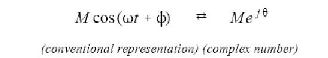

上式中，M <=> M，θ<=>φ。
   
这里虚数部分采用负数的形式主要是为了跟复数傅立叶变换表达式保持一致，对于这种替换的方法来表示正余弦，符号的变换没有什么好处，但替换时总会被改变掉符号以跟更高级的等价变换保持形式上的一致。
 
在离散信号处理中，运用复数形式来表示正余弦波是个常用的技术，这是因为利用复数进行各种运算得到的结果跟原来的正余弦运算结果是一致的，但是，我们要小心使用复数操作，如加、减、乘、除，有些操作是不能用的，如两个正弦信号相加，采用复数形式进行相加，得到的结果跟替换前的直接相加的结果是一样的，但是如果两个正弦信号相乘，则采用复数形式来相乘结果是不一样的。幸运的是，我们已严格定义了正余弦复数形式的运算操作条件：

1. 参加运算的所有正余弦的频率必须是一样的；
2. 运算操作必须是线性的，如两个正弦信号可以进行相加减，但不能进行乘除，象信号的放大、衰减、高低通滤波等系统都是线性的，象平方、缩短、取限等则不是线性的。要记住的是卷积和傅立叶分析也只有线性操作才可以进行。
   
下图是一个相量变换(我们把正弦或余弦波变成复数的形式称为相量变换，Phasor transform)的例子，一个连续信号波经过一个线性处理系统生成另一个信号波，从计算过程我们可以看出采用复数的形式使得计算变化十分的简洁：

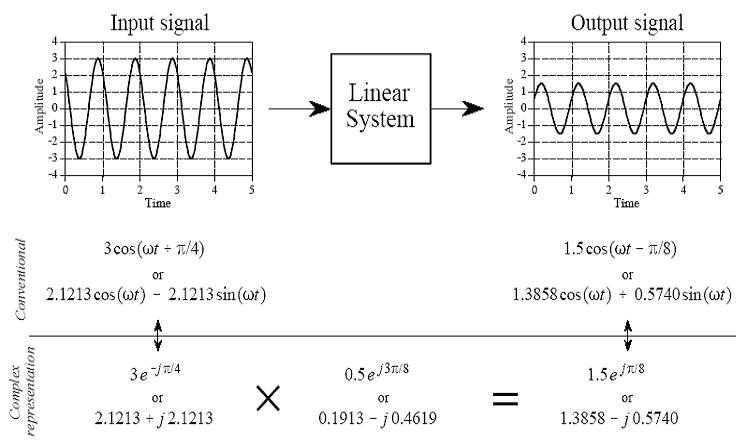

在第二章中我们描述的实数形式傅立叶变换也是一种替换形式的复数变换，但要注意的是那还不是复数傅立叶变换，只是一种代替方式而已。下一章、即，第四章，我们就会知道复数傅立叶变换是一种更高级的变换，而不是这种简单的替换形式。 

 

### 第四章、复数形式离散傅立叶变换

复数形式的离散傅立叶变换非常巧妙地运用了复数的方法，使得傅立叶变换变换更加自然和简洁，它并不是只是简单地运用替换的方法来运用复数，而是完全从复数的角度来分析问题，这一点跟实数DFT是完全不一样的。
 
#### 一、  把正余弦函数表示成复数的形式

通过欧拉等式可以把正余弦函数表示成复数的形式：
 
	cos( x ) = 1/2 e j(-x) + 1/2 ejx 
	sin( x ) = j (1/2 e j(-x) - 1/2 ejx)

从这个等式可以看出，如果把正余弦函数表示成复数后，它们变成了由正负频率组成的正余弦波，相反地，一个由正负频率组成的正余弦波，可以通过复数的形式来表示。

我们知道，在实数傅立叶变换中，它的频谱是0 ~ π(0 ~ N/2),但无法表示-π~ 0的频谱，可以预见，如果把正余弦表示成复数形式，则能够把负频率包含进来。
 
#### 二、  把变换前后的变量都看成复数的形式
 
复数形式傅立叶变换把原始信号x[n]当成是一个用复数来表示的信号，其中实数部分表示原始信号值，虚数部分为0，变换结果X[k]也是个复数的形式，但这里的虚数部分是有值的。
    
在这里要用复数的观点来看原始信号，是理解复数形式傅立叶变换的关键（如果有学过复变函数则可能更好理解，即把x[n]看成是一个复数变量，然后象对待实数那样对这个复数变量进行相同的变换）。
 
#### 三、  对复数进行相关性算法（正向傅立叶变换）
 
从实数傅立叶变换中可以知道，我们可以通过原始信号乘以一个正交函数形式的信号，然后进行求总和，最后就能得到这个原始信号所包含的正交函数信号的分量。

现在我们的原始信号变成了复数，我们要得到的当然是复数的信号分量，我们是不是可以把它乘以一个复数形式的正交函数呢？答案是肯定的，正余弦函数都是正交函数，变成如下形式的复数后，仍旧还是正交函数（这个从正交函数的定义可以很容易得到证明）：

	cos x + j sin x, cos x – j sin x，……
 
这里我们采用上面的第二个式子进行相关性求和，为什么用第二个式子呢?，我们在后面会知道，正弦函数在虚数中变换后得到的是负的正弦函数，这里我们再加上一个负号，使得最后的得到的是正的正弦波，根据这个于是我们很容易就可以得到了复数形式的**DFT正向变换等式**：

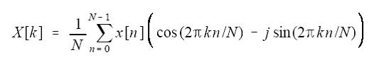

这个式子很容易可以得到欧拉变换式子：

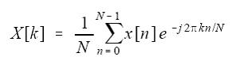

其实我们是为了表达上的方便才用到欧拉变换式，在解决问题时我们还是较多地用到正余弦表达式。
 
对于上面的等式，我们要清楚如下几个方面（也是区别于实数DFT的地方）：

1. X[k]、x[n]都是复数，但x[n]的虚数部分都是由0组成的，实数部分表示原始信号；
2. k的取值范围是0 ~ N-1 (也可以表达成0 ~ 2π)，其中0 ~ N/2（或0 ~ π）是正频部分，N/2 ~ N-1（π~ 2π）是负频部分，由于正余弦函数的对称性，所以我们把 –π~ 0表示成π~ 2π，这是出于计算上方便的考虑。
3. 其中的j是一个不可分离的组成部分，就象一个等式中的变量一样，不能随便去掉，去掉之后意义就完全不一样了，但我们知道在实数DFT中，j只是个符号而已，把j去掉，整个等式的意义不变；
4. 下图是个连续信号的频谱，但离散频谱也是与此类似的，所以不影响我们对问题的分析：

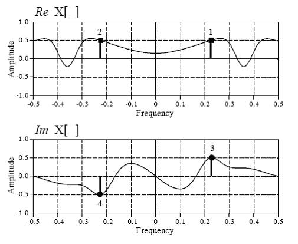

上面的频谱图把负频率放到了左边，是为了迎合我们的思维习惯，但在实际实

现中我们一般是把它移到正的频谱后面的。

从上图可以看出，时域中的正余弦波（用来组成原始信号的正余弦波）在复数DFT的频谱中被分成了正、负频率的两个组成部分，基于此等式中前面的比例系数是1/N（或1/2π），而不是2/N，这是因为现在把频谱延伸到了2π,但把正负两个频率相加即又得到了2/N,又还原到了实数DFT的形式，这个在后面的描述中可以更清楚地看到。
     
由于复数DFT生成的是一个完整的频谱，原始信号中的每一个点都是由正、负两个频率组合而成的，所以频谱中每一个点的带宽是一样的，都是1/N，相对实数DFT，两端带宽比其它点的带宽少了一半；复数DFT的频谱特征具有周期性：-N/2 ~ 0与N/2 ~ N-1是一样的，实域频谱呈偶对称性（表示余弦波频谱），虚域频谱呈奇对称性（表示正弦波频谱）。
 

#### 四、  逆向傅立叶变换
 
假设我们已经得到了复数形式的频谱X[k]，现在要把它还原到复数形式的原始信号x[n]，当然应该是把X[k]乘以一个复数，然后再进行求和，最后得到原始信号x[n]，这个跟X[k]相乘的复数首先让我们想到的应该是上面进行相关性计算的复数：

	cos(2πkn/N) – j si(2πkn/N)，
 
但其中的负号其实是为了使得进行逆向傅立叶变换时把正弦函数变为正的符号，因为虚数j的运算特殊性，使得原来应该是正的正弦函数变为了负的正弦函数（我们从后面的推导会看到这一点），所以这里的负号只是为了纠正符号的作用，在进行逆向DFT时，我们可以把负号去掉，于是我们便得到了这样的**逆向DFT变换等式**：

	x[n] = X[k] (cos(2πkn/N) + j sin(2πkn/N))

我们现在来分析这个式子，会发现这个式其实跟实数傅立叶变换是可以得到一样结果的。我们先把X[k]变换一下：

	X[k] = Re X[k] + j Im X[k]

这样我们就可以对x[n]再次进行变换，如：

	x[n] = (Re X[k] + j Im X[k]) (cos(2πkn/N) + j sin(2πkn/N))

		= ( Re X[k] cos(2πkn/N) + j Im X[k] cos(2πkn/N) +j Re X[k] sin(2πkn/N) -  Im X[k] sin(2πkn/N) )

		= ( Re X[k] （cos(2πkn/N) + j sin(2πkn/N)） +  	---------------------(1)

		Im X[k] （ - sin(2πkn/N) + j cos(2πkn/N))）		---------------------(2)

 这时我们就把原来的等式分成了两个部分，第一个部分是跟实域中的频谱相乘，第二个部分是跟虚域中的频谱相乘，根据频谱图我们可以知道，Re X[k]是个偶对称的变量，Im X[k]是个奇对称的变量，即

	Re X[k] = Re X[- k]
	Im X[k] = - Im X[-k]

但k的范围是0 ~ N-1，0~N/2表示正频率，N/2~N-1表示负频率，为了表达方便我们把N/2~N-1用-k来表示，这样在从0到N-1的求和过程中对于(1)和(2)式分别有N/2对的k和-k的和，对于（1）式有：

	Re X[k] (cos(2πkn/N) + j sin(2πkn/N)) + Re X[- k] (cos( - 2πkn/N) + j sin( -2πkn/N))

根据偶对称性和三角函数的性质，把上式化简得到：
 
	Re X[k] (cos(2πkn/N) + j sin(2πkn/N)) + Re X[ k] (cos( 2πkn/N) - j sin( 2πkn/N))

这个式子最后的结果是：

	2 Re X[ k] cos(2πkn/N)。
      
再考虑到求Re X[ k]等式中有个比例系数1/N，把1/N乘以2，这样的结果不就是跟实数DFT中的式子一样了吗？
 
对于(2)式，用同样的方法，我们也可以得到这样的结果：

	-2 Im X[k] sin(2πkn/N)

注意上式前面多了个负符号，这是由于虚数变换的特殊性造成的，当然我们肯定不能把负符号的正弦函数跟余弦来相加，还好，我们前面是用cos(2πkn/N) – j sin(2πkn/N)进行相关性计算，得到的Im X[k]中有个负的符号，这样最后的结果中正弦函数就没有负的符号了，这就是为什么在进行相关性计算时虚数部分要用到负符号的原因（我觉得这也许是复数形式DFT美中不足的地方，让人有一种拼凑的感觉）。
 
从上面的分析中可以看出，实数傅立叶变换跟复数傅立叶变换，在进行逆变换时得到的结果是一样的，只不过是殊途同归吧。
