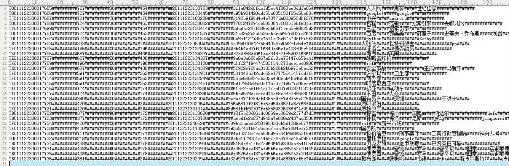
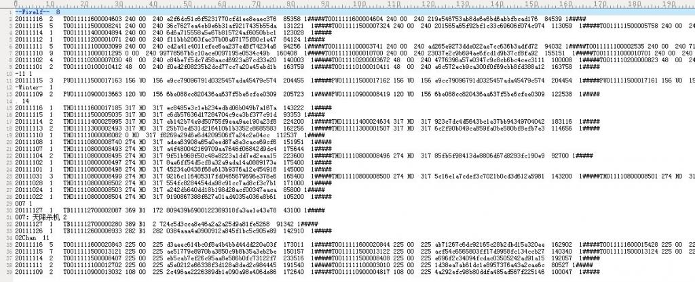
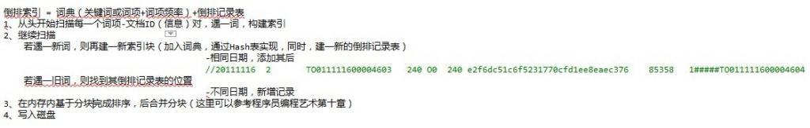
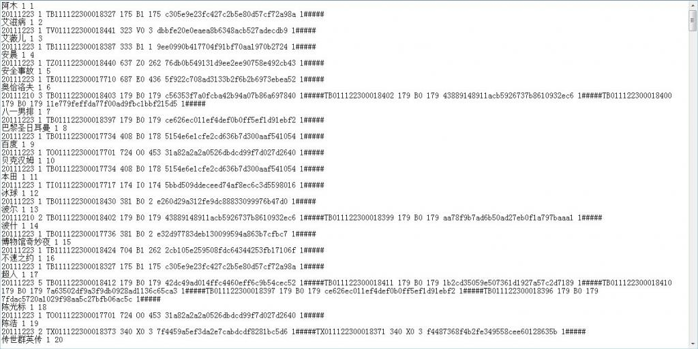
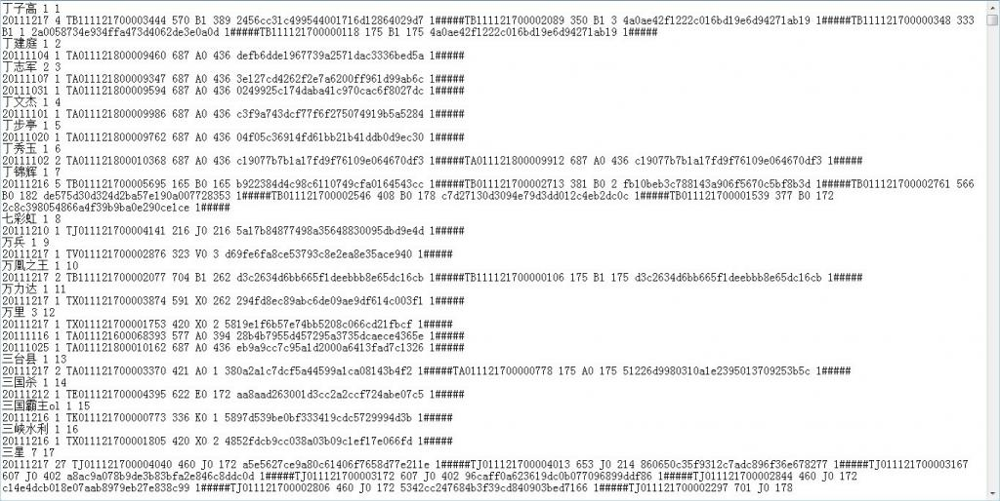

# 基于给定的文档生成倒排索引的编码与实践

作者：July、yansha。

出处：结构之法算法之道

## 引言

本周实现倒排索引。实现过程中，寻找资料，结果发现找份资料诸多不易：1、网上搜倒排索引实现，结果千篇一律，例子都是那几个同样的单词；2、到谷歌学术上想找点稍微有价值水平的资料，结果下篇论文还收费或者要求注册之类；3、大部分技术书籍只有理论，没有实践。于是，朋友戏言：网上一般有价值的东西不多。希望，本blog的出现能改变此现状。

在第二十四章、倒排索引关键词不重复Hash编码中，我们针对一个给定的倒排索引文件，提取出其中的关键词，然后针对这些关键词进行Hash不重复编码。本章，咱们再倒退一步，即给定一个正排文档（暂略过文本解析，分词等步骤，日后会慢慢考虑这些且一并予以实现），要求生成对应的倒排索引文件。同时，本章还是基于Hash索引之上（运用暴雪的Hash函数可以比较完美的解决大数据量下的冲突问题），日后自会实现B+树索引。

与此同时，本编程艺术系列逐步从为面试服务而转到实战性的编程当中了，教初学者如何编程，如何运用高效的算法解决实际应用中的编程问题，将逐步成为本编程艺术系列的主旨之一。

OK，接下来，咱们针对给定的正排文档一步一步来生成倒排索引文件，有任何问题，欢迎随时不吝赐教或批评指正。谢谢。

## 第一节、索引的构建方法

* 根据信息检索导论（Christtopher D.Manning等著，王斌译）一书给的提示，我们可以选择两种构建索引的算法：BSBI算法，与SPIMI算法。

BSBI算法，基于磁盘的外部排序算法，此算法首先将词项映射成其ID的数据结构，如Hash映射。而后将文档解析成词项ID-文档ID对，并在内存中一直处理，直到累积至放满一个固定大小的块空间为止，我们选择合适的块大小，使之能方便加载到内存中并允许在内存中快速排序，快速排序后的块转换成倒排索引格式后写入磁盘。

建立倒排索引的步骤如下：

* 将文档分割成几个大小相等的部分；
* 对词项ID-文档ID进行排序；
* 将具有同一词项ID的所有文档ID放到倒排记录表中，其中每条倒排记录仅仅是一个文档ID；
* 将基于块的倒排索引写到磁盘上。

此算法假如说最后可能会产生10个块。其伪码如下：

    BSBI NDEXConSTRUCTION()
    n <- 0
    while(all documents have not been processed)
        do n<-n+1
            block <- PARSENEXTBLOCK()    //文档分析
            BSBI-INVERT(block)
            WRITEBLOCKTODISK(block,fn)
            MERGEBLOCKS(f1,...,fn;fmerged)

（基于块的排序索引算法，该算法将每个块的倒排索引文件存入文件f1,...,fn中，最后合并成fmerged
如果该算法应用最后一步产生了10个块，那么接下来便会将10个块索引同时合并成一个索引文件。）

合并时，同时打开所有块对应的文件，内存中维护了为10个块准备的读缓冲区和一个为最终合并索引准备的写缓冲区。每次迭代中，利用优先级队列（如堆结构或类似的数据结构）选择最小的未处理的词项ID进行处理。如下图所示（图片引自深入搜索引擎--海里信息的压缩、索引和查询，梁斌译），分块索引，分块排序，最终全部合并（说实话，跟MapReduce还是有些类似的）：


读入该词项的倒排记录表并合并，合并结果写回磁盘中。需要时，再次从文件中读入数据到每个读缓冲区。

BSBI算法主要的时间消耗在排序上，选择什么排序方法呢，简单的快速排序足矣，其时间复杂度为O（N*logN），其中N是所需要排序的项（词项ID-文档ID对）的数目的上界。

SPIMI算法，内存式单遍扫描索引算法

与上述BSBI算法不同的是：SPIMI使用词项而不是其ID，它将每个块的词典写入磁盘，对于写一块则重新采用新的词典，只要硬盘空间足够大，它能索引任何大小的文档集。

倒排索引 = 词典（关键词或词项+词项频率）+倒排记录表。建倒排索引的步骤如下：

* 从头开始扫描每一个词项-文档ID（信息）对，遇一词，构建索引；
* 继续扫描，若遇一新词，则再建一新索引块（加入词典，通过Hash表实现，同时，建一新的倒排记录表）；若遇一旧词，则找到其倒排记录表的位置，添加其后
* 在内存内基于分块完成排序，后合并分块；
* 写入磁盘。

其伪码如下：

    SPIMI-Invert(Token_stream)
    output.file=NEWFILE()
    dictionary = NEWHASH()
    while (free memory available)
        do token <-next(token_stream) //逐一处理每个词项-文档ID对
            if term(token) !(- dictionary
               /*如果词项是第一次出现，那么加入hash词典，同时，建立一个新的倒排索引表*/
               then postings_list = AddToDictionary(dictionary,term(token))
            /*如果不是第一次出现，那么直接返回其倒排记录表，在下面添加其后*/
            else postings_list = GetPostingList(dictionary,term(token))
        if full(postings_list)
            then postings_list =DoublePostingList(dictionary,term(token))
        /*SPIMI与BSBI的区别就在于此，前者直接在倒排记录表中增加此项新纪录*/
        AddToPosTingsList (postings_list,docID(token))
    sorted_terms <- SortTerms(dictionary)
    WriteBlockToDisk(sorted_terms,dictionary,output_file)
    return output_file

**SPIMI与BSBI的主要区别：**

SPIMI当发现关键词是第一次出现时，会直接在倒排记录表中增加一项（与BSBI算法不同）。同时，与BSBI算法一开始就整理出所有的词项ID-文档ID，并对它们进行排序的做法不同（而这恰恰是BSBI的做法），这里的每个倒排记录表都是动态增长的（也就是说，倒排记录表的大小会不断调整），同时，扫描一遍就可以实现全体倒排记录表的收集。

**SPIMI这样做有两点好处:**

由于不需要排序操作，因此处理的速度更快，
由于保留了倒排记录表对词项的归属关系，因此能节省内存，词项的ID也不需要保存。这样，每次单独的SPIMI-Invert调用能够处理的块大小可以非常大，整个倒排索引的构建过程也可以非常高效。

但不得不提的是，由于事先并不知道每个词项的倒排记录表大小，算法一开始只能分配一个较小的倒排记录表空间，每次当该空间放满的时候，就会申请加倍的空间，

与此同时，自然而然便会浪费一部分空间（当然，此前因为不保存词项ID，倒也省下一点空间，总体而言，算作是抵销了）。

不过，至少SPIMI所用的空间会比BSBI所用空间少。当内存耗尽后，包括词典和倒排记录表的块索引将被写到磁盘上，但在此之前，为使倒排记录表按照词典顺序来加快最后的合并操作，所以要对词项进行排序操作。

小数据量与大数据量的区别

* 在小数据量时，有足够的内存保证该创建过程可以一次完成；
* 数据规模增大后，可以采用分组索引，然后再归并索 引的策略。该策略是，

建立索引的模块根据当时运行系统所在的计算机的内存大小，将索引分为 k 组，使得每组运算所需内存都小于系统能够提供的最大使用内存的大小。
按照倒排索引的生成算法，生成 k 组倒排索引。
然后将这 k 组索引归并，即将相同索引词对应的数据合并到一起，就得到了以索引词为主键的最终的倒排文件索引，即反向索引。

为了测试的方便，本文针对小数据量进行从正排文档到倒排索引文件的实现。而且针对大数量的K路归并算法或基于磁盘的外部排序算法本编程艺术系列第十章中已有详细阐述。

## 第二节、Hash表的构建与实现

如下，给定如下图所示的正排文档，每一行的信息分别为（中间用##########隔开）：文档ID、订阅源（子频道）、 频道分类、 网站类ID（大频道）、时间、 md5、文档权值、关键词、作者等等。


要求基于给定的上述正排文档。生成如第二十四章所示的倒排索引文件（注，关键词所在的文章如果是同一个日期的话，是挨在同一行的，用“#”符号隔开）：


我们知道：为网页建立全文索引是网页预处理的核心部分，包括分析网页和建立倒排文件。二者是顺序进行，先分析网页，后建立倒排文件（也称为反向索引），如图所示：


正如上图粗略所示，我们知道倒排索引创建的过程如下：

* 写爬虫抓取相关的网页，而后提取相关网页或文章中所有的关键词；
* 分词，找出所有单词；
* 过滤不相干的信息（如广告等信息）；
* 构建倒排索引，关键词=>（文章ID 出现次数 出现的位置）生成词典文件 频率文件 位置文件；
* 压缩。

因为已经给定了正排文档，接下来，咱们跳过一系列文本解析，分词等中间步骤，直接根据正排文档生成倒排索引文档（幸亏有yansha相助，不然，寸步难行，其微博地址为：[http://weibo.com/yanshazi](http://weibo.com/yanshazi)，欢迎关注他）。

OK，闲不多说，咱们来一步一步实现吧。

建相关的数据结构

根据给定的正排文档，我们可以建立如下的两个结构体表示这些信息：文档ID、订阅源（子频道）、 频道分类、 网站类ID（大频道）、时间、 md5、文档权值、关键词、作者等等。如下所示：
```cpp
typedef struct key_node
{
    char *pkey;     // 关键词实体
    int count;      // 关键词出现次数
    int pos;        // 关键词在hash表中位置
    struct doc_node *next;  // 指向文档结点
}KEYNODE, *key_list;

key_list key_array[TABLE_SIZE];

typedef struct doc_node
{
    char id[WORD_MAX_LEN];  //文档ID
    int classOne;           //订阅源（子频道）
    char classTwo[WORD_MAX_LEN];    //频道分类
    int classThree;                 //网站类ID（大频道）
    char time[WORD_MAX_LEN];        //时间
    char md5[WORD_MAX_LEN];         //md5
    int weight;                     //文档权值
    struct doc_node *next;
}DOCNODE, *doc_list;
```

我们知道，通过第二十四章的暴雪的Hash表算法，可以比较好的避免相关冲突的问题。下面，我们再次引用其代码：
基于暴雪的Hash之上的改造算法
```cpp
//函数prepareCryptTable以下的函数生成一个长度为0x100的cryptTable[0x100]
void PrepareCryptTable()
{
    unsigned long seed = 0x00100001, index1 = 0, index2 = 0, i;

    for( index1 = 0; index1 <0x100; index1++ )
    {
        for( index2 = index1, i = 0; i < 5; i++, index2 += 0x100)
        {
            unsigned long temp1, temp2;
            seed = (seed * 125 + 3) % 0x2AAAAB;
            temp1 = (seed & 0xFFFF)<<0x10;
            seed = (seed * 125 + 3) % 0x2AAAAB;
            temp2 = (seed & 0xFFFF);
            cryptTable[index2] = ( temp1 | temp2 );
        }
    }
}

//函数HashString以下函数计算lpszFileName 字符串的hash值，其中dwHashType 为hash的类型，
unsigned long HashString(const char *lpszkeyName, unsigned long dwHashType )
{
    unsigned char *key  = (unsigned char *)lpszkeyName;
    unsigned long seed1 = 0x7FED7FED;
    unsigned long seed2 = 0xEEEEEEEE;
    int ch;

    while( *key != 0 )
    {
        ch = *key++;
        seed1 = cryptTable[(dwHashType<<8) + ch] ^ (seed1 + seed2);
        seed2 = ch + seed1 + seed2 + (seed2<<5) + 3;
    }
    return seed1;
}

//按关键字查询，如果成功返回hash表中索引位置
key_list SearchByString(const char *string_in)
{
    const int HASH_OFFSET = 0, HASH_C = 1, HASH_D = 2;
    unsigned int nHash = HashString(string_in, HASH_OFFSET);
    unsigned int nHashC = HashString(string_in, HASH_C);
    unsigned int nHashD = HashString(string_in, HASH_D);
    unsigned int nHashStart = nHash % TABLE_SIZE;
    unsigned int nHashPos = nHashStart;

    while (HashTable[nHashPos].bExists)
    {
        if (HashATable[nHashPos] == (int) nHashC && HashBTable[nHashPos] == (int) nHashD)
        {
            break;
            //查询与插入不同，此处不需修改
        }
        else
        {
            nHashPos = (nHashPos + 1) % TABLE_SIZE;
        }

        if (nHashPos == nHashStart)
        {
            break;
        }
    }

    if( key_array[nHashPos] && strlen(key_array[nHashPos]->pkey))
    {
        return key_array[nHashPos];
    }

    return NULL;
}

//按索引查询，如果成功返回关键字（此函数在本章中没有被用到，可以忽略）
key_list SearchByIndex(unsigned int nIndex)
{
    unsigned int nHashPos = nIndex;
    if (nIndex < TABLE_SIZE)
    {
        if(key_array[nHashPos] && strlen(key_array[nHashPos]->pkey))
        {
            return key_array[nHashPos];
        }
    }

    return NULL;
}

//插入关键字，如果成功返回hash值
int InsertString(const char *str)
{
    const int HASH_OFFSET = 0, HASH_A = 1, HASH_B = 2;
    unsigned int nHash = HashString(str, HASH_OFFSET);
    unsigned int nHashA = HashString(str, HASH_A);
    unsigned int nHashB = HashString(str, HASH_B);
    unsigned int nHashStart = nHash % TABLE_SIZE;
    unsigned int nHashPos = nHashStart;
    int len;

    while (HashTable[nHashPos].bExists)
    {
        nHashPos = (nHashPos + 1) % TABLE_SIZE;

        if (nHashPos == nHashStart)
            break;
    }

    len = strlen(str);
    if (!HashTable[nHashPos].bExists && (len < WORD_MAX_LEN))
    {
        HashATable[nHashPos] = nHashA;
        HashBTable[nHashPos] = nHashB;

        key_array[nHashPos] = (KEYNODE *) malloc (sizeof(KEYNODE) * 1);
        if(key_array[nHashPos] == NULL)
        {
            printf("10000 EMS ERROR !!!!\n");
            return 0;
        }

        key_array[nHashPos]->pkey = (char *)malloc(len+1);
        if(key_array[nHashPos]->pkey == NULL)
        {
            printf("10000 EMS ERROR !!!!\n");
            return 0;
        }

        memset(key_array[nHashPos]->pkey, 0, len+1);
        strncpy(key_array[nHashPos]->pkey, str, len);
        *((key_array[nHashPos]->pkey)+len) = 0;
        key_array[nHashPos]->pos = nHashPos;
        key_array[nHashPos]->count = 1;
        key_array[nHashPos]->next = NULL;
        HashTable[nHashPos].bExists = 1;
        return nHashPos;
    }

    if(HashTable[nHashPos].bExists)
        printf("30000 in the hash table %s !!!\n", str);
    else
        printf("90000 strkey error !!!\n");
    return -1;
}
```
有了这个Hash表，接下来，我们就可以把词插入Hash表进行存储了。

## 第三节、倒排索引文件的生成与实现

Hash表实现了（存于HashSearch.h中），还得编写一系列的函数，如下所示（所有代码还只是初步实现了功能，稍后在第四部分中将予以改进与优化）：
```cpp
//处理空白字符和空白行
int GetRealString(char *pbuf)
{
    int len = strlen(pbuf) - 1;
    while (len > 0 && (pbuf[len] == (char)0x0d || pbuf[len] == (char)0x0a || pbuf[len] == ' ' || pbuf[len] == '\t'))
    {
        len--;
    }

    if (len < 0)
    {
        *pbuf = '\0';
        return len;
    }
    pbuf[len+1] = '\0';
    return len + 1;
}

//重新strcoll字符串比较函数
int strcoll(const void *s1, const void *s2)
{
    char *c_s1 = (char *)s1;
    char *c_s2 = (char *)s2;
    while (*c_s1 == *c_s2++)
    {
        if (*c_s1++ == '\0')
        {
            return 0;
        }
    }

    return *c_s1 - *--c_s2;
}

//从行缓冲中得到各项信息，将其写入items数组
void GetItems(char *&move, int &count, int &wordnum)
{
    char *front = move;
    bool flag = false;
    int len;
    move = strstr(move, "#####");
    if (*(move + 5) == '#')
    {
        flag = true;
    }

    if (move)
    {
        len = move - front;
        strncpy(items[count], front, len);
    }
    items[count][len] = '\0';
    count++;

    if (flag)
    {
        move = move + 10;
    } else
    {
        move = move + 5;
    }
}

//保存关键字相应的文档内容
doc_list SaveItems()
{
    doc_list infolist = (doc_list) malloc(sizeof(DOCNODE));
    strcpy_s(infolist->id, items[0]);
    infolist->classOne = atoi(items[1]);
    strcpy_s(infolist->classTwo, items[2]);
    infolist->classThree = atoi(items[3]);
    strcpy_s(infolist->time, items[4]);
    strcpy_s(infolist->md5, items[5]);
    infolist->weight = atoi(items[6]);
    return infolist;
}

//得到目录下所有文件名
int GetFileName(char filename[][FILENAME_MAX_LEN])
{
    _finddata_t file;
    long handle;
    int filenum = 0;
    //C:\Users\zhangxu\Desktop\CreateInvertedIndex\data
    if ((handle = _findfirst("C:\\Users\\zhangxu\\Desktop\\CreateInvertedIndex\\data\\*.txt", &file)) == -1)
    {
        printf("Not Found\n");
    }
    else
    {
        do
        {
            strcpy_s(filename[filenum++], file.name);
        } while (!_findnext(handle, &file));
    }
    _findclose(handle);
    return filenum;
}

//以读方式打开文件，如果成功返回文件指针
FILE* OpenReadFile(int index, char filename[][FILENAME_MAX_LEN])
{
    char *abspath;
    char dirpath[] = {"data\\"};
    abspath = (char *)malloc(ABSPATH_MAX_LEN);
    strcpy_s(abspath, ABSPATH_MAX_LEN, dirpath);
    strcat_s(abspath, FILENAME_MAX_LEN, filename[index]);

    FILE *fp = fopen (abspath, "r");
    if (fp == NULL)
    {
        printf("open read file error!\n");
        return NULL;
    }
    else
    {
        return fp;
    }
}

//以写方式打开文件，如果成功返回文件指针
FILE* OpenWriteFile(const char *in_file_path)
{
    if (in_file_path == NULL)
    {
        printf("output file path error!\n");
        return NULL;
    }

    FILE *fp = fopen(in_file_path, "w+");
    if (fp == NULL)
    {
        printf("open write file error!\n");
    }
    return fp;
}
```

最后，主函数编写如下：

```cpp
int main()
{
    key_list keylist;
    char *pbuf, *move;
    int filenum = GetFileName(filename);
    FILE *fr;
    pbuf = (char *)malloc(BUF_MAX_LEN);
    memset(pbuf, 0, BUF_MAX_LEN);

    FILE *fw = OpenWriteFile("index.txt");
    if (fw == NULL)
    {
        return 0;
    }

    PrepareCryptTable();    //初始化Hash表

    int wordnum = 0;
    for (int i = 0; i < filenum; i++)
    {
        fr = OpenReadFile(i, filename);
        if (fr == NULL)
        {
            break;
        }

        // 每次读取一行处理
        while (fgets(pbuf, BUF_MAX_LEN, fr))
        {
            int count = 0;
            move = pbuf;
            if (GetRealString(pbuf) <= 1)
                continue;

            while (move != NULL)
            {
                // 找到第一个非'#'的字符
                while (*move == '#')
                    move++;

                if (!strcmp(move, ""))
                    break;

                GetItems(move, count, wordnum);
            }

            for (int i = 7; i < count; i++)
            {
                // 将关键字对应的文档内容加入文档结点链表中
                if (keylist = SearchByString(items[i]))     //到hash表内查询
                {
                    doc_list infolist = SaveItems();
                    infolist->next = keylist->next;
                    keylist->count++;
                    keylist->next = infolist;
                }
                else
                {
                    // 如果关键字第一次出现，则将其加入hash表
                    int pos = InsertString(items[i]);       //插入hash表
                    keylist = key_array[pos];
                    doc_list infolist = SaveItems();
                    infolist->next = NULL;
                    keylist->next = infolist;
                    if (pos != -1)
                    {
                        strcpy_s(words[wordnum++], items[i]);
                    }
                }
            }
        }
    }

    // 通过快排对关键字进行排序
    qsort(words, WORD_MAX_NUM, WORD_MAX_LEN, strcoll);

    // 遍历关键字数组，将关键字及其对应的文档内容写入文件中
    for (int i = 0; i < WORD_MAX_NUM; i++)
    {
        keylist = SearchByString(words[i]);
        if (keylist != NULL)
        {
            fprintf(fw, "%s %d\n", words[i], keylist->count);
            doc_list infolist = keylist->next;
            for (int j = 0; j < keylist->count; j++)
            {
                //文档ID，订阅源（子频道） 频道分类 网站类ID（大频道） 时间  md5，文档权值
                fprintf(fw, "%s %d %s %d %s %s %d\n", infolist->id, infolist->classOne,
                    infolist->classTwo, infolist->classThree, infolist->time, infolist->md5, infolist->weight);
                infolist = infolist->next;
            }
        }
    }

    free(pbuf);
    fclose(fr);
    fclose(fw);
    system("pause");
    return 0;
}
```

程序编译运行后，生成的倒排索引文件为index.txt，其与原来给定的正排文档对照如下：


有没有发现关键词奥恰洛夫出现在的三篇文章是同一个日期1210的，貌似与本文开头指定的倒排索引格式要求不符？因为第二部分开头中，已明确说明：“注，关键词所在的文章如果是同一个日期的话，是挨在同一行的，用“#”符号隔开”。OK，有疑问是好事，代表你思考了，请直接转至下文第4部分。

## 第四节、程序需求功能的改进

### 对相同日期与不同日期的处理

细心的读者可能还是会注意到：在第二部分开头中，要求基于给定的上述正排文档。生成如第二十四章所示的倒排索引文件是下面这样子的，即是：


也就是说，上面建索引的过程本该是如下的：


与第一部分所述的SMIPI算法有什么区别？对的，就在于对在同一个日期的出现的关键词的处理。如果是遇一旧词，则找到其倒排记录表的位置：相同日期，添加到之前同一日期的记录之后（第一个记录的后面记下同一日期的记录数目）；不同日期，另起一行新增记录。

* 相同（单个）日期，根据文档权值排序
* 不同日期，根据时间排序

代码主要修改如下：
```cpp
//function: 对链表进行冒泡排序
void ListSort(key_list keylist)
{
    doc_list p = keylist->next;
    doc_list final = NULL;
    while (true)
    {
        bool isfinish = true;
        while (p->next != final) {
            if (strcmp(p->time, p->next->time) < 0)
            {
                SwapDocNode(p);
                isfinish = false;
            }
            p = p->next;
        }
        final = p;
        p = keylist->next;
        if (isfinish || p->next == final) {
            break;
        }
    }
}

int main()
{
    key_list keylist;
    char *pbuf, *move;
    int filenum = GetFileName(filename);
    FILE *frp;
    pbuf = (char *)malloc(BUF_MAX_LEN);
    memset(pbuf, 0, BUF_MAX_LEN);

    FILE *fwp = OpenWriteFile("index.txt");
    if (fwp == NULL) {
        return 0;
    }

    PrepareCryptTable();

    int wordnum = 0;
    for (int i = 0; i < filenum; i++)
    {
        frp = OpenReadFile(i, filename);
        if (frp == NULL) {
            break;
        }

        // 每次读取一行处理
        while (fgets(pbuf, BUF_MAX_LEN, frp))
        {
            int count = 0;
            move = pbuf;
            if (GetRealString(pbuf) <= 1)
                continue;

            while (move != NULL)
            {
                // 找到第一个非'#'的字符
                while (*move == '#')
                    move++;

                if (!strcmp(move, ""))
                    break;

                GetItems(move, count, wordnum);
            }

            for (int i = 7; i < count; i++) {
                // 将关键字对应的文档内容加入文档结点链表中
                // 如果关键字第一次出现，则将其加入hash表
                if (keylist = SearchByString(items[i])) {
                    doc_list infolist = SaveItems();
                    infolist->next = keylist->next;
                    keylist->count++;
                    keylist->next = infolist;
                } else {
                    int pos = InsertString(items[i]);
                    keylist = key_array[pos];
                    doc_list infolist = SaveItems();
                    infolist->next = NULL;
                    keylist->next = infolist;
                    if (pos != -1) {
                        strcpy_s(words[wordnum++], items[i]);
                    }
                }
            }
        }
    }

    // 通过快排对关键字进行排序
    qsort(words, WORD_MAX_NUM, WORD_MAX_LEN, strcoll);

    // 遍历关键字数组，将关键字及其对应的文档内容写入文件中
    int rownum = 1;
    for (int i = 0; i < WORD_MAX_NUM; i++) {
        keylist = SearchByString(words[i]);
        if (keylist != NULL) {
            doc_list infolist = keylist->next;

            char date[9];

            // 截取年月日
            for (int j = 0; j < keylist->count; j++)
            {
                strncpy_s(date, infolist->time, 8);
                date[8] = '\0';
                strncpy_s(infolist->time, date, 9);
                infolist = infolist->next;
            }

            // 对链表根据时间进行排序
            ListSort(keylist);

            infolist = keylist->next;
            int *count = new int[WORD_MAX_NUM];
            memset(count, 0, WORD_MAX_NUM);
            strcpy_s(date, infolist->time);
            int num = 0;
            // 得到单个日期的文档数目
            for (int j = 0; j < keylist->count; j++)
            {
                if (strcmp(date, infolist->time) == 0) {
                    count[num]++;
                } else {
                    count[++num]++;
                }
                strcpy_s(date, infolist->time);
                infolist = infolist->next;
            }
            fprintf(fwp, "%s %d %d\n", words[i], num + 1, rownum);
            WriteFile(keylist, num, fwp, count);
            rownum++;
        }
    }

    free(pbuf);
//  fclose(frp);
    fclose(fwp);
    system("pause");
    return 0;
}
```

修改后编译运行，生成的index.txt文件如下：


### 为关键词添上编码

如上图所示，已经满足需求了。但可以再在每个关键词的背后添加一个计数表示索引到了第多少个关键词：


## 第五节、算法的二次改进

### 省去二次Hash

针对本文评论下读者的留言，做了下思考，自觉可以省去二次hash：
```cpp
        for (int i = 7; i < count; i++)
        {
            // 将关键字对应的文档内容加入文档结点链表中
            //也就是说当查询到hash表中没有某个关键词之,后便会插入
            //而查询的时候，search会调用hashstring，得到了nHashC ，nHashD
            //插入的时候又调用了一次hashstring，得到了nHashA，nHashB
            //而如果查询的时候，是针对同一个关键词查询的，所以也就是说nHashC&nHashD，与nHashA&nHashB是相同的，无需二次hash
            //所以，若要改进，改的也就是下面这个if~else语句里头。July，2011.12.30。
            if (keylist = SearchByString(items[i]))     //到hash表内查询
            {
                doc_list infolist = SaveItems();
                infolist->next = keylist->next;
                keylist->count++;
                keylist->next = infolist;
            }
            else
            {
                // 如果关键字第一次出现，则将其加入hash表
                int pos = InsertString(items[i]);       //插入hash表
                keylist = key_array[pos];
                doc_list infolist = SaveItems();
                infolist->next = NULL;
                keylist->next = infolist;
                if (pos != -1)
                {
                    strcpy_s(words[wordnum++], items[i]);
                }
            }
        }
    }
}
// 通过快排对关键字进行排序
qsort(words, WORD_MAX_NUM, WORD_MAX_LEN, strcoll);
```

### 除去排序，针对不同日期的记录直接插入

```cpp
//对链表进行冒泡排序。这里可以改成快速排序：等到统计完所有有关这个关键词的文章之后，才能对他集体快排。
//但其实完全可以用插入排序，不同日期的，根据时间的先后找到插入位置进行插入：
//假如说已有三条不同日期的记录 A B C
//来了D后，发现D在C之前，B之后，那么就必须为它找到B C之间的插入位置，
//A B D C。July、2011.12.31。
void ListSort(key_list keylist)
{
    doc_list p = keylist->next;
    doc_list final = NULL;
    while (true)
    {
        bool isfinish = true;
        while (p->next != final) {
            if (strcmp(p->time, p->next->time) < 0) //不同日期的按最早到最晚排序
            {
                SwapDocNode(p);
                isfinish = false;
            }
            p = p->next;
        }
        final = p;
        p = keylist->next;
        if (isfinish || p->next == final) {
            break;
        }
    }
}
```

综上两节免去冒泡排序和，省去二次hash和免去冒泡排序，修改后如下：

```cpp
        for (int i = 7; i < count; i++) {
            // 将关键字对应的文档内容加入文档结点链表中
            // 如果关键字第一次出现，则将其加入hash表
            InitHashValue(items[i], hashvalue);
            if (keynode = SearchByString(items[i], hashvalue)) {
                doc_list infonode = SaveItems();
                doc_list p = keynode->next;
                // 根据时间由早到晚排序
                if (strcmp(infonode->time, p->time) < 0) {
                    //考虑infonode插入keynode后的情况
                    infonode->next = p;
                    keynode->next = infonode;
                } else {
                    //考虑其他情况
                    doc_list pre = p;
                    p = p->next;
                    while (p)
                    {
                        if (strcmp(infonode->time, p->time) > 0) {
                            p = p->next;
                            pre = pre->next;
                        } else {
                            break;
                        }
                    }
                    infonode->next = p;
                    pre->next = infonode;
                }
                keynode->count++;
            } else {
                int pos = InsertString(items[i], hashvalue);
                keynode = key_array[pos];
                doc_list infolist = SaveItems();
                infolist->next = NULL;
                keynode->next = infolist;
                if (pos != -1) {
                    strcpy_s(words[wordnum++], items[i]);
                }
            }
        }
    }
}

// 通过快排对关键字进行排序
qsort(words, WORD_MAX_NUM, WORD_MAX_LEN, strcoll);
```
修改后编译运行的效果图如下（用了另外一份更大的数据文件进行测试）：

