# 木块砌墙

作者：July、caopengcs、红色标记。致谢：fuwutu、demo。

时间：二零一三年八月十二日

__题目__：用 1×1×1, 1×2×1以及2×1×1的三种木块（横绿竖蓝，且绿蓝长度均为2），

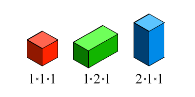

搭建高长宽分别为K × 2^N × 1的墙，不能翻转、旋转（其中，0<=N<=1024，1<=K<=4）

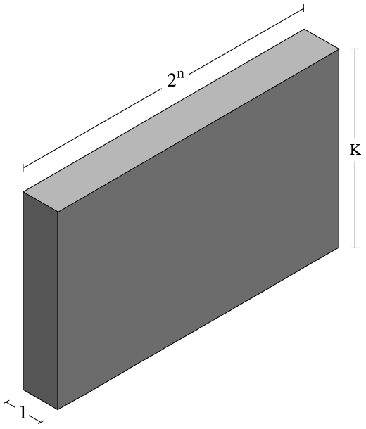

有多少种方案，输出结果

对1000000007取模。

举个例子如给定高度和长度：N=1 K=2，则答案是7，即有7种搭法，如下图所示：


__详解__：此题很有意思，涉及的知识点也比较多，包括动态规划，快速矩阵幂，状态压缩，排列组合等等都一一考察了个遍。而且跟一个比较经典的矩阵乘法问题类似：即用1 x 2的多米诺骨牌填满M x N的矩形有多少种方案，M<=5，N<2^31，输出答案mod p的结果

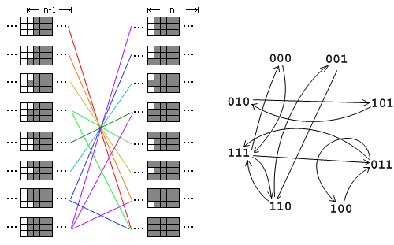

OK，回到正题。下文使用的图示说明(所有看到的都是横切面)：

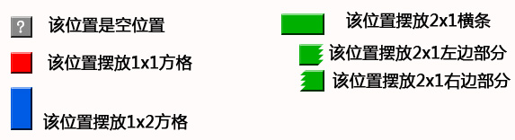

首先说明“？方块”的作用

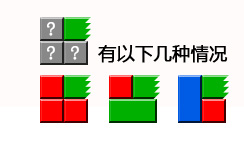

“？方块”，表示这个位置是空位置，可以任意摆放。

上图的意思就是，当右上角被绿色木块占用，此位置固定不变，其他位置任意摆放，在这种情况下的堆放方案数。

###解法一、穷举遍历

初看此题，你可能最先想到的思路便是穷举：用二维数组模拟墙，从左下角开始摆放，从左往右，从下往上，最后一个格子是右上角那个位置；每个格子把每种可以摆放木块都摆放一次，每堆满一次算一种用摆放方法。为了便于描述，为木块的每个格子进行编号：

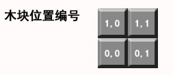

下面演示当n=1,k=2的算法过程（7种情况）：

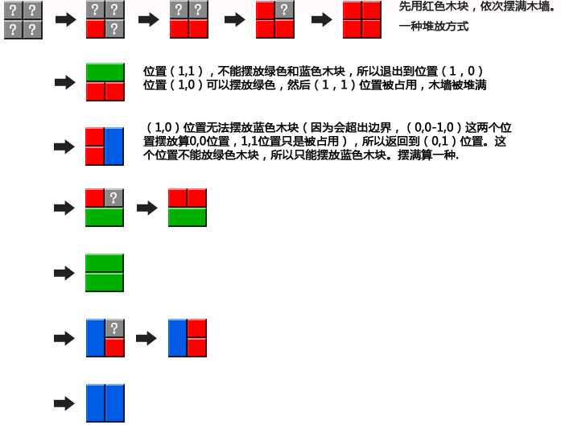

穷举遍历在数据规模比较小的情况下还撑得住，但在0<=N<=1024这样的数据规模下，此方法则立刻变得有心无力，因此我们得寻找更优化的解法。

###解法二、递归分解

递归求解就是把一个大问题，分解成小问题，逐个求解，然后再解决大问题。

####2.1、算法演示

假如有墙规模为(n,k)，如果从中间切开，被分为规模问(n-1,k)的两堵墙，那么被分开的墙和原墙有什么关系呢？我们首先来看一下几组演示。

#####2.1.1、n=1，k=2的情况

首先演示，__n=1,k=2__时的情况，如下图2-1：

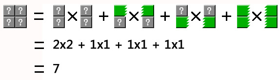

图 2-1

上图2-1中：

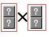
表示，左边墙的所有堆放方案数 * 右边墙所有堆放方案数 = 2 * 2 = 4


表示，当切开处有一个横条的时候，空位置存在的堆放方案数。左边*右边 = 1*1 = 2；剩余两组以此类推。

这个是排列组合的知识。

#####2.1.2、n=2，k=3的情况

其次，我们再来演示下面更具一般性的计算分解，即当__n=2,k=3__的情况，如下图2-2：

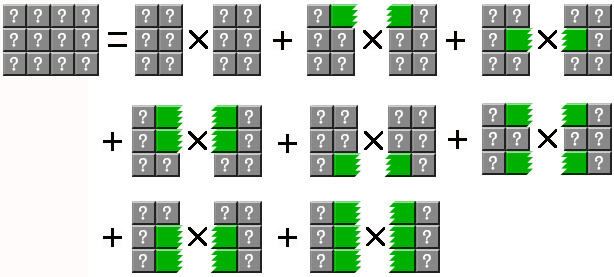

图 2-2

再从分解的结果中，挑选一组进行分解演示：

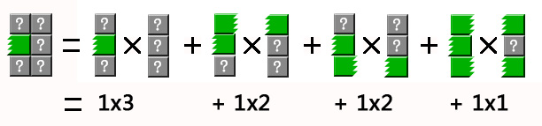

图 2-3

通过图2-2和图2-3的分解演示，可以说明，最终都是分解成一列求解。在逐级向上汇总。

#####2.1.3、n=4，k=3的情况

我们再假设一堵墙n=4，k=3，也就是说，宽度是16，高度是3时，会有以下分解：


图2-4

根据上面的分解的一个中间结果，再进行分解，如下：


图2-5

通过上面图2-1~图2-5的演示可以明确如下几点：

1.假设f(n)用于计算问题，那么f(n)依赖于f(n-1)的多种情况。

2.切开处有什么特殊的地方呢？通过上面的演示，我们得知被切开的两堵墙从没有互相嵌入的木块（绿色木块）到全是互相连接的木块，相当于切口绿色木块的全排列（即有绿色或者没有绿色的所有排列），即有2^k种状态（比如k=2，且有绿色用1表示，没有绿色用0表示，那么就有00、01、10、11这4种状态）。根据排列组合的性质，把每一种状态下左右木墙堆放方案数相乘，再把所有乘积求和，就得到木墙的堆放结果数。以此类推，将问题逐步往下分解即可。

3.此外，从图2-5中可以看出，除了需要考虑切口绿色木块的状态，还需要考虑最左边一列和最右边一列的绿色木块状态。我们把这两种边界状态称为左边界状态和右边界状态，分别用leftState和rightState表示。 

且在观察图2-5被切分后，所有左边的墙，他们的左边界ls状态始终保持不变，右边界rs状态从0~maxState, maxState = 2^k-1（有绿色方块表示1，没有表示0；ls表示左边界状态，rs表示右边界状态）：


图2-6

同样可以看出右边的墙的右边界状态保持不变，而左边界状态从0~maxState。要堆砌的木墙可以看做是左边界状态=0，和右边界状态=0的一堵墙。

有一点可能要特别说明下，即上文中说，有绿色方块的状态表示标为1，无绿色方块的状态表示标为0，特意又拿上图2-6标记了一些数字，以让绝大部分读者能看得一目了然，如下所示：

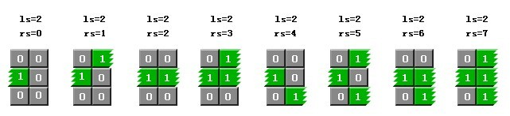

图2-7

这下，你应该很清楚的看到，在上图中，左边木块的状态表示一律为010，右边木块的状态表示则是000~111（即从下至上开始计数，右边木块rs的状态用二进制表示为：000 001 010 011 100 101 110 111，它们各自分别对应整数则是：0 1 2 3 4 5 6 7）。

####2.2、计算公式

通过图2-4、图2-5、图2-6的分解过程，我们可以总结出下面公式（leftState=最左边边界状态，rightState=最右边边界状态）：

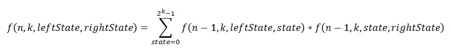

即：

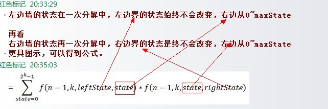

接下来，分3点解释下上述公式：

__1__、上述函数返回结果是当左边状态为=leftState，右边状态=rightState时木墙的堆砌方案数，相当于直接分解的左右状态都为0的情况，即直接分解f(n,k,0,0)即可。看到这，读者可能便有疑问了，既然直接分解f(n,k,0,0)即可，为何还要加leftstate和leftstate两个变量呢？回顾下2.1.3节中n=4，k=3的演示例子，即当n=4，k=3时，其分解过程即如下图（上文2.1.3节中的图2-4）

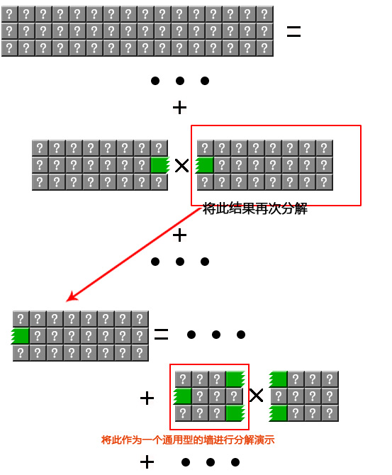

也就是说，刚开始直接分解f(4,3,0,0)，即n=4，k=3，leftstate=0，rightstate=0，但分解过程中leftstate和rightstate皆从0变化到了maxstate，故才让函数的第3和第4个参数采用leftstate和rightstate这两个变量的形式，公式也就理所当然的写成了f(n,k,leftstate,rightstate)。

__2__、然后我们再看下当n=4，k=3分解的一个中间结果，即给定如上图最下面部分中红色框框所框住的木块时：

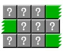

它用方程表示即为 f(2,3,2,5)，怎么得来的呢？其实还是又回到了上文2.1.3节中，当n=2，k=3 时（下图即为上文2.1.3节中的图2-5和图2-6）

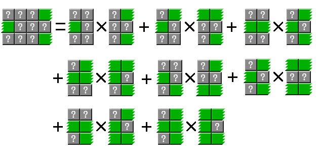

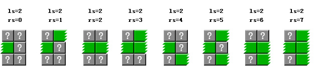

左边界ls状态始终保持不变时，右边界rs状态从0~maxState；右边界状态保持不变时，而左边界状态从0~maxState。

故上述分解过程用方程式可表示为：

__f(2,3,2,5)  = f(1,3,2,0) * f(1,3,0,5)__

__+ f(1,3,2,1) * f(1,3,1,5)__

__+ f(1,3,2,2) * f(1,3,2,5)__

__+ f(1,3,2,3) * f(1,3,3,5)__

__+ f(1,3,2,4) * f(1,3,4,5)__

__+ f(1,3,2,5) * f(1,3,5,5)__

__+ f(1,3,2,6) * f(1,3,6,5)__

__+ f(1,3,2,7) * f(1,3,7,5)__

说白了，我们曾在2.1节中从图2-2到图2-6正推推导出了公式，然上述过程中，则又再倒推推了一遍公式进行了说明。

__3__、最后，作者是怎么想到引入 leftstate 和rightstate 这两个变量的呢？如红色标记所说："因为切开后，发现绿色条，在分开处不断的变化，当时也进入了死胡同，我就在想，蓝色的怎么办。后来才想明白，与蓝色无关。每一种变化就是一种状态，所以就想到了引入leftstate 和rightstate这两个变量。"

####2.3、参考代码

下面代码就是根据上面函数原理编写的。最终执行效率，n=1024,k=4 时，用时0.2800160秒（之前代码用的是字典作为缓存，用时在1.3秒左右，后来改为数组结果，性能大增）。""

```cs
//copyright@红色标记 12/8/2013    
//updated@July 13/8/2013  
using System;    
using System.Collections.Generic;    
using System.Text;    
using System.Collections;    
  
namespace HeapBlock    
{    
    public class WoolWall    
    {            
        private int n;    
        private int height;    
        private int maxState;    
        private int[, ,] resultCache;   //结果缓存数组    
  
        public WoolWall(int n, int height)    
        {    
            this.n = n;    
            this.height = height;    
            maxState = (1 << height) - 1;    
            resultCache = new int[n + 1, maxState + 1, maxState + 1];   //构建缓存数组，每个值默认为0；    
        }    
  
        /// <summary>    
        /// 静态入口。计算堆放方案数。    
        /// </summary>    
        /// <param name="n"></param>    
        /// <param name="k"></param>    
        /// <returns></returns>    
        public static int Heap(int n, int k)    
        {    
            return new WoolWall(n, k).Heap();    
        }    
  
        /// <summary>    
        /// 计算堆放方案数。    
        /// </summary>    
        /// <returns></returns>    
        public int Heap()    
        {    
            return (int)Heap(n, 0, 0);    
        }    
  
        private long Heap(int n, int lState, int rState)    
        {    
            //如果缓存数组中的值不为0，则表示该结果已经存在缓存中。    
            //直接返回缓存结果。    
            if (resultCache[n, lState, rState] != 0)    
            {    
                return resultCache[n, lState, rState];    
            }    
  
            //在只有一列的情况，无法再进行切分    
            //根据列状态计算一列的堆放方案    
            if (n == 0)    
            {    
                return CalcOneColumnHeapCount(lState);    
            }    
  
            long result = 0;    
            for (int state = 0; state <= maxState; state++)    
            {    
                if (n == 1)    
                {    
                    //在只有两列的情况，判断当前状态在切分之后是否有效    
                    if (!StateIsAvailable(n, lState, rState, state))    
                    {    
                        continue;    
                    }    
                    result += Heap(n - 1, state | lState, state | lState)  //合并状态。因为只有一列，所以lState和rState相同。    
                        * Heap(n - 1, state | rState, state | rState);    
                }    
                else    
                {    
                    result += Heap(n - 1, lState, state) * Heap(n - 1, state, rState);     
                }    
                result %= 1000000007;//为了防止结果溢出，根据题目要求求模。    
            }    
  
            resultCache[n, lState, rState] = (int)result;   //将结果写入缓存数组中    
            resultCache[n, rState, lState] = (int)result;   //对称的墙结果相同，所以直接写入缓存。    
            return result;    
        }    
  
        /// <summary>    
        /// 根据一列的状态，计算列的堆放方案数。    
        /// </summary>    
        /// <param name="state">状态</param>    
        /// <returns></returns>    
        private int CalcOneColumnHeapCount(int state)    
        {    
            int sn = 0; //连续计数    
            int result = 1;    
            for (int i = 0; i < height; i++)    
            {    
                if ((state & 1) == 0)    
                {    
                    sn++;    
                }    
                else    
                {    
                    if (sn > 0)    
                    {    
                        result *= CalcAllState(sn);    
                    }    
                    sn = 0;    
                }    
                state >>= 1;    
            }    
            if (sn > 0)    
            {    
                result *= CalcAllState(sn);    
            }    
  
            return result;    
        }    
  
        /// <summary>    
        /// 类似于斐波那契序列。    
        /// f(1)=1    
        /// f(2)=2    
        /// f(n) = f(n-1)*f(n-2);    
        /// 只是初始值不同。    
        /// </summary>    
        /// <param name="k"></param>    
        /// <returns></returns>    
        private static int CalcAllState(int k)    
        {    
            return k <= 2 ? k : CalcAllState(k - 1) + CalcAllState(k - 2);    
        }    
  
        /// <summary>    
        /// 判断状态是否可用。    
        /// 当n=1时，分割之后，左墙和右边墙只有一列。    
        /// 所以state的状态码可能会覆盖原来的边缘状态。    
        /// 如果有覆盖，则该状态不可用；没有覆盖则可用。    
        /// 当n>1时，不存在这种情况，都返回状态可用。    
        /// </summary>    
        /// <param name="n"></param>    
        /// <param name="lState">左边界状态</param>    
        /// <param name="rState">右边界状态</param>    
        /// <param name="state">切开位置的当前状态</param>    
        /// <returns>状态有效返回 true,状态不可用返回 false</returns>    
        private bool StateIsAvailable(int n, int lState, int rState, int state)    
        {    
            return (n > 1) || ((lState | state) == lState + state && (rState | state) == rState + state);    
        }    
    }    
}    
```

上述程序中，

* WoolWall.Heap(1024,4); //直接通过静态方法获得结果

* new  WoolWall(n, k).Heap();//通过构造对象获得结果

#####2.3.1、核心算法讲解

因为它最终都是分解成一列的情况进行处理，这就会导致很慢。为了提高速度，本文使用了缓存机制来提高性能。缓存原理就是，n,k,leftState,rightState相同的墙，返回的结果肯定相同。利用这个特性，每计算一种结果就放入到缓存中，如果下次计算直接从缓存取出。刚开始缓存用字典类实现，有网友给出了更好的缓存方法——数组。这样性能好了很多，也更加简单。程序结构如下图所示：

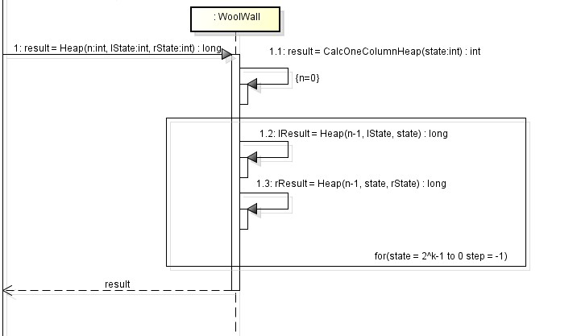

上图反应了Heap调用的主要方法调用，在循环中，result 累加 lResult 和 rResult。

①在实际代码中，首先是从缓存中读取结果，如果没有从缓存中读取结果再进行计算。 

分解到一列时，不再分解，直接计算结果

```cs
if (n == 0)  
{  
     return CalcOneColumnHeap(lState);  
} 
```

②下面是整个程序的核心代码，通过for循环，求和state=0到state=2^k-1的两边木墙乘积：

```cs
for (int state = 0; state <= maxState; state++)  
{  
    if (n == 1)  
    {  
        if (!StateIsAvailable(n, lState, rState, state))  
        {  
            continue;  
        }  
        result += Heap(n - 1, state | lState, state | lState) *  
            Heap(n - 1, state | rState, state | rState);  
    }  
    else  
    {  
        result += Heap(n - 1, lState, state)  
            * Heap(n - 1, state, rState);  
    }  
    result %= 1000000007;  
}  
```

当n=1切分时，需要特殊考虑。如下图：

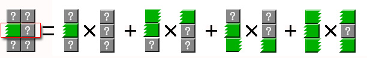

图2-8

看上图中，因为左边墙中间被绿色方块占用，所以在（1,0）-（1,1）这个位置（位置的标记方法同解法一）不能再放绿色方块。所以一些状态需要排除，如state=2需要排除。同时在还需要合并状态，如state=1时，左边墙的状态=3。

特别说明下：依据我们上文2.2节中的公式，如果第i行有这种木块，state对应2^(i-1)，加上所有行的贡献就得到state（0就是没有这种横跨木块，2^k-1就是所有行都是横跨木块），然后遍历state，还记得上文中的图2-7么？


当第i行被这样的木块或这样的木块占据时，其各自对应的state值分别为：

1.当第1行被占据，state=1；

2.当第2行被占据，state=2；

3.当第1和第2行都被占据，state=3；

4.当第3行被占据，state=4；

5.当第1和第3行被占据，state=5；

6.当第2和第3行被占据，state=6；

7.当第1、2、3行全部都被占据，state=7。

至于原因，即如2.1.3节节末所说：二进制表示为：000 001 010 011 100 101 110 111，它们各自分别对应整数则是：0 1 2 3 4 5 6 7。

具体来说，下面图中所有框出来的位置，不能有绿色的：

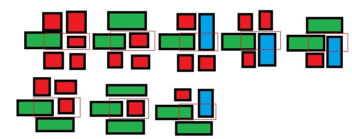

③CalcOneColumnHeap(int state)函数用于计算一列时摆放方案数。

计算方法是， 求和被绿色木块分割开的每一段连续方格的摆放方案数。每一段连续的方格的摆放方案通过CalcAllState方法求得。经过分析，可以得知CalcAllState是类似斐波那契序列的函数。

举个例子如下（分步骤讲述）：

1.令state = 4546（state=2^k-1，k最大为4，故本题中state最大在15，而这里取state=4546只是为了演示如何计算），二进制是：1000111000010。位置上为1，表示被绿色木块占用，0表示空着，可以自由摆放。

2.1000111000010  被分割后 1  000  111  0000  1  0, 那么就有 000=3个连续位置， 0000=4个连续位置 ， 0=1个连续位置。

3.堆放结果=CalcAllState(3) + CalcAllState(4) + CalcAllState(1) = 3 + 5 + 1 = 9。

####2.4、再次优化

上面程序因为调用性能的树形结构，形成了大量的函数调用和缓存查找，所以其性能不是很高。 为了得到更高的性能，可以让所有的运算直接依赖于上一次运算的结果，以防止更多的调用。即如果每次运算都算出所有边界状态的结果，那么就能为下一次运算提供足够的信息。后续优化请[查阅此文第3节](http://blog.csdn.net/dw14132124/article/details/9038417#t2)。


###解法三、动态规划

相信读到上文，不少读者都已经意识到这个问题其实就是一个动态规划问题，接下来咱们换一个角度来分析此问题。

####3.1、暴力搜索不可行

首先，因为木块的宽度都是1，我们可以想成2维的问题。也就是说三种木板的规格分别为1* 1, 1 * 2, 2 * 1。

通过上文的解法一，我们已经知道这个问题最直接的想法就是暴力搜索，即对每个空格尝试放置哪种木板。但是看看数据规模就知道，这种思路是不可行的。因为有一条边范围长度高达2^1024，普通的电脑，2^30左右就到极限了。于是我们得想想别的方法。

####3.2、另辟蹊径

为了方便，我们把墙看做有2^n行，k列的矩形。这是因为虽然矩形木块不能翻转，但是我们同时拥有1*2和2*1的两种木块。

假设我们从上到下，从左到右考虑每个1*1的格子是如何被覆盖的。显然，我们每个格子都要被覆盖住。木块的特点决定了我们覆盖一个格子最多只会影响到下一行的格子。这就可以让我们暂时只考虑两行。

假设现我们已经完全覆盖了前(i–1)行。那么由于覆盖前(i-1)行导致第i行也不“完整”了。如下图：

xxxxxxxxx

ooxooxoxo

我们用x表示已经覆盖的格子，o表示没覆盖的格子。为了方便，我们使用9列。

我们考虑第i行的状态，上图中，第1列我们可以用1*1的覆盖掉，也可以用1*2的覆盖前两列。第4、5列的覆盖方式和第1、2列是同样的情况。第7列需要覆盖也有两种方式，即用1*1的覆盖或者用2*1的覆盖，但是这样会导致第（i+1)行第7列也被覆盖。第9列和第7列的情况是一样的。这样把第i行覆盖满了之后，我们再根据第(i+1)行被影响的状态对下一行进行覆盖。

那么每行有多少种状态呢？显然有2^k，由于k很小，我们只有大约16种状态。如果我们对于这些状态之间的转换制作一个矩阵，矩阵的第i行第j列的数表示的是我们第m行是状态i，我们把它完整覆盖掉，并且使得第(m + 1)行变成状态j的可能的方法数，这个矩阵我们可以暴力搜索出来，搜索的方式就是枚举第m行的状态，然后尝试放木板，用所有的方法把第m行覆盖掉之后，下一行的状态。当然，我们也可以认为只有两行，并且第一行是2k种状态的一种，第二行起初是空白的，求使得第一行完全覆盖掉，第二行的状态有多少种类型以及每种出现多少次。

####3.3、动态规划

这个矩阵作用很大，其实我们覆盖的过程可以认为是这样：第一行是空的，我们看看把它覆盖了，第2行是什么样子的。根据第二行的状态，我们把它覆盖掉，看看第3行是什么样子的。

如果我们知道第i行的状态为s,怎么考虑第i行完全覆盖后，第(i+1)行的状态？那只要看那个矩阵的状态s对应的行就可以了。我们可以考虑一下，把两个这样的方阵相乘得到得结果是什么。这个方阵的第i行第j个元素是这样得到的，是第i行第k个元素与第k行第j个元素的对k的叠加。它的意义是上一行是第m行是状态i，把第m行和第(m+1)行同时覆盖住，第(m+2)行的状态是j的方法数。这是因为中间第(m+1)行的所有状态k，我们已经完全遍历了。

于是我们发现，每做一次方阵的乘法，我们相当于把状态推动了一行。那么我们要坐多少次方阵乘法呢？就是题目中墙的长度2<sup>n</sup>,这个数太大了。但是事实上，我们可以不断地平方n次。也就是说我们可以算出A<sup>2</sup>,A<sup>4</sup>, A<sup>8</sup>, A<sup>16</sup>……方法就是不断用结果和自己相乘，这样乘n次就可以了。

因此，我们最关键的问题就是建立矩阵A。我们可以这样表示一行的状态，从左到右分别叫做第0列，第1列……覆盖了我们认为是1，没覆盖我们认为是0，这样一行的状态可以表示为一个整数。某一列的状态我们可以用位运算来表示。例如，状态x第i列是否被覆盖，我们只需要判断x & (1 << i) 是否非0即可，或者判断(x >> i) & 1， 用右移位的目的是防止溢出，但是本题不需要考虑溢出，因为k很小。 接下来的任务就是递归尝试放置方案了

####3.4、参考代码

最终结果，我们最初的行是空得，要求最后一行之后也不能被覆盖，所以最终结果是矩阵的第[0][0]位置的元素。另外，本题在乘法过程中会超出32位int的表示范围，需要临时用C/C++的long long，或者java的long。

参考代码如下：

```c
//copyright@caopengcs 12/08/2013  
#ifdef WIN32  
#define ll __int64   
#else  
#define ll long long  
#endif  
  
// 1 covered 0 uncovered  
  
void cal(int a[6][32][32],int n,int col,int laststate,int nowstate)
{
    if (col >= n)
    {
        ++a[n][laststate][nowstate];  
        return;  
    }  
    //不填 或者用1*1的填  
    cal(a,n, col + 1, laststate, nowstate);  
    if (((laststate >> col) & 1) == 0)
    {
        cal(a,n, col + 1, laststate, nowstate | (1 << col));  
        if ((col + 1 < n) && (((laststate >> (col + 1)) & 1) == 0))
        {
            cal(a,n, col + 2, laststate, nowstate);  
        }  
    }  
}  
  
inline int mul(ll x, ll y)
{
    return x * y % 1000000007;  
}  
  
void multiply(int n,int a[][32],int b[][32])
{ // b = a * a
    int i,j, k;  
    for (i = 0; i < n; ++i)
    {
        for (j = 0; j < n; ++j)
        {
            for (k = b[i][j] = 0; k < n; ++k)
            {
                if ((b[i][j] += mul(a[i][k],a[k][j])) >= 1000000007)
                {
                    b[i][j] -= 1000000007;
                }  
            }  
        }  
    }  
}  
  
int calculate(int n,int k)
{
    int i, j;  
    int a[6][32][32],mat[2][32][32];  
    memset(a,0,sizeof(a));  
    for (i = 1; i <= 5; ++i)
    {
        for (j = (1 << i) - 1; j >= 0; --j)
        {
            cal(a,i, 0, j, 0);  
        }  
    }  
    memcpy(mat[0], a[k],sizeof(mat[0]));  
    k = (1 << k);  
    for (i = 0; n; --n)
    {
        multiply(k, mat[i], mat[i ^ 1]);  
        i ^= 1;  
    }  
    return mat[i][0][0];  
}  
```

##参考链接及推荐阅读
1. caopengcs，[木块砌墙](http://blog.csdn.net/caopengcs/article/details/9928061)
2. 红色标记，[木块砌墙](http://blog.csdn.net/dw14132124/article/details/9038417)
3. LoveHarvy，[木块砌墙](http://blog.csdn.net/wangyan_boy/article/details/9131501)
4. [在线编译测试木块砌墙问题](http://hero.pongo.cn/Question/Details?ID=36&ExamID=36)
5. hero上[木块砌墙一题](http://hero.pongo.cn/Question/Details?ExamID=36&ID=36&bsh_bid=273040296)
